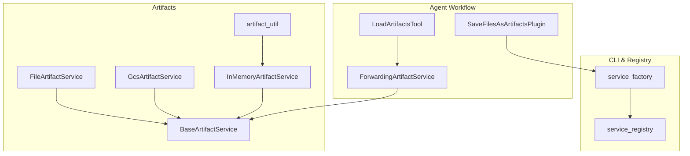
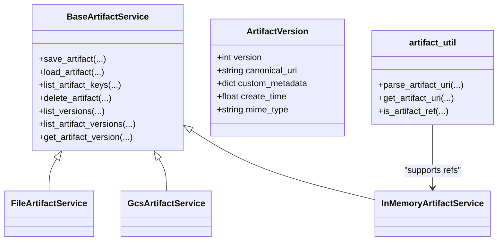
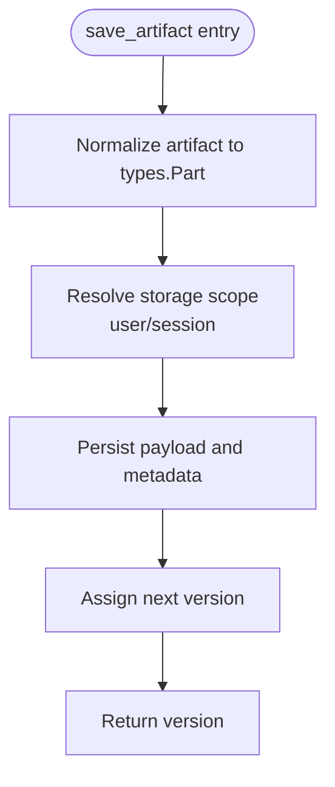
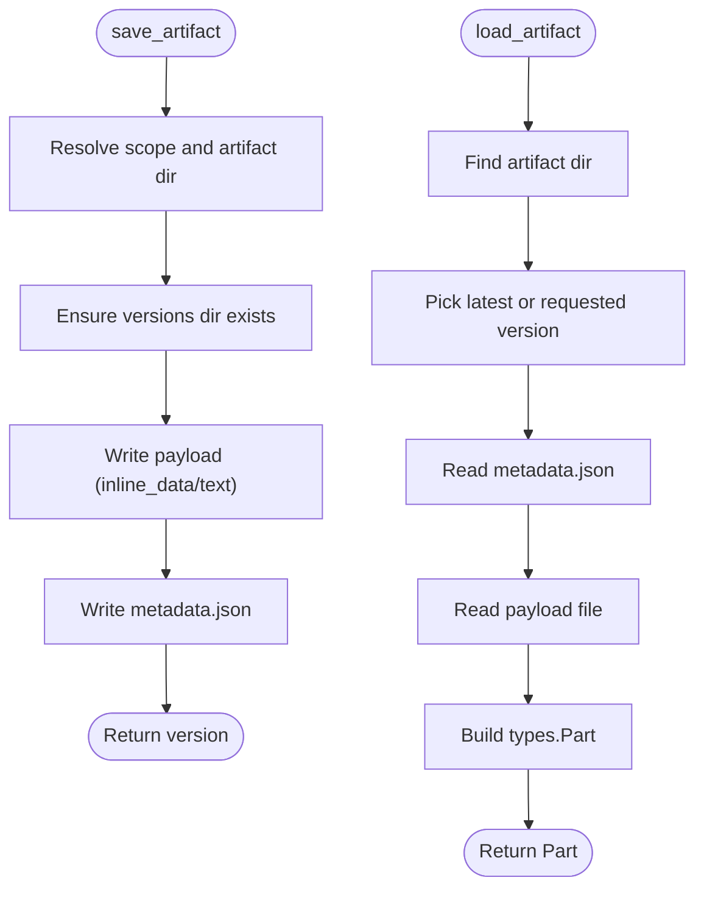
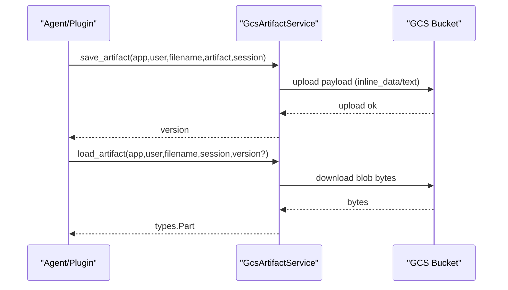
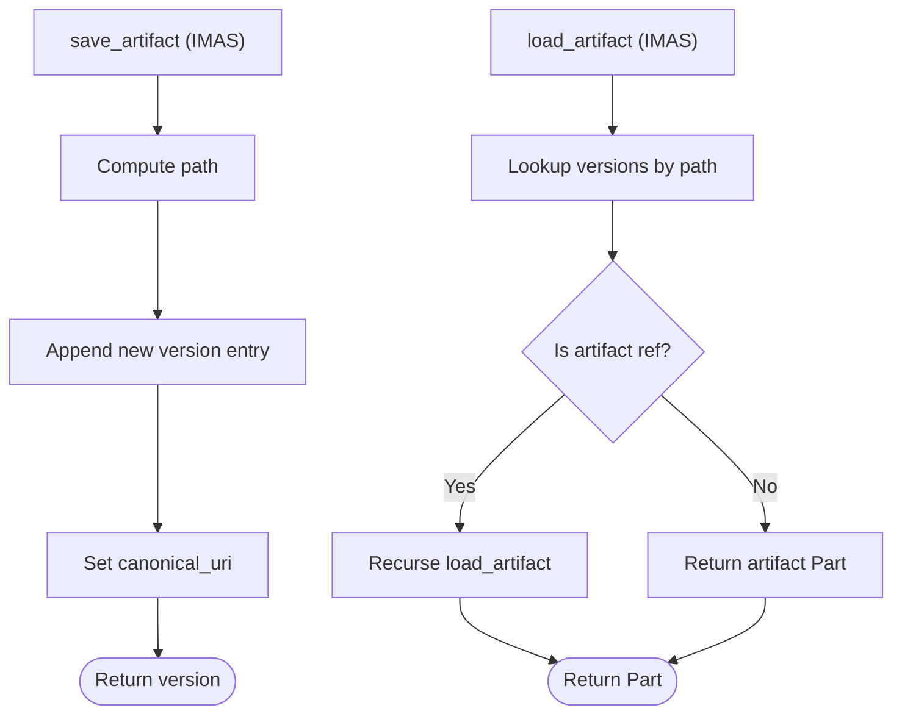
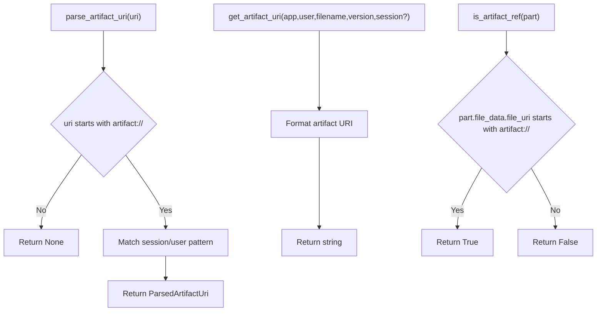
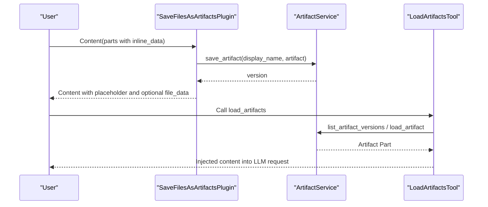
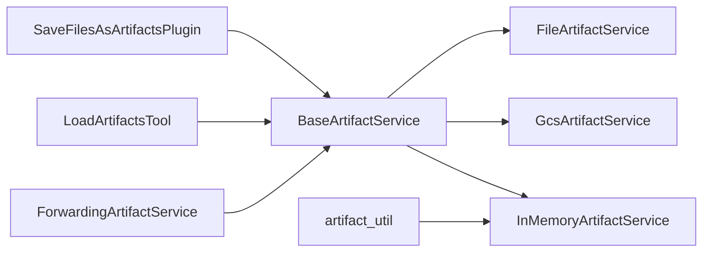

# Artifact Management

<cite>
**Referenced Files in This Document**
- [__init__.py](file://src/google/adk/artifacts/__init__.py)
- [base_artifact_service.py](file://src/google/adk/artifacts/base_artifact_service.py)
- [file_artifact_service.py](file://src/google/adk/artifacts/file_artifact_service.py)
- [gcs_artifact_service.py](file://src/google/adk/artifacts/gcs_artifact_service.py)
- [in_memory_artifact_service.py](file://src/google/adk/artifacts/in_memory_artifact_service.py)
- [artifact_util.py](file://src/google/adk/artifacts/artifact_util.py)
- [_forwarding_artifact_service.py](file://src/google/adk/tools/_forwarding_artifact_service.py)
- [load_artifacts_tool.py](file://src/google/adk/tools/load_artifacts_tool.py)
- [save_files_as_artifacts_plugin.py](file://src/google/adk/plugins/save_files_as_artifacts_plugin.py)
- [service_factory.py](file://src/google/adk/cli/utils/service_factory.py)
- [service_registry.py](file://src/google/adk/cli/service_registry.py)
- [agent.py](file://contributing/samples/artifact_save_text/agent.py)
- [agent.py](file://contributing/samples/context_offloading_with_artifact/agent.py)
- [test_artifact_service.py](file://tests/unittests/artifacts/test_artifact_service.py)
- [test_save_files_as_artifacts.py](file://tests/unittests/plugins/test_save_files_as_artifacts.py)
- [test_service_factory.py](file://tests/unittests/cli/utils/test_service_factory.py)
</cite>

## Table of Contents
1. [Introduction](#introduction)
2. [Project Structure](#project-structure)
3. [Core Components](#core-components)
4. [Architecture Overview](#architecture-overview)
5. [Detailed Component Analysis](#detailed-component-analysis)
6. [Dependency Analysis](#dependency-analysis)
7. [Performance Considerations](#performance-considerations)
8. [Troubleshooting Guide](#troubleshooting-guide)
9. [Conclusion](#conclusion)
10. [Appendices](#appendices)

## Introduction
This document explains artifact management in ADK, focusing on the artifact service architecture and its implementations. It covers storage patterns, versioning, retrieval, and integration with agent workflows for data persistence and sharing. It also documents artifact metadata management, access control, lifecycle policies, performance optimization, backup and disaster recovery considerations, and best practices for artifact organization and naming conventions.

## Project Structure
The artifact subsystem is organized around a shared interface and multiple implementations:
- A base abstract service defines the contract for saving, loading, listing, deleting, and versioning artifacts.
- Three implementations provide concrete storage backends: file-based, Google Cloud Storage (GCS), and in-memory.
- Utilities support artifact URI parsing and building, enabling cross-artifact references.
- Tools and plugins integrate artifacts into agent workflows for persistence and retrieval.
- CLI utilities and registry enable creation and selection of artifact services from URIs or defaults.

**Diagram sources**
- [base_artifact_service.py](file://src/google/adk/artifacts/base_artifact_service.py#L88-L262)
- [file_artifact_service.py](file://src/google/adk/artifacts/file_artifact_service.py#L189-L726)
- [gcs_artifact_service.py](file://src/google/adk/artifacts/gcs_artifact_service.py#L43-L466)
- [in_memory_artifact_service.py](file://src/google/adk/artifacts/in_memory_artifact_service.py#L49-L282)
- [artifact_util.py](file://src/google/adk/artifacts/artifact_util.py#L25-L117)
- [save_files_as_artifacts_plugin.py](file://src/google/adk/plugins/save_files_as_artifacts_plugin.py#L35-L188)
- [load_artifacts_tool.py](file://src/google/adk/tools/load_artifacts_tool.py#L124-L256)
- [_forwarding_artifact_service.py](file://src/google/adk/tools/_forwarding_artifact_service.py#L31-L135)
- [service_factory.py](file://src/google/adk/cli/utils/service_factory.py#L272-L310)
- [service_registry.py](file://src/google/adk/cli/service_registry.py#L287-L301)

**Section sources**
- [__init__.py](file://src/google/adk/artifacts/__init__.py#L15-L25)
- [base_artifact_service.py](file://src/google/adk/artifacts/base_artifact_service.py#L88-L262)
- [file_artifact_service.py](file://src/google/adk/artifacts/file_artifact_service.py#L189-L726)
- [gcs_artifact_service.py](file://src/google/adk/artifacts/gcs_artifact_service.py#L43-L466)
- [in_memory_artifact_service.py](file://src/google/adk/artifacts/in_memory_artifact_service.py#L49-L282)
- [artifact_util.py](file://src/google/adk/artifacts/artifact_util.py#L25-L117)
- [save_files_as_artifacts_plugin.py](file://src/google/adk/plugins/save_files_as_artifacts_plugin.py#L35-L188)
- [load_artifacts_tool.py](file://src/google/adk/tools/load_artifacts_tool.py#L124-L256)
- [_forwarding_artifact_service.py](file://src/google/adk/tools/_forwarding_artifact_service.py#L31-L135)
- [service_factory.py](file://src/google/adk/cli/utils/service_factory.py#L272-L310)
- [service_registry.py](file://src/google/adk/cli/service_registry.py#L287-L301)

## Core Components
- BaseArtifactService: Defines the artifact API including save_artifact, load_artifact, list_artifact_keys, delete_artifact, list_versions, list_artifact_versions, and get_artifact_version. It also defines ArtifactVersion for version metadata.
- FileArtifactService: Stores artifacts on the local filesystem with a nested directory layout and per-version metadata files.
- GcsArtifactService: Stores artifacts in Google Cloud Storage with versioned blob names and optional custom metadata.
- InMemoryArtifactService: Stores artifacts in memory with simple path-based indexing and supports artifact references across scopes.
- artifact_util: Provides URI parsing and construction helpers for artifact references and canonical URIs.
- SaveFilesAsArtifactsPlugin: Integrates artifact saving into agent workflows by intercepting user messages with embedded files.
- LoadArtifactsTool: Allows agents to load artifacts into the LLM request context safely, handling MIME type compatibility and content conversion.
- ForwardingArtifactService: Bridges tool contexts to the underlying artifact service for tool-level operations.
- CLI service factory and registry: Enable constructing artifact services from URIs (file://, gs://, memory://) or defaults.

**Section sources**
- [base_artifact_service.py](file://src/google/adk/artifacts/base_artifact_service.py#L34-L262)
- [file_artifact_service.py](file://src/google/adk/artifacts/file_artifact_service.py#L189-L726)
- [gcs_artifact_service.py](file://src/google/adk/artifacts/gcs_artifact_service.py#L43-L466)
- [in_memory_artifact_service.py](file://src/google/adk/artifacts/in_memory_artifact_service.py#L49-L282)
- [artifact_util.py](file://src/google/adk/artifacts/artifact_util.py#L25-L117)
- [save_files_as_artifacts_plugin.py](file://src/google/adk/plugins/save_files_as_artifacts_plugin.py#L35-L188)
- [load_artifacts_tool.py](file://src/google/adk/tools/load_artifacts_tool.py#L124-L256)
- [_forwarding_artifact_service.py](file://src/google/adk/tools/_forwarding_artifact_service.py#L31-L135)
- [service_factory.py](file://src/google/adk/cli/utils/service_factory.py#L272-L310)
- [service_registry.py](file://src/google/adk/cli/service_registry.py#L287-L301)

## Architecture Overview
The artifact subsystem is designed around a unified interface and pluggable storage backends. Agents and plugins interact with the artifact service through a consistent API. The CLI and registry provide runtime selection of storage backends.

**Diagram sources**
- [base_artifact_service.py](file://src/google/adk/artifacts/base_artifact_service.py#L34-L262)
- [file_artifact_service.py](file://src/google/adk/artifacts/file_artifact_service.py#L189-L726)
- [gcs_artifact_service.py](file://src/google/adk/artifacts/gcs_artifact_service.py#L43-L466)
- [in_memory_artifact_service.py](file://src/google/adk/artifacts/in_memory_artifact_service.py#L49-L282)
- [artifact_util.py](file://src/google/adk/artifacts/artifact_util.py#L25-L117)

## Detailed Component Analysis

### Base Artifact Service and Version Model
- ArtifactVersion encapsulates version metadata including version number, canonical URI, custom metadata, creation time, and MIME type.
- BaseArtifactService defines asynchronous methods for artifact lifecycle operations and version enumeration.

**Diagram sources**
- [base_artifact_service.py](file://src/google/adk/artifacts/base_artifact_service.py#L68-L86)
- [base_artifact_service.py](file://src/google/adk/artifacts/base_artifact_service.py#L88-L124)

**Section sources**
- [base_artifact_service.py](file://src/google/adk/artifacts/base_artifact_service.py#L34-L86)
- [base_artifact_service.py](file://src/google/adk/artifacts/base_artifact_service.py#L88-L262)

### File-Based Artifact Service
- Storage layout organizes artifacts under a root directory with separate user and session namespaces, and per-version directories with metadata files.
- Supports nested filenames and enforces path safety to prevent escaping the storage root.
- Provides synchronous helpers for saving, loading, listing, and deletion, executed asynchronously via threads.

**Diagram sources**
- [file_artifact_service.py](file://src/google/adk/artifacts/file_artifact_service.py#L313-L403)
- [file_artifact_service.py](file://src/google/adk/artifacts/file_artifact_service.py#L406-L474)

**Section sources**
- [file_artifact_service.py](file://src/google/adk/artifacts/file_artifact_service.py#L189-L726)

### Google Cloud Storage Artifact Service
- Uses GCS blob naming with app/user/session or user-scoped prefixes and per-version blobs.
- Supports inline_data and text payloads; file_data is not currently supported for saving.
- Lists versions by scanning blobs under the constructed prefix and builds ArtifactVersion from blob metadata.

**Diagram sources**
- [gcs_artifact_service.py](file://src/google/adk/artifacts/gcs_artifact_service.py#L60-L242)
- [gcs_artifact_service.py](file://src/google/adk/artifacts/gcs_artifact_service.py#L244-L274)

**Section sources**
- [gcs_artifact_service.py](file://src/google/adk/artifacts/gcs_artifact_service.py#L43-L466)

### In-Memory Artifact Service
- Stores artifacts in memory keyed by a path derived from app, user, session, and filename.
- Supports artifact references via artifact:// URIs, enabling cross-session and cross-user access.
- Provides version enumeration and metadata retrieval directly from in-memory entries.

**Diagram sources**
- [in_memory_artifact_service.py](file://src/google/adk/artifacts/in_memory_artifact_service.py#L98-L145)
- [in_memory_artifact_service.py](file://src/google/adk/artifacts/in_memory_artifact_service.py#L148-L197)
- [artifact_util.py](file://src/google/adk/artifacts/artifact_util.py#L103-L117)

**Section sources**
- [in_memory_artifact_service.py](file://src/google/adk/artifacts/in_memory_artifact_service.py#L49-L282)
- [artifact_util.py](file://src/google/adk/artifacts/artifact_util.py#L25-L117)

### Artifact Utilities
- Parse and construct artifact URIs for both session-scoped and user-scoped artifacts.
- Detect artifact references and validate URI schemes for model accessibility.

**Diagram sources**
- [artifact_util.py](file://src/google/adk/artifacts/artifact_util.py#L43-L75)
- [artifact_util.py](file://src/google/adk/artifacts/artifact_util.py#L78-L100)
- [artifact_util.py](file://src/google/adk/artifacts/artifact_util.py#L103-L117)

**Section sources**
- [artifact_util.py](file://src/google/adk/artifacts/artifact_util.py#L25-L117)

### Agent Workflow Integration
- SaveFilesAsArtifactsPlugin intercepts user messages with embedded files, saves them as artifacts, and optionally attaches a file reference part if the canonical URI is model-accessible.
- LoadArtifactsTool injects artifact content into the LLM request context, normalizes unsupported MIME types, and respects user: scoping for cross-session access.

**Diagram sources**
- [save_files_as_artifacts_plugin.py](file://src/google/adk/plugins/save_files_as_artifacts_plugin.py#L58-L132)
- [save_files_as_artifacts_plugin.py](file://src/google/adk/plugins/save_files_as_artifacts_plugin.py#L134-L175)
- [load_artifacts_tool.py](file://src/google/adk/tools/load_artifacts_tool.py#L180-L252)

**Section sources**
- [save_files_as_artifacts_plugin.py](file://src/google/adk/plugins/save_files_as_artifacts_plugin.py#L35-L188)
- [load_artifacts_tool.py](file://src/google/adk/tools/load_artifacts_tool.py#L124-L256)

### Forwarding Artifact Service
- Used by tools to forward artifact operations to the parent ToolContext, which delegates to the configured artifact service.

**Section sources**
- [_forwarding_artifact_service.py](file://src/google/adk/tools/_forwarding_artifact_service.py#L31-L135)

### CLI and Registry Integration
- service_factory creates artifact services from URIs or defaults, supporting fallback to in-memory when local storage is unavailable.
- service_registry registers artifact service schemes (memory, gs, file) and constructs appropriate implementations.

**Section sources**
- [service_factory.py](file://src/google/adk/cli/utils/service_factory.py#L272-L310)
- [service_registry.py](file://src/google/adk/cli/service_registry.py#L287-L301)

## Dependency Analysis
- Cohesion: Each implementation encapsulates storage-specific logic and adheres to the BaseArtifactService interface.
- Coupling: Plugins and tools depend on the interface, minimizing coupling to specific implementations.
- External Dependencies: GCS implementation depends on the Google Cloud Storage client; file implementation depends on filesystem APIs; in-memory implementation uses Python data structures.

**Diagram sources**
- [save_files_as_artifacts_plugin.py](file://src/google/adk/plugins/save_files_as_artifacts_plugin.py#L35-L188)
- [load_artifacts_tool.py](file://src/google/adk/tools/load_artifacts_tool.py#L124-L256)
- [_forwarding_artifact_service.py](file://src/google/adk/tools/_forwarding_artifact_service.py#L31-L135)
- [base_artifact_service.py](file://src/google/adk/artifacts/base_artifact_service.py#L88-L262)
- [file_artifact_service.py](file://src/google/adk/artifacts/file_artifact_service.py#L189-L726)
- [gcs_artifact_service.py](file://src/google/adk/artifacts/gcs_artifact_service.py#L43-L466)
- [in_memory_artifact_service.py](file://src/google/adk/artifacts/in_memory_artifact_service.py#L49-L282)
- [artifact_util.py](file://src/google/adk/artifacts/artifact_util.py#L25-L117)

**Section sources**
- [base_artifact_service.py](file://src/google/adk/artifacts/base_artifact_service.py#L88-L262)
- [file_artifact_service.py](file://src/google/adk/artifacts/file_artifact_service.py#L189-L726)
- [gcs_artifact_service.py](file://src/google/adk/artifacts/gcs_artifact_service.py#L43-L466)
- [in_memory_artifact_service.py](file://src/google/adk/artifacts/in_memory_artifact_service.py#L49-L282)
- [artifact_util.py](file://src/google/adk/artifacts/artifact_util.py#L25-L117)
- [save_files_as_artifacts_plugin.py](file://src/google/adk/plugins/save_files_as_artifacts_plugin.py#L35-L188)
- [load_artifacts_tool.py](file://src/google/adk/tools/load_artifacts_tool.py#L124-L256)
- [_forwarding_artifact_service.py](file://src/google/adk/tools/_forwarding_artifact_service.py#L31-L135)

## Performance Considerations
- File-based storage
  - Use asynchronous I/O wrappers to avoid blocking; the implementation already executes sync helpers in threads.
  - Minimize directory depth and use concise filenames to reduce filesystem overhead.
  - Consider preallocating version directories and batching writes for bulk operations.
- GCS-based storage
  - Prefer inline_data/text payloads to avoid multipart uploads; large binary payloads increase latency and cost.
  - Batch version listings and metadata reads where possible; cache frequently accessed metadata.
  - Use appropriate IAM roles and service accounts to minimize latency from credential refresh.
- In-memory storage
  - Suitable for testing and small-scale development; avoid in production due to lack of persistence and concurrency guarantees.
  - For artifact references, ensure URIs are well-formed to prevent repeated parsing overhead.

[No sources needed since this section provides general guidance]

## Troubleshooting Guide
- Validation errors
  - Absolute or out-of-scope filenames in file-based storage raise input validation errors; ensure filenames are relative to the storage scope and do not traverse outside the root.
- Missing artifacts
  - Loading a non-existent artifact returns None; verify version existence and scope resolution.
- Unsupported artifact types
  - GCS save_artifact rejects file_data payloads; convert to inline_data or text before saving.
- Model accessibility
  - Canonical URIs must use supported schemes (gs, https, http) for direct model access; otherwise, attach a placeholder and load via tools.
- Cross-session access
  - Use user: prefixed names to access artifacts across sessions; LoadArtifactsTool automatically tries user: variants when session-scoped lookup fails.

**Section sources**
- [file_artifact_service.py](file://src/google/adk/artifacts/file_artifact_service.py#L113-L127)
- [gcs_artifact_service.py](file://src/google/adk/artifacts/gcs_artifact_service.py#L232-L240)
- [save_files_as_artifacts_plugin.py](file://src/google/adk/plugins/save_files_as_artifacts_plugin.py#L178-L187)
- [load_artifacts_tool.py](file://src/google/adk/tools/load_artifacts_tool.py#L218-L225)

## Conclusion
ADK’s artifact management provides a flexible, interface-driven architecture with multiple storage backends. It supports robust versioning, metadata, and cross-session access patterns, integrates seamlessly with agent workflows, and offers practical tools for safe artifact consumption. Production deployments should select durable backends (file or GCS), enforce access control, and adopt best practices for naming and lifecycle management.

[No sources needed since this section summarizes without analyzing specific files]

## Appendices

### Practical Examples

- Saving text as an artifact
  - Demonstrates saving a text artifact with a specific MIME type and retrieving it via a tool.
  - See [agent.py](file://contributing/samples/artifact_save_text/agent.py#L21-L27).

- Context offloading with artifacts
  - Demonstrates generating large content as artifacts, summarizing via custom metadata, and loading content on demand.
  - See [agent.py](file://contributing/samples/context_offloading_with_artifact/agent.py#L118-L176) and [agent.py](file://contributing/samples/context_offloading_with_artifact/agent.py#L42-L116).

- Unit tests validating artifact behavior
  - Tests cover saving/loading artifacts with both camelCase and snake_case dictionaries and verifying version semantics.
  - See [test_artifact_service.py](file://tests/unittests/artifacts/test_artifact_service.py#L820-L898).
  - Tests cover plugin behavior for saving files as artifacts.
  - See [test_save_files_as_artifacts.py](file://tests/unittests/plugins/test_save_files_as_artifacts.py#L283-L305).

- CLI service creation and fallback
  - Tests demonstrate creating artifact services from URIs and falling back to in-memory when local storage is disabled.
  - See [test_service_factory.py](file://tests/unittests/cli/utils/test_service_factory.py#L278-L300).

**Section sources**
- [agent.py](file://contributing/samples/artifact_save_text/agent.py#L21-L27)
- [agent.py](file://contributing/samples/context_offloading_with_artifact/agent.py#L118-L176)
- [agent.py](file://contributing/samples/context_offloading_with_artifact/agent.py#L42-L116)
- [test_artifact_service.py](file://tests/unittests/artifacts/test_artifact_service.py#L820-L898)
- [test_save_files_as_artifacts.py](file://tests/unittests/plugins/test_save_files_as_artifacts.py#L283-L305)
- [test_service_factory.py](file://tests/unittests/cli/utils/test_service_factory.py#L278-L300)

### Best Practices for Artifact Organization and Naming Conventions
- Use descriptive filenames with meaningful extensions to improve readability and categorization.
- Employ user: prefix for artifacts requiring cross-session or cross-user access.
- Keep filenames relative to the storage scope; avoid absolute paths and traversal sequences.
- Use custom metadata to annotate artifacts with summaries, provenance, or usage hints.
- Adopt consistent versioning semantics: monotonically increasing integers starting from zero.

[No sources needed since this section provides general guidance]

### Relationship Between Artifacts and Memory Services
- Artifacts and memory services serve distinct purposes: artifacts persist arbitrary payloads with versioning and metadata, while memory services manage conversational context for retrieval.
- Both are pluggable and can be selected via CLI utilities and registries.

**Section sources**
- [base_memory_service.py](file://src/google/adk/memory/base_memory_service.py#L44-L141)
- [service_factory.py](file://src/google/adk/cli/utils/service_factory.py#L242-L269)