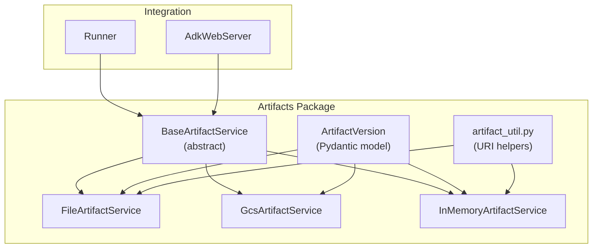
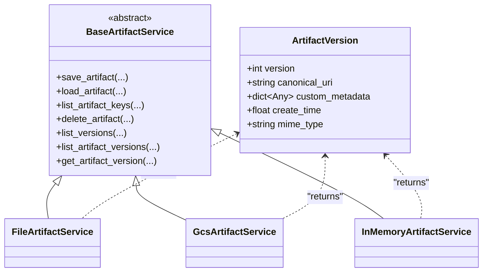
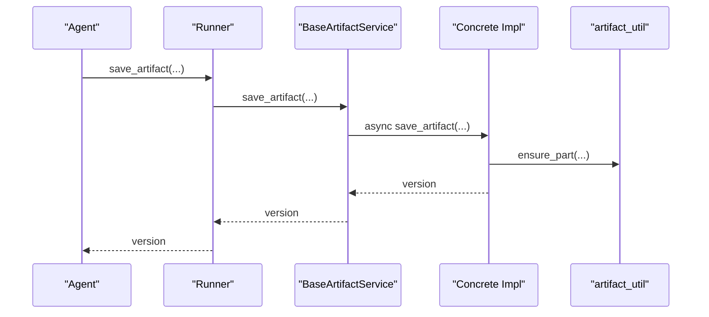
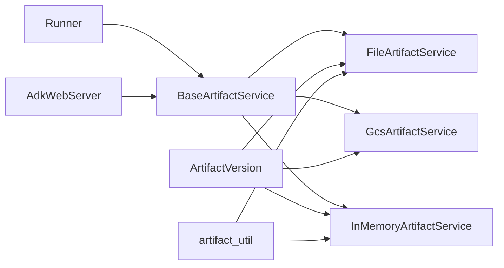

# Artifact Service Architecture

<cite>
**Referenced Files in This Document**
- [base_artifact_service.py](file://src/google/adk/artifacts/base_artifact_service.py)
- [artifact_util.py](file://src/google/adk/artifacts/artifact_util.py)
- [file_artifact_service.py](file://src/google/adk/artifacts/file_artifact_service.py)
- [gcs_artifact_service.py](file://src/google/adk/artifacts/gcs_artifact_service.py)
- [in_memory_artifact_service.py](file://src/google/adk/artifacts/in_memory_artifact_service.py)
- [__init__.py](file://src/google/adk/artifacts/__init__.py)
- [runners.py](file://src/google/adk/runners.py)
- [adk_web_server.py](file://src/google/adk/cli/adk_web_server.py)
- [test_artifact_service.py](file://tests/unittests/artifacts/test_artifact_service.py)
</cite>

## Table of Contents
1. [Introduction](#introduction)
2. [Project Structure](#project-structure)
3. [Core Components](#core-components)
4. [Architecture Overview](#architecture-overview)
5. [Detailed Component Analysis](#detailed-component-analysis)
6. [Dependency Analysis](#dependency-analysis)
7. [Performance Considerations](#performance-considerations)
8. [Troubleshooting Guide](#troubleshooting-guide)
9. [Conclusion](#conclusion)
10. [Appendices](#appendices)

## Introduction
This document explains the artifact service architecture in the ADK framework. It focuses on the BaseArtifactService abstract base class that defines the contract for all artifact storage implementations, the ArtifactVersion data model, and the concrete implementations backed by local filesystem, Google Cloud Storage, and in-memory storage. It also covers artifact identification, asynchronous operation patterns, error handling, thread-safety considerations, and practical integration examples.

## Project Structure
The artifact subsystem resides under src/google/adk/artifacts and includes:
- A base abstract service defining the interface
- Utility functions for artifact URI parsing and construction
- Three concrete implementations: file-based, GCS-backed, and in-memory
- Integration points in the Runner and CLI server

**Diagram sources**
- [base_artifact_service.py](file://src/google/adk/artifacts/base_artifact_service.py#L88-L262)
- [artifact_util.py](file://src/google/adk/artifacts/artifact_util.py#L25-L117)
- [file_artifact_service.py](file://src/google/adk/artifacts/file_artifact_service.py#L189-L726)
- [gcs_artifact_service.py](file://src/google/adk/artifacts/gcs_artifact_service.py#L43-L466)
- [in_memory_artifact_service.py](file://src/google/adk/artifacts/in_memory_artifact_service.py#L49-L282)
- [runners.py](file://src/google/adk/runners.py#L112-L200)
- [adk_web_server.py](file://src/google/adk/cli/adk_web_server.py#L1530-L1605)

**Section sources**
- [__init__.py](file://src/google/adk/artifacts/__init__.py#L15-L25)

## Core Components
- BaseArtifactService: Defines the asynchronous artifact interface with methods for saving, loading, listing keys, listing versions, listing artifact versions, and retrieving specific version metadata.
- ArtifactVersion: A Pydantic model representing version metadata including version number, canonical URI, custom metadata, creation timestamp, and MIME type.
- Artifact utilities: Helper functions for constructing and parsing artifact URIs and detecting artifact references.

Key interface methods:
- save_artifact
- load_artifact
- list_artifact_keys
- delete_artifact
- list_versions
- list_artifact_versions
- get_artifact_version

Identification scheme:
- app_name, user_id, filename, session_id parameters identify artifacts
- Optional user-scoped artifacts can be prefixed with a user namespace

Asynchronous operations:
- All methods are declared async and executed off the main thread using asyncio.to_thread in concrete implementations

**Section sources**
- [base_artifact_service.py](file://src/google/adk/artifacts/base_artifact_service.py#L88-L262)
- [artifact_util.py](file://src/google/adk/artifacts/artifact_util.py#L25-L117)

## Architecture Overview
The artifact service architecture follows a clean separation of concerns:
- Abstract base class defines the contract
- Concrete services encapsulate storage-specific logic
- Utilities provide cross-cutting concerns (URI handling)
- Integrations (Runner and CLI) depend on the abstract interface

**Diagram sources**
- [base_artifact_service.py](file://src/google/adk/artifacts/base_artifact_service.py#L88-L262)
- [file_artifact_service.py](file://src/google/adk/artifacts/file_artifact_service.py#L189-L726)
- [gcs_artifact_service.py](file://src/google/adk/artifacts/gcs_artifact_service.py#L43-L466)
- [in_memory_artifact_service.py](file://src/google/adk/artifacts/in_memory_artifact_service.py#L49-L282)

## Detailed Component Analysis

### BaseArtifactService and ArtifactVersion
- BaseArtifactService declares all core methods as abstract and async, ensuring implementations consistently handle I/O off the main thread.
- ArtifactVersion is a strongly-typed model with camelCase serialization support and includes:
  - version: monotonically increasing integer
  - canonical_uri: persistent reference to the stored payload
  - custom_metadata: user-defined metadata
  - create_time: timestamp when version record was created
  - mime_type: optional MIME type for binary payloads

Implementation patterns:
- ensure_part normalizes external inputs (camelCase/snake_case dicts) into types.Part instances for internal processing.

**Section sources**
- [base_artifact_service.py](file://src/google/adk/artifacts/base_artifact_service.py#L34-L86)
- [base_artifact_service.py](file://src/google/adk/artifacts/base_artifact_service.py#L88-L262)

### FileArtifactService
- Stores artifacts on the local filesystem under a configurable root directory.
- Supports nested filenames and enforces safe path resolution to prevent escaping the storage root.
- Persists per-version metadata as JSON alongside payloads.
- Canonical URIs are file:// URIs pointing to stored files.

Key behaviors:
- save_artifact writes either inline binary or text content and records metadata
- load_artifact reads the latest or specified version, resolving canonical URI fallbacks
- list_artifact_keys enumerates all artifact names across user and session scopes
- list_versions and list_artifact_versions enumerate and return ArtifactVersion objects
- delete_artifact removes all versions for a given artifact

Thread-safety:
- Uses asyncio.to_thread to run blocking filesystem operations on a thread pool

**Section sources**
- [file_artifact_service.py](file://src/google/adk/artifacts/file_artifact_service.py#L189-L726)

### GcsArtifactService
- Stores artifacts in Google Cloud Storage with a structured blob naming scheme.
- Supports user-scoped artifacts (prefixed with user:) and session-scoped artifacts.
- Canonical URIs are gs:// URIs.
- Uses GCS client APIs for uploads, downloads, listing, and deletion.

Key behaviors:
- save_artifact uploads inline or text content; file_data is not supported yet
- load_artifact downloads the latest or specified version
- list_artifact_keys lists artifact names across user and session namespaces
- list_versions and list_artifact_versions return ArtifactVersion objects populated from blob metadata

Thread-safety:
- Uses asyncio.to_thread to run GCS operations

**Section sources**
- [gcs_artifact_service.py](file://src/google/adk/artifacts/gcs_artifact_service.py#L43-L466)

### InMemoryArtifactService
- Provides an in-memory artifact store for testing and development.
- Not suitable for multi-threaded production use.
- Supports user-scoped and session-scoped artifacts with memory:// canonical URIs.
- Handles artifact references by resolving nested loads.

Key behaviors:
- save_artifact appends new versions to in-memory lists
- load_artifact resolves references and returns the specified or latest version
- list_artifact_keys enumerates artifact names
- list_versions and list_artifact_versions return in-memory ArtifactVersion objects

Thread-safety:
- Not thread-safe; intended for single-threaded contexts

**Section sources**
- [in_memory_artifact_service.py](file://src/google/adk/artifacts/in_memory_artifact_service.py#L49-L282)

### Artifact Utilities
- ParsedArtifactUri: NamedTuple capturing parsed components from artifact URIs
- parse_artifact_uri: Parses session-scoped and user-scoped artifact URIs
- get_artifact_uri: Constructs artifact URIs for both scopes
- is_artifact_ref: Detects if an artifact part references another artifact

These utilities are used by services and integrations to manage artifact identifiers consistently.

**Section sources**
- [artifact_util.py](file://src/google/adk/artifacts/artifact_util.py#L25-L117)

### Integration with Runner and CLI
- Runner holds an optional BaseArtifactService and delegates artifact operations during agent runs.
- AdkWebServer exposes REST endpoints that delegate to the configured artifact service, returning ArtifactVersion objects.

**Diagram sources**
- [runners.py](file://src/google/adk/runners.py#L112-L200)
- [base_artifact_service.py](file://src/google/adk/artifacts/base_artifact_service.py#L88-L262)
- [artifact_util.py](file://src/google/adk/artifacts/artifact_util.py#L68-L86)

**Section sources**
- [runners.py](file://src/google/adk/runners.py#L112-L200)
- [adk_web_server.py](file://src/google/adk/cli/adk_web_server.py#L1530-L1605)

## Dependency Analysis
- Concrete services depend on BaseArtifactService and ArtifactVersion
- FileArtifactService and InMemoryArtifactService use artifact_util for URI-related checks
- Runner and AdkWebServer depend on BaseArtifactService for runtime operations
- Tests exercise all implementations uniformly via a factory pattern

**Diagram sources**
- [base_artifact_service.py](file://src/google/adk/artifacts/base_artifact_service.py#L88-L262)
- [file_artifact_service.py](file://src/google/adk/artifacts/file_artifact_service.py#L189-L726)
- [gcs_artifact_service.py](file://src/google/adk/artifacts/gcs_artifact_service.py#L43-L466)
- [in_memory_artifact_service.py](file://src/google/adk/artifacts/in_memory_artifact_service.py#L49-L282)
- [artifact_util.py](file://src/google/adk/artifacts/artifact_util.py#L25-L117)
- [runners.py](file://src/google/adk/runners.py#L112-L200)
- [adk_web_server.py](file://src/google/adk/cli/adk_web_server.py#L1530-L1605)

**Section sources**
- [__init__.py](file://src/google/adk/artifacts/__init__.py#L15-L25)

## Performance Considerations
- Asynchronous execution: All concrete services wrap blocking operations in asyncio.to_thread, preventing main-thread blocking and enabling concurrency.
- Local filesystem (FileArtifactService): Good for development and small-scale deployments; I/O bound; consider SSD storage and avoiding excessive directory nesting.
- Cloud storage (GcsArtifactService): Network latency is a factor; batch operations and caching can help; metadata retrieval is efficient via blob attributes.
- In-memory (InMemoryArtifactService): Fastest for testing; limited by process memory; not suitable for production or multi-process setups.
- Path safety: FileArtifactService enforces safe path resolution to avoid directory traversal; this adds minimal overhead but prevents expensive or unsafe operations.

[No sources needed since this section provides general guidance]

## Troubleshooting Guide
Common issues and resolutions:
- Invalid artifact references: Ensure artifact references use valid artifact:// URIs; services validate and reject malformed references.
- Missing payloads: For binary artifacts, if the stored payload is missing but canonical URI points elsewhere, services log warnings and return None.
- Session-scoped artifacts without session_id: Some implementations require a session_id; ensure it is provided for session-scoped artifacts.
- Unsupported artifact types: Implementations may restrict artifact types (e.g., GcsArtifactService currently does not support file_data).
- Version not found: Methods return None when a version does not exist; confirm version numbers via list_versions or list_artifact_versions.

Error handling patterns:
- Input validation errors raised for invalid inputs (e.g., path traversal, missing session_id)
- Logging warnings for recoverable issues (e.g., missing files)
- Returning None for not-found conditions

**Section sources**
- [file_artifact_service.py](file://src/google/adk/artifacts/file_artifact_service.py#L108-L133)
- [gcs_artifact_service.py](file://src/google/adk/artifacts/gcs_artifact_service.py#L167-L171)
- [in_memory_artifact_service.py](file://src/google/adk/artifacts/in_memory_artifact_service.py#L129-L140)
- [test_artifact_service.py](file://tests/unittests/artifacts/test_artifact_service.py#L197-L200)

## Conclusion
The artifact service architecture in ADK provides a robust, extensible abstraction for artifact storage with strong typing, consistent identification, and asynchronous operations. The BaseArtifactService defines a clear contract that enables pluggable storage backends, while utilities and integrations ensure consistent behavior across implementations. Choose the appropriate backend based on deployment needs, and follow the provided patterns for safe, performant artifact management.

[No sources needed since this section summarizes without analyzing specific files]

## Appendices

### Practical Implementation Examples
- Implementing a custom artifact service:
  - Subclass BaseArtifactService and implement all abstract methods
  - Use ensure_part to normalize inputs
  - Return ArtifactVersion objects with canonical_uri and metadata
  - Wrap blocking operations with asyncio.to_thread
  - Reference existing implementations for patterns

- Integrating with Runner:
  - Pass an instance of your custom service to Runner’s constructor
  - Ensure the service is initialized before agent execution

- Exposing via CLI:
  - Register endpoints that delegate to artifact_service methods
  - Return ArtifactVersion objects as JSON

**Section sources**
- [base_artifact_service.py](file://src/google/adk/artifacts/base_artifact_service.py#L88-L262)
- [runners.py](file://src/google/adk/runners.py#L150-L196)
- [adk_web_server.py](file://src/google/adk/cli/adk_web_server.py#L1530-L1605)

### Artifact Identification Scheme
- app_name: Application identifier
- user_id: User identifier
- filename: Artifact name; supports nested paths and user-scoped prefix
- session_id: Session identifier; optional for user-scoped artifacts

URI construction and parsing:
- get_artifact_uri builds artifact URIs for both scopes
- parse_artifact_uri extracts components from artifact URIs
- is_artifact_ref detects references to other artifacts

**Section sources**
- [artifact_util.py](file://src/google/adk/artifacts/artifact_util.py#L78-L117)
- [file_artifact_service.py](file://src/google/adk/artifacts/file_artifact_service.py#L136-L139)
- [in_memory_artifact_service.py](file://src/google/adk/artifacts/in_memory_artifact_service.py#L58-L95)

### Thread Safety and Concurrency
- All concrete services run blocking operations on threads via asyncio.to_thread
- InMemoryArtifactService is not thread-safe; avoid concurrent access
- FileArtifactService and GcsArtifactService are safe for concurrent use within their respective storage constraints

**Section sources**
- [file_artifact_service.py](file://src/google/adk/artifacts/file_artifact_service.py#L331-L338)
- [gcs_artifact_service.py](file://src/google/adk/artifacts/gcs_artifact_service.py#L70-L78)
- [in_memory_artifact_service.py](file://src/google/adk/artifacts/in_memory_artifact_service.py#L49-L54)