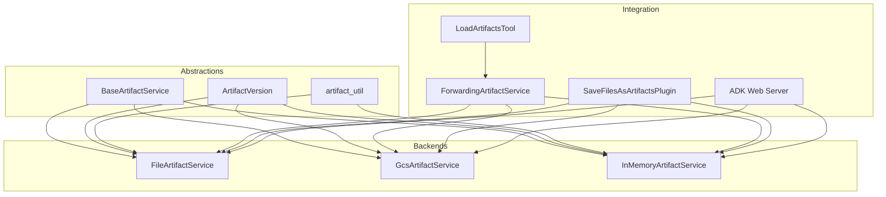
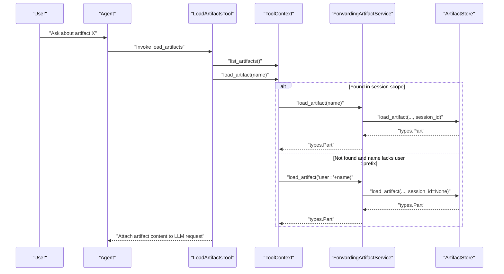
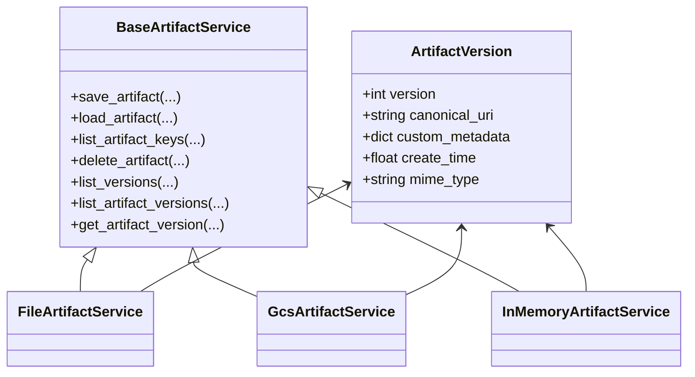
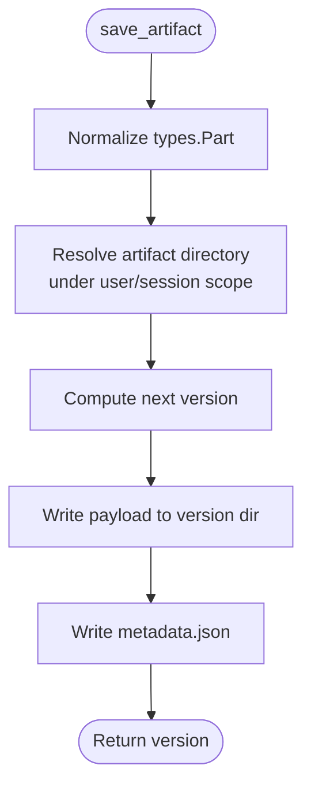
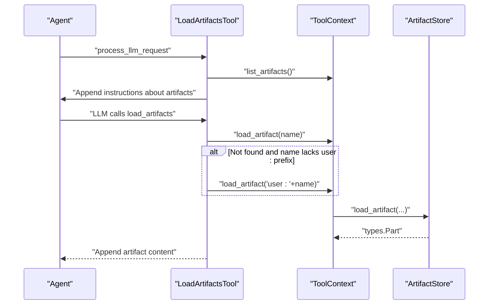
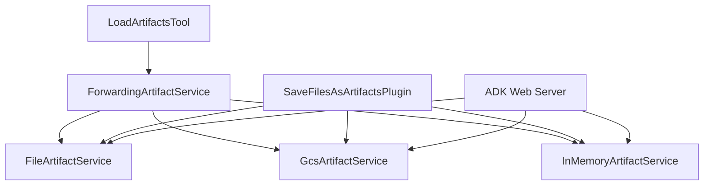

# Artifact Workflow Integration

<cite>
**Referenced Files in This Document**
- [base_artifact_service.py](file://src/google/adk/artifacts/base_artifact_service.py)
- [file_artifact_service.py](file://src/google/adk/artifacts/file_artifact_service.py)
- [gcs_artifact_service.py](file://src/google/adk/artifacts/gcs_artifact_service.py)
- [in_memory_artifact_service.py](file://src/google/adk/artifacts/in_memory_artifact_service.py)
- [artifact_util.py](file://src/google/adk/artifacts/artifact_util.py)
- [load_artifacts_tool.py](file://src/google/adk/tools/load_artifacts_tool.py)
- [_forwarding_artifact_service.py](file://src/google/adk/tools/_forwarding_artifact_service.py)
- [save_files_as_artifacts_plugin.py](file://src/google/adk/plugins/save_files_as_artifacts_plugin.py)
- [adk_web_server.py](file://src/google/adk/cli/adk_web_server.py)
- [artifact_save_text_agent.py](file://contributing/samples/artifact_save_text/agent.py)
- [context_offloading_agent.py](file://contributing/samples/context_offloading_with_artifact/agent.py)
- [test_artifact_service.py](file://tests/unittests/artifacts/test_artifact_service.py)
- [test_session_service.py](file://tests/unittests/sessions/test_session_service.py)
</cite>

## Table of Contents
1. [Introduction](#introduction)
2. [Project Structure](#project-structure)
3. [Core Components](#core-components)
4. [Architecture Overview](#architecture-overview)
5. [Detailed Component Analysis](#detailed-component-analysis)
6. [Dependency Analysis](#dependency-analysis)
7. [Performance Considerations](#performance-considerations)
8. [Troubleshooting Guide](#troubleshooting-guide)
9. [Conclusion](#conclusion)
10. [Appendices](#appendices)

## Introduction
This document explains how artifacts integrate with agent workflows in ADK applications for persistent, shareable, and retrievable data across execution contexts. It covers artifact loading and saving patterns, context propagation, state management, and integration with tools such as LoadArtifactsTool and SaveFilesAsArtifactsPlugin. It also documents versioning strategies, conflict resolution, concurrent access handling, and the relationship between artifacts and memory/session services. Practical examples demonstrate multi-agent scenarios, long-running processes, and distributed deployments. Security considerations, access control patterns, and audit trails are addressed, along with best practices for naming, organization, and lifecycle management.

## Project Structure
The artifact subsystem is organized around a shared abstraction and multiple storage backends:
- Abstractions and models define the artifact contract and version metadata.
- Backends implement storage for file, GCS, and in-memory scenarios.
- Tools and plugins integrate artifacts into agent workflows and tool execution contexts.
- Utilities support URI construction and parsing for artifact references.

**Diagram sources**
- [base_artifact_service.py](file://src/google/adk/artifacts/base_artifact_service.py#L88-L262)
- [file_artifact_service.py](file://src/google/adk/artifacts/file_artifact_service.py#L189-L726)
- [gcs_artifact_service.py](file://src/google/adk/artifacts/gcs_artifact_service.py#L43-L466)
- [in_memory_artifact_service.py](file://src/google/adk/artifacts/in_memory_artifact_service.py#L49-L282)
- [artifact_util.py](file://src/google/adk/artifacts/artifact_util.py#L25-L117)
- [load_artifacts_tool.py](file://src/google/adk/tools/load_artifacts_tool.py#L124-L256)
- [_forwarding_artifact_service.py](file://src/google/adk/tools/_forwarding_artifact_service.py#L31-L135)
- [save_files_as_artifacts_plugin.py](file://src/google/adk/plugins/save_files_as_artifacts_plugin.py#L35-L188)
- [adk_web_server.py](file://src/google/adk/cli/adk_web_server.py#L1530-L1570)

**Section sources**
- [base_artifact_service.py](file://src/google/adk/artifacts/base_artifact_service.py#L1-L262)
- [file_artifact_service.py](file://src/google/adk/artifacts/file_artifact_service.py#L1-L726)
- [gcs_artifact_service.py](file://src/google/adk/artifacts/gcs_artifact_service.py#L1-L466)
- [in_memory_artifact_service.py](file://src/google/adk/artifacts/in_memory_artifact_service.py#L1-L282)
- [artifact_util.py](file://src/google/adk/artifacts/artifact_util.py#L1-L117)
- [load_artifacts_tool.py](file://src/google/adk/tools/load_artifacts_tool.py#L1-L256)
- [_forwarding_artifact_service.py](file://src/google/adk/tools/_forwarding_artifact_service.py#L1-L135)
- [save_files_as_artifacts_plugin.py](file://src/google/adk/plugins/save_files_as_artifacts_plugin.py#L1-L188)
- [adk_web_server.py](file://src/google/adk/cli/adk_web_server.py#L1530-L1570)

## Core Components
- BaseArtifactService: Defines the artifact contract including save, load, list, delete, and version listing operations. Provides normalization helpers and typed metadata.
- ArtifactVersion: Encapsulates per-version metadata such as canonical URI, MIME type, custom metadata, and timestamps.
- FileArtifactService: Persists artifacts to a local filesystem with strict path sanitization and nested directory layout mirroring filenames.
- GcsArtifactService: Stores artifacts in Google Cloud Storage with user/session scoping and blob naming conventions.
- InMemoryArtifactService: Provides an in-memory artifact store for testing and development, supporting artifact references and user/session scoping.
- artifact_util: Utilities for constructing and parsing artifact URIs and detecting artifact references.
- LoadArtifactsTool: Integrates artifact retrieval into agent workflows, attaching content to LLM requests and handling cross-session artifact access via user: prefix.
- ForwardingArtifactService: Bridges artifact operations from tool contexts to the underlying artifact service.
- SaveFilesAsArtifactsPlugin: Automatically saves files embedded in user messages as artifacts and optionally attaches model-accessible references.

**Section sources**
- [base_artifact_service.py](file://src/google/adk/artifacts/base_artifact_service.py#L34-L262)
- [file_artifact_service.py](file://src/google/adk/artifacts/file_artifact_service.py#L189-L726)
- [gcs_artifact_service.py](file://src/google/adk/artifacts/gcs_artifact_service.py#L43-L466)
- [in_memory_artifact_service.py](file://src/google/adk/artifacts/in_memory_artifact_service.py#L49-L282)
- [artifact_util.py](file://src/google/adk/artifacts/artifact_util.py#L25-L117)
- [load_artifacts_tool.py](file://src/google/adk/tools/load_artifacts_tool.py#L124-L256)
- [_forwarding_artifact_service.py](file://src/google/adk/tools/_forwarding_artifact_service.py#L31-L135)
- [save_files_as_artifacts_plugin.py](file://src/google/adk/plugins/save_files_as_artifacts_plugin.py#L35-L188)

## Architecture Overview
Artifacts are accessed through a unified interface and integrated into agent workflows via tools and plugins. The system supports:
- Session-scoped artifacts (default) and user-scoped artifacts (prefixed with user:).
- Versioned storage with metadata and canonical URIs.
- Cross-context retrieval via LoadArtifactsTool and ForwardingArtifactService.
- Model-accessible references when URIs are reachable by the LLM connector.

**Diagram sources**
- [load_artifacts_tool.py](file://src/google/adk/tools/load_artifacts_tool.py#L192-L253)
- [_forwarding_artifact_service.py](file://src/google/adk/tools/_forwarding_artifact_service.py#L38-L92)
- [file_artifact_service.py](file://src/google/adk/artifacts/file_artifact_service.py#L406-L475)
- [gcs_artifact_service.py](file://src/google/adk/artifacts/gcs_artifact_service.py#L244-L275)
- [in_memory_artifact_service.py](file://src/google/adk/artifacts/in_memory_artifact_service.py#L148-L198)

## Detailed Component Analysis

### Artifact Abstractions and Versioning
- BaseArtifactService defines asynchronous operations for saving/loading/listing/deleting artifacts and enumerating versions. It normalizes inputs to types.Part and enforces consistent metadata.
- ArtifactVersion captures version-specific metadata including canonical URI, MIME type, custom metadata, and timestamps. Backends construct canonical URIs appropriate to their storage (file://, gs://, memory://, artifact://).

**Diagram sources**
- [base_artifact_service.py](file://src/google/adk/artifacts/base_artifact_service.py#L88-L262)
- [file_artifact_service.py](file://src/google/adk/artifacts/file_artifact_service.py#L189-L726)
- [gcs_artifact_service.py](file://src/google/adk/artifacts/gcs_artifact_service.py#L43-L466)
- [in_memory_artifact_service.py](file://src/google/adk/artifacts/in_memory_artifact_service.py#L49-L282)

**Section sources**
- [base_artifact_service.py](file://src/google/adk/artifacts/base_artifact_service.py#L34-L262)
- [artifact_util.py](file://src/google/adk/artifacts/artifact_util.py#L25-L117)

### FileArtifactService
- Implements filesystem-backed artifact storage with a nested directory layout mirroring filenames. Path sanitization prevents traversal outside the configured root.
- Supports user-scoped artifacts via user: prefix and session-scoped artifacts via session directories.
- Canonical URIs are file:// URIs pointing to stored payloads; metadata is persisted alongside payloads.

**Diagram sources**
- [file_artifact_service.py](file://src/google/adk/artifacts/file_artifact_service.py#L313-L404)

**Section sources**
- [file_artifact_service.py](file://src/google/adk/artifacts/file_artifact_service.py#L189-L726)

### GcsArtifactService
- Stores artifacts in Google Cloud Storage with blob naming conventions that encode app/user/session and filename. Supports user-scoped artifacts via user: prefix.
- Lists versions by scanning blobs under the constructed prefix and constructs ArtifactVersion entries with canonical gs:// URIs and metadata.

**Section sources**
- [gcs_artifact_service.py](file://src/google/adk/artifacts/gcs_artifact_service.py#L43-L466)

### InMemoryArtifactService
- Maintains artifacts in memory with optional artifact reference resolution. Supports user/session scoping and validates artifact reference URIs.
- Canonical URIs use memory:// scheme; version enumeration is index-based.

**Section sources**
- [in_memory_artifact_service.py](file://src/google/adk/artifacts/in_memory_artifact_service.py#L49-L282)

### LoadArtifactsTool
- Integrates artifact retrieval into agent workflows. It:
  - Lists available artifacts for the current request.
  - Injects instructions into the LLM request instructing the model to call load_artifacts before answering questions about artifacts.
  - On function_response from load_artifacts, loads artifacts and appends them to the LLM request as user Content parts.
  - Supports cross-session retrieval by trying user: prefixed names when session-scoped lookup fails.

**Diagram sources**
- [load_artifacts_tool.py](file://src/google/adk/tools/load_artifacts_tool.py#L181-L253)

**Section sources**
- [load_artifacts_tool.py](file://src/google/adk/tools/load_artifacts_tool.py#L124-L256)

### ForwardingArtifactService
- Forwards artifact operations to the parent ToolContext’s artifact service, enabling tools to operate within the agent’s invocation context. Delegates delete/list_versions to the underlying artifact service when invoked from tool context.

**Section sources**
- [_forwarding_artifact_service.py](file://src/google/adk/tools/_forwarding_artifact_service.py#L31-L135)

### SaveFilesAsArtifactsPlugin
- Intercepts user messages and automatically saves embedded files as artifacts, replacing them with placeholders. Optionally attaches model-accessible file references when the artifact URI is reachable by the LLM connector.

**Section sources**
- [save_files_as_artifacts_plugin.py](file://src/google/adk/plugins/save_files_as_artifacts_plugin.py#L35-L188)

### Artifact Utilities
- artifact_util provides URI parsing and construction for artifact:// URIs, enabling artifact references and cross-session retrieval patterns.

**Section sources**
- [artifact_util.py](file://src/google/adk/artifacts/artifact_util.py#L25-L117)

### Practical Examples
- Artifact save from a tool: Demonstrates saving a text artifact with custom metadata and retrieving it later.
- Context offloading with artifacts: Generates large reports, saves them as artifacts, and uses a custom load tool to inject content on demand while keeping conversation history compact.

**Section sources**
- [artifact_save_text_agent.py](file://contributing/samples/artifact_save_text/agent.py#L21-L28)
- [context_offloading_agent.py](file://contributing/samples/context_offloading_with_artifact/agent.py#L118-L177)
- [context_offloading_agent.py](file://contributing/samples/context_offloading_with_artifact/agent.py#L179-L219)

## Dependency Analysis
Artifacts are accessed through a consistent interface across backends and integrated into agent workflows via tools and plugins. The web server exposes endpoints to retrieve artifact version metadata, ensuring external clients can inspect artifact state.

**Diagram sources**
- [load_artifacts_tool.py](file://src/google/adk/tools/load_artifacts_tool.py#L124-L256)
- [_forwarding_artifact_service.py](file://src/google/adk/tools/_forwarding_artifact_service.py#L31-L135)
- [save_files_as_artifacts_plugin.py](file://src/google/adk/plugins/save_files_as_artifacts_plugin.py#L35-L188)
- [adk_web_server.py](file://src/google/adk/cli/adk_web_server.py#L1530-L1570)

**Section sources**
- [adk_web_server.py](file://src/google/adk/cli/adk_web_server.py#L1530-L1570)

## Performance Considerations
- Prefer user-scoped artifacts (user: prefix) for cross-session reuse to avoid repeated uploads and reduce latency.
- Use SaveFilesAsArtifactsPlugin to minimize redundant processing by storing files once and referencing them via model-accessible URIs when possible.
- For large artifacts, rely on LoadArtifactsTool to attach content on-demand rather than embedding payloads in every turn.
- Choose GCS for distributed deployments and FileArtifactService for local development to balance durability and performance.
- Avoid excessive version churn; use custom metadata to summarize artifact content and reduce repeated retrieval.

## Troubleshooting Guide
Common issues and resolutions:
- Artifact not found during load:
  - Verify session vs user scoping. If session-scoped load fails, try user: prefixed name.
  - Confirm filename correctness and that the artifact exists in the expected scope.
- Invalid artifact reference URI:
  - Ensure artifact references use artifact:// scheme and contain valid app/user/session/filename/version.
- Cross-session access:
  - Use user: prefix to access artifacts across sessions.
- Concurrency and stale sessions:
  - Session services detect stale sessions and reject updates with earlier timestamps. Refresh the session before appending events.

**Section sources**
- [load_artifacts_tool.py](file://src/google/adk/tools/load_artifacts_tool.py#L217-L229)
- [artifact_util.py](file://src/google/adk/artifacts/artifact_util.py#L43-L76)
- [test_session_service.py](file://tests/unittests/sessions/test_session_service.py#L641-L793)

## Conclusion
ADK’s artifact subsystem provides a robust, extensible foundation for persistent, shareable, and retrievable data across agent workflows. Through unified abstractions, multiple storage backends, and tight integration with tools and plugins, it supports multi-agent scenarios, long-running processes, and distributed deployments. Proper use of scoping, versioning, and model-accessible references ensures efficient context management and strong operational characteristics.

## Appendices

### Best Practices
- Naming and Organization:
  - Use descriptive filenames and nested paths to organize artifacts (e.g., reports/2025/Q3/sales.txt).
  - Prefix cross-session artifacts with user: to enable reuse across sessions.
- Lifecycle Management:
  - Store large or frequently reused content as artifacts; load on demand.
  - Use custom metadata to annotate artifacts with summaries or provenance.
- Security and Access Control:
  - Restrict artifact URIs to trusted schemes (gs, https, http) when attaching references to the LLM.
  - Enforce access control at the storage layer (e.g., GCS IAM) and application level.
- Audit Trails:
  - Track artifact saves and loads via logs and custom metadata.
  - Use artifact versioning to maintain immutable records of changes.

### Versioning Strategies and Conflict Resolution
- Automatic monotonic versioning: Each successful save increments the version number.
- Listing versions: Use list_versions or list_artifact_versions to enumerate available versions.
- Retrieving specific versions: Use get_artifact_version to fetch metadata for a given version.
- Conflict resolution: Latest version is returned by default; explicit version selection allows deterministic retrieval.

**Section sources**
- [file_artifact_service.py](file://src/google/adk/artifacts/file_artifact_service.py#L608-L656)
- [gcs_artifact_service.py](file://src/google/adk/artifacts/gcs_artifact_service.py#L432-L465)
- [in_memory_artifact_service.py](file://src/google/adk/artifacts/in_memory_artifact_service.py#L247-L282)
- [test_artifact_service.py](file://tests/unittests/artifacts/test_artifact_service.py#L467-L708)