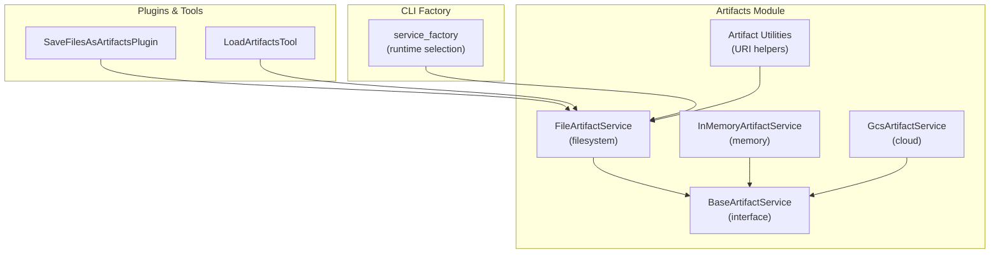
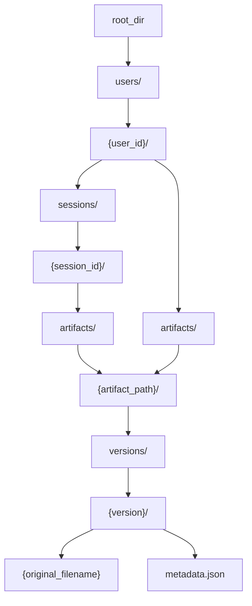
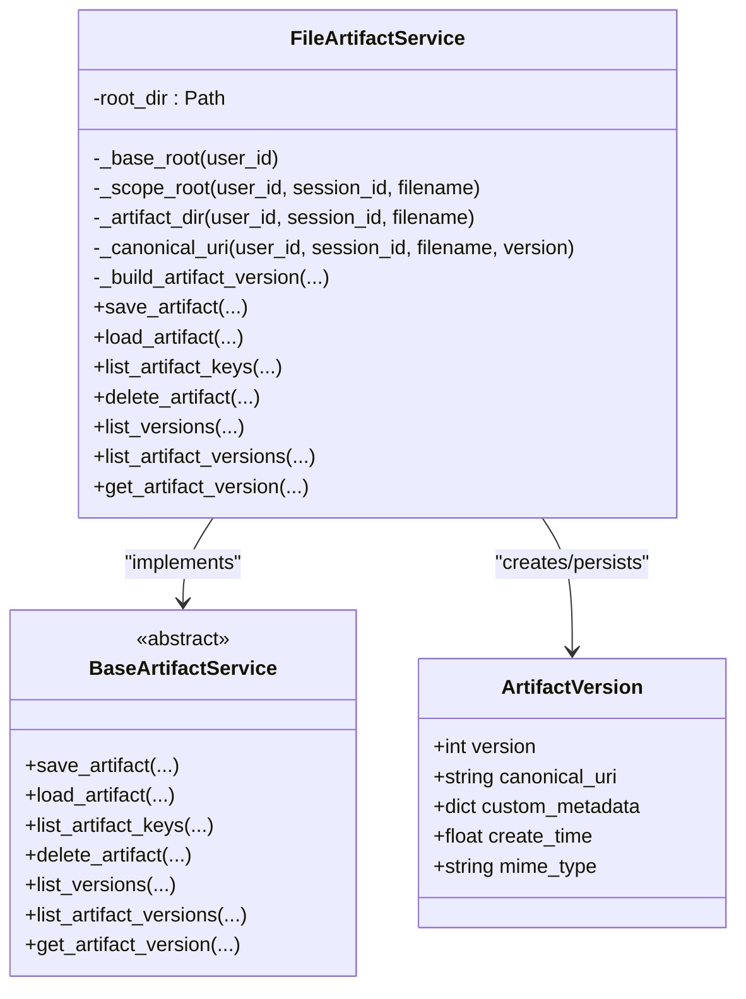
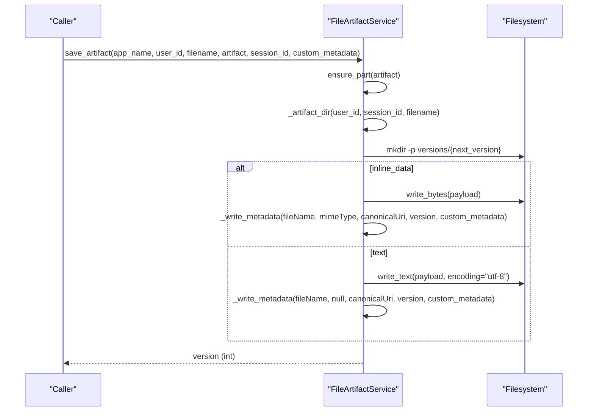
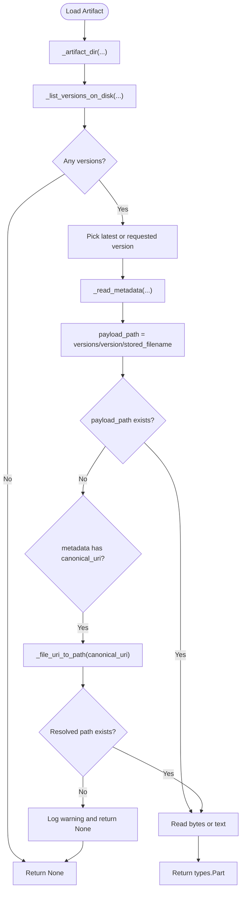
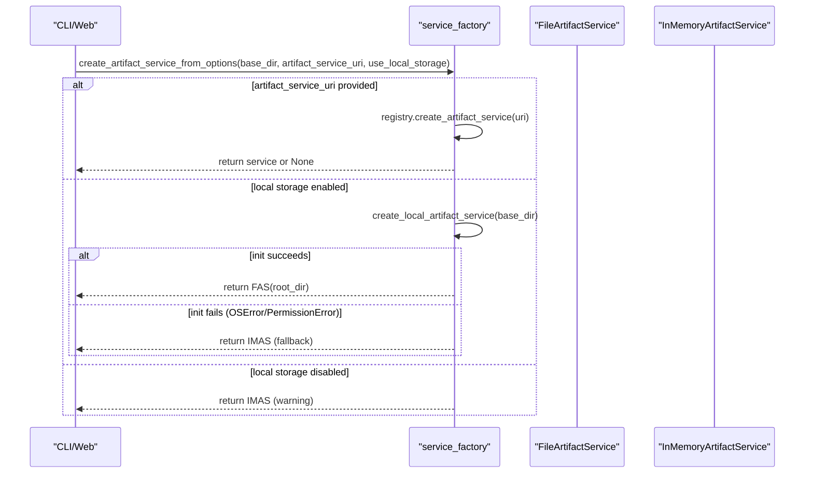
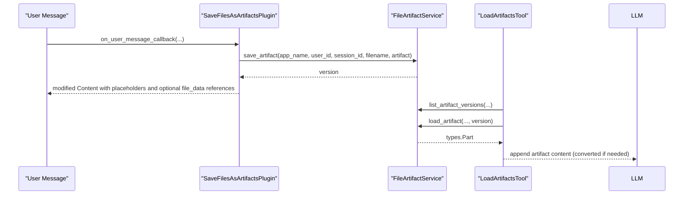
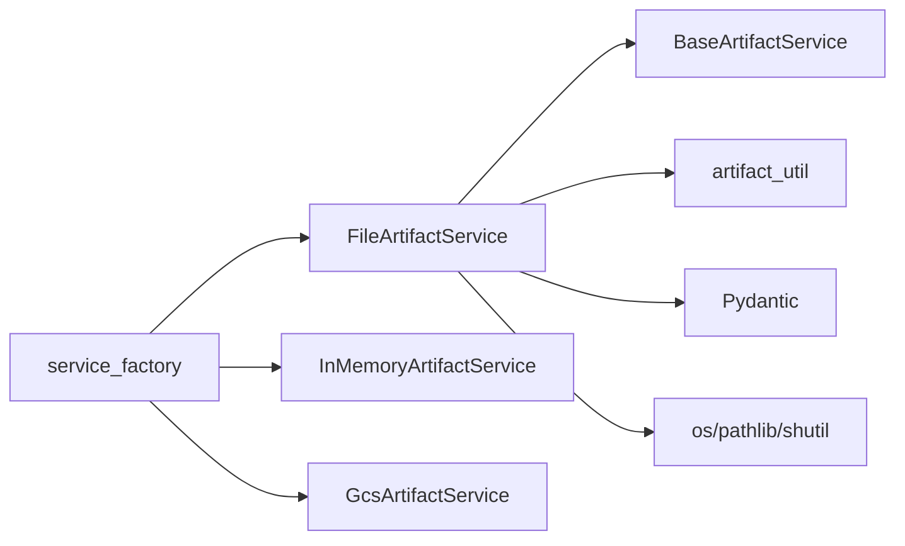

# File-Based Artifact Service

<cite>
**Referenced Files in This Document**
- [file_artifact_service.py](file://src/google/adk/artifacts/file_artifact_service.py)
- [base_artifact_service.py](file://src/google/adk/artifacts/base_artifact_service.py)
- [artifact_util.py](file://src/google/adk/artifacts/artifact_util.py)
- [save_files_as_artifacts_plugin.py](file://src/google/adk/plugins/save_files_as_artifacts_plugin.py)
- [load_artifacts_tool.py](file://src/google/adk/tools/load_artifacts_tool.py)
- [test_artifact_service.py](file://tests/unittests/artifacts/test_artifact_service.py)
- [service_factory.py](file://src/google/adk/cli/utils/service_factory.py)
- [gcs_artifact_service.py](file://src/google/adk/artifacts/gcs_artifact_service.py)
- [in_memory_artifact_service.py](file://src/google/adk/artifacts/in_memory_artifact_service.py)
</cite>

## Table of Contents
1. [Introduction](#introduction)
2. [Project Structure](#project-structure)
3. [Core Components](#core-components)
4. [Architecture Overview](#architecture-overview)
5. [Detailed Component Analysis](#detailed-component-analysis)
6. [Dependency Analysis](#dependency-analysis)
7. [Performance Considerations](#performance-considerations)
8. [Troubleshooting Guide](#troubleshooting-guide)
9. [Conclusion](#conclusion)
10. [Appendices](#appendices)

## Introduction
This document provides comprehensive technical documentation for the file-based artifact service implementation. It explains how the FileArtifactService persists artifacts on the local filesystem using a structured directory hierarchy organized by app_name, user_id, and session_id. It covers file naming conventions, storage layout, metadata handling, atomicity guarantees, permissions, disk space management, cleanup procedures, and the relationship between file paths and canonical URIs. It also documents configuration options, performance characteristics, concurrency patterns, and deployment scenarios.

## Project Structure
The file-based artifact service is implemented as a concrete artifact service that adheres to the shared base interface. Supporting components include:
- Base artifact service interface and shared models
- Artifact URI utilities for parsing and constructing artifact references
- Plugins and tools that integrate artifact storage into conversational flows
- Tests validating behavior and storage layout
- Service factory integration for runtime selection of artifact services

**Diagram sources**
- [file_artifact_service.py](file://src/google/adk/artifacts/file_artifact_service.py#L189-L220)
- [base_artifact_service.py](file://src/google/adk/artifacts/base_artifact_service.py#L88-L262)
- [artifact_util.py](file://src/google/adk/artifacts/artifact_util.py#L25-L117)
- [save_files_as_artifacts_plugin.py](file://src/google/adk/plugins/save_files_as_artifacts_plugin.py#L35-L188)
- [load_artifacts_tool.py](file://src/google/adk/tools/load_artifacts_tool.py#L124-L256)
- [service_factory.py](file://src/google/adk/cli/utils/service_factory.py#L272-L328)

**Section sources**
- [file_artifact_service.py](file://src/google/adk/artifacts/file_artifact_service.py#L189-L220)
- [base_artifact_service.py](file://src/google/adk/artifacts/base_artifact_service.py#L88-L262)
- [artifact_util.py](file://src/google/adk/artifacts/artifact_util.py#L25-L117)
- [save_files_as_artifacts_plugin.py](file://src/google/adk/plugins/save_files_as_artifacts_plugin.py#L35-L188)
- [load_artifacts_tool.py](file://src/google/adk/tools/load_artifacts_tool.py#L124-L256)
- [service_factory.py](file://src/google/adk/cli/utils/service_factory.py#L272-L328)

## Core Components
- FileArtifactService: Persists artifacts to the local filesystem under a configurable root directory. Implements save, load, list, delete, and version listing operations with robust path sanitization and metadata persistence.
- BaseArtifactService: Defines the artifact service contract and shared models (ArtifactVersion, ensure_part).
- Artifact utilities: Provide URI parsing and construction helpers for artifact references.
- SaveFilesAsArtifactsPlugin: Integrates artifact saving into user message processing, enabling automatic capture of embedded files.
- LoadArtifactsTool: Adds artifacts to LLM requests safely, converting binary content to text when necessary.
- Service factory: Selects and initializes the artifact service at runtime, with fallback to in-memory storage on initialization failures.

Key responsibilities:
- Storage layout and path resolution
- Binary/text content handling and metadata persistence
- Canonical URI generation for file payloads
- Versioning and version listing
- Safe path traversal prevention
- Async-to-sync bridging for filesystem operations

**Section sources**
- [file_artifact_service.py](file://src/google/adk/artifacts/file_artifact_service.py#L189-L726)
- [base_artifact_service.py](file://src/google/adk/artifacts/base_artifact_service.py#L34-L86)
- [artifact_util.py](file://src/google/adk/artifacts/artifact_util.py#L25-L117)
- [save_files_as_artifacts_plugin.py](file://src/google/adk/plugins/save_files_as_artifacts_plugin.py#L35-L188)
- [load_artifacts_tool.py](file://src/google/adk/tools/load_artifacts_tool.py#L124-L256)
- [service_factory.py](file://src/google/adk/cli/utils/service_factory.py#L272-L328)

## Architecture Overview
The FileArtifactService organizes artifacts in a hierarchical filesystem layout mirroring the cloud and in-memory implementations. The storage layout is:

- root/
  - users/
    - {user_id}/
      - sessions/
        - {session_id}/
          - artifacts/
            - {artifact_path}/
              - versions/
                - {version}/
                  - {original_filename}
                  - metadata.json
      - artifacts/
        - {artifact_path}/...

Where:
- {artifact_path} is derived from the sanitized, scope-relative filename provided by the caller.
- {original_filename} is the actual stored file name (derived from the artifact directory name).
- metadata.json contains persisted metadata (version, canonical URI, MIME type, custom metadata, create time).

**Diagram sources**
- [file_artifact_service.py](file://src/google/adk/artifacts/file_artifact_service.py#L192-L210)

**Section sources**
- [file_artifact_service.py](file://src/google/adk/artifacts/file_artifact_service.py#L192-L210)

## Detailed Component Analysis

### FileArtifactService Implementation
The FileArtifactService implements the BaseArtifactService interface and provides:
- Storage root initialization and directory creation
- Scope-aware artifact directory resolution (user-scoped vs session-scoped)
- Safe path resolution preventing traversal outside the configured root
- Versioned storage with per-version directories
- Metadata persistence using JSON with camelCase field names
- Canonical URI generation using file:// scheme
- Async-to-sync bridging using asyncio.to_thread for filesystem operations

Key mechanisms:
- Path sanitization and traversal checks
- Version numbering and directory creation
- Binary vs text content handling
- Metadata validation and error handling
- Listing and deletion operations

**Diagram sources**
- [file_artifact_service.py](file://src/google/adk/artifacts/file_artifact_service.py#L189-L220)
- [base_artifact_service.py](file://src/google/adk/artifacts/base_artifact_service.py#L34-L66)

**Section sources**
- [file_artifact_service.py](file://src/google/adk/artifacts/file_artifact_service.py#L189-L726)
- [base_artifact_service.py](file://src/google/adk/artifacts/base_artifact_service.py#L34-L66)

### Storage Layout and Naming Conventions
- Directory hierarchy mirrors cloud/in-memory layout for portability.
- Filenames with “user:” prefix indicate cross-session, user-scoped artifacts.
- Nested filenames create nested directories; separators are preserved in the path.
- Absolute paths and traversal outside the scope root are rejected.
- Each artifact has a dedicated directory named after the artifact’s stored filename.
- Per-version directories contain the payload and metadata.json.

Examples of naming:
- Simple file: docs/report.txt → artifacts/docs/report.txt/versions/{version}/report.txt
- Cross-session artifact: user:shared/diagram.png → artifacts/shared/diagram.png/versions/{version}/diagram.png
- Session-scoped nested file: images/photos/vacation.jpg → sessions/{session_id}/artifacts/images/photos/vacation.jpg/versions/{version}/vacation.jpg

**Section sources**
- [file_artifact_service.py](file://src/google/adk/artifacts/file_artifact_service.py#L192-L210)
- [file_artifact_service.py](file://src/google/adk/artifacts/file_artifact_service.py#L87-L134)

### Artifact Persistence Mechanism
- Binary data: written as raw bytes; MIME type recorded in metadata.
- Text content: written as UTF-8 text; MIME type omitted.
- Metadata: JSON file with camelCase fields (fileName, mimeType, canonicalUri, version, customMetadata).
- Canonical URI: generated as a file:// URI pointing to the stored payload.
- Versioning: monotonically increasing integer starting at 0.

**Diagram sources**
- [file_artifact_service.py](file://src/google/adk/artifacts/file_artifact_service.py#L312-L404)
- [file_artifact_service.py](file://src/google/adk/artifacts/file_artifact_service.py#L687-L709)

**Section sources**
- [file_artifact_service.py](file://src/google/adk/artifacts/file_artifact_service.py#L312-L404)
- [file_artifact_service.py](file://src/google/adk/artifacts/file_artifact_service.py#L687-L709)

### Relationship Between File Paths and Canonical URIs
- Canonical URI is derived from the stored payload path and encoded as a file:// URI.
- On load, if the stored payload is missing but metadata contains a canonical URI, the service attempts to locate the file at that URI’s path.
- This enables portability and allows external tools to reference artifacts via file URIs.

**Diagram sources**
- [file_artifact_service.py](file://src/google/adk/artifacts/file_artifact_service.py#L406-L474)
- [file_artifact_service.py](file://src/google/adk/artifacts/file_artifact_service.py#L57-L62)

**Section sources**
- [file_artifact_service.py](file://src/google/adk/artifacts/file_artifact_service.py#L285-L301)
- [file_artifact_service.py](file://src/google/adk/artifacts/file_artifact_service.py#L406-L474)
- [file_artifact_service.py](file://src/google/adk/artifacts/file_artifact_service.py#L57-L62)

### Configuration Options and Deployment Scenarios
- Storage directory: Configured via the FileArtifactService constructor root_dir. The path is expanded, resolved, and created if it does not exist.
- Runtime selection: The service factory chooses the artifact service based on CLI options and environment. If local storage is disabled or initialization fails, it falls back to in-memory storage.
- Deployment scenarios:
  - Local development: Use a local filesystem root for artifacts.
  - Production with local storage: Mount a persistent volume to the configured root_dir.
  - Hybrid: Use in-memory fallback when local storage is unavailable.

**Diagram sources**
- [service_factory.py](file://src/google/adk/cli/utils/service_factory.py#L272-L328)

**Section sources**
- [file_artifact_service.py](file://src/google/adk/artifacts/file_artifact_service.py#L212-L219)
- [service_factory.py](file://src/google/adk/cli/utils/service_factory.py#L272-L328)

### File System Permissions, Atomicity, and Cleanup
- Permissions: The service does not explicitly set permissions; it inherits the default umask and filesystem permissions of the configured root_dir.
- Atomicity: Writes occur synchronously to disk within a version directory. There is no explicit rename-based atomic swap; however, the versioned layout reduces the risk of partial reads.
- Cleanup: The service supports deletion of entire artifact directories. Dedicated cleanup utilities exist elsewhere in the codebase for identifying and deleting unused files, but the FileArtifactService itself does not enforce retention policies.

**Section sources**
- [file_artifact_service.py](file://src/google/adk/artifacts/file_artifact_service.py#L521-L560)
- [delete_files.py](file://src/google/adk/cli/built_in_agents/tools/delete_files.py#L70-L138)
- [cleanup_unused_files.py](file://src/google/adk/cli/built_in_agents/tools/cleanup_unused_files.py#L69-L114)

### Integration with Plugins and Tools
- SaveFilesAsArtifactsPlugin: Automatically saves embedded files from user messages as artifacts, supporting both session-scoped and cross-session artifacts via the “user:” prefix.
- LoadArtifactsTool: Safely attaches artifacts to LLM requests, converting unsupported binary types to text summaries and handling missing content gracefully.

**Diagram sources**
- [save_files_as_artifacts_plugin.py](file://src/google/adk/plugins/save_files_as_artifacts_plugin.py#L58-L133)
- [load_artifacts_tool.py](file://src/google/adk/tools/load_artifacts_tool.py#L192-L253)
- [file_artifact_service.py](file://src/google/adk/artifacts/file_artifact_service.py#L591-L684)

**Section sources**
- [save_files_as_artifacts_plugin.py](file://src/google/adk/plugins/save_files_as_artifacts_plugin.py#L35-L188)
- [load_artifacts_tool.py](file://src/google/adk/tools/load_artifacts_tool.py#L124-L256)
- [file_artifact_service.py](file://src/google/adk/artifacts/file_artifact_service.py#L591-L684)

## Dependency Analysis
- FileArtifactService depends on:
  - BaseArtifactService for the interface contract
  - Pydantic for metadata serialization/deserialization
  - Python standard library for filesystem operations and URI handling
  - Logging for warnings and debug messages
- Artifact utilities provide URI parsing and construction for artifact references.
- Service factory integrates the artifact service into the broader application lifecycle.

**Diagram sources**
- [file_artifact_service.py](file://src/google/adk/artifacts/file_artifact_service.py#L189-L220)
- [artifact_util.py](file://src/google/adk/artifacts/artifact_util.py#L25-L117)
- [service_factory.py](file://src/google/adk/cli/utils/service_factory.py#L272-L328)
- [in_memory_artifact_service.py](file://src/google/adk/artifacts/in_memory_artifact_service.py#L49-L96)
- [gcs_artifact_service.py](file://src/google/adk/artifacts/gcs_artifact_service.py#L43-L58)

**Section sources**
- [file_artifact_service.py](file://src/google/adk/artifacts/file_artifact_service.py#L189-L220)
- [artifact_util.py](file://src/google/adk/artifacts/artifact_util.py#L25-L117)
- [service_factory.py](file://src/google/adk/cli/utils/service_factory.py#L272-L328)
- [in_memory_artifact_service.py](file://src/google/adk/artifacts/in_memory_artifact_service.py#L49-L96)
- [gcs_artifact_service.py](file://src/google/adk/artifacts/gcs_artifact_service.py#L43-L58)

## Performance Considerations
- Large files: Binary payloads are written as raw bytes. For very large files, consider streaming or chunked writes if extending the service, but the current implementation writes the entire payload in one operation.
- Concurrent access: The service uses asyncio.to_thread to offload filesystem operations to separate threads, avoiding blocking the event loop. However, it does not implement explicit file locks; ensure external processes coordinate access to avoid conflicts.
- Disk I/O: Versioned directories reduce contention by isolating writes to distinct version subdirectories. Reading metadata is lightweight; payload reads scale with file size.
- Memory footprint: Metadata is small; payloads are stored on disk. For large numbers of versions, metadata JSON files accumulate and should be monitored.

[No sources needed since this section provides general guidance]

## Troubleshooting Guide
Common issues and resolutions:
- Path traversal errors: Ensure filenames are relative and do not escape the configured root. Absolute paths and traversal sequences are rejected.
- Missing payloads: If metadata contains a canonical URI but the payload file is missing, the service logs a warning and returns None. Verify the canonical URI path and file existence.
- Initialization failures: If local storage cannot be initialized (e.g., permission denied), the service factory falls back to in-memory storage. Check filesystem permissions and mount points.
- Version mismatches: Requesting a non-existent version returns None. Use list_versions to discover available versions.

Validation and behavior are covered by unit tests, including:
- Rejection of out-of-scope paths
- Preservation of “user:” prefixes in returned keys
- Correct metadata serialization and canonical URI generation
- Version listing and retrieval

**Section sources**
- [file_artifact_service.py](file://src/google/adk/artifacts/file_artifact_service.py#L731-L770)
- [test_artifact_service.py](file://tests/unittests/artifacts/test_artifact_service.py#L602-L770)
- [service_factory.py](file://src/google/adk/cli/utils/service_factory.py#L431-L447)

## Conclusion
The FileArtifactService provides a robust, portable, and versioned filesystem-based artifact storage solution. It enforces safe path handling, persists metadata alongside payloads, and integrates seamlessly with plugins and tools. While it does not implement explicit retention policies or advanced atomicity guarantees, it offers a solid foundation for local artifact storage with clear fallbacks and predictable behavior.

[No sources needed since this section summarizes without analyzing specific files]

## Appendices

### Storage Location Configuration
- Configure the root directory for artifacts via the FileArtifactService constructor.
- The path is expanded, resolved, and created if it does not exist.

**Section sources**
- [file_artifact_service.py](file://src/google/adk/artifacts/file_artifact_service.py#L212-L219)

### File Size Limits and Retention Policies
- No built-in file size limits or retention policies in the FileArtifactService.
- Implement external monitoring and cleanup procedures using the provided tools or custom scripts.

**Section sources**
- [file_artifact_service.py](file://src/google/adk/artifacts/file_artifact_service.py#L521-L560)
- [cleanup_unused_files.py](file://src/google/adk/cli/built_in_agents/tools/cleanup_unused_files.py#L69-L114)
- [delete_files.py](file://src/google/adk/cli/built_in_agents/tools/delete_files.py#L70-L138)

### Deployment Scenarios
- Local development: Use a local filesystem root for artifacts.
- Production with local storage: Mount a persistent volume to the configured root_dir.
- Fallback behavior: If local storage is disabled or initialization fails, the service factory switches to in-memory storage.

**Section sources**
- [service_factory.py](file://src/google/adk/cli/utils/service_factory.py#L272-L328)