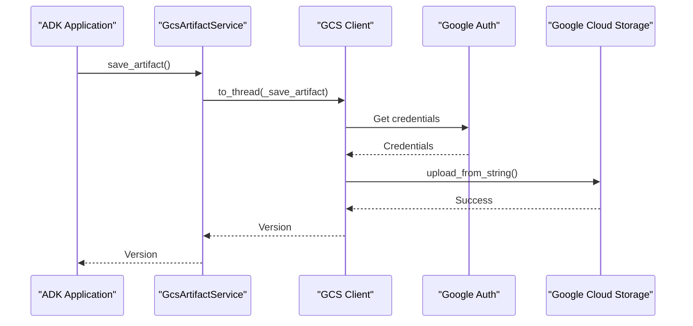
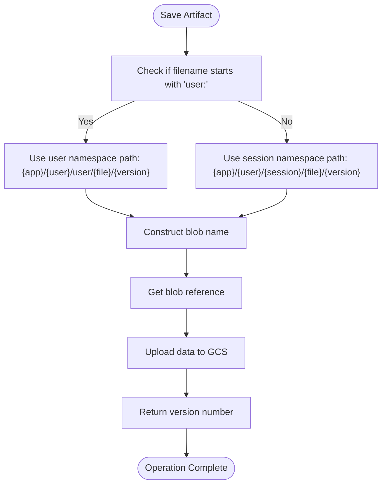
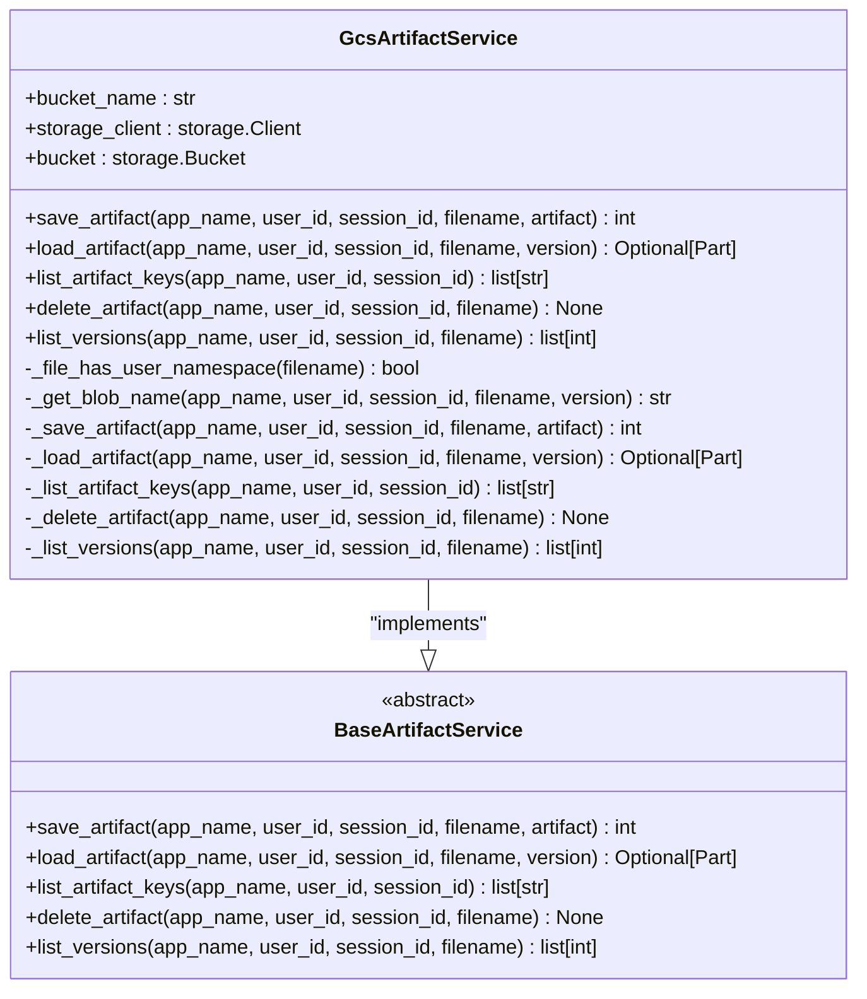

# GCS Artifacts

<cite>
**Referenced Files in This Document**   
- [gcs_artifact_service.py](file://src/google/adk/artifacts/gcs_artifact_service.py)
- [base_artifact_service.py](file://src/google/adk/artifacts/base_artifact_service.py)
- [in_memory_artifact_service.py](file://src/google/adk/artifacts/in_memory_artifact_service.py)
- [settings.py](file://contributing/samples/adk_answering_agent/settings.py)
- [upload_docs_to_vertex_ai_search.py](file://contributing/samples/adk_answering_agent/upload_docs_to_vertex_ai_search.py)
- [runners.py](file://src/google/adk/runners.py)
</cite>

## Table of Contents
1. [Introduction](#introduction)
2. [GcsArtifactService Implementation](#gcsartifactservice-implementation)
3. [Authentication and IAM Configuration](#authentication-and-iam-configuration)
4. [Bucket Configuration and Object Naming](#bucket-configuration-and-object-naming)
5. [Artifact Management Interfaces](#artifact-management-interfaces)
6. [Performance and Cost Optimization](#performance-and-cost-optimization)
7. [Configuration Options](#configuration-options)
8. [Troubleshooting Guide](#troubleshooting-guide)
9. [Conclusion](#conclusion)

## Introduction
The GCS Artifacts sub-feature provides persistent, scalable artifact storage using Google Cloud Storage (GCS) within the ADK Python framework. This documentation details the implementation of the `GcsArtifactService` class, which serves as the primary interface for storing and retrieving artifacts in GCS. The service enables agents to maintain state across sessions, share data between components, and persist important information in a reliable cloud storage system. The implementation follows a modular design pattern with asynchronous operations to ensure non-blocking I/O operations, making it suitable for high-throughput applications.

## GcsArtifactService Implementation

The `GcsArtifactService` class implements the `BaseArtifactService` abstract base class, providing a concrete implementation for GCS-based artifact storage. The service handles all CRUD operations for artifacts, including saving, loading, listing, and deleting artifacts with versioning support. The implementation uses the Google Cloud Storage client library to interact with GCS, wrapping synchronous operations in `asyncio.to_thread()` to maintain asynchronous compatibility.

The service follows a layered architecture where public async methods delegate to private synchronous methods that perform the actual GCS operations. This design pattern allows the service to integrate seamlessly with the async/await paradigm used throughout the ADK framework while leveraging the synchronous GCS client library. The implementation includes comprehensive error handling and logging to facilitate debugging and monitoring.

**Section sources**
- [gcs_artifact_service.py](file://src/google/adk/artifacts/gcs_artifact_service.py#L38-L287)
- [base_artifact_service.py](file://src/google/adk/artifacts/base_artifact_service.py#L23-L124)

## Authentication and IAM Configuration

The `GcsArtifactService` relies on Google Cloud's authentication mechanisms through the `google.auth` library and IAM permissions for secure access to GCS resources. Authentication is handled transparently through the Google Cloud Storage client, which automatically detects and uses available credentials based on the environment. The service supports multiple authentication methods including service account keys, OAuth2, and application default credentials (ADC).

For production deployments, service accounts with least-privilege permissions should be used. The required IAM roles typically include `Storage Object Admin` for full artifact management capabilities or `Storage Object Creator` and `Storage Object Viewer` for more restrictive access. When using OAuth2, the service requires the `https://www.googleapis.com/auth/devstorage.read_write` scope to perform GCS operations.

**Diagram sources **
- [gcs_artifact_service.py](file://src/google/adk/artifacts/gcs_artifact_service.py#L50-L51)
- [gcs_artifact_service.py](file://src/google/adk/artifacts/gcs_artifact_service.py#L183-L186)

**Section sources**
- [gcs_artifact_service.py](file://src/google/adk/artifacts/gcs_artifact_service.py#L50-L51)
- [gcs_artifact_service.py](file://src/google/adk/artifacts/gcs_artifact_service.py#L183-L186)

## Bucket Configuration and Object Naming

The `GcsArtifactService` requires a bucket name to be specified during initialization, which determines the GCS bucket used for artifact storage. The bucket must exist prior to service initialization, as the service does not create buckets automatically. The object naming convention follows a hierarchical structure that incorporates application context, user identity, session information, and versioning.

Two distinct naming patterns are used based on whether the artifact has a user namespace:
- For user-namespaced artifacts (filename starts with "user:"): `{app_name}/{user_id}/user/{filename}/{version}`
- For session-scoped artifacts: `{app_name}/{user_id}/{session_id}/{filename}/{version}`

This naming convention enables efficient listing and retrieval operations while maintaining proper data isolation between applications, users, and sessions. The hierarchical structure also facilitates access control and lifecycle management at various levels of the object hierarchy.

**Diagram sources **
- [gcs_artifact_service.py](file://src/google/adk/artifacts/gcs_artifact_service.py#L138-L160)
- [gcs_artifact_service.py](file://src/google/adk/artifacts/gcs_artifact_service.py#L178-L180)

**Section sources**
- [gcs_artifact_service.py](file://src/google/adk/artifacts/gcs_artifact_service.py#L138-L160)

## Artifact Management Interfaces

The `GcsArtifactService` provides a comprehensive set of interfaces for artifact management, implementing the abstract methods defined in `BaseArtifactService`. These interfaces support versioned artifact storage with automatic version incrementing, enabling applications to maintain artifact history and support rollbacks when needed.

Key interfaces include:
- `save_artifact()`: Saves an artifact and returns the assigned version number
- `load_artifact()`: Retrieves an artifact, with optional version specification
- `list_artifact_keys()`: Lists all artifact filenames within a session
- `delete_artifact()`: Removes all versions of an artifact
- `list_versions()`: Returns all available versions of a specific artifact

The service handles versioning automatically by querying existing versions and incrementing the highest version number. When loading artifacts, if no version is specified, the latest version is returned by default. The implementation uses GCS's object versioning capabilities through the blob name structure rather than GCS's native versioning feature.

**Diagram sources **
- [gcs_artifact_service.py](file://src/google/adk/artifacts/gcs_artifact_service.py#L38-L287)
- [base_artifact_service.py](file://src/google/adk/artifacts/base_artifact_service.py#L23-L124)

**Section sources**
- [gcs_artifact_service.py](file://src/google/adk/artifacts/gcs_artifact_service.py#L53-L124)

## Performance and Cost Optimization

The `GcsArtifactService` implementation includes several performance optimizations to ensure efficient artifact operations. The use of asynchronous methods with `asyncio.to_thread()` allows non-blocking I/O operations, preventing the event loop from being blocked during potentially slow network operations. This design enables concurrent artifact operations and improves overall system throughput.

For large artifacts, the service leverages GCS's resumable upload capabilities through the underlying client library, providing automatic retry mechanisms for failed uploads. The chunked upload feature automatically segments large files into manageable chunks, improving reliability and enabling recovery from partial failures. Network timeouts are handled by the GCS client library with exponential backoff retry strategies.

Cost management can be achieved through strategic use of GCS storage classes. While the service itself doesn't directly manage storage classes, applications can optimize costs by using appropriate bucket configurations with lifecycle policies that automatically transition objects to cheaper storage classes (like Nearline or Coldline) after a specified period. Additionally, the hierarchical naming convention enables efficient data organization for lifecycle management at the prefix level.

**Section sources**
- [gcs_artifact_service.py](file://src/google/adk/artifacts/gcs_artifact_service.py#L63-L70)
- [gcs_artifact_service.py](file://src/google/adk/artifacts/gcs_artifact_service.py#L183-L186)

## Configuration Options

The `GcsArtifactService` can be configured through environment variables and direct initialization parameters. The primary configuration option is the bucket name, which must be provided during service initialization. Additional configuration options can be passed through the `**kwargs` parameter to the constructor, allowing customization of the GCS client behavior.

In production environments, the bucket name is typically sourced from environment variables, as demonstrated in the `adk_answering_agent` sample application. The `GCS_BUCKET_NAME` environment variable is used to configure the bucket name, enabling environment-specific configurations without code changes. Project ID can also be specified through environment variables or passed directly to the service.

The service supports all configuration options available in the Google Cloud Storage client, including custom endpoints for testing, emulator configurations, and advanced client settings. These options can be passed through the `**kwargs` parameter during initialization, providing flexibility for various deployment scenarios.

**Section sources**
- [gcs_artifact_service.py](file://src/google/adk/artifacts/gcs_artifact_service.py#L41-L48)
- [settings.py](file://contributing/samples/adk_answering_agent/settings.py#L33)
- [upload_docs_to_vertex_ai_search.py](file://contributing/samples/adk_answering_agent/upload_docs_to_vertex_ai_search.py#L20-L21)

## Troubleshooting Guide

Common issues with the `GcsArtifactService` typically fall into three categories: authentication failures, quota limits, and network timeouts. Authentication failures often occur when credentials are not properly configured or when the service account lacks sufficient permissions. To resolve authentication issues, verify that the appropriate authentication method is configured and that the service account has the required IAM roles.

Quota limits may be encountered when performing high-volume operations. GCS has various quotas on operations per second and storage capacity. When quota limits are reached, implement exponential backoff retry logic or request quota increases through the Google Cloud Console. Monitoring tools like Cloud Monitoring can help identify quota usage patterns.

Network timeouts can occur during upload or download operations, particularly with large artifacts. The GCS client library includes built-in retry mechanisms, but applications may need to implement additional retry logic for transient failures. For large file operations, consider using resumable uploads and downloads to improve reliability.

When debugging issues, enable detailed logging to capture the sequence of operations and error messages. The service uses Python's logging module with a logger named "google_adk." + __name__, which can be configured to capture debug-level information for troubleshooting.

**Section sources**
- [gcs_artifact_service.py](file://src/google/adk/artifacts/gcs_artifact_service.py#L35)
- [upload_docs_to_vertex_ai_search.py](file://contributing/samples/adk_answering_agent/upload_docs_to_vertex_ai_search.py#L49-L51)
- [gcs_artifact_service.py](file://src/google/adk/artifacts/gcs_artifact_service.py#L214-L216)

## Conclusion
The GCS Artifacts implementation in the ADK Python framework provides a robust, scalable solution for persistent artifact storage using Google Cloud Storage. The `GcsArtifactService` class offers a comprehensive interface for managing versioned artifacts with proper isolation between applications, users, and sessions. By leveraging Google Cloud's authentication and IAM systems, the service ensures secure access to storage resources while maintaining compatibility with various deployment scenarios.

The implementation balances performance and reliability through asynchronous operations, automatic versioning, and integration with GCS's built-in features for resumable uploads and error handling. The flexible configuration options and clear separation of concerns make it suitable for both development and production environments. With proper configuration and monitoring, the GCS Artifacts sub-feature can serve as a reliable foundation for applications requiring persistent data storage and retrieval capabilities.