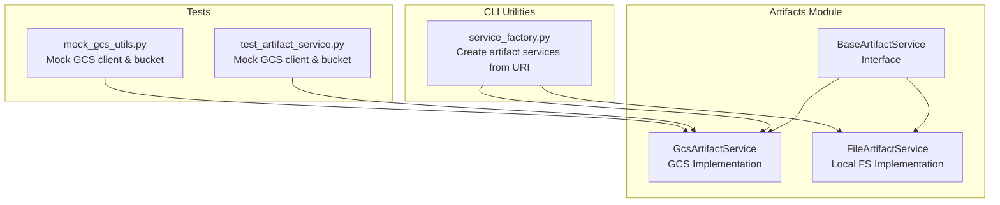
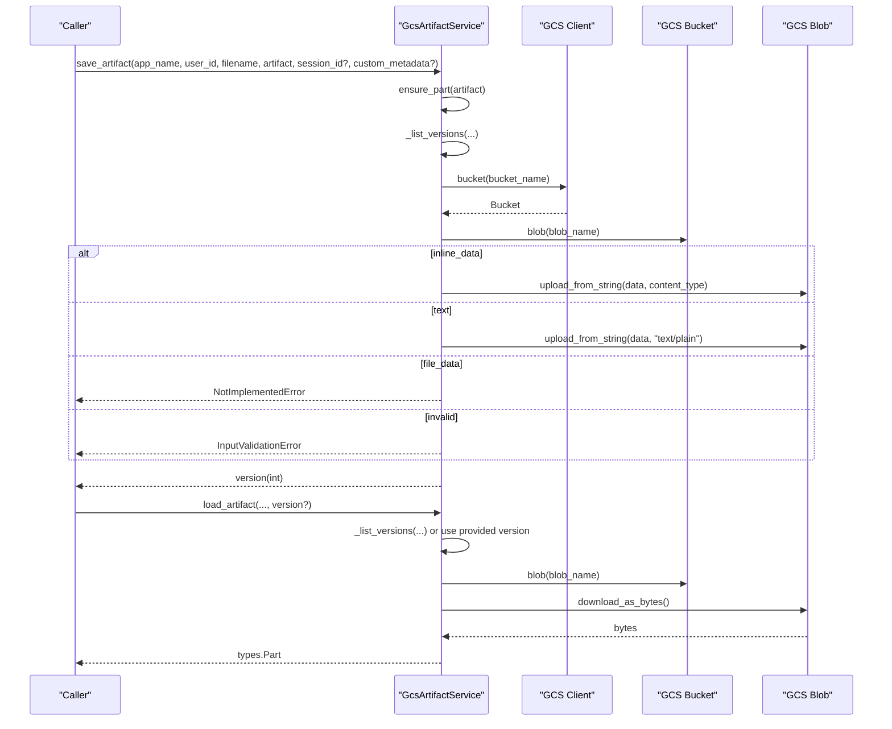
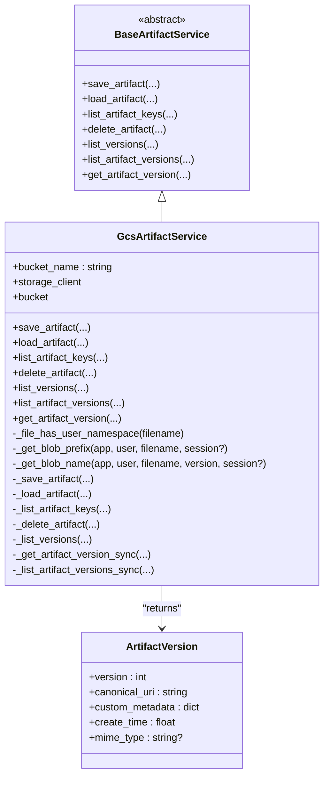
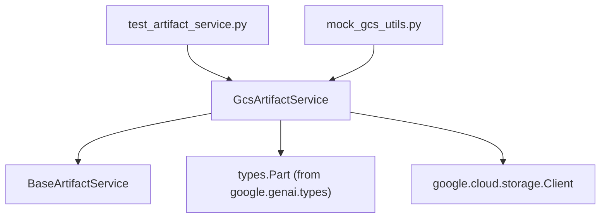

# Google Cloud Storage Artifact Service

<cite>
**Referenced Files in This Document**
- [gcs_artifact_service.py](file://src/google/adk/artifacts/gcs_artifact_service.py)
- [base_artifact_service.py](file://src/google/adk/artifacts/base_artifact_service.py)
- [file_artifact_service.py](file://src/google/adk/artifacts/file_artifact_service.py)
- [service_factory.py](file://src/google/adk/cli/utils/service_factory.py)
- [test_artifact_service.py](file://tests/unittests/artifacts/test_artifact_service.py)
- [mock_gcs_utils.py](file://tests/unittests/evaluation/mock_gcs_utils.py)
- [bigquery_agent_analytics_plugin.py](file://src/google/adk/plugins/bigquery_agent_analytics_plugin.py)
- [upload_docs_to_vertex_ai_search.py](file://contributing/samples/adk_answering_agent/upload_docs_to_vertex_ai_search.py)
</cite>

## Table of Contents
1. [Introduction](#introduction)
2. [Project Structure](#project-structure)
3. [Core Components](#core-components)
4. [Architecture Overview](#architecture-overview)
5. [Detailed Component Analysis](#detailed-component-analysis)
6. [Dependency Analysis](#dependency-analysis)
7. [Performance Considerations](#performance-considerations)
8. [Troubleshooting Guide](#troubleshooting-guide)
9. [Conclusion](#conclusion)
10. [Appendices](#appendices)

## Introduction
This document explains the Google Cloud Storage (GCS) artifact service implementation within the ADK Python codebase. It covers authentication mechanisms, bucket configuration, object naming conventions, storage hierarchy, metadata management, versioning, lifecycle considerations, and operational guidance for production deployments. It also provides troubleshooting tips and references to related components that integrate with GCS.

## Project Structure
The GCS artifact service is implemented as a concrete artifact service that adheres to a shared interface. Supporting components include a base artifact service abstraction, a file-based artifact service for local development, and a CLI service factory that constructs artifact services from URIs. Unit tests include mocks for GCS to validate behavior without external dependencies.

**Diagram sources**
- [gcs_artifact_service.py](file://src/google/adk/artifacts/gcs_artifact_service.py#L43-L466)
- [base_artifact_service.py](file://src/google/adk/artifacts/base_artifact_service.py#L88-L262)
- [file_artifact_service.py](file://src/google/adk/artifacts/file_artifact_service.py#L189-L726)
- [service_factory.py](file://src/google/adk/cli/utils/service_factory.py#L272-L329)
- [test_artifact_service.py](file://tests/unittests/artifacts/test_artifact_service.py#L79-L168)
- [mock_gcs_utils.py](file://tests/unittests/evaluation/mock_gcs_utils.py#L106-L117)

**Section sources**
- [gcs_artifact_service.py](file://src/google/adk/artifacts/gcs_artifact_service.py#L15-L58)
- [base_artifact_service.py](file://src/google/adk/artifacts/base_artifact_service.py#L88-L262)
- [file_artifact_service.py](file://src/google/adk/artifacts/file_artifact_service.py#L189-L726)
- [service_factory.py](file://src/google/adk/cli/utils/service_factory.py#L272-L329)

## Core Components
- GcsArtifactService: Implements artifact persistence on GCS with versioning, metadata, and listing capabilities. It constructs GCS object names using app_name, user_id, optional session_id, filename, and version.
- BaseArtifactService: Defines the artifact service interface and shared models like ArtifactVersion and ensure_part normalization.
- FileArtifactService: Provides a local filesystem-based artifact service with a compatible API for development and testing.
- ServiceFactory: Creates artifact services from URIs, supporting GCS and local storage with runtime detection and fallbacks.

Key behaviors:
- Object naming convention: Uses hierarchical prefixes and appends the version as the final path segment.
- Metadata: Stores custom metadata on GCS blobs; exposes metadata via ArtifactVersion.
- Versioning: Maintains monotonically increasing integer versions; supports listing and retrieving specific versions.
- Authentication: Relies on the Google Cloud client library’s default credentials resolution.

**Section sources**
- [gcs_artifact_service.py](file://src/google/adk/artifacts/gcs_artifact_service.py#L43-L58)
- [base_artifact_service.py](file://src/google/adk/artifacts/base_artifact_service.py#L34-L86)
- [file_artifact_service.py](file://src/google/adk/artifacts/file_artifact_service.py#L189-L220)
- [service_factory.py](file://src/google/adk/cli/utils/service_factory.py#L272-L329)

## Architecture Overview
The GCS artifact service integrates with the Google Cloud Storage client library. It translates high-level artifact operations into GCS blob operations, managing prefixes, versions, and metadata.

**Diagram sources**
- [gcs_artifact_service.py](file://src/google/adk/artifacts/gcs_artifact_service.py#L60-L274)

## Detailed Component Analysis

### GcsArtifactService
Responsibilities:
- Initialize with a bucket name and optional client kwargs.
- Save artifacts with automatic version assignment and optional custom metadata.
- Load artifacts, defaulting to the latest version if none specified.
- List artifact keys within a session or user scope.
- Delete artifacts by removing all versions.
- List and fetch artifact versions with metadata.

Object naming and hierarchy:
- User-scoped artifacts (filename starts with "user:"): app_name/user_id/user/{filename}/{version}
- Session-scoped artifacts: app_name/user_id/{session_id}/{filename}/{version}
- Validation ensures a session_id is provided for session-scoped artifacts.

Versioning:
- Versions are integers starting at 0.
- Listing versions filters blobs by the prefix and extracts numeric version segments.

Metadata:
- Custom metadata is stored on the GCS blob.
- ArtifactVersion exposes version, canonical URI, creation time, MIME type, and custom metadata.

Concurrency:
- Public methods dispatch to synchronous helpers via asyncio.to_thread to avoid blocking the event loop.

Error handling:
- InputValidationError for missing session_id for session-scoped artifacts and unsupported artifact types.
- NotImplementedError for file_data artifacts.

**Diagram sources**
- [base_artifact_service.py](file://src/google/adk/artifacts/base_artifact_service.py#L88-L262)
- [gcs_artifact_service.py](file://src/google/adk/artifacts/gcs_artifact_service.py#L43-L466)

**Section sources**
- [gcs_artifact_service.py](file://src/google/adk/artifacts/gcs_artifact_service.py#L43-L58)
- [gcs_artifact_service.py](file://src/google/adk/artifacts/gcs_artifact_service.py#L144-L195)
- [gcs_artifact_service.py](file://src/google/adk/artifacts/gcs_artifact_service.py#L197-L242)
- [gcs_artifact_service.py](file://src/google/adk/artifacts/gcs_artifact_service.py#L244-L274)
- [gcs_artifact_service.py](file://src/google/adk/artifacts/gcs_artifact_service.py#L276-L326)
- [gcs_artifact_service.py](file://src/google/adk/artifacts/gcs_artifact_service.py#L328-L358)
- [gcs_artifact_service.py](file://src/google/adk/artifacts/gcs_artifact_service.py#L360-L429)
- [gcs_artifact_service.py](file://src/google/adk/artifacts/gcs_artifact_service.py#L431-L466)

### BaseArtifactService and ArtifactVersion
- Defines the artifact service contract and shared models.
- ArtifactVersion captures version metadata including canonical URI, creation time, MIME type, and custom metadata.
- ensure_part normalizes incoming dictionaries to types.Part for consistent handling.

**Section sources**
- [base_artifact_service.py](file://src/google/adk/artifacts/base_artifact_service.py#L34-L86)
- [base_artifact_service.py](file://src/google/adk/artifacts/base_artifact_service.py#L88-L262)

### FileArtifactService (for comparison)
- Provides a local filesystem-based artifact service with a compatible API.
- Demonstrates the same storage hierarchy semantics (user/session scoping) for local development and testing.
- Useful for validating logic without GCS dependencies.

**Section sources**
- [file_artifact_service.py](file://src/google/adk/artifacts/file_artifact_service.py#L189-L220)
- [file_artifact_service.py](file://src/google/adk/artifacts/file_artifact_service.py#L312-L403)
- [file_artifact_service.py](file://src/google/adk/artifacts/file_artifact_service.py#L477-L519)

### ServiceFactory and URI-based instantiation
- Creates artifact services from URIs, with runtime detection and fallbacks.
- Supports GCS artifact services via the registry and falls back to in-memory services when local storage is disabled or unavailable.

**Section sources**
- [service_factory.py](file://src/google/adk/cli/utils/service_factory.py#L272-L329)

## Dependency Analysis
- GcsArtifactService depends on the Google Cloud Storage client library and the base artifact service interface.
- Tests provide mock clients and buckets to validate GCS operations without external dependencies.
- Related components (e.g., analytics plugin) demonstrate GCS offloading patterns that complement the artifact service.

**Diagram sources**
- [gcs_artifact_service.py](file://src/google/adk/artifacts/gcs_artifact_service.py#L32-L38)
- [test_artifact_service.py](file://tests/unittests/artifacts/test_artifact_service.py#L143-L168)
- [mock_gcs_utils.py](file://tests/unittests/evaluation/mock_gcs_utils.py#L106-L117)

**Section sources**
- [gcs_artifact_service.py](file://src/google/adk/artifacts/gcs_artifact_service.py#L32-L38)
- [test_artifact_service.py](file://tests/unittests/artifacts/test_artifact_service.py#L143-L168)
- [mock_gcs_utils.py](file://tests/unittests/evaluation/mock_gcs_utils.py#L106-L117)

## Performance Considerations
- Concurrency: Methods are dispatched to threads to avoid blocking the event loop, enabling concurrent artifact operations.
- Versioning overhead: Listing versions performs prefix-based blob enumeration; ensure appropriate bucket and prefix design to minimize listing costs.
- Metadata storage: Custom metadata is stored on GCS blobs; keep metadata concise to reduce storage overhead.
- Large content: The current implementation supports inline data and text; offloading large content to GCS and referencing via URIs is demonstrated in related components.

[No sources needed since this section provides general guidance]

## Troubleshooting Guide
Common issues and resolutions:
- Missing session_id for session-scoped artifacts: The service raises an input validation error. Ensure session_id is provided for session-scoped files.
- Unsupported artifact types: Saving artifacts with file_data is not supported; use inline_data or text.
- Empty or missing blobs: Loading returns None when no versions exist or when the blob has no content.
- Authentication failures: Ensure the environment provides valid Google Cloud credentials (Application Default Credentials or explicit service account configuration).
- Local storage fallback: In managed environments, local artifact storage may be disabled; the factory falls back to in-memory services.

Validation and mocking:
- Unit tests include mock GCS client and bucket implementations to simulate GCS behavior during testing.

**Section sources**
- [gcs_artifact_service.py](file://src/google/adk/artifacts/gcs_artifact_service.py#L167-L171)
- [gcs_artifact_service.py](file://src/google/adk/artifacts/gcs_artifact_service.py#L232-L240)
- [gcs_artifact_service.py](file://src/google/adk/artifacts/gcs_artifact_service.py#L259-L274)
- [test_artifact_service.py](file://tests/unittests/artifacts/test_artifact_service.py#L79-L132)
- [service_factory.py](file://src/google/adk/cli/utils/service_factory.py#L129-L143)

## Conclusion
The GCS artifact service provides a robust, versioned, and metadata-aware artifact storage layer integrated with Google Cloud Storage. It follows a clear naming convention, supports user and session scoping, and offers a consistent API across implementations. Production deployments should focus on proper authentication, bucket configuration, and operational monitoring, while leveraging the provided abstractions and tests for reliability.

[No sources needed since this section summarizes without analyzing specific files]

## Appendices

### Authentication and IAM Permissions
- Authentication: The service relies on the Google Cloud client library’s default credential resolution. Configure credentials according to your hosting environment (e.g., Application Default Credentials, service accounts).
- IAM permissions: Ensure the identity has permissions to list, read, write, and delete objects within the target bucket.

[No sources needed since this section provides general guidance]

### Configuration Options
- Bucket name: Provided during initialization of GcsArtifactService.
- Region and storage class: Managed at the bucket level; configure via Google Cloud Console or APIs.
- Custom metadata: Supported via the custom_metadata parameter on save.

**Section sources**
- [gcs_artifact_service.py](file://src/google/adk/artifacts/gcs_artifact_service.py#L46-L57)
- [gcs_artifact_service.py](file://src/google/adk/artifacts/gcs_artifact_service.py#L219-L220)

### Object Naming Conventions
- User-scoped: app_name/user_id/user/{filename}/{version}
- Session-scoped: app_name/user_id/{session_id}/{filename}/{version}

**Section sources**
- [gcs_artifact_service.py](file://src/google/adk/artifacts/gcs_artifact_service.py#L164-L171)
- [gcs_artifact_service.py](file://src/google/adk/artifacts/gcs_artifact_service.py#L193-L195)

### Versioning and Lifecycle Policies
- Versioning: Integer-based, monotonically increasing; listing returns all versions for a given artifact.
- Lifecycle: Not enforced by the service; configure bucket lifecycle policies externally if needed.

**Section sources**
- [gcs_artifact_service.py](file://src/google/adk/artifacts/gcs_artifact_service.py#L207-L213)
- [gcs_artifact_service.py](file://src/google/adk/artifacts/gcs_artifact_service.py#L328-L358)

### Large Files and Offloading
- Inline data and text are supported directly.
- Offloading large content to GCS and referencing via URIs is demonstrated in related components.

**Section sources**
- [gcs_artifact_service.py](file://src/google/adk/artifacts/gcs_artifact_service.py#L222-L231)
- [bigquery_agent_analytics_plugin.py](file://src/google/adk/plugins/bigquery_agent_analytics_plugin.py#L1310-L1330)

### Cost Optimization and Regional Considerations
- Choose appropriate storage classes and regions aligned with access patterns and latency requirements.
- Enable lifecycle policies to transition or delete older versions to reduce storage costs.

[No sources needed since this section provides general guidance]

### Backup Policies
- Back up critical artifacts by exporting bucket contents or enabling versioning and retention policies at the bucket level.

[No sources needed since this section provides general guidance]

### Production Deployment Examples
- Use the CLI service factory to instantiate GCS artifact services from URIs.
- For Vertex AI Search documentation uploads, see the sample script for GCS operations.

**Section sources**
- [service_factory.py](file://src/google/adk/cli/utils/service_factory.py#L272-L329)
- [upload_docs_to_vertex_ai_search.py](file://contributing/samples/adk_answering_agent/upload_docs_to_vertex_ai_search.py#L35-L72)

### Monitoring Setup
- Monitor GCS operations using standard Google Cloud monitoring and logging.
- Track artifact service usage and error rates in your application logs.

[No sources needed since this section provides general guidance]

### Integration with Google Cloud Billing and Quotas
- Configure budgets and quotas at the project level.
- Monitor API usage and adjust quotas as needed.

[No sources needed since this section provides general guidance]