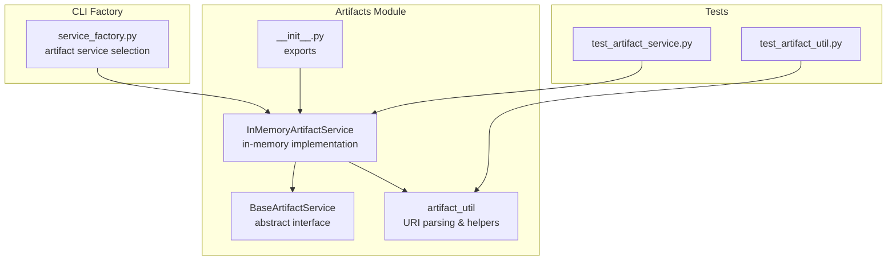
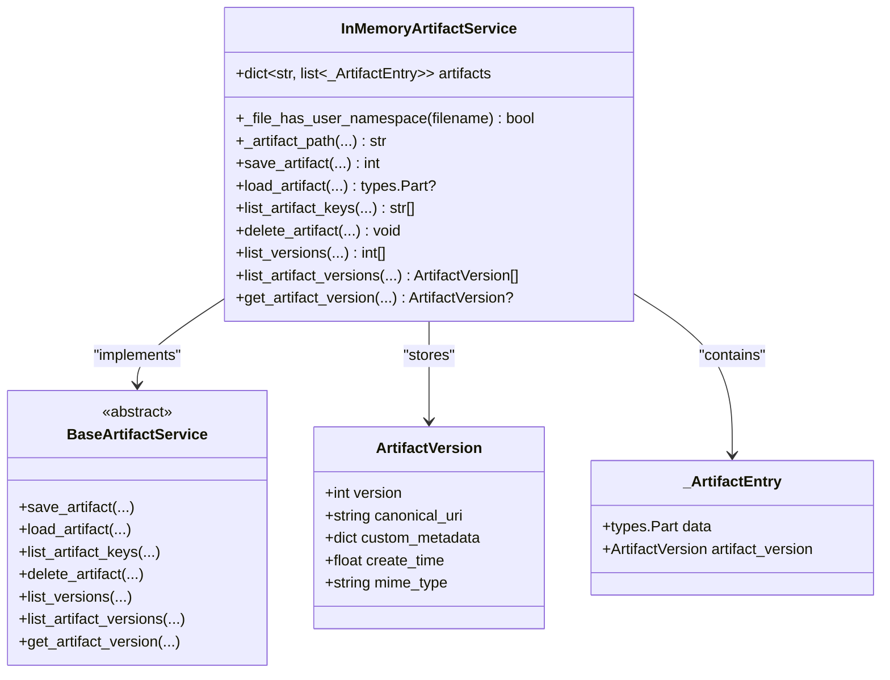
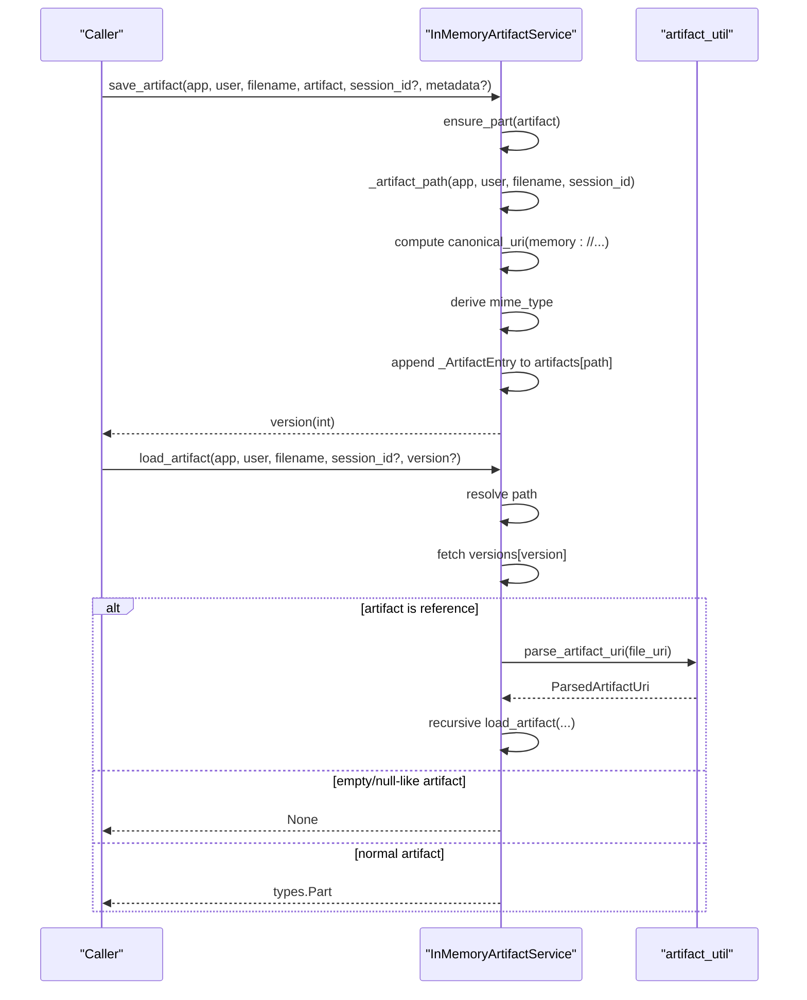
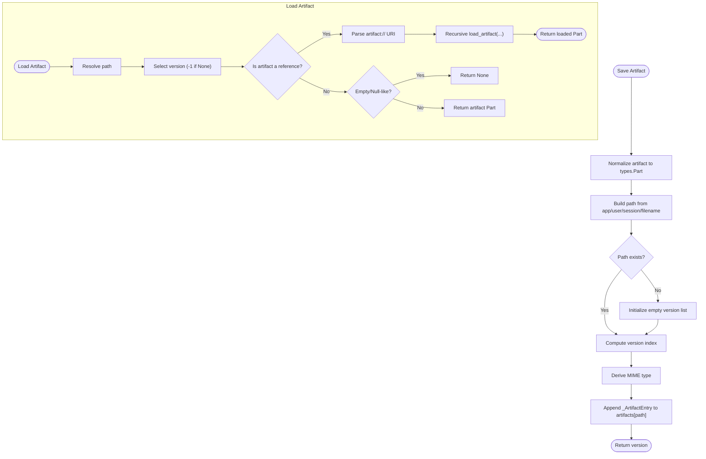
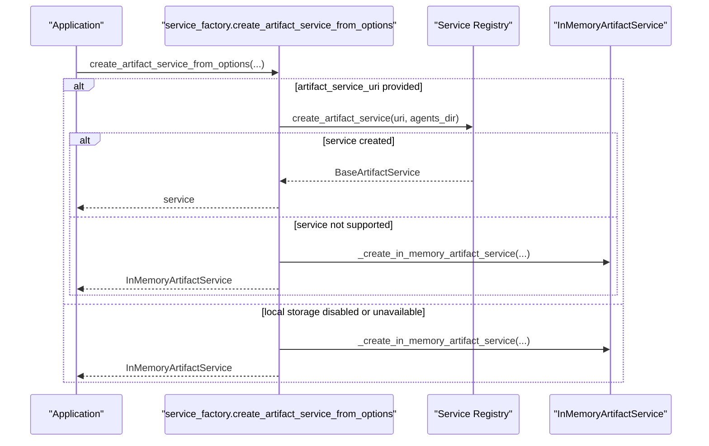
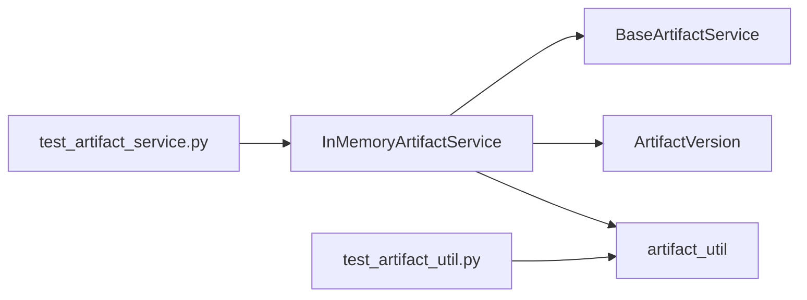

# In-Memory Artifact Service

<cite>
**Referenced Files in This Document**
- [in_memory_artifact_service.py](file://src/google/adk/artifacts/in_memory_artifact_service.py)
- [base_artifact_service.py](file://src/google/adk/artifacts/base_artifact_service.py)
- [artifact_util.py](file://src/google/adk/artifacts/artifact_util.py)
- [__init__.py](file://src/google/adk/artifacts/__init__.py)
- [service_factory.py](file://src/google/adk/cli/utils/service_factory.py)
- [test_artifact_service.py](file://tests/unittests/artifacts/test_artifact_service.py)
- [test_artifact_util.py](file://tests/unittests/artifacts/test_artifact_util.py)
</cite>

## Table of Contents
1. [Introduction](#introduction)
2. [Project Structure](#project-structure)
3. [Core Components](#core-components)
4. [Architecture Overview](#architecture-overview)
5. [Detailed Component Analysis](#detailed-component-analysis)
6. [Dependency Analysis](#dependency-analysis)
7. [Performance Considerations](#performance-considerations)
8. [Troubleshooting Guide](#troubleshooting-guide)
9. [Conclusion](#conclusion)
10. [Appendices](#appendices)

## Introduction
This document describes the in-memory artifact service implementation used for temporary, runtime-only artifact storage during development and testing. It explains how the service stores artifacts in memory, manages artifact versions, resolves cross-artifact references, and integrates with the broader artifact service ecosystem. It also covers lifecycle management, memory usage patterns, limitations, configuration fallbacks, and best practices for testing and debugging.

## Project Structure
The in-memory artifact service is part of the artifacts module and implements the shared artifact service interface. It relies on utility functions for URI parsing and normalization helpers.

**Diagram sources**
- [in_memory_artifact_service.py](file://src/google/adk/artifacts/in_memory_artifact_service.py#L49-L282)
- [base_artifact_service.py](file://src/google/adk/artifacts/base_artifact_service.py#L88-L262)
- [artifact_util.py](file://src/google/adk/artifacts/artifact_util.py#L25-L117)
- [__init__.py](file://src/google/adk/artifacts/__init__.py#L15-L25)
- [service_factory.py](file://src/google/adk/cli/utils/service_factory.py#L272-L329)
- [test_artifact_service.py](file://tests/unittests/artifacts/test_artifact_service.py#L33-L35)
- [test_artifact_util.py](file://tests/unittests/artifacts/test_artifact_util.py#L17-L19)

**Section sources**
- [__init__.py](file://src/google/adk/artifacts/__init__.py#L15-L25)

## Core Components
- InMemoryArtifactService: Implements the artifact service interface with in-memory storage, versioning, and reference resolution.
- BaseArtifactService: Defines the abstract interface and shared data model (ArtifactVersion).
- artifact_util: Provides URI parsing and artifact reference detection.
- service_factory: Creates artifact services from configuration, including fallback to in-memory when local storage is unavailable or disabled.

Key capabilities:
- Save/load/list/delete artifacts with versioning.
- Support user-scoped and session-scoped artifacts.
- Resolve artifact references across versions and paths.
- Generate canonical URIs for versions.

**Section sources**
- [in_memory_artifact_service.py](file://src/google/adk/artifacts/in_memory_artifact_service.py#L49-L282)
- [base_artifact_service.py](file://src/google/adk/artifacts/base_artifact_service.py#L34-L86)
- [artifact_util.py](file://src/google/adk/artifacts/artifact_util.py#L25-L117)
- [service_factory.py](file://src/google/adk/cli/utils/service_factory.py#L272-L329)

## Architecture Overview
The in-memory artifact service adheres to the BaseArtifactService interface and uses an internal dictionary keyed by artifact path to store ordered lists of artifact versions. Each version carries metadata (ArtifactVersion) including canonical URI, MIME type, custom metadata, and timestamps.

**Diagram sources**
- [base_artifact_service.py](file://src/google/adk/artifacts/base_artifact_service.py#L34-L86)
- [in_memory_artifact_service.py](file://src/google/adk/artifacts/in_memory_artifact_service.py#L36-L56)
- [in_memory_artifact_service.py](file://src/google/adk/artifacts/in_memory_artifact_service.py#L49-L282)

## Detailed Component Analysis

### InMemoryArtifactService Implementation
- Storage model: A dictionary mapping a constructed path string to a list of _ArtifactEntry instances. The path encodes app, user, session, and filename semantics.
- Versioning: Each saved artifact increments the version index; latest version defaults to the last element.
- User vs session scoping: Filenames starting with "user:" are treated as cross-session user-scoped; others require a session_id.
- Canonical URIs: Memory-backed URIs are generated for versions; external services produce their own scheme-specific URIs.
- MIME type inference: Derived from inline_data, text, or file_data; references defer MIME type determination to the referenced artifact.
- Reference resolution: If an artifact part references another artifact via artifact:// URI, the loader recursively loads the referenced artifact.

**Diagram sources**
- [in_memory_artifact_service.py](file://src/google/adk/artifacts/in_memory_artifact_service.py#L98-L197)
- [artifact_util.py](file://src/google/adk/artifacts/artifact_util.py#L43-L75)

**Section sources**
- [in_memory_artifact_service.py](file://src/google/adk/artifacts/in_memory_artifact_service.py#L49-L282)
- [artifact_util.py](file://src/google/adk/artifacts/artifact_util.py#L25-L117)

### Data Structures and Memory Management
- artifacts: dict[str, list[_ArtifactEntry]]
  - Key: path string constructed from app, user, session, and filename.
  - Value: ordered list of _ArtifactEntry items representing versions.
- _ArtifactEntry: Holds the artifact payload (types.Part) and its version metadata (ArtifactVersion).
- Memory usage patterns:
  - Linear growth proportional to number of artifacts × number of versions.
  - Each version stores a full Part object; large payloads increase memory footprint.
  - No eviction or TTL; memory persists until the process ends or the service instance is discarded.

Complexity:
- Save: O(1) average (dictionary insert; list append).
- Load: O(1) average (dictionary lookup; list indexing).
- List keys: O(n) over stored paths to filter by prefix.
- Delete: O(1) average (pop from dictionary).

**Section sources**
- [in_memory_artifact_service.py](file://src/google/adk/artifacts/in_memory_artifact_service.py#L56-L282)

### Lifecycle of In-Memory Artifacts
- Creation: save_artifact creates a new version and appends it to the version list for the computed path.
- Modification: successive saves create new versions; earlier versions remain accessible.
- Access: load_artifact retrieves a specific or latest version; list_versions enumerates all versions.
- Cleanup: delete_artifact removes the entire path entry; there is no per-version deletion.
- Reference resolution: load_artifact follows artifact:// URIs to other artifacts, enabling cross-artifact composition.

**Diagram sources**
- [in_memory_artifact_service.py](file://src/google/adk/artifacts/in_memory_artifact_service.py#L98-L197)

**Section sources**
- [in_memory_artifact_service.py](file://src/google/adk/artifacts/in_memory_artifact_service.py#L98-L282)

### Configuration and Integration
- Service selection: create_artifact_service_from_options chooses an artifact service based on URI and local storage availability. If unsupported or disabled, it falls back to InMemoryArtifactService.
- Export and discovery: The artifacts package exports InMemoryArtifactService alongside other implementations, enabling easy injection in tests and development.

**Diagram sources**
- [service_factory.py](file://src/google/adk/cli/utils/service_factory.py#L272-L329)

**Section sources**
- [service_factory.py](file://src/google/adk/cli/utils/service_factory.py#L272-L329)
- [__init__.py](file://src/google/adk/artifacts/__init__.py#L15-L25)

## Dependency Analysis
- InMemoryArtifactService depends on:
  - BaseArtifactService for the interface contract.
  - ArtifactVersion for version metadata.
  - artifact_util for URI parsing and reference detection.
- Tests validate behavior across implementations (InMemory, File, GCS) and exercise reference resolution and URI handling.

**Diagram sources**
- [in_memory_artifact_service.py](file://src/google/adk/artifacts/in_memory_artifact_service.py#L27-L31)
- [base_artifact_service.py](file://src/google/adk/artifacts/base_artifact_service.py#L34-L66)
- [artifact_util.py](file://src/google/adk/artifacts/artifact_util.py#L25-L117)
- [test_artifact_service.py](file://tests/unittests/artifacts/test_artifact_service.py#L33-L35)
- [test_artifact_util.py](file://tests/unittests/artifacts/test_artifact_util.py#L17-L19)

**Section sources**
- [test_artifact_service.py](file://tests/unittests/artifacts/test_artifact_service.py#L33-L35)
- [test_artifact_util.py](file://tests/unittests/artifacts/test_artifact_util.py#L17-L19)

## Performance Considerations
- Time complexity:
  - Save/load are O(1) average due to dictionary and list operations.
  - Listing keys is O(n) over stored paths.
- Memory usage:
  - Proportional to total stored bytes across all versions.
  - No eviction or compression; memory grows monotonically until process termination.
- Garbage collection:
  - Python GC will reclaim memory when references drop; however, in long-running processes, memory may accumulate across many artifacts and versions.
- Scalability:
  - Not designed for multi-threaded production use; avoid in concurrent server environments.
  - Suitable for ephemeral processing, testing, and development where restarts are acceptable.

[No sources needed since this section provides general guidance]

## Troubleshooting Guide
Common issues and resolutions:
- Session ID required for session-scoped artifacts: Saving a session-scoped artifact without a session_id raises an input validation error. Ensure session_id is provided for non-user-scoped filenames.
- Invalid artifact reference URI: Loading an artifact with a malformed artifact:// URI raises an input validation error. Verify the referenced artifact exists and the URI is well-formed.
- Empty/None artifacts: Loading an empty or null-like artifact returns None. Validate that the artifact was saved with valid content.
- Cross-artifact references: Ensure referenced artifacts are saved first; the loader will recursively resolve references.

**Section sources**
- [in_memory_artifact_service.py](file://src/google/adk/artifacts/in_memory_artifact_service.py#L92-L94)
- [in_memory_artifact_service.py](file://src/google/adk/artifacts/in_memory_artifact_service.py#L179-L182)
- [in_memory_artifact_service.py](file://src/google/adk/artifacts/in_memory_artifact_service.py#L191-L196)

## Conclusion
The in-memory artifact service provides a lightweight, ephemeral storage mechanism ideal for testing, development, and short-lived processing. It supports versioning, user/session scoping, and artifact references while maintaining simplicity and low overhead. For production, prefer persistent services and configure fallbacks to in-memory only when necessary.

[No sources needed since this section summarizes without analyzing specific files]

## Appendices

### Use Cases and Best Practices
- Testing: Use in-memory artifacts to isolate tests and avoid disk/GCS dependencies.
- Development: Rapid iteration with temporary artifacts that persist only for the lifetime of the process.
- Ephemeral processing: Short-lived jobs where artifacts are not required after completion.

Limitations:
- No persistence across restarts.
- No eviction or memory limits.
- Not suitable for multi-threaded production environments.

Configuration options:
- Fallback behavior: The service factory automatically selects in-memory when local storage is disabled or unavailable.
- No explicit memory limits or eviction policies in the implementation; manage artifact volume externally.

**Section sources**
- [service_factory.py](file://src/google/adk/cli/utils/service_factory.py#L272-L329)
- [in_memory_artifact_service.py](file://src/google/adk/artifacts/in_memory_artifact_service.py#L50-L54)

### Example Scenarios and Debugging Techniques
- Unit tests: Exercise save/load/delete and version enumeration across implementations to validate behavior.
- Reference resolution: Create artifacts with artifact:// URIs and verify recursive loading.
- URI correctness: Validate parsing and construction of artifact URIs using utility functions.

**Section sources**
- [test_artifact_service.py](file://tests/unittests/artifacts/test_artifact_service.py#L188-L800)
- [test_artifact_util.py](file://tests/unittests/artifacts/test_artifact_util.py#L22-L110)