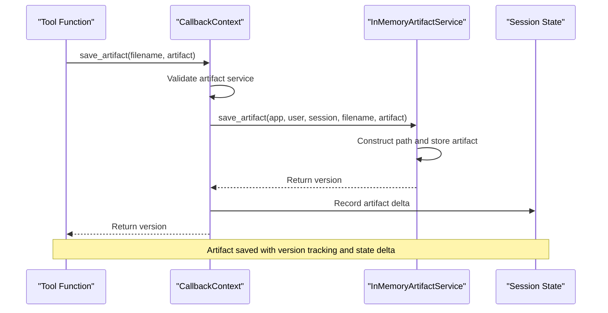

# In-memory Artifacts

<cite>
**Referenced Files in This Document**   
- [in_memory_artifact_service.py](file://src/google/adk/artifacts/in_memory_artifact_service.py)
- [base_artifact_service.py](file://src/google/adk/artifacts/base_artifact_service.py)
- [agent.py](file://contributing/samples/artifact_save_text/agent.py)
- [tool_context.py](file://src/google/adk/tools/tool_context.py)
- [callback_context.py](file://src/google/adk/agents/callback_context.py)
</cite>

## Table of Contents
1. [Introduction](#introduction)
2. [InMemoryArtifactService Implementation](#inmemoryartifactservice-implementation)
3. [Core Operations](#core-operations)
4. [Integration with Agent Execution Context](#integration-with-agent-execution-context)
5. [Storage Architecture and Data Structures](#storage-architecture-and-data-structures)
6. [Limitations and Considerations](#limitations-and-considerations)
7. [Configuration and Lifecycle Management](#configuration-and-lifecycle-management)
8. [Troubleshooting Guide](#troubleshooting-guide)
9. [Conclusion](#conclusion)

## Introduction
The In-memory Artifacts sub-feature provides transient storage capabilities for development and testing environments within the ADK framework. This documentation details the implementation of the `InMemoryArtifactService` class, which offers a lightweight, non-persistent storage solution for artifacts generated during agent execution. The service is specifically designed for ephemeral use cases where data persistence across sessions is not required, making it ideal for development, testing, and demonstration scenarios. The implementation focuses on simplicity and ease of use while providing essential artifact management functionality through a thread-safe interface.

## InMemoryArtifactService Implementation
The `InMemoryArtifactService` class implements the `BaseArtifactService` interface, providing in-memory storage for artifacts with a straightforward dictionary-based data structure. The service is explicitly designed for single-threaded development and testing environments, as noted in its documentation, and is not suitable for multi-threaded production use. The implementation leverages Pydantic's `BaseModel` for data validation and structure, with a primary `artifacts` field that stores artifact data as a dictionary mapping paths to lists of `types.Part` objects. Each artifact path is constructed using a hierarchical structure that incorporates the application name, user ID, session ID, and filename, enabling organized storage and retrieval.

The service includes specialized methods for handling user namespace artifacts, which are identified by filenames prefixed with "user:". This namespace feature allows for user-scoped artifacts that persist beyond individual sessions, providing a mechanism for storing user-specific data that should be accessible across multiple interactions. The path construction logic automatically routes user namespace artifacts to a dedicated storage path, separating them from session-specific artifacts while maintaining a consistent interface for all operations.

**Section sources**
- [in_memory_artifact_service.py](file://src/google/adk/artifacts/in_memory_artifact_service.py#L29-L67)

## Core Operations
The `InMemoryArtifactService` provides a comprehensive set of operations for artifact management, including saving, loading, listing, and deleting artifacts. The `save_artifact` method stores an artifact by constructing its path from the provided application, user, and session identifiers, then appending the artifact to the list of versions for that path. Each save operation returns a version number, starting from 0 for the first version and incrementing with each subsequent save, enabling version tracking and retrieval of specific artifact iterations.

The `load_artifact` method retrieves artifacts by path, with optional version specification. When no version is specified, the method returns the most recent version (latest) of the artifact. The service also provides `list_artifact_keys` for enumerating all artifacts within a session, which returns a sorted list of filenames for both session-specific and user namespace artifacts. Artifact deletion is handled by the `delete_artifact` method, which removes the entire artifact path from storage, effectively deleting all versions of the specified artifact. Additionally, the `list_versions` method enables inspection of all available versions for a specific artifact, returning a list of version numbers that can be used for version-specific operations.

**Section sources**
- [in_memory_artifact_service.py](file://src/google/adk/artifacts/in_memory_artifact_service.py#L68-L137)

## Integration with Agent Execution Context
Artifacts are tightly integrated with the agent execution context through the `ToolContext` and `CallbackContext` classes, which provide convenient methods for artifact operations within tool implementations. The `CallbackContext` class exposes `save_artifact`, `load_artifact`, and `list_artifacts` methods that abstract the underlying artifact service details, allowing tools to interact with artifacts using only the filename and artifact data. This abstraction simplifies tool development by handling the construction of full artifact paths using the current invocation context's application name, user ID, and session ID.

The integration is demonstrated in the `artifact_save_text` sample, where a tool function uses `tool_context.save_artifact` to store a user query as a text artifact. This pattern enables tools to persist intermediate results, logs, or other data without requiring knowledge of the underlying storage mechanism. When an artifact is saved through the context, the operation is also recorded in the `EventActions` object, ensuring that artifact changes are properly tracked and can be included in the agent's response events. This integration creates a seamless experience for developers, allowing them to focus on tool functionality while the framework handles artifact management and state tracking.



**Diagram sources**
- [callback_context.py](file://src/google/adk/agents/callback_context.py#L89-L110)
- [in_memory_artifact_service.py](file://src/google/adk/artifacts/in_memory_artifact_service.py#L68-L83)
- [tool_context.py](file://src/google/adk/tools/tool_context.py#L31-L47)

**Section sources**
- [callback_context.py](file://src/google/adk/agents/callback_context.py#L66-L119)
- [agent.py](file://contributing/samples/artifact_save_text/agent.py#L21-L27)

## Storage Architecture and Data Structures
The storage architecture of the `InMemoryArtifactService` is built around a hierarchical dictionary structure that maps artifact paths to lists of artifact versions. The primary data structure is a dictionary with string keys (representing artifact paths) and values that are lists of `types.Part` objects. Each path follows the format `{app_name}/{user_id}/{session_id}/{filename}` for session-specific artifacts or `{app_name}/{user_id}/user/{filename}` for user namespace artifacts, creating a clear organizational hierarchy that prevents naming conflicts and enables efficient lookup operations.

The choice of a list for storing artifact versions provides several advantages: it maintains version order naturally, allows for O(1) access to the latest version, and enables simple version numbering through list indexing. When a new artifact is saved, it is appended to the list, and the version number is determined by the list's length before the append operation. This approach ensures that version numbers are sequential and monotonically increasing, providing a reliable way to track artifact evolution. The dictionary-based path mapping enables O(1) average-case lookup time for both individual artifacts and version lists, making the service efficient for typical development and testing workloads.

```mermaid
classDiagram
class InMemoryArtifactService {
+artifacts : dict[str, list[Part]]
+save_artifact(app, user, session, filename, artifact) int
+load_artifact(app, user, session, filename, version) Part
+list_artifact_keys(app, user, session) list[str]
+delete_artifact(app, user, session, filename) None
+list_versions(app, user, session, filename) list[int]
-_artifact_path(app, user, session, filename) str
-_file_has_user_namespace(filename) bool
}
class BaseArtifactService {
<<abstract>>
+save_artifact(app, user, session, filename, artifact) int
+load_artifact(app, user, session, filename, version) Part
+list_artifact_keys(app, user, session) list[str]
+delete_artifact(app, user, session, filename) None
+list_versions(app, user, session, filename) list[int]
}
InMemoryArtifactService --|> BaseArtifactService
InMemoryArtifactService --> "list[Part]" types.Part
note right of InMemoryArtifactService
Implements in-memory storage using
dictionary of paths to version lists
Not thread-safe, for development only
end note
```

**Diagram sources**
- [in_memory_artifact_service.py](file://src/google/adk/artifacts/in_memory_artifact_service.py#L29-L137)
- [base_artifact_service.py](file://src/google/adk/artifacts/base_artifact_service.py#L23-L124)

**Section sources**
- [in_memory_artifact_service.py](file://src/google/adk/artifacts/in_memory_artifact_service.py#L36-L67)

## Limitations and Considerations
The `InMemoryArtifactService` has several important limitations that must be considered when using it in development and testing environments. The most significant limitation is the lack of data persistence across sessions and application restarts, as all artifacts are stored in memory and are lost when the service instance is destroyed. This ephemeral nature makes the service unsuitable for production scenarios where data durability is required, but it is beneficial for development workflows where clean state between test runs is desired.

Another critical consideration is the absence of thread safety in the current implementation. The service does not include synchronization mechanisms to protect against concurrent access from multiple threads, which could lead to race conditions and data corruption in multi-threaded environments. This limitation reinforces the service's intended use for single-threaded development and testing scenarios. Additionally, the service does not implement any memory management or cleanup policies, meaning that artifacts accumulate indefinitely until explicitly deleted or the service is terminated. This behavior could lead to memory exhaustion in long-running test scenarios with high artifact creation rates.

**Section sources**
- [in_memory_artifact_service.py](file://src/google/adk/artifacts/in_memory_artifact_service.py#L30-L34)

## Configuration and Lifecycle Management
The `InMemoryArtifactService` is designed with simplicity in mind, requiring minimal configuration for use in development and testing environments. The service is instantiated without parameters, automatically initializing its internal artifact storage dictionary. Configuration occurs at the runner level, where the service instance is passed to the `Runner` constructor along with other services like session and memory management. This approach allows for easy substitution of different artifact service implementations (such as persistent storage) without modifying the agent or tool code.

Lifecycle management of artifacts is primarily the responsibility of the developer or test framework, as the service does not include automated cleanup mechanisms. Artifacts persist for the duration of the service instance, which typically corresponds to the lifetime of the application or test run. Explicit deletion of artifacts can be performed using the `delete_artifact` method, while bulk cleanup can be achieved by creating a new service instance. For testing scenarios, this lifecycle model enables predictable state management, as tests can start with a clean artifact store by creating a new service instance for each test case.

**Section sources**
- [runners.py](file://src/google/adk/runners.py#L91-L120)

## Troubleshooting Guide
Common issues with the `InMemoryArtifactService` typically relate to artifact visibility, versioning, and lifecycle management. One frequent issue is attempting to access artifacts across different sessions or application restarts, which fails because the in-memory storage is not persistent. Developers should verify that they are using the same service instance and session context when expecting to access previously saved artifacts. Another common issue involves versioning confusion, where developers expect to retrieve a specific version but receive a different one due to misunderstanding the zero-based indexing or the behavior of the latest version default.

Memory-related issues can occur in long-running test scenarios where artifacts accumulate without being deleted. Monitoring memory usage and implementing explicit cleanup of unused artifacts can mitigate this problem. When debugging artifact operations, developers should check the return values of save operations to confirm successful storage and version assignment. Additionally, verifying that the artifact service is properly initialized in the runner configuration is essential, as attempting to use artifact methods without a configured service will raise `ValueError` exceptions. For user namespace artifacts, ensuring that filenames are correctly prefixed with "user:" is critical for proper path construction and storage location.

**Section sources**
- [in_memory_artifact_service.py](file://src/google/adk/artifacts/in_memory_artifact_service.py#L78-L137)
- [callback_context.py](file://src/google/adk/agents/callback_context.py#L79-L119)

## Conclusion
The In-memory Artifacts sub-feature provides a valuable tool for development and testing within the ADK framework, offering a simple and efficient mechanism for transient data storage. The `InMemoryArtifactService` implementation delivers essential artifact management capabilities with a clean, intuitive interface that integrates seamlessly with agent execution contexts. While its limitations in persistence and thread safety make it unsuitable for production use, these characteristics are advantageous for development workflows that require isolated, ephemeral state. By understanding the service's architecture, operations, and constraints, developers can effectively leverage in-memory artifacts to enhance their testing and development processes, building robust agents with proper state management practices.