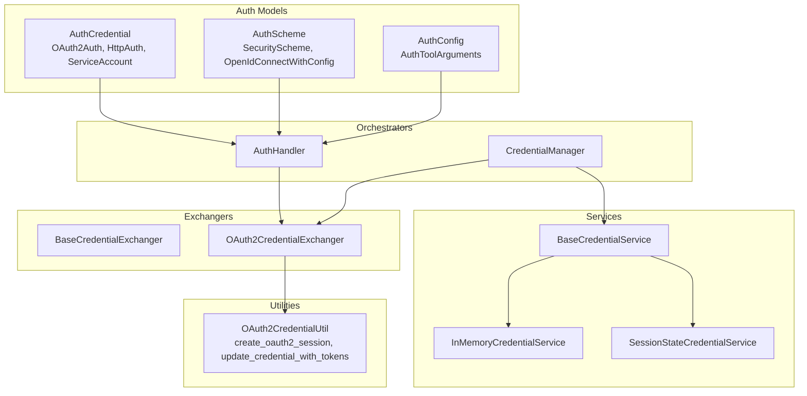
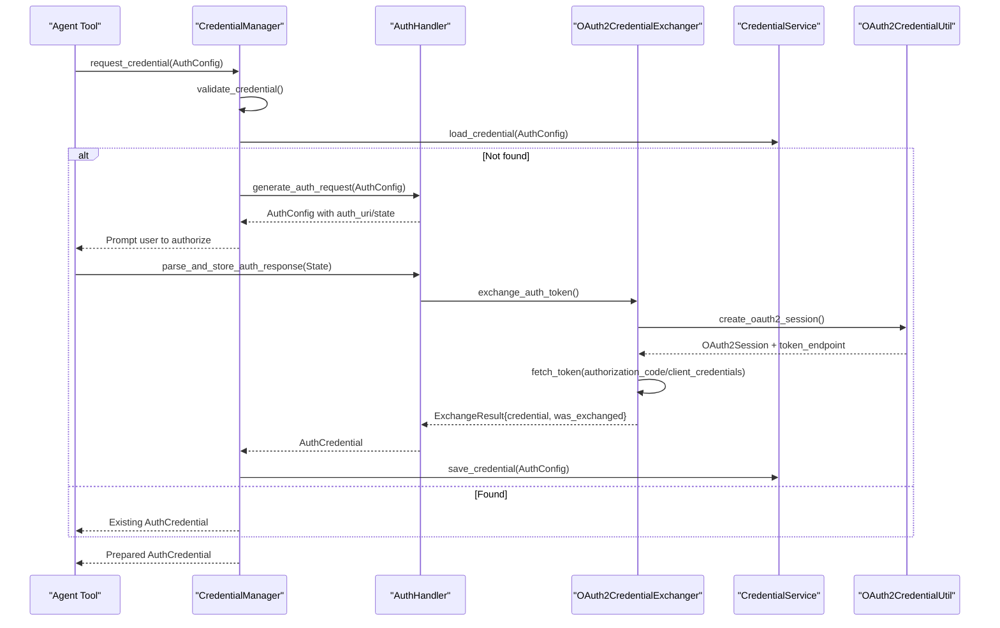
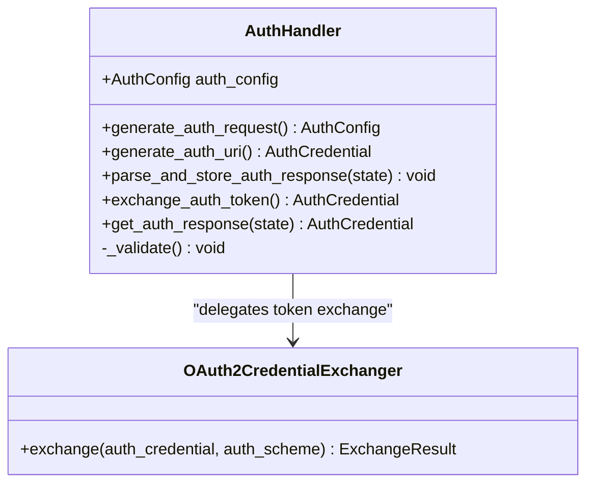
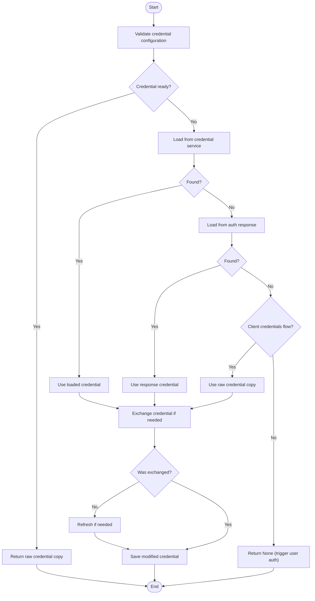
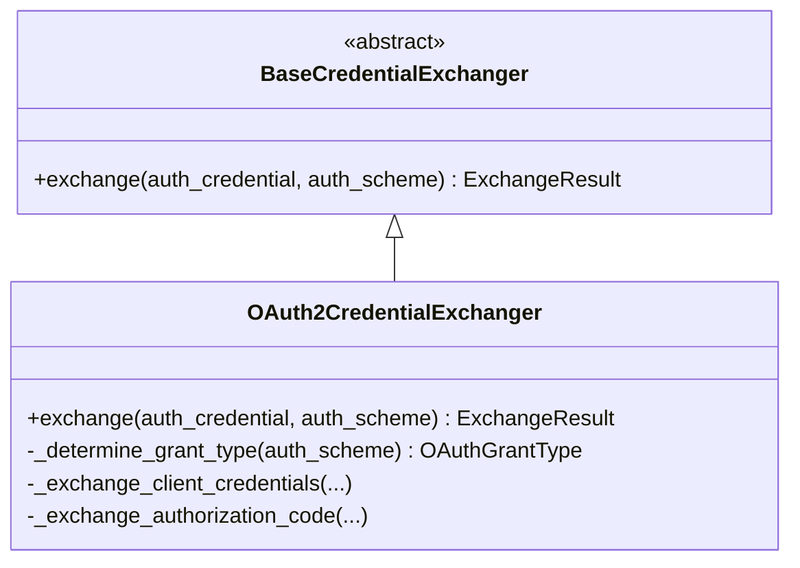
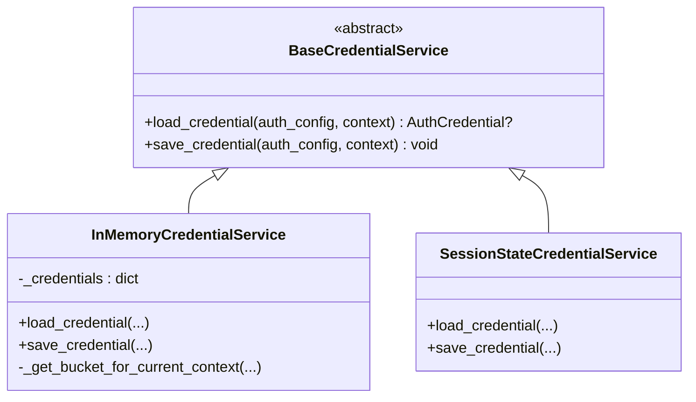
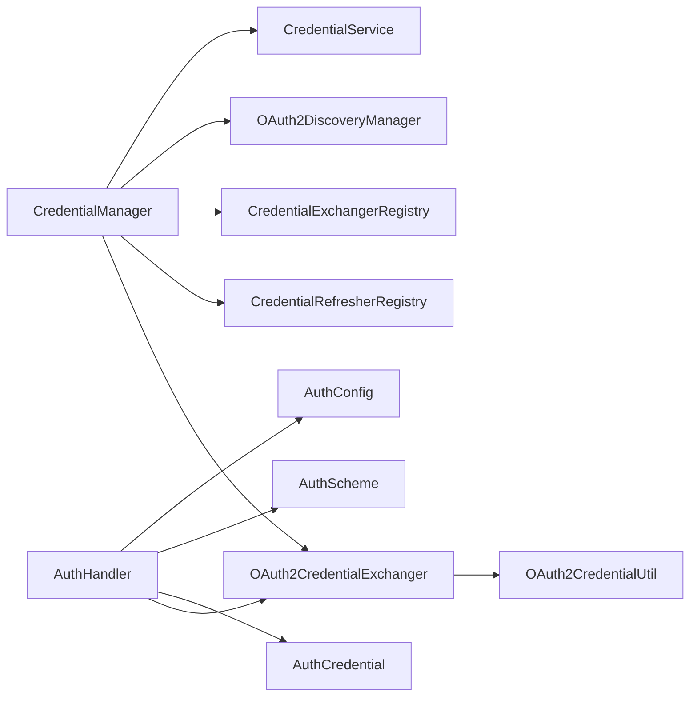

# Authentication Architecture

<cite>
**Referenced Files in This Document**
- [auth_handler.py](file://src/google/adk/auth/auth_handler.py)
- [auth_schemes.py](file://src/google/adk/auth/auth_schemes.py)
- [auth_tool.py](file://src/google/adk/auth/auth_tool.py)
- [auth_credential.py](file://src/google/adk/auth/auth_credential.py)
- [credential_manager.py](file://src/google/adk/auth/credential_manager.py)
- [oauth2_credential_util.py](file://src/google/adk/auth/oauth2_credential_util.py)
- [oauth2_credential_exchanger.py](file://src/google/adk/auth/exchanger/oauth2_credential_exchanger.py)
- [base_credential_exchanger.py](file://src/google/adk/auth/exchanger/base_credential_exchanger.py)
- [base_credential_service.py](file://src/google/adk/auth/credential_service/base_credential_service.py)
- [in_memory_credential_service.py](file://src/google/adk/auth/credential_service/in_memory_credential_service.py)
- [session_state_credential_service.py](file://src/google/adk/auth/credential_service/session_state_credential_service.py)
</cite>

## Table of Contents
1. [Introduction](#introduction)
2. [Project Structure](#project-structure)
3. [Core Components](#core-components)
4. [Architecture Overview](#architecture-overview)
5. [Detailed Component Analysis](#detailed-component-analysis)
6. [Dependency Analysis](#dependency-analysis)
7. [Performance Considerations](#performance-considerations)
8. [Troubleshooting Guide](#troubleshooting-guide)
9. [Conclusion](#conclusion)

## Introduction
This document explains the authentication architecture in the Agent Development Kit (ADK). It focuses on the design principles, component relationships, and the end-to-end authentication pipeline from setup through credential exchange and storage. The AuthHandler class acts as the central orchestrator for credential flows, coordinating with authentication schemes and credential services. The architecture integrates with FastAPI security models and is designed to support both local development and production deployments.

## Project Structure
The authentication subsystem is organized around:
- Schemas and models for authentication credentials and schemes
- Handlers and managers for orchestrating flows
- Exchangers for converting raw credentials into usable tokens
- Credential services for loading and storing credentials
- Utilities for OAuth2 session creation and token updates

**Diagram sources**
- [auth_credential.py](file://src/google/adk/auth/auth_credential.py#L68-L280)
- [auth_schemes.py](file://src/google/adk/auth/auth_schemes.py#L32-L80)
- [auth_tool.py](file://src/google/adk/auth/auth_tool.py#L51-L146)
- [auth_handler.py](file://src/google/adk/auth/auth_handler.py#L38-L209)
- [credential_manager.py](file://src/google/adk/auth/credential_manager.py#L40-L387)
- [oauth2_credential_exchanger.py](file://src/google/adk/auth/exchanger/oauth2_credential_exchanger.py#L46-L212)
- [base_credential_exchanger.py](file://src/google/adk/auth/exchanger/base_credential_exchanger.py#L37-L66)
- [base_credential_service.py](file://src/google/adk/auth/credential_service/base_credential_service.py#L27-L76)
- [in_memory_credential_service.py](file://src/google/adk/auth/credential_service/in_memory_credential_service.py#L28-L67)
- [session_state_credential_service.py](file://src/google/adk/auth/credential_service/session_state_credential_service.py#L28-L84)
- [oauth2_credential_util.py](file://src/google/adk/auth/oauth2_credential_util.py#L33-L120)

**Section sources**
- [auth_handler.py](file://src/google/adk/auth/auth_handler.py#L38-L209)
- [auth_schemes.py](file://src/google/adk/auth/auth_schemes.py#L32-L80)
- [auth_tool.py](file://src/google/adk/auth/auth_tool.py#L51-L146)
- [auth_credential.py](file://src/google/adk/auth/auth_credential.py#L68-L280)
- [credential_manager.py](file://src/google/adk/auth/credential_manager.py#L40-L387)
- [oauth2_credential_exchanger.py](file://src/google/adk/auth/exchanger/oauth2_credential_exchanger.py#L46-L212)
- [base_credential_exchanger.py](file://src/google/adk/auth/exchanger/base_credential_exchanger.py#L37-L66)
- [base_credential_service.py](file://src/google/adk/auth/credential_service/base_credential_service.py#L27-L76)
- [in_memory_credential_service.py](file://src/google/adk/auth/credential_service/in_memory_credential_service.py#L28-L67)
- [session_state_credential_service.py](file://src/google/adk/auth/credential_service/session_state_credential_service.py#L28-L84)
- [oauth2_credential_util.py](file://src/google/adk/auth/oauth2_credential_util.py#L33-L120)

## Core Components
- AuthHandler: Central orchestrator for generating auth requests, parsing and storing auth responses, and exchanging tokens for OAuth2/OIDC flows.
- AuthScheme: Union of FastAPI SecurityScheme and OpenIdConnectWithConfig, enabling OAuth2, OIDC, and implicit flows.
- AuthCredential: Unified model for API key, HTTP bearer/basic, OAuth2, OIDC, and service account credentials.
- AuthConfig: Encapsulates the requested auth scheme, raw credential, exchanged credential, and credential key for persistence.
- CredentialManager: High-level manager that validates, loads, exchanges, refreshes, and persists credentials using registries and discovery.
- OAuth2CredentialExchanger: Implements exchange logic for client credentials and authorization code grants using Authlib.
- Credential Services: Pluggable stores for credentials (in-memory and session-state), with a base interface for extensibility.
- OAuth2CredentialUtil: Utility functions to create OAuth2 sessions and update credentials with tokens.

**Section sources**
- [auth_handler.py](file://src/google/adk/auth/auth_handler.py#L38-L209)
- [auth_schemes.py](file://src/google/adk/auth/auth_schemes.py#L32-L80)
- [auth_credential.py](file://src/google/adk/auth/auth_credential.py#L68-L280)
- [auth_tool.py](file://src/google/adk/auth/auth_tool.py#L51-L146)
- [credential_manager.py](file://src/google/adk/auth/credential_manager.py#L40-L387)
- [oauth2_credential_exchanger.py](file://src/google/adk/auth/exchanger/oauth2_credential_exchanger.py#L46-L212)
- [oauth2_credential_util.py](file://src/google/adk/auth/oauth2_credential_util.py#L33-L120)
- [base_credential_service.py](file://src/google/adk/auth/credential_service/base_credential_service.py#L27-L76)
- [in_memory_credential_service.py](file://src/google/adk/auth/credential_service/in_memory_credential_service.py#L28-L67)
- [session_state_credential_service.py](file://src/google/adk/auth/credential_service/session_state_credential_service.py#L28-L84)

## Architecture Overview
The authentication architecture follows a layered design:
- Orchestration: AuthHandler and CredentialManager coordinate flows.
- Schemes and Models: FastAPI-compatible security schemes and unified credential models.
- Exchange: OAuth2CredentialExchanger performs token exchanges using Authlib.
- Persistence: Credential services abstract storage for credentials.
- Utilities: OAuth2CredentialUtil provides session and token update helpers.

**Diagram sources**
- [credential_manager.py](file://src/google/adk/auth/credential_manager.py#L127-L183)
- [auth_handler.py](file://src/google/adk/auth/auth_handler.py#L79-L138)
- [oauth2_credential_exchanger.py](file://src/google/adk/auth/exchanger/oauth2_credential_exchanger.py#L50-L102)
- [oauth2_credential_util.py](file://src/google/adk/auth/oauth2_credential_util.py#L33-L97)
- [base_credential_service.py](file://src/google/adk/auth/credential_service/base_credential_service.py#L32-L75)

## Detailed Component Analysis

### AuthHandler: Central Orchestrator
Responsibilities:
- Generate auth URIs for OAuth2/OIDC when needed.
- Validate auth configurations and raise explicit errors for missing fields.
- Parse and store auth responses into session state.
- Exchange tokens for OAuth2/OIDC credentials when applicable.

Key behaviors:
- generate_auth_request builds an AuthConfig with or without precomputed auth_uri depending on scheme and raw credential completeness.
- generate_auth_uri uses Authlib to construct authorization URLs with scopes, prompts, and optional audience.
- parse_and_store_auth_response stores temporary credentials keyed by credential_key and triggers token exchange for OAuth2/OIDC.
- exchange_auth_token delegates to OAuth2CredentialExchanger.

**Diagram sources**
- [auth_handler.py](file://src/google/adk/auth/auth_handler.py#L38-L209)
- [oauth2_credential_exchanger.py](file://src/google/adk/auth/exchanger/oauth2_credential_exchanger.py#L46-L212)

**Section sources**
- [auth_handler.py](file://src/google/adk/auth/auth_handler.py#L38-L209)

### CredentialManager: Lifecycle Management
Responsibilities:
- Validate auth configuration and auto-discover OAuth endpoints when ExtendedOAuth2 is used.
- Load credentials from credential services or auth responses.
- Exchange credentials (e.g., service account to access token) and refresh when needed.
- Persist modified credentials back to the credential service.

Workflow highlights:
- request_credential ensures the context supports credential requests.
- get_auth_credential orchestrates validation, loading, exchange, refresh, and saving.
- Registry pattern: registers default exchangers and refreshers for OAuth2/OIDC and service accounts.
- Auto-discovery populates missing endpoints from issuer metadata.

**Diagram sources**
- [credential_manager.py](file://src/google/adk/auth/credential_manager.py#L135-L183)

**Section sources**
- [credential_manager.py](file://src/google/adk/auth/credential_manager.py#L40-L387)

### OAuth2CredentialExchanger: Token Exchange Engine
Responsibilities:
- Determine grant type from auth scheme (client credentials vs authorization code).
- For client credentials: create OAuth2Session and fetch token from token endpoint.
- For authorization code: normalize auth_uri and exchange code for tokens.
- Update credential with access/refresh/id tokens and expiry metadata.

**Diagram sources**
- [base_credential_exchanger.py](file://src/google/adk/auth/exchanger/base_credential_exchanger.py#L37-L66)
- [oauth2_credential_exchanger.py](file://src/google/adk/auth/exchanger/oauth2_credential_exchanger.py#L46-L212)

**Section sources**
- [oauth2_credential_exchanger.py](file://src/google/adk/auth/exchanger/oauth2_credential_exchanger.py#L46-L212)
- [base_credential_exchanger.py](file://src/google/adk/auth/exchanger/base_credential_exchanger.py#L37-L66)

### Credential Services: Storage Abstractions
- BaseCredentialService defines async load/save contracts.
- InMemoryCredentialService organizes credentials per app and user in-process.
- SessionStateCredentialService stores credentials in session state (use with caution).

**Diagram sources**
- [base_credential_service.py](file://src/google/adk/auth/credential_service/base_credential_service.py#L27-L76)
- [in_memory_credential_service.py](file://src/google/adk/auth/credential_service/in_memory_credential_service.py#L28-L67)
- [session_state_credential_service.py](file://src/google/adk/auth/credential_service/session_state_credential_service.py#L28-L84)

**Section sources**
- [base_credential_service.py](file://src/google/adk/auth/credential_service/base_credential_service.py#L27-L76)
- [in_memory_credential_service.py](file://src/google/adk/auth/credential_service/in_memory_credential_service.py#L28-L67)
- [session_state_credential_service.py](file://src/google/adk/auth/credential_service/session_state_credential_service.py#L28-L84)

### OAuth2CredentialUtil: Session and Token Helpers
- create_oauth2_session builds an Authlib OAuth2Session from auth scheme and credential, returning token endpoint and scopes.
- update_credential_with_tokens updates access/refresh/id tokens and expiry fields.

**Section sources**
- [oauth2_credential_util.py](file://src/google/adk/auth/oauth2_credential_util.py#L33-L120)

## Dependency Analysis
- AuthHandler depends on AuthConfig, AuthScheme, AuthCredential, and OAuth2CredentialExchanger.
- CredentialManager composes CredentialExchangerRegistry, CredentialRefresherRegistry, and OAuth2DiscoveryManager.
- OAuth2CredentialExchanger depends on OAuth2CredentialUtil and Authlib.
- Credential services depend on CallbackContext and AuthConfig for persistence.

**Diagram sources**
- [auth_handler.py](file://src/google/adk/auth/auth_handler.py#L38-L209)
- [credential_manager.py](file://src/google/adk/auth/credential_manager.py#L79-L113)
- [oauth2_credential_exchanger.py](file://src/google/adk/auth/exchanger/oauth2_credential_exchanger.py#L46-L212)
- [oauth2_credential_util.py](file://src/google/adk/auth/oauth2_credential_util.py#L33-L120)

**Section sources**
- [auth_handler.py](file://src/google/adk/auth/auth_handler.py#L38-L209)
- [credential_manager.py](file://src/google/adk/auth/credential_manager.py#L79-L113)
- [oauth2_credential_exchanger.py](file://src/google/adk/auth/exchanger/oauth2_credential_exchanger.py#L46-L212)
- [oauth2_credential_util.py](file://src/google/adk/auth/oauth2_credential_util.py#L33-L120)

## Performance Considerations
- Minimize repeated token exchanges by leveraging cached credentials and refresh logic.
- Use credential services to avoid regenerating auth URIs and re-prompting users.
- Prefer client credentials flow for server-to-server calls to reduce latency.
- Avoid storing sensitive credentials in session state in production; use secure credential services.

## Troubleshooting Guide
Common issues and resolutions:
- Missing auth_scheme or raw_auth_credential for OAuth2/OIDC: CredentialManager validation raises explicit errors; ensure both are provided.
- Missing OAuth endpoints: Use ExtendedOAuth2 with issuer_url to auto-discover metadata; otherwise configure authorization/token URLs manually.
- Authlib not available: OAuth2CredentialExchanger logs a warning and skips exchange; install authlib or handle exchange externally.
- Unsupported grant type: OAuth2CredentialExchanger logs a warning and returns the credential unchanged; verify scheme flows.
- Session state storage risks: SessionStateCredentialService warns about potential insecurity; prefer persistent, secure stores.

**Section sources**
- [credential_manager.py](file://src/google/adk/auth/credential_manager.py#L266-L298)
- [oauth2_credential_exchanger.py](file://src/google/adk/auth/exchanger/oauth2_credential_exchanger.py#L76-L84)
- [session_state_credential_service.py](file://src/google/adk/auth/credential_service/session_state_credential_service.py#L28-L33)

## Conclusion
The ADK authentication architecture centers on AuthHandler and CredentialManager to orchestrate secure, standardized credential flows. By integrating FastAPI security models and leveraging Authlib for OAuth2 exchanges, the system supports both local development and production-grade deployments. The modular design with registries, credential services, and utilities enables extensibility and robust error handling across diverse authentication scenarios.