# Authentication Schemes

<cite>
**Referenced Files in This Document**
- [auth_schemes.py](file://src/google/adk/auth/auth_schemes.py)
- [oauth2_discovery.py](file://src/google/adk/auth/oauth2_discovery.py)
- [auth_credential.py](file://src/google/adk/auth/auth_credential.py)
- [oauth2_credential_util.py](file://src/google/adk/auth/oauth2_credential_util.py)
- [oauth2_credential_exchanger.py](file://src/google/adk/auth/exchanger/oauth2_credential_exchanger.py)
- [oauth2_credential_refresher.py](file://src/google/adk/auth/refresher/oauth2_credential_refresher.py)
- [oauth2_exchanger.py](file://src/google/adk/tools/openapi_tool/auth/credential_exchangers/oauth2_exchanger.py)
- [__init__.py](file://src/google/adk/auth/__init__.py)
- [agent.py](file://contributing/samples/oauth2_client_credentials/agent.py)
- [main.py](file://contributing/samples/oauth2_client_credentials/main.py)
- [test_oauth2_discovery.py](file://tests/unittests/auth/test_oauth2_discovery.py)
- [test_oauth2_credential_util.py](file://tests/unittests/auth/test_oauth2_credential_util.py)
</cite>

## Table of Contents
1. [Introduction](#introduction)
2. [Project Structure](#project-structure)
3. [Core Components](#core-components)
4. [Architecture Overview](#architecture-overview)
5. [Detailed Component Analysis](#detailed-component-analysis)
6. [Dependency Analysis](#dependency-analysis)
7. [Performance Considerations](#performance-considerations)
8. [Troubleshooting Guide](#troubleshooting-guide)
9. [Conclusion](#conclusion)
10. [Appendices](#appendices)

## Introduction
This document explains the authentication schemes supported in ADK with a focus on OAuth2, OpenID Connect, and custom schemes. It covers the AuthSchemeType enumeration, the OpenIdConnectWithConfig class, OAuth2 flows (authorization code, implicit, client credentials, and password), the OAuth2 discovery mechanism for dynamic endpoint and scope discovery, validation and error handling, practical configuration examples, environment-specific considerations, and troubleshooting guidance.

## Project Structure
ADK’s authentication capabilities are primarily located under the auth package, with supporting utilities and flows under tools and tests. The key areas include:
- Authentication schemes and types
- OAuth2 discovery and metadata handling
- Credential models and utilities
- Credential exchange and refresh flows
- OpenAPI tool integration for OAuth2/OpenID Connect
- Sample usage for client credentials flow

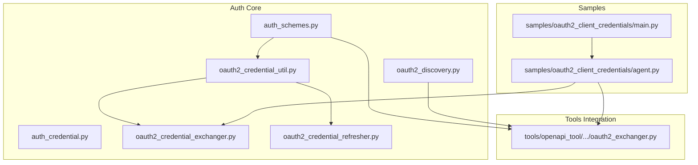

**Diagram sources**
- [auth_schemes.py](file://src/google/adk/auth/auth_schemes.py#L32-L80)
- [oauth2_discovery.py](file://src/google/adk/auth/oauth2_discovery.py#L52-L149)
- [auth_credential.py](file://src/google/adk/auth/auth_credential.py#L68-L95)
- [oauth2_credential_util.py](file://src/google/adk/auth/oauth2_credential_util.py#L34-L120)
- [oauth2_credential_exchanger.py](file://src/google/adk/auth/exchanger/oauth2_credential_exchanger.py#L47-L212)
- [oauth2_credential_refresher.py](file://src/google/adk/auth/refresher/oauth2_credential_refresher.py#L45-L127)
- [oauth2_exchanger.py](file://src/google/adk/tools/openapi_tool/auth/credential_exchangers/oauth2_exchanger.py#L30-L120)
- [agent.py](file://contributing/samples/oauth2_client_credentials/agent.py#L35-L64)

**Section sources**
- [auth_schemes.py](file://src/google/adk/auth/auth_schemes.py#L32-L80)
- [oauth2_discovery.py](file://src/google/adk/auth/oauth2_discovery.py#L52-L149)
- [auth_credential.py](file://src/google/adk/auth/auth_credential.py#L68-L95)
- [oauth2_credential_util.py](file://src/google/adk/auth/oauth2_credential_util.py#L34-L120)
- [oauth2_credential_exchanger.py](file://src/google/adk/auth/exchanger/oauth2_credential_exchanger.py#L47-L212)
- [oauth2_credential_refresher.py](file://src/google/adk/auth/refresher/oauth2_credential_refresher.py#L45-L127)
- [oauth2_exchanger.py](file://src/google/adk/tools/openapi_tool/auth/credential_exchangers/oauth2_exchanger.py#L30-L120)
- [agent.py](file://contributing/samples/oauth2_client_credentials/agent.py#L35-L64)
- [main.py](file://contributing/samples/oauth2_client_credentials/main.py#L98-L127)

## Core Components
- AuthSchemeType: Re-export of OpenAPI SecuritySchemeType for standardized security scheme classification.
- OpenIdConnectWithConfig: A flattened OpenAPI security scheme tailored for OpenID Connect with explicit endpoints and optional metadata.
- OAuthGrantType: Enumeration of supported OAuth2 flows (client_credentials, authorization_code, implicit, password).
- ExtendedOAuth2: OAuth2 scheme with optional issuer_url to enable auto-discovery.
- OAuth2DiscoveryManager: Discovers authorization server and protected resource metadata via well-known endpoints.
- AuthCredential: Unified credential model supporting HTTP, OAuth2, OpenID Connect, and service accounts.
- OAuth2CredentialExchanger: Exchanges authorization responses into usable access tokens for supported flows.
- OAuth2CredentialRefresher: Refreshes expired tokens when applicable.
- OAuth2CredentialExchanger (OpenAPI tool): Converts credentials into HTTP bearer tokens for outbound requests.

**Section sources**
- [auth_schemes.py](file://src/google/adk/auth/auth_schemes.py#L32-L80)
- [oauth2_discovery.py](file://src/google/adk/auth/oauth2_discovery.py#L52-L149)
- [auth_credential.py](file://src/google/adk/auth/auth_credential.py#L68-L95)
- [oauth2_credential_util.py](file://src/google/adk/auth/oauth2_credential_util.py#L34-L120)
- [oauth2_credential_exchanger.py](file://src/google/adk/auth/exchanger/oauth2_credential_exchanger.py#L47-L212)
- [oauth2_credential_refresher.py](file://src/google/adk/auth/refresher/oauth2_credential_refresher.py#L45-L127)
- [oauth2_exchanger.py](file://src/google/adk/tools/openapi_tool/auth/credential_exchangers/oauth2_exchanger.py#L30-L120)

## Architecture Overview
The authentication architecture integrates scheme definitions, discovery, credential modeling, exchange, and refresh flows. OpenAPI tooling consumes the resulting HTTP bearer tokens for authenticated requests.

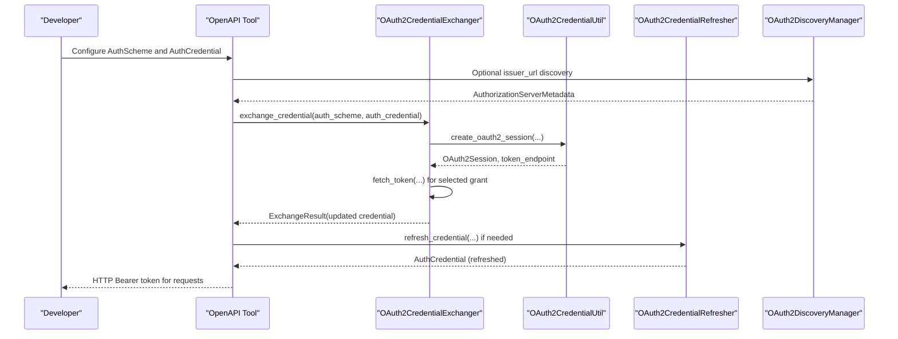

**Diagram sources**
- [oauth2_exchanger.py](file://src/google/adk/tools/openapi_tool/auth/credential_exchangers/oauth2_exchanger.py#L89-L120)
- [oauth2_credential_exchanger.py](file://src/google/adk/auth/exchanger/oauth2_credential_exchanger.py#L50-L102)
- [oauth2_credential_util.py](file://src/google/adk/auth/oauth2_credential_util.py#L34-L97)
- [oauth2_credential_refresher.py](file://src/google/adk/auth/refresher/oauth2_credential_refresher.py#L77-L126)
- [oauth2_discovery.py](file://src/google/adk/auth/oauth2_discovery.py#L55-L104)

## Detailed Component Analysis

### AuthSchemeType and OpenIdConnectWithConfig
- AuthSchemeType re-exports OpenAPI SecuritySchemeType for consistent classification.
- OpenIdConnectWithConfig extends SecurityBase with:
  - type_: fixed to openIdConnect
  - authorization_endpoint and token_endpoint (required)
  - userinfo_endpoint and revocation_endpoint (optional)
  - token_endpoint_auth_methods_supported, grant_types_supported, scopes (optional)

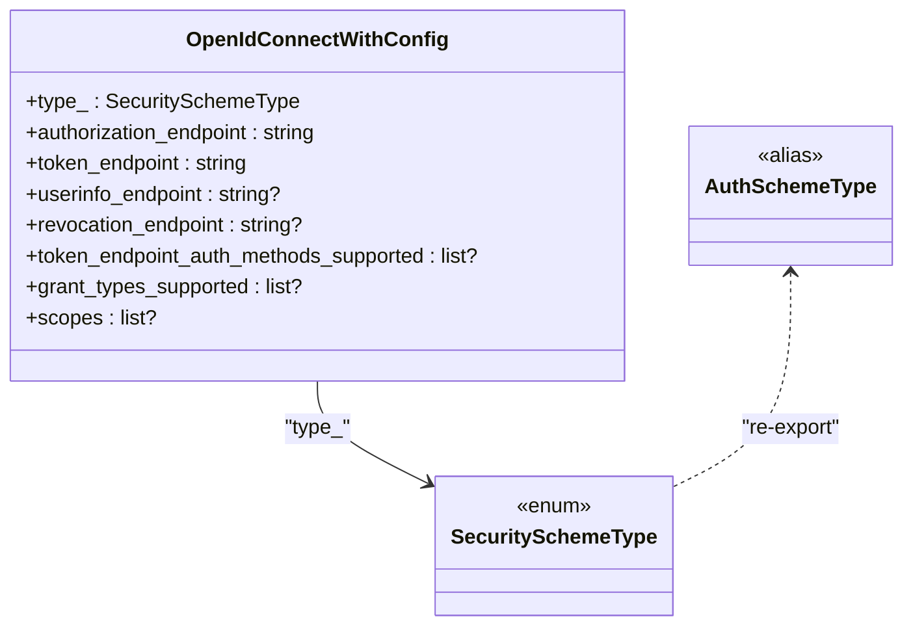

**Diagram sources**
- [auth_schemes.py](file://src/google/adk/auth/auth_schemes.py#L32-L46)
- [auth_schemes.py](file://src/google/adk/auth/auth_schemes.py#L71-L72)

**Section sources**
- [auth_schemes.py](file://src/google/adk/auth/auth_schemes.py#L32-L46)
- [auth_schemes.py](file://src/google/adk/auth/auth_schemes.py#L71-L72)

### OAuthGrantType and ExtendedOAuth2
- OAuthGrantType enumerates supported flows: client_credentials, authorization_code, implicit, password.
- ExtendedOAuth2 adds issuer_url to support discovery-driven configuration.

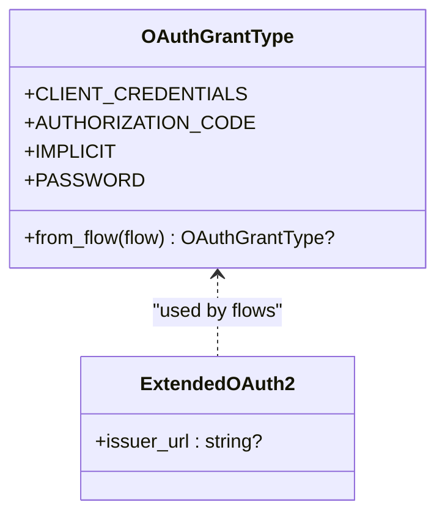

**Diagram sources**
- [auth_schemes.py](file://src/google/adk/auth/auth_schemes.py#L49-L68)
- [auth_schemes.py](file://src/google/adk/auth/auth_schemes.py#L75-L80)

**Section sources**
- [auth_schemes.py](file://src/google/adk/auth/auth_schemes.py#L49-L68)
- [auth_schemes.py](file://src/google/adk/auth/auth_schemes.py#L75-L80)

### OAuth2 Discovery Mechanism
OAuth2DiscoveryManager implements RFC8414 and RFC9728 discovery:
- Authorization server metadata discovery via .well-known endpoints with fallbacks and path-aware logic.
- Protected resource metadata discovery via .well-known/oauth-protected-resource.
- Issuer/resource validation to prevent MIX-UP attacks.
- Robust error handling for network failures and malformed responses.

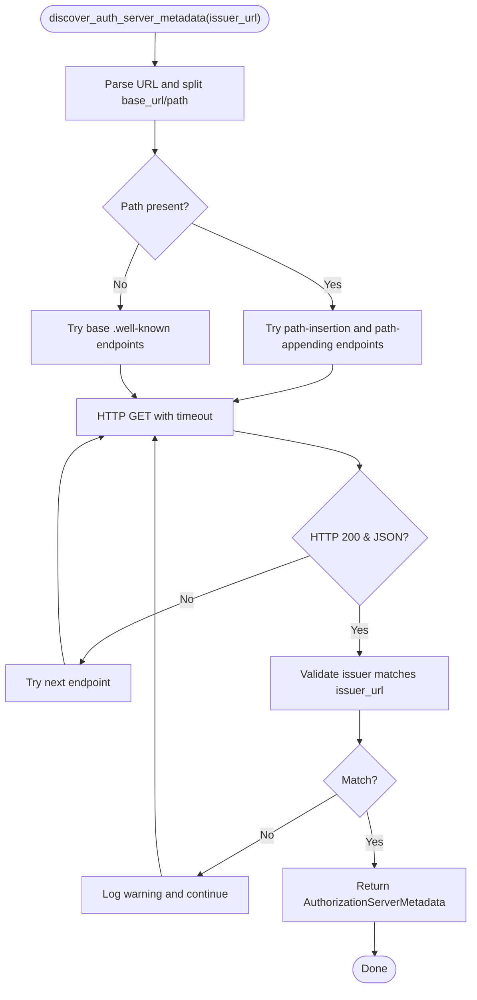

**Diagram sources**
- [oauth2_discovery.py](file://src/google/adk/auth/oauth2_discovery.py#L55-L104)

**Section sources**
- [oauth2_discovery.py](file://src/google/adk/auth/oauth2_discovery.py#L52-L149)
- [test_oauth2_discovery.py](file://tests/unittests/auth/test_oauth2_discovery.py#L27-L285)

### OAuth2 Credential Utilities
- create_oauth2_session builds an Authlib OAuth2Session from:
  - OpenIdConnectWithConfig: uses token_endpoint and scopes
  - OAuth2: selects tokenUrl from authorizationCode or clientCredentials flows
  - Validates presence of client_id and client_secret
- update_credential_with_tokens updates access_token, refresh_token, id_token, expires_at, expires_in

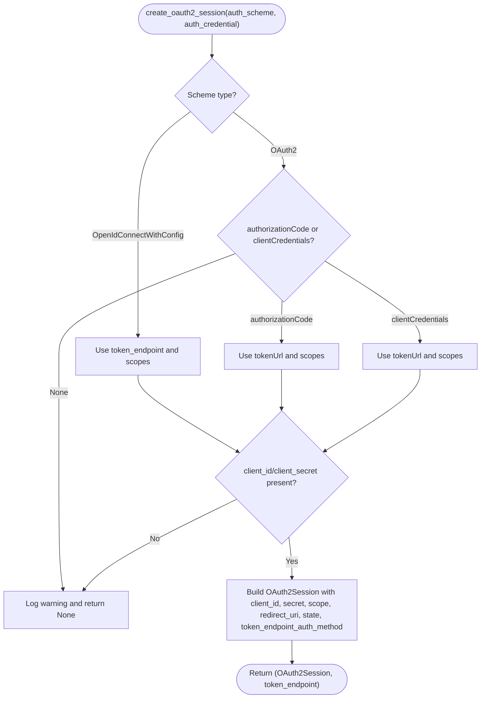

**Diagram sources**
- [oauth2_credential_util.py](file://src/google/adk/auth/oauth2_credential_util.py#L34-L97)

**Section sources**
- [oauth2_credential_util.py](file://src/google/adk/auth/oauth2_credential_util.py#L34-L120)
- [test_oauth2_credential_util.py](file://tests/unittests/auth/test_oauth2_credential_util.py#L64-L139)

### OAuth2 Credential Exchange
- Determines grant type from scheme (OAuth2 flows or OIDC supported grant types).
- Supports client_credentials and authorization_code exchanges.
- Uses create_oauth2_session and update_credential_with_tokens.
- Handles missing authlib gracefully by returning original credential.

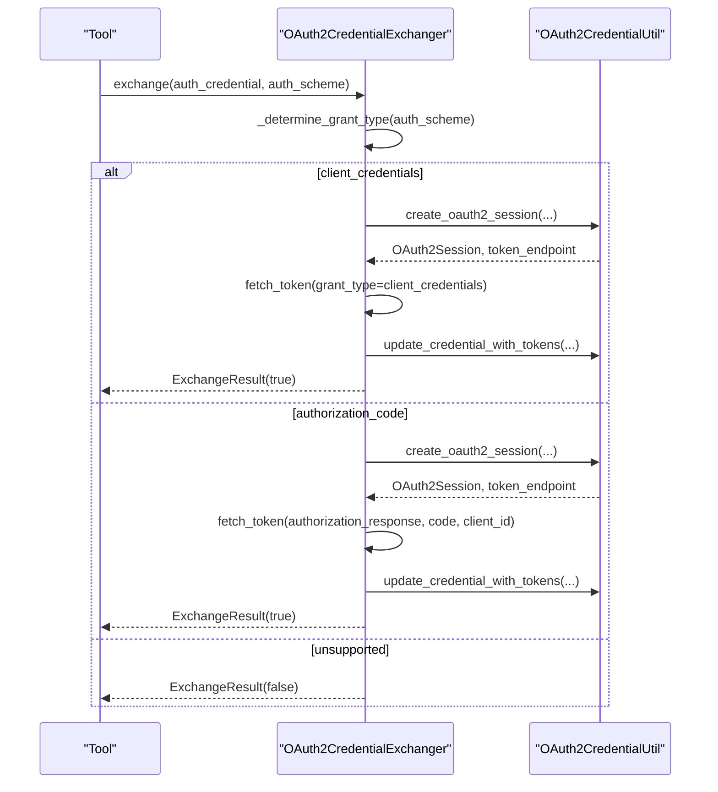

**Diagram sources**
- [oauth2_credential_exchanger.py](file://src/google/adk/auth/exchanger/oauth2_credential_exchanger.py#L50-L102)
- [oauth2_credential_util.py](file://src/google/adk/auth/oauth2_credential_util.py#L34-L97)

**Section sources**
- [oauth2_credential_exchanger.py](file://src/google/adk/auth/exchanger/oauth2_credential_exchanger.py#L47-L212)

### OAuth2 Credential Refresh
- Checks expiration using OAuth2Token.is_expired.
- Refreshes tokens via OAuth2Session.refresh_token when applicable.
- Returns original credential on failure.

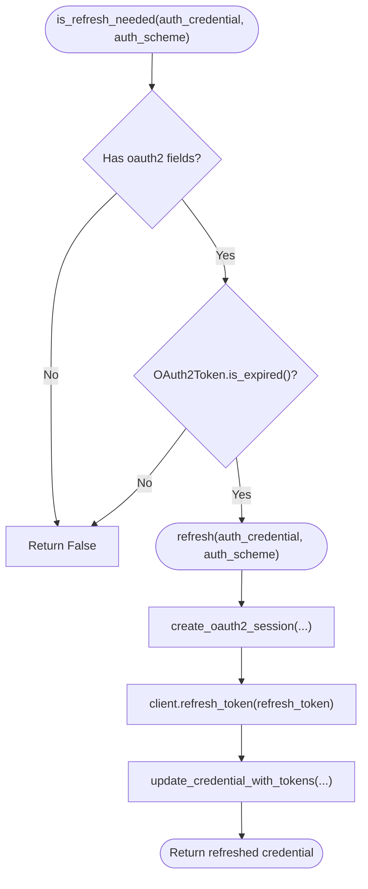

**Diagram sources**
- [oauth2_credential_refresher.py](file://src/google/adk/auth/refresher/oauth2_credential_refresher.py#L48-L126)
- [oauth2_credential_util.py](file://src/google/adk/auth/oauth2_credential_util.py#L100-L120)

**Section sources**
- [oauth2_credential_refresher.py](file://src/google/adk/auth/refresher/oauth2_credential_refresher.py#L45-L127)

### OpenAPI Tool OAuth2 Integration
- Validates scheme type (oauth2 or openIdConnect).
- Generates HTTP bearer token from existing access_token.
- Returns original credential if already HTTP bearer or no token available.

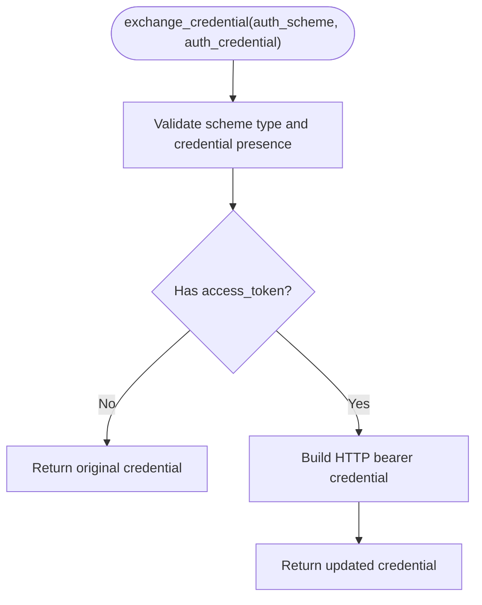

**Diagram sources**
- [oauth2_exchanger.py](file://src/google/adk/tools/openapi_tool/auth/credential_exchangers/oauth2_exchanger.py#L89-L120)

**Section sources**
- [oauth2_exchanger.py](file://src/google/adk/tools/openapi_tool/auth/credential_exchangers/oauth2_exchanger.py#L30-L120)

### Practical Configuration Examples
- Client Credentials Flow (sample):
  - Define OAuth2 scheme with clientCredentials flow and tokenUrl/scopes.
  - Provide client_id and client_secret in AuthCredential.
  - Use AuthenticatedFunctionTool to invoke APIs with automatic bearer token injection.

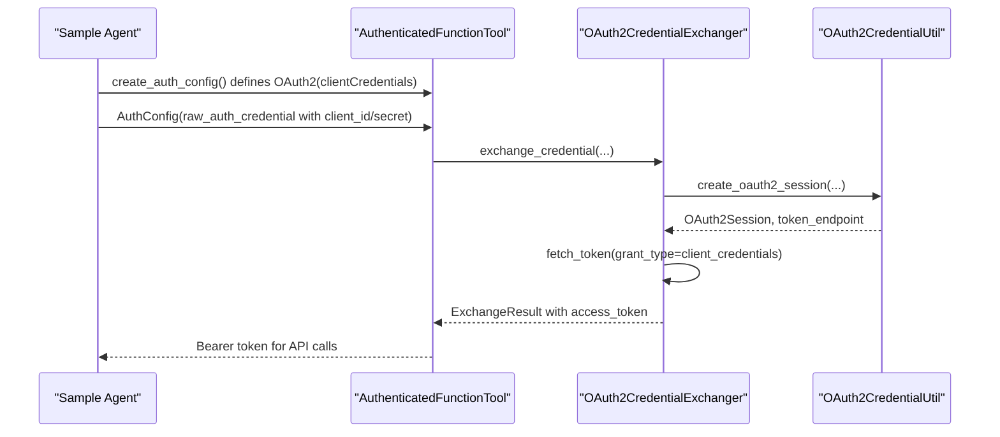

**Diagram sources**
- [agent.py](file://contributing/samples/oauth2_client_credentials/agent.py#L35-L64)
- [oauth2_credential_exchanger.py](file://src/google/adk/auth/exchanger/oauth2_credential_exchanger.py#L130-L163)
- [oauth2_credential_util.py](file://src/google/adk/auth/oauth2_credential_util.py#L34-L97)

**Section sources**
- [agent.py](file://contributing/samples/oauth2_client_credentials/agent.py#L35-L64)
- [main.py](file://contributing/samples/oauth2_client_credentials/main.py#L98-L127)

## Dependency Analysis
- auth_schemes.py defines the foundational scheme types and grant enumeration.
- oauth2_credential_util.py depends on Authlib OAuth2Session and FastAPI OAuth2 models.
- oauth2_credential_exchanger.py orchestrates exchange logic and delegates to utilities.
- oauth2_credential_refresher.py depends on OAuth2Token and Google credentials for refresh checks.
- oauth2_discovery.py provides asynchronous discovery with robust error handling.
- oauth2_exchanger.py (OpenAPI tool) depends on auth_credential models and scheme types.

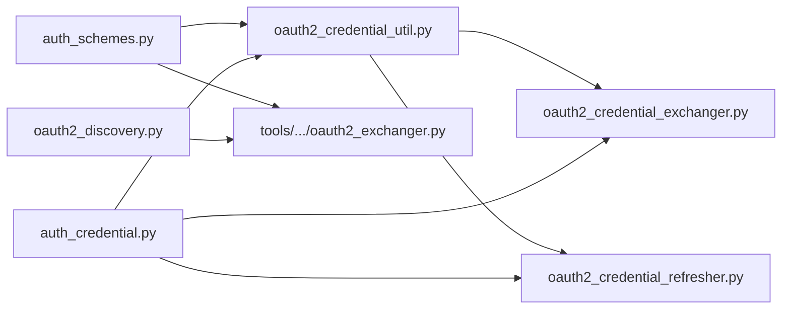

**Diagram sources**
- [auth_schemes.py](file://src/google/adk/auth/auth_schemes.py#L32-L80)
- [oauth2_credential_util.py](file://src/google/adk/auth/oauth2_credential_util.py#L34-L120)
- [oauth2_credential_exchanger.py](file://src/google/adk/auth/exchanger/oauth2_credential_exchanger.py#L47-L212)
- [oauth2_credential_refresher.py](file://src/google/adk/auth/refresher/oauth2_credential_refresher.py#L45-L127)
- [oauth2_discovery.py](file://src/google/adk/auth/oauth2_discovery.py#L52-L149)
- [oauth2_exchanger.py](file://src/google/adk/tools/openapi_tool/auth/credential_exchangers/oauth2_exchanger.py#L30-L120)
- [auth_credential.py](file://src/google/adk/auth/auth_credential.py#L68-L95)

**Section sources**
- [__init__.py](file://src/google/adk/auth/__init__.py#L15-L23)

## Performance Considerations
- Discovery uses asynchronous HTTP requests with timeouts; configure issuer_url carefully to minimize retries.
- Token operations rely on Authlib; ensure client_id/client_secret are provided to avoid repeated session creation failures.
- Refresh checks use token expiration; avoid unnecessary refresh calls by leveraging cached credentials.
- Prefer client_credentials for machine-to-machine scenarios to reduce latency compared to authorization_code flows.

## Troubleshooting Guide
Common issues and resolutions:
- Missing authlib:
  - Symptom: Exchange returns original credential without exchange.
  - Resolution: Install Authlib or handle exchange externally.
- Unsupported grant type:
  - Symptom: ExchangeResult indicates no exchange performed.
  - Resolution: Ensure scheme supports client_credentials or authorization_code.
- Invalid or missing endpoints:
  - Symptom: Session creation returns None.
  - Resolution: Verify token_endpoint or flows.authorizationCode.tokenUrl are present.
- Discovery failures:
  - Symptom: No metadata discovered.
  - Resolution: Confirm issuer_url correctness, network connectivity, and well-known endpoint availability.
- Mismatched issuer/resource:
  - Symptom: Discovery logs warnings and returns None.
  - Resolution: Ensure issuer/resource matches the discovered metadata.

**Section sources**
- [oauth2_credential_exchanger.py](file://src/google/adk/auth/exchanger/oauth2_credential_exchanger.py#L76-L84)
- [oauth2_credential_exchanger.py](file://src/google/adk/auth/exchanger/oauth2_credential_exchanger.py#L100-L102)
- [oauth2_credential_util.py](file://src/google/adk/auth/oauth2_credential_util.py#L75-L77)
- [oauth2_discovery.py](file://src/google/adk/auth/oauth2_discovery.py#L91-L100)
- [oauth2_discovery.py](file://src/google/adk/auth/oauth2_discovery.py#L130-L138)
- [test_oauth2_discovery.py](file://tests/unittests/auth/test_oauth2_discovery.py#L181-L209)

## Conclusion
ADK provides a comprehensive, extensible authentication framework supporting OAuth2 and OpenID Connect with dynamic discovery, robust credential exchange and refresh, and seamless integration with OpenAPI tools. By leveraging the provided schemes, utilities, and flows, developers can configure secure and portable authentication across diverse environments and service providers.

## Appendices
- Supported authentication methods summary:
  - OAuth2 flows: client_credentials, authorization_code, implicit, password
  - OpenID Connect: via OpenIdConnectWithConfig and discovery-managed endpoints
  - Custom schemes: Any OpenAPI-compatible SecuritySchemeType via AuthSchemeType