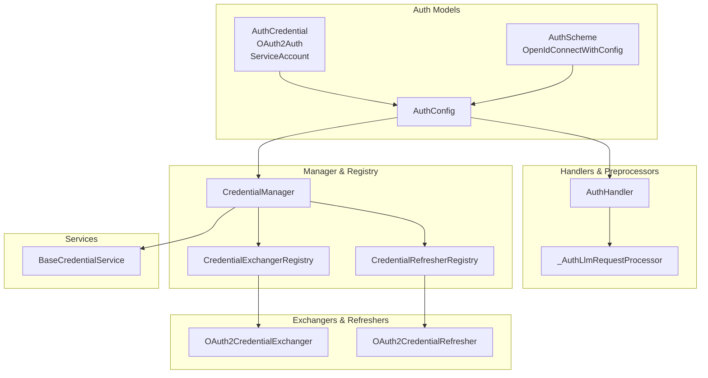
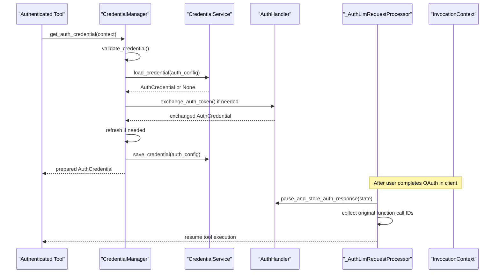
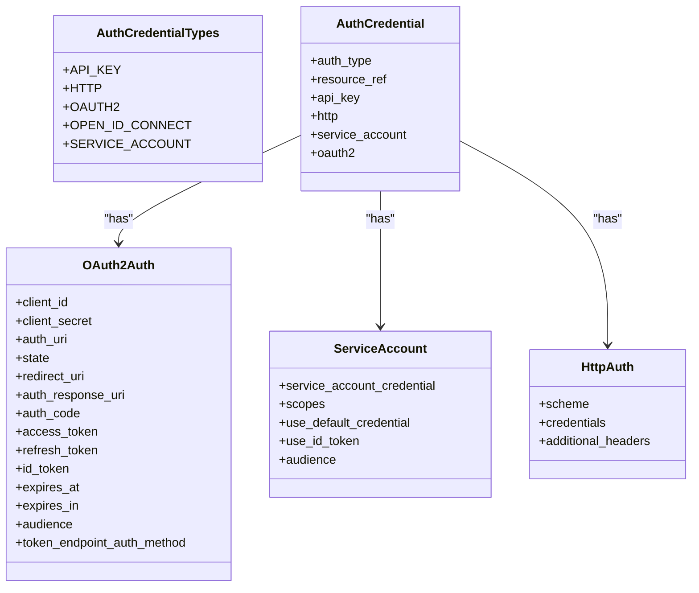
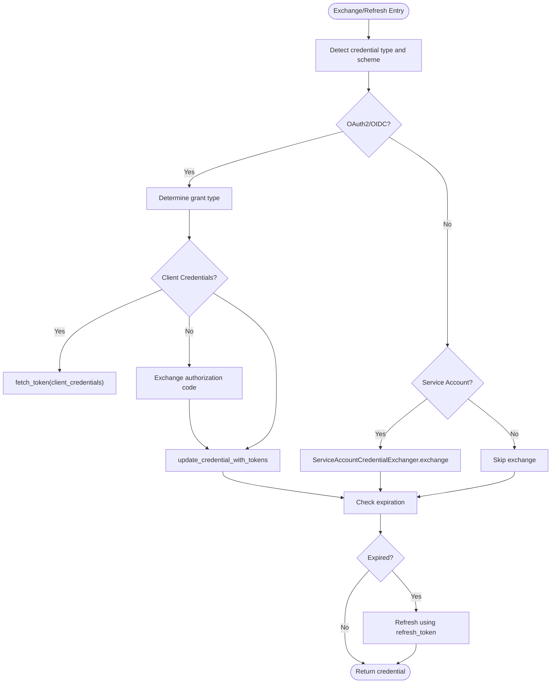
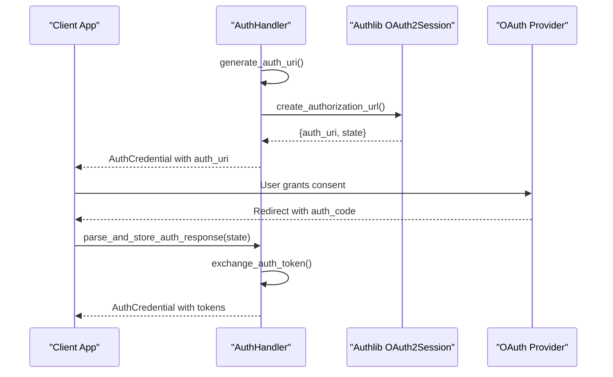
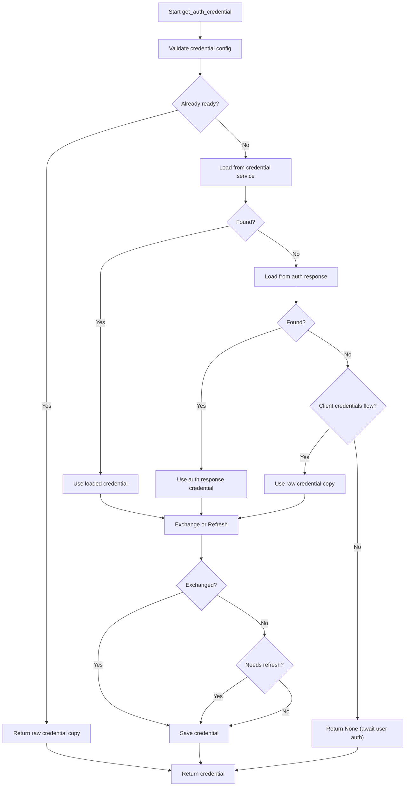
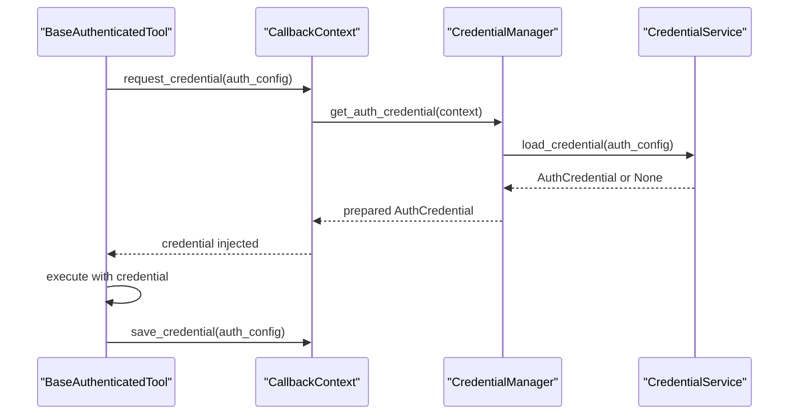
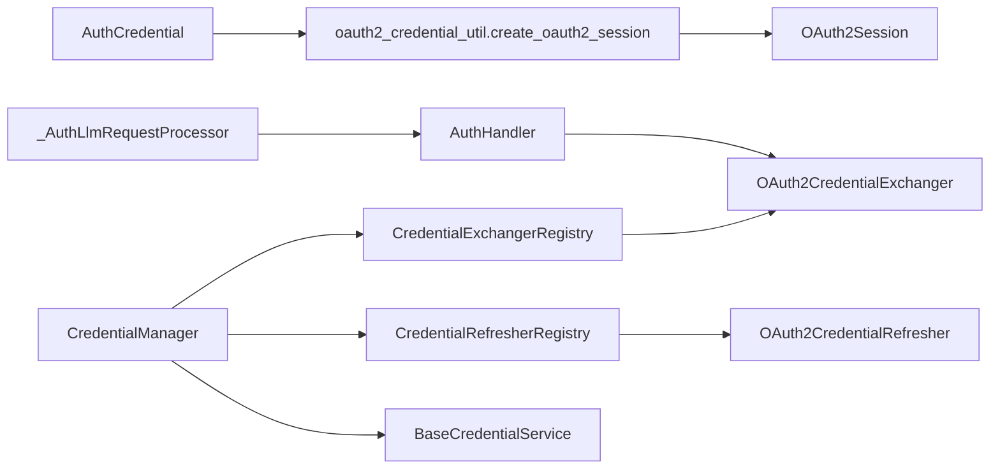

# Authentication and Security

<cite>
**Referenced Files in This Document**
- [auth/__init__.py](file://src/google/adk/auth/__init__.py)
- [auth/auth_handler.py](file://src/google/adk/auth/auth_handler.py)
- [auth/auth_schemes.py](file://src/google/adk/auth/auth_schemes.py)
- [auth/auth_tool.py](file://src/google/adk/auth/auth_tool.py)
- [auth/auth_preprocessor.py](file://src/google/adk/auth/auth_preprocessor.py)
- [auth/auth_credential.py](file://src/google/adk/auth/auth_credential.py)
- [auth/credential_manager.py](file://src/google/adk/auth/credential_manager.py)
- [auth/oauth2_credential_util.py](file://src/google/adk/auth/oauth2_credential_util.py)
- [auth/exchanger/base_credential_exchanger.py](file://src/google/adk/auth/exchanger/base_credential_exchanger.py)
- [auth/exchanger/oauth2_credential_exchanger.py](file://src/google/adk/auth/exchanger/oauth2_credential_exchanger.py)
- [auth/refresher/base_credential_refresher.py](file://src/google/adk/auth/refresher/base_credential_refresher.py)
- [auth/refresher/oauth2_credential_refresher.py](file://src/google/adk/auth/refresher/oauth2_credential_refresher.py)
- [auth/credential_service/base_credential_service.py](file://src/google/adk/auth/credential_service/base_credential_service.py)
- [tools/base_authenticated_tool.py](file://src/google/adk/tools/base_authenticated_tool.py)
- [tools/authenticated_function_tool.py](file://src/google/adk/tools/authenticated_function_tool.py)
- [agents/callback_context.py](file://src/google/adk/agents/callback_context.py)
- [flows/llm_flows/functions.py](file://src/google/adk/flows/llm_flows/functions.py)
- [examples/a2a_auth/README.md](file://contributing/samples/a2a_auth/README.md)
- [examples/oauth2_client_credentials/README.md](file://contributing/samples/oauth2_client_credentials/README.md)
- [examples/oauth2_client_credentials/agent.py](file://contributing/samples/oauth2_client_credentials/agent.py)
- [examples/oauth2_client_credentials/main.py](file://contributing/samples/oauth2_client_credentials/main.py)
- [examples/oauth2_client_credentials/oauth2_test_server.py](file://contributing/samples/oauth2_client_credentials/oauth2_test_server.py)
- [examples/mcp_toolset_auth/README.md](file://contributing/samples/mcp_toolset_auth/README.md)
- [examples/mcp_toolset_auth/agent.py](file://contributing/samples/mcp_toolset_auth/agent.py)
- [examples/mcp_toolset_auth/main.py](file://contributing/samples/mcp_toolset_auth/main.py)
- [examples/mcp_toolset_auth/oauth_mcp_server.py](file://contributing/samples/mcp_toolset_auth/oauth_mcp_server.py)
- [examples/mcp_service_account_agent/README.md](file://contributing/samples/mcp_service_account_agent/README.md)
- [examples/mcp_service_account_agent/agent.py](file://contributing/samples/mcp_service_account_agent/agent.py)
- [examples/bigquery/README.md](file://contributing/samples/bigquery/README.md)
- [examples/bigquery/agent.py](file://contributing/samples/bigquery/agent.py)
- [examples/bigquery_mcp/README.md](file://contributing/samples/bigquery_mcp/README.md)
- [examples/bigquery_mcp/agent.py](file://contributing/samples/bigquery_mcp/agent.py)
- [examples/bigtable/README.md](file://contributing/samples/bigtable/README.md)
- [examples/bigtable/agent.py](file://contributing/samples/bigtable/agent.py)
- [examples/google_api/README.md](file://contributing/samples/google_api/README.md)
- [examples/google_api/agent.py](file://contributing/samples/google_api/agent.py)
- [examples/spanner/README.md](file://contributing/samples/spanner/README.md)
- [examples/spanner/agent.py](file://contributing/samples/spanner/agent.py)
- [examples/pubsub/README.md](file://contributing/samples/pubsub/README.md)
- [examples/pubsub/agent.py](file://contributing/samples/pubsub/agent.py)
- [examples/vertex_code_execution/README.md](file://contributing/samples/vertex_code_execution/README.md)
- [examples/vertex_code_execution/agent.py](file://contributing/samples/vertex_code_execution/agent.py)
</cite>

## Table of Contents
1. [Introduction](#introduction)
2. [Project Structure](#project-structure)
3. [Core Components](#core-components)
4. [Architecture Overview](#architecture-overview)
5. [Detailed Component Analysis](#detailed-component-analysis)
6. [Dependency Analysis](#dependency-analysis)
7. [Performance Considerations](#performance-considerations)
8. [Troubleshooting Guide](#troubleshooting-guide)
9. [Conclusion](#conclusion)
10. [Appendices](#appendices)

## Introduction
This document explains the authentication and security architecture in the Agent Development Kit (ADK). It covers supported authentication schemes (OAuth2, OpenID Connect, service accounts, API keys, and HTTP bearer/basic), credential exchange and refresh mechanisms, integration with tool execution, and security best practices for agent development. Practical examples demonstrate configuration for common service providers and multi-agent scenarios.

## Project Structure
The authentication subsystem is organized around:
- Schemas and models for credentials and authentication schemes
- Handlers and preprocessors for OAuth flows and credential collection
- Exchangers and refreshers for converting and maintaining credentials
- A credential manager orchestrating the lifecycle
- Optional credential services for persistence
- Integration points with tools and agent execution

**Diagram sources**
- [auth/auth_credential.py](file://src/google/adk/auth/auth_credential.py#L190-L280)
- [auth/auth_schemes.py](file://src/google/adk/auth/auth_schemes.py#L32-L80)
- [auth/auth_tool.py](file://src/google/adk/auth/auth_tool.py#L51-L146)
- [auth/auth_handler.py](file://src/google/adk/auth/auth_handler.py#L38-L209)
- [auth/auth_preprocessor.py](file://src/google/adk/auth/auth_preprocessor.py#L127-L209)
- [auth/credential_manager.py](file://src/google/adk/auth/credential_manager.py#L40-L387)
- [auth/exchanger/credential_exchanger_registry.py](file://src/google/adk/auth/exchanger/credential_exchanger_registry.py#L28-L59)
- [auth/exchanger/oauth2_credential_exchanger.py](file://src/google/adk/auth/exchanger/oauth2_credential_exchanger.py#L46-L212)
- [auth/refresher/oauth2_credential_refresher.py](file://src/google/adk/auth/refresher/oauth2_credential_refresher.py#L44-L127)
- [auth/credential_service/base_credential_service.py](file://src/google/adk/auth/credential_service/base_credential_service.py#L27-L76)

**Section sources**
- [auth/__init__.py](file://src/google/adk/auth/__init__.py#L15-L23)
- [auth/auth_credential.py](file://src/google/adk/auth/auth_credential.py#L190-L280)
- [auth/auth_schemes.py](file://src/google/adk/auth/auth_schemes.py#L32-L80)
- [auth/auth_tool.py](file://src/google/adk/auth/auth_tool.py#L51-L146)
- [auth/auth_handler.py](file://src/google/adk/auth/auth_handler.py#L38-L209)
- [auth/auth_preprocessor.py](file://src/google/adk/auth/auth_preprocessor.py#L127-L209)
- [auth/credential_manager.py](file://src/google/adk/auth/credential_manager.py#L40-L387)
- [auth/exchanger/credential_exchanger_registry.py](file://src/google/adk/auth/exchanger/credential_exchanger_registry.py#L28-L59)
- [auth/exchanger/oauth2_credential_exchanger.py](file://src/google/adk/auth/exchanger/oauth2_credential_exchanger.py#L46-L212)
- [auth/refresher/oauth2_credential_refresher.py](file://src/google/adk/auth/refresher/oauth2_credential_refresher.py#L44-L127)
- [auth/credential_service/base_credential_service.py](file://src/google/adk/auth/credential_service/base_credential_service.py#L27-L76)

## Core Components
- AuthCredential: Encapsulates credential values and metadata for API key, HTTP, OAuth2, OpenID Connect, and service account types.
- AuthScheme: Union of OpenAPI SecurityScheme and OpenIdConnectWithConfig, supporting OAuth2/OIDC flows and endpoints.
- AuthConfig: Carries the requested AuthScheme and optional raw/exchanged credentials; includes a stable credential_key for persistence.
- AuthHandler: Generates authorization URIs, validates OAuth flows, and stores auth responses in session state.
- CredentialManager: Orchestrates credential lifecycle: validation, loading, exchange, refresh, saving, and OIDC auto-discovery.
- Exchangers/Refreshers: Implement exchange and refresh logic for OAuth2/OIDC and service accounts; pluggable via registries.
- CredentialService: Abstract persistence interface for loading/saving credentials keyed by AuthConfig.
- Preprocessor: Captures user-provided auth responses, stores them, and resumes tool execution.

**Section sources**
- [auth/auth_credential.py](file://src/google/adk/auth/auth_credential.py#L190-L280)
- [auth/auth_schemes.py](file://src/google/adk/auth/auth_schemes.py#L32-L80)
- [auth/auth_tool.py](file://src/google/adk/auth/auth_tool.py#L51-L146)
- [auth/auth_handler.py](file://src/google/adk/auth/auth_handler.py#L38-L209)
- [auth/credential_manager.py](file://src/google/adk/auth/credential_manager.py#L40-L387)
- [auth/exchanger/base_credential_exchanger.py](file://src/google/adk/auth/exchanger/base_credential_exchanger.py#L37-L66)
- [auth/refresher/base_credential_refresher.py](file://src/google/adk/auth/refresher/base_credential_refresher.py#L31-L75)
- [auth/credential_service/base_credential_service.py](file://src/google/adk/auth/credential_service/base_credential_service.py#L27-L76)
- [auth/auth_preprocessor.py](file://src/google/adk/auth/auth_preprocessor.py#L127-L209)

## Architecture Overview
The authentication pipeline integrates with agent execution and tool invocation:

**Diagram sources**
- [auth/credential_manager.py](file://src/google/adk/auth/credential_manager.py#L135-L184)
- [auth/auth_handler.py](file://src/google/adk/auth/auth_handler.py#L47-L78)
- [auth/auth_preprocessor.py](file://src/google/adk/auth/auth_preprocessor.py#L40-L125)
- [auth/credential_service/base_credential_service.py](file://src/google/adk/auth/credential_service/base_credential_service.py#L32-L75)

## Detailed Component Analysis

### Authentication Schemes and Supported Types
- OAuth2 and OpenID Connect: Supported via AuthScheme union and ExtendedOAuth2 for auto-discovery. Grant types include client_credentials, authorization_code, implicit, and password.
- Service Accounts: Managed via ServiceAccountCredential and ServiceAccount configuration, including ID token exchange and audience targeting.
- API Key and HTTP: Basic and Bearer tokens supported through HttpAuth and HttpCredentials.
- Auto-discovery: ExtendedOAuth2 supports issuer_url to discover endpoints dynamically.

**Diagram sources**
- [auth/auth_credential.py](file://src/google/adk/auth/auth_credential.py#L190-L280)

**Section sources**
- [auth/auth_schemes.py](file://src/google/adk/auth/auth_schemes.py#L32-L80)
- [auth/auth_credential.py](file://src/google/adk/auth/auth_credential.py#L68-L188)

### Credential Exchange and Refresh Mechanisms
- Exchange:
  - OAuth2CredentialExchanger supports client_credentials and authorization_code flows using Authlib to fetch tokens and update credential fields.
  - ServiceAccountCredentialExchanger converts service account JSON to access or ID tokens (integration point).
- Refresh:
  - OAuth2CredentialRefresher checks expiration and refreshes tokens using refresh_token when available.
- Utilities:
  - create_oauth2_session builds Authlib session and resolves token endpoint from scheme.
  - update_credential_with_tokens persists new tokens into the credential object.

**Diagram sources**
- [auth/exchanger/oauth2_credential_exchanger.py](file://src/google/adk/auth/exchanger/oauth2_credential_exchanger.py#L104-L212)
- [auth/refresher/oauth2_credential_refresher.py](file://src/google/adk/auth/refresher/oauth2_credential_refresher.py#L48-L127)
- [auth/oauth2_credential_util.py](file://src/google/adk/auth/oauth2_credential_util.py#L33-L120)

**Section sources**
- [auth/exchanger/oauth2_credential_exchanger.py](file://src/google/adk/auth/exchanger/oauth2_credential_exchanger.py#L46-L212)
- [auth/refresher/oauth2_credential_refresher.py](file://src/google/adk/auth/refresher/oauth2_credential_refresher.py#L44-L127)
- [auth/oauth2_credential_util.py](file://src/google/adk/auth/oauth2_credential_util.py#L33-L120)

### Authentication Handler and OAuth Flow
- AuthHandler generates authorization URIs for user consent, validates inputs, and stores exchanged credentials in session state.
- It delegates exchange to OAuth2CredentialExchanger when appropriate.

**Diagram sources**
- [auth/auth_handler.py](file://src/google/adk/auth/auth_handler.py#L140-L209)
- [auth/auth_handler.py](file://src/google/adk/auth/auth_handler.py#L47-L78)

**Section sources**
- [auth/auth_handler.py](file://src/google/adk/auth/auth_handler.py#L38-L209)

### Credential Manager Lifecycle
CredentialManager coordinates the entire lifecycle:
- Validation: Ensures required fields per scheme and populates missing OAuth endpoints via auto-discovery.
- Loading: Attempts to load from credential service and auth responses.
- Exchange/Refresh: Uses registries to transform and maintain credentials.
- Persistence: Saves updated credentials back to the credential service.

**Diagram sources**
- [auth/credential_manager.py](file://src/google/adk/auth/credential_manager.py#L135-L387)

**Section sources**
- [auth/credential_manager.py](file://src/google/adk/auth/credential_manager.py#L40-L387)

### Integration with Tool Execution and Automatic Credential Injection
- Tools declare AuthConfig to request credentials.
- CredentialManager prepares credentials for tool execution.
- BaseAuthenticatedTool and AuthenticatedFunctionTool integrate with the credential pipeline.
- CallbackContext exposes request_credential/save_credential/load_credential for tool integration.

**Diagram sources**
- [tools/base_authenticated_tool.py](file://src/google/adk/tools/base_authenticated_tool.py)
- [tools/authenticated_function_tool.py](file://src/google/adk/tools/authenticated_function_tool.py)
- [agents/callback_context.py](file://src/google/adk/agents/callback_context.py)
- [auth/credential_manager.py](file://src/google/adk/auth/credential_manager.py#L127-L184)

**Section sources**
- [tools/base_authenticated_tool.py](file://src/google/adk/tools/base_authenticated_tool.py)
- [tools/authenticated_function_tool.py](file://src/google/adk/tools/authenticated_function_tool.py)
- [agents/callback_context.py](file://src/google/adk/agents/callback_context.py)
- [auth/credential_manager.py](file://src/google/adk/auth/credential_manager.py#L127-L184)

### Practical Configuration Examples
- OAuth2 client credentials:
  - Configure AuthScheme with clientCredentials flow and issuer_url for auto-discovery.
  - Provide client_id/client_secret in AuthCredential.oauth2.
  - Use CredentialManager to exchange tokens automatically.
  - See [examples/oauth2_client_credentials/README.md](file://contributing/samples/oauth2_client_credentials/README.md), [examples/oauth2_client_credentials/agent.py](file://contributing/samples/oauth2_client_credentials/agent.py), [examples/oauth2_client_credentials/main.py](file://contributing/samples/oauth2_client_credentials/main.py), [examples/oauth2_client_credentials/oauth2_test_server.py](file://contributing/samples/oauth2_client_credentials/oauth2_test_server.py).
- OAuth2 authorization code (MCP toolset):
  - Use AuthScheme with authorizationCode flow and OpenIdConnectWithConfig when needed.
  - AuthHandler generates auth_uri; client performs user consent; AuthPreprocessor stores response and resumes tools.
  - See [examples/mcp_toolset_auth/README.md](file://contributing/samples/mcp_toolset_auth/README.md), [examples/mcp_toolset_auth/agent.py](file://contributing/samples/mcp_toolset_auth/agent.py), [examples/mcp_toolset_auth/main.py](file://contributing/samples/mcp_toolset_auth/main.py), [examples/mcp_toolset_auth/oauth_mcp_server.py](file://contributing/samples/mcp_toolset_auth/oauth_mcp_server.py).
- Service accounts:
  - Provide ServiceAccountCredential or use default credentials; optionally request ID tokens with audience.
  - See [examples/mcp_service_account_agent/README.md](file://contributing/samples/mcp_service_account_agent/README.md), [examples/mcp_service_account_agent/agent.py](file://contributing/samples/mcp_service_account_agent/agent.py).
- Provider-specific examples:
  - BigQuery, BigTable, Spanner, Pub/Sub, Vertex AI Code Execution, Google API tools demonstrate authenticated tool usage patterns.
  - See [examples/bigquery/README.md](file://contributing/samples/bigquery/README.md), [examples/bigquery/agent.py](file://contributing/samples/bigquery/agent.py), [examples/bigquery_mcp/README.md](file://contributing/samples/bigquery_mcp/README.md), [examples/bigquery_mcp/agent.py](file://contributing/samples/bigquery_mcp/agent.py), [examples/bigtable/README.md](file://contributing/samples/bigtable/README.md), [examples/bigtable/agent.py](file://contributing/samples/bigtable/agent.py), [examples/spanner/README.md](file://contributing/samples/spanner/README.md), [examples/spanner/agent.py](file://contributing/samples/spanner/agent.py), [examples/pubsub/README.md](file://contributing/samples/pubsub/README.md), [examples/pubsub/agent.py](file://contributing/samples/pubsub/agent.py), [examples/vertex_code_execution/README.md](file://contributing/samples/vertex_code_execution/README.md), [examples/vertex_code_execution/agent.py](file://contributing/samples/vertex_code_execution/agent.py), [examples/google_api/README.md](file://contributing/samples/google_api/README.md), [examples/google_api/agent.py](file://contributing/samples/google_api/agent.py).

**Section sources**
- [auth/credential_manager.py](file://src/google/adk/auth/credential_manager.py#L311-L344)
- [auth/auth_handler.py](file://src/google/adk/auth/auth_handler.py#L140-L209)
- [auth/auth_preprocessor.py](file://src/google/adk/auth/auth_preprocessor.py#L40-L125)
- [examples/oauth2_client_credentials/README.md](file://contributing/samples/oauth2_client_credentials/README.md)
- [examples/mcp_toolset_auth/README.md](file://contributing/samples/mcp_toolset_auth/README.md)
- [examples/mcp_service_account_agent/README.md](file://contributing/samples/mcp_service_account_agent/README.md)
- [examples/bigquery/README.md](file://contributing/samples/bigquery/README.md)
- [examples/bigquery_mcp/README.md](file://contributing/samples/bigquery_mcp/README.md)
- [examples/bigtable/README.md](file://contributing/samples/bigtable/README.md)
- [examples/spanner/README.md](file://contributing/samples/spanner/README.md)
- [examples/pubsub/README.md](file://contributing/samples/pubsub/README.md)
- [examples/vertex_code_execution/README.md](file://contributing/samples/vertex_code_execution/README.md)
- [examples/google_api/README.md](file://contributing/samples/google_api/README.md)

### Multi-Agent Systems and Credential Sharing Patterns
- Use credential_key in AuthConfig to persist credentials per agent or per toolset.
- CredentialService enables cross-agent sharing when the same key is used.
- For isolated environments, derive unique keys per agent or per session.
- Toolset auth credentials use a dedicated prefix to avoid resuming spurious function calls.

**Section sources**
- [auth/auth_tool.py](file://src/google/adk/auth/auth_tool.py#L77-L136)
- [auth/auth_preprocessor.py](file://src/google/adk/auth/auth_preprocessor.py#L34-L38)

## Dependency Analysis

**Diagram sources**
- [auth/auth_credential.py](file://src/google/adk/auth/auth_credential.py#L214-L280)
- [auth/oauth2_credential_util.py](file://src/google/adk/auth/oauth2_credential_util.py#L33-L97)
- [auth/auth_handler.py](file://src/google/adk/auth/auth_handler.py#L47-L54)
- [auth/credential_manager.py](file://src/google/adk/auth/credential_manager.py#L84-L113)
- [auth/exchanger/oauth2_credential_exchanger.py](file://src/google/adk/auth/exchanger/oauth2_credential_exchanger.py#L46-L102)
- [auth/refresher/oauth2_credential_refresher.py](file://src/google/adk/auth/refresher/oauth2_credential_refresher.py#L44-L74)
- [auth/auth_preprocessor.py](file://src/google/adk/auth/auth_preprocessor.py#L95-L97)

**Section sources**
- [auth/credential_manager.py](file://src/google/adk/auth/credential_manager.py#L84-L113)
- [auth/exchanger/credential_exchanger_registry.py](file://src/google/adk/auth/exchanger/credential_exchanger_registry.py#L28-L59)
- [auth/refresher/base_credential_refresher.py](file://src/google/adk/auth/refresher/base_credential_refresher.py#L31-L75)

## Performance Considerations
- Minimize repeated exchanges: reuse cached tokens and leverage refreshers to avoid frequent network calls.
- Prefer client_credentials flow for server-to-server calls to reduce latency.
- Use credential_key to avoid redundant user prompts and improve throughput in multi-agent setups.
- Avoid heavy computation in preprocessor loops; process auth responses asynchronously.

[No sources needed since this section provides general guidance]

## Troubleshooting Guide
Common issues and resolutions:
- Missing OAuth endpoints:
  - Symptom: Exchange fails due to missing token/auth URLs.
  - Resolution: Provide issuer_url for auto-discovery or configure flows explicitly in AuthScheme.
  - Reference: [auth/credential_manager.py](file://src/google/adk/auth/credential_manager.py#L311-L344)
- Missing client_id/client_secret:
  - Symptom: Exchange cannot create OAuth2 session.
  - Resolution: Ensure client_id and client_secret are present in AuthCredential.oauth2.
  - Reference: [auth/exchanger/oauth2_credential_exchanger.py](file://src/google/adk/auth/exchanger/oauth2_credential_exchanger.py#L145-L150)
- Authorization code exchange failures:
  - Symptom: Auth response URI malformed or missing code.
  - Resolution: Normalize auth_response_uri and ensure code is present; verify redirect_uri matches.
  - Reference: [auth/exchanger/oauth2_credential_exchanger.py](file://src/google/adk/auth/exchanger/oauth2_credential_exchanger.py#L195-L204)
- Token refresh failures:
  - Symptom: Expired tokens not refreshed.
  - Resolution: Verify refresh_token presence and endpoint reachability; handle exceptions gracefully.
  - Reference: [auth/refresher/oauth2_credential_refresher.py](file://src/google/adk/auth/refresher/oauth2_credential_refresher.py#L113-L124)
- Auth response not stored:
  - Symptom: Tools run without credentials after user consent.
  - Resolution: Ensure _AuthLlmRequestProcessor runs and merges credential_key into the response before storing.
  - Reference: [auth/auth_preprocessor.py](file://src/google/adk/auth/auth_preprocessor.py#L40-L125)
- Credential persistence not applied:
  - Symptom: Updated credentials not saved.
  - Resolution: Confirm BaseCredentialService implementation and that save_credential is invoked post-exchange/refresh.
  - Reference: [auth/credential_manager.py](file://src/google/adk/auth/credential_manager.py#L301-L310), [auth/credential_service/base_credential_service.py](file://src/google/adk/auth/credential_service/base_credential_service.py#L56-L75)

**Section sources**
- [auth/credential_manager.py](file://src/google/adk/auth/credential_manager.py#L311-L344)
- [auth/exchanger/oauth2_credential_exchanger.py](file://src/google/adk/auth/exchanger/oauth2_credential_exchanger.py#L145-L204)
- [auth/refresher/oauth2_credential_refresher.py](file://src/google/adk/auth/refresher/oauth2_credential_refresher.py#L113-L124)
- [auth/auth_preprocessor.py](file://src/google/adk/auth/auth_preprocessor.py#L40-L125)
- [auth/credential_service/base_credential_service.py](file://src/google/adk/auth/credential_service/base_credential_service.py#L56-L75)

## Conclusion
ADK’s authentication architecture provides a robust, extensible framework for managing diverse credential types and flows. By centralizing exchange and refresh logic, integrating with tool execution, and supporting auto-discovery and persistence, it enables secure, maintainable agent development across varied service providers and multi-agent scenarios.

[No sources needed since this section summarizes without analyzing specific files]

## Appendices

### Security Best Practices for Agent Development
- Least privilege: Request minimal scopes and limit service account roles.
- Secure storage: Persist credentials via BaseCredentialService; avoid embedding secrets in code.
- Rotation: Regularly rotate client secrets and service account keys; monitor token lifecycles.
- Auditing: Log credential events (exchange, refresh, save) with non-reversible identifiers.
- Transport: Enforce HTTPS for all token endpoints and redirects.
- Validation: Use stable credential_key hashing to prevent collisions and tampering.

[No sources needed since this section provides general guidance]