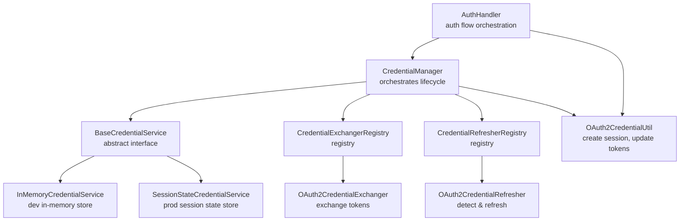
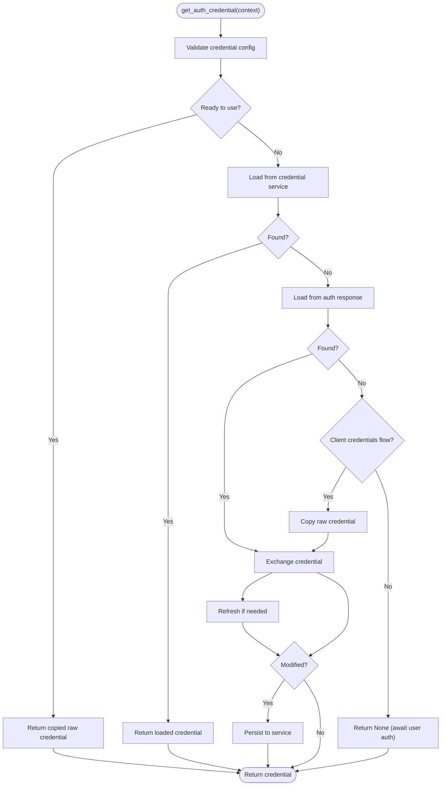
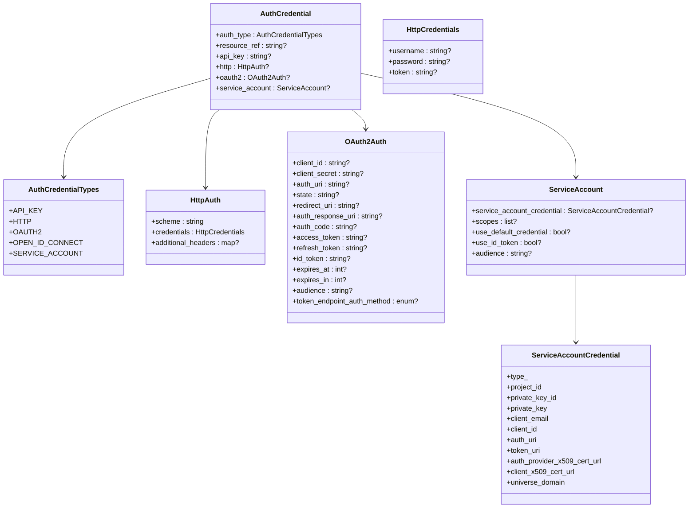
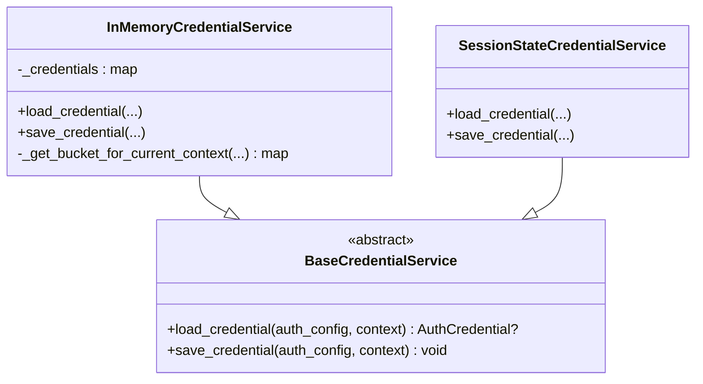
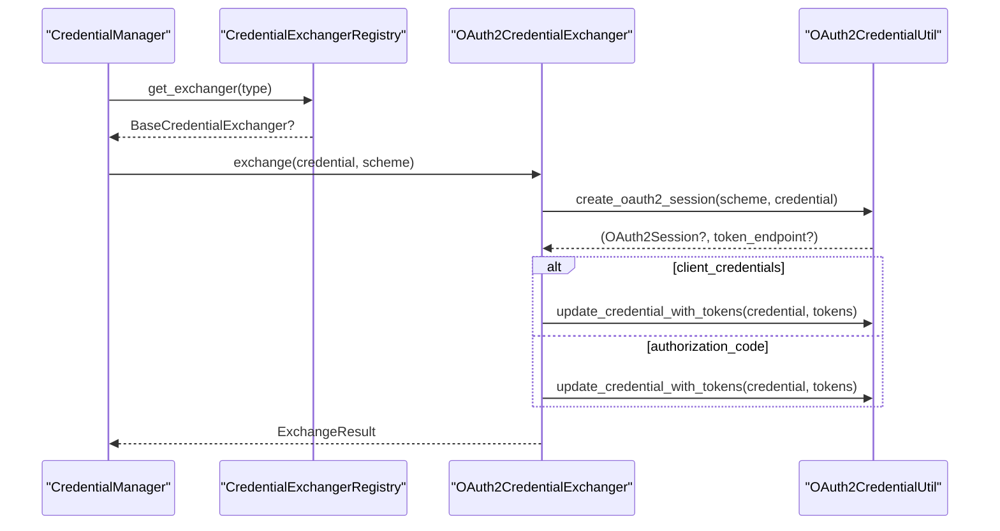
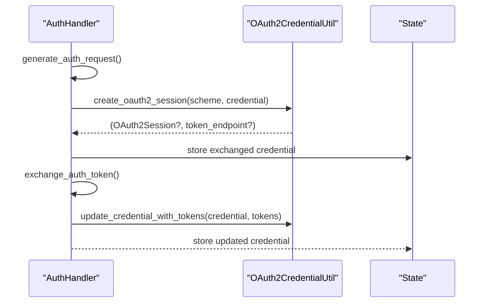
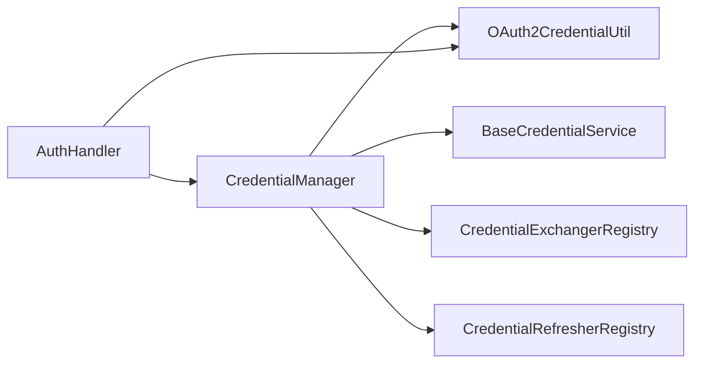

# Credential Management

<cite>
**Referenced Files in This Document**
- [credential_manager.py](file://src/google/adk/auth/credential_manager.py)
- [auth_credential.py](file://src/google/adk/auth/auth_credential.py)
- [auth_handler.py](file://src/google/adk/auth/auth_handler.py)
- [oauth2_credential_util.py](file://src/google/adk/auth/oauth2_credential_util.py)
- [base_credential_service.py](file://src/google/adk/auth/credential_service/base_credential_service.py)
- [in_memory_credential_service.py](file://src/google/adk/auth/credential_service/in_memory_credential_service.py)
- [session_state_credential_service.py](file://src/google/adk/auth/credential_service/session_state_credential_service.py)
- [base_credential_exchanger.py](file://src/google/adk/auth/exchanger/base_credential_exchanger.py)
- [credential_exchanger_registry.py](file://src/google/adk/auth/exchanger/credential_exchanger_registry.py)
- [oauth2_credential_exchanger.py](file://src/google/adk/auth/exchanger/oauth2_credential_exchanger.py)
- [base_credential_refresher.py](file://src/google/adk/auth/refresher/base_credential_refresher.py)
- [credential_refresher_registry.py](file://src/google/adk/auth/refresher/credential_refresher_registry.py)
</cite>

## Table of Contents
1. [Introduction](#introduction)
2. [Project Structure](#project-structure)
3. [Core Components](#core-components)
4. [Architecture Overview](#architecture-overview)
5. [Detailed Component Analysis](#detailed-component-analysis)
6. [Dependency Analysis](#dependency-analysis)
7. [Performance Considerations](#performance-considerations)
8. [Troubleshooting Guide](#troubleshooting-guide)
9. [Conclusion](#conclusion)
10. [Appendices](#appendices)

## Introduction
This document explains credential management in the Agent Development Kit (ADK). It focuses on the CredentialManager class and its coordination of credential services across different storage backends. It covers the credential service architecture, including base service abstractions, in-memory storage for development, and session-state storage for production environments. It documents the credential lifecycle from creation through validation, exchange, refresh, and persistence, along with serialization and deserialization patterns and secure storage considerations. It also describes integration between credential services and authentication handlers, including automatic credential injection into tool requests, and provides practical configuration examples and troubleshooting guidance.

## Project Structure
The credential management system is organized around:
- A central orchestrator (CredentialManager) that validates, loads, exchanges, refreshes, and persists credentials.
- Credential models and schemes that define supported credential types and authentication schemes.
- Credential services that abstract storage backends (in-memory and session state).
- Exchangers and refreshers that implement credential transformations and lifecycle maintenance.
- Utilities for OAuth2 session creation and token updates.

**Diagram sources**
- [credential_manager.py](file://src/google/adk/auth/credential_manager.py#L41-L387)
- [base_credential_service.py](file://src/google/adk/auth/credential_service/base_credential_service.py#L28-L76)
- [in_memory_credential_service.py](file://src/google/adk/auth/credential_service/in_memory_credential_service.py#L29-L67)
- [session_state_credential_service.py](file://src/google/adk/auth/credential_service/session_state_credential_service.py#L29-L84)
- [credential_exchanger_registry.py](file://src/google/adk/auth/exchanger/credential_exchanger_registry.py#L28-L59)
- [oauth2_credential_exchanger.py](file://src/google/adk/auth/exchanger/oauth2_credential_exchanger.py#L47-L212)
- [credential_refresher_registry.py](file://src/google/adk/auth/refresher/credential_refresher_registry.py#L29-L60)
- [oauth2_credential_util.py](file://src/google/adk/auth/oauth2_credential_util.py#L34-L120)
- [auth_handler.py](file://src/google/adk/auth/auth_handler.py#L38-L209)

**Section sources**
- [credential_manager.py](file://src/google/adk/auth/credential_manager.py#L41-L387)
- [auth_credential.py](file://src/google/adk/auth/auth_credential.py#L190-L280)
- [auth_handler.py](file://src/google/adk/auth/auth_handler.py#L38-L209)
- [oauth2_credential_util.py](file://src/google/adk/auth/oauth2_credential_util.py#L34-L120)
- [base_credential_service.py](file://src/google/adk/auth/credential_service/base_credential_service.py#L28-L76)
- [in_memory_credential_service.py](file://src/google/adk/auth/credential_service/in_memory_credential_service.py#L29-L67)
- [session_state_credential_service.py](file://src/google/adk/auth/credential_service/session_state_credential_service.py#L29-L84)
- [base_credential_exchanger.py](file://src/google/adk/auth/exchanger/base_credential_exchanger.py#L38-L66)
- [credential_exchanger_registry.py](file://src/google/adk/auth/exchanger/credential_exchanger_registry.py#L28-L59)
- [oauth2_credential_exchanger.py](file://src/google/adk/auth/exchanger/oauth2_credential_exchanger.py#L47-L212)
- [base_credential_refresher.py](file://src/google/adk/auth/refresher/base_credential_refresher.py#L32-L75)
- [credential_refresher_registry.py](file://src/google/adk/auth/refresher/credential_refresher_registry.py#L29-L60)

## Core Components
- CredentialManager: Central orchestrator that validates configuration, checks readiness, loads from service or auth response, exchanges credentials, refreshes when needed, and persists results.
- AuthCredential and AuthCredentialTypes: Typed models for API Key, HTTP Basic/Bearer, OAuth2, OpenID Connect, and Service Account credentials.
- Credential Services: BaseCredentialService defines async load/save; InMemoryCredentialService and SessionStateCredentialService provide concrete stores keyed by app and user.
- Exchangers: BaseCredentialExchanger and OAuth2CredentialExchanger implement exchange logic for different grant types and schemes.
- Refreshers: BaseCredentialRefresher and registries coordinate refresh decisions and operations.
- OAuth2CredentialUtil: Helpers to create OAuth2 sessions and update credentials with tokens.
- AuthHandler: Orchestration of OAuth/OIDC flows, including generating auth URIs and storing exchanged tokens.

**Section sources**
- [credential_manager.py](file://src/google/adk/auth/credential_manager.py#L41-L387)
- [auth_credential.py](file://src/google/adk/auth/auth_credential.py#L190-L280)
- [base_credential_service.py](file://src/google/adk/auth/credential_service/base_credential_service.py#L28-L76)
- [in_memory_credential_service.py](file://src/google/adk/auth/credential_service/in_memory_credential_service.py#L29-L67)
- [session_state_credential_service.py](file://src/google/adk/auth/credential_service/session_state_credential_service.py#L29-L84)
- [base_credential_exchanger.py](file://src/google/adk/auth/exchanger/base_credential_exchanger.py#L38-L66)
- [oauth2_credential_exchanger.py](file://src/google/adk/auth/exchanger/oauth2_credential_exchanger.py#L47-L212)
- [base_credential_refresher.py](file://src/google/adk/auth/refresher/base_credential_refresher.py#L32-L75)
- [oauth2_credential_util.py](file://src/google/adk/auth/oauth2_credential_util.py#L34-L120)
- [auth_handler.py](file://src/google/adk/auth/auth_handler.py#L38-L209)

## Architecture Overview
The system separates concerns across three layers:
- Model Layer: Defines credential types and schemes.
- Service Layer: Abstracts storage backends and provides async load/save.
- Control Layer: Orchestrates lifecycle via CredentialManager, delegating to exchangers and refreshers, and integrating with AuthHandler for OAuth/OIDC flows.

```mermaid
classDiagram
class CredentialManager {
+register_credential_exchanger(type, exchanger)
+request_credential(context)
+get_auth_credential(context) AuthCredential?
-_validate_credential()
-_load_existing_credential(context) AuthCredential?
-_load_from_credential_service(context) AuthCredential?
-_load_from_auth_response(context) AuthCredential?
-_exchange_credential(credential) (AuthCredential,bool)
-_refresh_credential(credential) (AuthCredential,bool)
-_save_credential(context, credential)
-_populate_auth_scheme() bool
-_is_client_credentials_flow() bool
}
class BaseCredentialService {
<<abstract>>
+load_credential(auth_config, context) AuthCredential?
+save_credential(auth_config, context) void
}
class InMemoryCredentialService {
+load_credential(...)
+save_credential(...)
}
class SessionStateCredentialService {
+load_credential(...)
+save_credential(...)
}
class BaseCredentialExchanger {
<<abstract>>
+exchange(credential, scheme) ExchangeResult
}
class OAuth2CredentialExchanger {
+exchange(...)
-_exchange_client_credentials(...)
-_exchange_authorization_code(...)
}
class BaseCredentialRefresher {
<<abstract>>
+is_refresh_needed(credential, scheme) bool
+refresh(credential, scheme) AuthCredential
}
class CredentialExchangerRegistry {
+register(type, exchanger)
+get_exchanger(type) BaseCredentialExchanger?
}
class CredentialRefresherRegistry {
+register(type, refresher)
+get_refresher(type) BaseCredentialRefresher?
}
class OAuth2CredentialUtil {
+create_oauth2_session(scheme, credential) (OAuth2Session?, token_endpoint?)
+update_credential_with_tokens(credential, tokens)
}
class AuthHandler {
+generate_auth_request() AuthConfig
+parse_and_store_auth_response(state)
+exchange_auth_token() AuthCredential
}
CredentialManager --> BaseCredentialService : "loads/saves"
CredentialManager --> CredentialExchangerRegistry : "uses"
CredentialManager --> CredentialRefresherRegistry : "uses"
CredentialManager --> OAuth2CredentialUtil : "uses"
AuthHandler --> OAuth2CredentialUtil : "uses"
InMemoryCredentialService --|> BaseCredentialService
SessionStateCredentialService --|> BaseCredentialService
OAuth2CredentialExchanger --|> BaseCredentialExchanger
```

**Diagram sources**
- [credential_manager.py](file://src/google/adk/auth/credential_manager.py#L41-L387)
- [base_credential_service.py](file://src/google/adk/auth/credential_service/base_credential_service.py#L28-L76)
- [in_memory_credential_service.py](file://src/google/adk/auth/credential_service/in_memory_credential_service.py#L29-L67)
- [session_state_credential_service.py](file://src/google/adk/auth/credential_service/session_state_credential_service.py#L29-L84)
- [base_credential_exchanger.py](file://src/google/adk/auth/exchanger/base_credential_exchanger.py#L38-L66)
- [oauth2_credential_exchanger.py](file://src/google/adk/auth/exchanger/oauth2_credential_exchanger.py#L47-L212)
- [base_credential_refresher.py](file://src/google/adk/auth/refresher/base_credential_refresher.py#L32-L75)
- [credential_exchanger_registry.py](file://src/google/adk/auth/exchanger/credential_exchanger_registry.py#L28-L59)
- [credential_refresher_registry.py](file://src/google/adk/auth/refresher/credential_refresher_registry.py#L29-L60)
- [oauth2_credential_util.py](file://src/google/adk/auth/oauth2_credential_util.py#L34-L120)
- [auth_handler.py](file://src/google/adk/auth/auth_handler.py#L38-L209)

## Detailed Component Analysis

### CredentialManager
CredentialManager coordinates the entire credential lifecycle:
- Validates configuration and scheme completeness.
- Determines if a credential is ready (no exchange/refresh needed).
- Attempts to load from a credential service; falls back to auth response; if none, uses raw credential for client credentials flow or returns None for authorization code flow.
- Exchanges credentials (e.g., service account to access token) and refreshes if needed.
- Persists modified credentials back to the service.

**Diagram sources**
- [credential_manager.py](file://src/google/adk/auth/credential_manager.py#L135-L387)

**Section sources**
- [credential_manager.py](file://src/google/adk/auth/credential_manager.py#L41-L387)

### Credential Models and Schemes
- AuthCredentialTypes enumerates supported types: apiKey, http, oauth2, openIdConnect, serviceAccount.
- AuthCredential encapsulates typed credentials and optional resource references.
- OAuth2Auth, HttpAuth/HttpCredentials, ServiceAccount/ServiceAccountCredential define payload structures for each type.
- AuthHandler supports generating auth URIs and parsing responses for OAuth/OIDC flows.

**Diagram sources**
- [auth_credential.py](file://src/google/adk/auth/auth_credential.py#L190-L280)

**Section sources**
- [auth_credential.py](file://src/google/adk/auth/auth_credential.py#L190-L280)
- [auth_handler.py](file://src/google/adk/auth/auth_handler.py#L38-L209)

### Credential Services
- BaseCredentialService defines async load/save contracts.
- InMemoryCredentialService organizes per-app and per-user buckets for development.
- SessionStateCredentialService stores credentials in the invocation state for runtime sessions.

**Diagram sources**
- [base_credential_service.py](file://src/google/adk/auth/credential_service/base_credential_service.py#L28-L76)
- [in_memory_credential_service.py](file://src/google/adk/auth/credential_service/in_memory_credential_service.py#L29-L67)
- [session_state_credential_service.py](file://src/google/adk/auth/credential_service/session_state_credential_service.py#L29-L84)

**Section sources**
- [base_credential_service.py](file://src/google/adk/auth/credential_service/base_credential_service.py#L28-L76)
- [in_memory_credential_service.py](file://src/google/adk/auth/credential_service/in_memory_credential_service.py#L29-L67)
- [session_state_credential_service.py](file://src/google/adk/auth/credential_service/session_state_credential_service.py#L29-L84)

### Exchangers and Refreshers
- BaseCredentialExchanger defines the exchange contract returning an ExchangeResult.
- CredentialExchangerRegistry registers and retrieves exchangers by credential type.
- OAuth2CredentialExchanger implements client credentials and authorization code exchanges using OAuth2CredentialUtil helpers.
- BaseCredentialRefresher defines refresh contracts; registries mirror the exchanger pattern.

**Diagram sources**
- [credential_manager.py](file://src/google/adk/auth/credential_manager.py#L214-L234)
- [credential_exchanger_registry.py](file://src/google/adk/auth/exchanger/credential_exchanger_registry.py#L28-L59)
- [oauth2_credential_exchanger.py](file://src/google/adk/auth/exchanger/oauth2_credential_exchanger.py#L47-L212)
- [oauth2_credential_util.py](file://src/google/adk/auth/oauth2_credential_util.py#L34-L120)

**Section sources**
- [base_credential_exchanger.py](file://src/google/adk/auth/exchanger/base_credential_exchanger.py#L38-L66)
- [credential_exchanger_registry.py](file://src/google/adk/auth/exchanger/credential_exchanger_registry.py#L28-L59)
- [oauth2_credential_exchanger.py](file://src/google/adk/auth/exchanger/oauth2_credential_exchanger.py#L47-L212)
- [base_credential_refresher.py](file://src/google/adk/auth/refresher/base_credential_refresher.py#L32-L75)
- [credential_refresher_registry.py](file://src/google/adk/auth/refresher/credential_refresher_registry.py#L29-L60)
- [oauth2_credential_util.py](file://src/google/adk/auth/oauth2_credential_util.py#L34-L120)

### Authentication Handler Integration
- AuthHandler generates auth URIs for OAuth/OIDC flows and parses/stores responses.
- It can exchange tokens immediately and persist them into state for later retrieval by CredentialManager.

**Diagram sources**
- [auth_handler.py](file://src/google/adk/auth/auth_handler.py#L79-L209)
- [oauth2_credential_util.py](file://src/google/adk/auth/oauth2_credential_util.py#L34-L120)

**Section sources**
- [auth_handler.py](file://src/google/adk/auth/auth_handler.py#L38-L209)
- [oauth2_credential_util.py](file://src/google/adk/auth/oauth2_credential_util.py#L34-L120)

## Dependency Analysis
CredentialManager depends on:
- Credential services for persistence.
- Exchanger and refresher registries for lifecycle operations.
- OAuth2CredentialUtil for session creation and token updates.
- AuthHandler for OAuth/OIDC flow orchestration.

**Diagram sources**
- [credential_manager.py](file://src/google/adk/auth/credential_manager.py#L41-L387)
- [oauth2_credential_util.py](file://src/google/adk/auth/oauth2_credential_util.py#L34-L120)
- [auth_handler.py](file://src/google/adk/auth/auth_handler.py#L38-L209)

**Section sources**
- [credential_manager.py](file://src/google/adk/auth/credential_manager.py#L41-L387)
- [oauth2_credential_util.py](file://src/google/adk/auth/oauth2_credential_util.py#L34-L120)
- [auth_handler.py](file://src/google/adk/auth/auth_handler.py#L38-L209)

## Performance Considerations
- Prefer client credentials flow for server-to-server scenarios to avoid interactive steps and reduce latency.
- Use credential services to avoid repeated exchanges and token fetches within a session.
- Minimize copying of large credential objects; CredentialManager returns copies only when necessary to prevent cross-invocation mutation.
- Cache and reuse OAuth2Session instances where appropriate to reduce overhead.

## Troubleshooting Guide
Common issues and resolutions:
- Missing OAuth scheme metadata: CredentialManager attempts auto-discovery via OAuth2DiscoveryManager. If issuer_url is missing or discovery fails, configure explicit endpoints or enable discovery properly.
- Missing raw_auth_credential for OAuth/OIDC: Validation raises an error; ensure raw_auth_credential is provided and includes required fields (e.g., client_id/client_secret).
- Exchange failures: OAuth2CredentialExchanger logs warnings and returns the original credential when authlib is unavailable or exchange fails; verify network connectivity and endpoint configurations.
- Refresh not triggered: Ensure expires_at/expires_in are populated; refreshers check these timestamps to decide whether to refresh.
- Session-state storage risks: SessionStateCredentialService warns about potential insecurity; prefer persistent, encrypted storage for production.

Operational tips:
- Enable logging to capture warnings and errors during exchange and refresh.
- Verify credential keys and context scoping (app_name, user_id) when using in-memory service.
- Confirm that AuthHandler’s state keys match CredentialManager’s expectations.

**Section sources**
- [credential_manager.py](file://src/google/adk/auth/credential_manager.py#L266-L344)
- [oauth2_credential_exchanger.py](file://src/google/adk/auth/exchanger/oauth2_credential_exchanger.py#L76-L102)
- [session_state_credential_service.py](file://src/google/adk/auth/credential_service/session_state_credential_service.py#L29-L33)

## Conclusion
The ADK credential management system provides a robust, extensible framework for handling diverse authentication schemes. CredentialManager orchestrates validation, loading, exchange, refresh, and persistence, while credential services abstract storage backends. Exchangers and refreshers encapsulate protocol-specific logic, and AuthHandler integrates OAuth/OIDC flows. By leveraging these components, developers can implement secure and efficient credential handling across development and production environments.

## Appendices

### Practical Configuration Examples
- In-memory development store:
  - Instantiate InMemoryCredentialService and attach it to the invocation context so CredentialManager can load/save credentials per app and user.
- Session-state production store:
  - Use SessionStateCredentialService to persist credentials in the current session state for short-lived workloads.
- OAuth2 client credentials:
  - Provide raw_auth_credential with client_id/client_secret and configure the token endpoint; CredentialManager will exchange for access tokens automatically.
- OAuth2 authorization code:
  - Use AuthHandler to generate an auth URI, handle the redirect, and store the response; CredentialManager will then exchange the code for tokens.

Security best practices:
- Avoid storing sensitive tokens in plaintext session state for extended periods.
- Use encrypted storage backends for production.
- Limit token scopes and rotation policies.
- Validate and sanitize inputs for OAuth URIs and redirect URIs.
- Monitor logs for exchange and refresh failures and investigate promptly.