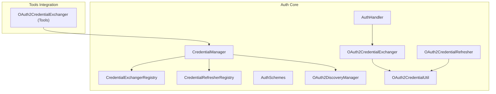
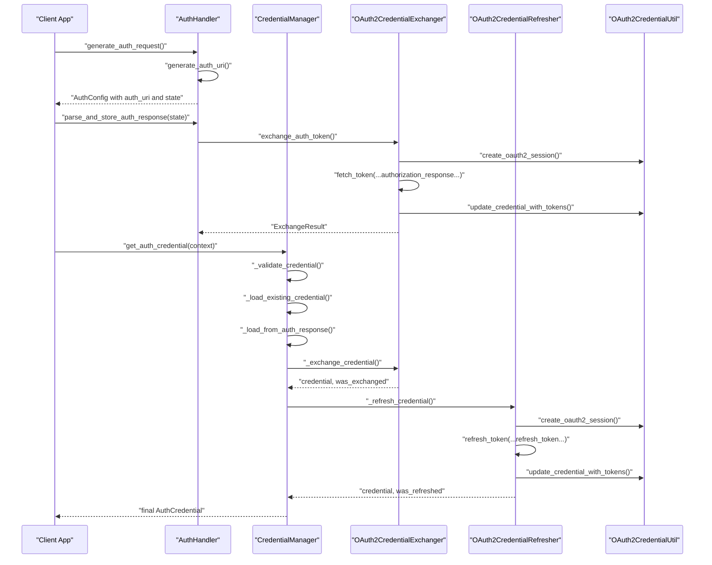
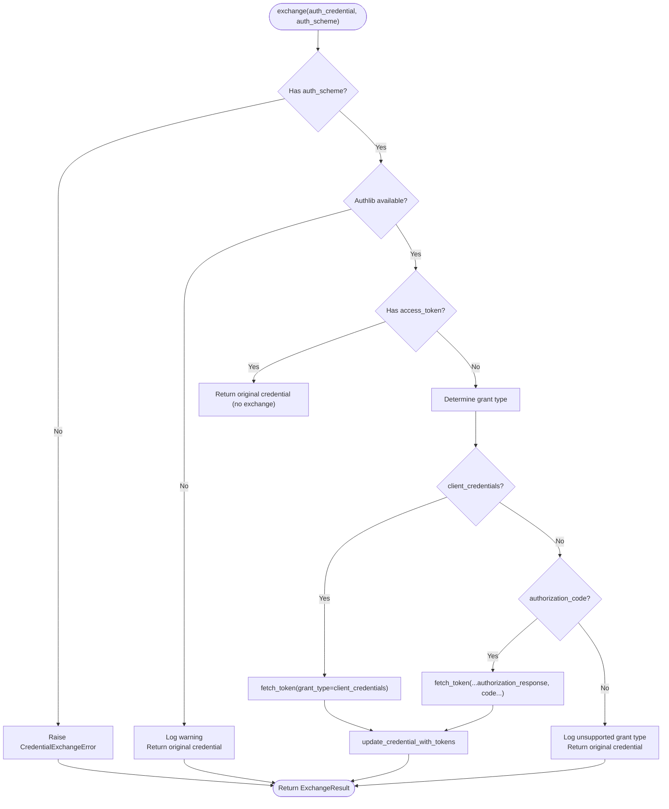
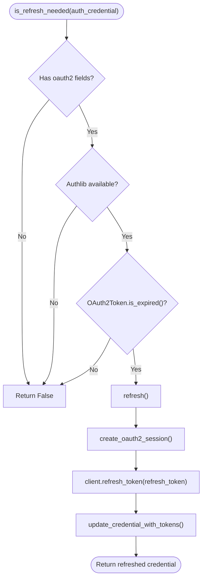
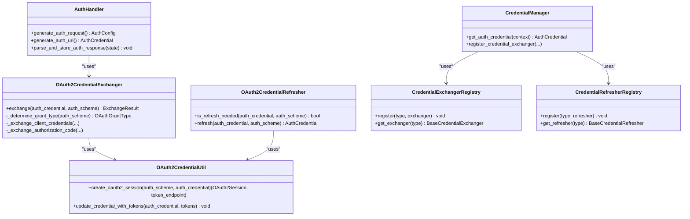

# OAuth2 Integration

<cite>
**Referenced Files in This Document**
- [oauth2_credential_exchanger.py](file://src/google/adk/auth/exchanger/oauth2_credential_exchanger.py)
- [oauth2_credential_refresher.py](file://src/google/adk/auth/refresher/oauth2_credential_refresher.py)
- [oauth2_credential_util.py](file://src/google/adk/auth/oauth2_credential_util.py)
- [credential_exchanger_registry.py](file://src/google/adk/auth/exchanger/credential_exchanger_registry.py)
- [credential_refresher_registry.py](file://src/google/adk/auth/refresher/credential_refresher_registry.py)
- [base_credential_exchanger.py](file://src/google/adk/auth/exchanger/base_credential_exchanger.py)
- [base_credential_refresher.py](file://src/google/adk/auth/refresher/base_credential_refresher.py)
- [auth_schemes.py](file://src/google/adk/auth/auth_schemes.py)
- [oauth2_discovery.py](file://src/google/adk/auth/oauth2_discovery.py)
- [credential_manager.py](file://src/google/adk/auth/credential_manager.py)
- [auth_credential.py](file://src/google/adk/auth/auth_credential.py)
- [auth_handler.py](file://src/google/adk/auth/auth_handler.py)
- [oauth2_exchanger.py](file://src/google/adk/tools/openapi_tool/auth/credential_exchangers/oauth2_exchanger.py)
</cite>

## Table of Contents
1. [Introduction](#introduction)
2. [Project Structure](#project-structure)
3. [Core Components](#core-components)
4. [Architecture Overview](#architecture-overview)
5. [Detailed Component Analysis](#detailed-component-analysis)
6. [Dependency Analysis](#dependency-analysis)
7. [Performance Considerations](#performance-considerations)
8. [Troubleshooting Guide](#troubleshooting-guide)
9. [Conclusion](#conclusion)
10. [Appendices](#appendices)

## Introduction
This document explains the OAuth2 integration in the Agent Development Kit (ADK). It focuses on the OAuth2CredentialExchanger and OAuth2CredentialRefresher, how they exchange authorization codes for access tokens, validate tokens, handle refresh tokens, and recover from errors. It also covers the registries that manage different exchange strategies, the OAuth2 flow orchestration (authorization URL generation, state management, and callback handling), and practical examples for providers such as Google APIs and GitHub. Security considerations (PKCE, state validation, token storage) and troubleshooting guidance are included.

## Project Structure
The OAuth2 integration is organized around:
- Exchanger: transforms raw credentials into usable access tokens
- Refresher: checks expiration and refreshes tokens
- Utilities: session creation and token updates
- Registries: bind credential types to exchange/refresh strategies
- Schemes and Discovery: define supported flows and auto-discover endpoints
- Credential Manager: orchestrates the entire lifecycle
- Handler: generates authorization URLs and parses callbacks
- Tools integration: converts OAuth2 tokens to HTTP bearer tokens

**Diagram sources**
- [credential_manager.py](file://src/google/adk/auth/credential_manager.py#L88-L112)
- [auth_handler.py](file://src/google/adk/auth/auth_handler.py#L47-L54)
- [oauth2_credential_exchanger.py](file://src/google/adk/auth/exchanger/oauth2_credential_exchanger.py#L46-L102)
- [oauth2_credential_refresher.py](file://src/google/adk/auth/refresher/oauth2_credential_refresher.py#L44-L74)
- [oauth2_credential_util.py](file://src/google/adk/auth/oauth2_credential_util.py#L33-L97)
- [credential_exchanger_registry.py](file://src/google/adk/auth/exchanger/credential_exchanger_registry.py#L27-L58)
- [credential_refresher_registry.py](file://src/google/adk/auth/refresher/credential_refresher_registry.py#L28-L59)
- [auth_schemes.py](file://src/google/adk/auth/auth_schemes.py#L32-L72)
- [oauth2_discovery.py](file://src/google/adk/auth/oauth2_discovery.py#L52-L104)
- [oauth2_exchanger.py](file://src/google/adk/tools/openapi_tool/auth/credential_exchangers/oauth2_exchanger.py#L30-L119)

**Section sources**
- [credential_manager.py](file://src/google/adk/auth/credential_manager.py#L88-L112)
- [auth_handler.py](file://src/google/adk/auth/auth_handler.py#L79-L208)
- [oauth2_credential_exchanger.py](file://src/google/adk/auth/exchanger/oauth2_credential_exchanger.py#L46-L102)
- [oauth2_credential_refresher.py](file://src/google/adk/auth/refresher/oauth2_credential_refresher.py#L44-L74)
- [oauth2_credential_util.py](file://src/google/adk/auth/oauth2_credential_util.py#L33-L97)
- [credential_exchanger_registry.py](file://src/google/adk/auth/exchanger/credential_exchanger_registry.py#L27-L58)
- [credential_refresher_registry.py](file://src/google/adk/auth/refresher/credential_refresher_registry.py#L28-L59)
- [auth_schemes.py](file://src/google/adk/auth/auth_schemes.py#L32-L72)
- [oauth2_discovery.py](file://src/google/adk/auth/oauth2_discovery.py#L52-L104)
- [oauth2_exchanger.py](file://src/google/adk/tools/openapi_tool/auth/credential_exchangers/oauth2_exchanger.py#L30-L119)

## Core Components
- OAuth2CredentialExchanger: exchanges authorization codes and client credentials for access tokens, validates inputs, and updates tokens in the credential.
- OAuth2CredentialRefresher: determines if a token is expired and refreshes it using a refresh token.
- OAuth2CredentialUtil: creates OAuth2 sessions and updates credentials with new token data.
- CredentialExchangerRegistry and CredentialRefresherRegistry: map credential types to their respective strategies.
- AuthSchemes: defines supported OAuth2/OIDC flows and grant types.
- OAuth2DiscoveryManager: auto-discovers authorization and token endpoints via well-known locations.
- CredentialManager: orchestrates validation, exchange, refresh, and persistence of credentials.
- AuthHandler: generates authorization URLs, manages state, and parses callbacks.
- Tools OAuth2CredentialExchanger: converts OAuth2 access tokens into HTTP bearer credentials for tool usage.

**Section sources**
- [oauth2_credential_exchanger.py](file://src/google/adk/auth/exchanger/oauth2_credential_exchanger.py#L46-L211)
- [oauth2_credential_refresher.py](file://src/google/adk/auth/refresher/oauth2_credential_refresher.py#L44-L126)
- [oauth2_credential_util.py](file://src/google/adk/auth/oauth2_credential_util.py#L33-L119)
- [credential_exchanger_registry.py](file://src/google/adk/auth/exchanger/credential_exchanger_registry.py#L27-L58)
- [credential_refresher_registry.py](file://src/google/adk/auth/refresher/credential_refresher_registry.py#L28-L59)
- [auth_schemes.py](file://src/google/adk/auth/auth_schemes.py#L32-L72)
- [oauth2_discovery.py](file://src/google/adk/auth/oauth2_discovery.py#L52-L148)
- [credential_manager.py](file://src/google/adk/auth/credential_manager.py#L40-L386)
- [auth_handler.py](file://src/google/adk/auth/auth_handler.py#L38-L208)
- [oauth2_exchanger.py](file://src/google/adk/tools/openapi_tool/auth/credential_exchangers/oauth2_exchanger.py#L30-L119)

## Architecture Overview
The OAuth2 integration follows a lifecycle:
- Discovery: optional auto-discovery of endpoints
- Authorization URL Generation: build authorization URI with state
- Callback Handling: persist temporary credential and optionally exchange
- Exchange: convert authorization code or client credentials to tokens
- Validation: ensure required fields and flows are present
- Refresh: detect expiration and refresh tokens
- Persistence: save updated credential back to the credential service

**Diagram sources**
- [auth_handler.py](file://src/google/adk/auth/auth_handler.py#L79-L208)
- [credential_manager.py](file://src/google/adk/auth/credential_manager.py#L135-L183)
- [oauth2_credential_exchanger.py](file://src/google/adk/auth/exchanger/oauth2_credential_exchanger.py#L50-L102)
- [oauth2_credential_refresher.py](file://src/google/adk/auth/refresher/oauth2_credential_refresher.py#L76-L126)
- [oauth2_credential_util.py](file://src/google/adk/auth/oauth2_credential_util.py#L33-L97)

## Detailed Component Analysis

### OAuth2CredentialExchanger
Responsibilities:
- Determine grant type from auth scheme (client credentials vs authorization code)
- Exchange authorization code for tokens using the authorization response and code
- Exchange client credentials for tokens
- Normalize authorization URIs and handle missing libraries gracefully
- Update credential with tokens and return exchange result

Key behaviors:
- Validates presence of auth scheme and authlib availability
- Uses create_oauth2_session to configure OAuth2Session and token endpoint
- On success, update_credential_with_tokens writes access/refresh/id tokens and expiry fields
- On failure, logs error and returns original credential unchanged

**Diagram sources**
- [oauth2_credential_exchanger.py](file://src/google/adk/auth/exchanger/oauth2_credential_exchanger.py#L50-L102)
- [oauth2_credential_exchanger.py](file://src/google/adk/auth/exchanger/oauth2_credential_exchanger.py#L130-L163)
- [oauth2_credential_exchanger.py](file://src/google/adk/auth/exchanger/oauth2_credential_exchanger.py#L173-L211)
- [oauth2_credential_util.py](file://src/google/adk/auth/oauth2_credential_util.py#L100-L119)

**Section sources**
- [oauth2_credential_exchanger.py](file://src/google/adk/auth/exchanger/oauth2_credential_exchanger.py#L46-L211)
- [oauth2_credential_util.py](file://src/google/adk/auth/oauth2_credential_util.py#L33-L119)

### OAuth2CredentialRefresher
Responsibilities:
- Determine if a credential needs refresh based on expiry fields
- Refresh tokens using refresh_token and update credential
- Gracefully handle missing libraries and failures

Key behaviors:
- Converts stored expires_at/expires_in into an OAuth2Token and checks is_expired()
- Creates OAuth2Session and calls refresh_token with token endpoint
- On success, updates tokens; on failure, logs error and returns original credential

**Diagram sources**
- [oauth2_credential_refresher.py](file://src/google/adk/auth/refresher/oauth2_credential_refresher.py#L48-L74)
- [oauth2_credential_refresher.py](file://src/google/adk/auth/refresher/oauth2_credential_refresher.py#L76-L126)
- [oauth2_credential_util.py](file://src/google/adk/auth/oauth2_credential_util.py#L33-L97)

**Section sources**
- [oauth2_credential_refresher.py](file://src/google/adk/auth/refresher/oauth2_credential_refresher.py#L44-L126)
- [oauth2_credential_util.py](file://src/google/adk/auth/oauth2_credential_util.py#L33-L119)

### OAuth2CredentialUtil
Responsibilities:
- Build OAuth2Session from auth scheme and credential
- Update credential with token fields returned by provider

Key behaviors:
- Extract token endpoint from OIDC or OAuth2 flows
- Validate presence of client_id/client_secret and required fields
- Construct OAuth2Session with scopes, redirect_uri, state, and token auth method
- Write access_token, refresh_token, id_token, expires_at, expires_in back to credential

**Section sources**
- [oauth2_credential_util.py](file://src/google/adk/auth/oauth2_credential_util.py#L33-L119)

### Registries
Responsibilities:
- Map credential types to exchange/refresh strategies
- Provide lookup and registration APIs

Key behaviors:
- CredentialExchangerRegistry registers OAuth2 and OpenIdConnect to the OAuth2CredentialExchanger
- CredentialRefresherRegistry registers OAuth2 and OpenIdConnect to the OAuth2CredentialRefresher
- Both support custom registrations for other types

**Section sources**
- [credential_exchanger_registry.py](file://src/google/adk/auth/exchanger/credential_exchanger_registry.py#L27-L58)
- [credential_refresher_registry.py](file://src/google/adk/auth/refresher/credential_refresher_registry.py#L28-L59)
- [credential_manager.py](file://src/google/adk/auth/credential_manager.py#L88-L112)

### AuthSchemes and Discovery
- AuthSchemes defines OpenIdConnectWithConfig, union AuthScheme, and OAuthGrantType enumeration
- OAuth2DiscoveryManager auto-discovers authorization and token endpoints via well-known locations and validates issuer/resource metadata

**Section sources**
- [auth_schemes.py](file://src/google/adk/auth/auth_schemes.py#L32-L72)
- [oauth2_discovery.py](file://src/google/adk/auth/oauth2_discovery.py#L52-L148)

### CredentialManager Orchestration
Responsibilities:
- Validate configuration and auto-discover endpoints if needed
- Load existing credential from service or auth response
- Exchange credential (authorization code or client credentials)
- Refresh if expired
- Persist updated credential

Key behaviors:
- Registers default OAuth2 exchanger/refresher for OAuth2 and OpenIdConnect types
- Supports client credentials flow without requiring user consent
- Saves exchanged/refreshed credential back to the credential service

**Section sources**
- [credential_manager.py](file://src/google/adk/auth/credential_manager.py#L40-L386)

### AuthHandler Orchestration
Responsibilities:
- Generate authorization URI with state for user consent
- Parse and store callback response
- Exchange tokens from callback when applicable

Key behaviors:
- Uses Authlib to create authorization URL with scopes and state
- Stores exchanged credential in state keyed by credential_key
- Returns pre-built AuthConfig if auth_uri already exists

**Section sources**
- [auth_handler.py](file://src/google/adk/auth/auth_handler.py#L38-L208)

### Tools Integration
Responsibilities:
- Convert OAuth2 access tokens into HTTP bearer credentials for tool usage
- Validate scheme and credential types

Key behaviors:
- If access_token exists, wraps it as HTTP bearer credential
- Returns None when no token is available yet

**Section sources**
- [oauth2_exchanger.py](file://src/google/adk/tools/openapi_tool/auth/credential_exchangers/oauth2_exchanger.py#L30-L119)

## Dependency Analysis

**Diagram sources**
- [oauth2_credential_exchanger.py](file://src/google/adk/auth/exchanger/oauth2_credential_exchanger.py#L46-L211)
- [oauth2_credential_refresher.py](file://src/google/adk/auth/refresher/oauth2_credential_refresher.py#L44-L126)
- [oauth2_credential_util.py](file://src/google/adk/auth/oauth2_credential_util.py#L33-L119)
- [credential_exchanger_registry.py](file://src/google/adk/auth/exchanger/credential_exchanger_registry.py#L27-L58)
- [credential_refresher_registry.py](file://src/google/adk/auth/refresher/credential_refresher_registry.py#L28-L59)
- [credential_manager.py](file://src/google/adk/auth/credential_manager.py#L88-L112)
- [auth_handler.py](file://src/google/adk/auth/auth_handler.py#L47-L54)

**Section sources**
- [credential_manager.py](file://src/google/adk/auth/credential_manager.py#L88-L112)
- [auth_handler.py](file://src/google/adk/auth/auth_handler.py#L47-L54)
- [oauth2_credential_exchanger.py](file://src/google/adk/auth/exchanger/oauth2_credential_exchanger.py#L46-L211)
- [oauth2_credential_refresher.py](file://src/google/adk/auth/refresher/oauth2_credential_refresher.py#L44-L126)
- [oauth2_credential_util.py](file://src/google/adk/auth/oauth2_credential_util.py#L33-L119)

## Performance Considerations
- Session creation overhead: OAuth2Session initialization occurs during exchange and refresh; reuse where possible by storing and reusing the session across requests.
- Network latency: Token exchange and refresh calls depend on provider endpoints; consider retry/backoff policies at higher layers.
- Logging: Excessive warnings or errors can impact throughput; monitor logs and ensure authlib availability is checked early.
- Auto-discovery: Endpoint discovery involves network calls; cache discovered metadata when feasible.

[No sources needed since this section provides general guidance]

## Troubleshooting Guide
Common issues and resolutions:
- Missing authlib: Exchange/refresh may skip silently; ensure authlib is installed and available.
- Unsupported grant type: Only client_credentials and authorization_code are handled; verify auth scheme configuration.
- Missing token endpoint: OIDC/OAuth2 flows require token endpoints; use auto-discovery or configure manually.
- Invalid credential fields: Ensure client_id, client_secret, and required scopes are present.
- Expiration handling: If tokens are expired, rely on OAuth2CredentialRefresher to refresh; ensure refresh_token is present.
- Callback parsing: Ensure state matches and authorization response is passed correctly to exchange.

Operational tips:
- Enable debug logs to trace exchange and refresh steps.
- Validate issuer/resource metadata when using auto-discovery.
- Confirm redirect_uri and state handling in the authorization flow.

**Section sources**
- [oauth2_credential_exchanger.py](file://src/google/adk/auth/exchanger/oauth2_credential_exchanger.py#L76-L84)
- [oauth2_credential_exchanger.py](file://src/google/adk/auth/exchanger/oauth2_credential_exchanger.py#L100-L102)
- [oauth2_credential_util.py](file://src/google/adk/auth/oauth2_credential_util.py#L47-L77)
- [oauth2_discovery.py](file://src/google/adk/auth/oauth2_discovery.py#L92-L104)
- [oauth2_credential_refresher.py](file://src/google/adk/auth/refresher/oauth2_credential_refresher.py#L66-L74)
- [auth_handler.py](file://src/google/adk/auth/auth_handler.py#L56-L78)

## Conclusion
The ADK’s OAuth2 integration provides a robust, extensible framework for exchanging authorization codes and client credentials, validating tokens, and refreshing them automatically. The registries enable pluggable strategies, while CredentialManager and AuthHandler coordinate the end-to-end flow. By leveraging discovery, state management, and secure token handling, applications can integrate with a wide range of OAuth2 providers reliably.

[No sources needed since this section summarizes without analyzing specific files]

## Appendices

### Practical Provider Examples
- Google APIs:
  - Use OpenIdConnectWithConfig with authorization_endpoint, token_endpoint, and scopes
  - For client credentials flow, configure client_credentials grant type and use OAuth2CredentialExchanger
  - For authorization code flow, generate auth_uri with AuthHandler and exchange callback tokens
- GitHub:
  - Configure OAuth2 flows with authorizationCode.tokenUrl and scopes
  - Ensure redirect_uri matches registered application settings
  - Use state parameter to prevent CSRF attacks
- Generic OAuth2 Provider:
  - Define OAuth2 scheme with authorizationCode or clientCredentials flows
  - Optionally enable auto-discovery via issuer_url

[No sources needed since this section provides general guidance]

### Security Considerations
- PKCE: Not explicitly implemented in the current code; consider adding code_verifier/code_challenge for public clients
- State validation: AuthHandler generates and stores state; ensure callback handlers verify state before exchange
- Token storage: Store tokens securely; avoid logging sensitive fields; prefer encrypted storage
- Redirect URI enforcement: Validate redirect_uri in callbacks
- Issuer/resource validation: Use OAuth2DiscoveryManager to mitigate MIX-UP attacks

**Section sources**
- [auth_handler.py](file://src/google/adk/auth/auth_handler.py#L194-L202)
- [oauth2_discovery.py](file://src/google/adk/auth/oauth2_discovery.py#L92-L104)
- [auth_credential.py](file://src/google/adk/auth/auth_credential.py#L68-L95)