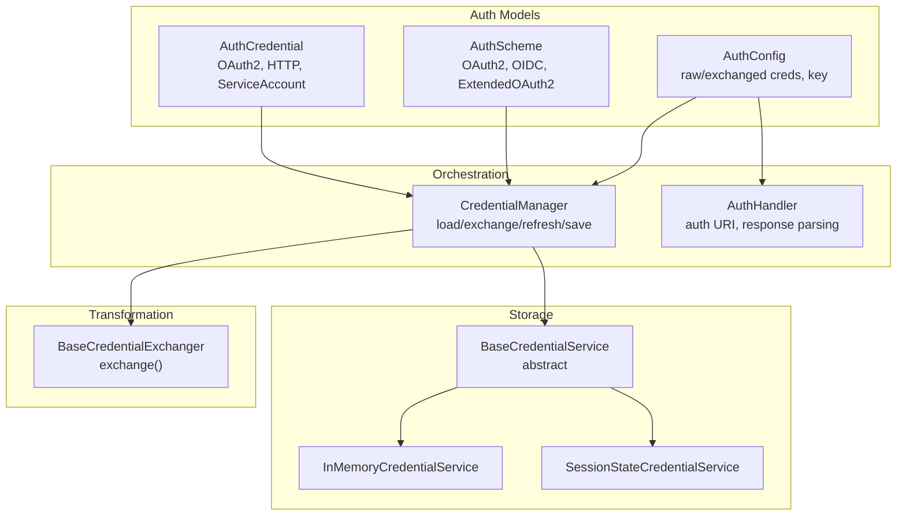
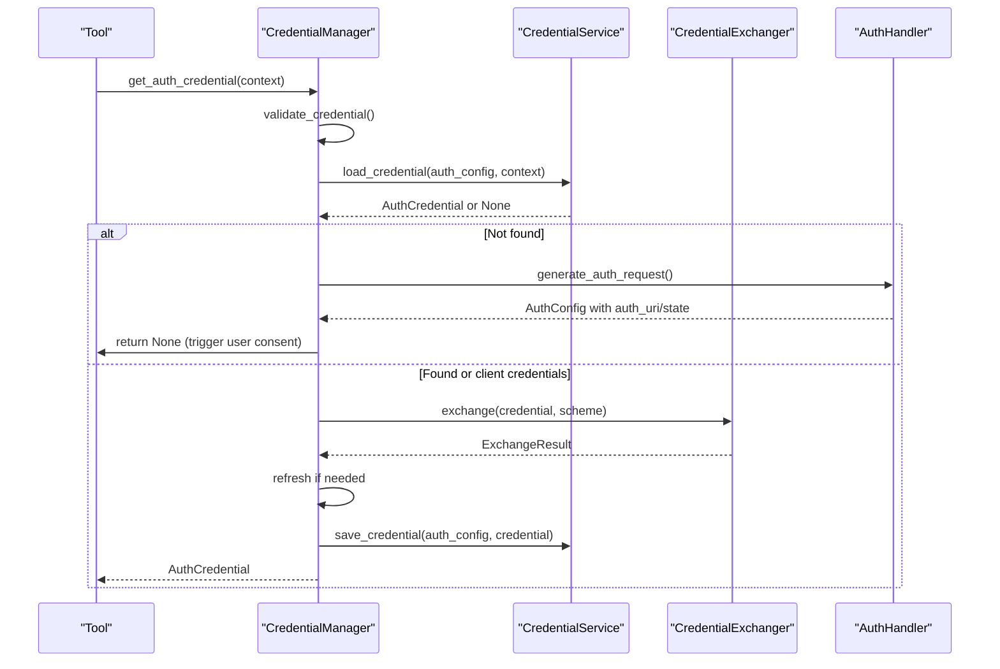
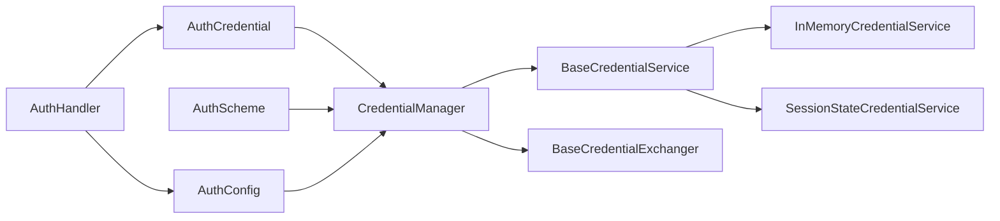

# Security Best Practices

<cite>
**Referenced Files in This Document**
- [auth_credential.py](file://src/google/adk/auth/auth_credential.py)
- [auth_schemes.py](file://src/google/adk/auth/auth_schemes.py)
- [auth_tool.py](file://src/google/adk/auth/auth_tool.py)
- [auth_handler.py](file://src/google/adk/auth/auth_handler.py)
- [credential_manager.py](file://src/google/adk/auth/credential_manager.py)
- [base_credential_service.py](file://src/google/adk/auth/credential_service/base_credential_service.py)
- [in_memory_credential_service.py](file://src/google/adk/auth/credential_service/in_memory_credential_service.py)
- [session_state_credential_service.py](file://src/google/adk/auth/credential_service/session_state_credential_service.py)
- [base_credential_exchanger.py](file://src/google/adk/auth/exchanger/base_credential_exchanger.py)
- [README.md](file://contributing/samples/authn-adk-all-in-one/README.md)
- [agent.py](file://contributing/samples/live_tool_callbacks_agent/agent.py)
</cite>

## Table of Contents
1. [Introduction](#introduction)
2. [Project Structure](#project-structure)
3. [Core Components](#core-components)
4. [Architecture Overview](#architecture-overview)
5. [Detailed Component Analysis](#detailed-component-analysis)
6. [Dependency Analysis](#dependency-analysis)
7. [Performance Considerations](#performance-considerations)
8. [Troubleshooting Guide](#troubleshooting-guide)
9. [Conclusion](#conclusion)
10. [Appendices](#appendices)

## Introduction
This document provides comprehensive security best practices for authentication and credential management in the Agent Development Kit (ADK). It focuses on secure credential storage patterns (at rest and in transit), access control and least privilege, secure credential sharing between agents, isolation patterns, logging and auditing without exposing sensitive data, multi-agent credential isolation and cross-agent access control, common vulnerabilities and mitigations, environment-specific configurations, secure development practices, and incident response procedures.

## Project Structure
The authentication and credential management subsystem centers around:
- Data models for credentials and schemes
- Orchestration of credential lifecycle (load, exchange, refresh, persist)
- Credential services for storage (in-memory and session-state)
- Exchangers for transforming credentials (e.g., service account to access tokens)
- Handlers for OAuth/OIDC flows and stateful responses
- Tooling for stable credential keys and auth configuration

**Diagram sources**
- [auth_credential.py](file://src/google/adk/auth/auth_credential.py#L214-L280)
- [auth_schemes.py](file://src/google/adk/auth/auth_schemes.py#L32-L80)
- [auth_tool.py](file://src/google/adk/auth/auth_tool.py#L51-L146)
- [credential_manager.py](file://src/google/adk/auth/credential_manager.py#L40-L387)
- [auth_handler.py](file://src/google/adk/auth/auth_handler.py#L38-L209)
- [base_credential_service.py](file://src/google/adk/auth/credential_service/base_credential_service.py#L27-L76)
- [in_memory_credential_service.py](file://src/google/adk/auth/credential_service/in_memory_credential_service.py#L28-L67)
- [session_state_credential_service.py](file://src/google/adk/auth/credential_service/session_state_credential_service.py#L28-L84)
- [base_credential_exchanger.py](file://src/google/adk/auth/exchanger/base_credential_exchanger.py#L37-L66)

**Section sources**
- [auth_credential.py](file://src/google/adk/auth/auth_credential.py#L1-L280)
- [auth_schemes.py](file://src/google/adk/auth/auth_schemes.py#L1-L80)
- [auth_tool.py](file://src/google/adk/auth/auth_tool.py#L1-L146)
- [credential_manager.py](file://src/google/adk/auth/credential_manager.py#L1-L387)
- [auth_handler.py](file://src/google/adk/auth/auth_handler.py#L1-L209)
- [base_credential_service.py](file://src/google/adk/auth/credential_service/base_credential_service.py#L1-L76)
- [in_memory_credential_service.py](file://src/google/adk/auth/credential_service/in_memory_credential_service.py#L1-L67)
- [session_state_credential_service.py](file://src/google/adk/auth/credential_service/session_state_credential_service.py#L1-L84)
- [base_credential_exchanger.py](file://src/google/adk/auth/exchanger/base_credential_exchanger.py#L1-L66)

## Core Components
- AuthCredential: Encapsulates credential values and metadata for API key, HTTP bearer/basic, OAuth2, OpenID Connect, and service accounts.
- AuthScheme: Defines the authentication scheme (OAuth2, OIDC, extended OAuth2 with issuer auto-discovery).
- AuthConfig: Carries the requested scheme and raw/exchanged credentials, plus a stable credential key for persistence.
- CredentialManager: Orchestrates credential lifecycle, including validation, loading, exchange, refresh, and saving.
- Credential Services: Abstractions for storing credentials keyed by app and user context.
- Exchangers: Transform credentials (e.g., service account to access token) and handle OAuth flows.
- AuthHandler: Generates authorization URIs, parses responses, and stores temporary credentials.

**Section sources**
- [auth_credential.py](file://src/google/adk/auth/auth_credential.py#L214-L280)
- [auth_schemes.py](file://src/google/adk/auth/auth_schemes.py#L32-L80)
- [auth_tool.py](file://src/google/adk/auth/auth_tool.py#L51-L146)
- [credential_manager.py](file://src/google/adk/auth/credential_manager.py#L40-L387)
- [base_credential_service.py](file://src/google/adk/auth/credential_service/base_credential_service.py#L27-L76)
- [base_credential_exchanger.py](file://src/google/adk/auth/exchanger/base_credential_exchanger.py#L37-L66)
- [auth_handler.py](file://src/google/adk/auth/auth_handler.py#L38-L209)

## Architecture Overview
The system separates concerns across models, orchestration, storage, and transformation. CredentialManager coordinates with CredentialServices and Exchangers to produce usable credentials. AuthHandler supports OAuth/OIDC flows and manages temporary state.

**Diagram sources**
- [credential_manager.py](file://src/google/adk/auth/credential_manager.py#L135-L184)
- [auth_handler.py](file://src/google/adk/auth/auth_handler.py#L79-L139)
- [base_credential_service.py](file://src/google/adk/auth/credential_service/base_credential_service.py#L32-L76)
- [base_credential_exchanger.py](file://src/google/adk/auth/exchanger/base_credential_exchanger.py#L45-L65)

## Detailed Component Analysis

### Secure Credential Storage Patterns
- At-rest storage
  - In-memory service: Stores per-app and per-user buckets. Suitable for ephemeral or controlled environments but not recommended for persistent secrets.
  - Session-state service: Stores credentials in invocation state. Explicitly warns about potential insecurity; use only in trusted, short-lived contexts.
- Keyed persistence
  - AuthConfig computes a stable credential key derived from the scheme and credential model digests, excluding volatile fields. This enables deterministic lookup and avoids leaking sensitive values into keys.

Recommendations:
- Prefer encrypted, backend-backed stores for production (e.g., secret managers or vaults). If using in-memory or session-state services, restrict scope and lifecycle, and ensure transport security.
- Enforce strict separation of credentials by app and user identifiers to minimize cross-contamination.

**Section sources**
- [in_memory_credential_service.py](file://src/google/adk/auth/credential_service/in_memory_credential_service.py#L28-L67)
- [session_state_credential_service.py](file://src/google/adk/auth/credential_service/session_state_credential_service.py#L28-L84)
- [auth_tool.py](file://src/google/adk/auth/auth_tool.py#L29-L136)

### Access Control and Principle of Least Privilege
- Credential types and scopes
  - OAuth2 and OpenID Connect support scopes and audiences. Configure minimal required scopes and audiences to reduce blast radius.
  - Service accounts support explicit audiences for identity verification in server-to-server flows.
- Validation and discovery
  - CredentialManager validates presence of required fields and performs auto-discovery for OAuth endpoints when an issuer is provided, ensuring correct and least-privilege configuration.

Recommendations:
- Define granular scopes per tool and agent.
- Use audiences for service-to-service tokens.
- Regularly review and prune unused scopes and endpoints.

**Section sources**
- [auth_credential.py](file://src/google/adk/auth/auth_credential.py#L68-L95)
- [auth_credential.py](file://src/google/adk/auth/auth_credential.py#L148-L188)
- [credential_manager.py](file://src/google/adk/auth/credential_manager.py#L266-L298)
- [credential_manager.py](file://src/google/adk/auth/credential_manager.py#L311-L344)

### Secure Credential Sharing Between Agents and Isolation Patterns
- Per-invocation isolation
  - CredentialManager copies raw credentials before mutation to prevent leakage across invocations and users when shared configs are reused.
- Context-aware buckets
  - InMemoryCredentialService organizes credentials by app and user, enforcing logical isolation between tenants.
- Temporary state handling
  - AuthHandler stores temporary credentials under a prefixed key to avoid polluting permanent state.

Recommendations:
- Treat credentials as tenant-scoped (app + user).
- Avoid sharing mutable AuthConfig instances across users or long-lived processes.
- Clear temporary state after use.

**Section sources**
- [credential_manager.py](file://src/google/adk/auth/credential_manager.py#L144-L147)
- [credential_manager.py](file://src/google/adk/auth/credential_manager.py#L197-L206)
- [in_memory_credential_service.py](file://src/google/adk/auth/credential_service/in_memory_credential_service.py#L56-L67)
- [auth_handler.py](file://src/google/adk/auth/auth_handler.py#L56-L78)

### Logging and Auditing Authentication Events
- Audit hooks
  - Live tool callbacks demonstrate adding audit logs before tool execution and optional blocking logic for security-sensitive actions.
- Sensitive data handling
  - Avoid logging raw credentials, tokens, or personally identifiable information (PII). Log only redacted or hashed representations (e.g., digests of sensitive fields).

Recommendations:
- Centralize audit logging in tool context state with redaction policies.
- Use structured logs with masked fields and correlation IDs.
- Apply retention and access controls to audit logs.

**Section sources**
- [agent.py](file://contributing/samples/live_tool_callbacks_agent/agent.py#L98-L124)

### Multi-Agent Systems: Credential Isolation and Cross-Agent Access Control
- Tenant isolation
  - App and user scoping in credential services ensures credentials remain isolated between agents and users.
- Cross-agent access
  - Limit cross-agent sharing to explicit, audited channels (e.g., shared credential service with strict ACLs).
- Least privilege per agent
  - Assign minimal scopes and audiences to each agent’s AuthConfig.

Recommendations:
- Enforce per-agent credential keys and namespaces.
- Gate inter-agent credential transfers with explicit consent and audit.
- Monitor and alert on unusual credential access patterns.

**Section sources**
- [in_memory_credential_service.py](file://src/google/adk/auth/credential_service/in_memory_credential_service.py#L56-L67)
- [auth_tool.py](file://src/google/adk/auth/auth_tool.py#L77-L95)

### Common Security Vulnerabilities and Mitigations
- Insecure storage
  - Risk: Storing secrets in plaintext session state or in-memory maps.
  - Mitigation: Use encrypted, backend-backed stores; avoid session-state for sensitive credentials.
- Over-permissioned scopes
  - Risk: Excessive OAuth scopes leading to broad data access.
  - Mitigation: Apply minimal scopes and validate during configuration.
- Credential leakage across invocations
  - Risk: Mutating shared AuthConfig instances.
  - Mitigation: Copy credentials before use; avoid global mutable state.
- Weak transport security
  - Risk: Transmitting tokens over unencrypted channels.
  - Mitigation: Enforce TLS for all endpoints; validate certificates.
- Insufficient audit coverage
  - Risk: Missing visibility into credential usage.
  - Mitigation: Instrument before-tool callbacks and maintain redacted audit trails.

**Section sources**
- [session_state_credential_service.py](file://src/google/adk/auth/credential_service/session_state_credential_service.py#L32-L33)
- [credential_manager.py](file://src/google/adk/auth/credential_manager.py#L144-L147)
- [auth_handler.py](file://src/google/adk/auth/auth_handler.py#L152-L209)
- [agent.py](file://contributing/samples/live_tool_callbacks_agent/agent.py#L98-L124)

### Security Configuration Recommendations by Environment
- Local development
  - Use in-memory credential service for convenience; restrict to single-user sessions and short lifecycles.
  - Enable strict logging with redaction; disable session-state for sensitive credentials.
- CI/CD
  - Store secrets in secure secret managers; inject only minimal required scopes.
  - Validate OAuth auto-discovery and issuer configuration.
- Production
  - Use backend-backed credential stores with encryption at rest and in transit.
  - Enforce least privilege scopes and audiences; enable audit logging with retention policies.
  - Harden network policies and enforce mutual TLS.

[No sources needed since this section provides general guidance]

### Secure Development Practices
- Credential rotation
  - Rotate service account keys and OAuth client secrets regularly; update stored credentials accordingly.
- Secure coding standards
  - Never hardcode secrets; use environment variables or secret managers.
  - Sanitize inputs and outputs; redact sensitive fields in logs.
- Security testing
  - Penetration test OAuth flows; validate token issuance and revocation.
  - Test credential isolation across tenants and agents.

[No sources needed since this section provides general guidance]

### Incident Response Procedures
- Detection
  - Monitor for unauthorized credential access, excessive token usage, and anomalies in audit logs.
- Containment
  - Revoke compromised credentials immediately; rotate secrets; disable affected clients.
- Eradication
  - Remove exposed secrets from logs and code; reconfigure scopes and audiences.
- Recovery
  - Restore from backups only after validating integrity; re-enable monitoring.
- Post-incident
  - Conduct a root cause analysis; update policies and training.

[No sources needed since this section provides general guidance]

## Dependency Analysis
The following diagram highlights key dependencies among authentication components.

**Diagram sources**
- [auth_credential.py](file://src/google/adk/auth/auth_credential.py#L214-L280)
- [auth_schemes.py](file://src/google/adk/auth/auth_schemes.py#L32-L80)
- [auth_tool.py](file://src/google/adk/auth/auth_tool.py#L51-L146)
- [credential_manager.py](file://src/google/adk/auth/credential_manager.py#L40-L387)
- [base_credential_service.py](file://src/google/adk/auth/credential_service/base_credential_service.py#L27-L76)
- [in_memory_credential_service.py](file://src/google/adk/auth/credential_service/in_memory_credential_service.py#L28-L67)
- [session_state_credential_service.py](file://src/google/adk/auth/credential_service/session_state_credential_service.py#L28-L84)
- [base_credential_exchanger.py](file://src/google/adk/auth/exchanger/base_credential_exchanger.py#L37-L66)
- [auth_handler.py](file://src/google/adk/auth/auth_handler.py#L38-L209)

**Section sources**
- [credential_manager.py](file://src/google/adk/auth/credential_manager.py#L88-L113)
- [auth_handler.py](file://src/google/adk/auth/auth_handler.py#L47-L54)

## Performance Considerations
- Minimize credential exchanges by leveraging cached tokens and refresh strategies.
- Use asynchronous credential services to avoid blocking tool execution.
- Avoid unnecessary copying of credentials; reuse where safe and validated.

[No sources needed since this section provides general guidance]

## Troubleshooting Guide
- Missing OAuth configuration
  - Symptom: Errors indicating missing client_id/client_secret or authorization endpoints.
  - Action: Provide raw OAuth2 credentials or configure ExtendedOAuth2 with issuer_url for auto-discovery.
- Credential not found
  - Symptom: Empty result when loading credentials.
  - Action: Verify credential_key derivation and that the credential service bucket matches app/user context.
- Exchange failures
  - Symptom: Exceptions during credential exchange.
  - Action: Confirm exchanger availability and endpoint reachability; inspect ExchangeResult flags.

**Section sources**
- [credential_manager.py](file://src/google/adk/auth/credential_manager.py#L266-L298)
- [credential_manager.py](file://src/google/adk/auth/credential_manager.py#L311-L344)
- [base_credential_exchanger.py](file://src/google/adk/auth/exchanger/base_credential_exchanger.py#L28-L30)

## Conclusion
By combining secure storage, strict isolation, least-privilege configuration, robust logging, and disciplined operational practices, ADK applications can achieve strong authentication and credential security across single and multi-agent deployments. Adopt the recommendations herein to mitigate risks and maintain compliance with organizational and regulatory requirements.

## Appendices
- OAuth/OIDC demo overview
  - The all-in-one authentication demo illustrates end-to-end flows and emphasizes the importance of per-user identities over shared system identities.

**Section sources**
- [README.md](file://contributing/samples/authn-adk-all-in-one/README.md#L1-L27)