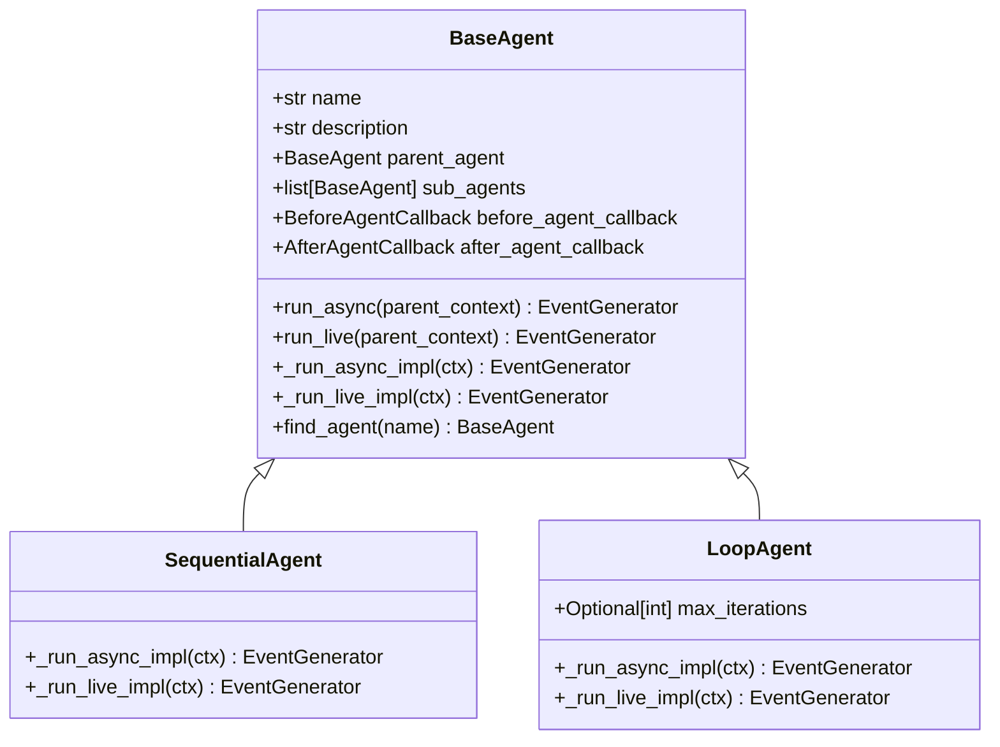
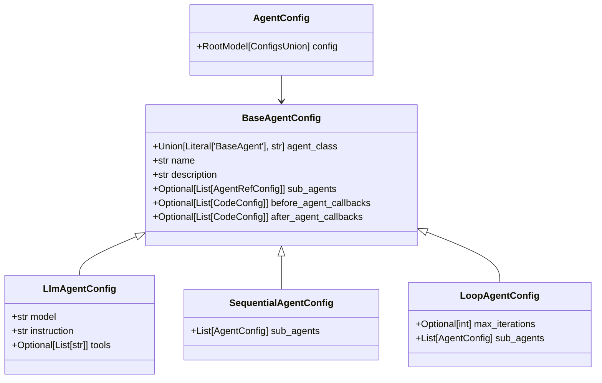
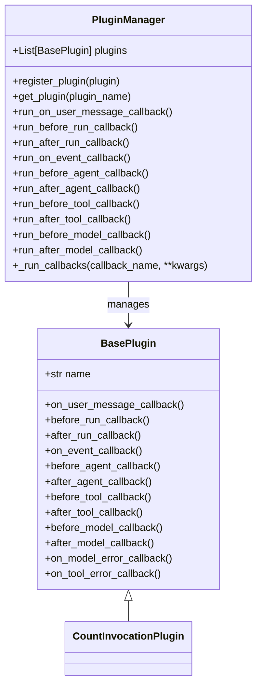
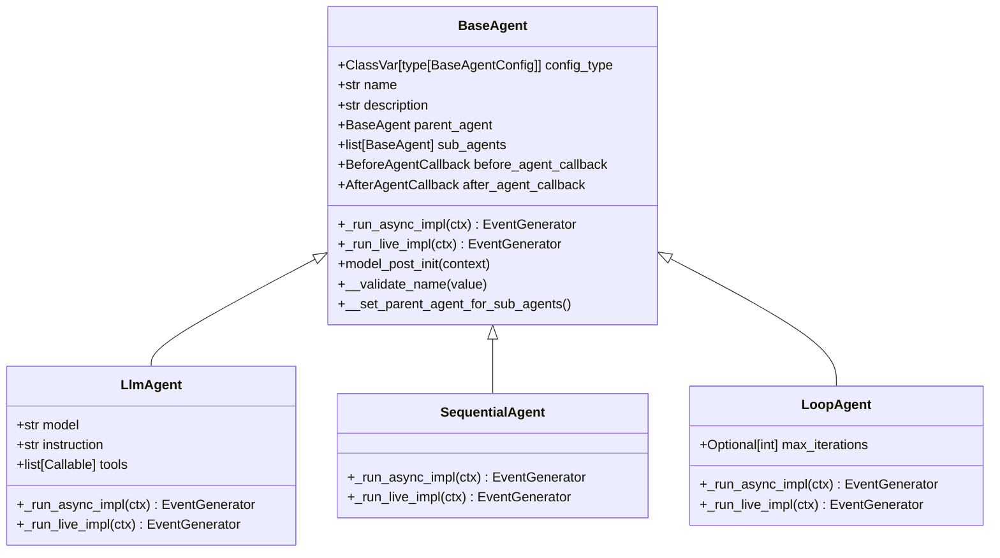
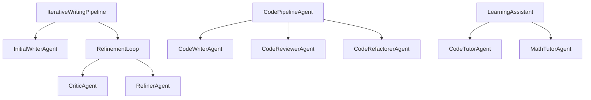

# Agent Design Patterns

<cite>
**Referenced Files in This Document**   
- [base_agent.py](file://src/google/adk/agents/base_agent.py)
- [agent_config.py](file://src/google/adk/agents/agent_config.py)
- [sequential_agent.py](file://src/google/adk/agents/sequential_agent.py)
- [loop_agent.py](file://src/google/adk/agents/loop_agent.py)
- [plugin_manager.py](file://src/google/adk/plugins/plugin_manager.py)
- [base_plugin.py](file://src/google/adk/plugins/base_plugin.py)
- [root_agent.yaml](file://contributing/samples/multi_agent_basic_config/root_agent.yaml)
- [code_tutor_agent.yaml](file://contributing/samples/multi_agent_basic_config/code_tutor_agent.yaml)
- [math_tutor_agent.yaml](file://contributing/samples/multi_agent_basic_config/math_tutor_agent.yaml)
- [loop_agent.yaml](file://contributing/samples/multi_agent_loop_config/loop_agent.yaml)
- [count_plugin.py](file://contributing/samples/plugin_basic/count_plugin.py)
- [main.py](file://contributing/samples/plugin_basic/main.py)
</cite>

## Table of Contents
1. [Introduction](#introduction)
2. [Composition Pattern for Multi-Agent Workflows](#composition-pattern-for-multi-agent-workflows)
3. [Configuration-as-Code vs YAML Configuration](#configuration-as-code-vs-yaml-configuration)
4. [Plugin Architecture for Extensibility](#plugin-architecture-for-extensibility)
5. [Agent Inheritance Patterns](#agent-inheritance-patterns)
6. [Real-World Examples of Agent Hierarchies](#real-world-examples-of-agent-hierarchies)
7. [Common Pitfalls and Interface Design](#common-pitfalls-and-interface-design)
8. [Conclusion](#conclusion)

## Introduction
The ADK framework provides a robust foundation for building maintainable and scalable agent systems through well-defined design patterns. This document explores key architectural approaches that enable developers to create sophisticated agent workflows while maintaining code quality and system reliability. The patterns covered include composition for combining multiple agents, configuration strategies, plugin-based extensibility, and inheritance models for extending functionality. By understanding these patterns, developers can build agent systems that are modular, reusable, and adaptable to changing requirements.

## Composition Pattern for Multi-Agent Workflows

The ADK framework implements a hierarchical composition pattern that allows multiple agents to be combined into complex workflows through parent-child relationships. The `BaseAgent` class serves as the foundation for all agents, providing core functionality including sub-agent management through the `sub_agents` field and parent reference via `parent_agent`. This composition model enables the creation of sophisticated agent trees where a root agent can delegate tasks to specialized sub-agents based on their capabilities.

The framework provides specialized agent classes that implement different workflow patterns. The `SequentialAgent` executes its sub-agents in a predetermined order, making it ideal for linear processing pipelines. The `LoopAgent` creates iterative workflows that continue until a termination condition is met, such as reaching a maximum number of iterations or receiving an escalation event. These composition patterns allow developers to model various workflow types, from simple linear sequences to complex feedback loops.

**Diagram sources**
- [base_agent.py](file://src/google/adk/agents/base_agent.py#L71-L612)
- [sequential_agent.py](file://src/google/adk/agents/sequential_agent.py#L34-L87)
- [loop_agent.py](file://src/google/adk/agents/loop_agent.py#L37-L93)

**Section sources**
- [base_agent.py](file://src/google/adk/agents/base_agent.py#L71-L612)
- [sequential_agent.py](file://src/google/adk/agents/sequential_agent.py#L34-L87)
- [loop_agent.py](file://src/google/adk/agents/loop_agent.py#L37-L93)

## Configuration-as-Code vs YAML Configuration

The ADK framework supports both configuration-as-code and YAML-based configuration approaches, each with distinct trade-offs. The configuration system is built around the `AgentConfig` class, which uses Pydantic's discriminated unions to handle different agent types through the `ConfigsUnion` type that includes `LlmAgentConfig`, `LoopAgentConfig`, `ParallelAgentConfig`, and `SequentialAgentConfig`. This design enables type-safe configuration handling while maintaining flexibility.

YAML configuration provides a declarative approach that separates configuration from code, making it easier to modify agent behavior without code changes. The YAML files reference a JSON schema for validation and use the `agent_class` field to determine the appropriate configuration type. This approach is particularly effective for multi-agent systems where different agents have distinct configurations, as demonstrated in the multi-agent samples where root agents delegate to specialized sub-agents through configuration files.

**Diagram sources**
- [agent_config.py](file://src/google/adk/agents/agent_config.py#L1-L67)
- [base_agent_config.py](file://src/google/adk/agents/base_agent_config.py#L37-L82)

**Section sources**
- [agent_config.py](file://src/google/adk/agents/agent_config.py#L1-L67)
- [base_agent_config.py](file://src/google/adk/agents/base_agent_config.py#L37-L82)
- [root_agent.yaml](file://contributing/samples/multi_agent_basic_config/root_agent.yaml#L1-L18)
- [code_tutor_agent.yaml](file://contributing/samples/multi_agent_basic_config/code_tutor_agent.yaml#L1-L16)
- [math_tutor_agent.yaml](file://contributing/samples/multi_agent_basic_config/math_tutor_agent.yaml#L1-L16)

## Plugin Architecture for Extensibility

The ADK framework implements a comprehensive plugin architecture through the `PluginManager` and `BasePlugin` classes, enabling extensibility without modifying core agent logic. The `PluginManager` maintains a registry of plugins and executes their callbacks in sequence, providing an "early exit" mechanism where a plugin can short-circuit further processing by returning a non-None value. This design allows plugins to intercept and modify agent behavior at critical execution points.

The `BasePlugin` class defines a rich set of callback methods that cover the entire agent execution lifecycle, including `before_agent_callback`, `after_agent_callback`, `before_tool_callback`, `after_tool_callback`, `before_model_callback`, and `after_model_callback`. These callbacks enable plugins to implement cross-cutting concerns such as logging, monitoring, caching, and security policies. The plugin system is designed to be globally applicable to all agents within a runner, ensuring consistent behavior across the entire agent system.

**Diagram sources**
- [plugin_manager.py](file://src/google/adk/plugins/plugin_manager.py#L58-L300)
- [base_plugin.py](file://src/google/adk/plugins/base_plugin.py#L41-L368)

**Section sources**
- [plugin_manager.py](file://src/google/adk/plugins/plugin_manager.py#L58-L300)
- [base_plugin.py](file://src/google/adk/plugins/base_plugin.py#L41-L368)
- [count_plugin.py](file://contributing/samples/plugin_basic/count_plugin.py#L1-L44)
- [main.py](file://contributing/samples/plugin_basic/main.py#L1-L66)

## Agent Inheritance Patterns

The ADK framework employs a sophisticated inheritance pattern that enables extension of agent functionality while maintaining compatibility. The `BaseAgent` class serves as the abstract base class with the `config_type` class variable that specifies the corresponding configuration class, allowing subclasses to define their own configuration types. This pattern ensures type safety while enabling specialization, as seen in the `SequentialAgent` and `LoopAgent` classes that override `config_type` to specify their respective configuration classes.

The framework implements a protected initialization pattern through the `model_post_init` method and field validators, ensuring proper setup of agent relationships. The `__set_parent_agent_for_sub_agents` method enforces the constraint that an agent can only have one parent, preventing circular references and maintaining tree integrity. This inheritance model supports both behavioral extension through method overriding and structural extension through configuration class specialization.

**Diagram sources**
- [base_agent.py](file://src/google/adk/agents/base_agent.py#L71-L612)
- [sequential_agent.py](file://src/google/adk/agents/sequential_agent.py#L34-L87)
- [loop_agent.py](file://src/google/adk/agents/loop_agent.py#L37-L93)

**Section sources**
- [base_agent.py](file://src/google/adk/agents/base_agent.py#L71-L612)
- [sequential_agent.py](file://src/google/adk/agents/sequential_agent.py#L34-L87)
- [loop_agent.py](file://src/google/adk/agents/loop_agent.py#L37-L93)

## Real-World Examples of Agent Hierarchies

The ADK framework demonstrates effective agent hierarchies through several real-world examples in the contributing samples. The multi-agent basic configuration shows a learning assistant that delegates coding questions to a code tutor agent and math questions to a math tutor agent, illustrating the delegation pattern for specialized task handling. This hierarchical approach allows the root agent to focus on routing while specialized sub-agents handle domain-specific tasks.

The multi-agent loop configuration implements an iterative writing pipeline with a refinement loop that executes critic and refiner agents in sequence until quality criteria are met or the maximum iteration count is reached. This pattern is particularly effective for tasks requiring iterative improvement, such as content creation or code optimization. The sequential configuration demonstrates a code pipeline agent that executes a sequence of code writing, reviewing, and refactoring agents, showcasing the linear workflow pattern for processing tasks that require multiple specialized steps.

**Diagram sources**
- [root_agent.yaml](file://contributing/samples/multi_agent_loop_config/root_agent.yaml#L1-L8)
- [loop_agent.yaml](file://contributing/samples/multi_agent_loop_config/loop_agent.yaml#L1-L9)
- [root_agent.yaml](file://contributing/samples/multi_agent_seq_config/root_agent.yaml#L1-L9)
- [root_agent.yaml](file://contributing/samples/multi_agent_basic_config/root_agent.yaml#L1-L18)

**Section sources**
- [root_agent.yaml](file://contributing/samples/multi_agent_loop_config/root_agent.yaml#L1-L8)
- [loop_agent.yaml](file://contributing/samples/multi_agent_loop_config/loop_agent.yaml#L1-L9)
- [root_agent.yaml](file://contributing/samples/multi_agent_seq_config/root_agent.yaml#L1-L9)
- [root_agent.yaml](file://contributing/samples/multi_agent_basic_config/root_agent.yaml#L1-L18)

## Common Pitfalls and Interface Design

When designing agent systems with the ADK framework, several common pitfalls should be avoided to ensure maintainability and scalability. One major pitfall is tight coupling between agents, which can be mitigated through proper interface design using the callback system and well-defined agent boundaries. The framework's callback architecture, including `before_agent_callback` and `after_agent_callback`, provides a clean interface for agents to interact without direct dependencies.

Another common issue is improper error handling in agent workflows, which can be addressed through the plugin system's error callbacks such as `on_model_error_callback` and `on_tool_error_callback`. These callbacks allow for centralized error handling and recovery strategies. The framework also provides mechanisms to prevent resource leaks through proper lifecycle management, with the `Aclosing` context manager ensuring proper cleanup of asynchronous generators.

The agent cloning mechanism, implemented through the `clone` method, addresses the limitation that an agent can only be added as a sub-agent once. This pattern allows for reuse of agent configurations while maintaining proper parent-child relationships. The validation of agent names as Python identifiers and the prohibition of the reserved "user" name demonstrate the framework's attention to preventing common configuration errors.

**Section sources**
- [base_agent.py](file://src/google/adk/agents/base_agent.py#L71-L612)
- [plugin_manager.py](file://src/google/adk/plugins/plugin_manager.py#L58-L300)
- [base_plugin.py](file://src/google/adk/plugins/base_plugin.py#L41-L368)

## Conclusion
The ADK framework provides a comprehensive set of design patterns for building maintainable and scalable agent systems. The composition pattern enables the creation of complex workflows through hierarchical agent relationships, while the configuration system supports both code-based and declarative approaches. The plugin architecture offers extensibility without compromising core functionality, and the inheritance model allows for safe extension of agent capabilities. Real-world examples demonstrate effective patterns for delegation, iteration, and sequential processing. By following these patterns and avoiding common pitfalls through proper interface design, developers can create robust agent systems that are modular, reusable, and adaptable to evolving requirements.