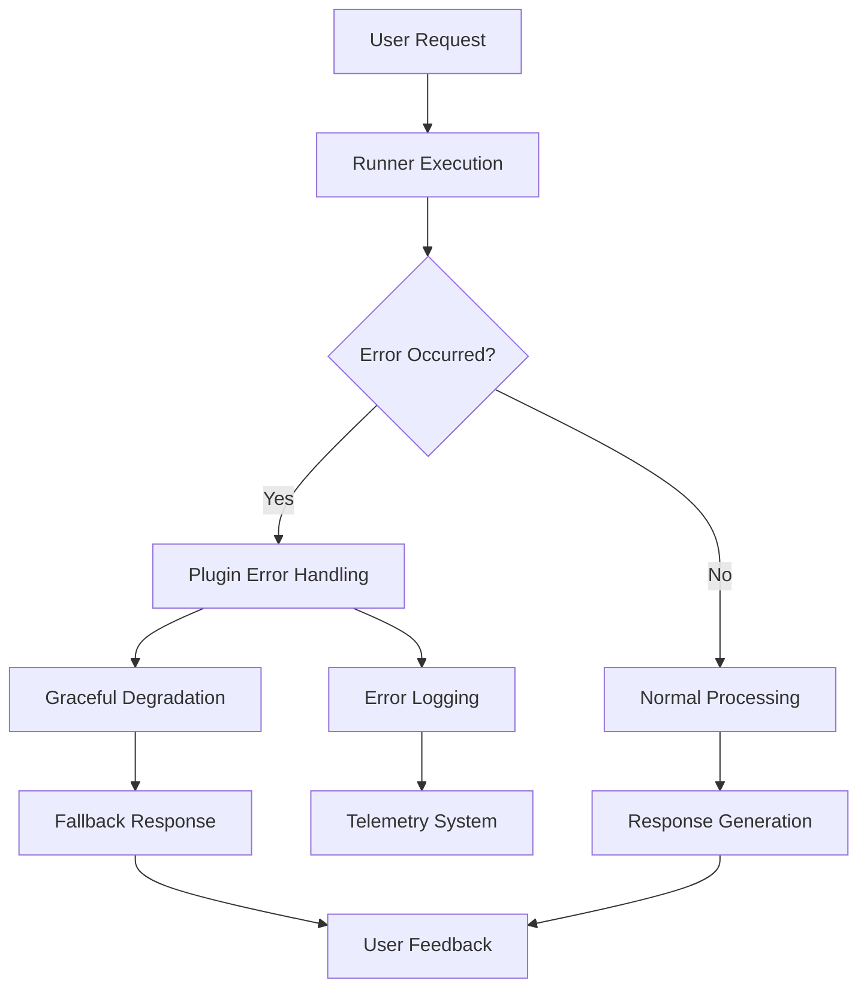
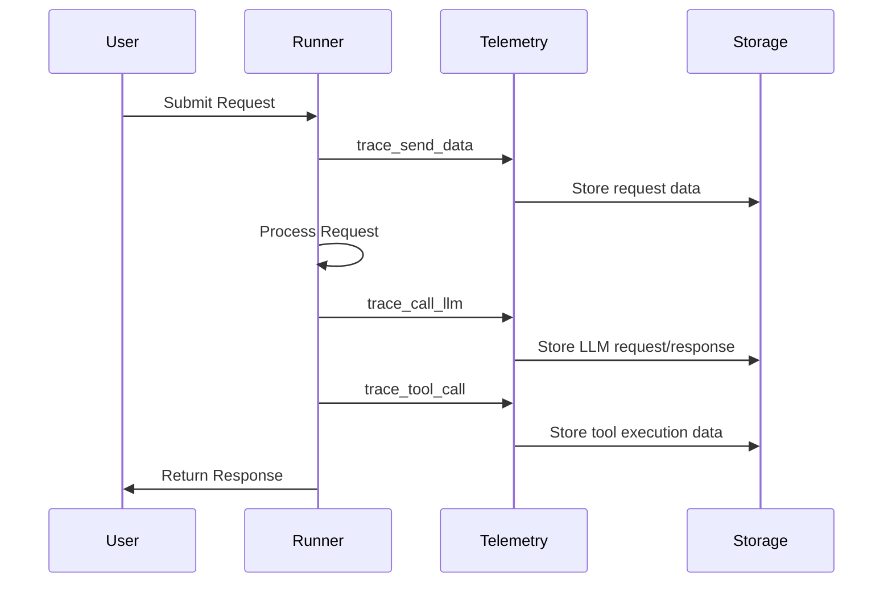
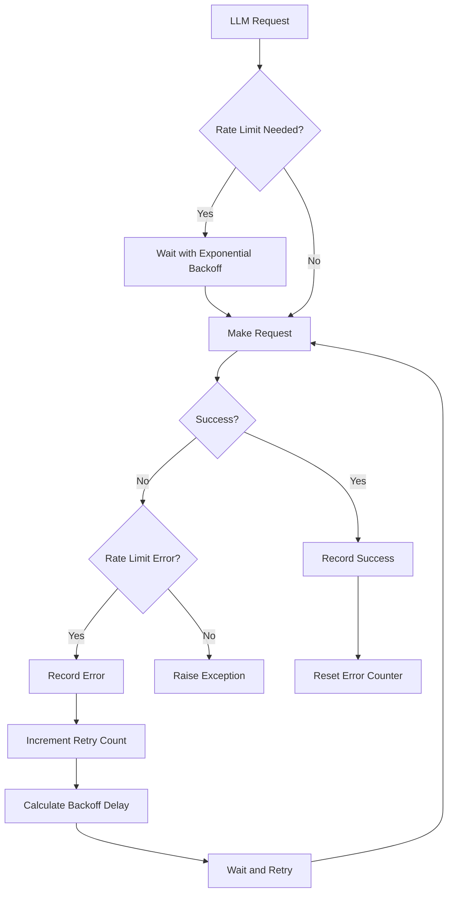

# Error Handling

<cite>
**Referenced Files in This Document**   
- [base_agent.py](file://src/google/adk/agents/base_agent.py)
- [runners.py](file://src/google/adk/runners.py)
- [not_found_error.py](file://src/google/adk/errors/not_found_error.py)
- [telemetry.py](file://src/google/adk/telemetry.py)
- [base_tool.py](file://src/google/adk/tools/base_tool.py)
- [base_llm_flow.py](file://src/google/adk/flows/llm_flows/base_llm_flow.py)
- [logging_plugin.py](file://src/google/adk/plugins/logging_plugin.py)
- [TOOL_CALL_RESPONSE_MISSING_BUG.md](file://docs-from-ai/TOOL_CALL_RESPONSE_MISSING_BUG.md)
- [Fix_ISSUE_1_Session_Abruptly_Stopped_After_MCP_Tool_Calls.md](file://docs-from-ai/Fix_ISSUE_1_Session_Abruptly_Stopped_After_MCP_Tool_Calls.md)
- [RATE_LIMIT_FIX_SUMMARY.md](file://docs-from-ai/RATE_LIMIT_FIX_SUMMARY.md)
</cite>

## Table of Contents
1. [Introduction](#introduction)
2. [Exception Handling Strategies](#exception-handling-strategies)
3. [Custom Error Types](#custom-error-types)
4. [User Feedback Mechanisms](#user-feedback-mechanisms)
5. [Logging and Monitoring](#logging-and-monitoring)
6. [Retry Strategies and Circuit Breakers](#retry-strategies-and-circuit-breakers)
7. [Error Resolution Patterns](#error-resolution-patterns)
8. [Conclusion](#conclusion)

## Introduction
This document provides a comprehensive overview of error handling patterns in the Agent Development Kit (ADK) framework. It covers graceful degradation strategies, meaningful user feedback mechanisms, and resilient operation patterns for agent systems. The documentation focuses on the implementation details in base_agent.py and runners.py, custom error types like NotFoundError, logging approaches through the telemetry system, and real-world bug fixes documented in the docs-from-ai directory.

## Exception Handling Strategies

The ADK framework implements a comprehensive exception handling system across its core components. In base_agent.py, the BaseAgent class uses a structured approach to handle execution flow through callback mechanisms that allow for error interception and recovery.

The Runner class in runners.py implements a robust error handling pipeline that manages agent execution within sessions. It uses a combination of synchronous and asynchronous error handling to ensure that errors are properly propagated while maintaining system stability. The run_async method wraps execution in a tracing span and handles exceptions through a well-defined error propagation mechanism.

When tool calls fail or LLM responses are invalid, the system follows a specific error propagation pattern. The _exec_with_plugin method in runners.py serves as the central error handling point, where plugin callbacks can intercept and modify error responses before they reach the user. This allows for graceful degradation by providing fallback responses or alternative execution paths when primary operations fail.



**Diagram sources**
- [runners.py](file://src/google/adk/runners.py#L251-L303)
- [base_agent.py](file://src/google/adk/agents/base_agent.py#L214-L249)

**Section sources**
- [base_agent.py](file://src/google/adk/agents/base_agent.py#L214-L249)
- [runners.py](file://src/google/adk/runners.py#L180-L249)

## Custom Error Types

The ADK framework defines custom error types to provide more specific error information than generic exceptions. The NotFoundError class in not_found_error.py serves as a prime example of this pattern.

```python
class NotFoundError(Exception):
  """Represents an error that occurs when an entity is not found."""

  def __init__(self, message="The requested item was not found."):
    """Initializes the NotFoundError exception.

    Args:
        message (str): An optional custom message to describe the error.
    """
    self.message = message
    super().__init__(self.message)
```

This custom exception pattern allows for more precise error handling in the application logic. By using specific exception types, the code can implement targeted recovery strategies based on the nature of the error. For example, a NotFoundError might trigger a different recovery path than a PermissionError or a TimeoutError.

To extend the error system for domain-specific exceptions, developers can follow the same pattern used for NotFoundError. This involves creating new exception classes that inherit from Python's base Exception class or from more specific exception types. These custom exceptions should include descriptive messages and, when appropriate, additional attributes that provide context about the error condition.

The framework's design encourages the creation of domain-specific exceptions that can carry relevant metadata about the error context. This enables more sophisticated error handling and recovery mechanisms, as the error handlers can access detailed information about what went wrong and why.

**Section sources**
- [not_found_error.py](file://src/google/adk/errors/not_found_error.py#L18-L29)

## User Feedback Mechanisms

The ADK framework implements several techniques for providing actionable feedback to users when errors occur. When tool calls fail or LLM responses are invalid, the system uses a multi-layered feedback approach that combines immediate error reporting with contextual guidance.

The logging_plugin.py file demonstrates a comprehensive approach to user feedback through its various callback methods. The plugin logs detailed information about errors, including LLM errors through the on_model_error_callback and tool errors through the on_tool_error_callback. These callbacks provide users with specific information about what went wrong, including the error type, affected components, and relevant context.

For tool execution errors, the framework provides detailed feedback about the specific tool that failed, its arguments, and the resulting error. This level of detail helps users understand the root cause of failures and take appropriate corrective actions. The after_tool_callback method in logging_plugin.py exemplifies this approach by logging the tool name, agent, function call ID, arguments, and result.

When LLM responses are invalid, the system provides feedback through the after_model_callback, which logs response details including content, partial status, and turn completion status. If an error occurred, it logs the error code and message, giving users clear information about the nature of the failure.

The framework also supports graceful degradation by allowing plugins to intercept errors and provide alternative responses. This enables the system to maintain functionality even when specific components fail, providing users with a continuous experience rather than abrupt interruptions.

**Section sources**
- [logging_plugin.py](file://src/google/adk/plugins/logging_plugin.py#L237-L267)
- [base_tool.py](file://src/google/adk/tools/base_tool.py#L96-L113)

## Logging and Monitoring

The ADK framework includes a comprehensive telemetry system for diagnosing issues in production environments. The telemetry.py file implements tracing functions that capture detailed information about system operations, including tool calls, LLM requests, and data transmission.

The trace_tool_call function records detailed information about tool executions, including the tool name, description, call ID, arguments, and response. This information is stored as attributes on OpenTelemetry spans, making it available for monitoring and debugging. The function also handles the serialization of non-serializable objects, ensuring that all relevant data is captured even when it contains complex types.



**Diagram sources**
- [telemetry.py](file://src/google/adk/telemetry.py#L60-L99)
- [runners.py](file://src/google/adk/runners.py#L180-L249)

The trace_call_llm function captures information about LLM interactions, including the model used, request configuration, input tokens, output tokens, and finish reasons. This data is crucial for monitoring API usage, identifying performance bottlenecks, and diagnosing issues with LLM responses.

The framework also includes the trace_send_data function, which records information about data sent to agents. This helps in understanding the context provided to agents and can be invaluable when debugging issues related to insufficient or incorrect context.

These telemetry functions are integrated throughout the system, ensuring that all significant operations are traced. The use of OpenTelemetry standards makes this data compatible with various monitoring and observability platforms, enabling comprehensive production monitoring.

**Section sources**
- [telemetry.py](file://src/google/adk/telemetry.py#L60-L289)

## Retry Strategies and Circuit Breakers

The ADK framework implements sophisticated retry strategies to handle transient failures, particularly rate limit errors from LLM APIs. The RATE_LIMIT_FIX_SUMMARY.md document details the implementation of a proactive and reactive rate limiting system in base_llm_flow.py.

The solution uses a two-layer protection approach with proactive rate limiting and reactive error handling. The LlmRateLimiter class implements exponential backoff with consecutive error tracking, ensuring that the system adapts to API conditions and avoids overwhelming external services.



**Diagram sources**
- [base_llm_flow.py](file://src/google/adk/flows/llm_flows/base_llm_flow.py#L81-L138)
- [RATE_LIMIT_FIX_SUMMARY.md](file://docs-from-ai/RATE_LIMIT_FIX_SUMMARY.md#L74-L155)

The system detects rate limit errors by checking for specific patterns in error messages, including "429", "rate limit", "too many requests", "quota exceeded", "TPM", and "RPM". This comprehensive detection ensures that various forms of rate limiting are properly handled.

Configuration is flexible through environment variables, allowing adjustment of retry behavior without code changes:
- ADK_MAX_RATE_LIMIT_RETRIES: Maximum retry attempts (default: 3)
- ADK_INITIAL_RETRY_DELAY: Initial delay in seconds (default: 2.0)
- ADK_MAX_RETRY_DELAY: Maximum delay in seconds (default: 60.0)
- ADK_ENABLE_RATE_LIMIT_RETRY: Enable automatic retry (default: true)

The implementation also includes proactive request spacing with a minimum 100ms between requests to prevent burst issues that could trigger rate limits. This combination of proactive and reactive measures creates a resilient system that can handle transient failures gracefully.

**Section sources**
- [base_llm_flow.py](file://src/google/adk/flows/llm_flows/base_llm_flow.py#L74-L155)
- [RATE_LIMIT_FIX_SUMMARY.md](file://docs-from-ai/RATE_LIMIT_FIX_SUMMARY.md#L74-L300)

## Error Resolution Patterns

The docs-from-ai directory contains several examples of error resolution patterns that demonstrate best practices for handling and fixing issues in the ADK framework. These documents provide valuable insights into real-world error scenarios and their solutions.

The TOOL_CALL_RESPONSE_MISSING_BUG.md document describes a critical protocol violation where tool responses were missing from message history. The root cause was identified as an OpenAI API protocol violation where assistant messages with tool_calls were not followed by corresponding tool response messages. The investigation revealed potential issues with message history truncation, filtering, or async timing that could remove tool responses before the next LLM call.

The Fix_ISSUE_1_Session_Abruptly_Stopped_After_MCP_Tool_Calls.md document details a solution that implemented a template-driven architecture to prevent premature stopping after MCP tool calls. The fix addressed workflow duplication and implicit sequencing by creating a single source of truth in templates, with explicit step-by-step execution guidance. This eliminated ambiguity and provided validation checkpoints to ensure completion before moving to the next phase.

Key patterns from these fixes include:
- Using templates as the single source of truth for workflows
- Implementing explicit step sequencing with validation checkpoints
- Adding completion requirements and verification checklists
- Creating detailed execution protocols with mandatory steps
- Implementing template-to-tool mapping examples

These patterns demonstrate a shift from implicit, agent-driven workflows to explicit, template-driven execution that ensures reliability and consistency. The solutions emphasize prevention through clear guidance and validation rather than reactive error handling.

**Section sources**
- [TOOL_CALL_RESPONSE_MISSING_BUG.md](file://docs-from-ai/TOOL_CALL_RESPONSE_MISSING_BUG.md#L1-L154)
- [Fix_ISSUE_1_Session_Abruptly_Stopped_After_MCP_Tool_Calls.md](file://docs-from-ai/Fix_ISSUE_1_Session_Abruptly_Stopped_After_MCP_Tool_Calls.md#L1-L585)

## Conclusion
The ADK framework provides a comprehensive error handling system that combines graceful degradation, meaningful user feedback, and resilient operation patterns. Through custom error types, sophisticated retry strategies, comprehensive logging, and well-documented resolution patterns, the framework ensures reliable agent operation even in the face of various failure modes.

The integration of telemetry, plugin-based error handling, and template-driven execution creates a robust foundation for building reliable agent systems. By following the patterns documented in this guide, developers can create agents that handle errors gracefully, provide actionable feedback to users, and maintain operation through transient failures.