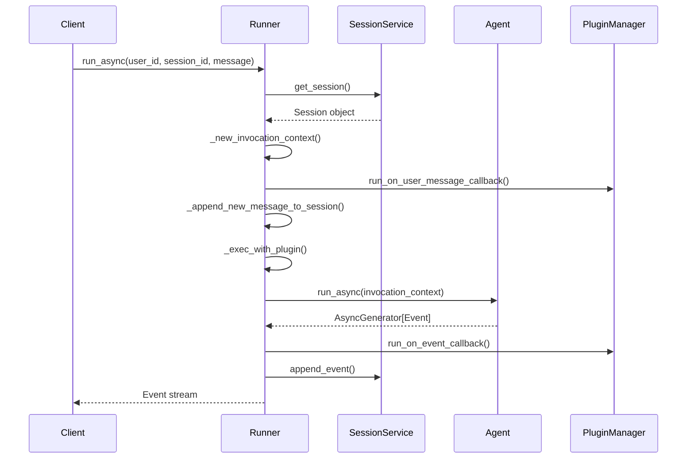
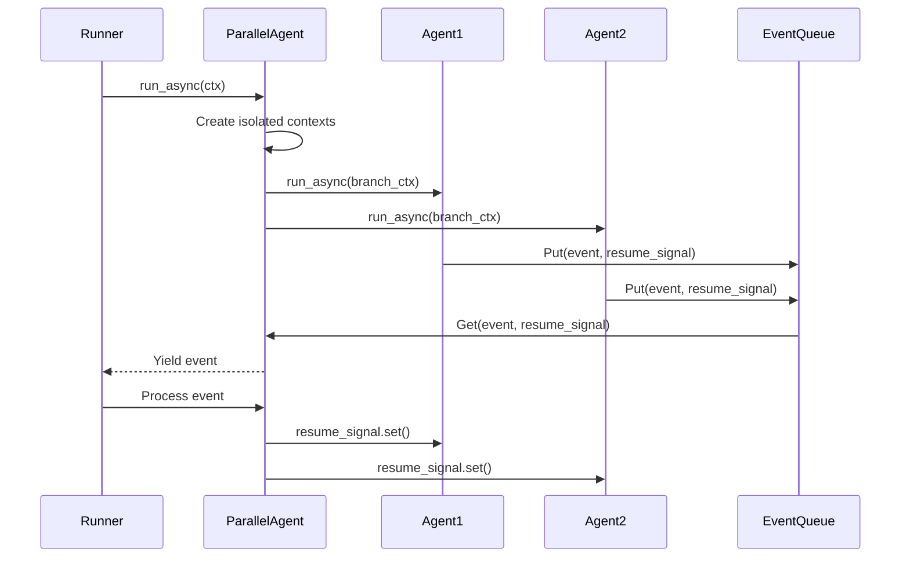
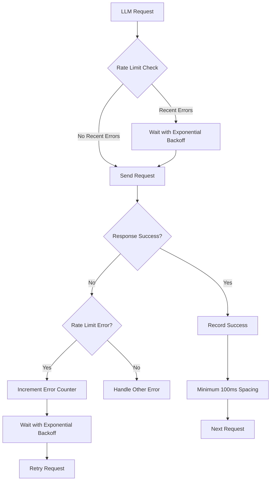
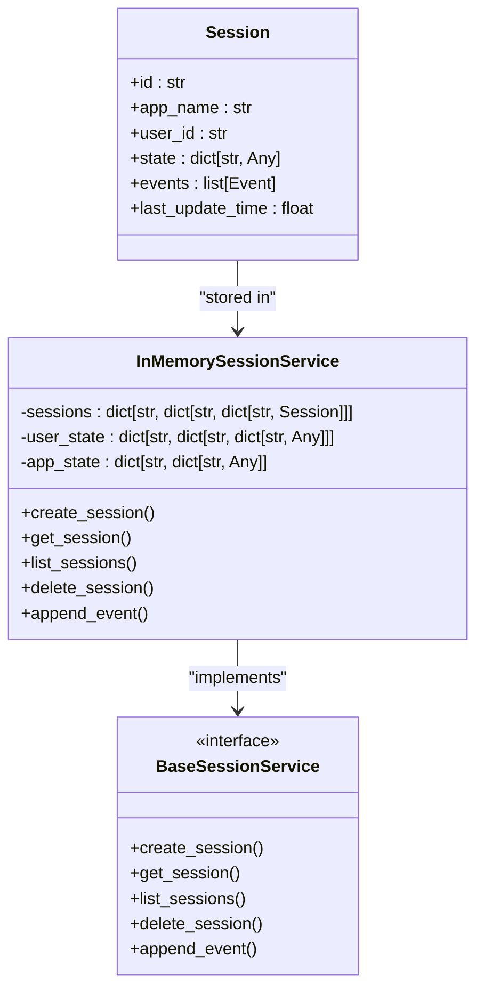
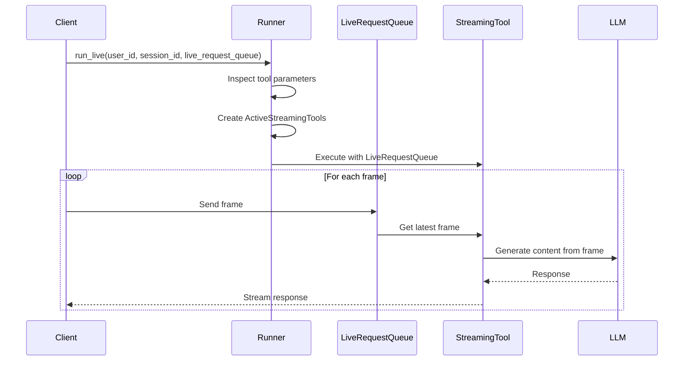
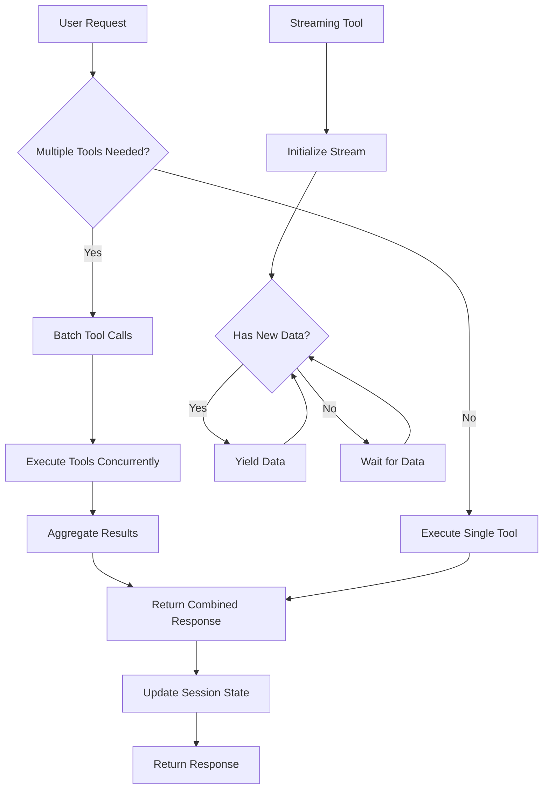

# Performance Optimization

<cite>
**Referenced Files in This Document**   
- [runners.py](file://src/google/adk/runners.py)
- [session.py](file://src/google/adk/sessions/session.py)
- [memory_entry.py](file://src/google/adk/memory/memory_entry.py)
- [parallel_agent.py](file://src/google/adk/agents/parallel_agent.py)
- [base_llm_flow.py](file://src/google/adk/flows/llm_flows/base_llm_flow.py)
- [in_memory_session_service.py](file://src/google/adk/sessions/in_memory_session_service.py)
- [in_memory_memory_service.py](file://src/google/adk/memory/in_memory_memory_service.py)
- [live_bidi_streaming_single_agent/agent.py](file://contributing/samples/live_bidi_streaming_single_agent/agent.py)
- [live_bidi_streaming_multi_agent/agent.py](file://contributing/samples/live_bidi_streaming_multi_agent/agent.py)
- [live_bidi_streaming_tools_agent/agent.py](file://contributing/samples/live_bidi_streaming_tools_agent/agent.py)
- [RATE_LIMIT_FIX_SUMMARY.md](file://docs-from-ai/RATE_LIMIT_FIX_SUMMARY.md)
- [TOOL_CALL_RESPONSE_MISSING_BUG.md](file://docs-from-ai/TOOL_CALL_RESPONSE_MISSING_BUG.md)
</cite>

## Table of Contents
1. [Introduction](#introduction)
2. [Asynchronous Execution Patterns](#asynchronous-execution-patterns)
3. [Concurrent Tool Call Optimization](#concurrent-tool-call-optimization)
4. [LLM Cost Reduction Strategies](#llm-cost-reduction-strategies)
5. [Efficient Session Management](#efficient-session-management)
6. [Streaming Optimization Techniques](#streaming-optimization-techniques)
7. [Tool Execution Optimization](#tool-execution-optimization)
8. [AI-Generated Performance Improvements](#ai-generated-performance-improvements)
9. [Conclusion](#conclusion)

## Introduction

This document provides comprehensive guidance on performance optimization techniques for agent systems within the ADK-Python framework. The focus is on reducing latency, improving throughput, and minimizing resource consumption across various aspects of agent execution. Key areas covered include asynchronous execution patterns, concurrent tool calls, LLM invocation cost reduction, session management, streaming optimization, and tool execution efficiency. The analysis is based on the codebase structure and implementation details from the repository, with specific reference to the Runner class, session and memory management components, parallel agent patterns, and live streaming capabilities.

## Asynchronous Execution Patterns

The ADK-Python framework implements sophisticated asynchronous execution patterns through the Runner class, which serves as the central execution engine for agent systems. The Runner class provides both synchronous and asynchronous interfaces, with the asynchronous `run_async` method being the recommended approach for production usage due to its superior performance characteristics.

The `run_async` method in the Runner class returns an `AsyncGenerator[Event, None]`, enabling efficient streaming of events as they are produced during agent execution. This approach minimizes latency by eliminating the need to wait for complete execution before processing results. The method orchestrates the entire agent execution lifecycle, including session retrieval, invocation context creation, and event processing through plugin callbacks.

**Diagram sources**
- [runners.py](file://src/google/adk/runners.py#L180-L249)

**Section sources**
- [runners.py](file://src/google/adk/runners.py#L180-L249)

## Concurrent Tool Call Optimization

The framework supports concurrent tool call optimization through the ParallelAgent class, which enables isolated parallel execution of sub-agents. This pattern is particularly beneficial for scenarios requiring multiple perspectives or attempts on a single task, such as running different algorithms simultaneously or generating multiple responses for evaluation.

The ParallelAgent implementation uses Python's asyncio framework to manage concurrent execution, with different implementations for Python versions before and after 3.11. For Python 3.11+, the implementation leverages `asyncio.TaskGroup` for efficient task management, while earlier versions use a custom replacement to ensure proper task cancellation and exception handling.

The `_merge_agent_run` function implements a sophisticated merging strategy that guarantees each agent will not proceed until its generated event has been processed by the upstream runner. This prevents overwhelming the system with events and ensures proper backpressure handling. The implementation uses a queue-based approach with resume signals to coordinate between parallel agents and the main event processing loop.

**Diagram sources**
- [parallel_agent.py](file://src/google/adk/agents/parallel_agent.py#L114-L159)

**Section sources**
- [parallel_agent.py](file://src/google/adk/agents/parallel_agent.py#L161-L197)

## LLM Cost Reduction Strategies

The framework implements several strategies to minimize LLM invocation costs through prompt optimization and caching mechanisms. One of the key features is the rate limit retry mechanism, which prevents unnecessary LLM calls by implementing both proactive and reactive rate limiting.

The proactive rate limiting prevents hitting rate limits through smart request spacing, while the reactive retry logic handles rate limit errors with exponential backoff. This two-layer protection system is implemented in the `LlmRateLimiter` class within `base_llm_flow.py`. The rate limiter tracks consecutive errors and applies exponential backoff (2s → 4s → 8s → ...) with a configurable maximum delay, preventing the system from overwhelming the LLM API with rapid retry attempts.

The framework also supports caching through the `AudioCacheManager` and `TranscriptionManager` classes, which can store and retrieve previously processed audio content and transcriptions. This reduces the need for repeated LLM invocations when processing similar content.

**Diagram sources**
- [base_llm_flow.py](file://src/google/adk/flows/llm_flows/base_llm_flow.py#L81-L138)

**Section sources**
- [base_llm_flow.py](file://src/google/adk/flows/llm_flows/base_llm_flow.py#L74-L138)
- [RATE_LIMIT_FIX_SUMMARY.md](file://docs-from-ai/RATE_LIMIT_FIX_SUMMARY.md#L74-L155)

## Efficient Session Management

The framework implements efficient session management practices to reduce memory overhead through the Session class and associated session services. The Session class represents a series of interactions between a user and agents, storing essential information such as the session ID, user ID, application name, state, and event history.

The `InMemorySessionService` provides an in-memory implementation of the session service, suitable for testing and development. It uses a hierarchical dictionary structure to organize sessions by application name, user ID, and session ID, enabling efficient retrieval and management. The service implements proper state merging, combining session state with user and application state prefixes to prevent naming conflicts.

To minimize memory overhead, the session service supports configurable event retrieval through the `GetSessionConfig` parameter, which allows clients to request only recent events or events after a specific timestamp. This prevents loading the entire session history when only recent interactions are needed.

**Diagram sources**
- [session.py](file://src/google/adk/sessions/session.py#L25-L58)
- [in_memory_session_service.py](file://src/google/adk/sessions/in_memory_session_service.py#L35-L304)

**Section sources**
- [session.py](file://src/google/adk/sessions/session.py#L25-L58)
- [in_memory_session_service.py](file://src/google/adk/sessions/in_memory_session_service.py#L35-L304)

## Streaming Optimization Techniques

The framework supports advanced streaming optimization techniques for live responses through the `run_live` method in the Runner class and specialized live streaming agents. The live streaming capabilities enable real-time interaction with agents, providing immediate feedback and reducing perceived latency.

The `LiveRequestQueue` class serves as a conduit for live streaming data, allowing tools to receive and process streaming inputs such as video frames or real-time sensor data. Tools that require live streaming capabilities can declare a `LiveRequestQueue` parameter in their function signature, which the framework automatically injects during execution.

The live streaming implementation in `monitor_video_stream` demonstrates an efficient pattern for processing streaming data. The tool continuously pulls the latest images from the queue, discarding older frames to ensure the most recent data is processed. This prevents the system from becoming overwhelmed with a backlog of frames and ensures timely responses.

**Diagram sources**
- [runners.py](file://src/google/adk/runners.py#L357-L464)
- [live_bidi_streaming_tools_agent/agent.py](file://contributing/samples/live_bidi_streaming_tools_agent/agent.py#L25-L110)

**Section sources**
- [runners.py](file://src/google/adk/runners.py#L357-L464)
- [live_bidi_streaming_tools_agent/agent.py](file://contributing/samples/live_bidi_streaming_tools_agent/agent.py#L25-L110)

## Tool Execution Optimization

The framework provides several mechanisms for optimizing tool execution, including batching API calls and leveraging the parallel agent for concurrent operations. The tool execution model is designed to minimize latency and maximize throughput through efficient resource utilization.

One key optimization is the ability to batch multiple tool calls in a single request, as demonstrated in the `live_bidi_streaming_single_agent` example. The agent instruction explicitly states "You can use multiple tools in parallel by calling functions in parallel (in one request and in one round)," enabling the LLM to coordinate multiple tool executions simultaneously.

The framework also supports long-running streaming tools that can maintain state across multiple invocations. The `monitor_stock_price` function demonstrates this pattern, yielding multiple responses over time as stock prices change. This eliminates the need for repeated polling and reduces both latency and API call volume.

**Diagram sources**
- [live_bidi_streaming_single_agent/agent.py](file://contributing/samples/live_bidi_streaming_single_agent/agent.py#L78-L89)
- [live_bidi_streaming_tools_agent/agent.py](file://contributing/samples/live_bidi_streaming_tools_agent/agent.py#L25-L48)

**Section sources**
- [live_bidi_streaming_single_agent/agent.py](file://contributing/samples/live_bidi_streaming_single_agent/agent.py#L78-L89)
- [live_bidi_streaming_tools_agent/agent.py](file://contributing/samples/live_bidi_streaming_tools_agent/agent.py#L25-L48)

## AI-Generated Performance Improvements

The framework incorporates AI-generated documentation and fixes that address performance-related issues and improvements. The `RATE_LIMIT_FIX_SUMMARY.md` document details an implementation of proactive and reactive rate limit handling that significantly improves system reliability and reduces failed requests.

The rate limit fix implements exponential backoff with a configurable maximum delay, preventing the system from overwhelming external APIs with rapid retry attempts. The solution also includes proactive request spacing with a minimum 100ms interval between requests, preventing burst issues that could trigger rate limiting.

Another AI-generated document, `TOOL_CALL_RESPONSE_MISSING_BUG.md`, identifies a critical bug related to missing tool responses in message history. This bug, when fixed, ensures proper protocol compliance with LLM APIs and prevents request failures due to incomplete message sequences.

These AI-generated improvements demonstrate the framework's commitment to continuous performance optimization through automated analysis and remediation of performance bottlenecks and protocol violations.

**Section sources**
- [RATE_LIMIT_FIX_SUMMARY.md](file://docs-from-ai/RATE_LIMIT_FIX_SUMMARY.md)
- [TOOL_CALL_RESPONSE_MISSING_BUG.md](file://docs-from-ai/TOOL_CALL_RESPONSE_MISSING_BUG.md)

## Conclusion

The ADK-Python framework provides a comprehensive set of performance optimization techniques for agent systems. Through asynchronous execution patterns, concurrent tool call optimization, LLM cost reduction strategies, efficient session management, streaming optimization, and tool execution improvements, the framework enables the development of high-performance agent systems with low latency and high throughput.

Key takeaways include the importance of using the `run_async` method for production deployments, leveraging the ParallelAgent for concurrent operations, implementing rate limit handling to minimize failed requests, optimizing session management to reduce memory overhead, and utilizing live streaming capabilities for real-time interactions. The framework's design emphasizes efficiency, scalability, and reliability, making it well-suited for demanding agent system applications.