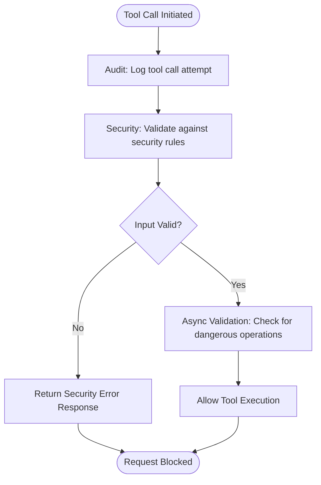
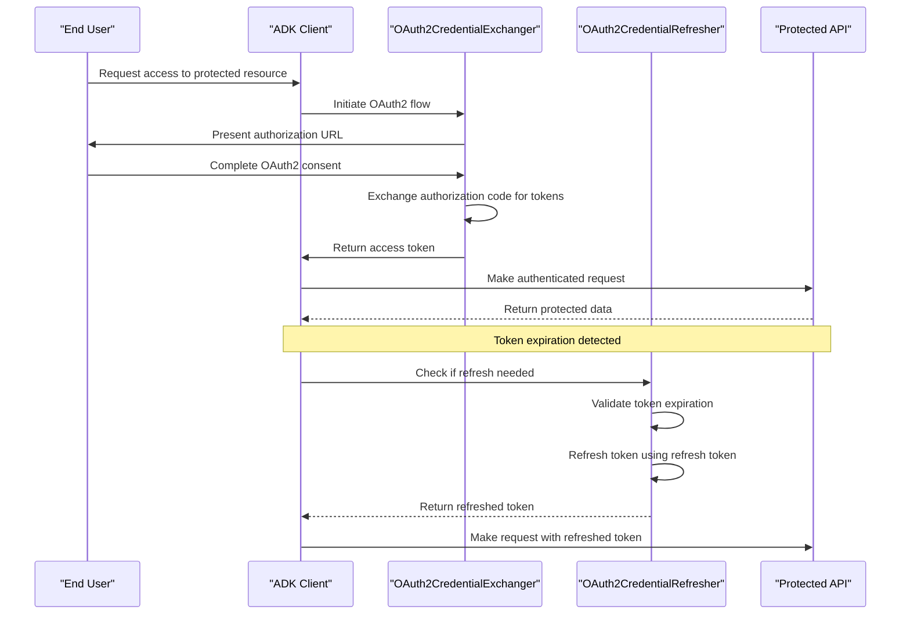
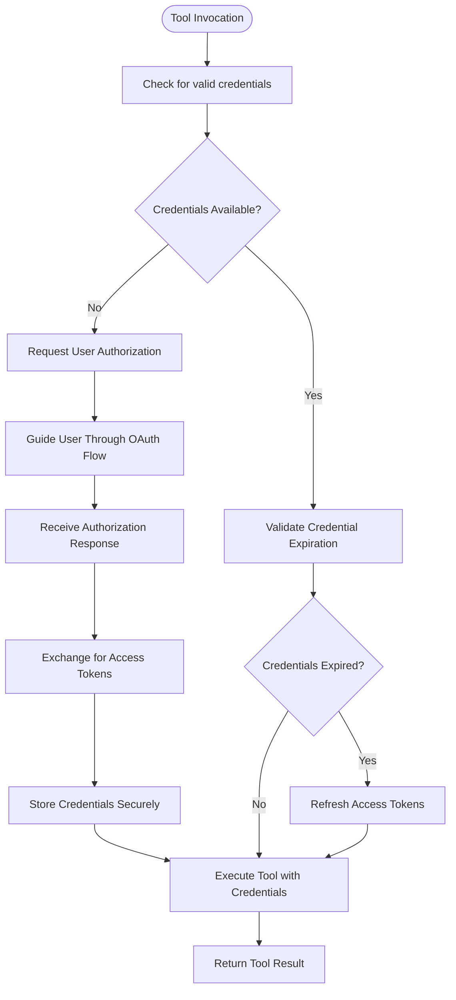
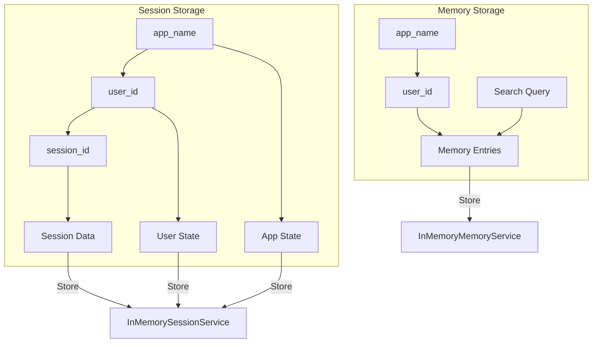
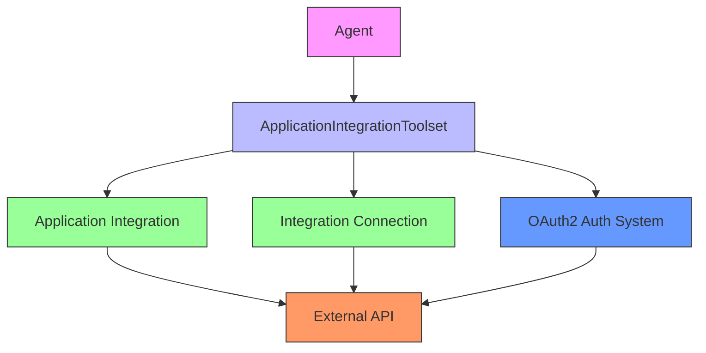

# Security Considerations

<cite>
**Referenced Files in This Document**   
- [base_authenticated_tool.py](file://src/google/adk/tools/base_authenticated_tool.py)
- [oauth2_credential_exchanger.py](file://src/google/adk/auth/exchanger/oauth2_credential_exchanger.py)
- [oauth2_credential_refresher.py](file://src/google/adk/auth/refresher/oauth2_credential_refresher.py)
- [application_integration_toolset.py](file://src/google/adk/tools/application_integration_tool/application_integration_toolset.py)
- [in_memory_memory_service.py](file://src/google/adk/memory/in_memory_memory_service.py)
- [in_memory_session_service.py](file://src/google/adk/sessions/in_memory_session_service.py)
- [common-config.sh](file://openspec-scripts/common-config.sh)
- [live_tool_callbacks_agent.py](file://contributing/samples/live_tool_callbacks_agent/agent.py)
- [a2a_auth/README.md](file://contributing/samples/a2a_auth/README.md)
- [integration_connector_euc_agent/README.md](file://contributing/samples/integration_connector_euc_agent/README.md)
</cite>

## Table of Contents
1. [Introduction](#introduction)
2. [Defenses Against Prompt Injection Attacks](#defenses-against-prompt-injection-attacks)
3. [Secure Authentication Patterns](#secure-authentication-patterns)
4. [Authorization Controls for Tool Access](#authorization-controls-for-tool-access)
5. [Data Protection in Sessions and Memory Services](#data-protection-in-sessions-and-memory-services)
6. [Secure External API Integrations](#secure-external-api-integrations)
7. [Deployment Configuration and Environment Variables](#deployment-configuration-and-environment-variables)
8. [Secure Agent Configuration Examples](#secure-agent-configuration-examples)
9. [Conclusion](#conclusion)

## Introduction
This document provides comprehensive security guidance for agent systems within the Agent Development Kit (ADK) framework. It addresses critical security aspects including protection against prompt injection attacks, secure authentication and authorization patterns, data protection mechanisms, and secure integration practices. The guidance is based on the analysis of the ADK Python codebase and its security-related components, focusing on practical implementation patterns and best practices for building secure agent systems.

## Defenses Against Prompt Injection Attacks
The ADK framework provides multiple layers of defense against prompt injection attacks through input validation and sanitization techniques. These defenses are implemented through tool callbacks that can intercept and validate tool calls before execution.

The framework supports both synchronous and asynchronous before-tool callbacks that can perform security checks and input validation. For example, a security callback can block tool calls based on specific parameters, such as preventing weather requests for restricted locations like "classified" or "secret". This pattern allows for the implementation of security policies that can prevent malicious inputs from being processed.

Additionally, validation callbacks can prevent dangerous operations, such as division by zero in calculation tools. These callbacks are executed in a chain, allowing multiple security checks to be performed before a tool is executed. If any callback returns a response (typically an error), the tool execution is short-circuited, and the response is returned immediately.

**Diagram sources**
- [live_tool_callbacks_agent.py](file://contributing/samples/live_tool_callbacks_agent/agent.py#L98-L139)

**Section sources**
- [live_tool_callbacks_agent.py](file://contributing/samples/live_tool_callbacks_agent/agent.py#L98-L139)

## Secure Authentication Patterns
The ADK framework implements secure authentication patterns using the OAuth2 credential exchanger and refresher systems in the auth module. This architecture enables secure delegation of authentication responsibilities between agents while protecting user credentials.

The OAuth2 credential exchange process follows a well-defined workflow:
1. When a tool requires authentication, it surfaces an OAuth request to the client
2. The client guides the end user through the OAuth flow
3. The authorization response is exchanged for access tokens using the OAuth2CredentialExchanger
4. The tokens are securely stored and used for subsequent API calls

The credential exchange process is implemented in the `OAuth2CredentialExchanger` class, which handles the token exchange using the authorization response URI and authorization code. The system checks for the presence of required components like client ID and client secret before initiating the exchange process.

For maintaining long-lived access, the framework includes an OAuth2 credential refresher system that automatically refreshes expired tokens using refresh tokens. The `OAuth2CredentialRefresher` class checks if a credential is expired and initiates the refresh process when needed, ensuring uninterrupted access to protected resources.

**Diagram sources**
- [oauth2_credential_exchanger.py](file://src/google/adk/auth/exchanger/oauth2_credential_exchanger.py#L48-L105)
- [oauth2_credential_refresher.py](file://src/google/adk/auth/refresher/oauth2_credential_refresher.py#L77-L127)

**Section sources**
- [oauth2_credential_exchanger.py](file://src/google/adk/auth/exchanger/oauth2_credential_exchanger.py#L48-L105)
- [oauth2_credential_refresher.py](file://src/google/adk/auth/refresher/oauth2_credential_refresher.py#L77-L127)
- [a2a_auth/README.md](file://contributing/samples/a2a_auth/README.md#L124-L133)

## Authorization Controls for Tool Access
The ADK framework implements robust authorization controls for tool access through the `BaseAuthenticatedTool` class. This base class handles authentication before executing the actual tool logic, ensuring that only authorized users can access protected functionality.

The authorization system works by:
1. Configuring tools with an `AuthConfig` that specifies the required authentication scheme
2. Using a `CredentialManager` to retrieve valid credentials before tool execution
3. Requesting user authorization when credentials are missing or insufficient
4. Passing validated credentials to the tool implementation

When a tool is called without valid credentials, the system automatically surfaces an authentication request to the client, guiding the user through the necessary authorization flow. This ensures that tools can only be executed when proper authorization has been granted.

The framework also supports different credential types, including service account credentials for server-to-server communication and end-user credentials for accessing user-specific resources. This flexibility allows for appropriate authorization patterns based on the security requirements of different use cases.

**Diagram sources**
- [base_authenticated_tool.py](file://src/google/adk/tools/base_authenticated_tool.py#L80-L97)

**Section sources**
- [base_authenticated_tool.py](file://src/google/adk/tools/base_authenticated_tool.py#L36-L107)

## Data Protection in Sessions and Memory Services
The ADK framework implements data protection measures for sensitive information in sessions and memory services through in-memory storage implementations that are designed for development and testing purposes.

The `InMemorySessionService` and `InMemoryMemoryService` classes provide temporary storage for session data and memory entries, respectively. These services are explicitly designed for prototyping and development, with clear warnings against their use in production environments due to their limitations in security and scalability.

The session service maintains a hierarchical structure of data organized by application name, user ID, and session ID, ensuring isolation between different users and applications. It also includes mechanisms for managing session state, including app-level and user-level state prefixes to prevent naming conflicts.

For memory services, the framework implements keyword-based search rather than semantic search, with thread-safe operations to prevent race conditions. However, the in-memory implementation uses simple text matching without encryption, making it unsuitable for storing sensitive information in production.

The framework's design encourages the use of these in-memory services only for development and testing, with production deployments expected to use more secure, persistent storage solutions with appropriate encryption and access controls.

**Diagram sources**
- [in_memory_session_service.py](file://src/google/adk/sessions/in_memory_session_service.py#L35-L304)
- [in_memory_memory_service.py](file://src/google/adk/memory/in_memory_memory_service.py#L41-L102)

**Section sources**
- [in_memory_session_service.py](file://src/google/adk/sessions/in_memory_session_service.py#L35-L304)
- [in_memory_memory_service.py](file://src/google/adk/memory/in_memory_memory_service.py#L41-L102)

## Secure External API Integrations
The ADK framework addresses secure handling of external API integrations through the `ApplicationIntegrationToolset` and related tooling. This system enables secure interaction with external applications using end-user OAuth 2.0 credentials.

The `ApplicationIntegrationToolset` class generates tools from Application Integration or Integration Connector resources, allowing agents to interact with external systems like Google Calendar, JIRA, and other enterprise applications. The toolset supports both integration-based and connection-based configurations, with support for entity operations and actions.

Key security features of the external API integration system include:
- Support for end-user credentials, ensuring that API calls are made with appropriate user permissions
- Configuration of authentication schemes and credentials at the toolset level
- Optional authentication override settings that control whether provided credentials are used
- Integration with the OAuth2 credential exchange and refresh systems for maintaining valid access tokens

The framework also includes the `APIHub` tooling, which provides a standardized interface for interacting with various Google Cloud services and third-party APIs. This abstraction layer helps ensure consistent security practices across different integration points.

**Diagram sources**
- [application_integration_toolset.py](file://src/google/adk/tools/application_integration_tool/application_integration_toolset.py#L44-L276)
- [integration_connector_euc_agent/README.md](file://contributing/samples/integration_connector_euc_agent/README.md#L1-L9)

**Section sources**
- [application_integration_toolset.py](file://src/google/adk/tools/application_integration_tool/application_integration_toolset.py#L44-L276)
- [jira_agent/tools.py](file://contributing/samples/jira_agent/tools.py#L1-L33)

## Deployment Configuration and Environment Variables
The ADK framework provides guidance on securing deployment configurations and environment variables through best practices implemented in the openspec-scripts deployment automation.

The `common-config.sh` script demonstrates key configuration practices, including:
- Setting context management parameters for agent behavior
- Configuring environment variables for system operation
- Establishing the ADK root directory path
- Setting temporary directory locations

Security considerations for deployment configurations include:
- Using environment variables for sensitive configuration values rather than hardcoding them in source files
- Properly setting file permissions for configuration files
- Using secure storage for secrets and credentials
- Implementing configuration validation to prevent misconfiguration

The framework encourages the use of `.env` files for local development, with sensitive variables stored as repository secrets in CI/CD workflows. This separation of configuration from code helps prevent accidental exposure of sensitive information.

Additionally, the deployment scripts include mechanisms for creating git-keep files in directories that should be tracked by version control, ensuring consistent directory structure across deployments.

**Section sources**
- [common-config.sh](file://openspec-scripts/common-config.sh#L1-L14)
- [adk_answering_agent/README.md](file://contributing/samples/adk_answering_agent/README.md#L108)

## Secure Agent Configuration Examples
The ADK framework provides examples of secure agent configurations in the contributing samples, demonstrating best practices for implementing secure agent systems.

The A2A OAuth Authentication sample demonstrates a multi-agent architecture with secure OAuth workflows, where a remote agent can surface OAuth authentication requests to a local agent. This pattern enables secure delegation of authentication responsibilities while maintaining user control over their credentials.

The Application Integration Agent sample shows how to configure an agent to interact with external applications using end-user OAuth 2.0 credentials. This approach ensures that API calls are made with appropriate user permissions rather than using service account credentials with broader access.

The Live Tool Callbacks agent demonstrates how to implement security callbacks that can block or modify tool calls based on security rules. This pattern allows for dynamic security policies that can be updated without modifying the core tool implementations.

These examples illustrate the framework's support for secure configuration patterns, including:
- Separation of concerns between authentication, authorization, and business logic
- Use of standardized interfaces for common security operations
- Flexible configuration options that support different security requirements
- Clear separation between development and production security practices

**Section sources**
- [a2a_auth/README.md](file://contributing/samples/a2a_auth/README.md#L1-L217)
- [integration_connector_euc_agent/README.md](file://contributing/samples/integration_connector_euc_agent/README.md#L1-L9)
- [live_tool_callbacks_agent/agent.py](file://contributing/samples/live_tool_callbacks_agent/agent.py#L83-L270)

## Conclusion
The ADK framework provides a comprehensive set of security features for protecting agent systems against common threats. By implementing proper input validation through tool callbacks, using secure authentication patterns with OAuth2 credential exchange and refresh systems, enforcing authorization controls for tool access, protecting sensitive data in sessions and memory services, securing external API integrations, and following best practices for deployment configurations, developers can build robust and secure agent systems.

The framework's modular design allows for flexible security implementations that can be adapted to different use cases and security requirements. By following the patterns demonstrated in the contributing samples and leveraging the built-in security features, developers can create agent systems that are both functional and secure.