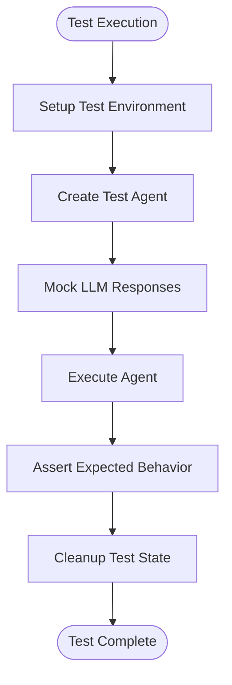
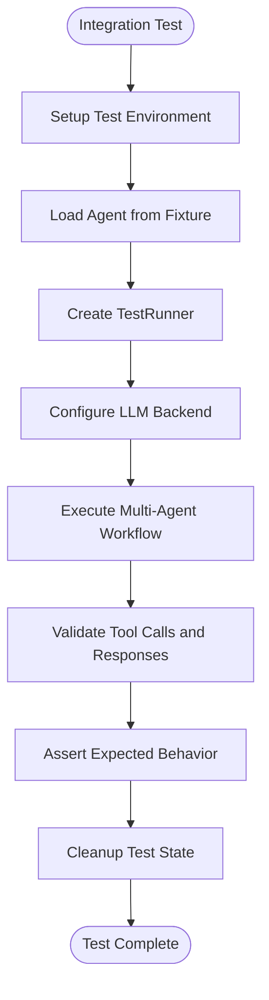
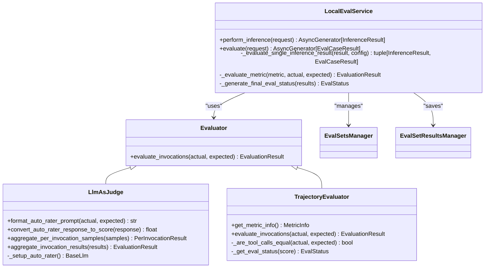
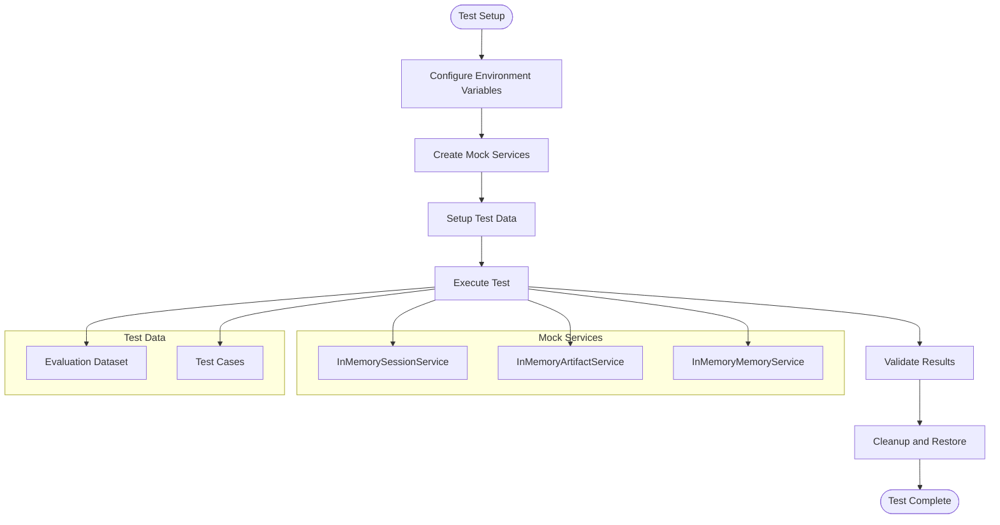
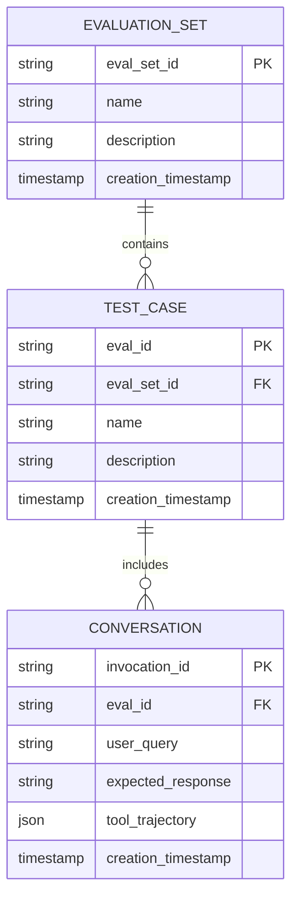
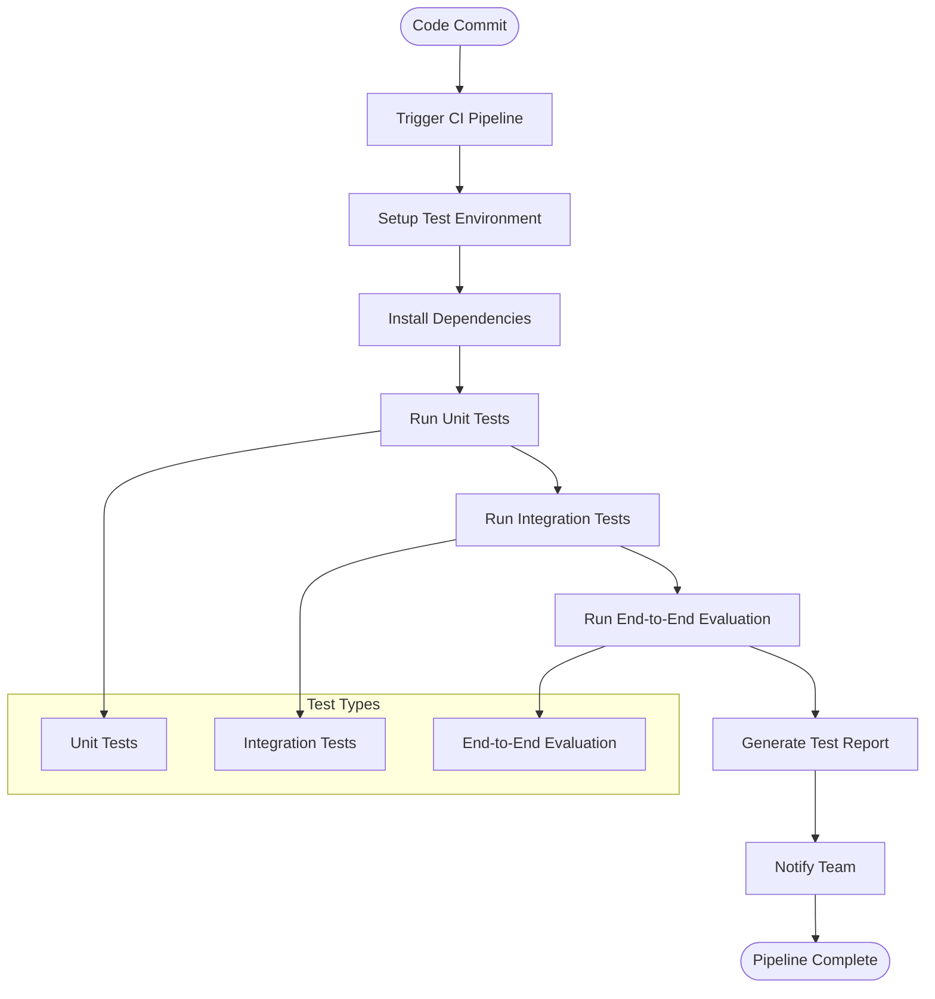

# Testing Strategies

<cite>
**Referenced Files in This Document**   
- [conftest.py](file://tests/unittests/conftest.py)
- [conftest.py](file://tests/integration/conftest.py)
- [test_runner.py](file://tests/integration/utils/test_runner.py)
- [test_single_agent.py](file://tests/integration/test_single_agent.py)
- [testing_utils.py](file://tests/unittests/testing_utils.py)
- [llm_as_judge.py](file://src/google/adk/evaluation/llm_as_judge.py)
- [trajectory_evaluator.py](file://src/google/adk/evaluation/trajectory_evaluator.py)
- [local_eval_service.py](file://src/google/adk/evaluation/local_eval_service.py)
- [hello_world_eval_set_001.evalset.json](file://samples_for_testing/hello_world/hello_world_eval_set_001.evalset.json)
- [test_config.json](file://samples_for_testing/hello_world/test_config.json)
- [pyproject.toml](file://pyproject.toml)
</cite>

## Table of Contents
1. [Introduction](#introduction)
2. [Unit Testing Patterns](#unit-testing-patterns)
3. [Integration Testing Methodologies](#integration-testing-methodologies)
4. [End-to-End Evaluation Techniques](#end-to-end-evaluation-techniques)
5. [Test Data Management and Mock Strategies](#test-data-management-and-mock-strategies)
6. [Creating Effective Test Cases and Evaluation Sets](#creating-effective-test-cases-and-evaluation-sets)
7. [Continuous Testing and Automation](#continuous-testing-and-automation)
8. [Conclusion](#conclusion)

## Introduction

The ADK Python project implements a comprehensive testing framework to ensure agent reliability and correctness across multiple dimensions. The testing strategy encompasses unit testing for individual components, integration testing for multi-agent workflows, and end-to-end evaluation using sophisticated metrics. The framework leverages pytest for test execution and provides specialized tools for evaluating agent behavior, particularly in scenarios involving LLMs and external services. This document details the various testing approaches used in the project, providing guidance on implementing effective tests and evaluations.

**Section sources**
- [conftest.py](file://tests/unittests/conftest.py#L1-L75)
- [conftest.py](file://tests/integration/conftest.py#L1-L120)

## Unit Testing Patterns

The unit testing framework in ADK Python focuses on testing individual agents and tools in isolation. The tests are organized in the `tests/unittests` directory and utilize pytest for test discovery and execution. The framework provides a comprehensive set of utilities in `testing_utils.py` to facilitate testing, including mock implementations of core components like LLMs and services.

The unit tests employ a fixture-based approach, with `conftest.py` defining environment variables and test configurations. The framework supports testing across different backend configurations (GOOGLE_AI and VERTEX) through parameterized fixtures. This allows for comprehensive testing of agent behavior under various deployment scenarios.

Key components of the unit testing framework include:
- `MockModel` and `MockLlmConnection` classes for mocking LLM interactions
- `InMemoryRunner` for testing agent execution without external dependencies
- `create_test_agent` utility for creating test agents
- `simplify_content` and related functions for normalizing test assertions

The unit tests cover various aspects of agent functionality, including agent configuration, tool execution, and response generation. They are designed to be fast and reliable, focusing on the core logic of individual components without the overhead of external service calls.

**Diagram sources**
- [testing_utils.py](file://tests/unittests/testing_utils.py#L257-L353)
- [conftest.py](file://tests/unittests/conftest.py#L41-L57)

**Section sources**
- [testing_utils.py](file://tests/unittests/testing_utils.py#L1-L353)
- [conftest.py](file://tests/unittests/conftest.py#L1-L75)

## Integration Testing Methodologies

Integration testing in ADK Python focuses on validating multi-agent workflows and tool interactions. The tests are organized in the `tests/integration` directory and use a fixture-based approach to set up complex test scenarios. The framework provides a `TestRunner` class that facilitates the execution of integration tests by managing agent execution and session state.

The integration tests leverage the `agent_runner` fixture defined in `integration/conftest.py`, which supports testing with either a pre-configured agent or an agent loaded by name from the fixture directory. This allows for flexible test configuration and reuse of test infrastructure across different agent types.

Integration tests are designed to validate the interaction between multiple components, including:
- Multi-agent workflows and agent transfer
- Tool execution and callback handling
- Context management and variable updates
- System instruction processing

The framework supports testing across different LLM backends (GOOGLE_AI and VERTEX) through the `llm_backend` fixture, which configures the appropriate environment variables for each test run. This ensures that integration tests can validate agent behavior under different deployment configurations.

**Diagram sources**
- [test_runner.py](file://tests/integration/utils/test_runner.py#L29-L98)
- [conftest.py](file://tests/integration/conftest.py#L61-L92)

**Section sources**
- [test_runner.py](file://tests/integration/utils/test_runner.py#L1-L98)
- [conftest.py](file://tests/integration/conftest.py#L1-L120)

## End-to-End Evaluation Techniques

The end-to-end evaluation framework in ADK Python provides sophisticated techniques for assessing agent performance and correctness. The framework is implemented in the `src/google/adk/evaluation/` directory and includes various evaluators for different aspects of agent behavior.

### LLM-as-Judge Metrics

The LLM-as-judge evaluation approach uses a separate LLM to assess the quality of agent responses. This is implemented in `llm_as_judge.py`, which defines the `LlmAsJudge` base class for evaluators that use an LLM as a judge. The evaluator can be configured with specific prompt templates and response parsing logic to assess different aspects of agent behavior.

The LLM-as-judge evaluator supports:
- Custom prompt templates for different evaluation tasks
- Multiple response samples for robust evaluation
- Aggregation of per-invocation results to obtain overall scores
- Configuration of the judge model and generation parameters

### Trajectory Evaluation

Trajectory evaluation focuses on assessing the accuracy of tool use sequences generated by agents. This is implemented in `trajectory_evaluator.py`, which compares the actual and expected tool call trajectories for a given user interaction. The evaluator performs an exact match on tool names and arguments, providing a score between 0.0 (complete mismatch) and 1.0 (perfect match).

The trajectory evaluator supports:
- Exact matching of tool calls and arguments
- Comparison of tool use sequences across multiple invocations
- Detailed reporting of mismatches
- Aggregation of per-invocation scores to obtain overall performance metrics

### Local Evaluation Service

The local evaluation service, implemented in `local_eval_service.py`, provides a comprehensive framework for running evaluations locally. It supports:
- Parallel execution of inference and evaluation tasks
- Management of evaluation sets and results
- Integration with different metric evaluators
- Support for both synchronous and asynchronous evaluation

The service uses a registry pattern to manage different metric evaluators, allowing for extensible evaluation capabilities. It also provides mechanisms for saving evaluation results and generating comprehensive reports.

**Diagram sources**
- [llm_as_judge.py](file://src/google/adk/evaluation/llm_as_judge.py#L36-L144)
- [trajectory_evaluator.py](file://src/google/adk/evaluation/trajectory_evaluator.py#L39-L303)
- [local_eval_service.py](file://src/google/adk/evaluation/local_eval_service.py#L64-L388)

**Section sources**
- [llm_as_judge.py](file://src/google/adk/evaluation/llm_as_judge.py#L1-L144)
- [trajectory_evaluator.py](file://src/google/adk/evaluation/trajectory_evaluator.py#L1-L303)
- [local_eval_service.py](file://src/google/adk/evaluation/local_eval_service.py#L1-L388)

## Test Data Management and Mock Strategies

Effective test data management and mock strategies are crucial for reliable and efficient testing in the ADK Python project. The framework provides several mechanisms for managing test data and mocking external dependencies.

### Test Data Management

Test data is organized in structured formats that facilitate reuse and maintenance. The evaluation framework uses JSON files to define evaluation sets, with each evaluation set containing multiple test cases. The `hello_world_eval_set_001.evalset.json` file provides an example of this structure, defining test cases for a hello world agent with expected user queries, responses, and tool calls.

Evaluation sets include:
- Unique identifiers for each test case
- User queries and expected responses
- Expected tool call trajectories
- Session context and metadata

### Mock Strategies for External Dependencies

The framework employs comprehensive mocking strategies to isolate tests from external dependencies like LLMs and cloud services. Key mocking approaches include:

#### LLM Mocking
The `MockModel` class in `testing_utils.py` provides a comprehensive mock implementation of the LLM interface. It supports:
- Pre-configured responses for deterministic testing
- Simulation of errors and exceptions
- Tracking of LLM requests for assertion
- Support for both streaming and non-streaming responses

#### Service Mocking
The framework uses in-memory implementations of core services to eliminate external dependencies:
- `InMemoryArtifactService` for artifact storage
- `InMemorySessionService` for session management
- `InMemoryMemoryService` for memory operations

These in-memory services provide the same interface as their production counterparts but store data in memory, making them ideal for testing.

#### Environment Configuration
The framework uses pytest fixtures to manage environment configuration:
- `conftest.py` files define environment variables for different test scenarios
- Parameterized fixtures allow testing across different configurations
- Environment variables are automatically restored after each test

This approach ensures that tests are isolated and do not interfere with each other, while also allowing for comprehensive testing across different deployment scenarios.

**Diagram sources**
- [testing_utils.py](file://tests/unittests/testing_utils.py#L257-L353)
- [hello_world_eval_set_001.evalset.json](file://samples_for_testing/hello_world/hello_world_eval_set_001.evalset.json#L1-L148)

**Section sources**
- [testing_utils.py](file://tests/unittests/testing_utils.py#L1-L353)
- [hello_world_eval_set_001.evalset.json](file://samples_for_testing/hello_world/hello_world_eval_set_001.evalset.json#L1-L148)

## Creating Effective Test Cases and Evaluation Sets

Creating effective test cases and evaluation sets is essential for ensuring comprehensive coverage and reliable evaluation of agent behavior. The ADK Python project provides guidance and examples for creating high-quality test configurations.

### Sample Test Configurations

The `samples_for_testing/hello_world/` directory contains example test configurations that demonstrate best practices for creating evaluation sets. The `hello_world_eval_set_001.evalset.json` file defines a comprehensive evaluation set for a hello world agent, covering various aspects of its functionality:

- Basic introduction and capability description
- Dice rolling functionality
- Prime number checking
- Tool call accuracy

Each test case in the evaluation set includes:
- A unique identifier
- User queries
- Expected responses
- Expected tool call trajectories
- Metadata and timestamps

### Test Configuration Guidelines

The `test_config.json` file provides criteria for evaluating test results, specifying thresholds for different metrics:
- `tool_trajectory_avg_score`: Minimum score for tool call accuracy
- `response_match_score`: Minimum score for response matching

When creating test cases, consider the following guidelines:
- Cover both positive and negative test scenarios
- Include edge cases and boundary conditions
- Test error handling and recovery
- Validate both functional and non-functional requirements
- Ensure test cases are independent and isolated

### Evaluation Set Structure

Evaluation sets should follow a consistent structure that facilitates reuse and maintenance:
- Use descriptive identifiers for test cases
- Include comprehensive metadata
- Organize test cases by functionality
- Provide clear expected outcomes
- Include both simple and complex scenarios

The evaluation framework supports hierarchical organization of test cases, allowing for grouping by feature, complexity, or other criteria. This enables targeted testing and focused evaluation of specific aspects of agent behavior.

**Diagram sources**
- [hello_world_eval_set_001.evalset.json](file://samples_for_testing/hello_world/hello_world_eval_set_001.evalset.json#L1-L148)
- [test_config.json](file://samples_for_testing/hello_world/test_config.json#L1-L6)

**Section sources**
- [hello_world_eval_set_001.evalset.json](file://samples_for_testing/hello_world/hello_world_eval_set_001.evalset.json#L1-L148)
- [test_config.json](file://samples_for_testing/hello_world/test_config.json#L1-L6)

## Continuous Testing and Automation

The ADK Python project implements continuous testing practices and automation through a combination of test scripts and configuration files. The `pyproject.toml` file contains configuration for the test runner, specifying test directories and execution parameters.

### Test Automation Scripts

The project includes several scripts for automating the testing process:
- `test_openspec.sh`: Script for running OpenSpec tests
- `run_spec_kit.sh`: Script for running Spec Kit integration tests
- Various run scripts for different test scenarios

These scripts provide a consistent interface for executing tests across different environments and configurations. They handle setup, execution, and teardown of test environments, ensuring reliable and repeatable test results.

### Continuous Integration

The testing framework is designed to integrate with continuous integration systems, providing:
- Fast feedback on code changes
- Comprehensive test coverage
- Automated reporting of test results
- Support for parallel test execution

The pytest-based test framework supports various output formats for integration with CI/CD pipelines, including JUnit XML and console output with detailed failure information.

### Test Execution Configuration

The `pyproject.toml` file contains configuration for the test runner, specifying:
- Test directories to include
- Test discovery patterns
- Default test execution parameters
- Plugin configuration

This centralized configuration ensures consistent test execution across different environments and team members.

**Diagram sources**
- [pyproject.toml](file://pyproject.toml#L1-L10)

**Section sources**
- [pyproject.toml](file://pyproject.toml#L1-L10)

## Conclusion

The ADK Python project implements a comprehensive testing strategy that ensures agent reliability and correctness across multiple dimensions. The framework combines unit testing, integration testing, and end-to-end evaluation to provide comprehensive coverage of agent functionality.

Key aspects of the testing strategy include:
- Comprehensive unit testing with mocking of external dependencies
- Integration testing of multi-agent workflows and tool interactions
- Sophisticated end-to-end evaluation using LLM-as-judge metrics and trajectory evaluation
- Effective test data management and mock strategies
- Guidance for creating high-quality test cases and evaluation sets
- Continuous testing and automation through test scripts and CI/CD integration

The framework is designed to be extensible and maintainable, with clear separation of concerns and well-defined interfaces. By following the patterns and practices outlined in this document, developers can ensure the reliability and correctness of their agents, providing a solid foundation for building robust and trustworthy AI applications.