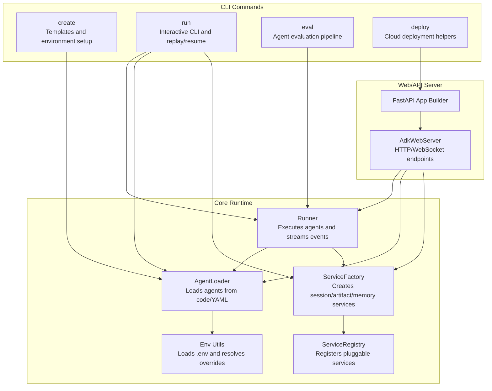
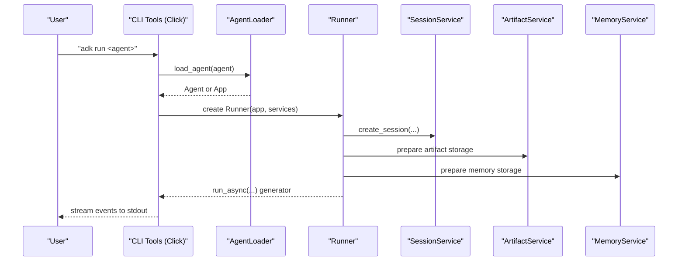
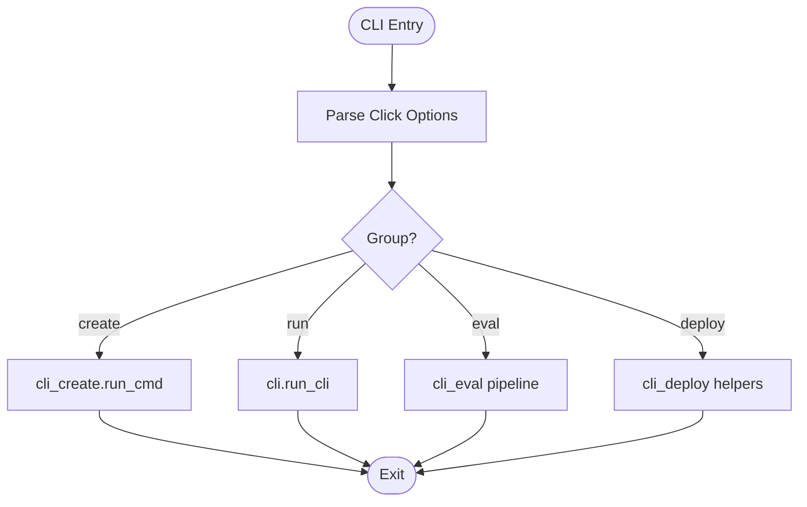
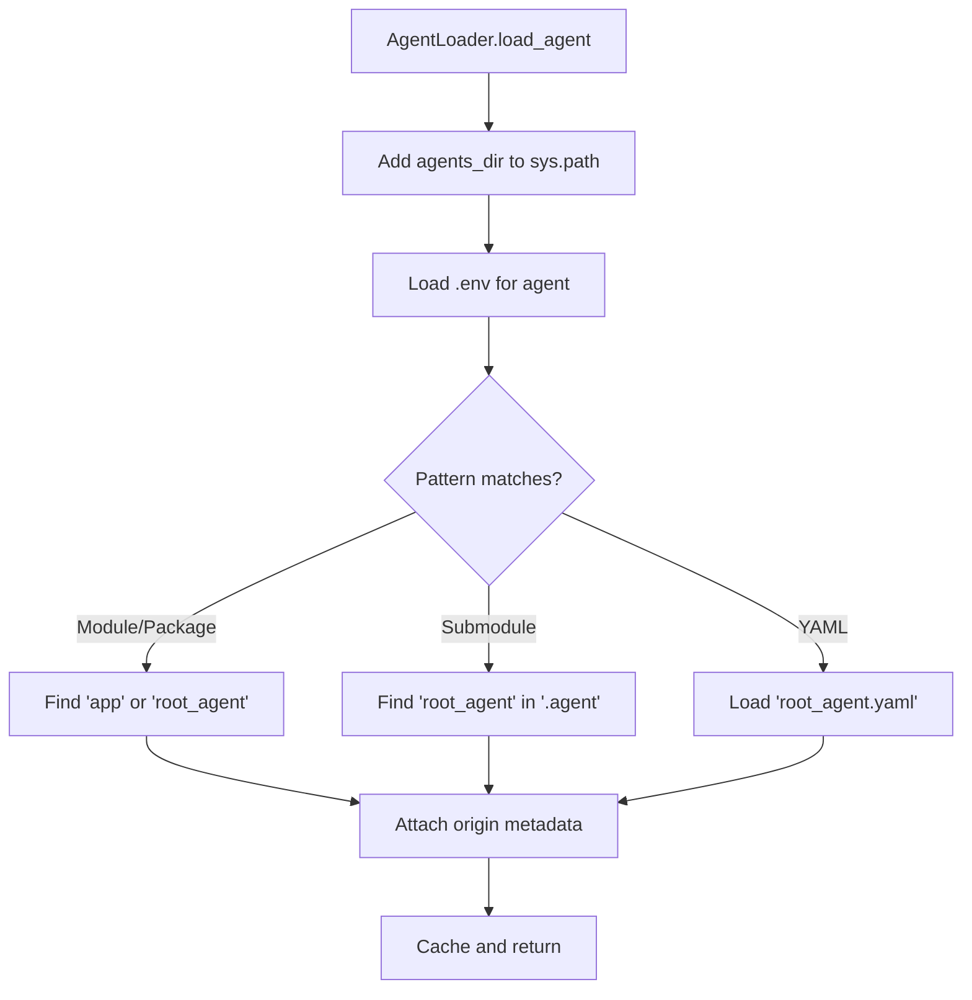
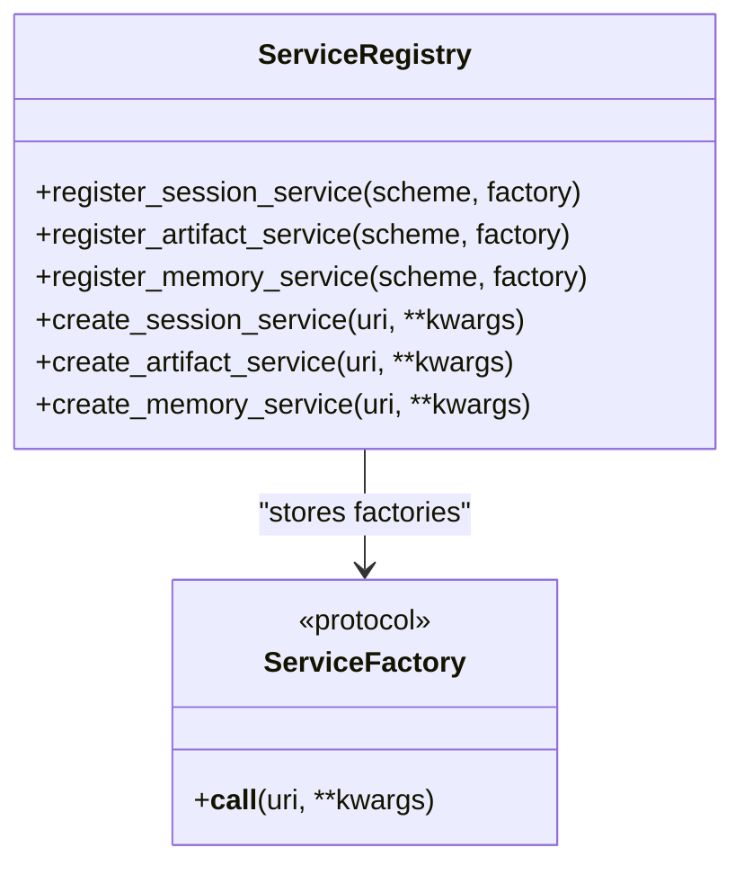
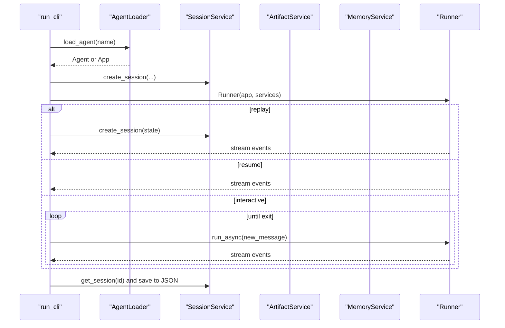
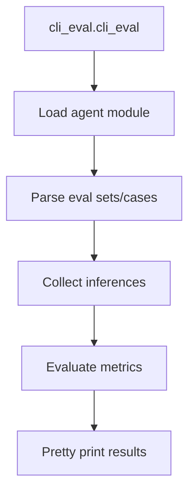
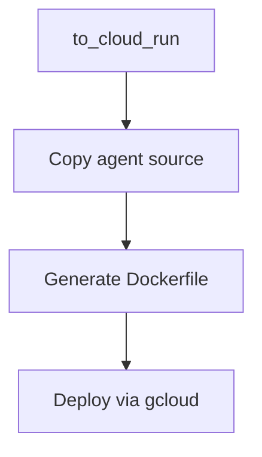
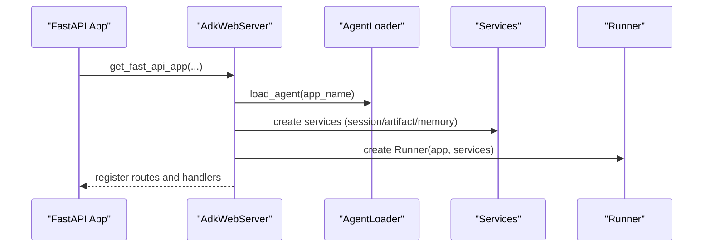
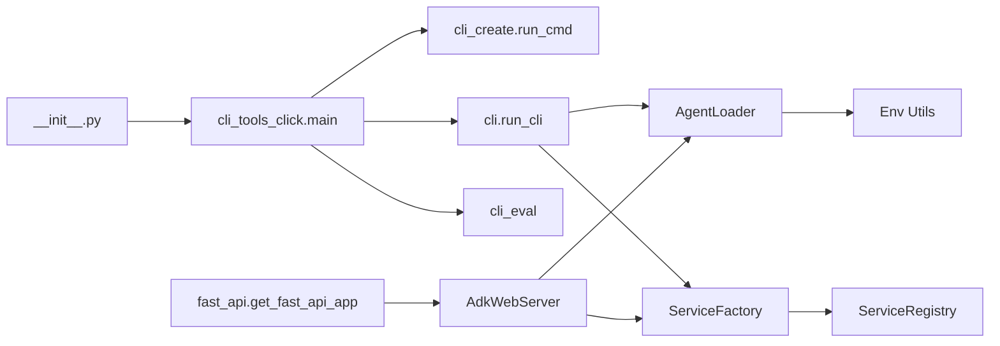

# CLI Overview and Architecture

<cite>
**Referenced Files in This Document**
- [cli_tools_click.py](file://src/google/adk/cli/cli_tools_click.py)
- [cli.py](file://src/google/adk/cli/cli.py)
- [cli_create.py](file://src/google/adk/cli/cli_create.py)
- [cli_deploy.py](file://src/google/adk/cli/cli_deploy.py)
- [cli_eval.py](file://src/google/adk/cli/cli_eval.py)
- [service_registry.py](file://src/google/adk/cli/service_registry.py)
- [agent_loader.py](file://src/google/adk/cli/utils/agent_loader.py)
- [service_factory.py](file://src/google/adk/cli/utils/service_factory.py)
- [envs.py](file://src/google/adk/cli/utils/envs.py)
- [fast_api.py](file://src/google/adk/cli/fast_api.py)
- [adk_web_server.py](file://src/google/adk/cli/adk_web_server.py)
- [__init__.py](file://src/google/adk/cli/__init__.py)
</cite>

## Table of Contents
1. [Introduction](#introduction)
2. [Project Structure](#project-structure)
3. [Core Components](#core-components)
4. [Architecture Overview](#architecture-overview)
5. [Detailed Component Analysis](#detailed-component-analysis)
6. [Dependency Analysis](#dependency-analysis)
7. [Performance Considerations](#performance-considerations)
8. [Troubleshooting Guide](#troubleshooting-guide)
9. [Conclusion](#conclusion)
10. [Appendices](#appendices)

## Introduction
This document explains the ADK CLI architecture and core functionality. It covers the CLI framework design, command structure, service loading mechanisms, agent/app initialization, and integration patterns with the ADK runtime. It also documents the CLI’s role in the development workflow, configuration options, environment variable handling, initialization sequences, error handling, debugging capabilities, and guidance for extending the CLI with custom commands and integrating with external development tools.

## Project Structure
The CLI is organized around a Click-based command framework with modular subcommands for creation, running, evaluation, and deployment. Supporting utilities handle agent loading, service registration, and environment configuration. The CLI integrates with the ADK runtime to orchestrate agents, sessions, artifacts, memory, and credentials.

**Diagram sources**
- [cli_tools_click.py](file://src/google/adk/cli/cli_tools_click.py#L206-L800)
- [cli.py](file://src/google/adk/cli/cli.py#L136-L284)
- [cli_eval.py](file://src/google/adk/cli/cli_eval.py#L1-L315)
- [cli_deploy.py](file://src/google/adk/cli/cli_deploy.py#L626-L800)
- [fast_api.py](file://src/google/adk/cli/fast_api.py#L73-L599)
- [adk_web_server.py](file://src/google/adk/cli/adk_web_server.py#L450-L800)
- [agent_loader.py](file://src/google/adk/cli/utils/agent_loader.py#L47-L413)
- [service_factory.py](file://src/google/adk/cli/utils/service_factory.py#L170-L329)
- [service_registry.py](file://src/google/adk/cli/service_registry.py#L94-L442)
- [envs.py](file://src/google/adk/cli/utils/envs.py#L53-L91)

**Section sources**
- [cli_tools_click.py](file://src/google/adk/cli/cli_tools_click.py#L206-L800)
- [cli.py](file://src/google/adk/cli/cli.py#L136-L284)
- [fast_api.py](file://src/google/adk/cli/fast_api.py#L73-L599)
- [adk_web_server.py](file://src/google/adk/cli/adk_web_server.py#L450-L800)

## Core Components
- CLI entry points and command groups:
  - Top-level groups: deploy, conformance.
  - Commands: create, run, eval.
- Agent loading:
  - Centralized loader supports multiple agent forms (module, package, YAML).
  - Loads .env files and records origin metadata for diagnostics.
- Service registry and factory:
  - Pluggable service registration via YAML or Python.
  - Factory functions create session, artifact, and memory services with local storage fallbacks.
- Environment handling:
  - Controlled .env loading with explicit environment preservation.
- Web/API server:
  - FastAPI app builder and AdkWebServer provide HTTP and WebSocket endpoints, telemetry, and optional UI.

**Section sources**
- [cli_tools_click.py](file://src/google/adk/cli/cli_tools_click.py#L206-L800)
- [agent_loader.py](file://src/google/adk/cli/utils/agent_loader.py#L47-L413)
- [service_registry.py](file://src/google/adk/cli/service_registry.py#L94-L442)
- [service_factory.py](file://src/google/adk/cli/utils/service_factory.py#L170-L329)
- [envs.py](file://src/google/adk/cli/utils/envs.py#L53-L91)
- [fast_api.py](file://src/google/adk/cli/fast_api.py#L73-L599)
- [adk_web_server.py](file://src/google/adk/cli/adk_web_server.py#L450-L800)

## Architecture Overview
The CLI orchestrates agent execution and development workflows by coordinating:
- Command parsing and validation (Click).
- Agent discovery and loading (AgentLoader).
- Service instantiation (ServiceRegistry + ServiceFactory).
- Runtime execution (Runner).
- Optional web server for development UI and APIs (FastAPI + AdkWebServer).

**Diagram sources**
- [cli_tools_click.py](file://src/google/adk/cli/cli_tools_click.py#L627-L664)
- [cli.py](file://src/google/adk/cli/cli.py#L136-L284)
- [agent_loader.py](file://src/google/adk/cli/utils/agent_loader.py#L323-L332)
- [service_factory.py](file://src/google/adk/cli/utils/service_factory.py#L170-L240)

## Detailed Component Analysis

### CLI Command Framework and Entry Points
- Groups:
  - deploy: Cloud deployment helpers.
  - conformance: Conformance testing utilities.
- Commands:
  - create: Interactive scaffolding for agents with model/backend selection and .env generation.
  - run: Interactive CLI with replay/resume and session persistence.
  - eval: Evaluation pipeline for agents using eval sets and metrics.
- Decorators and helpers:
  - Feature toggles via environment variables or CLI flags.
  - Service options for session/artifact/memory URIs and local storage fallbacks.
  - Validation helpers for mutually exclusive options.

**Diagram sources**
- [cli_tools_click.py](file://src/google/adk/cli/cli_tools_click.py#L206-L800)
- [cli_create.py](file://src/google/adk/cli/cli_create.py#L278-L338)
- [cli.py](file://src/google/adk/cli/cli.py#L136-L284)
- [cli_eval.py](file://src/google/adk/cli/cli_eval.py#L695-L800)

**Section sources**
- [cli_tools_click.py](file://src/google/adk/cli/cli_tools_click.py#L206-L800)
- [cli_create.py](file://src/google/adk/cli/cli_create.py#L278-L338)
- [cli.py](file://src/google/adk/cli/cli.py#L136-L284)
- [cli_eval.py](file://src/google/adk/cli/cli_eval.py#L695-L800)

### Agent Loading and Initialization
- AgentLoader supports:
  - Module/package forms and YAML config.
  - .env loading with explicit environment preservation.
  - Origin metadata attachment for diagnostics.
- Initialization sequence:
  - Add agents directory to sys.path.
  - Load .env for agent.
  - Attempt multiple import patterns (direct, submodule, YAML).
  - Cache loaded agents and clean module cache when needed.

**Diagram sources**
- [agent_loader.py](file://src/google/adk/cli/utils/agent_loader.py#L190-L332)
- [envs.py](file://src/google/adk/cli/utils/envs.py#L53-L91)

**Section sources**
- [agent_loader.py](file://src/google/adk/cli/utils/agent_loader.py#L47-L413)
- [envs.py](file://src/google/adk/cli/utils/envs.py#L53-L91)

### Service Registry and Factory
- ServiceRegistry:
  - Registers custom factories for session, artifact, and memory services.
  - Built-in schemes: memory, agentengine, sqlite, postgresql/mysql, gs, file, rag, etc.
  - Supports YAML and Python registration with precedence rules.
- ServiceFactory:
  - Creates services from URIs with fallbacks to in-memory services when local storage is unavailable.
  - Respects environment flags for forcing or disabling local storage.
  - Sanitizes URIs for logging.

**Diagram sources**
- [service_registry.py](file://src/google/adk/cli/service_registry.py#L94-L161)

**Section sources**
- [service_registry.py](file://src/google/adk/cli/service_registry.py#L94-L442)
- [service_factory.py](file://src/google/adk/cli/utils/service_factory.py#L170-L329)

### CLI Run Workflow
- run_cli orchestrates:
  - Agent loading and optional app name mapping.
  - .env loading with opt-out via environment variable.
  - Service creation via factories with local storage fallbacks.
  - Session creation and optional replay/resume.
  - Interactive loop with streaming events to stdout.
  - Optional session saving to JSON on exit.

**Diagram sources**
- [cli.py](file://src/google/adk/cli/cli.py#L136-L284)
- [agent_loader.py](file://src/google/adk/cli/utils/agent_loader.py#L323-L332)
- [service_factory.py](file://src/google/adk/cli/utils/service_factory.py#L170-L240)

**Section sources**
- [cli.py](file://src/google/adk/cli/cli.py#L136-L284)

### Evaluation Pipeline
- CLI eval command:
  - Loads agent module and optional reset function.
  - Parses eval sets and cases.
  - Collects inferences and evaluates metrics asynchronously.
  - Pretty-prints results and handles missing evaluation dependencies.

**Diagram sources**
- [cli_eval.py](file://src/google/adk/cli/cli_eval.py#L695-L800)

**Section sources**
- [cli_eval.py](file://src/google/adk/cli/cli_eval.py#L1-L315)

### Deployment Helpers
- Cloud Run deployment:
  - Generates Dockerfile and deploys via gcloud.
  - Ensures Agent Engine dependency in requirements.
  - Validates gcloud arguments and merges labels.
  - Supports A2A and telemetry options.

**Diagram sources**
- [cli_deploy.py](file://src/google/adk/cli/cli_deploy.py#L626-L800)

**Section sources**
- [cli_deploy.py](file://src/google/adk/cli/cli_deploy.py#L626-L800)

### Web/API Server Integration
- FastAPI app builder:
  - Initializes eval managers, agent loader, and services.
  - Configures telemetry and optional file watching.
  - Serves web assets and exposes builder endpoints for agent editing.
- AdkWebServer:
  - Provides HTTP and WebSocket endpoints for agent execution, session management, artifacts, memory, and evaluation.
  - Manages telemetry and CORS configuration.
  - Supports A2A agent integration.

**Diagram sources**
- [fast_api.py](file://src/google/adk/cli/fast_api.py#L73-L599)
- [adk_web_server.py](file://src/google/adk/cli/adk_web_server.py#L450-L800)

**Section sources**
- [fast_api.py](file://src/google/adk/cli/fast_api.py#L73-L599)
- [adk_web_server.py](file://src/google/adk/cli/adk_web_server.py#L450-L800)

## Dependency Analysis
- CLI entry point:
  - The package exposes a main entry via the Click group, which delegates to subcommands.
- Coupling and cohesion:
  - CLI commands depend on utilities for agent loading, service creation, and environment handling.
  - Web server composes the same services and runners for HTTP endpoints.
- External dependencies:
  - Click for CLI, FastAPI/Starlette for web server, dotenv for environment loading, watchdog for file watching.

**Diagram sources**
- [__init__.py](file://src/google/adk/cli/__init__.py#L15-L16)
- [cli_tools_click.py](file://src/google/adk/cli/cli_tools_click.py#L206-L800)
- [cli_create.py](file://src/google/adk/cli/cli_create.py#L278-L338)
- [cli.py](file://src/google/adk/cli/cli.py#L136-L284)
- [agent_loader.py](file://src/google/adk/cli/utils/agent_loader.py#L47-L413)
- [service_factory.py](file://src/google/adk/cli/utils/service_factory.py#L170-L329)
- [service_registry.py](file://src/google/adk/cli/service_registry.py#L94-L442)
- [fast_api.py](file://src/google/adk/cli/fast_api.py#L73-L599)
- [adk_web_server.py](file://src/google/adk/cli/adk_web_server.py#L450-L800)

**Section sources**
- [__init__.py](file://src/google/adk/cli/__init__.py#L15-L16)
- [cli_tools_click.py](file://src/google/adk/cli/cli_tools_click.py#L206-L800)
- [cli.py](file://src/google/adk/cli/cli.py#L136-L284)
- [fast_api.py](file://src/google/adk/cli/fast_api.py#L73-L599)

## Performance Considerations
- Local storage fallback:
  - When local .adk storage is disabled or unwritable, services fall back to in-memory implementations. This avoids disk I/O overhead but limits persistence.
- Service URI parsing:
  - URIs are sanitized for logging to avoid leaking secrets.
- Telemetry:
  - Optional exporters can increase overhead; enable only when needed.
- Evaluation pipeline:
  - Async streaming reduces latency and memory footprint compared to batch processing.

[No sources needed since this section provides general guidance]

## Troubleshooting Guide
- Missing required arguments:
  - The CLI displays full help on missing required parameters for better context.
- .env loading:
  - Controlled via environment variable; explicit environment variables are preserved after initial load.
- Service URI errors:
  - Unsupported URIs raise clear errors; fallback to in-memory services is logged.
- Evaluation dependencies:
  - Missing evaluation packages trigger a specific error message guiding installation.
- Agent import validation:
  - Pre-deployment validation catches common import errors and suggests fixes.

**Section sources**
- [cli_tools_click.py](file://src/google/adk/cli/cli_tools_click.py#L133-L189)
- [envs.py](file://src/google/adk/cli/utils/envs.py#L53-L91)
- [service_factory.py](file://src/google/adk/cli/utils/service_factory.py#L282-L329)
- [cli_eval.py](file://src/google/adk/cli/cli_eval.py#L196-L198)
- [cli_deploy.py](file://src/google/adk/cli/cli_deploy.py#L471-L585)

## Conclusion
The ADK CLI provides a cohesive framework for developing, running, evaluating, and deploying agents. Its modular design leverages Click for commands, a centralized agent loader, a pluggable service registry, and a robust web server for development and production scenarios. The CLI’s initialization sequences, environment handling, and error management streamline the developer workflow while maintaining flexibility for customization and integration.

[No sources needed since this section summarizes without analyzing specific files]

## Appendices

### Practical Usage Patterns
- Create an agent:
  - Choose model/backend and generate files with .env configuration.
- Run interactively:
  - Launch the CLI with an agent path; use replay/resume to iterate quickly.
- Evaluate agents:
  - Use eval command with eval sets and metrics; print detailed results for analysis.
- Deploy to Cloud Run:
  - Generate Dockerfile and deploy via gcloud with optional telemetry and A2A support.

**Section sources**
- [cli_create.py](file://src/google/adk/cli/cli_create.py#L278-L338)
- [cli_tools_click.py](file://src/google/adk/cli/cli_tools_click.py#L576-L664)
- [cli_eval.py](file://src/google/adk/cli/cli_eval.py#L695-L800)
- [cli_deploy.py](file://src/google/adk/cli/cli_deploy.py#L626-L800)

### Configuration Options and Environment Variables
- Feature overrides:
  - Enable/disable features via CLI flags or environment variables.
- Service options:
  - Configure session, artifact, and memory services via URIs or local storage flags.
- Environment variables:
  - Control .env loading and local storage behavior.
- Web server options:
  - CORS, telemetry, UI serving, and A2A support.

**Section sources**
- [cli_tools_click.py](file://src/google/adk/cli/cli_tools_click.py#L576-L578)
- [service_factory.py](file://src/google/adk/cli/utils/service_factory.py#L44-L144)
- [envs.py](file://src/google/adk/cli/utils/envs.py#L27-L91)
- [fast_api.py](file://src/google/adk/cli/fast_api.py#L73-L599)

### Extending the CLI
- Add custom commands:
  - Define Click decorators and integrate with existing loaders and factories.
- Custom services:
  - Register factories via YAML or Python to extend session/artifact/memory backends.
- Plugins:
  - Integrate additional plugins through the web server and agent loader.

**Section sources**
- [cli_tools_click.py](file://src/google/adk/cli/cli_tools_click.py#L206-L800)
- [service_registry.py](file://src/google/adk/cli/service_registry.py#L40-L62)
- [adk_web_server.py](file://src/google/adk/cli/adk_web_server.py#L571-L588)