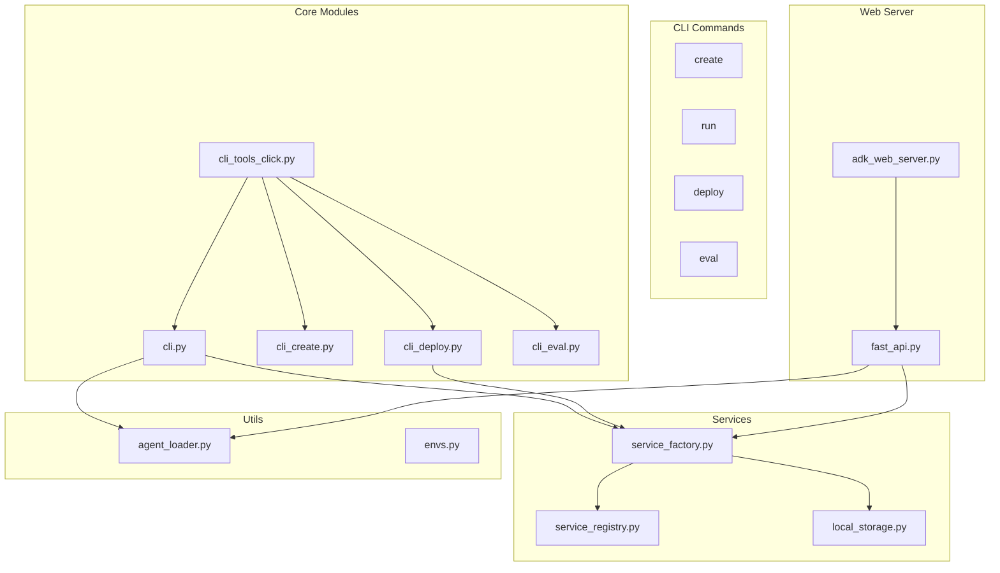
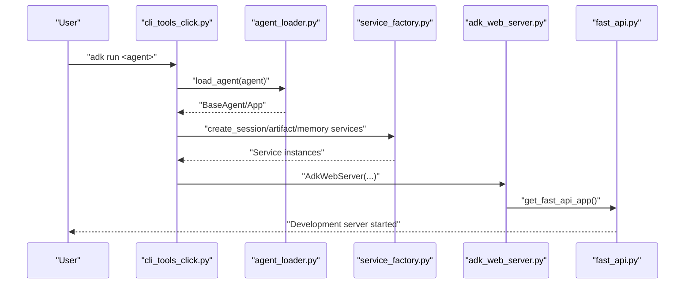
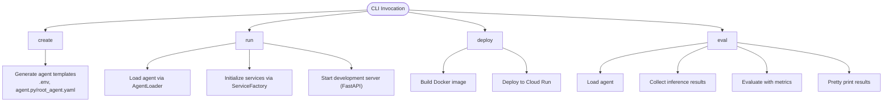
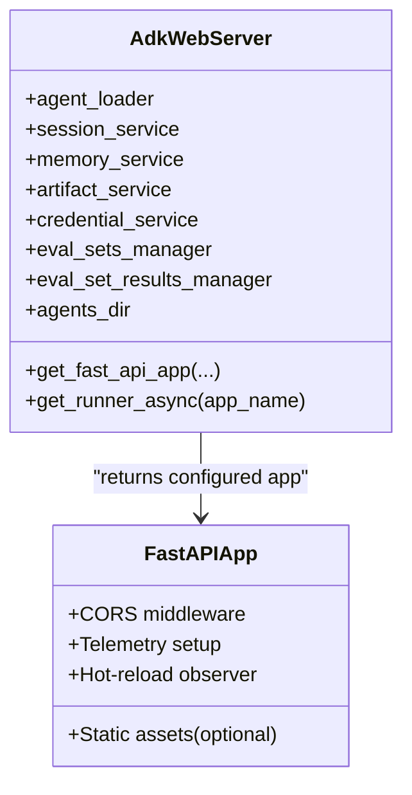
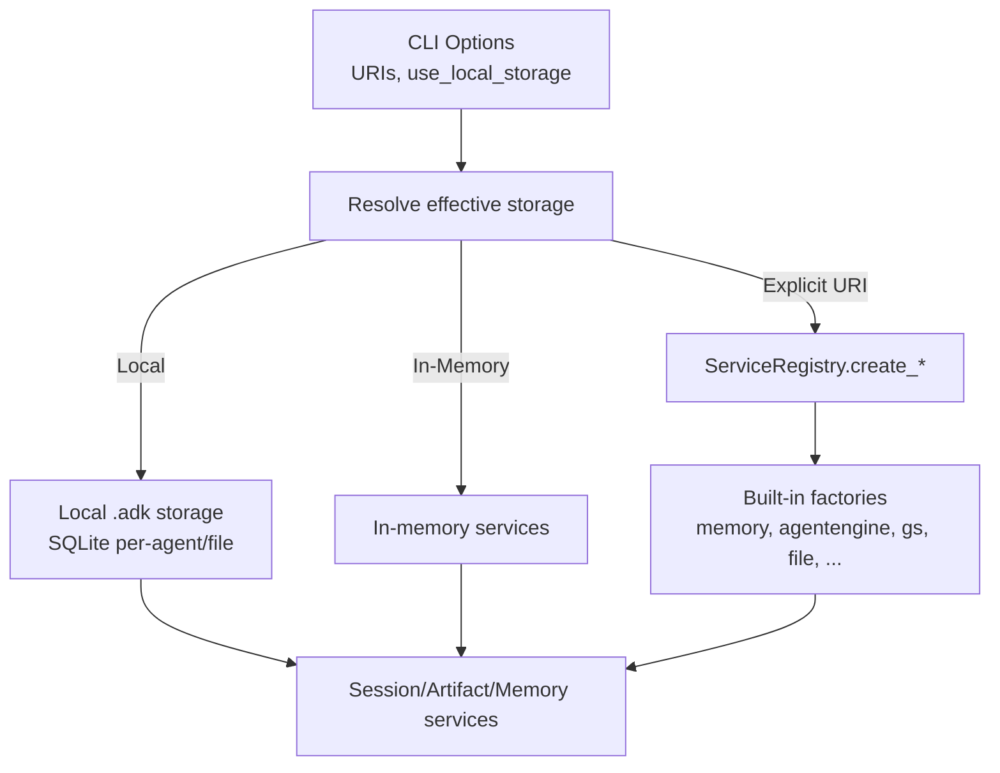
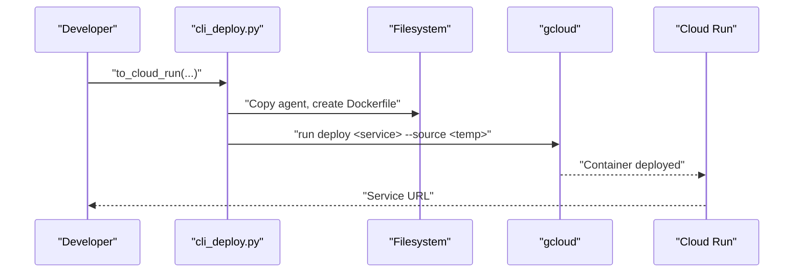
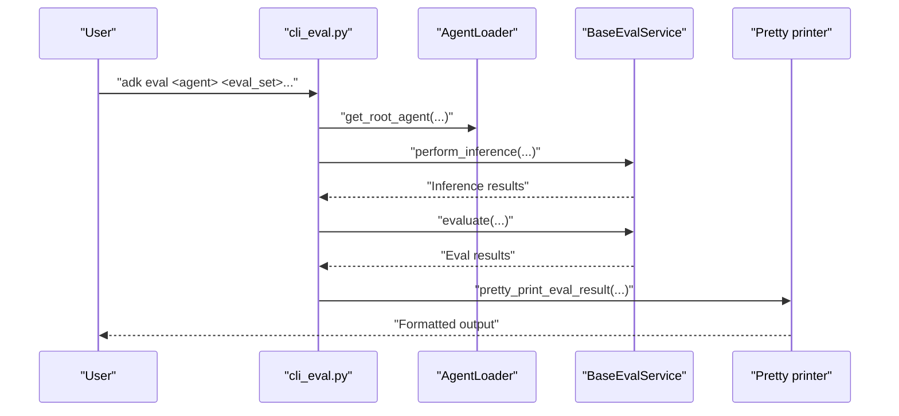
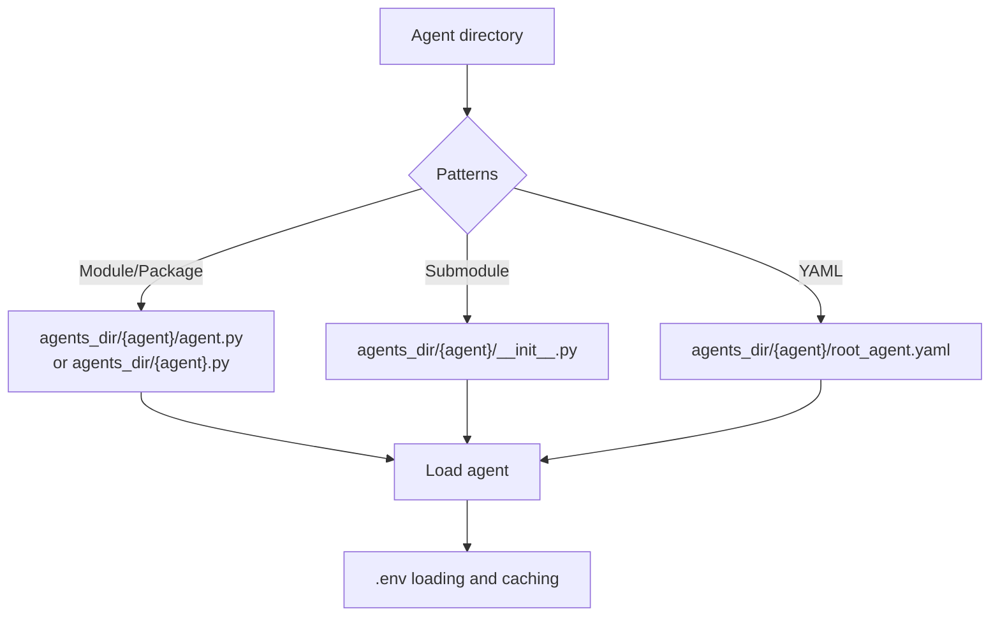
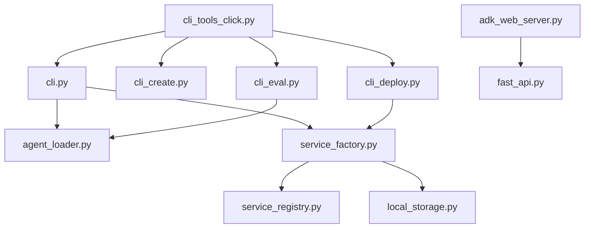

# CLI Tools and Development Utilities

<cite>
**Referenced Files in This Document**
- [cli_tools_click.py](file://src/google/adk/cli/cli_tools_click.py)
- [cli.py](file://src/google/adk/cli/cli.py)
- [cli_create.py](file://src/google/adk/cli/cli_create.py)
- [cli_deploy.py](file://src/google/adk/cli/cli_deploy.py)
- [cli_eval.py](file://src/google/adk/cli/cli_eval.py)
- [adk_web_server.py](file://src/google/adk/cli/adk_web_server.py)
- [fast_api.py](file://src/google/adk/cli/fast_api.py)
- [service_registry.py](file://src/google/adk/cli/service_registry.py)
- [service_factory.py](file://src/google/adk/cli/utils/service_factory.py)
- [agent_loader.py](file://src/google/adk/cli/utils/agent_loader.py)
- [envs.py](file://src/google/adk/cli/utils/envs.py)
- [local_storage.py](file://src/google/adk/cli/utils/local_storage.py)
</cite>

## Table of Contents
1. [Introduction](#introduction)
2. [Project Structure](#project-structure)
3. [Core Components](#core-components)
4. [Architecture Overview](#architecture-overview)
5. [Detailed Component Analysis](#detailed-component-analysis)
6. [Dependency Analysis](#dependency-analysis)
7. [Performance Considerations](#performance-considerations)
8. [Troubleshooting Guide](#troubleshooting-guide)
9. [Conclusion](#conclusion)
10. [Appendices](#appendices)

## Introduction
This document describes the Agent Development Kit (ADK) command-line interface (CLI) and development utilities. It covers the CLI architecture, available commands for development, deployment, and evaluation workflows, the development server with hot-reload capabilities, debugging tools, containerization and cloud deployment to Cloud Run and Vertex AI, the evaluation CLI and automated testing workflows, configuration and environment setup, integration with development tools, troubleshooting procedures, and performance optimization tips.

## Project Structure
The CLI is organized around a Click-based command group with subcommands for create, run, deploy, and evaluation. Supporting modules handle agent loading, service configuration, web server orchestration, and deployment utilities.

**Diagram sources**
- [cli_tools_click.py](file://src/google/adk/cli/cli_tools_click.py#L206-L800)
- [cli.py](file://src/google/adk/cli/cli.py#L136-L284)
- [cli_create.py](file://src/google/adk/cli/cli_create.py#L278-L338)
- [cli_deploy.py](file://src/google/adk/cli/cli_deploy.py#L626-L800)
- [cli_eval.py](file://src/google/adk/cli/cli_eval.py#L695-L800)
- [adk_web_server.py](file://src/google/adk/cli/adk_web_server.py#L450-L900)
- [fast_api.py](file://src/google/adk/cli/fast_api.py#L73-L599)
- [service_registry.py](file://src/google/adk/cli/service_registry.py#L94-L442)
- [service_factory.py](file://src/google/adk/cli/utils/service_factory.py#L170-L329)
- [local_storage.py](file://src/google/adk/cli/utils/local_storage.py#L64-L214)
- [agent_loader.py](file://src/google/adk/cli/utils/agent_loader.py#L47-L413)
- [envs.py](file://src/google/adk/cli/utils/envs.py#L53-L91)

**Section sources**
- [cli_tools_click.py](file://src/google/adk/cli/cli_tools_click.py#L206-L800)
- [cli.py](file://src/google/adk/cli/cli.py#L136-L284)
- [cli_create.py](file://src/google/adk/cli/cli_create.py#L278-L338)
- [cli_deploy.py](file://src/google/adk/cli/cli_deploy.py#L626-L800)
- [cli_eval.py](file://src/google/adk/cli/cli_eval.py#L695-L800)
- [adk_web_server.py](file://src/google/adk/cli/adk_web_server.py#L450-L900)
- [fast_api.py](file://src/google/adk/cli/fast_api.py#L73-L599)
- [service_registry.py](file://src/google/adk/cli/service_registry.py#L94-L442)
- [service_factory.py](file://src/google/adk/cli/utils/service_factory.py#L170-L329)
- [local_storage.py](file://src/google/adk/cli/utils/local_storage.py#L64-L214)
- [agent_loader.py](file://src/google/adk/cli/utils/agent_loader.py#L47-L413)
- [envs.py](file://src/google/adk/cli/utils/envs.py#L53-L91)

## Core Components
- CLI entrypoint and command groups: create, run, deploy, eval, and conformance testing.
- Agent loader supporting multiple agent formats (Python module/package, YAML config).
- Service registry and factory for pluggable session, artifact, and memory services.
- Web server and FastAPI integration for development and optional UI.
- Deployment utilities for containerization and Cloud Run/Vertex AI.
- Evaluation framework with CLI for running evaluations and printing results.

**Section sources**
- [cli_tools_click.py](file://src/google/adk/cli/cli_tools_click.py#L206-L800)
- [agent_loader.py](file://src/google/adk/cli/utils/agent_loader.py#L47-L413)
- [service_registry.py](file://src/google/adk/cli/service_registry.py#L94-L442)
- [service_factory.py](file://src/google/adk/cli/utils/service_factory.py#L170-L329)
- [adk_web_server.py](file://src/google/adk/cli/adk_web_server.py#L450-L900)
- [fast_api.py](file://src/google/adk/cli/fast_api.py#L73-L599)
- [cli_deploy.py](file://src/google/adk/cli/cli_deploy.py#L626-L800)
- [cli_eval.py](file://src/google/adk/cli/cli_eval.py#L695-L800)

## Architecture Overview
The CLI architecture centers on Click command groups and subcommands. Each subcommand delegates to dedicated modules that handle agent loading, service instantiation, web server orchestration, and deployment. The service registry enables pluggable backends for sessions, artifacts, and memory. The web server integrates with FastAPI and supports hot-reload for development.

**Diagram sources**
- [cli_tools_click.py](file://src/google/adk/cli/cli_tools_click.py#L576-L664)
- [agent_loader.py](file://src/google/adk/cli/utils/agent_loader.py#L323-L332)
- [service_factory.py](file://src/google/adk/cli/utils/service_factory.py#L170-L329)
- [adk_web_server.py](file://src/google/adk/cli/adk_web_server.py#L681-L756)
- [fast_api.py](file://src/google/adk/cli/fast_api.py#L73-L267)

## Detailed Component Analysis

### CLI Commands and Workflows
- create: Interactive scaffolding for new agents with model/backend selection and file generation.
- run: Interactive CLI for agents with optional replay/resume and session persistence.
- deploy: Containerization and cloud deployment to Cloud Run and Vertex AI.
- eval: Automated evaluation of agents against eval sets with configurable metrics and storage.

**Diagram sources**
- [cli_create.py](file://src/google/adk/cli/cli_create.py#L278-L338)
- [cli.py](file://src/google/adk/cli/cli.py#L136-L284)
- [cli_deploy.py](file://src/google/adk/cli/cli_deploy.py#L626-L800)
- [cli_eval.py](file://src/google/adk/cli/cli_eval.py#L695-L800)

**Section sources**
- [cli_create.py](file://src/google/adk/cli/cli_create.py#L278-L338)
- [cli.py](file://src/google/adk/cli/cli.py#L136-L284)
- [cli_deploy.py](file://src/google/adk/cli/cli_deploy.py#L626-L800)
- [cli_eval.py](file://src/google/adk/cli/cli_eval.py#L695-L800)

### Development Server and Hot-Reload
The development server is built on FastAPI and integrates with the ADK web server. It supports:
- CORS configuration for origins and regex patterns.
- Telemetry export to Google Cloud or environment-based providers.
- Optional UI asset serving.
- File system observer for hot-reload of agents.
- A2A protocol support for agent-to-agent communication.

**Diagram sources**
- [adk_web_server.py](file://src/google/adk/cli/adk_web_server.py#L450-L756)
- [fast_api.py](file://src/google/adk/cli/fast_api.py#L73-L267)

**Section sources**
- [adk_web_server.py](file://src/google/adk/cli/adk_web_server.py#L450-L900)
- [fast_api.py](file://src/google/adk/cli/fast_api.py#L73-L599)

### Service Registry and Factory
The service registry enables pluggable backends for sessions, artifacts, and memory. Built-in schemes include memory, agentengine, sqlite, postgresql, mysql, gs (GCS), file, rag, and more. The factory resolves URIs and local storage preferences, with runtime detection for Cloud Run/Kubernetes.

**Diagram sources**
- [service_factory.py](file://src/google/adk/cli/utils/service_factory.py#L170-L329)
- [service_registry.py](file://src/google/adk/cli/service_registry.py#L218-L334)
- [local_storage.py](file://src/google/adk/cli/utils/local_storage.py#L64-L214)

**Section sources**
- [service_factory.py](file://src/google/adk/cli/utils/service_factory.py#L170-L329)
- [service_registry.py](file://src/google/adk/cli/service_registry.py#L94-L442)
- [local_storage.py](file://src/google/adk/cli/utils/local_storage.py#L64-L214)

### Deployment Utilities
Deployment utilities support:
- Ensuring Agent Engine dependencies in requirements.
- Generating Dockerfiles for Cloud Run with optional UI and A2A.
- Validating agent imports and resolving service options by ADK version.
- Building and deploying to Cloud Run with managed and passthrough gcloud args.

**Diagram sources**
- [cli_deploy.py](file://src/google/adk/cli/cli_deploy.py#L626-L800)

**Section sources**
- [cli_deploy.py](file://src/google/adk/cli/cli_deploy.py#L626-L800)

### Evaluation CLI and Automated Testing
The evaluation CLI:
- Loads agents from module paths.
- Parses eval sets and cases.
- Collects inference results and evaluates with configured metrics.
- Pretty-prints results and supports GCS-based eval storage.

**Diagram sources**
- [cli_eval.py](file://src/google/adk/cli/cli_eval.py#L695-L800)

**Section sources**
- [cli_eval.py](file://src/google/adk/cli/cli_eval.py#L695-L800)

### Agent Loading and Environment Setup
Agent loading supports multiple patterns (module/package, submodule, YAML config) with caching and .env loading. Environment utilities preserve explicit environment variables while allowing later .env overrides.

**Diagram sources**
- [agent_loader.py](file://src/google/adk/cli/utils/agent_loader.py#L47-L332)
- [envs.py](file://src/google/adk/cli/utils/envs.py#L53-L91)

**Section sources**
- [agent_loader.py](file://src/google/adk/cli/utils/agent_loader.py#L47-L413)
- [envs.py](file://src/google/adk/cli/utils/envs.py#L53-L91)

## Dependency Analysis
The CLI modules depend on each other in a layered fashion: command handlers depend on agent loading and service factories; the web server depends on FastAPI and telemetry; deployment utilities depend on service factories and registry; evaluation depends on agent loading and evaluator services.

**Diagram sources**
- [cli_tools_click.py](file://src/google/adk/cli/cli_tools_click.py#L206-L800)
- [cli.py](file://src/google/adk/cli/cli.py#L136-L284)
- [cli_create.py](file://src/google/adk/cli/cli_create.py#L278-L338)
- [cli_deploy.py](file://src/google/adk/cli/cli_deploy.py#L626-L800)
- [cli_eval.py](file://src/google/adk/cli/cli_eval.py#L695-L800)
- [adk_web_server.py](file://src/google/adk/cli/adk_web_server.py#L450-L900)
- [fast_api.py](file://src/google/adk/cli/fast_api.py#L73-L599)
- [service_registry.py](file://src/google/adk/cli/service_registry.py#L94-L442)
- [service_factory.py](file://src/google/adk/cli/utils/service_factory.py#L170-L329)
- [local_storage.py](file://src/google/adk/cli/utils/local_storage.py#L64-L214)
- [agent_loader.py](file://src/google/adk/cli/utils/agent_loader.py#L47-L413)

**Section sources**
- [cli_tools_click.py](file://src/google/adk/cli/cli_tools_click.py#L206-L800)
- [cli.py](file://src/google/adk/cli/cli.py#L136-L284)
- [cli_create.py](file://src/google/adk/cli/cli_create.py#L278-L338)
- [cli_deploy.py](file://src/google/adk/cli/cli_deploy.py#L626-L800)
- [cli_eval.py](file://src/google/adk/cli/cli_eval.py#L695-L800)
- [adk_web_server.py](file://src/google/adk/cli/adk_web_server.py#L450-L900)
- [fast_api.py](file://src/google/adk/cli/fast_api.py#L73-L599)
- [service_registry.py](file://src/google/adk/cli/service_registry.py#L94-L442)
- [service_factory.py](file://src/google/adk/cli/utils/service_factory.py#L170-L329)
- [local_storage.py](file://src/google/adk/cli/utils/local_storage.py#L64-L214)
- [agent_loader.py](file://src/google/adk/cli/utils/agent_loader.py#L47-L413)

## Performance Considerations
- Use local .adk storage for development when writable; the factory automatically falls back to in-memory services in Cloud Run/Kubernetes or when permissions are insufficient.
- Prefer explicit service URIs for production deployments to avoid runtime fallbacks.
- Enable telemetry export only when needed to reduce overhead.
- Limit CORS patterns to trusted origins to minimize middleware overhead.
- Use hot-reload judiciously in production; it is intended for development.

[No sources needed since this section provides general guidance]

## Troubleshooting Guide
Common CLI-related issues and resolutions:
- Missing required arguments: The CLI displays full help on missing parameters for easier diagnosis.
- Service URI conflicts: When using explicit service URIs, the CLI validates and rejects conflicting combinations with local storage flags.
- Agent import failures: Pre-deployment validation catches import errors and suggests corrective actions.
- Environment variable loading: .env loading preserves explicitly set variables; use ADK_DISABLE_LOAD_DOTENV to bypass.
- Local storage permissions: On Cloud Run/Kubernetes or unwritable directories, the CLI falls back to in-memory services; use environment flags to force local storage if appropriate.

**Section sources**
- [cli_tools_click.py](file://src/google/adk/cli/cli_tools_click.py#L133-L189)
- [cli_deploy.py](file://src/google/adk/cli/cli_deploy.py#L425-L469)
- [cli_deploy.py](file://src/google/adk/cli/cli_deploy.py#L471-L585)
- [envs.py](file://src/google/adk/cli/utils/envs.py#L53-L91)
- [service_factory.py](file://src/google/adk/cli/utils/service_factory.py#L103-L143)

## Conclusion
The ADK CLI provides a cohesive set of tools for agent development, deployment, and evaluation. Its modular architecture, pluggable service backends, and integrated development server streamline workflows from prototyping to production. Proper configuration of services, environment variables, and deployment options ensures reliable operation across local and cloud environments.

[No sources needed since this section summarizes without analyzing specific files]

## Appendices

### Practical CLI Operations and Automation
- Create an agent template:
  - adk create <app_name> [--model MODEL] [--api_key KEY] [--project PROJECT] [--region REGION] [--type CODE|CONFIG]
- Run an agent interactively:
  - adk run <agent> [--save_session] [--session_id ID] [--replay FILE.json | --resume FILE.json] [--session_service_uri URI] [--artifact_service_uri URI] [--memory_service_uri URI] [--use_local_storage/--no_use_local_storage]
- Evaluate an agent:
  - adk eval <agent_module_file_path> <eval_set_file_path_or_id...> [--config_file_path PATH] [--print_detailed_results] [--eval_storage_uri URI] [--log_level LEVEL]
- Deploy to Cloud Run:
  - adk deploy cloud-run <agent_folder> --project PROJECT --region REGION --service SERVICE_NAME --app-name APP_NAME --temp-folder TEMP --port PORT [--trace_to_cloud] [--otel_to_cloud] [--with-ui] [--allow_origins ORIGINS...] [--session_service_uri URI] [--artifact_service_uri URI] [--memory_service_uri URI] [--use_local_storage/--no_use_local_storage] [--a2a]

[No sources needed since this section provides general guidance]