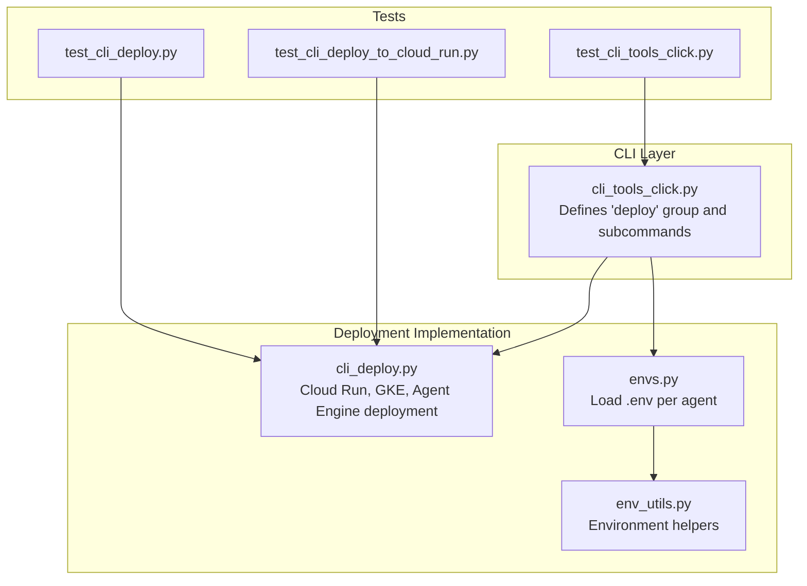
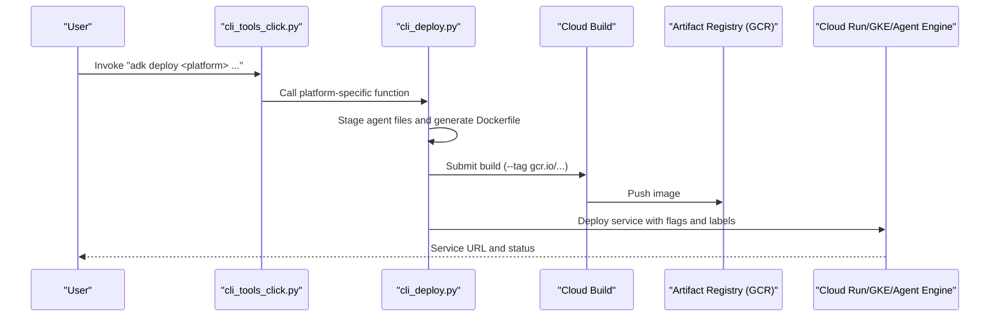
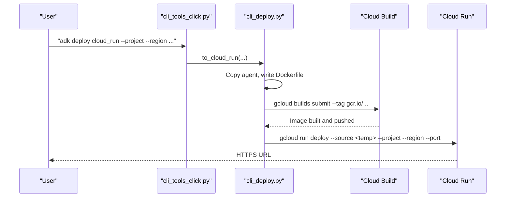
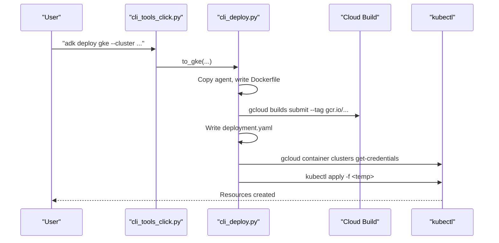
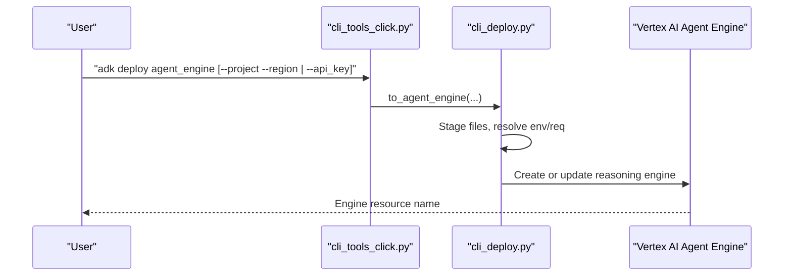
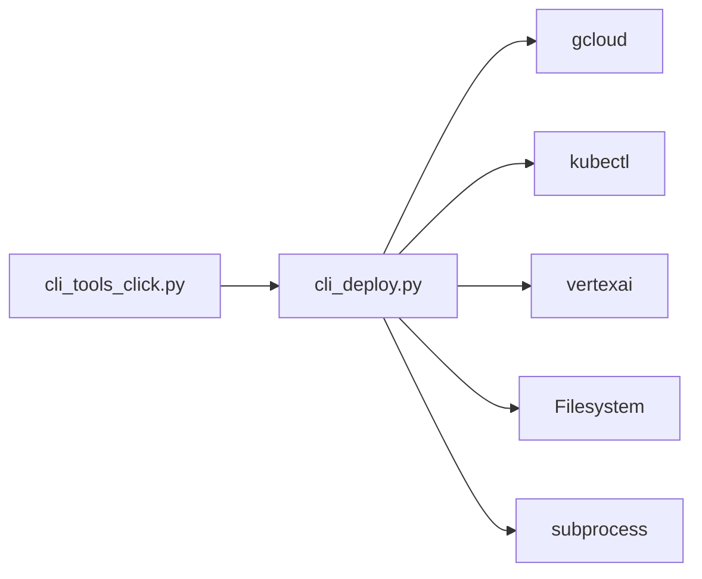

# Deployment and Containerization Commands

<cite>
**Referenced Files in This Document**
- [cli_deploy.py](file://src/google/adk/cli/cli_deploy.py)
- [cli_tools_click.py](file://src/google/adk/cli/cli_tools_click.py)
- [envs.py](file://src/google/adk/cli/utils/envs.py)
- [env_utils.py](file://src/google/adk/utils/env_utils.py)
- [test_cli_deploy.py](file://tests/unittests/cli/utils/test_cli_deploy.py)
- [test_cli_deploy_to_cloud_run.py](file://tests/unittests/cli/utils/test_cli_deploy_to_cloud_run.py)
- [test_cli_tools_click.py](file://tests/unittests/cli/utils/test_cli_tools_click.py)
- [README.md](file://contributing/samples/adk_knowledge_agent/README.md)
</cite>

## Table of Contents
1. [Introduction](#introduction)
2. [Project Structure](#project-structure)
3. [Core Components](#core-components)
4. [Architecture Overview](#architecture-overview)
5. [Detailed Component Analysis](#detailed-component-analysis)
6. [Dependency Analysis](#dependency-analysis)
7. [Performance Considerations](#performance-considerations)
8. [Troubleshooting Guide](#troubleshooting-guide)
9. [Conclusion](#conclusion)
10. [Appendices](#appendices)

## Introduction
This document explains the Agent Development Kit (ADK) deployment and containerization command-line tools. It covers the deployment workflow to Google Cloud Run, Google Kubernetes Engine (GKE), and Vertex AI Agent Engine, along with container build processes, environment setup, configuration options, and best practices. It also includes practical examples, rollback guidance, monitoring, scaling, and CI/CD integration patterns.

## Project Structure
The deployment capabilities are implemented in the CLI layer and supporting utilities:
- CLI group “deploy” exposes subcommands for Cloud Run, GKE, and Agent Engine.
- The “deploy” module orchestrates containerization, image building, and platform-specific deployment.
- Utilities handle environment variable loading and validation.

**Diagram sources**
- [cli_tools_click.py](file://src/google/adk/cli/cli_tools_click.py#L1486-L1599)
- [cli_deploy.py](file://src/google/adk/cli/cli_deploy.py#L626-L803)
- [envs.py](file://src/google/adk/cli/utils/envs.py#L53-L91)
- [env_utils.py](file://src/google/adk/utils/env_utils.py#L26-L60)
- [test_cli_deploy.py](file://tests/unittests/cli/utils/test_cli_deploy.py#L380-L427)
- [test_cli_deploy_to_cloud_run.py](file://tests/unittests/cli/utils/test_cli_deploy_to_cloud_run.py#L1-L289)
- [test_cli_tools_click.py](file://tests/unittests/cli/utils/test_cli_tools_click.py#L197-L246)

**Section sources**
- [cli_tools_click.py](file://src/google/adk/cli/cli_tools_click.py#L1486-L1599)
- [cli_deploy.py](file://src/google/adk/cli/cli_deploy.py#L626-L803)
- [envs.py](file://src/google/adk/cli/utils/envs.py#L53-L91)
- [env_utils.py](file://src/google/adk/utils/env_utils.py#L26-L60)

## Core Components
- Cloud Run deployment: Generates a Dockerfile, builds and pushes an image via Cloud Build, and deploys to Cloud Run with optional UI and telemetry.
- GKE deployment: Builds an image, generates Kubernetes manifests, applies them to a cluster, and manages lifecycle.
- Agent Engine deployment: Stages agent files, resolves environment and requirements, initializes Vertex AI, and creates or updates a reasoning engine.
- Environment utilities: Load .env files for agents, preserving explicitly set environment variables.

Key responsibilities:
- CLI parsing and validation
- Temporary workspace preparation
- Container image generation and registry integration
- Platform-specific deployment orchestration
- Telemetry and observability flags
- Service URIs and local storage fallbacks

**Section sources**
- [cli_deploy.py](file://src/google/adk/cli/cli_deploy.py#L626-L803)
- [cli_deploy.py](file://src/google/adk/cli/cli_deploy.py#L1144-L1383)
- [cli_deploy.py](file://src/google/adk/cli/cli_deploy.py#L805-L1142)
- [envs.py](file://src/google/adk/cli/utils/envs.py#L53-L91)

## Architecture Overview
The deployment pipeline follows a consistent flow across platforms:
- Prepare a temporary workspace with agent code and generated files.
- Build a container image using Cloud Build or local Docker.
- Push the image to the project’s Artifact Registry (GCR).
- Deploy to the target platform (Cloud Run, GKE, or Agent Engine).
- Apply labels, telemetry flags, and service URIs.

**Diagram sources**
- [cli_tools_click.py](file://src/google/adk/cli/cli_tools_click.py#L1486-L1599)
- [cli_deploy.py](file://src/google/adk/cli/cli_deploy.py#L626-L803)
- [cli_deploy.py](file://src/google/adk/cli/cli_deploy.py#L1144-L1383)

## Detailed Component Analysis

### Cloud Run Deployment
Cloud Run deployment automates:
- Temporary workspace creation and agent code copying
- Dockerfile generation with ADK version, environment variables, and service options
- Image build and push via Cloud Build
- gcloud run deploy with region, project, port, verbosity, and merged labels

Key options:
- Project and region selection
- Service name and app name
- Port, UI toggle, telemetry flags
- Verbosity/log level
- Allow-Origin patterns
- Service URIs and local storage fallback
- Extra passthrough gcloud args with conflict detection

Best practices:
- Use allow_origins for CORS in multi-origin environments
- Enable trace_to_cloud and otel_to_cloud for observability
- Prefer explicit project/region for reproducibility
- Merge user labels with ADK default label

**Diagram sources**
- [cli_tools_click.py](file://src/google/adk/cli/cli_tools_click.py#L1486-L1599)
- [cli_deploy.py](file://src/google/adk/cli/cli_deploy.py#L626-L803)

**Section sources**
- [cli_deploy.py](file://src/google/adk/cli/cli_deploy.py#L626-L803)
- [test_cli_deploy_to_cloud_run.py](file://tests/unittests/cli/utils/test_cli_deploy_to_cloud_run.py#L1-L289)
- [test_cli_tools_click.py](file://tests/unittests/cli/utils/test_cli_tools_click.py#L197-L246)

### GKE Deployment
GKE deployment:
- Prepares workspace, copies agent code, writes Dockerfile
- Builds image with Cloud Build
- Generates Kubernetes deployment manifest (Deployment + Service)
- Applies manifests to the target cluster after fetching credentials

Operational notes:
- Requires cluster name, region, and project
- Exposes a LoadBalancer Service by default
- Cleans up temporary workspace afterward

**Diagram sources**
- [cli_tools_click.py](file://src/google/adk/cli/cli_tools_click.py#L1486-L1599)
- [cli_deploy.py](file://src/google/adk/cli/cli_deploy.py#L1144-L1383)

**Section sources**
- [cli_deploy.py](file://src/google/adk/cli/cli_deploy.py#L1144-L1383)
- [test_cli_deploy.py](file://tests/unittests/cli/utils/test_cli_deploy.py#L461-L509)

### Agent Engine Deployment
Agent Engine deployment:
- Stages agent files in a temporary folder
- Resolves project/region or Express Mode API key
- Reads/writes requirements.txt and .env
- Generates an AdkApp entrypoint and deploys/updates reasoning engine
- Supports config-based agents and class method declarations

Validation and compatibility:
- Pre-deployment import validation for agent modules
- Automatic injection of Agent Engine dependency into requirements
- Support for .agent_engine_config.json and .ae_ignore patterns

**Diagram sources**
- [cli_tools_click.py](file://src/google/adk/cli/cli_tools_click.py#L1956-L1999)
- [cli_deploy.py](file://src/google/adk/cli/cli_deploy.py#L805-L1142)

**Section sources**
- [cli_deploy.py](file://src/google/adk/cli/cli_deploy.py#L805-L1142)
- [test_cli_deploy.py](file://tests/unittests/cli/utils/test_cli_deploy.py#L380-L427)

### Environment Setup and Configuration
Environment handling:
- Loads .env files for agents, walking upward from the agent directory
- Preserves environment variables explicitly set before loading
- Provides helpers to detect enabled flags

Practical tips:
- Place .env files alongside agents or at project root for discovery
- Use environment variables for API keys, project/region, and feature flags
- Disable .env loading globally with a specific environment variable if needed

**Section sources**
- [envs.py](file://src/google/adk/cli/utils/envs.py#L53-L91)
- [env_utils.py](file://src/google/adk/utils/env_utils.py#L26-L60)

## Dependency Analysis
The CLI groups commands under a “deploy” group and delegates to the deployment module. The deployment module depends on:
- gcloud and kubectl for platform operations
- Vertex AI SDK for Agent Engine
- Python packaging for version parsing
- Filesystem and subprocess for containerization

**Diagram sources**
- [cli_tools_click.py](file://src/google/adk/cli/cli_tools_click.py#L1486-L1599)
- [cli_deploy.py](file://src/google/adk/cli/cli_deploy.py#L626-L803)

**Section sources**
- [cli_tools_click.py](file://src/google/adk/cli/cli_tools_click.py#L1486-L1599)
- [cli_deploy.py](file://src/google/adk/cli/cli_deploy.py#L626-L803)

## Performance Considerations
- Minimize rebuilds by caching dependencies and avoiding unnecessary file changes in the agent folder.
- Use .ae_ignore to exclude large or irrelevant files during Agent Engine staging.
- Keep requirements.txt minimal and pinned to reduce build time.
- For Cloud Run, choose appropriate machine types and concurrency settings via gcloud flags (passed through to the underlying deployment).
- Monitor build logs from Cloud Build to identify slow layers or missing caches.

## Troubleshooting Guide
Common issues and resolutions:
- Missing project or region: Provide --project and --region or configure gcloud defaults.
- Conflicting gcloud args: The CLI validates extra args and rejects conflicts with managed flags.
- Import failures in Agent Engine: Use pre-deployment validation or skip it with a dedicated flag when appropriate.
- CORS problems: Configure allow_origins patterns for your domains.
- Telemetry not appearing: Ensure trace_to_cloud and otel_to_cloud flags are set and credentials are configured.

Operational checks:
- Verify Cloud Build succeeded and image was pushed to GCR.
- Confirm Cloud Run/GKE service is healthy and reachable.
- Review logs from Cloud Run or kubectl describe for pod statuses.

**Section sources**
- [cli_deploy.py](file://src/google/adk/cli/cli_deploy.py#L425-L469)
- [cli_deploy.py](file://src/google/adk/cli/cli_deploy.py#L587-L586)
- [test_cli_deploy_to_cloud_run.py](file://tests/unittests/cli/utils/test_cli_deploy_to_cloud_run.py#L246-L275)

## Conclusion
ADK’s deployment tools streamline moving agents from development to production across Cloud Run, GKE, and Vertex AI Agent Engine. By leveraging standardized containerization, environment configuration, and platform-specific deployment flows, teams can achieve repeatable, observable, and scalable releases.

## Appendices

### Practical Examples
- Deploy to Cloud Run with UI and telemetry:
  - Example command and environment variables are demonstrated in the sample agent README.

**Section sources**
- [README.md](file://contributing/samples/adk_knowledge_agent/README.md#L11-L25)

### Rollback Procedures
- Cloud Run: Use revision management to switch traffic to a previous revision or redeploy a known-good image tag.
- GKE: Roll back by updating the Deployment image to a previous tag and re-applying manifests.
- Agent Engine: Update the reasoning engine to a previously registered configuration or revert to a prior resource version.

### Monitoring and Scaling
- Enable trace_to_cloud and otel_to_cloud for distributed traces and metrics.
- For Cloud Run, configure concurrency, maximum instances, and CPU/memory via gcloud flags.
- For GKE, tune replica counts, HPA autoscaling, and resource requests/limits in the generated deployment manifest.

### CI/CD Integration Patterns
- Build and push images in CI using gcloud builds submit.
- Store secrets and service account keys securely; inject them into deployments.
- Parameterize environment variables per environment (dev/stage/prod) using CI variables.
- Gate deployments with automated tests and conformance checks.