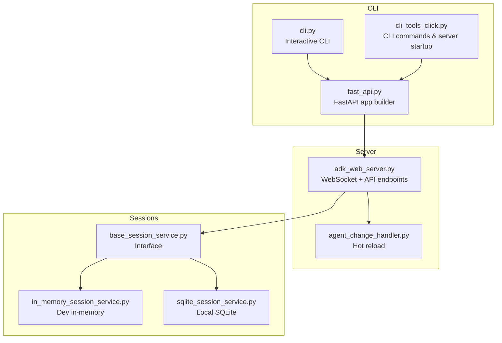
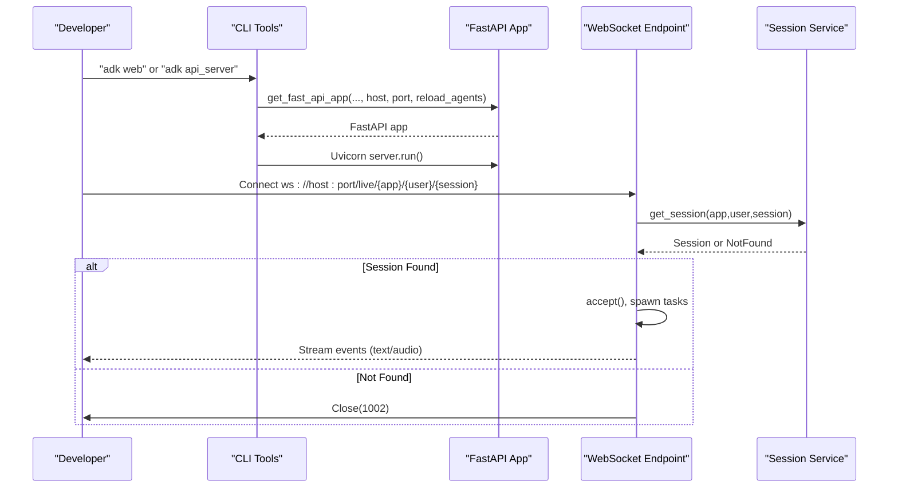
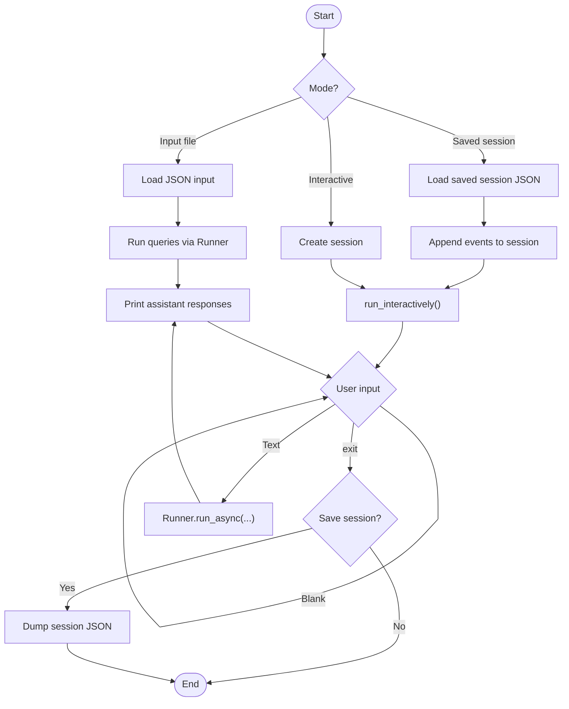
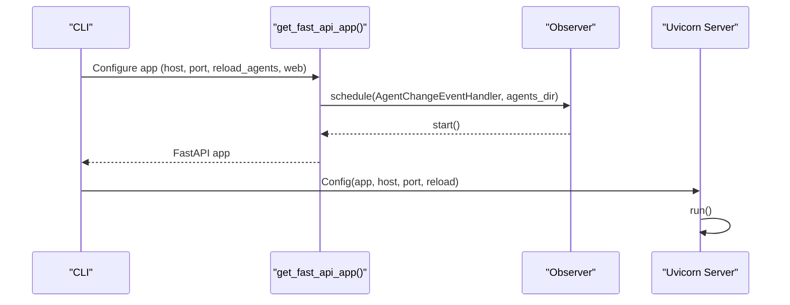
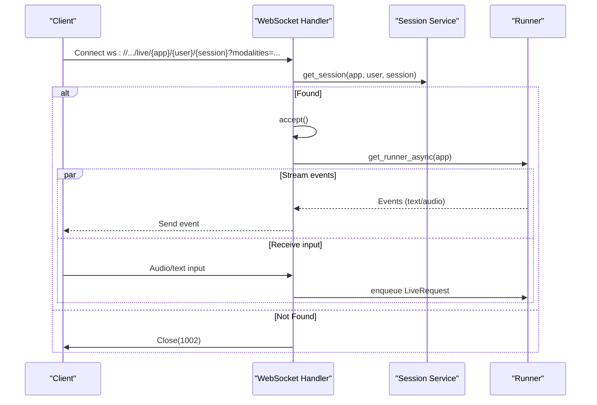
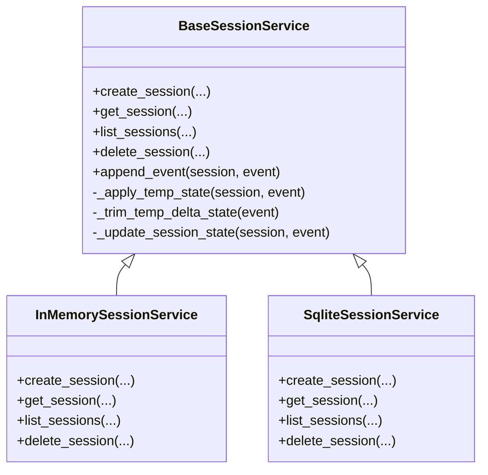
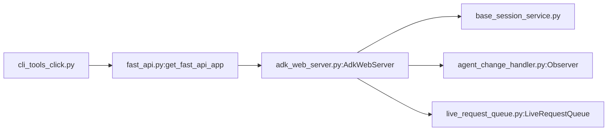

# Development Server and Interactive Mode

<cite>
**Referenced Files in This Document**
- [cli.py](file://src/google/adk/cli/cli.py)
- [cli_tools_click.py](file://src/google/adk/cli/cli_tools_click.py)
- [fast_api.py](file://src/google/adk/cli/fast_api.py)
- [adk_web_server.py](file://src/google/adk/cli/adk_web_server.py)
- [agent_change_handler.py](file://src/google/adk/cli/utils/agent_change_handler.py)
- [live_request_queue.py](file://src/google/adk/agents/live_request_queue.py)
- [base_session_service.py](file://src/google/adk/sessions/base_session_service.py)
- [in_memory_session_service.py](file://src/google/adk/sessions/in_memory_session_service.py)
- [sqlite_session_service.py](file://src/google/adk/sessions/sqlite_session_service.py)
- [test_cli.py](file://tests/unittests/cli/utils/test_cli.py)
- [test_cli_tools_click.py](file://tests/unittests/cli/utils/test_cli_tools_click.py)
- [test_agent_change_handler.py](file://tests/unittests/cli/utils/test_agent_change_handler.py)
- [test_session_service.py](file://tests/unittests/sessions/test_session_service.py)
- [live_agent_example.py](file://contributing/samples/live_agent_api_server_example/live_agent_example.py)
</cite>

## Table of Contents
1. [Introduction](#introduction)
2. [Project Structure](#project-structure)
3. [Core Components](#core-components)
4. [Architecture Overview](#architecture-overview)
5. [Detailed Component Analysis](#detailed-component-analysis)
6. [Dependency Analysis](#dependency-analysis)
7. [Performance Considerations](#performance-considerations)
8. [Troubleshooting Guide](#troubleshooting-guide)
9. [Conclusion](#conclusion)

## Introduction
This document explains the development server and interactive CLI mode for ADK. It covers:
- Interactive terminal interface and real-time conversation handling
- Session management during development
- Development server architecture, hot-reload capabilities, and debugging workflows
- CLI input/output handling, event streaming, and real-time feedback
- Practical examples of interactive development sessions, session persistence, and state management
- Development server configuration, port binding, and network connectivity
- Troubleshooting procedures and performance optimization techniques

## Project Structure
The development server and interactive mode are implemented across several CLI modules and supporting services:
- CLI entrypoints and interactive flows
- FastAPI application construction and server startup
- ADK web server with WebSocket endpoints and optional UI
- Hot-reload mechanism for agent files
- Session services for persistence and state management
- Tests validating CLI behavior and server features

**Diagram sources**
- [cli.py](file://src/google/adk/cli/cli.py#L94-L134)
- [cli_tools_click.py](file://src/google/adk/cli/cli_tools_click.py#L1322-L1400)
- [fast_api.py](file://src/google/adk/cli/fast_api.py#L73-L273)
- [adk_web_server.py](file://src/google/adk/cli/adk_web_server.py#L693-L727)
- [agent_change_handler.py](file://src/google/adk/cli/utils/agent_change_handler.py#L28-L45)
- [base_session_service.py](file://src/google/adk/sessions/base_session_service.py#L45-L154)
- [in_memory_session_service.py](file://src/google/adk/sessions/in_memory_session_service.py#L37-L169)
- [sqlite_session_service.py](file://src/google/adk/sessions/sqlite_session_service.py#L198-L246)

**Section sources**
- [cli.py](file://src/google/adk/cli/cli.py#L1-L284)
- [cli_tools_click.py](file://src/google/adk/cli/cli_tools_click.py#L1-L200)
- [fast_api.py](file://src/google/adk/cli/fast_api.py#L1-L200)
- [adk_web_server.py](file://src/google/adk/cli/adk_web_server.py#L1-L200)
- [agent_change_handler.py](file://src/google/adk/cli/utils/agent_change_handler.py#L1-L45)
- [base_session_service.py](file://src/google/adk/sessions/base_session_service.py#L1-L154)
- [in_memory_session_service.py](file://src/google/adk/sessions/in_memory_session_service.py#L1-L169)
- [sqlite_session_service.py](file://src/google/adk/sessions/sqlite_session_service.py#L198-L246)

## Core Components
- Interactive CLI:
  - Reads user input, runs agent/app with a Runner, streams events to console, and supports saving sessions to JSON.
- Development server:
  - Builds a FastAPI app with optional web UI, exposes WebSocket endpoints for live conversations, and integrates session services.
- Hot reload:
  - Watches agent files (.py, .yaml, .yml) and triggers agent cache invalidation and runner cleanup.
- Session services:
  - Provide create/get/list/delete operations and maintain session state and events with temp-state handling.

**Section sources**
- [cli.py](file://src/google/adk/cli/cli.py#L94-L134)
- [cli.py](file://src/google/adk/cli/cli.py#L136-L284)
- [fast_api.py](file://src/google/adk/cli/fast_api.py#L73-L273)
- [adk_web_server.py](file://src/google/adk/cli/adk_web_server.py#L693-L727)
- [agent_change_handler.py](file://src/google/adk/cli/utils/agent_change_handler.py#L28-L45)
- [base_session_service.py](file://src/google/adk/sessions/base_session_service.py#L45-L154)

## Architecture Overview
The development server composes services and exposes:
- REST endpoints for session management
- WebSocket endpoint for live, real-time conversations
- Optional static web UI mounted under /dev-ui/
- Hot-reload via a file watcher observing agent files

**Diagram sources**
- [cli_tools_click.py](file://src/google/adk/cli/cli_tools_click.py#L1322-L1400)
- [fast_api.py](file://src/google/adk/cli/fast_api.py#L73-L273)
- [adk_web_server.py](file://src/google/adk/cli/adk_web_server.py#L1796-L1884)
- [base_session_service.py](file://src/google/adk/sessions/base_session_service.py#L74-L82)

## Detailed Component Analysis

### Interactive Terminal Interface
The CLI supports three modes:
- Input file mode: loads initial state and a list of queries from JSON, executes them, and prints assistant responses.
- Saved session mode: loads a prior session JSON, creates a new session with merged state, replays events, and continues interacting.
- Interactive mode: creates a session, reads user input until "exit", and streams assistant responses.

**Diagram sources**
- [cli.py](file://src/google/adk/cli/cli.py#L50-L91)
- [cli.py](file://src/google/adk/cli/cli.py#L94-L134)
- [cli.py](file://src/google/adk/cli/cli.py#L136-L284)

**Section sources**
- [cli.py](file://src/google/adk/cli/cli.py#L50-L91)
- [cli.py](file://src/google/adk/cli/cli.py#L94-L134)
- [cli.py](file://src/google/adk/cli/cli.py#L136-L284)
- [test_cli.py](file://tests/unittests/cli/utils/test_cli.py#L238-L521)

### Development Server and Hot Reload
The server builds a FastAPI app with:
- Session, artifact, memory, and credential services
- Optional web UI assets
- WebSocket live endpoint for real-time conversations
- Hot-reload observer watching agent files for .py, .yaml, .yml changes

**Diagram sources**
- [fast_api.py](file://src/google/adk/cli/fast_api.py#L73-L273)
- [adk_web_server.py](file://src/google/adk/cli/adk_web_server.py#L693-L727)
- [agent_change_handler.py](file://src/google/adk/cli/utils/agent_change_handler.py#L28-L45)
- [cli_tools_click.py](file://src/google/adk/cli/cli_tools_click.py#L1322-L1400)

**Section sources**
- [fast_api.py](file://src/google/adk/cli/fast_api.py#L73-L273)
- [adk_web_server.py](file://src/google/adk/cli/adk_web_server.py#L693-L727)
- [agent_change_handler.py](file://src/google/adk/cli/utils/agent_change_handler.py#L28-L45)
- [cli_tools_click.py](file://src/google/adk/cli/cli_tools_click.py#L1322-L1400)
- [test_agent_change_handler.py](file://tests/unittests/cli/utils/test_agent_change_handler.py#L24-L91)

### Real-Time Conversation Handling (WebSocket)
The WebSocket endpoint:
- Accepts connections with app/user/session identifiers
- Retrieves the session; closes with a specific code if not found
- Spawns tasks to forward events from the Runner to the client
- Handles exceptions and cancellation gracefully

**Diagram sources**
- [adk_web_server.py](file://src/google/adk/cli/adk_web_server.py#L1796-L1884)
- [live_request_queue.py](file://src/google/adk/agents/live_request_queue.py#L71-L87)

**Section sources**
- [adk_web_server.py](file://src/google/adk/cli/adk_web_server.py#L1796-L1916)
- [live_request_queue.py](file://src/google/adk/agents/live_request_queue.py#L71-L87)
- [live_agent_example.py](file://contributing/samples/live_agent_api_server_example/live_agent_example.py#L437-L795)

### Session Management During Development
Session services provide:
- Creation with optional explicit IDs and initial state
- Retrieval with optional filters (recent events, timestamps)
- Listing across users
- Event appending with temp-state handling and trimming
- Persistence variants: in-memory and SQLite

**Diagram sources**
- [base_session_service.py](file://src/google/adk/sessions/base_session_service.py#L45-L154)
- [in_memory_session_service.py](file://src/google/adk/sessions/in_memory_session_service.py#L37-L169)
- [sqlite_session_service.py](file://src/google/adk/sessions/sqlite_session_service.py#L198-L246)

**Section sources**
- [base_session_service.py](file://src/google/adk/sessions/base_session_service.py#L45-L154)
- [in_memory_session_service.py](file://src/google/adk/sessions/in_memory_session_service.py#L37-L169)
- [sqlite_session_service.py](file://src/google/adk/sessions/sqlite_session_service.py#L198-L246)
- [test_session_service.py](file://tests/unittests/sessions/test_session_service.py#L224-L793)

### CLI Input/Output Handling and Event Streaming
- Interactive mode prints "[user]: ..." and "[assistant]: ..." messages as events arrive.
- Input file mode prints each assistant response immediately after sending a user query.
- Saved session mode replays stored events and then continues interactive mode.

**Section sources**
- [cli.py](file://src/google/adk/cli/cli.py#L50-L91)
- [cli.py](file://src/google/adk/cli/cli.py#L94-L134)
- [test_cli.py](file://tests/unittests/cli/utils/test_cli.py#L238-L521)

### Practical Examples
- Interactive development session:
  - Start CLI with an agent, type queries, see assistant responses, and exit to save a session JSON.
- Session persistence:
  - Use SQLite-backed session service for durable local sessions.
- State management:
  - Temp state deltas are applied in-memory during invocation and trimmed from persisted events.

**Section sources**
- [cli.py](file://src/google/adk/cli/cli.py#L136-L284)
- [sqlite_session_service.py](file://src/google/adk/sessions/sqlite_session_service.py#L198-L246)
- [base_session_service.py](file://src/google/adk/sessions/base_session_service.py#L118-L146)
- [test_session_service.py](file://tests/unittests/sessions/test_session_service.py#L641-L787)

## Dependency Analysis
Key dependencies and relationships:
- CLI commands depend on FastAPI app builder
- FastAPI app depends on session/artifact/memory services and AdkWebServer
- AdkWebServer depends on session service and runner
- Hot reload depends on watchdog Observer and AgentChangeEventHandler
- WebSocket live endpoint depends on LiveRequestQueue

**Diagram sources**
- [cli_tools_click.py](file://src/google/adk/cli/cli_tools_click.py#L1322-L1400)
- [fast_api.py](file://src/google/adk/cli/fast_api.py#L73-L273)
- [adk_web_server.py](file://src/google/adk/cli/adk_web_server.py#L693-L727)
- [base_session_service.py](file://src/google/adk/sessions/base_session_service.py#L45-L154)
- [agent_change_handler.py](file://src/google/adk/cli/utils/agent_change_handler.py#L28-L45)
- [live_request_queue.py](file://src/google/adk/agents/live_request_queue.py#L71-L87)

**Section sources**
- [cli_tools_click.py](file://src/google/adk/cli/cli_tools_click.py#L1322-L1400)
- [fast_api.py](file://src/google/adk/cli/fast_api.py#L73-L273)
- [adk_web_server.py](file://src/google/adk/cli/adk_web_server.py#L693-L727)
- [agent_change_handler.py](file://src/google/adk/cli/utils/agent_change_handler.py#L28-L45)
- [live_request_queue.py](file://src/google/adk/agents/live_request_queue.py#L71-L87)

## Performance Considerations
- Hot reload:
  - Watchdog monitors only supported extensions (.py, .yaml, .yml) to minimize overhead.
  - Cache invalidation and runner cleanup reduce stale state during reload.
- Streaming:
  - WebSocket tasks are coordinated with asyncio.wait; exceptions are logged and the connection is closed cleanly.
- Session updates:
  - Temp state is applied in-memory and trimmed from persisted deltas to avoid bloating storage.

[No sources needed since this section provides general guidance]

## Troubleshooting Guide
Common issues and resolutions:
- Server fails to start:
  - Verify host/port availability and CORS origins configuration.
  - Confirm service URIs for session/artifact/memory services are valid.
- WebSocket disconnects:
  - Inspect server logs for exceptions raised during event forwarding.
  - Ensure the session exists before connecting; server closes with a specific code if not found.
- Hot reload not triggering:
  - Confirm file extensions are .py, .yaml, or .yml.
  - Check that the agents directory path is correct and watcher is started.
- Interactive CLI stalls:
  - Ensure Runner is properly closed after interactive loop.
  - Validate that input is non-empty and "exit" is used to terminate.

**Section sources**
- [cli_tools_click.py](file://src/google/adk/cli/cli_tools_click.py#L1322-L1400)
- [adk_web_server.py](file://src/google/adk/cli/adk_web_server.py#L1861-L1884)
- [test_agent_change_handler.py](file://tests/unittests/cli/utils/test_agent_change_handler.py#L24-L91)
- [test_cli.py](file://tests/unittests/cli/utils/test_cli.py#L238-L521)

## Conclusion
The ADK development server and interactive CLI provide a robust environment for iterative agent development:
- Real-time WebSocket conversations with configurable modalities
- Flexible session services for persistence and state management
- Hot-reload for rapid iteration on agent definitions
- Comprehensive CLI modes for scripted, saved-session, and interactive workflows
- Clear diagnostics and graceful error handling for smooth developer experience