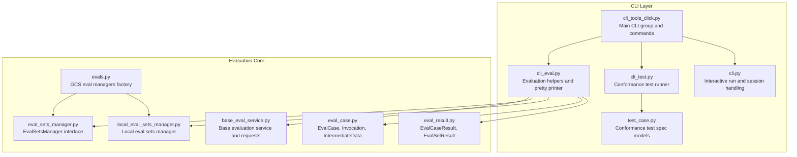
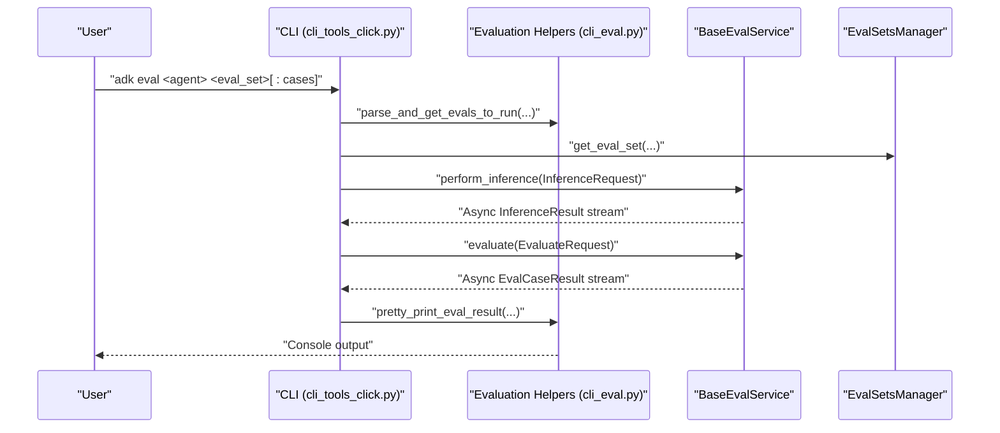
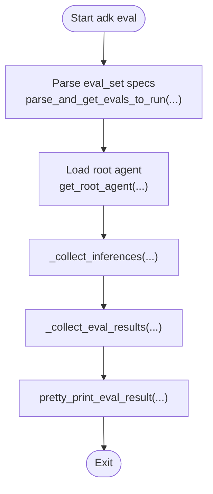
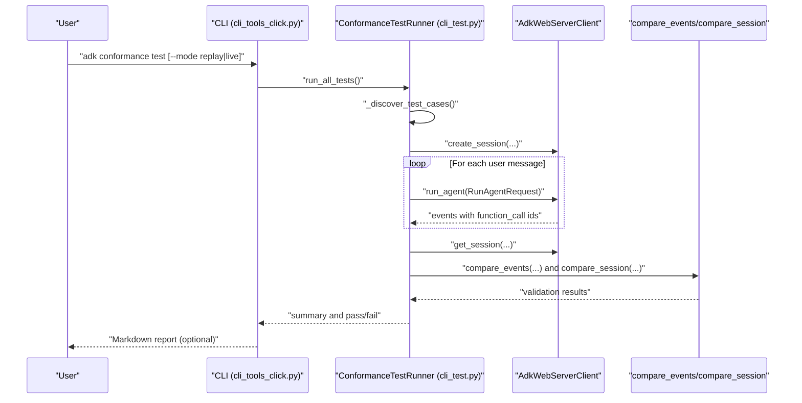
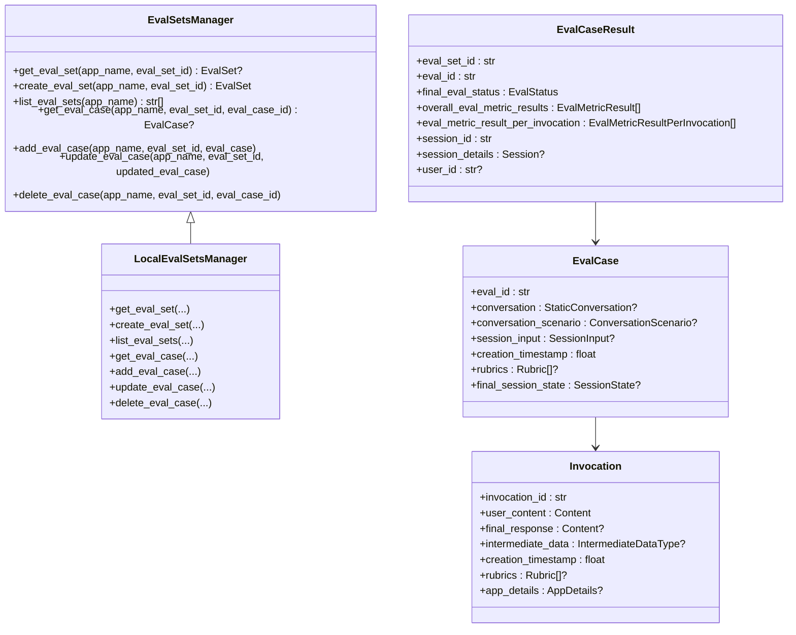
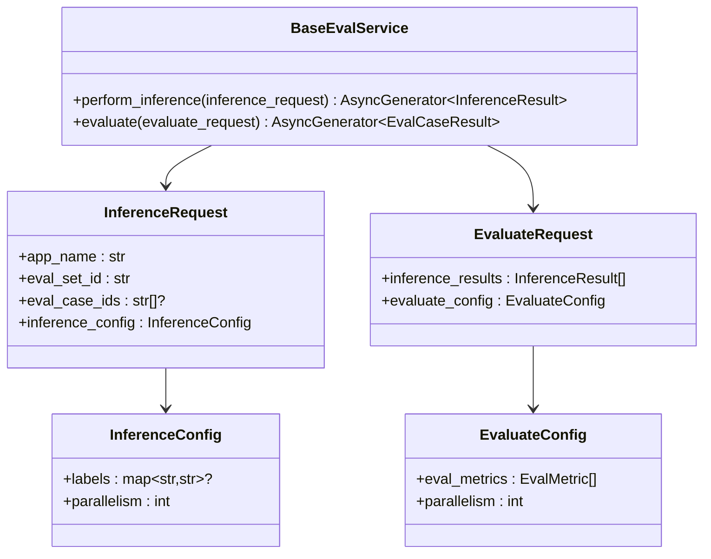
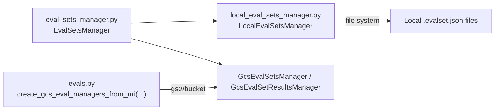
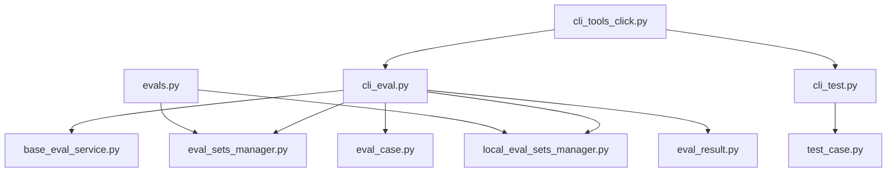

# Evaluation and Testing CLI Tools

<cite>
**Referenced Files in This Document**
- [cli_tools_click.py](file://src/google/adk/cli/cli_tools_click.py)
- [cli_eval.py](file://src/google/adk/cli/cli_eval.py)
- [cli.py](file://src/google/adk/cli/cli.py)
- [cli_test.py](file://src/google/adk/cli/conformance/cli_test.py)
- [test_case.py](file://src/google/adk/cli/conformance/test_case.py)
- [base_eval_service.py](file://src/google/adk/evaluation/base_eval_service.py)
- [eval_sets_manager.py](file://src/google/adk/evaluation/eval_sets_manager.py)
- [local_eval_sets_manager.py](file://src/google/adk/evaluation/local_eval_sets_manager.py)
- [eval_case.py](file://src/google/adk/evaluation/eval_case.py)
- [eval_result.py](file://src/google/adk/evaluation/eval_result.py)
- [evals.py](file://src/google/adk/cli/utils/evals.py)
</cite>

## Table of Contents
1. [Introduction](#introduction)
2. [Project Structure](#project-structure)
3. [Core Components](#core-components)
4. [Architecture Overview](#architecture-overview)
5. [Detailed Component Analysis](#detailed-component-analysis)
6. [Dependency Analysis](#dependency-analysis)
7. [Performance Considerations](#performance-considerations)
8. [Troubleshooting Guide](#troubleshooting-guide)
9. [Conclusion](#conclusion)
10. [Appendices](#appendices)

## Introduction
This document describes the evaluation and testing command-line interface tools in the Agent Development Kit (ADK). It explains how to run evaluation suites against agents, manage test configurations, interpret results, and integrate with continuous testing pipelines. It covers both the general evaluation framework and the conformance testing workflow, including CLI commands, evaluation data models, and execution patterns.

## Project Structure
The evaluation and testing capabilities are implemented across CLI commands, evaluation services, and data models:
- CLI commands expose subcommands for evaluation and conformance testing.
- Evaluation services define the evaluation pipeline and metrics.
- Data models represent evaluation sets, cases, invocations, and results.
- Utilities support local and cloud-backed storage managers for evaluation artifacts.

**Diagram sources**
- [cli_tools_click.py](file://src/google/adk/cli/cli_tools_click.py#L695-L807)
- [cli_eval.py](file://src/google/adk/cli/cli_eval.py#L1-L315)
- [cli.py](file://src/google/adk/cli/cli.py#L136-L284)
- [cli_test.py](file://src/google/adk/cli/conformance/cli_test.py#L1-L396)
- [test_case.py](file://src/google/adk/cli/conformance/test_case.py#L1-L74)
- [base_eval_service.py](file://src/google/adk/evaluation/base_eval_service.py#L1-L202)
- [eval_sets_manager.py](file://src/google/adk/evaluation/eval_sets_manager.py#L1-L86)
- [local_eval_sets_manager.py](file://src/google/adk/evaluation/local_eval_sets_manager.py#L1-L341)
- [eval_case.py](file://src/google/adk/evaluation/eval_case.py#L1-L255)
- [eval_result.py](file://src/google/adk/evaluation/eval_result.py#L1-L92)
- [evals.py](file://src/google/adk/cli/utils/evals.py#L1-L87)

**Section sources**
- [cli_tools_click.py](file://src/google/adk/cli/cli_tools_click.py#L695-L807)
- [cli_eval.py](file://src/google/adk/cli/cli_eval.py#L1-L315)
- [cli.py](file://src/google/adk/cli/cli.py#L136-L284)
- [cli_test.py](file://src/google/adk/cli/conformance/cli_test.py#L1-L396)
- [test_case.py](file://src/google/adk/cli/conformance/test_case.py#L1-L74)
- [base_eval_service.py](file://src/google/adk/evaluation/base_eval_service.py#L1-L202)
- [eval_sets_manager.py](file://src/google/adk/evaluation/eval_sets_manager.py#L1-L86)
- [local_eval_sets_manager.py](file://src/google/adk/evaluation/local_eval_sets_manager.py#L1-L341)
- [eval_case.py](file://src/google/adk/evaluation/eval_case.py#L1-L255)
- [eval_result.py](file://src/google/adk/evaluation/eval_result.py#L1-L92)
- [evals.py](file://src/google/adk/cli/utils/evals.py#L1-L87)

## Core Components
- Evaluation CLI command: Runs evaluation suites against an agent module, supports selecting eval sets and specific eval cases, and prints summarized results.
- Conformance testing CLI: Discovers test cases from directories, runs them in replay mode against recorded sessions, and reports pass/fail outcomes.
- Evaluation service and models: Defines requests, inference generation, evaluation metrics, and result structures.
- Evaluation sets managers: Provides local and cloud-backed storage for eval sets and results.

Key CLI entry points:
- Evaluation command: [cli_eval](file://src/google/adk/cli/cli_tools_click.py#L695-L807)
- Conformance test command: [cli_conformance_test](file://src/google/adk/cli/cli_tools_click.py#L279-L408)
- Interactive run command: [cli_run](file://src/google/adk/cli/cli_tools_click.py#L576-L665)

**Section sources**
- [cli_tools_click.py](file://src/google/adk/cli/cli_tools_click.py#L695-L807)
- [cli_tools_click.py](file://src/google/adk/cli/cli_tools_click.py#L279-L408)
- [cli_tools_click.py](file://src/google/adk/cli/cli_tools_click.py#L576-L665)

## Architecture Overview
The evaluation and testing architecture consists of:
- CLI commands orchestrating evaluation and conformance workflows.
- Evaluation service performing inference and evaluation asynchronously.
- Data models capturing evaluation sets, cases, invocations, and results.
- Storage managers supporting local and cloud-backed persistence.

**Diagram sources**
- [cli_tools_click.py](file://src/google/adk/cli/cli_tools_click.py#L695-L807)
- [cli_eval.py](file://src/google/adk/cli/cli_eval.py#L103-L174)
- [base_eval_service.py](file://src/google/adk/evaluation/base_eval_service.py#L85-L202)
- [eval_sets_manager.py](file://src/google/adk/evaluation/eval_sets_manager.py#L25-L86)

## Detailed Component Analysis

### Evaluation CLI Workflow
The evaluation command parses user-specified eval sets and cases, loads the target agent module, collects inferences via the evaluation service, evaluates them with configured metrics, and prints results.

**Diagram sources**
- [cli_tools_click.py](file://src/google/adk/cli/cli_tools_click.py#L713-L807)
- [cli_eval.py](file://src/google/adk/cli/cli_eval.py#L103-L174)
- [cli_eval.py](file://src/google/adk/cli/cli_eval.py#L191-L296)

Key behaviors:
- Parsing eval selection: [parse_and_get_evals_to_run](file://src/google/adk/cli/cli_eval.py#L103-L132)
- Inference collection: [_collect_inferences](file://src/google/adk/cli/cli_eval.py#L135-L150)
- Evaluation collection: [_collect_eval_results](file://src/google/adk/cli/cli_eval.py#L153-L173)
- Pretty-printing: [pretty_print_eval_result](file://src/google/adk/cli/cli_eval.py#L191-L296)

**Section sources**
- [cli_tools_click.py](file://src/google/adk/cli/cli_tools_click.py#L713-L807)
- [cli_eval.py](file://src/google/adk/cli/cli_eval.py#L103-L174)
- [cli_eval.py](file://src/google/adk/cli/cli_eval.py#L191-L296)

### Conformance Testing Workflow
Conformance tests validate agent behavior against recorded interactions. The runner discovers test cases, replays user messages, compares resulting sessions with recorded data, and produces a summary.

**Diagram sources**
- [cli_tools_click.py](file://src/google/adk/cli/cli_tools_click.py#L279-L408)
- [cli_test.py](file://src/google/adk/cli/conformance/cli_test.py#L318-L396)
- [cli_test.py](file://src/google/adk/cli/conformance/cli_test.py#L65-L316)

Key behaviors:
- Discovering test cases: [_discover_test_cases](file://src/google/adk/cli/conformance/cli_test.py#L80-L116)
- Replay execution: [_run_test_case_replay](file://src/google/adk/cli/conformance/cli_test.py#L233-L275)
- Validation: [_validate_test_results](file://src/google/adk/cli/conformance/cli_test.py#L181-L232)
- Test spec models: [TestSpec, TestCase](file://src/google/adk/cli/conformance/test_case.py#L42-L74)

**Section sources**
- [cli_tools_click.py](file://src/google/adk/cli/cli_tools_click.py#L279-L408)
- [cli_test.py](file://src/google/adk/cli/conformance/cli_test.py#L65-L316)
- [test_case.py](file://src/google/adk/cli/conformance/test_case.py#L42-L74)

### Evaluation Data Models
Evaluation data models define the structure of evaluation sets, cases, invocations, and results.

**Diagram sources**
- [eval_sets_manager.py](file://src/google/adk/evaluation/eval_sets_manager.py#L25-L86)
- [local_eval_sets_manager.py](file://src/google/adk/evaluation/local_eval_sets_manager.py#L191-L341)
- [eval_case.py](file://src/google/adk/evaluation/eval_case.py#L132-L177)
- [eval_case.py](file://src/google/adk/evaluation/eval_case.py#L80-L110)
- [eval_result.py](file://src/google/adk/evaluation/eval_result.py#L31-L92)

**Section sources**
- [eval_sets_manager.py](file://src/google/adk/evaluation/eval_sets_manager.py#L25-L86)
- [local_eval_sets_manager.py](file://src/google/adk/evaluation/local_eval_sets_manager.py#L191-L341)
- [eval_case.py](file://src/google/adk/evaluation/eval_case.py#L80-L177)
- [eval_result.py](file://src/google/adk/evaluation/eval_result.py#L31-L92)

### Evaluation Service Contracts
The evaluation service defines asynchronous contracts for inference and evaluation.

**Diagram sources**
- [base_eval_service.py](file://src/google/adk/evaluation/base_eval_service.py#L177-L202)
- [base_eval_service.py](file://src/google/adk/evaluation/base_eval_service.py#L85-L175)

**Section sources**
- [base_eval_service.py](file://src/google/adk/evaluation/base_eval_service.py#L85-L202)

### Storage Managers and Cloud Integration
Storage managers provide local and cloud-backed persistence for evaluation sets and results.

**Diagram sources**
- [evals.py](file://src/google/adk/cli/utils/evals.py#L55-L87)
- [local_eval_sets_manager.py](file://src/google/adk/evaluation/local_eval_sets_manager.py#L191-L341)
- [eval_sets_manager.py](file://src/google/adk/evaluation/eval_sets_manager.py#L25-L86)

**Section sources**
- [evals.py](file://src/google/adk/cli/utils/evals.py#L55-L87)
- [local_eval_sets_manager.py](file://src/google/adk/evaluation/local_eval_sets_manager.py#L191-L341)
- [eval_sets_manager.py](file://src/google/adk/evaluation/eval_sets_manager.py#L25-L86)

## Dependency Analysis
The evaluation and testing CLI depends on:
- CLI orchestration: [cli_tools_click.py](file://src/google/adk/cli/cli_tools_click.py#L695-L807)
- Evaluation helpers: [cli_eval.py](file://src/google/adk/cli/cli_eval.py#L1-L315)
- Evaluation service contracts: [base_eval_service.py](file://src/google/adk/evaluation/base_eval_service.py#L1-L202)
- Data models: [eval_case.py](file://src/google/adk/evaluation/eval_case.py#L1-L255), [eval_result.py](file://src/google/adk/evaluation/eval_result.py#L1-L92)
- Storage managers: [eval_sets_manager.py](file://src/google/adk/evaluation/eval_sets_manager.py#L1-L86), [local_eval_sets_manager.py](file://src/google/adk/evaluation/local_eval_sets_manager.py#L1-L341), [evals.py](file://src/google/adk/cli/utils/evals.py#L1-L87)
- Conformance testing: [cli_test.py](file://src/google/adk/cli/conformance/cli_test.py#L1-L396), [test_case.py](file://src/google/adk/cli/conformance/test_case.py#L1-L74)

**Diagram sources**
- [cli_tools_click.py](file://src/google/adk/cli/cli_tools_click.py#L695-L807)
- [cli_eval.py](file://src/google/adk/cli/cli_eval.py#L1-L315)
- [base_eval_service.py](file://src/google/adk/evaluation/base_eval_service.py#L1-L202)
- [eval_sets_manager.py](file://src/google/adk/evaluation/eval_sets_manager.py#L1-L86)
- [local_eval_sets_manager.py](file://src/google/adk/evaluation/local_eval_sets_manager.py#L1-L341)
- [eval_case.py](file://src/google/adk/evaluation/eval_case.py#L1-L255)
- [eval_result.py](file://src/google/adk/evaluation/eval_result.py#L1-L92)
- [evals.py](file://src/google/adk/cli/utils/evals.py#L1-L87)
- [cli_test.py](file://src/google/adk/cli/conformance/cli_test.py#L1-L396)
- [test_case.py](file://src/google/adk/cli/conformance/test_case.py#L1-L74)

**Section sources**
- [cli_tools_click.py](file://src/google/adk/cli/cli_tools_click.py#L695-L807)
- [cli_eval.py](file://src/google/adk/cli/cli_eval.py#L1-L315)
- [base_eval_service.py](file://src/google/adk/evaluation/base_eval_service.py#L1-L202)
- [eval_sets_manager.py](file://src/google/adk/evaluation/eval_sets_manager.py#L1-L86)
- [local_eval_sets_manager.py](file://src/google/adk/evaluation/local_eval_sets_manager.py#L1-L341)
- [eval_case.py](file://src/google/adk/evaluation/eval_case.py#L1-L255)
- [eval_result.py](file://src/google/adk/evaluation/eval_result.py#L1-L92)
- [evals.py](file://src/google/adk/cli/utils/evals.py#L1-L87)
- [cli_test.py](file://src/google/adk/cli/conformance/cli_test.py#L1-L396)
- [test_case.py](file://src/google/adk/cli/conformance/test_case.py#L1-L74)

## Performance Considerations
- Parallelism controls: Both inference and evaluation support configurable parallelism to balance throughput and quota limits. Adjust parallelism based on model quotas and tool SLAs.
- Streaming evaluation: Results are streamed as they become available, enabling responsive feedback and reduced latency.
- Local vs cloud storage: Local storage avoids network overhead for small-scale runs; cloud storage enables shared results and CI integration.

[No sources needed since this section provides general guidance]

## Troubleshooting Guide
Common issues and resolutions:
- Missing evaluation dependencies: The CLI checks for required packages and raises a clear message when missing. Install the required dependencies to enable evaluation features.
  - Reference: [MISSING_EVAL_DEPENDENCIES_MESSAGE](file://src/google/adk/evaluation/constants.py#L1-L200)
- Conformance test discovery: If no test cases are found, verify directory structure and presence of spec.yaml and generated recordings in replay mode.
  - Reference: [_discover_test_cases](file://src/google/adk/cli/conformance/cli_test.py#L80-L116)
- Replay validation failures: Inspect error messages indicating mismatches in events or session state; ensure recorded data matches expected agent behavior.
  - Reference: [_validate_test_results](file://src/google/adk/cli/conformance/cli_test.py#L181-L232)
- Evaluation parsing: Ensure eval set identifiers and case lists are correctly formatted when specifying subsets of eval cases.
  - Reference: [parse_and_get_evals_to_run](file://src/google/adk/cli/cli_eval.py#L103-L132)
- Pretty-printing dependencies: The pretty printer requires pandas and tabulate; install them to enable detailed console output.
  - Reference: [pretty_print_eval_result](file://src/google/adk/cli/cli_eval.py#L191-L296)

**Section sources**
- [cli_eval.py](file://src/google/adk/cli/cli_eval.py#L191-L296)
- [cli_test.py](file://src/google/adk/cli/conformance/cli_test.py#L80-L116)
- [cli_test.py](file://src/google/adk/cli/conformance/cli_test.py#L181-L232)
- [cli_eval.py](file://src/google/adk/cli/cli_eval.py#L103-L132)

## Conclusion
The ADK evaluation and testing CLI tools provide a robust framework for running evaluation suites and conformance tests against agents. The CLI integrates with evaluation services and data models to collect inferences, apply metrics, and produce actionable results. Conformance testing ensures consistent agent behavior by replaying recorded interactions and validating outcomes. With local and cloud-backed storage managers, teams can scale evaluation and integrate results into continuous testing pipelines.

[No sources needed since this section summarizes without analyzing specific files]

## Appendices

### Practical Examples

- Running evaluation against an agent module:
  - Command: [cli_eval](file://src/google/adk/cli/cli_tools_click.py#L695-L807)
  - Notes: Supports selecting eval sets and specific cases; prints summarized results; optionally prints detailed results.

- Running conformance tests:
  - Command: [cli_conformance_test](file://src/google/adk/cli/cli_tools_click.py#L279-L408)
  - Modes: replay (default) compares against recorded sessions; live mode is reserved for future use.
  - Report generation: Optional Markdown report can be produced after test execution.

- Managing evaluation sets:
  - Local eval sets: [LocalEvalSetsManager](file://src/google/adk/evaluation/local_eval_sets_manager.py#L191-L341)
  - Cloud eval sets: [create_gcs_eval_managers_from_uri](file://src/google/adk/cli/utils/evals.py#L55-L87)

- Custom test case creation (conformance):
  - Test specification: [TestSpec](file://src/google/adk/cli/conformance/test_case.py#L42-L64)
  - Test case structure: [TestCase](file://src/google/adk/cli/conformance/test_case.py#L66-L74)

**Section sources**
- [cli_tools_click.py](file://src/google/adk/cli/cli_tools_click.py#L695-L807)
- [cli_tools_click.py](file://src/google/adk/cli/cli_tools_click.py#L279-L408)
- [local_eval_sets_manager.py](file://src/google/adk/evaluation/local_eval_sets_manager.py#L191-L341)
- [evals.py](file://src/google/adk/cli/utils/evals.py#L55-L87)
- [test_case.py](file://src/google/adk/cli/conformance/test_case.py#L42-L74)

### Batch Processing and Continuous Integration
- Batch processing: Use the evaluation CLI to run multiple eval sets and filter cases by name to process large batches efficiently.
- CI integration: Store evaluation results in cloud storage using GCS managers and generate reports for visibility and regression detection.
- References:
  - [create_gcs_eval_managers_from_uri](file://src/google/adk/cli/utils/evals.py#L55-L87)
  - [cli_eval](file://src/google/adk/cli/cli_tools_click.py#L695-L807)

**Section sources**
- [evals.py](file://src/google/adk/cli/utils/evals.py#L55-L87)
- [cli_tools_click.py](file://src/google/adk/cli/cli_tools_click.py#L695-L807)