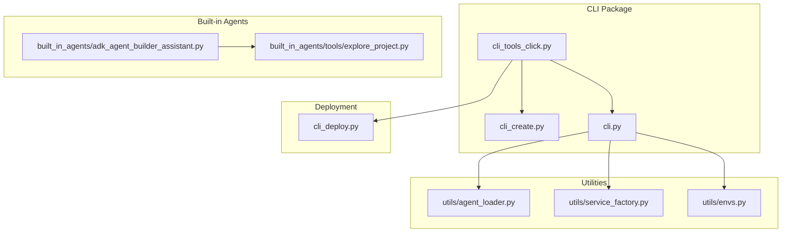
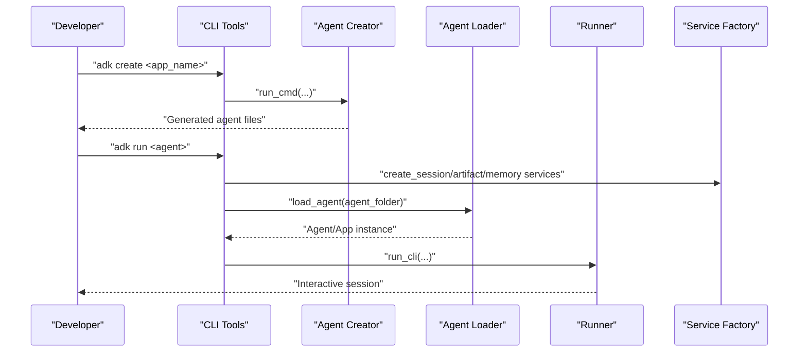
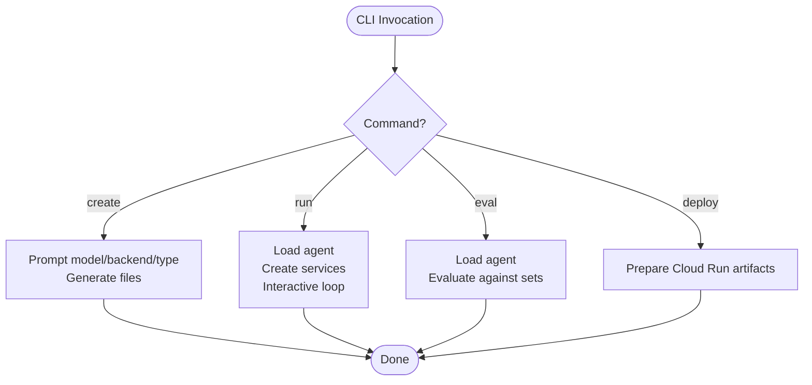
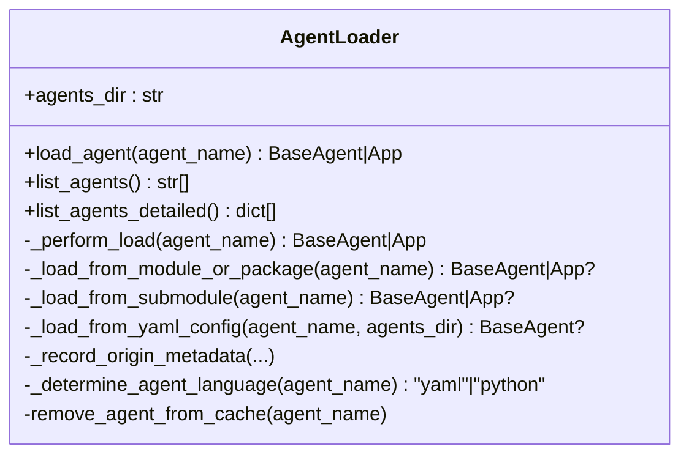
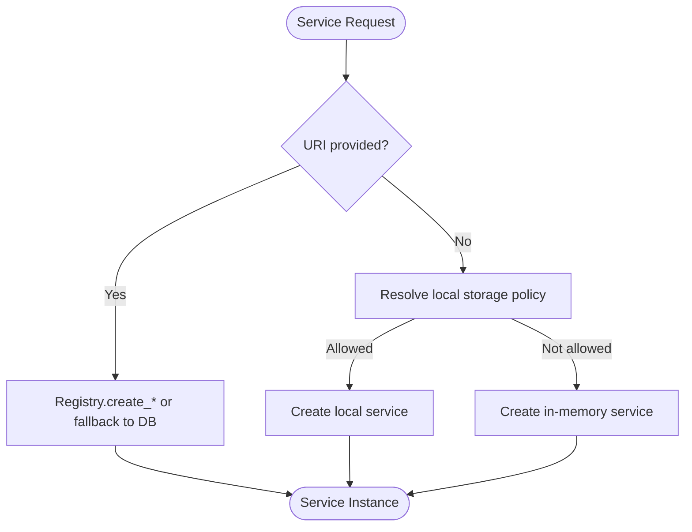
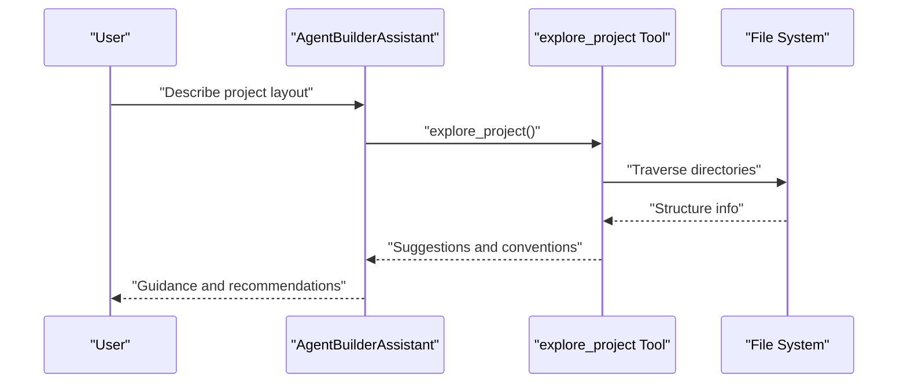
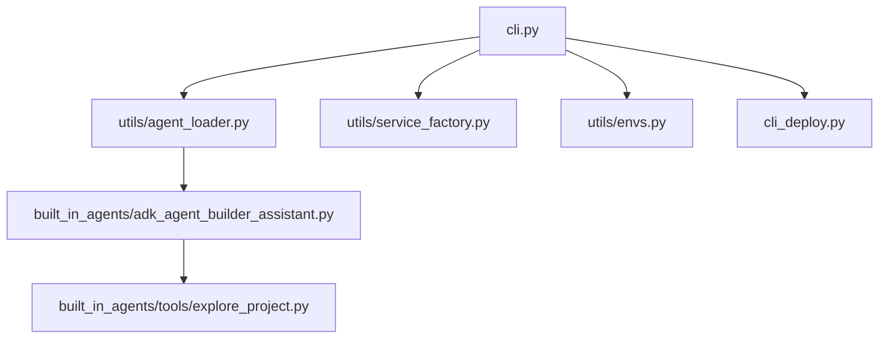

# Utility Commands and Development Tools

<cite>
**Referenced Files in This Document**
- [cli_tools_click.py](file://src/google/adk/cli/cli_tools_click.py)
- [cli_create.py](file://src/google/adk/cli/cli_create.py)
- [cli.py](file://src/google/adk/cli/cli.py)
- [agent_loader.py](file://src/google/adk/cli/utils/agent_loader.py)
- [service_factory.py](file://src/google/adk/cli/utils/service_factory.py)
- [envs.py](file://src/google/adk/cli/utils/envs.py)
- [adk_agent_builder_assistant.py](file://src/google/adk/cli/built_in_agents/adk_agent_builder_assistant.py)
- [explore_project.py](file://src/google/adk/cli/built_in_agents/tools/explore_project.py)
- [cli_deploy.py](file://src/google/adk/cli/cli_deploy.py)
- [test_cli_create.py](file://tests/unittests/cli/utils/test_cli_create.py)
- [test_agent_loader.py](file://tests/unittests/cli/utils/test_agent_loader.py)
</cite>

## Table of Contents
1. [Introduction](#introduction)
2. [Project Structure](#project-structure)
3. [Core Components](#core-components)
4. [Architecture Overview](#architecture-overview)
5. [Detailed Component Analysis](#detailed-component-analysis)
6. [Dependency Analysis](#dependency-analysis)
7. [Performance Considerations](#performance-considerations)
8. [Troubleshooting Guide](#troubleshooting-guide)
9. [Conclusion](#conclusion)
10. [Appendices](#appendices)

## Introduction
This document explains ADK’s utility commands and development helper tools that streamline agent creation, project scaffolding, and development workflow automation. It covers:
- The CLI’s role in generating boilerplate code, setting up development environments, and managing project structure
- Agent loader functionality for flexible agent discovery and isolation
- Service factory patterns for session, artifact, and memory services
- Configuration management utilities and environment variable handling
- Practical examples for project initialization, agent template usage, and development environment setup
- Customization tips, IDE integration, and team workflows
- Best practices for using utility commands across different development scenarios

## Project Structure
ADK organizes development utilities under the CLI package with supporting utilities for agent loading, service creation, and environment management. The CLI exposes commands for creating agents, running them interactively, evaluating them, and deploying them.

**Diagram sources**
- [cli_tools_click.py](file://src/google/adk/cli/cli_tools_click.py#L410-L470)
- [cli_create.py](file://src/google/adk/cli/cli_create.py#L278-L338)
- [cli.py](file://src/google/adk/cli/cli.py#L136-L284)
- [agent_loader.py](file://src/google/adk/cli/utils/agent_loader.py#L47-L332)
- [service_factory.py](file://src/google/adk/cli/utils/service_factory.py#L170-L329)
- [envs.py](file://src/google/adk/cli/utils/envs.py#L53-L91)
- [adk_agent_builder_assistant.py](file://src/google/adk/cli/built_in_agents/adk_agent_builder_assistant.py#L70-L145)
- [explore_project.py](file://src/google/adk/cli/built_in_agents/tools/explore_project.py#L29-L143)
- [cli_deploy.py](file://src/google/adk/cli/cli_deploy.py#L672-L702)

**Section sources**
- [cli_tools_click.py](file://src/google/adk/cli/cli_tools_click.py#L410-L470)
- [cli_create.py](file://src/google/adk/cli/cli_create.py#L278-L338)
- [cli.py](file://src/google/adk/cli/cli.py#L136-L284)
- [agent_loader.py](file://src/google/adk/cli/utils/agent_loader.py#L47-L332)
- [service_factory.py](file://src/google/adk/cli/utils/service_factory.py#L170-L329)
- [envs.py](file://src/google/adk/cli/utils/envs.py#L53-L91)
- [adk_agent_builder_assistant.py](file://src/google/adk/cli/built_in_agents/adk_agent_builder_assistant.py#L70-L145)
- [explore_project.py](file://src/google/adk/cli/built_in_agents/tools/explore_project.py#L29-L143)
- [cli_deploy.py](file://src/google/adk/cli/cli_deploy.py#L672-L702)

## Core Components
- CLI commands for agent creation, running, evaluation, and deployment
- Agent loader supporting multiple agent formats and isolation
- Service factory for session, artifact, and memory services with environment-aware defaults
- Environment variable management with .env loading and precedence rules
- Built-in agent builder assistant and project exploration tools

Key responsibilities:
- Create agent templates with model selection and backend configuration
- Load agents from code or YAML with caching and environment injection
- Provision services with sensible defaults and overrides
- Provide interactive CLI for agent sessions and replay/resume workflows
- Assist in project scaffolding and naming conventions

**Section sources**
- [cli_tools_click.py](file://src/google/adk/cli/cli_tools_click.py#L410-L470)
- [cli_create.py](file://src/google/adk/cli/cli_create.py#L278-L338)
- [cli.py](file://src/google/adk/cli/cli.py#L136-L284)
- [agent_loader.py](file://src/google/adk/cli/utils/agent_loader.py#L47-L332)
- [service_factory.py](file://src/google/adk/cli/utils/service_factory.py#L170-L329)
- [envs.py](file://src/google/adk/cli/utils/envs.py#L53-L91)
- [adk_agent_builder_assistant.py](file://src/google/adk/cli/built_in_agents/adk_agent_builder_assistant.py#L70-L145)
- [explore_project.py](file://src/google/adk/cli/built_in_agents/tools/explore_project.py#L29-L143)

## Architecture Overview
The CLI orchestrates development tasks by composing:
- Command parsing and options handling
- Agent creation and scaffolding
- Interactive session execution
- Service provisioning and environment management
- Deployment preparation

**Diagram sources**
- [cli_tools_click.py](file://src/google/adk/cli/cli_tools_click.py#L410-L470)
- [cli_create.py](file://src/google/adk/cli/cli_create.py#L278-L338)
- [cli.py](file://src/google/adk/cli/cli.py#L136-L284)
- [agent_loader.py](file://src/google/adk/cli/utils/agent_loader.py#L322-L332)
- [service_factory.py](file://src/google/adk/cli/utils/service_factory.py#L170-L329)

## Detailed Component Analysis

### CLI Commands and Workflows
- Create command: Generates agent templates with model/backend choices and optional YAML/code agent type
- Run command: Starts interactive sessions, supports replaying saved sessions or resuming previous sessions
- Evaluation and conformance commands: Provide evaluation harnesses and test recording/validation
- Deploy command: Prepares Cloud Run source artifacts and manages service URIs

**Diagram sources**
- [cli_tools_click.py](file://src/google/adk/cli/cli_tools_click.py#L410-L470)
- [cli_create.py](file://src/google/adk/cli/cli_create.py#L278-L338)
- [cli.py](file://src/google/adk/cli/cli.py#L136-L284)
- [cli_deploy.py](file://src/google/adk/cli/cli_deploy.py#L672-L702)

**Section sources**
- [cli_tools_click.py](file://src/google/adk/cli/cli_tools_click.py#L410-L470)
- [cli_create.py](file://src/google/adk/cli/cli_create.py#L278-L338)
- [cli.py](file://src/google/adk/cli/cli.py#L136-L284)
- [cli_deploy.py](file://src/google/adk/cli/cli_deploy.py#L672-L702)

### Agent Creation Utilities
- Template generation for both code-based and YAML-based agents
- Backend selection prompts for Google AI or Vertex AI
- Validation of app names and non-empty folder handling with user confirmation
- Environment variable emission for selected backend and model

Practical example:
- Initialize a new agent project with a chosen model and backend, then confirm overwrite if the target directory is not empty.

**Section sources**
- [cli_create.py](file://src/google/adk/cli/cli_create.py#L171-L221)
- [cli_create.py](file://src/google/adk/cli/cli_create.py#L223-L237)
- [cli_create.py](file://src/google/adk/cli/cli_create.py#L239-L259)
- [cli_create.py](file://src/google/adk/cli/cli_create.py#L278-L338)
- [test_cli_create.py](file://tests/unittests/cli/utils/test_cli_create.py#L175-L204)

### Agent Loader Functionality
- Supports multiple agent discovery patterns: module, package, submodule, and YAML config
- Loads .env files per agent with precedence preservation
- Caching and origin metadata attachment for diagnostics
- Lists agents and provides detailed metadata (name, description, type, computer-use tool detection)

**Diagram sources**
- [agent_loader.py](file://src/google/adk/cli/utils/agent_loader.py#L47-L332)

**Section sources**
- [agent_loader.py](file://src/google/adk/cli/utils/agent_loader.py#L47-L332)
- [test_agent_loader.py](file://tests/unittests/cli/utils/test_agent_loader.py#L73-L112)

### Service Factory Patterns
- Creates session, artifact, and memory services from URIs or defaults
- Resolves local storage usage based on environment and writability
- Provides in-memory fallbacks with warnings and preserves user-specified URIs
- Sanitizes URIs for logging and supports SQLAlchemy-compatible DB URIs

**Diagram sources**
- [service_factory.py](file://src/google/adk/cli/utils/service_factory.py#L170-L329)

**Section sources**
- [service_factory.py](file://src/google/adk/cli/utils/service_factory.py#L170-L329)

### Configuration Management Utilities
- Environment variable loading with .env precedence and explicit key preservation
- Walks upward from agent directory to find nearest .env file
- Skips loading if disabled by environment flag

**Section sources**
- [envs.py](file://src/google/adk/cli/utils/envs.py#L53-L91)

### Built-in Agent Builder Assistant and Project Exploration
- AgentBuilderAssistant composes an intelligent assistant with embedded AgentConfig schema and project-aware instructions
- Built-in tools include project exploration, file read/write/cleanup, and ADK knowledge/source search
- explore_project analyzes project structure, suggests file paths, and enforces naming conventions

**Diagram sources**
- [adk_agent_builder_assistant.py](file://src/google/adk/cli/built_in_agents/adk_agent_builder_assistant.py#L70-L145)
- [explore_project.py](file://src/google/adk/cli/built_in_agents/tools/explore_project.py#L29-L143)

**Section sources**
- [adk_agent_builder_assistant.py](file://src/google/adk/cli/built_in_agents/adk_agent_builder_assistant.py#L70-L145)
- [explore_project.py](file://src/google/adk/cli/built_in_agents/tools/explore_project.py#L29-L143)

### Interactive CLI Execution
- Loads agent/app, creates services, and runs interactive loops
- Supports replaying saved sessions and resuming previous sessions
- Saves sessions to JSON with user-specified IDs

**Section sources**
- [cli.py](file://src/google/adk/cli/cli.py#L136-L284)

### Deployment Automation
- Generates Cloud Run source files and copies agent code
- Manages service URIs and local storage behavior for containerized environments
- Removes existing temporary directories before regeneration

**Section sources**
- [cli_deploy.py](file://src/google/adk/cli/cli_deploy.py#L672-L702)

## Dependency Analysis
The CLI depends on utilities for agent loading, service provisioning, and environment management. The agent loader integrates with the built-in agents and tools, while the service factory centralizes service creation logic.

**Diagram sources**
- [cli.py](file://src/google/adk/cli/cli.py#L136-L284)
- [agent_loader.py](file://src/google/adk/cli/utils/agent_loader.py#L47-L332)
- [service_factory.py](file://src/google/adk/cli/utils/service_factory.py#L170-L329)
- [envs.py](file://src/google/adk/cli/utils/envs.py#L53-L91)
- [adk_agent_builder_assistant.py](file://src/google/adk/cli/built_in_agents/adk_agent_builder_assistant.py#L70-L145)
- [explore_project.py](file://src/google/adk/cli/built_in_agents/tools/explore_project.py#L29-L143)
- [cli_deploy.py](file://src/google/adk/cli/cli_deploy.py#L672-L702)

**Section sources**
- [cli.py](file://src/google/adk/cli/cli.py#L136-L284)
- [agent_loader.py](file://src/google/adk/cli/utils/agent_loader.py#L47-L332)
- [service_factory.py](file://src/google/adk/cli/utils/service_factory.py#L170-L329)
- [envs.py](file://src/google/adk/cli/utils/envs.py#L53-L91)
- [adk_agent_builder_assistant.py](file://src/google/adk/cli/built_in_agents/adk_agent_builder_assistant.py#L70-L145)
- [explore_project.py](file://src/google/adk/cli/built_in_agents/tools/explore_project.py#L29-L143)
- [cli_deploy.py](file://src/google/adk/cli/cli_deploy.py#L672-L702)

## Performance Considerations
- Agent loader caches loaded agents and clears module caches when removing from cache to avoid stale imports
- Service factory resolves local storage usage efficiently and falls back to in-memory services when necessary
- Environment loading avoids repeated .env scans by walking upward from the agent directory
- Interactive CLI streams events and minimizes unnecessary I/O during replays and resumes

[No sources needed since this section provides general guidance]

## Troubleshooting Guide
Common issues and resolutions:
- Invalid app name during creation: The CLI validates the app name and raises a BadParameter error; fix the name and retry.
- Non-empty target directory: The CLI prompts for confirmation before overriding; confirm or choose a different location.
- Agent not found: The loader searches multiple patterns and raises a ValueError with hints; ensure correct directory structure and .env presence.
- Local storage not writable: The service factory warns and falls back to in-memory services; set environment flags to force or disable local storage as needed.
- Missing conformance dependencies: The CLI reports missing dependencies and suggests installing required packages.

**Section sources**
- [test_cli_create.py](file://tests/unittests/cli/utils/test_cli_create.py#L161-L172)
- [test_cli_create.py](file://tests/unittests/cli/utils/test_cli_create.py#L175-L204)
- [agent_loader.py](file://src/google/adk/cli/utils/agent_loader.py#L257-L283)
- [service_factory.py](file://src/google/adk/cli/utils/service_factory.py#L103-L143)
- [cli_tools_click.py](file://src/google/adk/cli/cli_tools_click.py#L259-L276)

## Conclusion
ADK’s utility commands and development tools provide a cohesive workflow for initializing agents, scaffolding projects, and automating development tasks. The CLI integrates agent loading, service provisioning, and environment management to support both local development and deployment. Built-in agents and tools further enhance productivity by offering project-aware guidance and automated scaffolding.

[No sources needed since this section summarizes without analyzing specific files]

## Appendices

### Practical Examples
- Project initialization: Use the create command to generate a new agent with a selected model and backend, then confirm overwrite if the directory is not empty.
- Agent template usage: Choose between code-based and YAML-based agent templates; the generator emits appropriate files and environment variables.
- Development environment setup: The CLI loads .env files per agent and preserves explicit environment variables; adjust environment flags to control local storage behavior.

**Section sources**
- [cli_create.py](file://src/google/adk/cli/cli_create.py#L278-L338)
- [envs.py](file://src/google/adk/cli/utils/envs.py#L53-L91)
- [service_factory.py](file://src/google/adk/cli/utils/service_factory.py#L103-L143)

### Utility Command Customization
- Feature toggles: Enable or disable features via CLI flags or environment variables for experimental capabilities.
- Service URIs: Override default services with explicit URIs for session, artifact, and memory services.
- Local storage policies: Control local storage usage with environment flags to suit containerized or restricted environments.

**Section sources**
- [cli_tools_click.py](file://src/google/adk/cli/cli_tools_click.py#L57-L91)
- [cli_tools_click.py](file://src/google/adk/cli/cli_tools_click.py#L490-L573)
- [service_factory.py](file://src/google/adk/cli/utils/service_factory.py#L103-L143)

### IDE Integration and Team Workflows
- IDE integration: Use the interactive CLI for iterative development; leverage session replay and resume to share reproducible states.
- Team workflows: Standardize naming conventions and directory structures; use the project exploration tool to maintain consistent layouts across teams.

**Section sources**
- [explore_project.py](file://src/google/adk/cli/built_in_agents/tools/explore_project.py#L29-L143)
- [adk_agent_builder_assistant.py](file://src/google/adk/cli/built_in_agents/adk_agent_builder_assistant.py#L70-L145)