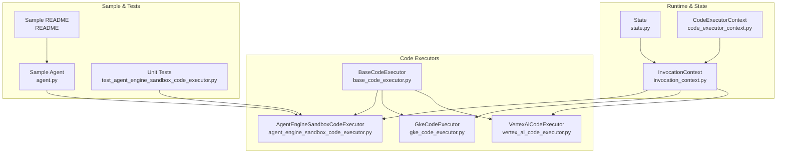
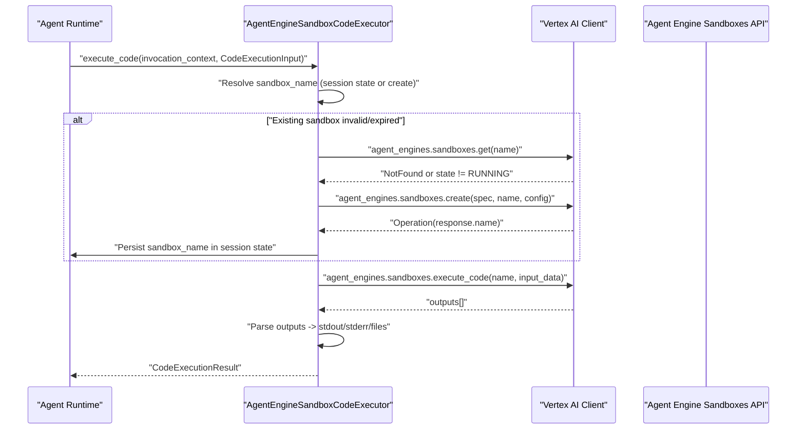
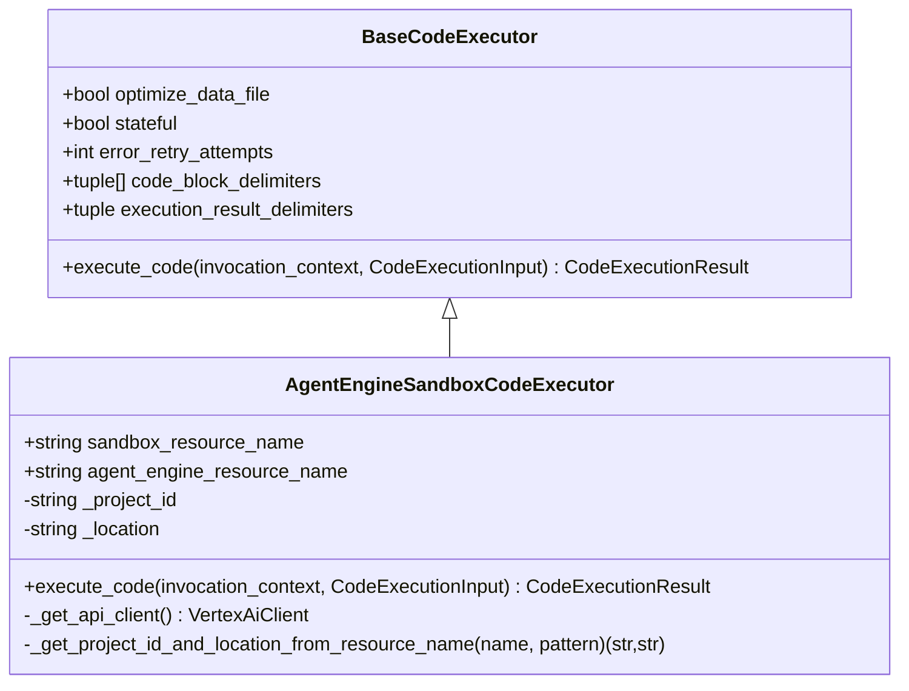
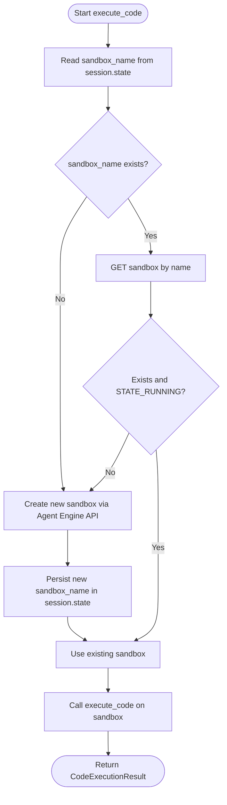
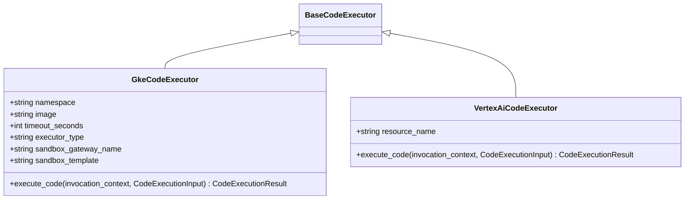
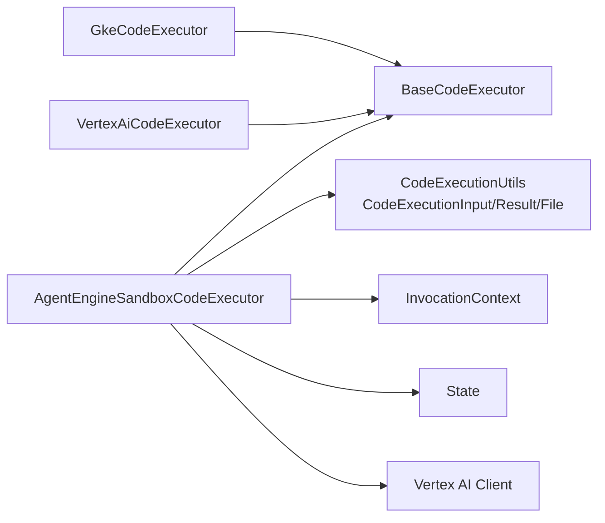

# Agent Engine Sandbox Execution

<cite>
**Referenced Files in This Document**
- [agent_engine_sandbox_code_executor.py](file://src/google/adk/code_executors/agent_engine_sandbox_code_executor.py)
- [base_code_executor.py](file://src/google/adk/code_executors/base_code_executor.py)
- [code_execution_utils.py](file://src/google/adk/code_executors/code_execution_utils.py)
- [code_executor_context.py](file://src/google/adk/code_executors/code_executor_context.py)
- [gke_code_executor.py](file://src/google/adk/code_executors/gke_code_executor.py)
- [vertex_ai_code_executor.py](file://src/google/adk/code_executors/vertex_ai_code_executor.py)
- [invocation_context.py](file://src/google/adk/agents/invocation_context.py)
- [state.py](file://src/google/adk/sessions/state.py)
- [README](file://contributing/samples/agent_engine_code_execution/README)
- [agent.py](file://contributing/samples/agent_engine_code_execution/agent.py)
- [test_agent_engine_sandbox_code_executor.py](file://tests/unittests/code_executors/test_agent_engine_sandbox_code_executor.py)
</cite>

## Table of Contents
1. [Introduction](#introduction)
2. [Project Structure](#project-structure)
3. [Core Components](#core-components)
4. [Architecture Overview](#architecture-overview)
5. [Detailed Component Analysis](#detailed-component-analysis)
6. [Dependency Analysis](#dependency-analysis)
7. [Performance Considerations](#performance-considerations)
8. [Troubleshooting Guide](#troubleshooting-guide)
9. [Conclusion](#conclusion)
10. [Appendices](#appendices)

## Introduction
This document explains the Agent Engine sandbox code execution implementation in the ADK. It focuses on how the Agent Engine Code Execution Sandbox is integrated into the Agent runtime, how the sandbox lifecycle is managed, and how execution results are returned. It also compares the Agent Engine sandbox approach with other secure execution modes (such as GKE sandboxed jobs and Vertex Code Interpreter) to help teams choose the right security posture and performance profile for their workloads.

## Project Structure
The Agent Engine sandbox execution is implemented as a specialized code executor that integrates with the Agent runtime and Vertex AI’s Agent Engine APIs. Supporting components include:
- Base executor interface and shared data structures
- Invocation context and session state for persistence
- Sample agent configuration and usage guidance
- Unit tests validating sandbox lifecycle and execution behavior

**Diagram sources**
- [agent_engine_sandbox_code_executor.py](file://src/google/adk/code_executors/agent_engine_sandbox_code_executor.py#L34-L222)
- [base_code_executor.py](file://src/google/adk/code_executors/base_code_executor.py#L27-L93)
- [gke_code_executor.py](file://src/google/adk/code_executors/gke_code_executor.py#L48-L430)
- [vertex_ai_code_executor.py](file://src/google/adk/code_executors/vertex_ai_code_executor.py#L107-L243)
- [invocation_context.py](file://src/google/adk/agents/invocation_context.py#L100-L418)
- [state.py](file://src/google/adk/sessions/state.py#L20-L82)
- [code_executor_context.py](file://src/google/adk/code_executors/code_executor_context.py#L37-L205)
- [agent.py](file://contributing/samples/agent_engine_code_execution/agent.py#L68-L95)
- [README](file://contributing/samples/agent_engine_code_execution/README#L1-L18)
- [test_agent_engine_sandbox_code_executor.py](file://tests/unittests/code_executors/test_agent_engine_sandbox_code_executor.py#L38-L251)

**Section sources**
- [agent_engine_sandbox_code_executor.py](file://src/google/adk/code_executors/agent_engine_sandbox_code_executor.py#L1-L222)
- [base_code_executor.py](file://src/google/adk/code_executors/base_code_executor.py#L1-L93)
- [code_execution_utils.py](file://src/google/adk/code_executors/code_execution_utils.py#L1-L264)
- [invocation_context.py](file://src/google/adk/agents/invocation_context.py#L1-L418)
- [state.py](file://src/google/adk/sessions/state.py#L1-L82)
- [code_executor_context.py](file://src/google/adk/code_executors/code_executor_context.py#L1-L205)
- [gke_code_executor.py](file://src/google/adk/code_executors/gke_code_executor.py#L1-L430)
- [vertex_ai_code_executor.py](file://src/google/adk/code_executors/vertex_ai_code_executor.py#L1-L243)
- [agent.py](file://contributing/samples/agent_engine_code_execution/agent.py#L1-L95)
- [README](file://contributing/samples/agent_engine_code_execution/README#L1-L18)
- [test_agent_engine_sandbox_code_executor.py](file://tests/unittests/code_executors/test_agent_engine_sandbox_code_executor.py#L1-L251)

## Core Components
- AgentEngineSandboxCodeExecutor: Implements sandbox-backed code execution against Agent Engine’s sandbox environment. It manages sandbox selection or creation, prepares execution inputs, and parses outputs.
- BaseCodeExecutor: Defines the common interface and configuration for all code executors (e.g., delimiters, retry behavior).
- CodeExecutionInput/CodeExecutionResult/File: Shared data structures for code payloads, input files, and execution results.
- InvocationContext: Provides runtime context for an agent invocation, including session state used to persist sandbox identifiers.
- State: Encapsulates session state with delta updates for persistence.
- CodeExecutorContext: Manages code-executor-specific context persisted in session state (e.g., input files, error counts).
- GkeCodeExecutor: Alternative secure execution mode using GKE with sandboxed pods or ephemeral jobs.
- VertexAiCodeExecutor: Uses Vertex Code Interpreter Extension for code execution.

Key responsibilities:
- Sandbox lifecycle: Resolve or create a sandbox per session or per request.
- Input assembly: Build the payload for code execution, including optional input files.
- Output parsing: Extract stdout/stderr and saved artifacts from sandbox outputs.
- Persistence: Store sandbox resource names in session state for reuse.

**Section sources**
- [agent_engine_sandbox_code_executor.py](file://src/google/adk/code_executors/agent_engine_sandbox_code_executor.py#L34-L197)
- [base_code_executor.py](file://src/google/adk/code_executors/base_code_executor.py#L27-L93)
- [code_execution_utils.py](file://src/google/adk/code_executors/code_execution_utils.py#L30-L88)
- [invocation_context.py](file://src/google/adk/agents/invocation_context.py#L100-L223)
- [state.py](file://src/google/adk/sessions/state.py#L20-L82)
- [code_executor_context.py](file://src/google/adk/code_executors/code_executor_context.py#L37-L205)
- [gke_code_executor.py](file://src/google/adk/code_executors/gke_code_executor.py#L48-L430)
- [vertex_ai_code_executor.py](file://src/google/adk/code_executors/vertex_ai_code_executor.py#L107-L243)

## Architecture Overview
The Agent Engine sandbox execution follows a controlled flow:
- Initialization validates resource names and extracts project/location.
- On execution, the executor resolves a sandbox name from session state or creates a new sandbox via Vertex AI APIs.
- The executor sends code and optional files to the sandbox’s execute endpoint.
- Outputs are parsed into stdout/stderr and saved artifacts.
- The sandbox resource name is persisted in session state for reuse.

**Diagram sources**
- [agent_engine_sandbox_code_executor.py](file://src/google/adk/code_executors/agent_engine_sandbox_code_executor.py#L94-L197)
- [invocation_context.py](file://src/google/adk/agents/invocation_context.py#L167-L168)
- [state.py](file://src/google/adk/sessions/state.py#L20-L82)

## Detailed Component Analysis

### AgentEngineSandboxCodeExecutor
- Purpose: Execute code within an Agent Engine Code Execution Sandbox and return structured results.
- Sandbox resolution:
  - If a sandbox resource name is provided, use it.
  - Else, resolve from session state; if absent or invalid/expired, create a new sandbox using the Agent Engine resource name.
- Input assembly:
  - Attach code and optional input files with MIME types.
- Output parsing:
  - JSON outputs without file metadata are treated as stdout/stderr.
  - Other outputs are collected as saved artifacts with inferred or provided MIME types.
- Client initialization:
  - Vertex AI client is created per request to propagate event loop context.

**Diagram sources**
- [base_code_executor.py](file://src/google/adk/code_executors/base_code_executor.py#L27-L93)
- [agent_engine_sandbox_code_executor.py](file://src/google/adk/code_executors/agent_engine_sandbox_code_executor.py#L34-L222)

**Section sources**
- [agent_engine_sandbox_code_executor.py](file://src/google/adk/code_executors/agent_engine_sandbox_code_executor.py#L50-L197)

### Sandbox Lifecycle and Session State
- Sandbox name persistence:
  - The executor reads/writes the sandbox name in the session state dictionary.
  - This enables reuse across steps within a session and avoids repeated sandbox creation overhead.
- TTL and expiration:
  - The sample README documents TTL behavior for sandbox environments and session services.
- Validation:
  - Resource name patterns are validated during initialization.

**Diagram sources**
- [agent_engine_sandbox_code_executor.py](file://src/google/adk/code_executors/agent_engine_sandbox_code_executor.py#L100-L137)
- [state.py](file://src/google/adk/sessions/state.py#L20-L82)
- [README](file://contributing/samples/agent_engine_code_execution/README#L10-L12)

**Section sources**
- [agent_engine_sandbox_code_executor.py](file://src/google/adk/code_executors/agent_engine_sandbox_code_executor.py#L100-L137)
- [state.py](file://src/google/adk/sessions/state.py#L20-L82)
- [README](file://contributing/samples/agent_engine_code_execution/README#L10-L12)

### Output Parsing and Artifacts
- JSON outputs without file metadata are interpreted as stdout/stderr.
- Non-JSON outputs are treated as saved artifacts; MIME types are inferred if unspecified.
- The executor constructs File objects for each artifact and returns them alongside stdout/stderr.

**Section sources**
- [agent_engine_sandbox_code_executor.py](file://src/google/adk/code_executors/agent_engine_sandbox_code_executor.py#L163-L197)
- [code_execution_utils.py](file://src/google/adk/code_executors/code_execution_utils.py#L30-L88)

### Comparison with Other Execution Modes
- GKE sandboxed execution:
  - Supports “job” and “sandbox” modes.
  - Uses Kubernetes Jobs with strict security contexts and resource limits.
  - Optionally uses gVisor runtime and an Agent Sandbox Client.
- Vertex Code Interpreter Extension:
  - Executes code via a Vertex extension with preloaded libraries and supported file types.

**Diagram sources**
- [gke_code_executor.py](file://src/google/adk/code_executors/gke_code_executor.py#L48-L430)
- [vertex_ai_code_executor.py](file://src/google/adk/code_executors/vertex_ai_code_executor.py#L107-L243)
- [base_code_executor.py](file://src/google/adk/code_executors/base_code_executor.py#L27-L93)

**Section sources**
- [gke_code_executor.py](file://src/google/adk/code_executors/gke_code_executor.py#L48-L430)
- [vertex_ai_code_executor.py](file://src/google/adk/code_executors/vertex_ai_code_executor.py#L107-L243)

### Integration with Agent Runtime and Invocation Context
- The executor receives InvocationContext, which includes the Session containing state for sandbox name persistence.
- The executor logs debug information and returns structured results suitable for agent consumption.

**Section sources**
- [agent_engine_sandbox_code_executor.py](file://src/google/adk/code_executors/agent_engine_sandbox_code_executor.py#L94-L158)
- [invocation_context.py](file://src/google/adk/agents/invocation_context.py#L167-L168)

### Practical Examples and Usage
- Sample agent configuration demonstrates initializing the AgentEngineSandboxCodeExecutor with either a pre-existing sandbox or an Agent Engine resource name.
- The sample README explains TTL behavior and recommended usage patterns for production vs. testing.

**Section sources**
- [agent.py](file://contributing/samples/agent_engine_code_execution/agent.py#L68-L95)
- [README](file://contributing/samples/agent_engine_code_execution/README#L10-L12)

## Dependency Analysis
- Internal dependencies:
  - AgentEngineSandboxCodeExecutor depends on BaseCodeExecutor, CodeExecutionInput/Result/File, InvocationContext, and State.
  - It uses Vertex AI client APIs for sandbox management and execution.
- External dependencies:
  - Vertex AI SDK for sandbox operations.
  - Optional: GKE client libraries and Agent Sandbox Client for GKE-based sandboxes.

**Diagram sources**
- [agent_engine_sandbox_code_executor.py](file://src/google/adk/code_executors/agent_engine_sandbox_code_executor.py#L25-L29)
- [base_code_executor.py](file://src/google/adk/code_executors/base_code_executor.py#L22-L24)
- [code_execution_utils.py](file://src/google/adk/code_executors/code_execution_utils.py#L30-L88)
- [invocation_context.py](file://src/google/adk/agents/invocation_context.py#L167-L168)
- [state.py](file://src/google/adk/sessions/state.py#L20-L82)
- [gke_code_executor.py](file://src/google/adk/code_executors/gke_code_executor.py#L27-L30)
- [vertex_ai_code_executor.py](file://src/google/adk/code_executors/vertex_ai_code_executor.py#L25-L29)

**Section sources**
- [agent_engine_sandbox_code_executor.py](file://src/google/adk/code_executors/agent_engine_sandbox_code_executor.py#L25-L29)
- [base_code_executor.py](file://src/google/adk/code_executors/base_code_executor.py#L22-L24)
- [code_execution_utils.py](file://src/google/adk/code_executors/code_execution_utils.py#L30-L88)
- [invocation_context.py](file://src/google/adk/agents/invocation_context.py#L167-L168)
- [state.py](file://src/google/adk/sessions/state.py#L20-L82)
- [gke_code_executor.py](file://src/google/adk/code_executors/gke_code_executor.py#L27-L30)
- [vertex_ai_code_executor.py](file://src/google/adk/code_executors/vertex_ai_code_executor.py#L25-L29)

## Performance Considerations
- Sandbox reuse:
  - Persisting the sandbox name in session state reduces cold-start latency across agent steps.
- TTL and lifecycle:
  - Long-lived sessions benefit from sandbox reuse; short-lived sessions may prefer ephemeral sandboxes.
- Output parsing:
  - Minimizing large binary artifacts and focusing on text outputs can reduce parsing overhead.
- Comparison with GKE:
  - GKE-based execution offers strong isolation via Kubernetes and optional gVisor runtime, with configurable resource limits and ephemeral jobs for hard expiry.

[No sources needed since this section provides general guidance]

## Troubleshooting Guide
Common issues and resolutions:
- Invalid resource names:
  - Ensure sandbox or Agent Engine resource names match expected patterns; the executor raises errors for malformed names.
- Sandbox not found or expired:
  - The executor recreates the sandbox when the existing one is missing or not running.
- Missing sandbox name in session state:
  - Initialize with an Agent Engine resource name to allow sandbox creation; the executor persists the new sandbox name.
- Output artifacts not appearing:
  - Verify MIME types and metadata attributes; outputs without file metadata are treated as stdout/stderr.

Validation and behavior are covered by unit tests:
- Initialization with valid/invalid resource names.
- Successful execution and artifact parsing.
- Sandbox recreation when the stored sandbox is missing/expired.
- Sandbox creation when none is present.

**Section sources**
- [agent_engine_sandbox_code_executor.py](file://src/google/adk/code_executors/agent_engine_sandbox_code_executor.py#L74-L92)
- [test_agent_engine_sandbox_code_executor.py](file://tests/unittests/code_executors/test_agent_engine_sandbox_code_executor.py#L41-L64)
- [test_agent_engine_sandbox_code_executor.py](file://tests/unittests/code_executors/test_agent_engine_sandbox_code_executor.py#L67-L125)
- [test_agent_engine_sandbox_code_executor.py](file://tests/unittests/code_executors/test_agent_engine_sandbox_code_executor.py#L128-L190)
- [test_agent_engine_sandbox_code_executor.py](file://tests/unittests/code_executors/test_agent_engine_sandbox_code_executor.py#L193-L251)

## Conclusion
The Agent Engine sandbox code execution provides a managed, scalable way to run LLM-generated code securely within Agent Engine environments. By leveraging sandbox persistence, structured input/output handling, and robust lifecycle management, teams can achieve reliable, repeatable code execution with clear isolation boundaries. For environments requiring stronger container-level isolation or specialized runtimes, GKE-based sandboxes offer complementary options with granular resource controls and optional gVisor support.

[No sources needed since this section summarizes without analyzing specific files]

## Appendices

### Security Model and Compliance Notes
- Agent Engine sandbox:
  - Managed environment with sandbox isolation; TTL and state semantics are defined by the platform.
  - Suitable for production-grade code execution with reduced operational overhead.
- GKE sandbox:
  - Strong isolation via Kubernetes, strict security contexts, and optional gVisor runtime.
  - Requires RBAC and infrastructure for sandbox templates and gateways.
- Vertex Code Interpreter:
  - Preconfigured environment with predefined libraries and supported file types.

**Section sources**
- [gke_code_executor.py](file://src/google/adk/code_executors/gke_code_executor.py#L48-L90)
- [vertex_ai_code_executor.py](file://src/google/adk/code_executors/vertex_ai_code_executor.py#L107-L121)

### Configuration Options
- AgentEngineSandboxCodeExecutor:
  - sandbox_resource_name: Use an existing sandbox.
  - agent_engine_resource_name: Create a sandbox under this Agent Engine instance.
- GkeCodeExecutor:
  - namespace, image, timeout_seconds, executor_type, sandbox_gateway_name, sandbox_template, and resource limits.
- VertexAiCodeExecutor:
  - resource_name: Use an existing Code Interpreter Extension.

**Section sources**
- [agent_engine_sandbox_code_executor.py](file://src/google/adk/code_executors/agent_engine_sandbox_code_executor.py#L50-L87)
- [gke_code_executor.py](file://src/google/adk/code_executors/gke_code_executor.py#L92-L108)
- [vertex_ai_code_executor.py](file://src/google/adk/code_executors/vertex_ai_code_executor.py#L123-L142)

### Best Practices
- Prefer sandbox reuse for long-running sessions to minimize latency.
- Limit artifact sizes and types to reduce parsing overhead.
- Monitor sandbox TTL and recreate when necessary.
- For high isolation, consider GKE-based sandboxes with gVisor and strict resource limits.

[No sources needed since this section provides general guidance]