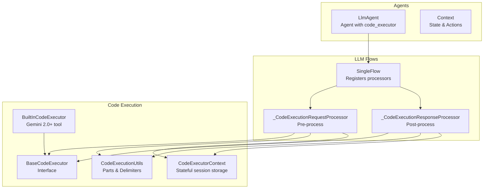
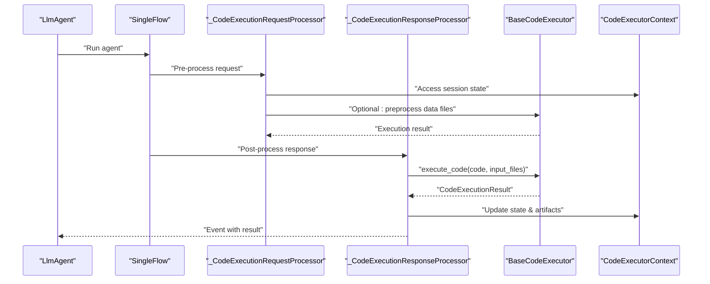
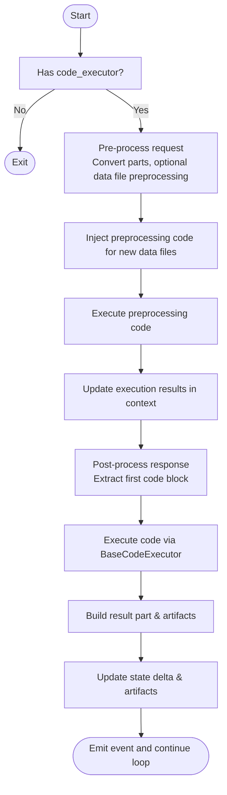
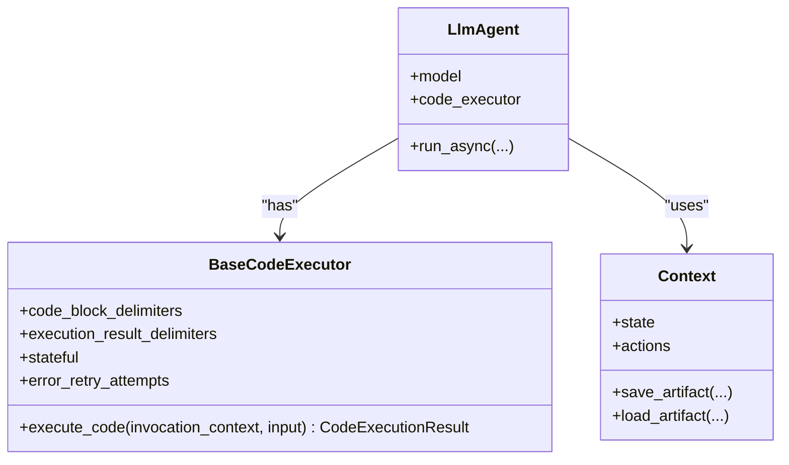
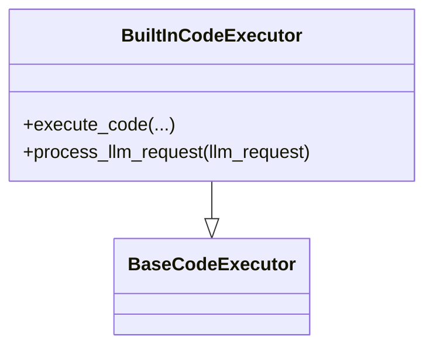
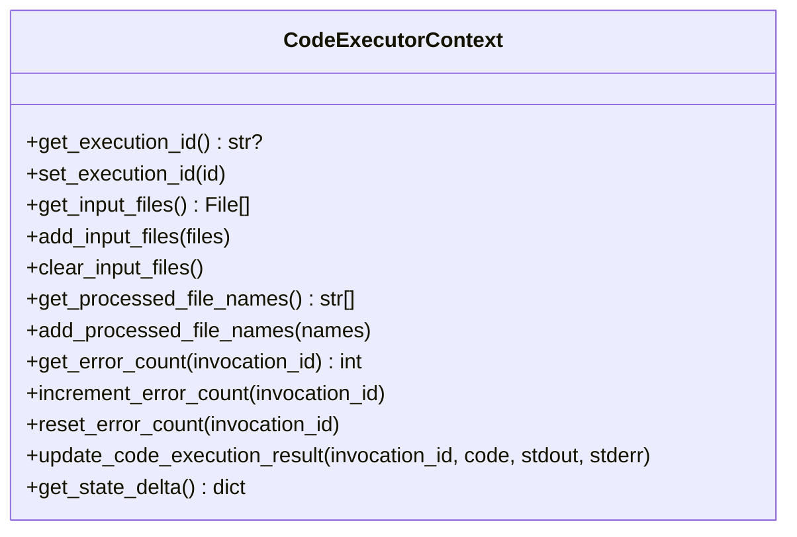
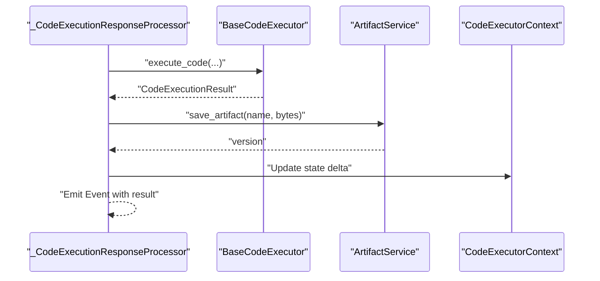
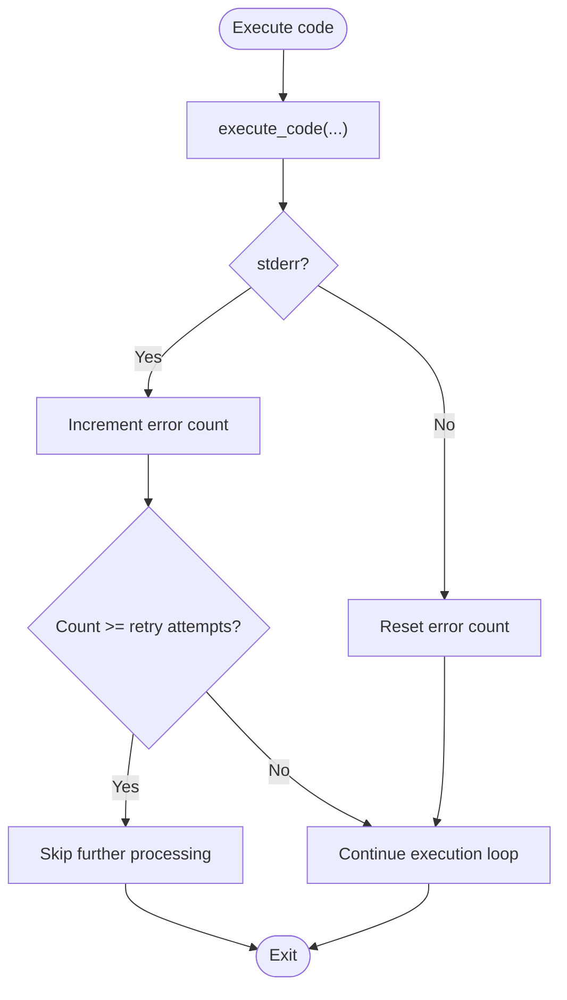
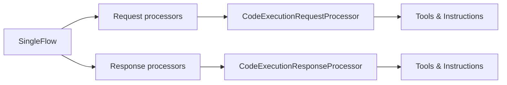
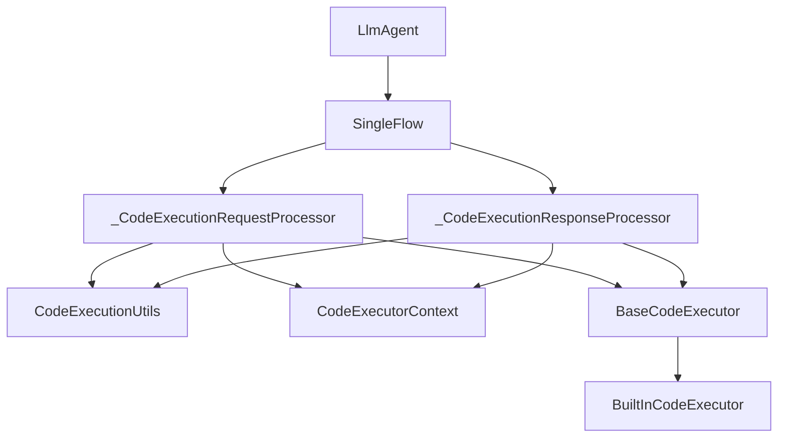

# Agent-Code Execution Integration

<cite>
**Referenced Files in This Document**
- [base_code_executor.py](file://src/google/adk/code_executors/base_code_executor.py)
- [code_execution_utils.py](file://src/google/adk/code_executors/code_execution_utils.py)
- [code_executor_context.py](file://src/google/adk/code_executors/code_executor_context.py)
- [_code_execution.py](file://src/google/adk/flows/llm_flows/_code_execution.py)
- [single_flow.py](file://src/google/adk/flows/llm_flows/single_flow.py)
- [llm_agent.py](file://src/google/adk/agents/llm_agent.py)
- [context.py](file://src/google/adk/agents/context.py)
- [built_in_code_executor.py](file://src/google/adk/code_executors/built_in_code_executor.py)
- [agent.py](file://contributing/samples/agent_engine_code_execution/agent.py)
- [agent.py](file://contributing/samples/vertex_code_execution/agent.py)
- [test_code_execution.py](file://tests/unittests/flows/llm_flows/test_code_execution.py)
- [test_functions_simple.py](file://tests/unittests/flows/llm_flows/test_functions_simple.py)
</cite>

## Table of Contents
1. [Introduction](#introduction)
2. [Project Structure](#project-structure)
3. [Core Components](#core-components)
4. [Architecture Overview](#architecture-overview)
5. [Detailed Component Analysis](#detailed-component-analysis)
6. [Dependency Analysis](#dependency-analysis)
7. [Performance Considerations](#performance-considerations)
8. [Troubleshooting Guide](#troubleshooting-guide)
9. [Conclusion](#conclusion)
10. [Appendices](#appendices)

## Introduction
This document explains how agents trigger code execution, manage execution contexts, and handle results within the ADK framework. It covers the code execution flow inside agent processing, how results are incorporated into agent responses, error handling strategies, integration with LLM flows and tool calling, agent state management, coordination between multiple agents, execution result caching, and performance optimization. Practical examples, debugging tips, and best practices are included to help developers integrate agent-code execution effectively.

## Project Structure
ADK integrates code execution into agent workflows through dedicated code executors, LLM flow processors, and agent context/state management. The key areas are:
- Code executors define execution environments and APIs for running code.
- LLM flow processors orchestrate pre- and post-processing around model responses to detect and execute code.
- Agent context and state capture execution metadata and artifacts.
- Sample agents demonstrate real-world configurations for Vertex AI and Agent Engine sandboxes.

**Diagram sources**
- [llm_agent.py](file://src/google/adk/agents/llm_agent.py#L187-L200)
- [single_flow.py](file://src/google/adk/flows/llm_flows/single_flow.py#L78-L89)
- [_code_execution.py](file://src/google/adk/flows/llm_flows/_code_execution.py#L117-L169)
- [base_code_executor.py](file://src/google/adk/code_executors/base_code_executor.py#L27-L92)
- [code_execution_utils.py](file://src/google/adk/code_executors/code_execution_utils.py#L90-L264)
- [code_executor_context.py](file://src/google/adk/code_executors/code_executor_context.py#L37-L205)
- [built_in_code_executor.py](file://src/google/adk/code_executors/built_in_code_executor.py#L29-L58)

**Section sources**
- [llm_agent.py](file://src/google/adk/agents/llm_agent.py#L187-L200)
- [single_flow.py](file://src/google/adk/flows/llm_flows/single_flow.py#L78-L89)
- [base_code_executor.py](file://src/google/adk/code_executors/base_code_executor.py#L27-L92)
- [code_execution_utils.py](file://src/google/adk/code_executors/code_execution_utils.py#L90-L264)
- [code_executor_context.py](file://src/google/adk/code_executors/code_executor_context.py#L37-L205)
- [built_in_code_executor.py](file://src/google/adk/code_executors/built_in_code_executor.py#L29-L58)

## Core Components
- BaseCodeExecutor: Defines the interface for executing code blocks, including delimiters, stateful behavior, and retry configuration.
- CodeExecutionUtils: Provides helpers to extract code from model responses, convert code parts to text, and build result parts.
- CodeExecutorContext: Manages persistent state for code execution across turns, including execution IDs, input files, processed file names, and execution results.
- LLM Flow Code Execution Processor: Hooks into request and response processing to detect, execute, and incorporate code execution results.
- LlmAgent: Holds the agent’s code_executor and integrates with flows to enable code execution.
- Context: Exposes state and actions to record artifacts and manage agent-side state during execution.

Key responsibilities:
- Detect code blocks in model responses and request content.
- Prepare execution inputs (code, input files) and execute via the configured executor.
- Record execution results and artifacts, and update agent state.
- Handle retries and error counts per invocation.

**Section sources**
- [base_code_executor.py](file://src/google/adk/code_executors/base_code_executor.py#L27-L92)
- [code_execution_utils.py](file://src/google/adk/code_executors/code_execution_utils.py#L90-L264)
- [code_executor_context.py](file://src/google/adk/code_executors/code_executor_context.py#L37-L205)
- [_code_execution.py](file://src/google/adk/flows/llm_flows/_code_execution.py#L117-L169)
- [llm_agent.py](file://src/google/adk/agents/llm_agent.py#L187-L200)
- [context.py](file://src/google/adk/agents/context.py#L41-L109)

## Architecture Overview
The agent-code execution pipeline is orchestrated by LLM flow processors that:
- Pre-process the request to convert code execution parts to text and optionally inject preprocessing code for data files.
- Post-process the response to extract the first code block, execute it, and emit events with results and artifacts.
- Manage stateful execution sessions and error retries.

**Diagram sources**
- [single_flow.py](file://src/google/adk/flows/llm_flows/single_flow.py#L78-L89)
- [_code_execution.py](file://src/google/adk/flows/llm_flows/_code_execution.py#L117-L169)
- [base_code_executor.py](file://src/google/adk/code_executors/base_code_executor.py#L77-L92)
- [code_executor_context.py](file://src/google/adk/code_executors/code_executor_context.py#L167-L191)

## Detailed Component Analysis

### Code Execution Flow in LLM Flows
The code execution flow is implemented as two processors:
- Request processor: Converts code execution parts to text and optionally injects preprocessing code for data files. It also manages data file extraction and initial exploration.
- Response processor: Extracts the first code block from the model response, executes it, emits events, and updates state and artifacts.

**Diagram sources**
- [_code_execution.py](file://src/google/adk/flows/llm_flows/_code_execution.py#L172-L372)
- [code_execution_utils.py](file://src/google/adk/code_executors/code_execution_utils.py#L113-L221)
- [code_executor_context.py](file://src/google/adk/code_executors/code_executor_context.py#L167-L191)

**Section sources**
- [_code_execution.py](file://src/google/adk/flows/llm_flows/_code_execution.py#L117-L169)
- [code_execution_utils.py](file://src/google/adk/code_executors/code_execution_utils.py#L113-L221)
- [code_executor_context.py](file://src/google/adk/code_executors/code_executor_context.py#L167-L191)

### Agent Integration and Tool Calling
- Agents expose a code_executor attribute. When present, the LLM flow processors activate code execution logic.
- Tool declarations and tool calling remain separate from code execution; however, agents can combine tools and code execution within the same flow.
- The agent’s context exposes state and artifact operations to persist execution outcomes.

**Diagram sources**
- [llm_agent.py](file://src/google/adk/agents/llm_agent.py#L187-L200)
- [base_code_executor.py](file://src/google/adk/code_executors/base_code_executor.py#L27-L92)
- [context.py](file://src/google/adk/agents/context.py#L41-L109)

**Section sources**
- [llm_agent.py](file://src/google/adk/agents/llm_agent.py#L187-L200)
- [context.py](file://src/google/adk/agents/context.py#L41-L109)

### Built-In Code Execution (Gemini 2.0+)
BuiltInCodeExecutor augments the LLM request with a code execution tool when supported by the model. It delegates execution to the model’s native capability.

**Diagram sources**
- [built_in_code_executor.py](file://src/google/adk/code_executors/built_in_code_executor.py#L29-L58)
- [base_code_executor.py](file://src/google/adk/code_executors/base_code_executor.py#L27-L92)

**Section sources**
- [built_in_code_executor.py](file://src/google/adk/code_executors/built_in_code_executor.py#L29-L58)

### Execution Context and State Management
CodeExecutorContext persists execution metadata across turns:
- Execution ID for stateful runs.
- Input files and processed file names.
- Execution results history with timestamps.
- State delta updates for persistence.

**Diagram sources**
- [code_executor_context.py](file://src/google/adk/code_executors/code_executor_context.py#L37-L205)

**Section sources**
- [code_executor_context.py](file://src/google/adk/code_executors/code_executor_context.py#L37-L205)

### Result Incorporation and Artifacts
Results are incorporated into the agent response by:
- Building a code execution result part from stdout/stderr and output files.
- Saving artifacts via the artifact service and recording version deltas in event actions.
- Emitting events that carry the result content and state/artifact updates.

**Diagram sources**
- [_code_execution.py](file://src/google/adk/flows/llm_flows/_code_execution.py#L435-L484)

**Section sources**
- [_code_execution.py](file://src/google/adk/flows/llm_flows/_code_execution.py#L435-L484)

### Error Handling and Retries
- Error counts are tracked per invocation ID and incremented on stderr.
- Retries are capped by error_retry_attempts configured on the executor.
- On success, error counts are reset.

**Diagram sources**
- [_code_execution.py](file://src/google/adk/flows/llm_flows/_code_execution.py#L456-L463)
- [base_code_executor.py](file://src/google/adk/code_executors/base_code_executor.py#L57-L58)

**Section sources**
- [_code_execution.py](file://src/google/adk/flows/llm_flows/_code_execution.py#L456-L463)
- [base_code_executor.py](file://src/google/adk/code_executors/base_code_executor.py#L57-L58)

### Integration with LLM Flows and Tool Calling
- SingleFlow registers code execution processors alongside other processors (contents, instructions, etc.).
- Tool declarations are handled separately; tools and code execution can coexist in the same flow.
- The agent’s tools remain independent of code execution, but both can be invoked during a single agent run.

**Diagram sources**
- [single_flow.py](file://src/google/adk/flows/llm_flows/single_flow.py#L38-L75)

**Section sources**
- [single_flow.py](file://src/google/adk/flows/llm_flows/single_flow.py#L38-L75)

### Multi-Agent Coordination and Execution Results
- Execution results are stored in session state via CodeExecutorContext, enabling subsequent agents to access prior results.
- Stateful executors can maintain continuity across agent boundaries by sharing execution IDs.
- Artifacts are persisted and versioned, allowing downstream agents to load and reuse them.

Practical example references:
- [agent.py](file://contributing/samples/agent_engine_code_execution/agent.py#L68-L95)
- [agent.py](file://contributing/samples/vertex_code_execution/agent.py#L80-L101)

**Section sources**
- [code_executor_context.py](file://src/google/adk/code_executors/code_executor_context.py#L167-L191)
- [agent.py](file://contributing/samples/agent_engine_code_execution/agent.py#L68-L95)
- [agent.py](file://contributing/samples/vertex_code_execution/agent.py#L80-L101)

## Dependency Analysis
The following diagram shows key dependencies among components involved in agent-code execution:

**Diagram sources**
- [llm_agent.py](file://src/google/adk/agents/llm_agent.py#L187-L200)
- [single_flow.py](file://src/google/adk/flows/llm_flows/single_flow.py#L78-L89)
- [_code_execution.py](file://src/google/adk/flows/llm_flows/_code_execution.py#L117-L169)
- [code_execution_utils.py](file://src/google/adk/code_executors/code_execution_utils.py#L90-L264)
- [code_executor_context.py](file://src/google/adk/code_executors/code_executor_context.py#L37-L205)
- [base_code_executor.py](file://src/google/adk/code_executors/base_code_executor.py#L27-L92)
- [built_in_code_executor.py](file://src/google/adk/code_executors/built_in_code_executor.py#L29-L58)

**Section sources**
- [llm_agent.py](file://src/google/adk/agents/llm_agent.py#L187-L200)
- [single_flow.py](file://src/google/adk/flows/llm_flows/single_flow.py#L78-L89)
- [_code_execution.py](file://src/google/adk/flows/llm_flows/_code_execution.py#L117-L169)
- [code_execution_utils.py](file://src/google/adk/code_executors/code_execution_utils.py#L90-L264)
- [code_executor_context.py](file://src/google/adk/code_executors/code_executor_context.py#L37-L205)
- [base_code_executor.py](file://src/google/adk/code_executors/base_code_executor.py#L27-L92)
- [built_in_code_executor.py](file://src/google/adk/code_executors/built_in_code_executor.py#L29-L58)

## Performance Considerations
- Parallel execution: Tests demonstrate concurrent execution of multiple functions, reducing total latency compared to sequential execution.
- Data file preprocessing: For stateful executors, preprocessing newly uploaded data files reduces repeated work and improves throughput.
- Artifact saving: Persisting outputs as artifacts avoids recomputation and enables downstream reuse.
- Retry limits: Configuring error_retry_attempts prevents infinite loops while still allowing transient failures to recover.

[No sources needed since this section provides general guidance]

## Troubleshooting Guide
Common issues and resolutions:
- Missing artifact service: Saving or loading artifacts raises an error if the service is not initialized. Ensure the artifact service is configured in the invocation context.
- Unsupported model for built-in code execution: BuiltInCodeExecutor validates model support and raises an error for unsupported models.
- Exceeded retry attempts: When stderr is present, error counts are incremented; once the threshold is reached, further processing is skipped.
- Data file handling: Inline data files are replaced with placeholders and cached; ensure MIME types are supported and filenames are normalized.

Relevant references:
- [context.py](file://src/google/adk/agents/context.py#L114-L164)
- [built_in_code_executor.py](file://src/google/adk/code_executors/built_in_code_executor.py#L54-L57)
- [_code_execution.py](file://src/google/adk/flows/llm_flows/_code_execution.py#L456-L463)
- [_code_execution.py](file://src/google/adk/flows/llm_flows/_code_execution.py#L374-L417)

**Section sources**
- [context.py](file://src/google/adk/agents/context.py#L114-L164)
- [built_in_code_executor.py](file://src/google/adk/code_executors/built_in_code_executor.py#L54-L57)
- [_code_execution.py](file://src/google/adk/flows/llm_flows/_code_execution.py#L456-L463)
- [_code_execution.py](file://src/google/adk/flows/llm_flows/_code_execution.py#L374-L417)

## Conclusion
ADK provides a robust, extensible framework for integrating code execution into agent workflows. By leveraging LLM flow processors, a unified code execution interface, and persistent execution contexts, agents can reliably detect, execute, and incorporate code results into their responses. Built-in and external executors offer flexibility, while stateful execution and artifact management enable multi-turn and multi-agent scenarios. Proper configuration of retry policies, data file handling, and artifact services ensures reliable and efficient agent-code integration.

[No sources needed since this section summarizes without analyzing specific files]

## Appendices

### Practical Examples
- Vertex AI Code Interpreter agent: Demonstrates configuring a Vertex AI code executor for agent-driven data analysis.
- Agent Engine Sandbox agent: Shows how to configure an Agent Engine sandbox-backed executor.

References:
- [agent.py](file://contributing/samples/vertex_code_execution/agent.py#L80-L101)
- [agent.py](file://contributing/samples/agent_engine_code_execution/agent.py#L68-L95)

**Section sources**
- [agent.py](file://contributing/samples/vertex_code_execution/agent.py#L80-L101)
- [agent.py](file://contributing/samples/agent_engine_code_execution/agent.py#L68-L95)

### Testing Patterns
- Code execution unit tests validate the end-to-end flow, including result incorporation and event emission.
- Parallel function execution tests verify concurrency behavior.

References:
- [test_code_execution.py](file://tests/unittests/flows/llm_flows/test_code_execution.py)
- [test_functions_simple.py](file://tests/unittests/flows/llm_flows/test_functions_simple.py#L727-L761)

**Section sources**
- [test_code_execution.py](file://tests/unittests/flows/llm_flows/test_code_execution.py)
- [test_functions_simple.py](file://tests/unittests/flows/llm_flows/test_functions_simple.py#L727-L761)