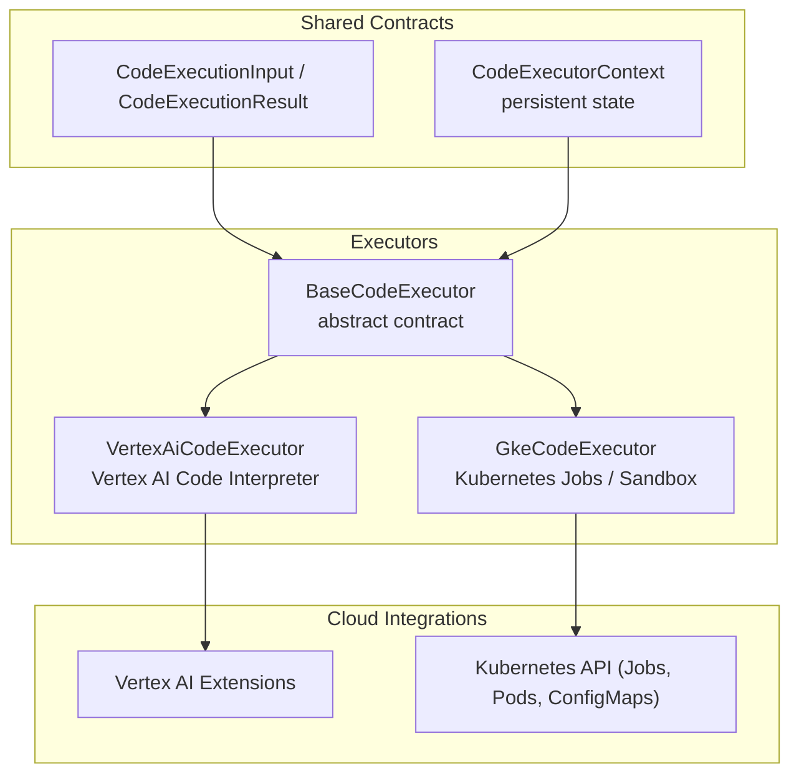
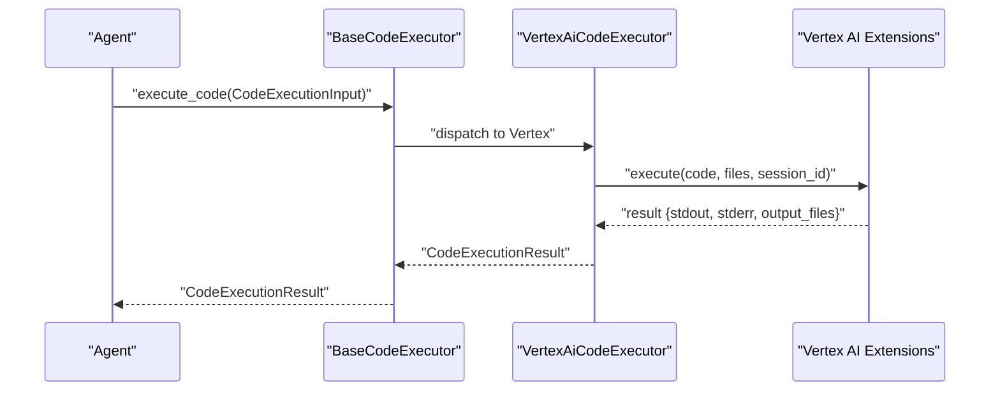
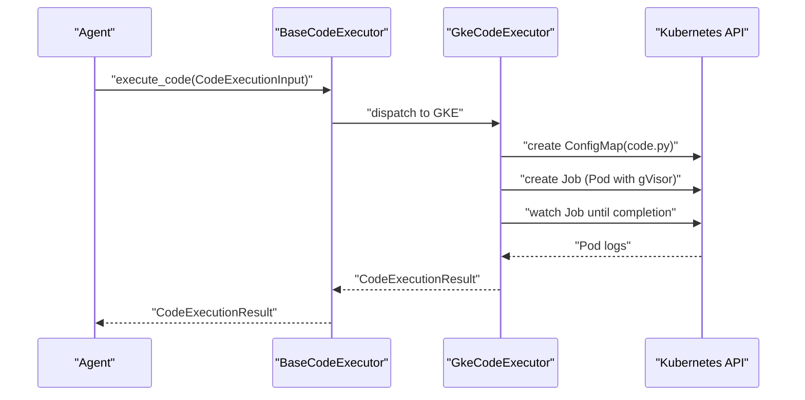
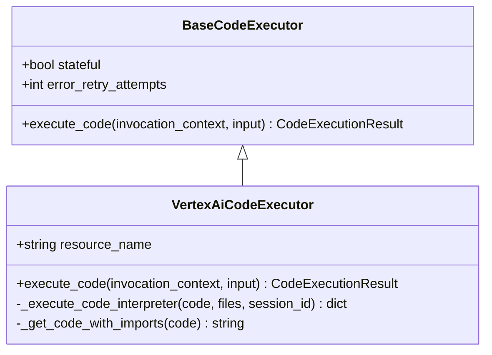
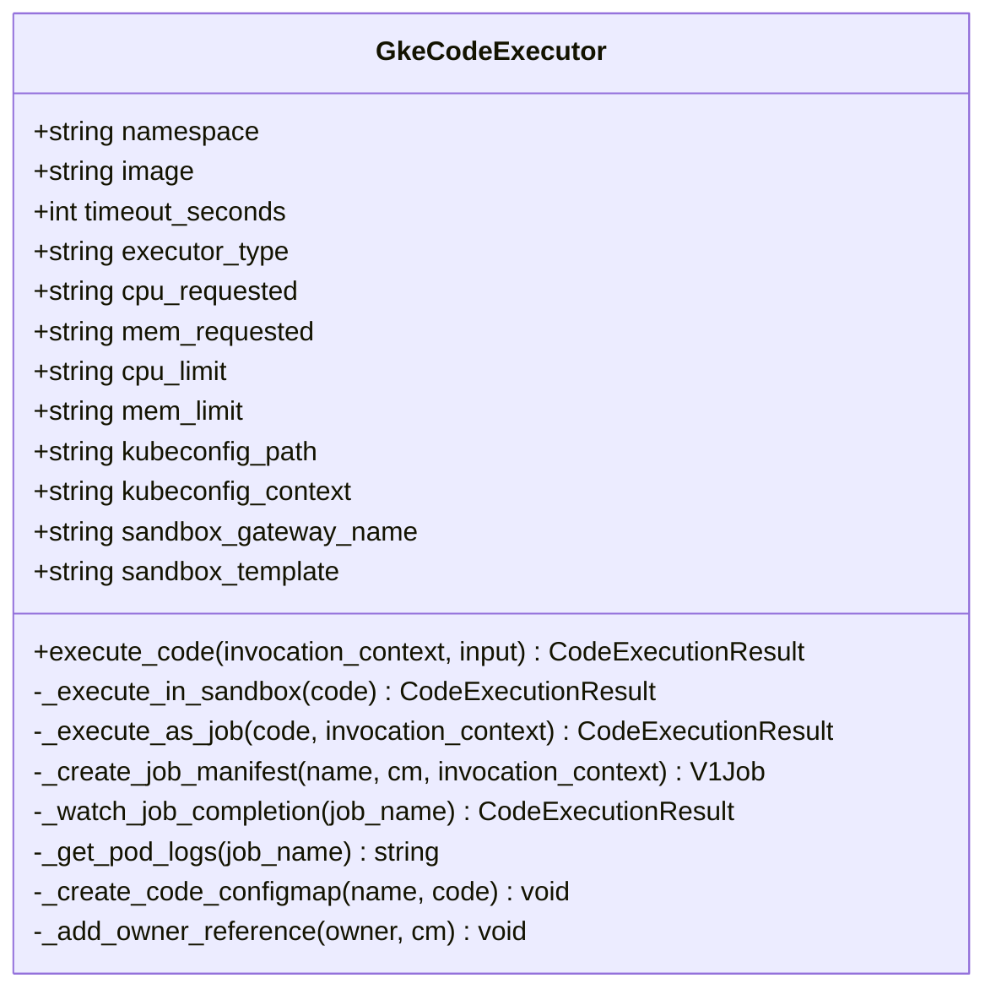
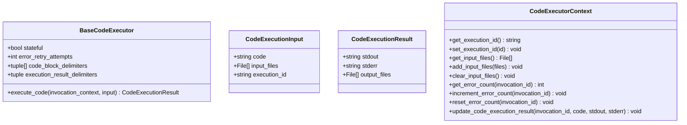
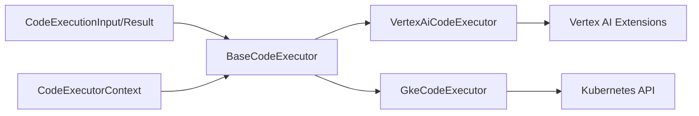
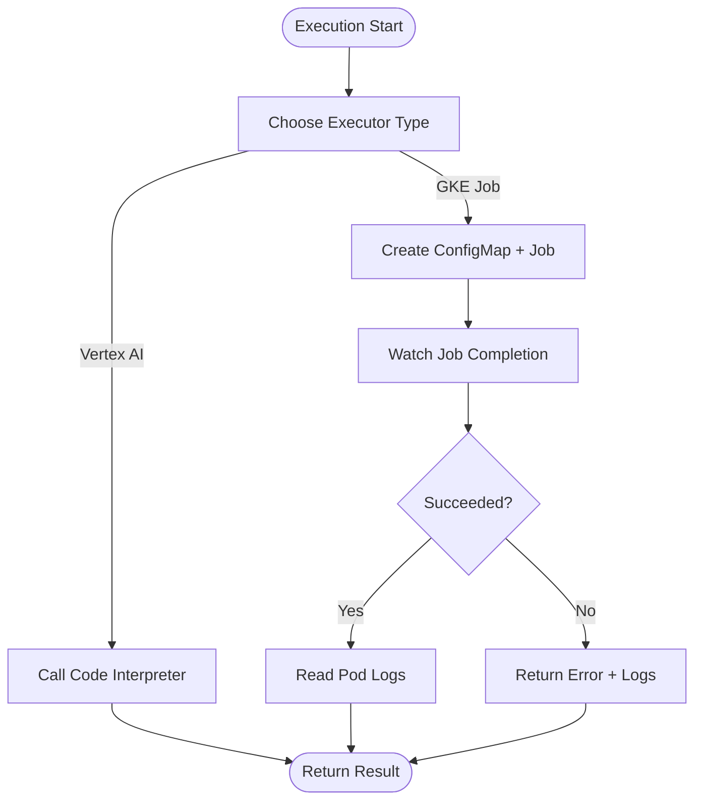

# Cloud Code Execution Environments

<cite>
**Referenced Files in This Document**
- [vertex_ai_code_executor.py](file://src/google/adk/code_executors/vertex_ai_code_executor.py)
- [gke_code_executor.py](file://src/google/adk/code_executors/gke_code_executor.py)
- [base_code_executor.py](file://src/google/adk/code_executors/base_code_executor.py)
- [code_execution_utils.py](file://src/google/adk/code_executors/code_execution_utils.py)
- [code_executor_context.py](file://src/google/adk/code_executors/code_executor_context.py)
- [__init__.py](file://src/google/adk/code_executors/__init__.py)
- [agent.py](file://contributing/samples/vertex_code_execution/agent.py)
- [gke_sandbox_agent.py](file://contributing/samples/code_execution/gke_sandbox_agent.py)
- [deployment_rbac.yaml](file://contributing/samples/gke_agent_sandbox/deployment_rbac.yaml)
- [test_gke_code_executor.py](file://tests/unittests/code_executors/test_gke_code_executor.py)
- [_code_execution.py](file://src/google/adk/flows/llm_flows/_code_execution.py)
- [logs.py](file://src/google/adk/cli/utils/logs.py)
- [cli_deploy.py](file://src/google/adk/cli/cli_deploy.py)
</cite>

## Table of Contents
1. [Introduction](#introduction)
2. [Project Structure](#project-structure)
3. [Core Components](#core-components)
4. [Architecture Overview](#architecture-overview)
5. [Detailed Component Analysis](#detailed-component-analysis)
6. [Dependency Analysis](#dependency-analysis)
7. [Performance Considerations](#performance-considerations)
8. [Troubleshooting Guide](#troubleshooting-guide)
9. [Conclusion](#conclusion)
10. [Appendices](#appendices)

## Introduction
This document explains cloud-based code execution environments in ADK with a focus on:
- Vertex AI Code Interpreter Extension for managed cloud execution
- GKE Code Executor for Kubernetes-native sandboxed execution

It covers cloud provider integration, resource provisioning, scaling, authentication and authorization, billing and cost considerations, deployment patterns, monitoring/logging, troubleshooting, and security/compliance/disaster recovery planning.

## Project Structure
The cloud code execution capability is implemented as pluggable executors layered on top of a shared execution contract. Executors integrate with cloud services and Kubernetes clusters to securely execute user-provided code.

**Diagram sources**
- [base_code_executor.py](file://src/google/adk/code_executors/base_code_executor.py#L27-L92)
- [vertex_ai_code_executor.py](file://src/google/adk/code_executors/vertex_ai_code_executor.py#L107-L143)
- [gke_code_executor.py](file://src/google/adk/code_executors/gke_code_executor.py#L48-L111)
- [code_execution_utils.py](file://src/google/adk/code_executors/code_execution_utils.py#L50-L88)
- [code_executor_context.py](file://src/google/adk/code_executors/code_executor_context.py#L37-L69)

**Section sources**
- [base_code_executor.py](file://src/google/adk/code_executors/base_code_executor.py#L27-L92)
- [code_execution_utils.py](file://src/google/adk/code_executors/code_execution_utils.py#L50-L88)
- [code_executor_context.py](file://src/google/adk/code_executors/code_executor_context.py#L37-L69)

## Core Components
- BaseCodeExecutor defines the execution contract and shared behaviors (stateful flag, retry policy, delimiters).
- VertexAiCodeExecutor integrates with Vertex AI Code Interpreter Extension to execute code in a managed, stateful environment with preinstalled libraries.
- GkeCodeExecutor orchestrates Kubernetes Jobs or an Agent Sandbox to execute code in a sandboxed Pod with strict security defaults and resource limits.

Key execution primitives:
- CodeExecutionInput: encapsulates code, optional input files, and execution session ID.
- CodeExecutionResult: captures stdout/stderr and produced output files.
- CodeExecutorContext: persists execution session ID, input files, processed file names, error counts, and execution history.

**Section sources**
- [base_code_executor.py](file://src/google/adk/code_executors/base_code_executor.py#L27-L92)
- [vertex_ai_code_executor.py](file://src/google/adk/code_executors/vertex_ai_code_executor.py#L107-L143)
- [gke_code_executor.py](file://src/google/adk/code_executors/gke_code_executor.py#L48-L111)
- [code_execution_utils.py](file://src/google/adk/code_executors/code_execution_utils.py#L50-L88)
- [code_execution_utils.py](file://src/google/adk/code_executors/code_execution_utils.py#L70-L88)
- [code_executor_context.py](file://src/google/adk/code_executors/code_executor_context.py#L37-L69)

## Architecture Overview
Two primary execution paths are supported:

- Managed cloud execution via Vertex AI Code Interpreter Extension
- Kubernetes-native sandboxed execution via GKE Jobs or Agent Sandbox

**Diagram sources**
- [base_code_executor.py](file://src/google/adk/code_executors/base_code_executor.py#L77-L92)
- [vertex_ai_code_executor.py](file://src/google/adk/code_executors/vertex_ai_code_executor.py#L144-L198)
- [code_execution_utils.py](file://src/google/adk/code_executors/code_execution_utils.py#L50-L88)

**Diagram sources**
- [base_code_executor.py](file://src/google/adk/code_executors/base_code_executor.py#L77-L92)
- [gke_code_executor.py](file://src/google/adk/code_executors/gke_code_executor.py#L204-L264)
- [gke_code_executor.py](file://src/google/adk/code_executors/gke_code_executor.py#L338-L366)
- [code_execution_utils.py](file://src/google/adk/code_executors/code_execution_utils.py#L50-L88)

## Detailed Component Analysis

### Vertex AI Code Executor
Managed cloud execution leveraging Vertex AI Code Interpreter Extension:
- Loads or creates a code interpreter extension resource (optionally from environment).
- Prepends built-in imports and executes code with optional input files.
- Supports stateful sessions via session_id propagation.
- Produces artifacts (images and CSV) as output files.

**Diagram sources**
- [base_code_executor.py](file://src/google/adk/code_executors/base_code_executor.py#L27-L92)
- [vertex_ai_code_executor.py](file://src/google/adk/code_executors/vertex_ai_code_executor.py#L107-L143)
- [vertex_ai_code_executor.py](file://src/google/adk/code_executors/vertex_ai_code_executor.py#L200-L227)

Operational highlights:
- Environment-driven resource selection and creation.
- Preloaded scientific libraries for data analysis.
- Artifact handling for images and tabular data.

Practical setup example:
- Sample agent wiring a VertexAiCodeExecutor is provided in the contributing samples.

**Section sources**
- [vertex_ai_code_executor.py](file://src/google/adk/code_executors/vertex_ai_code_executor.py#L88-L104)
- [vertex_ai_code_executor.py](file://src/google/adk/code_executors/vertex_ai_code_executor.py#L144-L198)
- [vertex_ai_code_executor.py](file://src/google/adk/code_executors/vertex_ai_code_executor.py#L200-L227)
- [agent.py](file://contributing/samples/vertex_code_execution/agent.py#L80-L101)

### GKE Code Executor
Kubernetes-native sandboxed execution supporting two modes:
- Job mode: ephemeral execution via Kubernetes Jobs with strict security defaults and gVisor runtime.
- Sandbox mode: Agent Sandbox integration requiring cluster-side infrastructure.

**Diagram sources**
- [gke_code_executor.py](file://src/google/adk/code_executors/gke_code_executor.py#L48-L111)
- [gke_code_executor.py](file://src/google/adk/code_executors/gke_code_executor.py#L177-L203)
- [gke_code_executor.py](file://src/google/adk/code_executors/gke_code_executor.py#L204-L264)
- [gke_code_executor.py](file://src/google/adk/code_executors/gke_code_executor.py#L265-L336)
- [gke_code_executor.py](file://src/google/adk/code_executors/gke_code_executor.py#L338-L392)
- [gke_code_executor.py](file://src/google/adk/code_executors/gke_code_executor.py#L393-L430)

Operational highlights:
- Authentication methods: explicit kubeconfig, in-cluster service account, or default local kubeconfig.
- Job orchestration: ConfigMap mounting, Job creation, owner reference for cleanup, TTL-based garbage collection.
- Watch-based completion detection and robust error handling.
- RBAC requirements for Jobs, ConfigMaps, and Pod logs.

Deployment and RBAC:
- Sample RBAC manifest for namespace, ServiceAccount, Role, and RoleBinding is provided.

**Section sources**
- [gke_code_executor.py](file://src/google/adk/code_executors/gke_code_executor.py#L112-L165)
- [gke_code_executor.py](file://src/google/adk/code_executors/gke_code_executor.py#L204-L264)
- [gke_code_executor.py](file://src/google/adk/code_executors/gke_code_executor.py#L265-L336)
- [gke_code_executor.py](file://src/google/adk/code_executors/gke_code_executor.py#L338-L392)
- [gke_code_executor.py](file://src/google/adk/code_executors/gke_code_executor.py#L393-L430)
- [deployment_rbac.yaml](file://contributing/samples/gke_agent_sandbox/deployment_rbac.yaml#L1-L51)
- [gke_sandbox_agent.py](file://contributing/samples/code_execution/gke_sandbox_agent.py#L32-L49)

### Execution Contract and Utilities
- BaseCodeExecutor defines the contract and shared configuration knobs.
- CodeExecutionInput/CodeExecutionResult standardize data exchange.
- CodeExecutorContext persists execution context across invocations.

**Diagram sources**
- [base_code_executor.py](file://src/google/adk/code_executors/base_code_executor.py#L27-L92)
- [code_execution_utils.py](file://src/google/adk/code_executors/code_execution_utils.py#L50-L88)
- [code_execution_utils.py](file://src/google/adk/code_executors/code_execution_utils.py#L70-L88)
- [code_executor_context.py](file://src/google/adk/code_executors/code_executor_context.py#L37-L69)
- [code_executor_context.py](file://src/google/adk/code_executors/code_executor_context.py#L98-L130)
- [code_executor_context.py](file://src/google/adk/code_executors/code_executor_context.py#L131-L166)
- [code_executor_context.py](file://src/google/adk/code_executors/code_executor_context.py#L167-L192)

**Section sources**
- [base_code_executor.py](file://src/google/adk/code_executors/base_code_executor.py#L27-L92)
- [code_execution_utils.py](file://src/google/adk/code_executors/code_execution_utils.py#L50-L88)
- [code_execution_utils.py](file://src/google/adk/code_executors/code_execution_utils.py#L70-L88)
- [code_executor_context.py](file://src/google/adk/code_executors/code_executor_context.py#L37-L69)
- [code_executor_context.py](file://src/google/adk/code_executors/code_executor_context.py#L98-L130)
- [code_executor_context.py](file://src/google/adk/code_executors/code_executor_context.py#L131-L166)
- [code_executor_context.py](file://src/google/adk/code_executors/code_executor_context.py#L167-L192)

## Dependency Analysis
- Executors depend on a shared execution contract and utilities.
- VertexAiCodeExecutor depends on Vertex AI Extensions.
- GkeCodeExecutor depends on Kubernetes client libraries and optional Agent Sandbox client.

**Diagram sources**
- [base_code_executor.py](file://src/google/adk/code_executors/base_code_executor.py#L27-L92)
- [vertex_ai_code_executor.py](file://src/google/adk/code_executors/vertex_ai_code_executor.py#L107-L143)
- [gke_code_executor.py](file://src/google/adk/code_executors/gke_code_executor.py#L48-L111)
- [code_execution_utils.py](file://src/google/adk/code_executors/code_execution_utils.py#L50-L88)
- [code_executor_context.py](file://src/google/adk/code_executors/code_executor_context.py#L37-L69)

**Section sources**
- [__init__.py](file://src/google/adk/code_executors/__init__.py#L38-L79)

## Performance Considerations
- Vertex AI Code Interpreter:
  - Stateful sessions reduce cold starts for iterative analysis.
  - Preinstalled libraries minimize download overhead.
- GKE Jobs:
  - Strict resource requests/limits prevent noisy-neighbor issues.
  - gVisor runtime adds sandboxing overhead; choose appropriate CPU/memory.
  - Watch-based completion avoids polling; tune timeout to balance responsiveness and cost.
  - TTL-based cleanup reduces long-lived resources.

[No sources needed since this section provides general guidance]

## Troubleshooting Guide
Common issues and diagnostics:
- Kubernetes API errors: surfaced as CodeExecutionResult with stderr; inspect reasons and logs.
- Job timeouts: logs are attached to stderr for diagnosis.
- Sandbox connectivity/timeouts: handled gracefully with informative messages.
- RBAC failures: ensure Roles/Bindings grant required verbs for jobs, configmaps, pods, and pods/log.

**Diagram sources**
- [gke_code_executor.py](file://src/google/adk/code_executors/gke_code_executor.py#L204-L264)
- [gke_code_executor.py](file://src/google/adk/code_executors/gke_code_executor.py#L338-L366)

**Section sources**
- [gke_code_executor.py](file://src/google/adk/code_executors/gke_code_executor.py#L230-L249)
- [gke_code_executor.py](file://src/google/adk/code_executors/gke_code_executor.py#L367-L392)
- [test_gke_code_executor.py](file://tests/unittests/code_executors/test_gke_code_executor.py#L180-L243)

## Conclusion
ADK provides two complementary cloud execution paths:
- Vertex AI Code Interpreter for managed, stateful, library-rich environments.
- GKE-based sandboxing for fine-grained control, RBAC, and Kubernetes-native workflows.

Both executors share a consistent contract, support persistent context, and integrate with monitoring/logging for observability.

[No sources needed since this section summarizes without analyzing specific files]

## Appendices

### Deployment Patterns and Configuration Management
- Vertex AI:
  - Configure environment for Vertex AI access; optionally pre-provision the code interpreter extension resource.
  - Reference the sample agent wiring a VertexAiCodeExecutor for end-to-end usage.
- GKE:
  - Deploy RBAC resources for the agent’s ServiceAccount and Role.
  - Choose Job or Sandbox mode based on infrastructure availability.
  - Tune resource requests/limits and timeouts according to workload characteristics.

**Section sources**
- [agent.py](file://contributing/samples/vertex_code_execution/agent.py#L80-L101)
- [deployment_rbac.yaml](file://contributing/samples/gke_agent_sandbox/deployment_rbac.yaml#L1-L51)
- [gke_sandbox_agent.py](file://contributing/samples/code_execution/gke_sandbox_agent.py#L32-L49)

### Monitoring and Logging
- Kubernetes:
  - Pod logs are captured and returned as stdout; failures include logs in stderr.
  - Watch API provides efficient completion signaling.
- Logging:
  - CLI utilities support capturing logs to files for offline analysis.

**Section sources**
- [gke_code_executor.py](file://src/google/adk/code_executors/gke_code_executor.py#L338-L366)
- [gke_code_executor.py](file://src/google/adk/code_executors/gke_code_executor.py#L367-L392)
- [logs.py](file://src/google/adk/cli/utils/logs.py#L83-L105)

### Security and Compliance
- Vertex AI:
  - Execution occurs in a managed environment; leverage Vertex AI IAM and VPC-SC where applicable.
- GKE:
  - Non-root, read-only root FS, no privilege escalation, and capability drops enforced.
  - gVisor runtime adds an additional sandboxing layer.
  - Minimal RBAC permissions required; follow least privilege.
  - Disaster recovery: ensure backups of ConfigMaps and persistent context as needed.

**Section sources**
- [gke_code_executor.py](file://src/google/adk/code_executors/gke_code_executor.py#L273-L336)
- [deployment_rbac.yaml](file://contributing/samples/gke_agent_sandbox/deployment_rbac.yaml#L12-L36)

### Billing and Cost Optimization
- Vertex AI:
  - Pay-per-execution for code interpreter operations; leverage stateful sessions to reduce repeated setup costs.
- GKE:
  - Right-size CPU/memory requests/limits to avoid over-provisioning.
  - Use short TTLs for completed Jobs/Pods to reduce idle resource costs.
  - Prefer Job mode for one-off executions; use Sandbox mode only when infrastructure is provisioned and justified.

[No sources needed since this section provides general guidance]

### Practical Examples
- Vertex AI agent:
  - See the sample agent wiring VertexAiCodeExecutor and system instructions.
- GKE agent:
  - See the sample agent wiring GkeCodeExecutor with namespace and timeout configuration.
  - Apply the RBAC manifest to provision required cluster resources.

**Section sources**
- [agent.py](file://contributing/samples/vertex_code_execution/agent.py#L80-L101)
- [gke_sandbox_agent.py](file://contributing/samples/code_execution/gke_sandbox_agent.py#L32-L49)
- [deployment_rbac.yaml](file://contributing/samples/gke_agent_sandbox/deployment_rbac.yaml#L1-L51)

### Cloud Provider Integration and Authentication
- Vertex AI:
  - Uses Vertex AI Extensions; environment configuration determines resource selection.
- GKE:
  - Supports kubeconfig path/context, in-cluster service account, or default local kubeconfig.
  - Requires RBAC permissions for Jobs, ConfigMaps, and Pod logs.

**Section sources**
- [vertex_ai_code_executor.py](file://src/google/adk/code_executors/vertex_ai_code_executor.py#L88-L104)
- [gke_code_executor.py](file://src/google/adk/code_executors/gke_code_executor.py#L112-L165)
- [deployment_rbac.yaml](file://contributing/samples/gke_agent_sandbox/deployment_rbac.yaml#L12-L36)

### Scaling Mechanisms
- Vertex AI:
  - Stateless and stateful modes; stateful sessions persist across invocations.
- GKE:
  - Horizontal scaling via multiple Jobs; resource quotas and limits govern per-execution footprint.
  - Consider cluster autoscaling and node pools tuned for sandbox workloads.

[No sources needed since this section provides general guidance]

### Authorization and Secrets
- Vertex AI:
  - Use Vertex AI IAM credentials; ensure service account has access to the code interpreter extension.
- GKE:
  - Use ServiceAccount bound to Role/RoleBinding with minimal required verbs.
  - Mount secrets/configs via Secrets/ConfigMaps as needed.

**Section sources**
- [deployment_rbac.yaml](file://contributing/samples/gke_agent_sandbox/deployment_rbac.yaml#L12-L36)

### End-to-End Execution Flow in ADK
- LLM flows coordinate code extraction, execution, and result formatting.

**Section sources**
- [_code_execution.py](file://src/google/adk/flows/llm_flows/_code_execution.py#L1-L39)

### Cloud Run Deployment Hooks
- CLI utilities demonstrate packaging and deployment of agents to Cloud Run, including optional services and storage configuration.

**Section sources**
- [cli_deploy.py](file://src/google/adk/cli/cli_deploy.py#L672-L702)