# Code Execution and Sandboxing

<cite>
**Referenced Files in This Document**
- [__init__.py](file://src/google/adk/code_executors/__init__.py)
- [base_code_executor.py](file://src/google/adk/code_executors/base_code_executor.py)
- [code_execution_utils.py](file://src/google/adk/code_executors/code_execution_utils.py)
- [code_executor_context.py](file://src/google/adk/code_executors/code_executor_context.py)
- [built_in_code_executor.py](file://src/google/adk/code_executors/built_in_code_executor.py)
- [unsafe_local_code_executor.py](file://src/google/adk/code_executors/unsafe_local_code_executor.py)
- [container_code_executor.py](file://src/google/adk/code_executors/container_code_executor.py)
- [gke_code_executor.py](file://src/google/adk/code_executors/gke_code_executor.py)
- [agent_engine_sandbox_code_executor.py](file://src/google/adk/code_executors/agent_engine_sandbox_code_executor.py)
- [vertex_ai_code_executor.py](file://src/google/adk/code_executors/vertex_ai_code_executor.py)
- [agent.py](file://contributing/samples/code_execution/agent.py)
- [gke_sandbox_agent.py](file://contributing/samples/code_execution/gke_sandbox_agent.py)
- [agent.py](file://contributing/samples/custom_code_execution/agent.py)
</cite>

## Table of Contents
1. [Introduction](#introduction)
2. [Project Structure](#project-structure)
3. [Core Components](#core-components)
4. [Architecture Overview](#architecture-overview)
5. [Detailed Component Analysis](#detailed-component-analysis)
6. [Dependency Analysis](#dependency-analysis)
7. [Performance Considerations](#performance-considerations)
8. [Troubleshooting Guide](#troubleshooting-guide)
9. [Conclusion](#conclusion)
10. [Appendices](#appendices)

## Introduction
This document explains the code execution and sandboxing architecture in ADK. It covers the execution environments (local, container-based, cloud-based), the security model for sandbox isolation, integration with agent workflows for dynamic code generation and execution, configuration and resource management, performance optimization, practical execution patterns, security considerations, troubleshooting procedures, and best practices for production deployments.

## Project Structure
The code execution subsystem is centered in the code_executors package. It defines a shared interface for all executors, common data structures for inputs and results, a persistent execution context, and multiple executor implementations for different environments. Example agents demonstrate how agents integrate with executors.

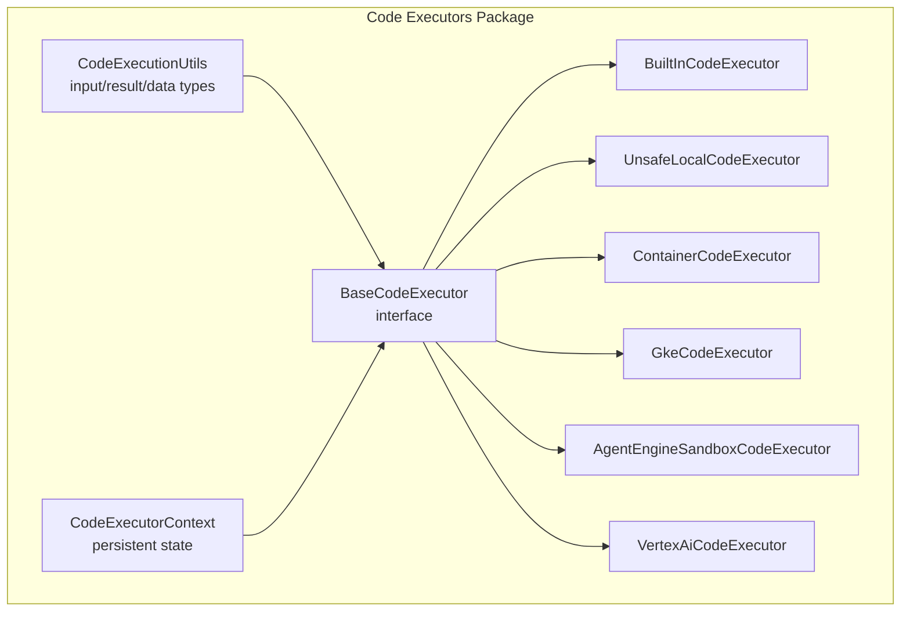

**Diagram sources**
- [base_code_executor.py](file://src/google/adk/code_executors/base_code_executor.py#L27-L92)
- [code_execution_utils.py](file://src/google/adk/code_executors/code_execution_utils.py#L50-L91)
- [code_executor_context.py](file://src/google/adk/code_executors/code_executor_context.py#L37-L204)
- [built_in_code_executor.py](file://src/google/adk/code_executors/built_in_code_executor.py#L29-L57)
- [unsafe_local_code_executor.py](file://src/google/adk/code_executors/unsafe_local_code_executor.py#L40-L85)
- [container_code_executor.py](file://src/google/adk/code_executors/container_code_executor.py#L37-L200)
- [gke_code_executor.py](file://src/google/adk/code_executors/gke_code_executor.py#L48-L429)
- [agent_engine_sandbox_code_executor.py](file://src/google/adk/code_executors/agent_engine_sandbox_code_executor.py#L34-L221)
- [vertex_ai_code_executor.py](file://src/google/adk/code_executors/vertex_ai_code_executor.py#L107-L242)

**Section sources**
- [__init__.py](file://src/google/adk/code_executors/__init__.py#L26-L80)
- [base_code_executor.py](file://src/google/adk/code_executors/base_code_executor.py#L27-L92)
- [code_execution_utils.py](file://src/google/adk/code_executors/code_execution_utils.py#L50-L264)
- [code_executor_context.py](file://src/google/adk/code_executors/code_executor_context.py#L37-L204)

## Core Components
- BaseCodeExecutor: Defines the common interface for all executors, including attributes for statefulness, retry behavior, code delimiters, and the execute_code contract.
- CodeExecutionInput/CodeExecutionResult/File: Typed structures for passing code, optional input files, and capturing stdout/stderr and produced artifacts.
- CodeExecutionUtils: Utility functions for extracting code from model responses, building executable parts, converting execution results to text, and encoding file content.
- CodeExecutorContext: Persistent session-backed context for execution IDs, input files, processed filenames, error counts, and execution history.

Key responsibilities:
- Normalize code extraction and formatting across different model outputs.
- Provide a uniform result format for agent workflows.
- Persist execution metadata to support stateful or repeatable executions.

**Section sources**
- [base_code_executor.py](file://src/google/adk/code_executors/base_code_executor.py#L27-L92)
- [code_execution_utils.py](file://src/google/adk/code_executors/code_execution_utils.py#L30-L264)
- [code_executor_context.py](file://src/google/adk/code_executors/code_executor_context.py#L37-L204)

## Architecture Overview
ADK integrates code execution into agent workflows by allowing agents to specify a code executor. Executors encapsulate environment-specific logic (local, container, cloud) while adhering to a shared interface. Results are returned as structured outputs that agents can incorporate into subsequent turns.

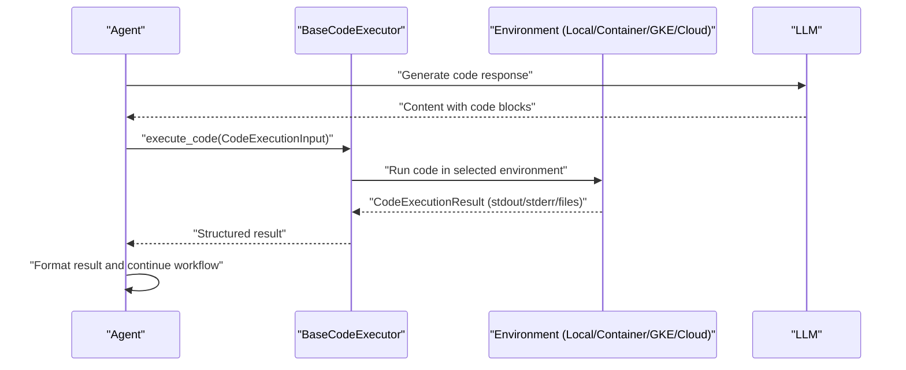

**Diagram sources**
- [base_code_executor.py](file://src/google/adk/code_executors/base_code_executor.py#L77-L92)
- [code_execution_utils.py](file://src/google/adk/code_executors/code_execution_utils.py#L113-L221)
- [built_in_code_executor.py](file://src/google/adk/code_executors/built_in_code_executor.py#L36-L57)
- [unsafe_local_code_executor.py](file://src/google/adk/code_executors/unsafe_local_code_executor.py#L60-L85)
- [container_code_executor.py](file://src/google/adk/code_executors/container_code_executor.py#L122-L150)
- [gke_code_executor.py](file://src/google/adk/code_executors/gke_code_executor.py#L251-L263)
- [agent_engine_sandbox_code_executor.py](file://src/google/adk/code_executors/agent_engine_sandbox_code_executor.py#L94-L197)
- [vertex_ai_code_executor.py](file://src/google/adk/code_executors/vertex_ai_code_executor.py#L144-L198)

## Detailed Component Analysis

### BaseCodeExecutor and Shared Utilities
- Interface and defaults: Provides stateful flag, retry attempts, code delimiters, and execution result delimiters.
- Contract: execute_code must accept InvocationContext and CodeExecutionInput and return CodeExecutionResult.
- Utilities: Extract code from model Content, build executable parts, convert results to text, encode file content.

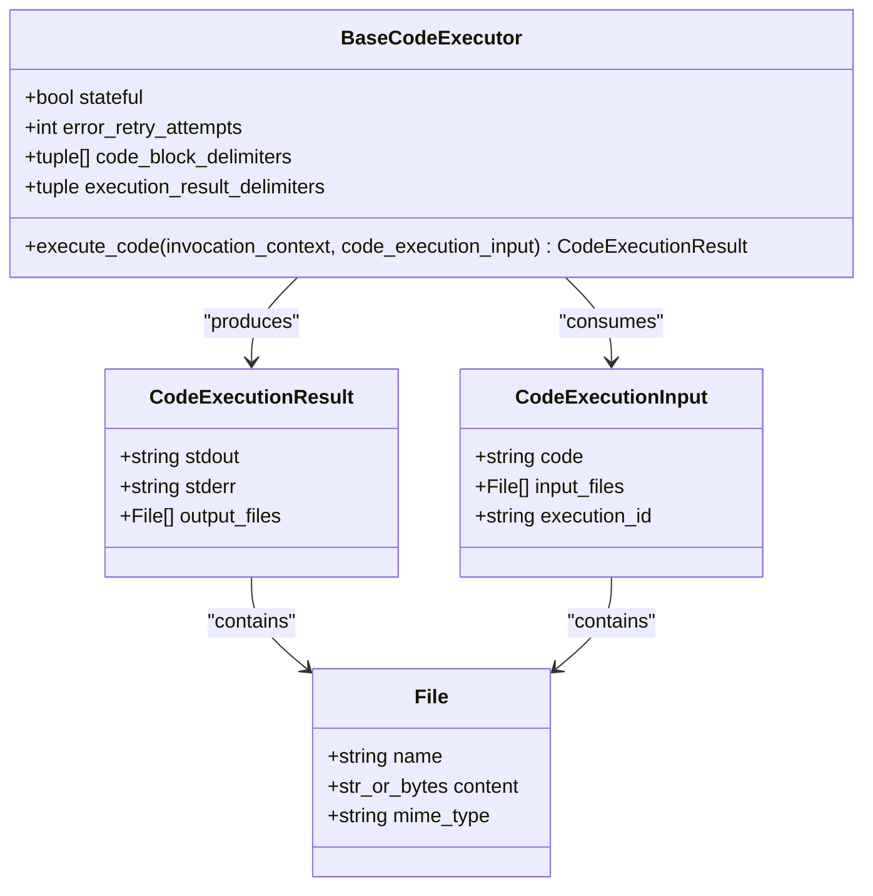

**Diagram sources**
- [base_code_executor.py](file://src/google/adk/code_executors/base_code_executor.py#L27-L92)
- [code_execution_utils.py](file://src/google/adk/code_executors/code_execution_utils.py#L30-L91)

**Section sources**
- [base_code_executor.py](file://src/google/adk/code_executors/base_code_executor.py#L27-L92)
- [code_execution_utils.py](file://src/google/adk/code_executors/code_execution_utils.py#L50-L264)

### Local Execution: UnsafeLocalCodeExecutor
- Purpose: Executes code in the current process with redirected stdout.
- Constraints: Not stateful; does not support data file optimization; raises errors if misconfigured.
- Security: No sandboxing; suitable only for trusted code in controlled environments.

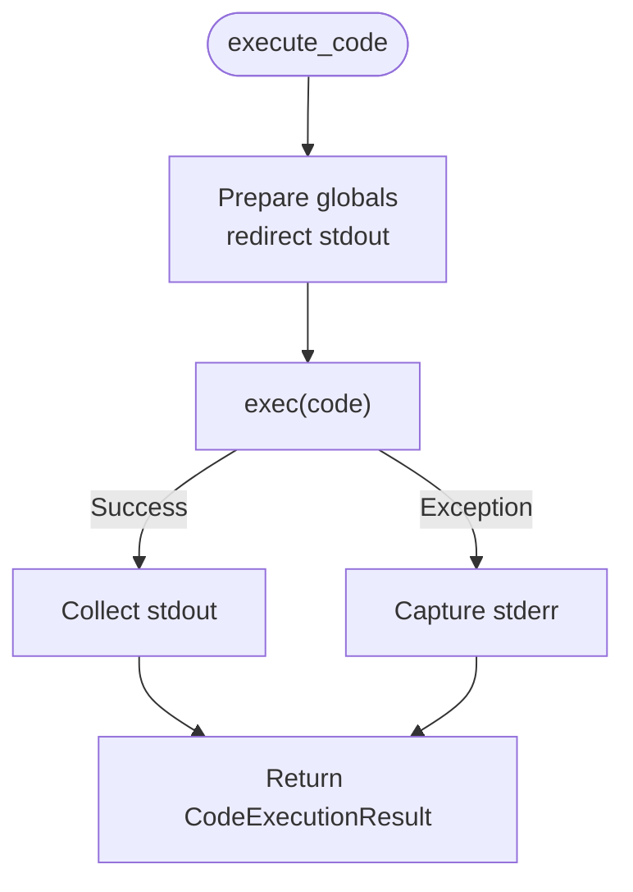

**Diagram sources**
- [unsafe_local_code_executor.py](file://src/google/adk/code_executors/unsafe_local_code_executor.py#L60-L85)

**Section sources**
- [unsafe_local_code_executor.py](file://src/google/adk/code_executors/unsafe_local_code_executor.py#L40-L85)

### Container-Based Execution: ContainerCodeExecutor
- Purpose: Runs code inside a Docker container.
- Lifecycle: Builds image from Dockerfile if provided, starts a long-running container, verifies Python availability, and cleans up on exit.
- Constraints: Not stateful; does not optimize data files; validates configuration at initialization.

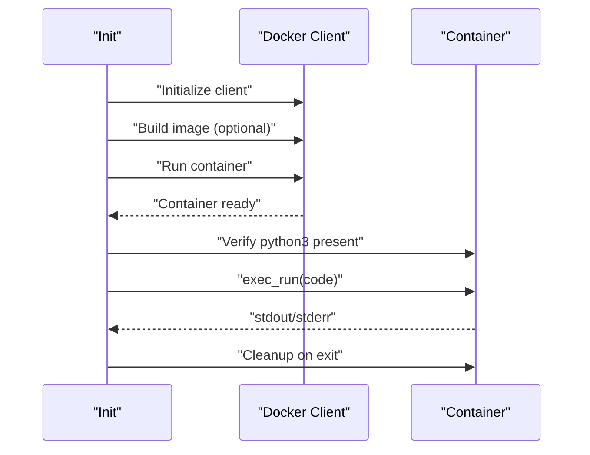

**Diagram sources**
- [container_code_executor.py](file://src/google/adk/code_executors/container_code_executor.py#L111-L200)

**Section sources**
- [container_code_executor.py](file://src/google/adk/code_executors/container_code_executor.py#L37-L200)

### Cloud-Based Execution: GkeCodeExecutor
- Modes:
  - Job mode: Creates a Kubernetes Job per execution with a ConfigMap mounting the code, strict Pod security context, resource limits, and gVisor runtime.
  - Sandbox mode: Uses Agent Sandbox Client to execute code in a pre-configured sandbox environment.
- RBAC and permissions: Requires permissions to manage Jobs, ConfigMaps, and Pod logs.
- Observability: Uses Watch API to efficiently poll completion; retrieves Pod logs on failure or timeout.

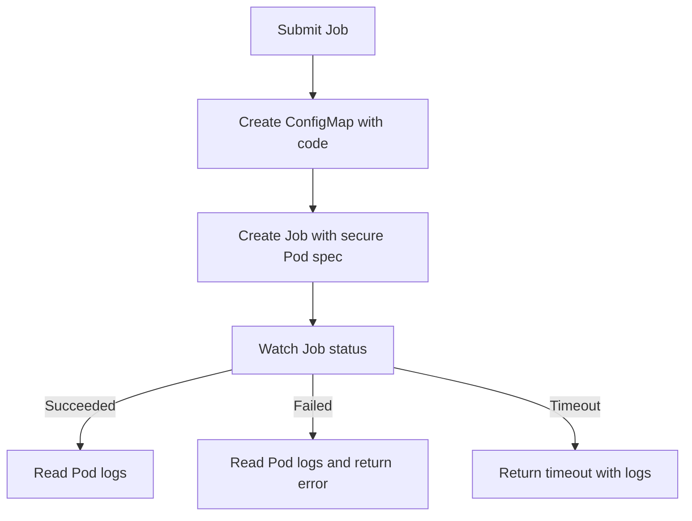

**Diagram sources**
- [gke_code_executor.py](file://src/google/adk/code_executors/gke_code_executor.py#L204-L365)

**Section sources**
- [gke_code_executor.py](file://src/google/adk/code_executors/gke_code_executor.py#L48-L429)

### Cloud-Based Execution: AgentEngineSandboxCodeExecutor
- Purpose: Executes code in Vertex AI Agent Engine Code Execution Sandbox.
- Behavior: Resolves or creates a sandbox per session, executes code with optional input files, parses JSON outputs and saved artifacts, and returns structured results.

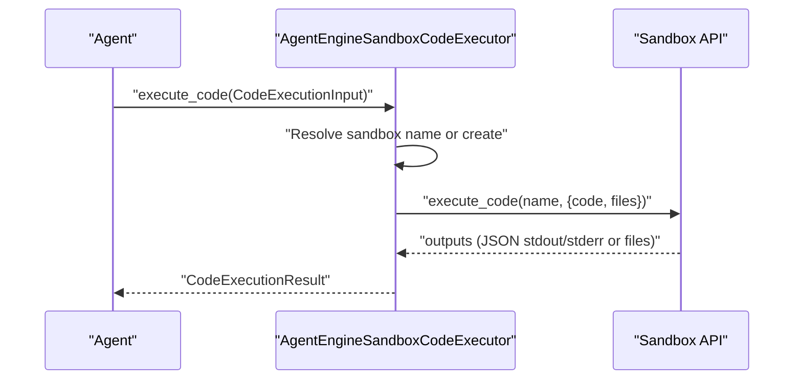

**Diagram sources**
- [agent_engine_sandbox_code_executor.py](file://src/google/adk/code_executors/agent_engine_sandbox_code_executor.py#L94-L197)

**Section sources**
- [agent_engine_sandbox_code_executor.py](file://src/google/adk/code_executors/agent_engine_sandbox_code_executor.py#L34-L221)

### Cloud-Based Execution: VertexAiCodeExecutor
- Purpose: Uses Vertex Code Interpreter Extension to execute code with optional input files and sessions.
- Behavior: Prepends common imports, executes via Extension, maps outputs to artifacts, and returns structured results.

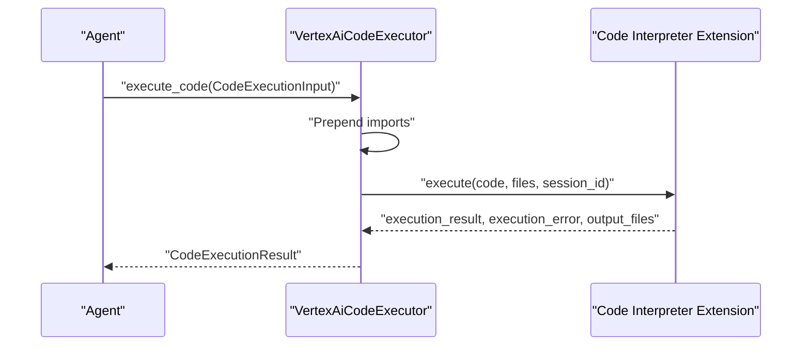

**Diagram sources**
- [vertex_ai_code_executor.py](file://src/google/adk/code_executors/vertex_ai_code_executor.py#L144-L227)

**Section sources**
- [vertex_ai_code_executor.py](file://src/google/adk/code_executors/vertex_ai_code_executor.py#L107-L242)

### Built-In Model Execution: BuiltInCodeExecutor
- Purpose: Integrates with model’s native code execution tool (Gemini 2.0+).
- Behavior: Adds a code execution tool to the model request when supported; otherwise raises an error.

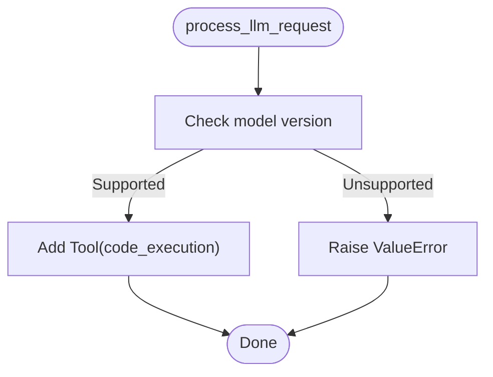

**Diagram sources**
- [built_in_code_executor.py](file://src/google/adk/code_executors/built_in_code_executor.py#L44-L57)

**Section sources**
- [built_in_code_executor.py](file://src/google/adk/code_executors/built_in_code_executor.py#L29-L57)

### Agent Integration Examples
- Data science agent using BuiltInCodeExecutor demonstrates how agents embed system instructions and enable built-in code execution.
- GKE sandbox agent shows configuring GkeCodeExecutor with namespace and timeout.
- Custom Vertex AI executor demonstrates extending VertexAiCodeExecutor to inject assets and preambles.

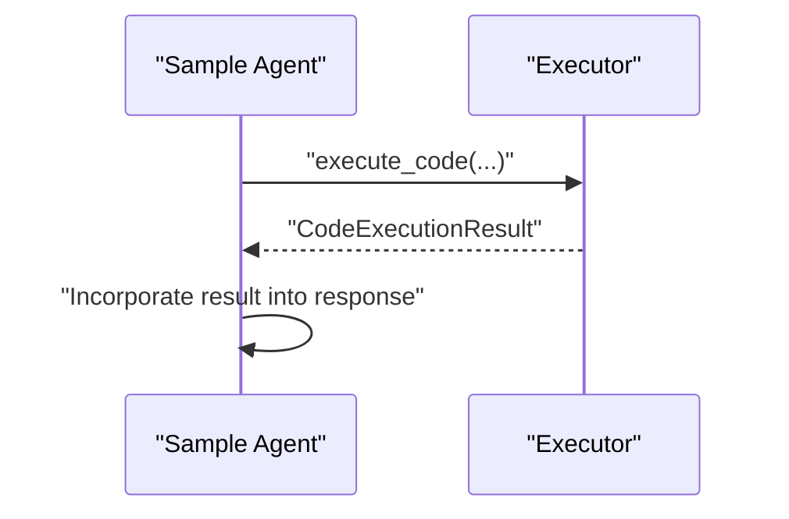

**Diagram sources**
- [agent.py](file://contributing/samples/code_execution/agent.py#L80-L100)
- [gke_sandbox_agent.py](file://contributing/samples/code_execution/gke_sandbox_agent.py#L40-L49)
- [agent.py](file://contributing/samples/custom_code_execution/agent.py#L61-L84)

**Section sources**
- [agent.py](file://contributing/samples/code_execution/agent.py#L80-L100)
- [gke_sandbox_agent.py](file://contributing/samples/code_execution/gke_sandbox_agent.py#L32-L49)
- [agent.py](file://contributing/samples/custom_code_execution/agent.py#L61-L84)

## Dependency Analysis
- Executors depend on BaseCodeExecutor for the interface and on CodeExecutionUtils for input/result structures.
- Executors may depend on external SDKs (Docker, Kubernetes, Vertex AI) depending on the environment.
- CodeExecutorContext persists execution metadata in session state.

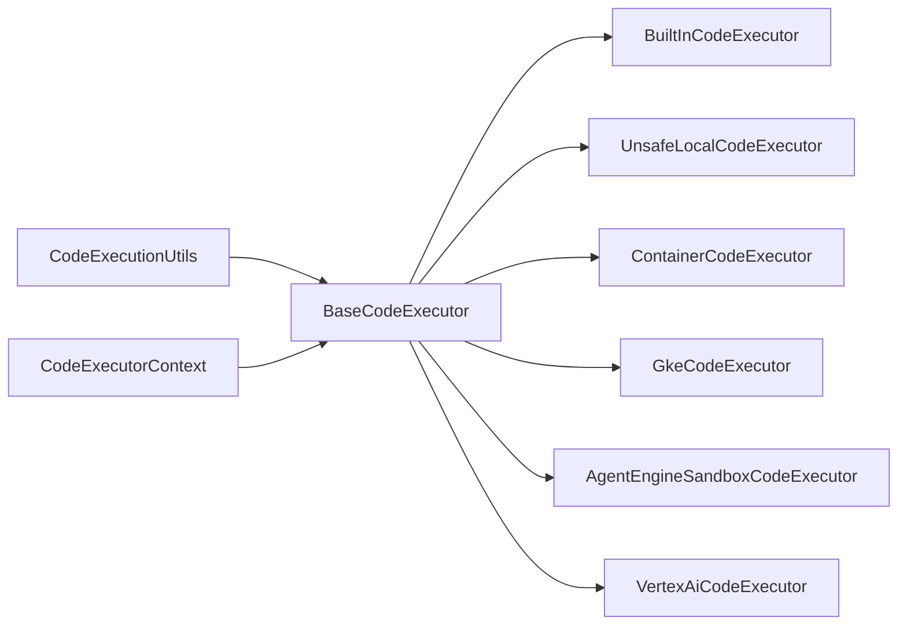

**Diagram sources**
- [base_code_executor.py](file://src/google/adk/code_executors/base_code_executor.py#L27-L92)
- [code_execution_utils.py](file://src/google/adk/code_executors/code_execution_utils.py#L50-L91)
- [code_executor_context.py](file://src/google/adk/code_executors/code_executor_context.py#L37-L204)
- [built_in_code_executor.py](file://src/google/adk/code_executors/built_in_code_executor.py#L29-L57)
- [unsafe_local_code_executor.py](file://src/google/adk/code_executors/unsafe_local_code_executor.py#L40-L85)
- [container_code_executor.py](file://src/google/adk/code_executors/container_code_executor.py#L37-L200)
- [gke_code_executor.py](file://src/google/adk/code_executors/gke_code_executor.py#L48-L429)
- [agent_engine_sandbox_code_executor.py](file://src/google/adk/code_executors/agent_engine_sandbox_code_executor.py#L34-L221)
- [vertex_ai_code_executor.py](file://src/google/adk/code_executors/vertex_ai_code_executor.py#L107-L242)

**Section sources**
- [__init__.py](file://src/google/adk/code_executors/__init__.py#L26-L80)
- [base_code_executor.py](file://src/google/adk/code_executors/base_code_executor.py#L27-L92)
- [code_execution_utils.py](file://src/google/adk/code_executors/code_execution_utils.py#L50-L264)
- [code_executor_context.py](file://src/google/adk/code_executors/code_executor_context.py#L37-L204)

## Performance Considerations
- Container and cloud executors introduce overhead; reuse containers or sandboxes when feasible to reduce cold-start latency.
- Prefer ephemeral jobs with short TTLs for GKE to minimize resource retention.
- Limit resource requests and limits to balance performance and cost.
- Use built-in model code execution when supported to offload execution to the model provider.
- Avoid unnecessary file transfers; leverage optimized data file handling where supported.

[No sources needed since this section provides general guidance]

## Troubleshooting Guide
Common issues and remedies:
- Import errors for optional executors:
  - Install extras to enable Vertex AI, container, GKE, or Agent Engine sandbox executors.
- GKE sandbox mode dependency:
  - Ensure Agent Sandbox Client is available when executor_type is set to sandbox.
- Kubernetes configuration:
  - Provide kubeconfig_path/context or rely on in-cluster/in-cluster fallback; verify RBAC permissions.
- Job timeouts or failures:
  - Increase timeout_seconds; inspect Pod logs retrieved by the executor.
- Container executor:
  - Verify Python installation inside the container; ensure Docker path or image is configured.
- Unsafe local executor:
  - Do not set stateful or optimize_data_file; only untrusted code should use this executor.

**Section sources**
- [__init__.py](file://src/google/adk/code_executors/__init__.py#L38-L79)
- [gke_code_executor.py](file://src/google/adk/code_executors/gke_code_executor.py#L166-L175)
- [gke_code_executor.py](file://src/google/adk/code_executors/gke_code_executor.py#L129-L161)
- [gke_code_executor.py](file://src/google/adk/code_executors/gke_code_executor.py#L230-L249)
- [container_code_executor.py](file://src/google/adk/code_executors/container_code_executor.py#L167-L190)
- [unsafe_local_code_executor.py](file://src/google/adk/code_executors/unsafe_local_code_executor.py#L44-L58)

## Conclusion
ADK provides a flexible, extensible code execution framework with multiple execution environments. The shared interface and utilities ensure consistent integration with agent workflows, while environment-specific executors enforce security and isolation. By selecting the appropriate executor and tuning configuration, teams can achieve secure, scalable, and observable code execution aligned with production requirements.

[No sources needed since this section summarizes without analyzing specific files]

## Appendices

### Execution Environment Comparison
- Local (UnsafeLocalCodeExecutor): Fastest for trusted code; no isolation.
- Container (ContainerCodeExecutor): Isolation via Docker; requires Docker setup.
- GKE (GkeCodeExecutor):
  - Job mode: Strong isolation with gVisor, strict security contexts, ephemeral jobs.
  - Sandbox mode: Managed sandbox via Agent Sandbox Client.
- Vertex AI (VertexAiCodeExecutor): Cloud-hosted interpreter with artifacts and sessions.
- Built-in (BuiltInCodeExecutor): Model-native execution for supported models.

**Section sources**
- [unsafe_local_code_executor.py](file://src/google/adk/code_executors/unsafe_local_code_executor.py#L40-L85)
- [container_code_executor.py](file://src/google/adk/code_executors/container_code_executor.py#L37-L200)
- [gke_code_executor.py](file://src/google/adk/code_executors/gke_code_executor.py#L48-L429)
- [vertex_ai_code_executor.py](file://src/google/adk/code_executors/vertex_ai_code_executor.py#L107-L242)
- [built_in_code_executor.py](file://src/google/adk/code_executors/built_in_code_executor.py#L29-L57)

### Practical Patterns
- Use BuiltInCodeExecutor for supported models to reduce operational overhead.
- Use GkeCodeExecutor Job mode for strong isolation and auditability.
- Use VertexAiCodeExecutor for artifact-heavy workflows and managed environments.
- Extend VertexAiCodeExecutor to inject reusable assets or preambles.
- Configure executors with appropriate timeouts and resource limits.

**Section sources**
- [agent.py](file://contributing/samples/code_execution/agent.py#L80-L100)
- [gke_sandbox_agent.py](file://contributing/samples/code_execution/gke_sandbox_agent.py#L32-L49)
- [agent.py](file://contributing/samples/custom_code_execution/agent.py#L61-L84)
- [vertex_ai_code_executor.py](file://src/google/adk/code_executors/vertex_ai_code_executor.py#L144-L227)

### Security Model and Best Practices
- Prefer sandboxed environments (GKE Job mode, Agent Engine Sandbox, Vertex AI).
- Enforce least privilege for Kubernetes ServiceAccounts and RBAC.
- Use read-only root filesystems, drop capabilities, and non-root users.
- Set CPU/memory requests/limits; enable TTL-based cleanup.
- Avoid UnsafeLocalCodeExecutor outside controlled environments.
- Validate and sanitize model-generated code before execution where possible.

**Section sources**
- [gke_code_executor.py](file://src/google/adk/code_executors/gke_code_executor.py#L265-L336)
- [gke_code_executor.py](file://src/google/adk/code_executors/gke_code_executor.py#L338-L391)
- [unsafe_local_code_executor.py](file://src/google/adk/code_executors/unsafe_local_code_executor.py#L40-L58)