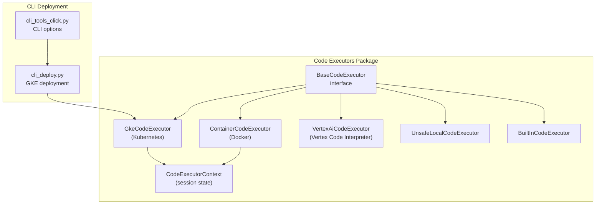
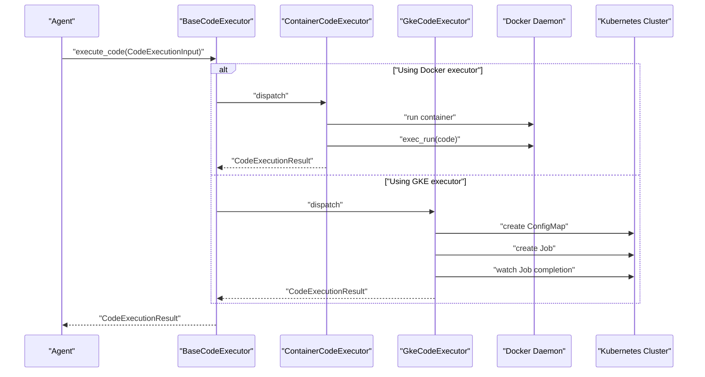
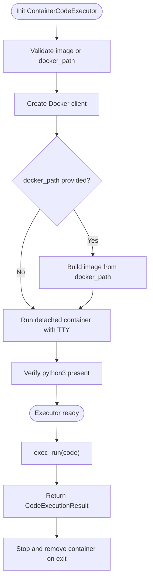
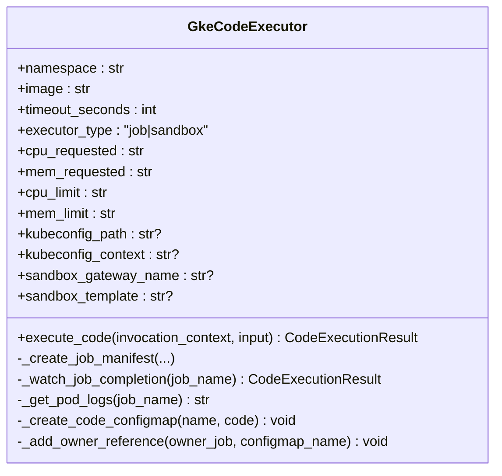
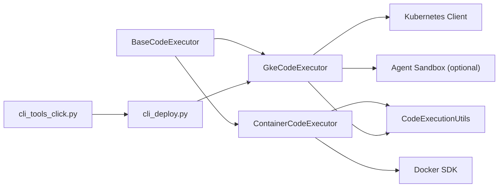

# Container-Based Code Execution

<cite>
**Referenced Files in This Document**
- [container_code_executor.py](file://src/google/adk/code_executors/container_code_executor.py)
- [gke_code_executor.py](file://src/google/adk/code_executors/gke_code_executor.py)
- [base_code_executor.py](file://src/google/adk/code_executors/base_code_executor.py)
- [code_execution_utils.py](file://src/google/adk/code_executors/code_execution_utils.py)
- [code_executor_context.py](file://src/google/adk/code_executors/code_executor_context.py)
- [__init__.py](file://src/google/adk/code_executors/__init__.py)
- [cli_deploy.py](file://src/google/adk/cli/cli_deploy.py)
- [cli_tools_click.py](file://src/google/adk/cli/cli_tools_click.py)
- [test_gke_code_executor.py](file://tests/unittests/code_executors/test_gke_code_executor.py)
</cite>

## Table of Contents
1. [Introduction](#introduction)
2. [Project Structure](#project-structure)
3. [Core Components](#core-components)
4. [Architecture Overview](#architecture-overview)
5. [Detailed Component Analysis](#detailed-component-analysis)
6. [Dependency Analysis](#dependency-analysis)
7. [Performance Considerations](#performance-considerations)
8. [Troubleshooting Guide](#troubleshooting-guide)
9. [Conclusion](#conclusion)
10. [Appendices](#appendices)

## Introduction
This document explains container-based code execution in ADK with a focus on the ContainerCodeExecutor and GkeCodeExecutor. It covers Docker integration, Kubernetes orchestration, image management, runtime configuration, security model, lifecycle management, health checks, cleanup, and practical operational guidance for production deployments.

## Project Structure
ADK implements pluggable code executors through a shared interface. The container-based executors are located under the code_executors package and integrate with CLI deployment utilities for GKE.

**Diagram sources**
- [__init__.py](file://src/google/adk/code_executors/__init__.py#L26-L35)
- [base_code_executor.py](file://src/google/adk/code_executors/base_code_executor.py#L27-L92)
- [container_code_executor.py](file://src/google/adk/code_executors/container_code_executor.py#L37-L200)
- [gke_code_executor.py](file://src/google/adk/code_executors/gke_code_executor.py#L48-L430)
- [code_executor_context.py](file://src/google/adk/code_executors/code_executor_context.py#L37-L205)
- [cli_deploy.py](file://src/google/adk/cli/cli_deploy.py#L1150-L1382)
- [cli_tools_click.py](file://src/google/adk/cli/cli_tools_click.py#L2095-L2147)

**Section sources**
- [__init__.py](file://src/google/adk/code_executors/__init__.py#L26-L35)
- [base_code_executor.py](file://src/google/adk/code_executors/base_code_executor.py#L27-L92)

## Core Components
- BaseCodeExecutor: Defines the common interface and configuration for all executors, including code delimiters, retry behavior, and stateful flags.
- ContainerCodeExecutor: Runs code inside a Docker container, supporting prebuilt images or building from a Dockerfile path.
- GkeCodeExecutor: Executes code in a Kubernetes Job or via Agent Sandbox, enforcing security contexts, resource limits, and optional gVisor runtime.
- CodeExecutionInput/CodeExecutionResult: Standardized structures for code and results.
- CodeExecutorContext: Persists execution state across invocations using session state.

Key characteristics:
- ContainerCodeExecutor enforces non-stateful execution and disables data file optimization.
- GkeCodeExecutor supports two execution modes: job (ephemeral Job per execution) and sandbox (Agent Sandbox).
- Both executors integrate with InvocationContext and produce standardized CodeExecutionResult.

**Section sources**
- [base_code_executor.py](file://src/google/adk/code_executors/base_code_executor.py#L27-L92)
- [container_code_executor.py](file://src/google/adk/code_executors/container_code_executor.py#L37-L200)
- [gke_code_executor.py](file://src/google/adk/code_executors/gke_code_executor.py#L48-L430)
- [code_execution_utils.py](file://src/google/adk/code_executors/code_execution_utils.py#L50-L88)
- [code_executor_context.py](file://src/google/adk/code_executors/code_executor_context.py#L37-L205)

## Architecture Overview
Container-based execution is implemented as a layered system:
- Executor interface abstraction
- Docker-based executor for local containerization
- Kubernetes-based executor for cluster-scale sandboxing
- Session-aware context for persistence
- CLI tooling for GKE deployment

**Diagram sources**
- [base_code_executor.py](file://src/google/adk/code_executors/base_code_executor.py#L77-L92)
- [container_code_executor.py](file://src/google/adk/code_executors/container_code_executor.py#L122-L150)
- [gke_code_executor.py](file://src/google/adk/code_executors/gke_code_executor.py#L251-L264)

## Detailed Component Analysis

### ContainerCodeExecutor
Purpose:
- Provides a lightweight containerized execution environment using Docker.
- Supports building images from a Dockerfile or using a predefined image tag.

Initialization and lifecycle:
- Validates that either image or docker_path is provided.
- Initializes a Docker client (local or remote via base_url).
- Builds image from docker_path if provided.
- Starts a detached container with TTY enabled.
- Verifies python3 availability before accepting executions.
- Registers cleanup to stop and remove the container on exit.

Execution:
- Executes code via exec_run with demux enabled to separate stdout/stderr.
- Returns a standardized CodeExecutionResult.

Security and isolation:
- No explicit resource limits or security context controls are configured in this executor.
- Isolation relies on container boundaries and host Docker daemon configuration.

Image management:
- Uses a default tag when image is not provided.
- Supports building from a local Dockerfile path.

Runtime configuration:
- Single-use container lifecycle per executor instance.
- No persistent state or data file optimization.

Cleanup:
- Stops and removes the container on process exit.

**Diagram sources**
- [container_code_executor.py](file://src/google/adk/code_executors/container_code_executor.py#L77-L121)
- [container_code_executor.py](file://src/google/adk/code_executors/container_code_executor.py#L152-L191)

**Section sources**
- [container_code_executor.py](file://src/google/adk/code_executors/container_code_executor.py#L37-L200)

### GkeCodeExecutor
Purpose:
- Executes code securely in Kubernetes with ephemeral Jobs or via Agent Sandbox.
- Enforces strong security defaults and resource limits.

Execution modes:
- Job mode: Creates a ConfigMap with the code, submits a Job, watches completion, and retrieves logs.
- Sandbox mode: Uses Agent Sandbox Client to execute code in a sandboxed environment.

Security model:
- Non-root user, no privilege escalation, read-only root filesystem, dropped capabilities.
- Resource requests and limits to constrain CPU/memory usage.
- Optional gVisor runtime via RuntimeClass and tolerations.

Resource allocation:
- Configurable CPU/Memory requests and limits.
- TTLSecondsAfterFinished for automatic cleanup of completed Jobs.

Network and volume mounting:
- Code mounted via a ConfigMap volume.
- No hostPath or privileged mounts are used.

Lifecycle and health:
- Watches Job status until completion or timeout.
- Retrieves Pod logs upon completion for stdout/stderr.

**Diagram sources**
- [gke_code_executor.py](file://src/google/adk/code_executors/gke_code_executor.py#L48-L108)
- [gke_code_executor.py](file://src/google/adk/code_executors/gke_code_executor.py#L265-L336)

**Section sources**
- [gke_code_executor.py](file://src/google/adk/code_executors/gke_code_executor.py#L48-L430)

### BaseCodeExecutor and Shared Types
- Defines common attributes: optimize_data_file, stateful, error_retry_attempts, code_block_delimiters, execution_result_delimiters.
- Provides the execute_code contract used by all executors.
- CodeExecutionInput/CodeExecutionResult standardize data exchange.

**Section sources**
- [base_code_executor.py](file://src/google/adk/code_executors/base_code_executor.py#L27-L92)
- [code_execution_utils.py](file://src/google/adk/code_executors/code_execution_utils.py#L50-L88)

### CodeExecutorContext
- Stores execution session state including execution_id, processed file names, input files, error counts, and recent execution results.
- Provides helpers to persist deltas back to session state.

**Section sources**
- [code_executor_context.py](file://src/google/adk/code_executors/code_executor_context.py#L37-L205)

## Dependency Analysis
- ContainerCodeExecutor depends on Docker SDK and pydantic for configuration.
- GkeCodeExecutor depends on Kubernetes client libraries and optionally Agent Sandbox.
- Executors depend on BaseCodeExecutor for the interface and on CodeExecutionUtils for result formatting.
- CLI deployment utilities generate Dockerfiles and Kubernetes manifests for GKE.

**Diagram sources**
- [__init__.py](file://src/google/adk/code_executors/__init__.py#L38-L79)
- [container_code_executor.py](file://src/google/adk/code_executors/container_code_executor.py#L22-L31)
- [gke_code_executor.py](file://src/google/adk/code_executors/gke_code_executor.py#L20-L38)
- [cli_deploy.py](file://src/google/adk/cli/cli_deploy.py#L1150-L1382)
- [cli_tools_click.py](file://src/google/adk/cli/cli_tools_click.py#L2095-L2147)

**Section sources**
- [__init__.py](file://src/google/adk/code_executors/__init__.py#L26-L35)
- [cli_deploy.py](file://src/google/adk/cli/cli_deploy.py#L1150-L1382)

## Performance Considerations
- ContainerCodeExecutor
  - Reuse container across invocations: currently not supported; each executor instance manages a single container lifecycle.
  - Image build overhead: building from Dockerfile adds startup latency; prebuilt images reduce cold starts.
  - No resource limits: consider adding CPU/memory constraints if running untrusted workloads.
- GkeCodeExecutor
  - Job mode: per-execution Jobs introduce overhead; consider sandbox mode for frequent short executions if infrastructure permits.
  - Resource requests/limits: tune cpu_requested, mem_requested, cpu_limit, mem_limit to balance performance and cost.
  - Watch API: efficient event-driven waiting avoids polling overhead.
  - gVisor runtime: adds overhead but improves isolation; evaluate trade-offs for your workload.

[No sources needed since this section provides general guidance]

## Troubleshooting Guide
Common issues and resolutions:
- Docker executor initialization failures
  - Symptom: ValueError indicating missing image or docker_path.
  - Resolution: Provide either image or docker_path; ensure docker_path exists and is accessible.
  - Reference: [container_code_executor.py](file://src/google/adk/code_executors/container_code_executor.py#L95-L104)
- Python not found in container
  - Symptom: ValueError stating python3 is not installed.
  - Resolution: Ensure the Docker image includes python3; rebuild image if necessary.
  - Reference: [container_code_executor.py](file://src/google/adk/code_executors/container_code_executor.py#L167-L171)
- GKE Job timeouts
  - Symptom: TimeoutError during job completion.
  - Resolution: Increase timeout_seconds; inspect returned Pod logs for causes; verify resource limits and runtime class availability.
  - Reference: [gke_code_executor.py](file://src/google/adk/code_executors/gke_code_executor.py#L338-L365)
- Sandbox mode dependency missing
  - Symptom: ImportError indicating Agent Sandbox not installed.
  - Resolution: Install google-adk with extensions extra to enable sandbox mode.
  - Reference: [gke_code_executor.py](file://src/google/adk/code_executors/gke_code_executor.py#L166-L175)
- GKE RBAC permissions
  - Symptom: API errors when creating Jobs or ConfigMaps.
  - Resolution: Grant required RBAC rules for jobs, configmaps, and pod logs in the target namespace.
  - Reference: [gke_code_executor.py](file://src/google/adk/code_executors/gke_code_executor.py#L72-L90)
- Debugging container execution
  - Enable logging around exec_run and inspect stdout/stderr in CodeExecutionResult.
  - Reference: [container_code_executor.py](file://src/google/adk/code_executors/container_code_executor.py#L122-L150)

**Section sources**
- [container_code_executor.py](file://src/google/adk/code_executors/container_code_executor.py#L95-L104)
- [container_code_executor.py](file://src/google/adk/code_executors/container_code_executor.py#L167-L171)
- [gke_code_executor.py](file://src/google/adk/code_executors/gke_code_executor.py#L166-L175)
- [gke_code_executor.py](file://src/google/adk/code_executors/gke_code_executor.py#L338-L365)
- [gke_code_executor.py](file://src/google/adk/code_executors/gke_code_executor.py#L72-L90)

## Conclusion
ADK offers two complementary container-based execution strategies:
- ContainerCodeExecutor for lightweight, local Docker-based execution with minimal configuration.
- GkeCodeExecutor for robust, production-grade Kubernetes execution with strong security defaults, resource governance, and optional sandboxing.

Choose ContainerCodeExecutor for development or controlled local environments; choose GkeCodeExecutor for scalable, secure, and auditable execution in clusters.

[No sources needed since this section summarizes without analyzing specific files]

## Appendices

### Practical Examples

- Configure ContainerCodeExecutor
  - Provide image or docker_path; the executor validates inputs and initializes a container.
  - Reference: [container_code_executor.py](file://src/google/adk/code_executors/container_code_executor.py#L77-L121)

- Configure GkeCodeExecutor
  - Choose executor_type ("job" or "sandbox"); set namespace, image, timeouts, and resource limits.
  - Reference: [gke_code_executor.py](file://src/google/adk/code_executors/gke_code_executor.py#L92-L108)

- Deploy to GKE using CLI
  - The CLI prepares a Dockerfile and Kubernetes manifests, builds the image, applies manifests, and cleans up.
  - Reference: [cli_deploy.py](file://src/google/adk/cli/cli_deploy.py#L1150-L1382)

- Unit test coverage for GKE executor
  - Tests validate security context, resource limits, and sandbox mode routing.
  - Reference: [test_gke_code_executor.py](file://tests/unittests/code_executors/test_gke_code_executor.py#L273-L312)

### Security Best Practices
- Prefer GkeCodeExecutor with Job mode for strict isolation and ephemeral execution.
- Enforce non-root, read-only root filesystem, and dropped capabilities.
- Set conservative CPU/memory requests/limits; monitor utilization.
- Use gVisor runtime when available for additional sandboxing.
- Avoid privileged containers and hostPath volumes.
- Manage RBAC carefully; grant least privilege for jobs/configmaps/pod logs.

[No sources needed since this section provides general guidance]

### Compliance and Production Considerations
- Audit execution outcomes and logs; ensure retention policies align with compliance needs.
- Use immutable images and signed registries.
- Implement secrets management and avoid embedding credentials in images or manifests.
- Monitor resource usage and set alerts for unusual spikes.
- Validate sandbox mode readiness and fallback to Job mode if infrastructure constraints exist.

[No sources needed since this section provides general guidance]