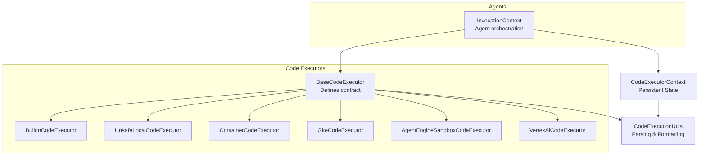
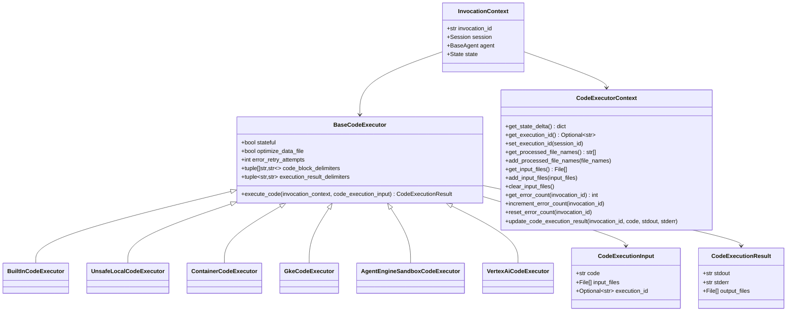
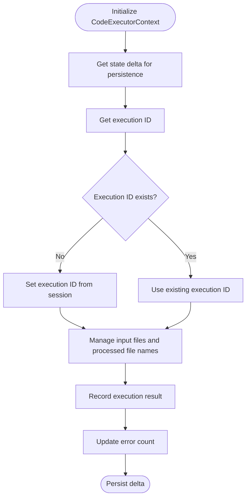
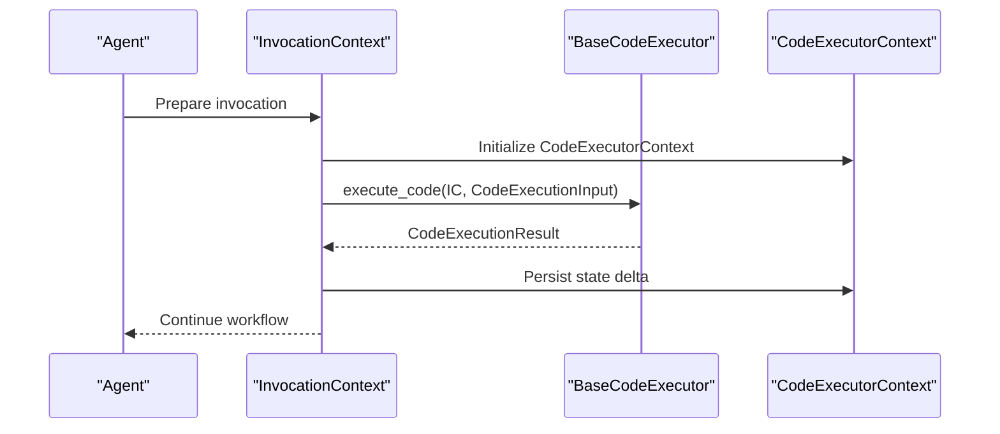
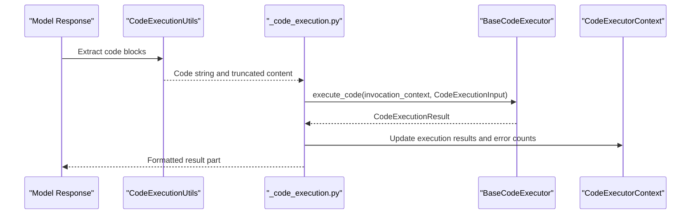
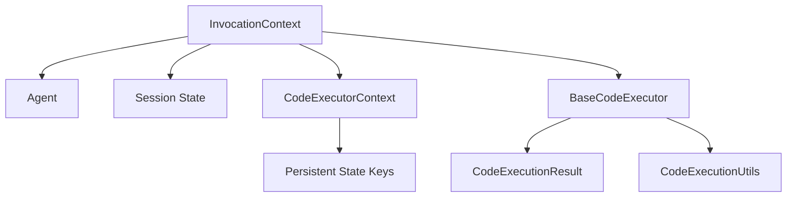
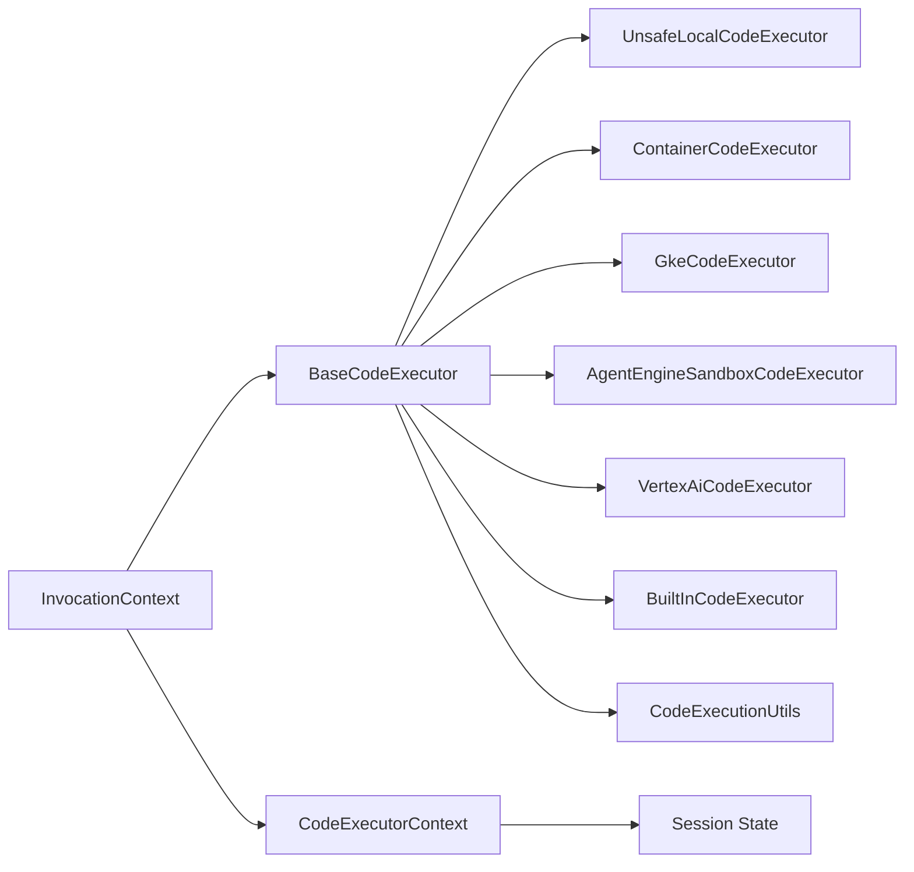

# Execution Architecture and Design

<cite>
**Referenced Files in This Document**
- [base_code_executor.py](file://src/google/adk/code_executors/base_code_executor.py)
- [code_execution_utils.py](file://src/google/adk/code_executors/code_execution_utils.py)
- [code_executor_context.py](file://src/google/adk/code_executors/code_executor_context.py)
- [built_in_code_executor.py](file://src/google/adk/code_executors/built_in_code_executor.py)
- [unsafe_local_code_executor.py](file://src/google/adk/code_executors/unsafe_local_code_executor.py)
- [container_code_executor.py](file://src/google/adk/code_executors/container_code_executor.py)
- [gke_code_executor.py](file://src/google/adk/code_executors/gke_code_executor.py)
- [agent_engine_sandbox_code_executor.py](file://src/google/adk/code_executors/agent_engine_sandbox_code_executor.py)
- [vertex_ai_code_executor.py](file://src/google/adk/code_executors/vertex_ai_code_executor.py)
- [invocation_context.py](file://src/google/adk/agents/invocation_context.py)
- [_code_execution.py](file://src/google/adk/flows/llm_flows/_code_execution.py)
</cite>

## Table of Contents
1. [Introduction](#introduction)
2. [Project Structure](#project-structure)
3. [Core Components](#core-components)
4. [Architecture Overview](#architecture-overview)
5. [Detailed Component Analysis](#detailed-component-analysis)
6. [Dependency Analysis](#dependency-analysis)
7. [Performance Considerations](#performance-considerations)
8. [Troubleshooting Guide](#troubleshooting-guide)
9. [Conclusion](#conclusion)

## Introduction
This document explains the code execution architecture and design patterns in the ADK. It focuses on the abstract base class design, execution context management, and the unified interface for pluggable execution environments. It documents the execution lifecycle, input/output processing, result formatting, and the execution result delimiters system. It also covers how the execution context structure maintains state across code execution calls and how the system integrates with agent workflows.

## Project Structure
The code execution subsystem resides primarily under the code_executors package and integrates with agents and flows. The key elements are:
- Abstract base class defining the contract for all executors
- Concrete executor implementations for local, containerized, cloud-managed, and sandboxed environments
- Utilities for parsing code blocks, formatting results, and managing file attachments
- Persistent execution context for stateful execution across invocations
- Agent invocation context that orchestrates execution within agent workflows

**Diagram sources**
- [base_code_executor.py](file://src/google/adk/code_executors/base_code_executor.py#L27-L93)
- [built_in_code_executor.py](file://src/google/adk/code_executors/built_in_code_executor.py#L29-L58)
- [unsafe_local_code_executor.py](file://src/google/adk/code_executors/unsafe_local_code_executor.py#L40-L86)
- [container_code_executor.py](file://src/google/adk/code_executors/container_code_executor.py#L37-L201)
- [gke_code_executor.py](file://src/google/adk/code_executors/gke_code_executor.py#L48-L430)
- [agent_engine_sandbox_code_executor.py](file://src/google/adk/code_executors/agent_engine_sandbox_code_executor.py#L34-L222)
- [vertex_ai_code_executor.py](file://src/google/adk/code_executors/vertex_ai_code_executor.py#L107-L243)
- [code_execution_utils.py](file://src/google/adk/code_executors/code_execution_utils.py#L90-L264)
- [code_executor_context.py](file://src/google/adk/code_executors/code_executor_context.py#L37-L205)
- [invocation_context.py](file://src/google/adk/agents/invocation_context.py#L100-L418)

**Section sources**
- [base_code_executor.py](file://src/google/adk/code_executors/base_code_executor.py#L27-L93)
- [code_execution_utils.py](file://src/google/adk/code_executors/code_execution_utils.py#L90-L264)
- [code_executor_context.py](file://src/google/adk/code_executors/code_executor_context.py#L37-L205)
- [invocation_context.py](file://src/google/adk/agents/invocation_context.py#L100-L418)

## Core Components
- BaseCodeExecutor: Defines the unified interface for code execution, including attributes for statefulness, retry behavior, and delimiter configurations. It declares the abstract execute_code method that all concrete executors must implement.
- CodeExecutionInput and CodeExecutionResult: Typed structures representing the inputs and outputs of execution, including optional input files and structured stdout/stderr.
- CodeExecutionUtils: Provides utilities for extracting code blocks from model responses, building executable code parts, converting execution results back to text parts, and formatting results with delimiters.
- CodeExecutorContext: Manages persistent state for code execution across invocations, including execution IDs, input files, processed file names, error counts, and recorded execution results.
- Executor implementations:
  - BuiltInCodeExecutor: Integrates with model-native code execution (Gemini 2.0+).
  - UnsafeLocalCodeExecutor: Executes code in the current process with restricted capabilities.
  - ContainerCodeExecutor: Runs code in a Docker container.
  - GkeCodeExecutor: Executes code in a sandboxed Kubernetes Job or via Agent Sandbox.
  - AgentEngineSandboxCodeExecutor: Uses Vertex AI Agent Engine sandboxes.
  - VertexAiCodeExecutor: Uses Vertex Code Interpreter Extension with file support.

**Section sources**
- [base_code_executor.py](file://src/google/adk/code_executors/base_code_executor.py#L27-L93)
- [code_execution_utils.py](file://src/google/adk/code_executors/code_execution_utils.py#L30-L264)
- [code_executor_context.py](file://src/google/adk/code_executors/code_executor_context.py#L37-L205)
- [built_in_code_executor.py](file://src/google/adk/code_executors/built_in_code_executor.py#L29-L58)
- [unsafe_local_code_executor.py](file://src/google/adk/code_executors/unsafe_local_code_executor.py#L40-L86)
- [container_code_executor.py](file://src/google/adk/code_executors/container_code_executor.py#L37-L201)
- [gke_code_executor.py](file://src/google/adk/code_executors/gke_code_executor.py#L48-L430)
- [agent_engine_sandbox_code_executor.py](file://src/google/adk/code_executors/agent_engine_sandbox_code_executor.py#L34-L222)
- [vertex_ai_code_executor.py](file://src/google/adk/code_executors/vertex_ai_code_executor.py#L107-L243)

## Architecture Overview
The execution architecture centers on a shared contract (BaseCodeExecutor) and a unified data model (CodeExecutionInput/Result). Executors encapsulate environment-specific execution logic, while InvocationContext coordinates execution within agent workflows. CodeExecutorContext persists execution state across invocations to support stateful runs.

**Diagram sources**
- [base_code_executor.py](file://src/google/adk/code_executors/base_code_executor.py#L27-L93)
- [built_in_code_executor.py](file://src/google/adk/code_executors/built_in_code_executor.py#L29-L58)
- [unsafe_local_code_executor.py](file://src/google/adk/code_executors/unsafe_local_code_executor.py#L40-L86)
- [container_code_executor.py](file://src/google/adk/code_executors/container_code_executor.py#L37-L201)
- [gke_code_executor.py](file://src/google/adk/code_executors/gke_code_executor.py#L48-L430)
- [agent_engine_sandbox_code_executor.py](file://src/google/adk/code_executors/agent_engine_sandbox_code_executor.py#L34-L222)
- [vertex_ai_code_executor.py](file://src/google/adk/code_executors/vertex_ai_code_executor.py#L107-L243)
- [code_execution_utils.py](file://src/google/adk/code_executors/code_execution_utils.py#L50-L88)
- [code_executor_context.py](file://src/google/adk/code_executors/code_executor_context.py#L37-L205)
- [invocation_context.py](file://src/google/adk/agents/invocation_context.py#L100-L418)

## Detailed Component Analysis

### Abstract Base Class Design
- Purpose: Provide a uniform interface for code execution across diverse environments while allowing environment-specific customization via attributes and overrides.
- Key attributes:
  - stateful: Enables persistent execution state across invocations.
  - optimize_data_file: Controls whether data files are extracted and attached to the executor.
  - error_retry_attempts: Number of retries on consecutive execution errors.
  - code_block_delimiters: Patterns used to detect code blocks in model responses.
  - execution_result_delimiters: Patterns used to wrap formatted execution results.
- Contract: All executors implement execute_code(invocation_context, code_execution_input) -> CodeExecutionResult.

**Section sources**
- [base_code_executor.py](file://src/google/adk/code_executors/base_code_executor.py#L27-L93)

### Execution Context Management
- CodeExecutorContext manages persistent state for code execution:
  - Execution ID for stateful runs
  - Input files and processed file names
  - Error counts keyed by invocation ID
  - Recorded execution results with timestamps
- It exposes methods to get/set state delta for persistence and to record results and errors.

**Diagram sources**
- [code_executor_context.py](file://src/google/adk/code_executors/code_executor_context.py#L37-L205)

**Section sources**
- [code_executor_context.py](file://src/google/adk/code_executors/code_executor_context.py#L37-L205)

### Unified Interface for Different Execution Environments
- Local execution: UnsafeLocalCodeExecutor executes code in the current process with prepared globals.
- Containerized execution: ContainerCodeExecutor builds or selects an image and runs code in a detached container, capturing stdout/stderr.
- Cloud-managed execution: GkeCodeExecutor creates a Kubernetes Job or uses Agent Sandbox to execute code securely.
- Vertex AI integration: VertexAiCodeExecutor and AgentEngineSandboxCodeExecutor leverage Vertex AI extensions and sandboxes, supporting file artifacts and sessions.
- Built-in integration: BuiltInCodeExecutor augments LLM requests with model-native code execution tools for supported models.

**Diagram sources**
- [invocation_context.py](file://src/google/adk/agents/invocation_context.py#L100-L418)
- [base_code_executor.py](file://src/google/adk/code_executors/base_code_executor.py#L77-L92)
- [code_execution_utils.py](file://src/google/adk/code_executors/code_execution_utils.py#L50-L88)
- [code_executor_context.py](file://src/google/adk/code_executors/code_executor_context.py#L37-L205)

**Section sources**
- [unsafe_local_code_executor.py](file://src/google/adk/code_executors/unsafe_local_code_executor.py#L40-L86)
- [container_code_executor.py](file://src/google/adk/code_executors/container_code_executor.py#L37-L201)
- [gke_code_executor.py](file://src/google/adk/code_executors/gke_code_executor.py#L48-L430)
- [agent_engine_sandbox_code_executor.py](file://src/google/adk/code_executors/agent_engine_sandbox_code_executor.py#L34-L222)
- [vertex_ai_code_executor.py](file://src/google/adk/code_executors/vertex_ai_code_executor.py#L107-L243)
- [built_in_code_executor.py](file://src/google/adk/code_executors/built_in_code_executor.py#L29-L58)

### Code Execution Lifecycle and Workflows
- Parsing: CodeExecutionUtils.extract_code_and_truncate_content identifies code blocks using configured delimiters and prepares executable parts.
- Execution: Executors implement execute_code to run code and produce CodeExecutionResult.
- Post-processing: CodeExecutionUtils.build_code_execution_result_part converts results into model-friendly parts, and flows integrate results back into agent conversations.
- Stateful execution: _code_execution.py resolves execution IDs and updates CodeExecutorContext with results and error counts.

**Diagram sources**
- [code_execution_utils.py](file://src/google/adk/code_executors/code_execution_utils.py#L113-L221)
- [_code_execution.py](file://src/google/adk/flows/llm_flows/_code_execution.py#L406-L446)
- [base_code_executor.py](file://src/google/adk/code_executors/base_code_executor.py#L77-L92)
- [code_executor_context.py](file://src/google/adk/code_executors/code_executor_context.py#L167-L191)

**Section sources**
- [code_execution_utils.py](file://src/google/adk/code_executors/code_execution_utils.py#L113-L221)
- [_code_execution.py](file://src/google/adk/flows/llm_flows/_code_execution.py#L406-L446)

### Input/Output Processing and Result Formatting
- CodeExecutionInput supports:
  - code: The code to execute
  - input_files: Optional list of File attachments
  - execution_id: Optional session-based ID for stateful execution
- CodeExecutionResult supports:
  - stdout/stderr capture
  - output_files: Artifacts produced by execution
- CodeExecutionUtils provides:
  - Building executable parts and result parts
  - Converting execution parts to delimited text for downstream consumption

**Section sources**
- [code_execution_utils.py](file://src/google/adk/code_executors/code_execution_utils.py#L50-L264)

### Execution Result Delimiters System and Code Block Parsing Logic
- Delimiters:
  - code_block_delimiters: Patterns used to detect code blocks in model responses (e.g., fenced code with language markers).
  - execution_result_delimiters: Patterns used to wrap formatted execution results.
- Parsing logic:
  - extract_code_and_truncate_content scans Content parts to find executable code or fenced code blocks, truncating content after the first code block.
  - convert_code_execution_parts transforms trailing executable code or execution result parts into delimited text for consistent presentation.

**Section sources**
- [base_code_executor.py](file://src/google/adk/code_executors/base_code_executor.py#L60-L75)
- [code_execution_utils.py](file://src/google/adk/code_executors/code_execution_utils.py#L113-L261)

### Execution Context Structure and State Persistence
- CodeExecutorContext stores:
  - execution_session_id: Unique ID for stateful runs
  - processed_input_files: Names of files already processed
  - _code_executor_input_files: Input files attached to the session
  - _code_executor_error_counts: Error counters keyed by invocation ID
  - _code_execution_results: History of executed code and outputs
- Methods:
  - get_state_delta returns a delta suitable for persisting to session state
  - get/set_execution_id manage stateful execution identity
  - add/clear input files maintain file attachments
  - increment/reset error counts and update_code_execution_result record outcomes

**Section sources**
- [code_executor_context.py](file://src/google/adk/code_executors/code_executor_context.py#L37-L205)

### Architectural Diagrams: Executors, Contexts, and Agent Workflows
- Relationship overview:
  - InvocationContext orchestrates agent runs and holds references to the active session and agent.
  - CodeExecutorContext persists execution state for stateful runs.
  - BaseCodeExecutor defines the contract; concrete executors encapsulate environment-specific logic.
  - CodeExecutionUtils provides parsing and formatting utilities consumed by flows and executors.

**Diagram sources**
- [invocation_context.py](file://src/google/adk/agents/invocation_context.py#L100-L418)
- [code_executor_context.py](file://src/google/adk/code_executors/code_executor_context.py#L37-L205)
- [base_code_executor.py](file://src/google/adk/code_executors/base_code_executor.py#L27-L93)
- [code_execution_utils.py](file://src/google/adk/code_executors/code_execution_utils.py#L90-L264)

## Dependency Analysis
- Coupling:
  - Executors depend on InvocationContext and CodeExecutionInput/Result.
  - CodeExecutorContext depends on Session State for persistence.
  - CodeExecutionUtils is used by flows and executors for parsing/formatting.
- Cohesion:
  - Executors encapsulate environment-specific concerns (Docker, Kubernetes, Vertex).
  - BaseCodeExecutor centralizes shared configuration and contract.
- External dependencies:
  - Docker SDK for containerized execution
  - Kubernetes client for GKE execution
  - Vertex AI clients for sandbox and extension execution
  - Pydantic for typed models

**Diagram sources**
- [invocation_context.py](file://src/google/adk/agents/invocation_context.py#L100-L418)
- [base_code_executor.py](file://src/google/adk/code_executors/base_code_executor.py#L27-L93)
- [code_execution_utils.py](file://src/google/adk/code_executors/code_execution_utils.py#L90-L264)
- [code_executor_context.py](file://src/google/adk/code_executors/code_executor_context.py#L37-L205)
- [unsafe_local_code_executor.py](file://src/google/adk/code_executors/unsafe_local_code_executor.py#L40-L86)
- [container_code_executor.py](file://src/google/adk/code_executors/container_code_executor.py#L37-L201)
- [gke_code_executor.py](file://src/google/adk/code_executors/gke_code_executor.py#L48-L430)
- [agent_engine_sandbox_code_executor.py](file://src/google/adk/code_executors/agent_engine_sandbox_code_executor.py#L34-L222)
- [vertex_ai_code_executor.py](file://src/google/adk/code_executors/vertex_ai_code_executor.py#L107-L243)
- [built_in_code_executor.py](file://src/google/adk/code_executors/built_in_code_executor.py#L29-L58)

**Section sources**
- [base_code_executor.py](file://src/google/adk/code_executors/base_code_executor.py#L27-L93)
- [code_execution_utils.py](file://src/google/adk/code_executors/code_execution_utils.py#L90-L264)
- [code_executor_context.py](file://src/google/adk/code_executors/code_executor_context.py#L37-L205)
- [invocation_context.py](file://src/google/adk/agents/invocation_context.py#L100-L418)

## Performance Considerations
- Stateful vs Stateless: Prefer stateless executors for short-lived tasks to avoid overhead of maintaining persistent state. Use stateful executors when continuity across turns is required.
- Container and Kubernetes: ContainerCodeExecutor and GkeCodeExecutor introduce startup and teardown costs; reuse containers or pods where possible and ensure proper cleanup.
- File handling: Attach only necessary input files to reduce I/O overhead. Use optimize_data_file judiciously.
- Delimiter matching: Keep delimiter patterns concise to minimize regex overhead during parsing.
- Retry strategy: Tune error_retry_attempts to balance resilience and latency.

## Troubleshooting Guide
- Execution failures:
  - Inspect CodeExecutionResult.stderr for error messages.
  - Use CodeExecutorContext.get_error_count and increment_error_count to track repeated failures.
- Stateful execution issues:
  - Verify execution_session_id is set and consistent across invocations.
  - Confirm that update_code_execution_result captures stdout/stderr and timestamps.
- Environment-specific problems:
  - Docker: Ensure python3 is present in the container and images are built correctly.
  - Kubernetes: Validate RBAC permissions and that Jobs/Pods complete within timeout.
  - Vertex AI: Confirm extension availability and sandbox readiness.

**Section sources**
- [code_execution_utils.py](file://src/google/adk/code_executors/code_execution_utils.py#L70-L88)
- [code_executor_context.py](file://src/google/adk/code_executors/code_executor_context.py#L131-L191)
- [container_code_executor.py](file://src/google/adk/code_executors/container_code_executor.py#L167-L201)
- [gke_code_executor.py](file://src/google/adk/code_executors/gke_code_executor.py#L166-L176)

## Conclusion
The ADK’s code execution architecture provides a robust, extensible foundation for executing code across diverse environments. The BaseCodeExecutor contract ensures a consistent interface, while CodeExecutorContext and InvocationContext enable reliable state management and seamless integration with agent workflows. CodeExecutionUtils standardizes parsing and formatting, and the suite of executor implementations delivers flexibility from local to managed cloud environments. This design supports pluggability, scalability, and maintainability for agent-driven code execution scenarios.