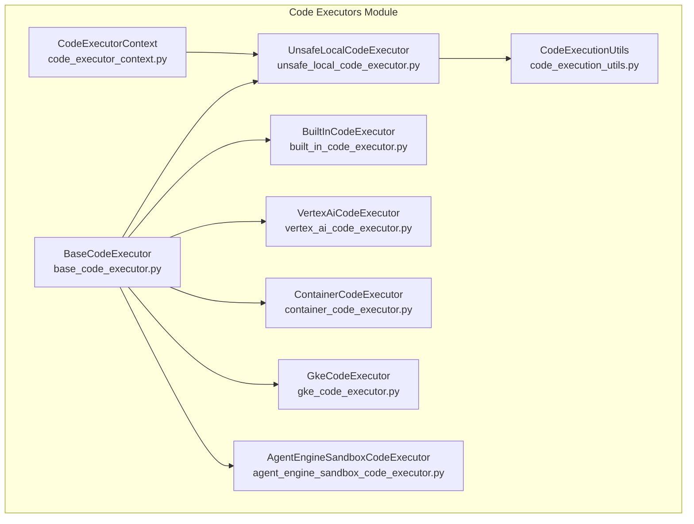
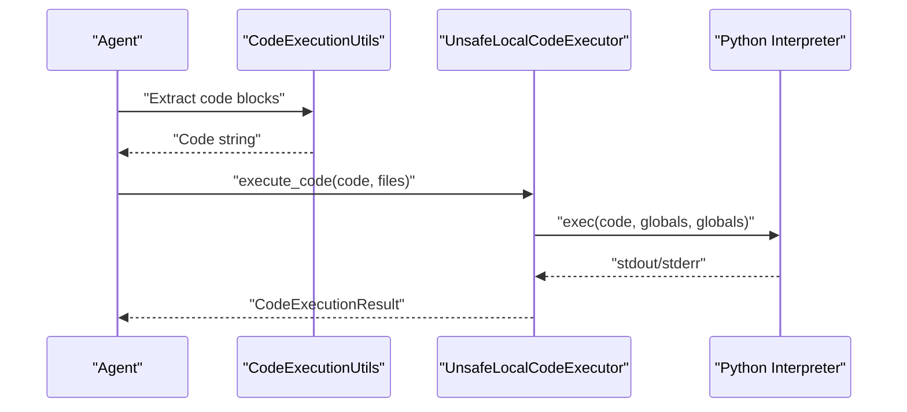
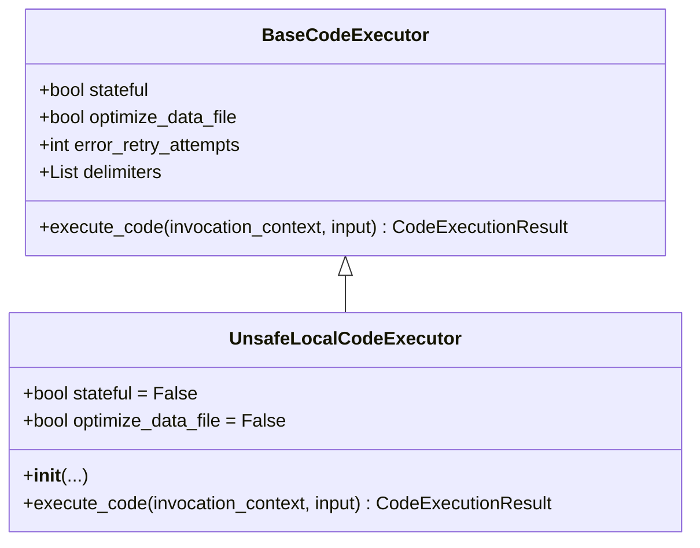
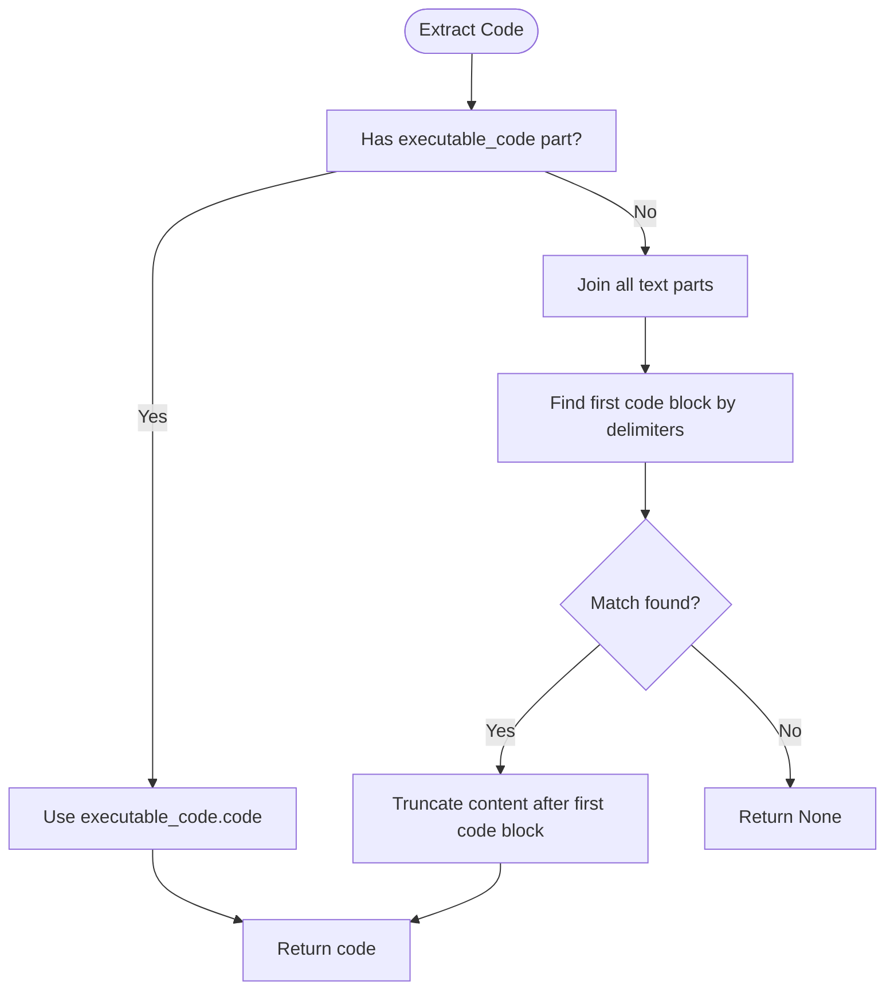
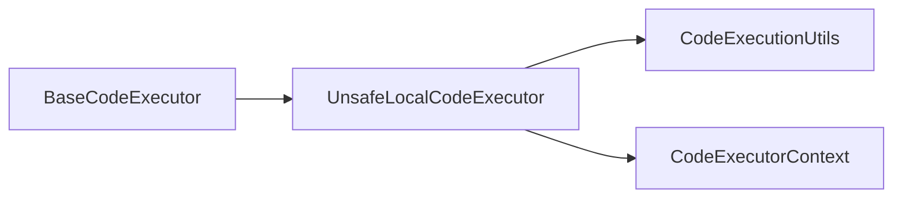

# Local Code Execution

<cite>
**Referenced Files in This Document**
- [unsafe_local_code_executor.py](file://src/google/adk/code_executors/unsafe_local_code_executor.py)
- [base_code_executor.py](file://src/google/adk/code_executors/base_code_executor.py)
- [code_execution_utils.py](file://src/google/adk/code_executors/code_execution_utils.py)
- [code_executor_context.py](file://src/google/adk/code_executors/code_executor_context.py)
- [__init__.py](file://src/google/adk/code_executors/__init__.py)
- [test_unsafe_local_code_executor.py](file://tests/unittests/code_executors/test_unsafe_local_code_executor.py)
- [gke_code_executor.py](file://src/google/adk/code_executors/gke_code_executor.py)
- [container_code_executor.py](file://src/google/adk/code_executors/container_code_executor.py)
- [agent_engine_sandbox_code_executor.py](file://src/google/adk/code_executors/agent_engine_sandbox_code_executor.py)
- [vertex_ai_code_executor.py](file://src/google/adk/code_executors/vertex_ai_code_executor.py)
- [built_in_code_executor.py](file://src/google/adk/code_executors/built_in_code_executor.py)
- [agent.py](file://contributing/samples/code_execution/agent.py)
- [agent.py](file://contributing/samples/custom_code_execution/agent.py)
</cite>

## Table of Contents
1. [Introduction](#introduction)
2. [Project Structure](#project-structure)
3. [Core Components](#core-components)
4. [Architecture Overview](#architecture-overview)
5. [Detailed Component Analysis](#detailed-component-analysis)
6. [Dependency Analysis](#dependency-analysis)
7. [Performance Considerations](#performance-considerations)
8. [Troubleshooting Guide](#troubleshooting-guide)
9. [Conclusion](#conclusion)
10. [Appendices](#appendices)

## Introduction
This document explains the local code execution capability in ADK, focusing on the unsafe local code executor. It covers how code is executed locally, the execution environment, interpreter management, isolation characteristics, configuration options, resource limits, performance, security implications, and best practices. It also provides practical examples, debugging tips, and guidance on when to choose local execution versus other environments such as containers, GKE sandboxed jobs, Vertex AI Code Interpreter, or Agent Engine sandboxes.

## Project Structure
The local code execution feature is implemented as part of the code executors module. The unsafe local executor inherits from the base executor and integrates with shared execution utilities and context management.

**Diagram sources**
- [base_code_executor.py](file://src/google/adk/code_executors/base_code_executor.py#L27-L92)
- [unsafe_local_code_executor.py](file://src/google/adk/code_executors/unsafe_local_code_executor.py#L40-L85)
- [code_execution_utils.py](file://src/google/adk/code_executors/code_execution_utils.py#L50-L88)
- [code_executor_context.py](file://src/google/adk/code_executors/code_executor_context.py#L37-L204)
- [built_in_code_executor.py](file://src/google/adk/code_executors/built_in_code_executor.py#L29-L57)
- [vertex_ai_code_executor.py](file://src/google/adk/code_executors/vertex_ai_code_executor.py#L107-L198)
- [container_code_executor.py](file://src/google/adk/code_executors/container_code_executor.py#L37-L150)
- [gke_code_executor.py](file://src/google/adk/code_executors/gke_code_executor.py#L48-L263)
- [agent_engine_sandbox_code_executor.py](file://src/google/adk/code_executors/agent_engine_sandbox_code_executor.py#L34-L197)

**Section sources**
- [base_code_executor.py](file://src/google/adk/code_executors/base_code_executor.py#L27-L92)
- [unsafe_local_code_executor.py](file://src/google/adk/code_executors/unsafe_local_code_executor.py#L40-L85)
- [code_execution_utils.py](file://src/google/adk/code_executors/code_execution_utils.py#L50-L88)
- [code_executor_context.py](file://src/google/adk/code_executors/code_executor_context.py#L37-L204)
- [__init__.py](file://src/google/adk/code_executors/__init__.py#L19-L35)

## Core Components
- BaseCodeExecutor: Defines the interface and shared attributes for all executors, including statefulness, retry behavior, and delimiters for code blocks and results.
- UnsafeLocalCodeExecutor: Executes code directly in the current Python interpreter with minimal isolation, designed for local development and testing.
- CodeExecutionUtils: Provides data structures for inputs and results, and utilities to extract and format code blocks and results.
- CodeExecutorContext: Manages persistent context for code execution across invocations, including input files, processed file tracking, error counts, and execution results.

Key behaviors:
- The unsafe local executor does not support stateful execution or data file optimization.
- It captures stdout and standard error from executed code and returns them in a standardized result structure.
- It conditionally injects a special global variable to support typical Python guard blocks.

**Section sources**
- [base_code_executor.py](file://src/google/adk/code_executors/base_code_executor.py#L27-L92)
- [unsafe_local_code_executor.py](file://src/google/adk/code_executors/unsafe_local_code_executor.py#L40-L85)
- [code_execution_utils.py](file://src/google/adk/code_executors/code_execution_utils.py#L50-L88)
- [code_execution_utils.py](file://src/google/adk/code_executors/code_execution_utils.py#L113-L172)
- [code_execution_utils.py](file://src/google/adk/code_executors/code_execution_utils.py#L189-L221)
- [code_executor_context.py](file://src/google/adk/code_executors/code_executor_context.py#L37-L204)

## Architecture Overview
The unsafe local executor participates in the same execution pipeline as other executors. The agent provides code blocks, which are extracted and formatted by shared utilities, then executed by the selected executor. Results are returned consistently for downstream processing.

**Diagram sources**
- [code_execution_utils.py](file://src/google/adk/code_executors/code_execution_utils.py#L113-L172)
- [unsafe_local_code_executor.py](file://src/google/adk/code_executors/unsafe_local_code_executor.py#L60-L85)

## Detailed Component Analysis

### UnsafeLocalCodeExecutor
The unsafe local executor executes Python code in the current process with minimal isolation. It:
- Prevents stateful or data-file optimization configurations.
- Prepares a globals dictionary for execution, optionally setting a sentinel global to support standard Python guard blocks.
- Captures stdout while redirecting it from the interpreter’s default stream.
- Converts exceptions into standard error output.

**Diagram sources**
- [base_code_executor.py](file://src/google/adk/code_executors/base_code_executor.py#L27-L92)
- [unsafe_local_code_executor.py](file://src/google/adk/code_executors/unsafe_local_code_executor.py#L40-L85)

Implementation highlights:
- Initialization enforces that stateful and optimize_data_file cannot be enabled.
- Execution sets up a fresh globals dict, optionally injects a sentinel global, redirects stdout, executes the code, and returns a standardized result.

**Section sources**
- [unsafe_local_code_executor.py](file://src/google/adk/code_executors/unsafe_local_code_executor.py#L40-L85)
- [unsafe_local_code_executor.py](file://src/google/adk/code_executors/unsafe_local_code_executor.py#L34-L38)

### CodeExecutionUtils
Defines the input and result structures for code execution and provides helpers to:
- Extract code from model responses using configurable delimiters.
- Build executable code parts and code execution result parts for model content.
- Convert execution results back to text parts with custom delimiters.

**Diagram sources**
- [code_execution_utils.py](file://src/google/adk/code_executors/code_execution_utils.py#L113-L172)

**Section sources**
- [code_execution_utils.py](file://src/google/adk/code_executors/code_execution_utils.py#L50-L88)
- [code_execution_utils.py](file://src/google/adk/code_executors/code_execution_utils.py#L113-L172)
- [code_execution_utils.py](file://src/google/adk/code_executors/code_execution_utils.py#L189-L221)

### CodeExecutorContext
Manages persistent state for code execution across invocations, including:
- Tracking input files and processed file names.
- Recording execution results and error counts per invocation.
- Providing state deltas to persist context.

This context is useful when building custom executors that need to maintain continuity across steps.

**Section sources**
- [code_executor_context.py](file://src/google/adk/code_executors/code_executor_context.py#L37-L204)

### Comparison With Other Executors
- ContainerCodeExecutor: Runs code inside a Docker container, enforcing interpreter availability and isolating the environment via containerization.
- GkeCodeExecutor: Executes code in a Kubernetes Job or Agent Sandbox, leveraging gVisor sandboxing and strict security contexts.
- AgentEngineSandboxCodeExecutor: Uses Vertex AI Agent Engine sandboxes to execute code securely.
- VertexAiCodeExecutor: Uses Vertex Code Interpreter Extension with preloaded libraries and file handling.
- BuiltInCodeExecutor: Integrates with model-native code execution tools for supported models.

These alternatives offer stronger isolation and controlled environments compared to the unsafe local executor.

**Section sources**
- [container_code_executor.py](file://src/google/adk/code_executors/container_code_executor.py#L37-L150)
- [gke_code_executor.py](file://src/google/adk/code_executors/gke_code_executor.py#L48-L263)
- [agent_engine_sandbox_code_executor.py](file://src/google/adk/code_executors/agent_engine_sandbox_code_executor.py#L34-L197)
- [vertex_ai_code_executor.py](file://src/google/adk/code_executors/vertex_ai_code_executor.py#L107-L198)
- [built_in_code_executor.py](file://src/google/adk/code_executors/built_in_code_executor.py#L29-L57)

## Dependency Analysis
The unsafe local executor depends on the base executor interface and shared utilities. It does not rely on external sandboxing or container runtimes.

**Diagram sources**
- [base_code_executor.py](file://src/google/adk/code_executors/base_code_executor.py#L27-L92)
- [unsafe_local_code_executor.py](file://src/google/adk/code_executors/unsafe_local_code_executor.py#L40-L85)
- [code_execution_utils.py](file://src/google/adk/code_executors/code_execution_utils.py#L50-L88)
- [code_executor_context.py](file://src/google/adk/code_executors/code_executor_context.py#L37-L204)

**Section sources**
- [__init__.py](file://src/google/adk/code_executors/__init__.py#L19-L35)
- [unsafe_local_code_executor.py](file://src/google/adk/code_executors/unsafe_local_code_executor.py#L40-L85)

## Performance Considerations
- Local execution avoids network overhead and container startup costs, making it fast for iterative development and small scripts.
- There are no explicit resource limits enforced by the executor itself; performance depends on the host environment and interpreter capacity.
- For heavy computations or large datasets, consider sandboxed environments to prevent interpreter hangs and to enforce resource quotas.

[No sources needed since this section provides general guidance]

## Troubleshooting Guide
Common issues and resolutions:
- Stateful or data-file optimization flags: These are disallowed in the unsafe local executor. Remove or disable these flags when configuring the executor.
- Empty or invalid code: The executor treats empty code gracefully and returns no output or error.
- Exceptions in code: Exceptions are captured as standard error in the result.
- Global variable guard blocks: The executor injects a sentinel global when the code contains a typical guard block, enabling scripts that check the sentinel.

Validation and examples are covered by unit tests for the unsafe local executor.

**Section sources**
- [test_unsafe_local_code_executor.py](file://tests/unittests/code_executors/test_unsafe_local_code_executor.py#L44-L124)
- [unsafe_local_code_executor.py](file://src/google/adk/code_executors/unsafe_local_code_executor.py#L50-L58)
- [unsafe_local_code_executor.py](file://src/google/adk/code_executors/unsafe_local_code_executor.py#L70-L79)
- [unsafe_local_code_executor.py](file://src/google/adk/code_executors/unsafe_local_code_executor.py#L34-L38)

## Conclusion
The unsafe local code executor provides a lightweight, low-friction way to run Python code locally for development and testing. It is intentionally unsandboxed and not suited for production or untrusted code. For robust isolation, reproducibility, and resource control, prefer containerized or cluster-based executors. The unsafe local executor is ideal for rapid iteration, debugging, and validating small code snippets during local development.

[No sources needed since this section summarizes without analyzing specific files]

## Appendices

### Practical Examples and Scenarios
- Basic printing and arithmetic: The executor handles simple statements and produces expected stdout.
- Exception handling: Errors are surfaced in standard error.
- Variable assignment and function calls: The executor supports multi-line scripts and nested function calls.
- Guard blocks: Scripts using a sentinel global are supported.

These behaviors are validated by unit tests.

**Section sources**
- [test_unsafe_local_code_executor.py](file://tests/unittests/code_executors/test_unsafe_local_code_executor.py#L65-L124)

### Security Considerations and Best Practices
- Isolation: The unsafe local executor runs code in the current process without sandboxing. Do not execute untrusted or potentially malicious code.
- Environment hygiene: Avoid relying on global state; keep scripts self-contained.
- Input validation: Treat model-generated code as untrusted input; sanitize and validate before execution.
- Logging and observability: Use structured logging and capture both stdout and stderr for debugging.
- Migration path: When moving from local to production, switch to a sandboxed executor (e.g., GKE Job, Agent Engine Sandbox, or Vertex Code Interpreter).

**Section sources**
- [unsafe_local_code_executor.py](file://src/google/adk/code_executors/unsafe_local_code_executor.py#L40-L41)
- [gke_code_executor.py](file://src/google/adk/code_executors/gke_code_executor.py#L48-L90)
- [agent_engine_sandbox_code_executor.py](file://src/google/adk/code_executors/agent_engine_sandbox_code_executor.py#L34-L44)
- [vertex_ai_code_executor.py](file://src/google/adk/code_executors/vertex_ai_code_executor.py#L107-L114)

### Configuration Options and Defaults
- stateful: Always False for the unsafe local executor.
- optimize_data_file: Always False for the unsafe local executor.
- error_retry_attempts: Inherits from the base executor.
- code_block_delimiters: Inherits from the base executor.
- execution_result_delimiters: Inherits from the base executor.

These defaults ensure predictable behavior and compatibility with shared utilities.

**Section sources**
- [base_code_executor.py](file://src/google/adk/code_executors/base_code_executor.py#L46-L75)
- [unsafe_local_code_executor.py](file://src/google/adk/code_executors/unsafe_local_code_executor.py#L43-L48)

### Execution Environment Setup and Interpreter Management
- Interpreter: The executor uses the current Python interpreter to execute code.
- Containerized alternatives: For managed environments, see container and GKE executors.
- Model-native execution: For supported models, the built-in executor integrates with model tools.

**Section sources**
- [unsafe_local_code_executor.py](file://src/google/adk/code_executors/unsafe_local_code_executor.py#L60-L85)
- [container_code_executor.py](file://src/google/adk/code_executors/container_code_executor.py#L122-L150)
- [gke_code_executor.py](file://src/google/adk/code_executors/gke_code_executor.py#L251-L263)
- [built_in_code_executor.py](file://src/google/adk/code_executors/built_in_code_executor.py#L36-L57)

### When to Use Local Execution vs. Other Environments
- Use local execution for:
  - Rapid prototyping and debugging.
  - Small scripts and exploratory tasks.
  - Development machines where sandboxing is unnecessary.
- Prefer sandboxed environments for:
  - Production workloads.
  - Untrusted or third-party code.
  - Resource-constrained or reproducible environments.
  - Shared or CI/CD pipelines.

**Section sources**
- [gke_code_executor.py](file://src/google/adk/code_executors/gke_code_executor.py#L48-L90)
- [agent_engine_sandbox_code_executor.py](file://src/google/adk/code_executors/agent_engine_sandbox_code_executor.py#L34-L44)
- [vertex_ai_code_executor.py](file://src/google/adk/code_executors/vertex_ai_code_executor.py#L107-L114)
- [container_code_executor.py](file://src/google/adk/code_executors/container_code_executor.py#L37-L47)

### Migration Paths
- From local to sandboxed execution:
  - Replace the unsafe local executor with a sandboxed executor (e.g., GKE Job, Agent Engine Sandbox, or Vertex Code Interpreter).
  - Configure resource limits and environment requirements appropriate for your workload.
- From model-native to external execution:
  - Use the built-in executor for supported models; otherwise, integrate a cloud-based executor.

**Section sources**
- [built_in_code_executor.py](file://src/google/adk/code_executors/built_in_code_executor.py#L29-L57)
- [gke_code_executor.py](file://src/google/adk/code_executors/gke_code_executor.py#L251-L263)
- [agent_engine_sandbox_code_executor.py](file://src/google/adk/code_executors/agent_engine_sandbox_code_executor.py#L94-L197)
- [vertex_ai_code_executor.py](file://src/google/adk/code_executors/vertex_ai_code_executor.py#L144-L198)