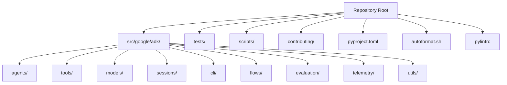
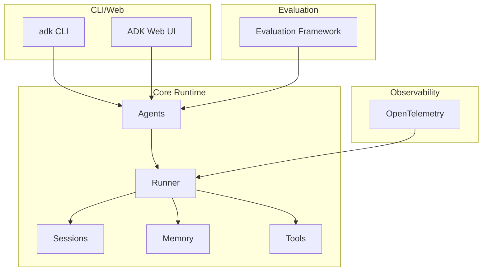
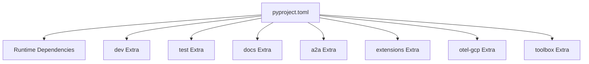

# Contributing and Development

<cite>
**Referenced Files in This Document**
- [CONTRIBUTING.md](file://CONTRIBUTING.md)
- [README.md](file://README.md)
- [pyproject.toml](file://pyproject.toml)
- [autoformat.sh](file://autoformat.sh)
- [pylintrc](file://pylintrc)
- [scripts/unittests.sh](file://scripts/unittests.sh)
- [scripts/db_migration.sh](file://scripts/db_migration.sh)
- [AGENTS.md](file://AGENTS.md)
- [contributing/README.md](file://contributing/README.md)
- [contributing/adk_project_overview_and_architecture.md](file://contributing/adk_project_overview_and_architecture.md)
- [contributing/samples/hello_world/agent.py](file://contributing/samples/hello_world/agent.py)
- [contributing/samples/hello_world/main.py](file://contributing/samples/hello_world/main.py)
- [contributing/samples/adk_answering_agent/README.md](file://contributing/samples/adk_answering_agent/README.md)
</cite>

## Table of Contents
1. [Introduction](#introduction)
2. [Project Structure](#project-structure)
3. [Core Components](#core-components)
4. [Architecture Overview](#architecture-overview)
5. [Detailed Component Analysis](#detailed-component-analysis)
6. [Dependency Analysis](#dependency-analysis)
7. [Performance Considerations](#performance-considerations)
8. [Troubleshooting Guide](#troubleshooting-guide)
9. [Conclusion](#conclusion)
10. [Appendices](#appendices)

## Introduction
This document provides comprehensive contributing and development guidance for the Agent Development Kit (ADK) Python project. It covers contribution guidelines, development setup, code standards, workflow, testing, pull request expectations, project structure, coding conventions, architectural principles, build and dependency management, release procedures, documentation standards, example contribution patterns, and community engagement practices.

## Project Structure
ADK is organized as a Python package with a clear separation between core source code, tests, CLI tooling, and contributor resources. The repository includes:
- Core library under src/google/adk/
- Tests under tests/ (unittests and integration)
- CLI and web server under src/google/adk/cli/
- Contributor resources and samples under contributing/
- Scripts for testing and migrations under scripts/

**Diagram sources**
- [pyproject.toml](file://pyproject.toml#L1-L228)
- [AGENTS.md](file://AGENTS.md#L79-L114)

**Section sources**
- [pyproject.toml](file://pyproject.toml#L1-L228)
- [AGENTS.md](file://AGENTS.md#L79-L114)

## Core Components
- Agents: Define identity, instructions, and tools; support multiple agent types (LLM, loop, parallel, sequential).
- Tools: Capabilities exposed to agents (Python functions, OpenAPI specs, MCP tools, Google APIs).
- Sessions: Conversation state management (in-memory, Vertex AI, Spanner).
- Memory: Long-term recall across sessions.
- Runner: Orchestrates the “Reason-Act” loop, manages LLM calls, tool execution, and event streaming.
- CLI and Web UI: Development and operational tooling (adk web, adk run, adk api_server, adk deploy).
- Evaluation: End-to-end evaluation framework with metrics and datasets.
- Telemetry: Observability and tracing (OpenTelemetry integrations).
- Utilities: Shared helpers for configuration, schema, and content handling.

**Section sources**
- [AGENTS.md](file://AGENTS.md#L17-L36)
- [AGENTS.md](file://AGENTS.md#L73-L114)

## Architecture Overview
ADK follows a code-first, modular, and deployment-agnostic design. The system emphasizes:
- Code-First: Everything defined in Python for versioning, testing, and IDE support.
- Modularity & Composition: Complex multi-agent systems composed from smaller, specialized agents.
- Deployment-Agnostic: Same agent logic runs locally, via API, or in the cloud.

**Diagram sources**
- [contributing/adk_project_overview_and_architecture.md](file://contributing/adk_project_overview_and_architecture.md#L5-L26)
- [AGENTS.md](file://AGENTS.md#L73-L114)

**Section sources**
- [contributing/adk_project_overview_and_architecture.md](file://contributing/adk_project_overview_and_architecture.md#L5-L26)
- [AGENTS.md](file://AGENTS.md#L73-L114)

## Detailed Component Analysis

### Development Workflow and Pull Request Process
- Contribution prerequisites:
  - Sign the Contributor License Agreement (CLA).
  - Follow community guidelines.
- Finding issues:
  - Use labels like “good first issue” and “help wanted”.
  - For other issues, coordinate with maintainers to avoid duplication.
- PR requirements:
  - Link to an issue (or describe the problem/feature in the PR).
  - Keep PRs focused and minimal.
  - Include a testing plan and verification evidence (logs/screenshots).
- Large or complex changes:
  - Open an issue first to gather feedback and alignment.
- Code review:
  - All submissions require review via GitHub pull requests.

**Section sources**
- [CONTRIBUTING.md](file://CONTRIBUTING.md#L20-L68)

### Development Setup and Environment
- Clone and initialize:
  - Use uv to create and activate a virtual environment (Python 3.10+ recommended).
  - Install dependencies with extras for development and testing.
- Quick-start commands:
  - Create venv, activate, sync with extras, run unit tests, and auto-format.
- Alternative:
  - Use the provided script to run unit tests across supported Python versions and restore the environment afterward.

**Section sources**
- [CONTRIBUTING.md](file://CONTRIBUTING.md#L132-L202)
- [scripts/unittests.sh](file://scripts/unittests.sh#L1-L119)

### Code Standards and Formatting
- Style guide:
  - Google Python Style Guide enforced by Pylint with the provided configuration.
- Formatting tools:
  - pyink (Google-style formatter), isort (import sorting).
- Pre-commit formatting:
  - Run the autoformat script to organize imports and format code across src/, tests/, and contributing/.
- Linting:
  - Pylint configuration enforces naming, docstrings, line length, and other style rules.

**Section sources**
- [CONTRIBUTING.md](file://CONTRIBUTING.md#L203-L211)
- [autoformat.sh](file://autoformat.sh#L1-L68)
- [pylintrc](file://pylintrc#L1-L401)

### Testing Requirements and Strategy
- Unit tests:
  - Located under tests/unittests/ and mirror the source structure.
  - Use pytest; aim for fast, isolated, descriptive tests.
  - Coverage should include new features, edge cases, and error conditions.
- Integration tests:
  - Validate agent logic and tool interactions.
- Evaluation tests:
  - End-to-end assessment with live LLMs using the Evaluation Framework.
- Manual E2E tests:
  - For UI/API/runner behaviors, capture screenshots/logs and label them in PRs.

**Section sources**
- [CONTRIBUTING.md](file://CONTRIBUTING.md#L79-L131)

### Build System and Dependency Management
- Build backend:
  - flit_core; package metadata and dynamic versioning.
- Dependencies:
  - Core runtime dependencies declared in pyproject.toml.
  - Optional extras for dev, test, eval, docs, extensions, and optional instrumentation.
- Scripts:
  - db_migration.sh automates Alembic-based session DB upgrades.
- Wheel build:
  - Use uv build to produce a distributable wheel; install locally for validation.

**Section sources**
- [pyproject.toml](file://pyproject.toml#L1-L228)
- [scripts/db_migration.sh](file://scripts/db_migration.sh#L1-L144)
- [CONTRIBUTING.md](file://CONTRIBUTING.md#L212-L245)

### Release Procedures and Versioning
- Versioning:
  - Adheres to Semantic Versioning 2.0.0.
- Public API surface:
  - Includes public classes/functions, built-in tools, persisted data schemas, API wire formats, CLI, and agent definition file structure.
- Breaking change criteria:
  - Any backward-incompatible change to the public API surface requires a major version bump.

**Section sources**
- [AGENTS.md](file://AGENTS.md#L410-L485)

### Documentation Standards
- Documentation updates:
  - For user-facing changes, open a PR in the adk-docs repository to keep documentation synchronized.
- Contributor documentation:
  - The contributing/ folder contains overview and architecture guidance for contributors.

**Section sources**
- [CONTRIBUTING.md](file://CONTRIBUTING.md#L125-L131)
- [contributing/README.md](file://contributing/README.md#L1-L17)

### Example Contribution Guidelines
- Minimal example agent:
  - A simple agent with tools and instructions demonstrates the agent definition pattern.
- Programmatic execution:
  - Example shows how to run an agent with an in-memory runner, stream events, and inspect session state.
- Sample agent modes:
  - The ADK Answering Agent sample illustrates interactive, batch, and GitHub Actions workflows.

**Section sources**
- [contributing/samples/hello_world/agent.py](file://contributing/samples/hello_world/agent.py#L67-L109)
- [contributing/samples/hello_world/main.py](file://contributing/samples/hello_world/main.py#L30-L104)
- [contributing/samples/adk_answering_agent/README.md](file://contributing/samples/adk_answering_agent/README.md#L1-L120)

### Community Engagement Practices
- Communication channels:
  - Reddit community, documentation site, and community repositories.
- Community contributions:
  - The adk-python-community repository hosts community-contributed tools and integrations.
- Governance:
  - Follow CLA and community guidelines; engage respectfully and constructively.

**Section sources**
- [README.md](file://README.md#L159-L167)
- [CONTRIBUTING.md](file://CONTRIBUTING.md#L22-L46)

## Dependency Analysis
ADK’s dependency model separates runtime, optional extensions, and development/testing tooling. The optional extras enable flexible setups for different workflows (dev, test, eval, docs, extensions).

**Diagram sources**
- [pyproject.toml](file://pyproject.toml#L86-L173)

**Section sources**
- [pyproject.toml](file://pyproject.toml#L86-L173)

## Performance Considerations
- Use uv for fast dependency resolution and consistent environments.
- Prefer real implementations in tests and mock only external dependencies to keep tests fast and reliable.
- Align local testing with CI configuration to catch regressions early.

[No sources needed since this section provides general guidance]

## Troubleshooting Guide
- Formatting failures:
  - Ensure isort and pyink are installed and run the autoformat script.
- Linting errors:
  - Review Pylint output and adjust per the provided configuration.
- Unit test failures:
  - Use the provided script to run tests across supported Python versions and restore the environment afterward.
- Database migrations:
  - Use the migration script to upgrade session DB schemas with Alembic.

**Section sources**
- [autoformat.sh](file://autoformat.sh#L1-L68)
- [pylintrc](file://pylintrc#L1-L401)
- [scripts/unittests.sh](file://scripts/unittests.sh#L1-L119)
- [scripts/db_migration.sh](file://scripts/db_migration.sh#L1-L144)

## Conclusion
This guide consolidates the essential practices for contributing to ADK: adhere to the style and testing standards, follow the contribution workflow, leverage the provided scripts and samples, and engage with the community. By doing so, contributors can efficiently deliver high-quality changes aligned with ADK’s architecture and principles.

[No sources needed since this section summarizes without analyzing specific files]

## Appendices

### Appendix A: Quick Reference
- Development setup: uv venv, uv sync --all-extras, pytest, autoformat.
- Testing: pytest with CI-aligned extras; manual E2E verification.
- Formatting: isort + pyink via autoformat.sh.
- Build: uv build; install wheel locally for validation.
- Migration: scripts/db_migration.sh for session DB upgrades.

**Section sources**
- [CONTRIBUTING.md](file://CONTRIBUTING.md#L132-L245)
- [scripts/unittests.sh](file://scripts/unittests.sh#L1-L119)
- [autoformat.sh](file://autoformat.sh#L1-L68)
- [scripts/db_migration.sh](file://scripts/db_migration.sh#L1-L144)