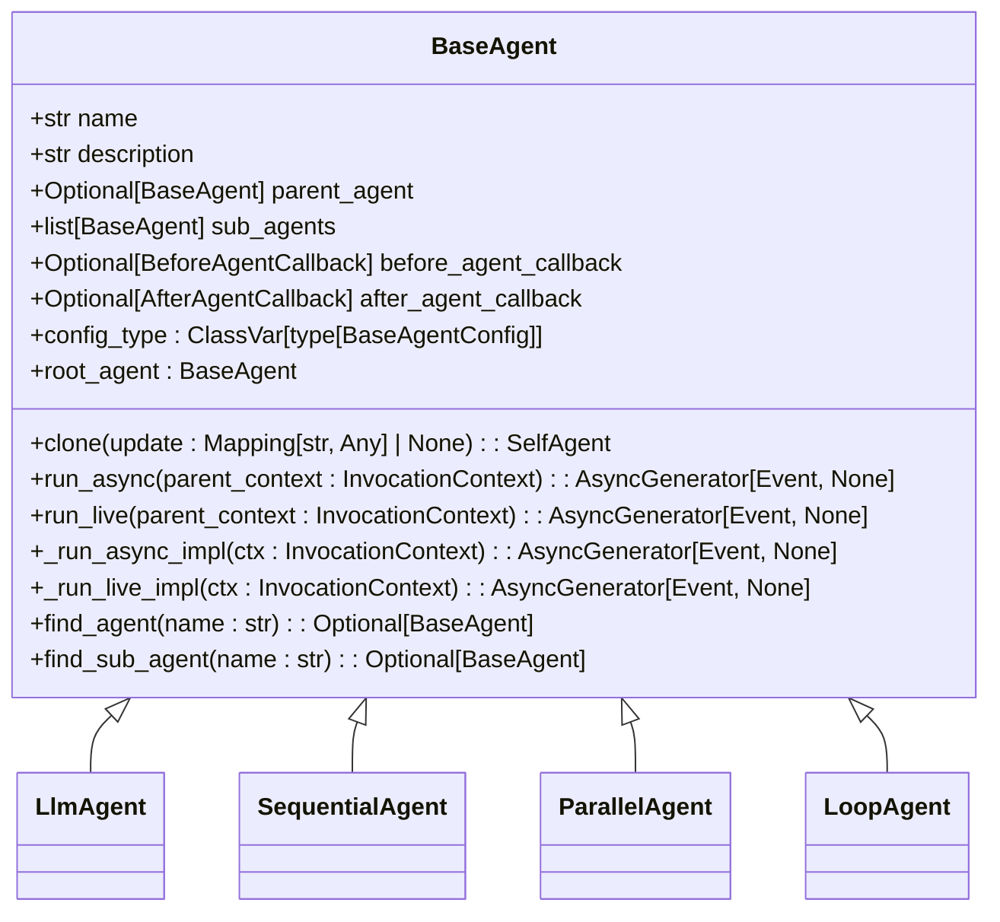
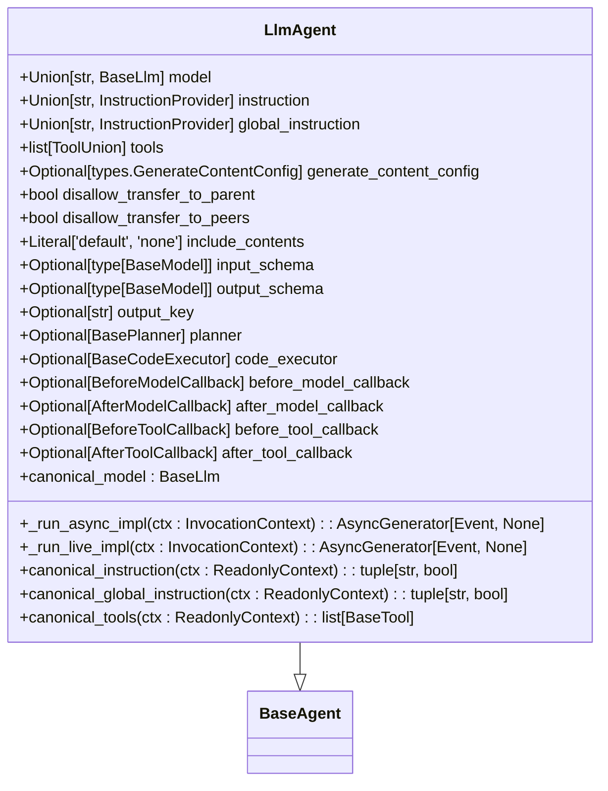
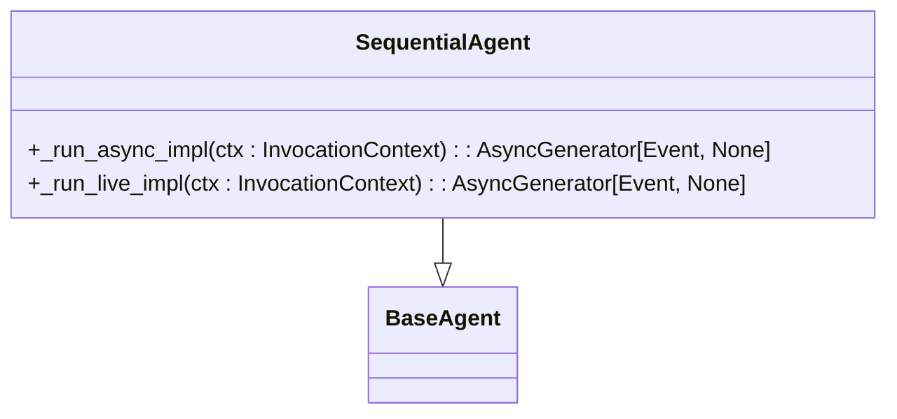
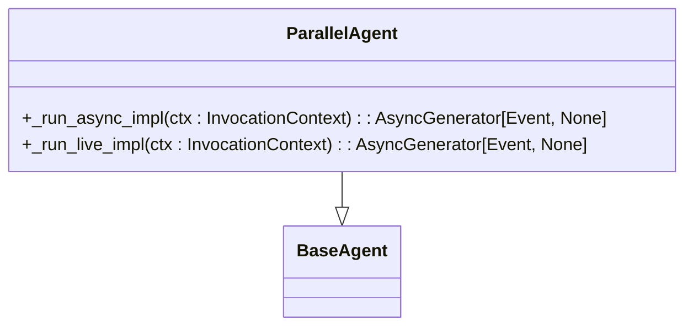
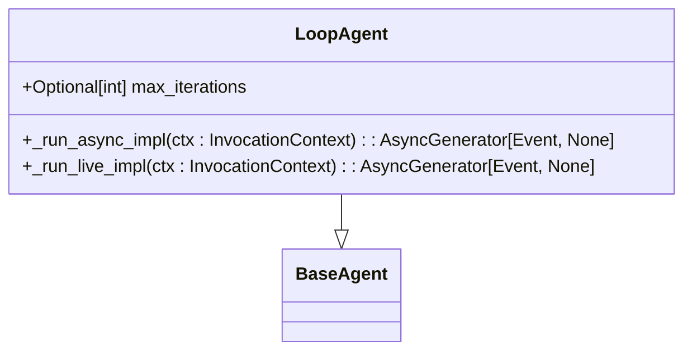
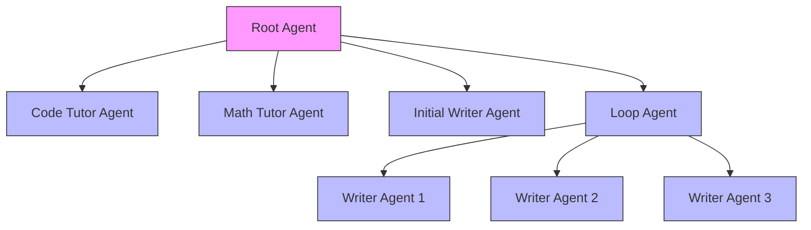
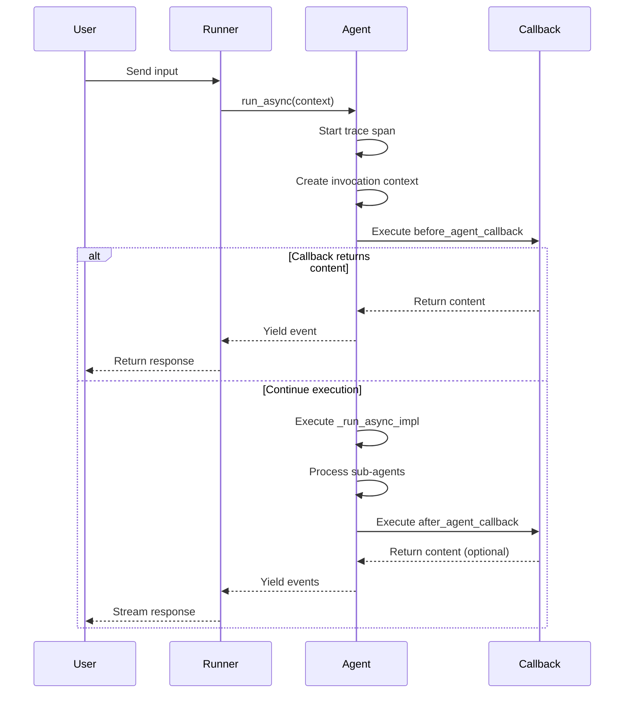

# Agents

<cite>
**Referenced Files in This Document**   
- [base_agent.py](file://src/google/adk/agents/base_agent.py)
- [llm_agent.py](file://src/google/adk/agents/llm_agent.py)
- [sequential_agent.py](file://src/google/adk/agents/sequential_agent.py)
- [parallel_agent.py](file://src/google/adk/agents/parallel_agent.py)
- [loop_agent.py](file://src/google/adk/agents/loop_agent.py)
- [base_agent_config.py](file://src/google/adk/agents/base_agent_config.py)
- [llm_agent_config.py](file://src/google/adk/agents/llm_agent_config.py)
- [sequential_agent_config.py](file://src/google/adk/agents/sequential_agent_config.py)
- [parallel_agent_config.py](file://src/google/adk/agents/parallel_agent_config.py)
- [loop_agent_config.py](file://src/google/adk/agents/loop_agent_config.py)
- [agent.py](file://contributing/samples/hello_world/agent.py)
- [root_agent.yaml](file://contributing/samples/multi_agent_basic_config/root_agent.yaml)
</cite>

## Table of Contents
1. [Introduction](#introduction)
2. [BaseAgent Architecture](#baseagent-architecture)
3. [Agent Types](#agent-types)
   - [LlmAgent](#llmagent)
   - [SequentialAgent](#sequentialagent)
   - [ParallelAgent](#parallelagent)
   - [LoopAgent](#loopagent)
4. [Agent Composition and Nesting](#agent-composition-and-nesting)
5. [Agent Lifecycle and Execution](#agent-lifecycle-and-execution)
6. [Configuration and Instantiation](#configuration-and-instantiation)
7. [Input Handling and State Management](#input-handling-and-state-management)
8. [Error Handling and Performance Considerations](#error-handling-and-performance-considerations)
9. [Conclusion](#conclusion)

## Introduction

The Agents concept in the ADK (Agent Development Kit) framework provides a comprehensive system for creating intelligent, autonomous agents that can interact with users, process information, and perform complex tasks. At the core of this system is the BaseAgent class, which serves as the foundation for all agent types in the framework. Agents are designed to be modular, composable components that can be configured and orchestrated to create sophisticated AI applications.

The framework supports various agent types, each designed for specific use cases and execution patterns. These include LlmAgent for language model interactions, SequentialAgent for step-by-step processing, ParallelAgent for concurrent execution, and LoopAgent for iterative tasks. The agent system is built on a hierarchical architecture that allows agents to be nested and chained together, creating complex workflows and multi-agent systems.

Agents in the ADK framework handle input events through a well-defined lifecycle, maintain internal state across interactions, and produce responses through a streaming event system. The framework provides robust mechanisms for configuration, instantiation, and execution, supporting both programmatic and declarative (YAML-based) approaches. This documentation provides a comprehensive overview of the agents concept, detailing the architecture, implementation, and usage patterns within the ADK framework.

**Section sources**
- [base_agent.py](file://src/google/adk/agents/base_agent.py#L71-L612)
- [llm_agent.py](file://src/google/adk/agents/llm_agent.py#L124-L638)

## BaseAgent Architecture

The BaseAgent class serves as the foundational building block for all agent types in the ADK framework. As a Pydantic BaseModel, it provides a structured and type-safe foundation for agent implementation. The class is designed with extensibility in mind, allowing subclasses to inherit core functionality while implementing specialized behavior.

Key architectural components of the BaseAgent include:

- **Core Properties**: The agent has essential properties such as `name` (a unique identifier), `description` (capability description), `parent_agent` (hierarchical relationship), and `sub_agents` (composition capability). The name must be a valid Python identifier and cannot be "user" as it's reserved for end-user input.

- **Lifecycle Methods**: The class defines two primary entry methods: `run_async` for text-based conversations and `run_live` for audio/video-based conversations. Both methods are decorated with `@final`, preventing subclasses from overriding them directly, ensuring consistent execution patterns across all agent types.

- **Extensible Implementation**: Subclasses must implement the abstract `_run_async_impl` and `_run_live_impl` methods, which contain the core logic for agent execution. This design pattern ensures that all agents follow a consistent interface while allowing for specialized behavior.

- **Callback System**: The BaseAgent supports before and after callbacks (`before_agent_callback` and `after_agent_callback`) that can modify agent behavior or intercept execution. These callbacks can be single functions or lists of functions, executed in order until one returns a non-None value.

- **Hierarchical Navigation**: The class provides methods like `find_agent` and `find_sub_agent` for navigating the agent tree, and the `root_agent` property for accessing the root of the hierarchy. This enables agents to discover and interact with other agents in the tree.

- **Cloning Mechanism**: The `clone` method allows for creating copies of agent instances with optional field updates, facilitating agent reuse and configuration variations without affecting the original instance.

The BaseAgent's architecture emphasizes composition, inheritance, and extensibility, forming a solid foundation for the various specialized agent types in the framework.



**Diagram sources**
- [base_agent.py](file://src/google/adk/agents/base_agent.py#L71-L612)

**Section sources**
- [base_agent.py](file://src/google/adk/agents/base_agent.py#L71-L612)

## Agent Types

The ADK framework provides several specialized agent types, each designed for specific execution patterns and use cases. These agent types inherit from the BaseAgent class and implement the core `_run_async_impl` and `_run_live_impl` methods to define their unique behavior.

### LlmAgent

The LlmAgent is designed for language model interactions and serves as the primary interface for working with large language models. It extends the BaseAgent with LLM-specific functionality:

- **Model Integration**: Supports both direct model specification (by name) and inheritance from parent agents, enabling flexible model configuration across agent hierarchies.

- **Instruction System**: Provides both local `instruction` (for the agent itself) and global `global_instruction` (for the entire agent tree) properties, allowing for fine-grained control over agent behavior.

- **Tool Integration**: Supports a comprehensive tool system through the `tools` property, which can include function tools, toolsets, and other callable objects. The agent can execute code blocks from model responses using the provided code executor.

- **Advanced Features**: Includes support for planning (step-by-step execution), code execution, and output schema enforcement. The agent can be configured to disallow transfers to parent or peer agents when output schema is specified.

- **Callback System**: Extends the base callback system with model-specific callbacks (`before_model_callback`, `after_model_callback`) and tool-specific callbacks (`before_tool_callback`, `after_tool_callback`).

The LlmAgent is the most feature-rich agent type, designed to handle complex conversational AI scenarios and integrate with various external systems through tools.



**Diagram sources**
- [llm_agent.py](file://src/google/adk/agents/llm_agent.py#L124-L638)

**Section sources**
- [llm_agent.py](file://src/google/adk/agents/llm_agent.py#L124-L638)

### SequentialAgent

The SequentialAgent is designed for step-by-step processing, executing its sub-agents in a predetermined sequence. This agent type is ideal for workflows that require a specific order of operations or when each step depends on the output of the previous step.

Key characteristics of the SequentialAgent include:

- **Sequential Execution**: The agent processes its sub-agents one after another, ensuring that each agent completes before the next one begins. This creates a linear workflow pattern.

- **Live Mode Adaptation**: In live mode (audio/video conversations), the agent adds a `task_completed` function to LlmAgent sub-agents, allowing the model to signal when it has completed its task and the agent should move to the next step.

- **Simple Orchestration**: The agent provides a straightforward way to chain multiple agents together, making it easy to create multi-step workflows without complex coordination logic.

- **Error Propagation**: If any sub-agent fails or raises an exception, the execution stops, and the error propagates up the call stack, ensuring that issues are not silently ignored.

The SequentialAgent is particularly useful for creating tutorial flows, multi-step assistants, or any scenario where tasks need to be completed in a specific order.



**Diagram sources**
- [sequential_agent.py](file://src/google/adk/agents/sequential_agent.py#L34-L87)

**Section sources**
- [sequential_agent.py](file://src/google/adk/agents/sequential_agent.py#L34-L87)

### ParallelAgent

The ParallelAgent is designed for concurrent execution, running its sub-agents in parallel in isolated environments. This agent type is ideal for scenarios that benefit from multiple perspectives or simultaneous processing.

Key features of the ParallelAgent include:

- **Concurrent Execution**: All sub-agents run simultaneously, allowing for faster processing when tasks can be performed in parallel.

- **Isolated Branching**: Each sub-agent runs in its own isolated branch, preventing interference between agents and ensuring clean separation of concerns.

- **Event Merging**: The agent uses a sophisticated event merging system that combines events from all sub-agents into a single stream, maintaining proper ordering and synchronization.

- **Task Group Management**: Utilizes asyncio.TaskGroup for efficient task management and cancellation, with a fallback implementation for Python versions prior to 3.11.

- **Limited Live Support**: Currently, live mode is not supported for ParallelAgent, reflecting the complexity of managing concurrent audio/video streams.

The ParallelAgent is particularly useful for generating multiple responses for comparison, running different algorithms on the same input, or when multiple independent tasks need to be performed simultaneously.



**Diagram sources**
- [parallel_agent.py](file://src/google/adk/agents/parallel_agent.py#L161-L204)

**Section sources**
- [parallel_agent.py](file://src/google/adk/agents/parallel_agent.py#L161-L204)

### LoopAgent

The LoopAgent is designed for iterative tasks, repeatedly executing its sub-agents until a termination condition is met. This agent type is ideal for scenarios that require repeated processing or refinement.

Key characteristics of the LoopAgent include:

- **Iterative Execution**: The agent runs through its sub-agents in a loop, repeating the cycle until a sub-agent escalates or the maximum number of iterations is reached.

- **Termination Conditions**: The loop can be terminated either by a sub-agent setting the escalate flag in an event, or by reaching the maximum number of iterations specified in the configuration.

- **Flexible Iteration Limits**: The `max_iterations` property can be set to a specific number or left as None, in which case the loop will continue indefinitely until a sub-agent escalates.

- **Simple Control Flow**: Provides a straightforward way to implement retry logic, iterative refinement, or any process that requires repeated execution.

- **Limited Live Support**: Currently, live mode is not supported for LoopAgent, reflecting the complexity of managing iterative audio/video conversations.

The LoopAgent is particularly useful for implementing retry mechanisms, iterative improvement processes, or any scenario where tasks need to be repeated until a specific condition is met.



**Diagram sources**
- [loop_agent.py](file://src/google/adk/agents/loop_agent.py#L37-L93)

**Section sources**
- [loop_agent.py](file://src/google/adk/agents/loop_agent.py#L37-L93)

## Agent Composition and Nesting

The ADK framework supports sophisticated agent composition patterns, allowing agents to be nested and chained together to create complex workflows and multi-agent systems. This compositional approach enables the creation of hierarchical agent structures that can handle increasingly complex tasks.

### Hierarchical Agent Trees

Agents can be organized into hierarchical trees through the `sub_agents` property, which accepts a list of agent instances. This creates a parent-child relationship where the parent agent orchestrates the execution of its children. The hierarchy can be multiple levels deep, allowing for sophisticated organizational structures.

For example, a root agent might coordinate several specialized agents, each of which could have their own sub-agents for specific tasks. This pattern is demonstrated in the multi_agent_basic_config sample, where a root agent delegates coding questions to a code_tutor_agent and math questions to a math_tutor_agent.

### Agent Chaining

Agents can be chained together to create sequential workflows. This can be achieved through several mechanisms:

- **SequentialAgent**: Explicitly designed for chaining agents in a specific order, ensuring each agent completes before the next begins.

- **Sub-agent Delegation**: An LlmAgent can be configured to transfer control to specific sub-agents based on the user's request, creating a dynamic chaining mechanism.

- **Callback-Driven Chaining**: Before and after callbacks can be used to trigger the execution of other agents, creating conditional or event-driven chains.

### Configuration-Based Composition

The framework supports declarative agent composition through YAML configuration files. The agent configuration schema allows for specifying sub-agents via `config_path`, enabling modular design where different agent components can be defined in separate files and composed at runtime.

This approach is particularly powerful for large systems, as it allows teams to work on different agent components independently while maintaining a clear composition structure. The configuration system also supports agent references, allowing for reuse of agent definitions across multiple compositions.

### Dynamic Composition

Agents can also be composed programmatically at runtime, allowing for dynamic workflow creation based on user input or system state. This flexibility enables adaptive systems that can modify their structure and behavior in response to changing conditions.

The combination of static configuration and dynamic composition provides a powerful toolkit for creating both stable, well-defined workflows and flexible, adaptive systems.



**Diagram sources**
- [root_agent.yaml](file://contributing/samples/multi_agent_basic_config/root_agent.yaml#L1-L18)
- [root_agent.yaml](file://contributing/samples/multi_agent_loop_config/root_agent.yaml#L1-L8)

**Section sources**
- [base_agent.py](file://src/google/adk/agents/base_agent.py#L110-L120)
- [sequential_agent.py](file://src/google/adk/agents/sequential_agent.py#L40-L48)

## Agent Lifecycle and Execution

The agent lifecycle in the ADK framework follows a well-defined pattern that ensures consistent behavior across all agent types. Understanding this lifecycle is crucial for effectively implementing and using agents in the system.

### Execution Flow

The agent execution flow begins with the `run_async` or `run_live` methods, which serve as the entry points for agent execution. These methods are decorated with `@final`, ensuring that all agents follow the same high-level execution pattern.

The execution flow proceeds as follows:
1. Start an OpenTelemetry trace span for monitoring and debugging
2. Create an invocation context for the agent
3. Execute before-agent callbacks
4. If callbacks return content, yield the event and terminate
5. Execute the agent's core implementation (`_run_async_impl` or `_run_live_impl`)
6. Execute after-agent callbacks
7. Yield any callback-generated events

This flow ensures that all agents have consistent behavior regarding tracing, context management, and callback execution, while allowing subclasses to implement their specific logic in the implementation methods.

### Context Management

The InvocationContext plays a crucial role in the agent lifecycle, providing the execution context for each agent invocation. This context contains information such as the current agent, session state, plugin manager, and other runtime data.

Agents create their own invocation context by copying the parent context and updating it with their own reference. This ensures that each agent has access to the necessary runtime information while maintaining isolation from other agent invocations.

### Event Streaming

Agents produce responses through an asynchronous generator that yields Event objects. This streaming approach allows for real-time response generation and enables the system to handle long-running operations efficiently.

The event system supports various types of events, including:
- Content events (model responses)
- Tool call events
- State update events
- Escalation events (to transfer control)

This flexible event model enables rich interactions between agents and the system, supporting complex conversational patterns and multi-step workflows.

### Error Handling

The framework includes robust error handling mechanisms to ensure reliable agent execution. The use of async context managers (Aclosing) ensures that resources are properly cleaned up even if an error occurs during execution.

Additionally, the callback system provides a mechanism for intercepting and handling errors at various points in the execution flow, allowing for graceful degradation and recovery from failures.



**Diagram sources**
- [base_agent.py](file://src/google/adk/agents/base_agent.py#L214-L249)
- [base_agent.py](file://src/google/adk/agents/base_agent.py#L252-L284)

**Section sources**
- [base_agent.py](file://src/google/adk/agents/base_agent.py#L214-L284)

## Configuration and Instantiation

The ADK framework provides flexible mechanisms for configuring and instantiating agents, supporting both programmatic and declarative approaches. This dual approach allows developers to choose the method that best fits their use case and development workflow.

### Programmatic Instantiation

Agents can be instantiated directly in Python code by creating instances of the appropriate agent classes. This approach provides maximum flexibility and is ideal for dynamic agent creation or when agent configuration depends on runtime conditions.

For example, the hello_world sample demonstrates programmatic instantiation of an LlmAgent with specific model, tools, and configuration:

```python
root_agent = Agent(
    model='gemini-2.0-flash',
    name='hello_world_agent',
    description='hello world agent that can roll a dice of 8 sides and check prime numbers.',
    instruction="""You roll dice and answer questions about the outcome...""",
    tools=[roll_die, check_prime],
    generate_content_config=types.GenerateContentConfig(
        safety_settings=[
            types.SafetySetting(
                category=types.HarmCategory.HARM_CATEGORY_DANGEROUS_CONTENT,
                threshold=types.HarmBlockThreshold.OFF,
            ),
        ]
    ),
)
```

This approach allows for complex logic in agent creation, including conditional configuration, dynamic tool selection, and runtime parameter calculation.

### Declarative Configuration

The framework also supports declarative agent configuration through YAML files. This approach is ideal for static agent definitions, team collaboration, and version control of agent configurations.

The YAML configuration follows a schema defined in AgentConfig.json and includes properties such as:
- `agent_class`: The type of agent to instantiate
- `name`: The agent's name
- `description`: A description of the agent's capabilities
- `model`: The language model to use (for LlmAgent)
- `instruction`: Instructions for the agent's behavior
- `sub_agents`: References to sub-agent configuration files
- Various agent-specific properties

The multi_agent_basic_config sample demonstrates this approach with a root agent configuration that delegates to specialized code and math tutors:

```yaml
agent_class: LlmAgent
model: gemini-2.5-flash
name: root_agent
description: Learning assistant that provides tutoring in code and math.
instruction: |
  You are a learning assistant that helps students with coding and math questions.
  
  You delegate coding questions to the code_tutor_agent and math questions to the math_tutor_agent.
  
  Follow these steps:
  1. If the user asks about programming or coding, delegate to the code_tutor_agent.
  2. If the user asks about math concepts or problems, delegate to the math_tutor_agent.
  3. Always provide clear explanations and encourage learning.
sub_agents:
  - config_path: code_tutor_agent.yaml
  - config_path: math_tutor_agent.yaml
```

### Configuration Loading

The framework provides mechanisms for loading agents from configuration files through the `from_config` class method. This method reads the YAML configuration, resolves any agent references, and instantiates the appropriate agent class with the specified properties.

The configuration system supports advanced features such as:
- Agent references (via config_path)
- Code references (for importing classes and functions)
- Callback configuration
- Tool configuration with parameters

This comprehensive configuration system enables the creation of complex agent hierarchies and workflows while maintaining a clean separation between code and configuration.

**Section sources**
- [agent.py](file://contributing/samples/hello_world/agent.py#L67-L109)
- [root_agent.yaml](file://contributing/samples/multi_agent_basic_config/root_agent.yaml#L1-L18)
- [base_agent.py](file://src/google/adk/agents/base_agent.py#L536-L556)

## Input Handling and State Management

Effective input handling and state management are critical for creating responsive and context-aware agents. The ADK framework provides comprehensive mechanisms for processing input events and maintaining internal state across interactions.

### Input Event Processing

Agents receive input through the invocation context, which contains the user's input and other relevant information. The input is processed through the agent's execution flow, with opportunities for interception and modification at various points:

- **Before-agent callbacks**: Can inspect and modify the input before the agent processes it
- **Model preprocessing**: LlmAgent can modify the model request before it's sent to the LLM
- **Tool input validation**: Tools can validate and transform input parameters before execution

The framework supports various input types, including text, audio, and video, with appropriate processing pipelines for each modality.

### State Management

Agents maintain internal state through the session state system, which persists across interactions. This state can be used to:
- Store conversation history
- Track user preferences
- Maintain context between turns
- Share data between agents

The state system is accessible through the invocation context and can be modified by agents and tools. The LlmAgent's `output_key` property provides a convenient way to store the agent's output in the state for later use.

State changes are tracked through the event system, with state deltas included in events. This enables the system to maintain a complete record of state changes and support features like undo/redo or state inspection.

### Context Preservation

The framework ensures that context is preserved across agent boundaries through the hierarchical agent tree. When control is transferred between agents, the invocation context is passed along, maintaining continuity of information.

The `include_contents` property of LlmAgent controls how much conversation history is included in model requests, allowing for fine-grained control over context preservation. The options are:
- `default`: Model receives relevant conversation history
- `none`: Model receives no prior history, operating solely on current instruction and input

This flexibility enables agents to balance context awareness with focus on the current task.

### Memory and History

For long-term context preservation, the framework supports memory systems that can store and retrieve information across sessions. This is particularly useful for maintaining user preferences, storing important facts, or building knowledge bases.

The state system works in conjunction with these memory systems, providing a comprehensive solution for context management at different timescales.

**Section sources**
- [llm_agent.py](file://src/google/adk/agents/llm_agent.py#L446-L477)
- [base_agent.py](file://src/google/adk/agents/base_agent.py#L384-L440)
- [llm_agent.py](file://src/google/adk/agents/llm_agent.py#L173-L180)

## Error Handling and Performance Considerations

Robust error handling and performance optimization are essential for creating reliable and efficient agent systems. The ADK framework provides mechanisms to address common issues and ensure optimal performance in complex agent workflows.

### Error Handling Strategies

The framework employs several error handling strategies to ensure reliable agent execution:

- **Exception Propagation**: Exceptions are propagated up the call stack, ensuring that errors are not silently ignored. This allows higher-level components to handle errors appropriately.

- **Graceful Degradation**: When an agent or tool fails, the system can often continue execution by skipping the failed component or using alternative approaches.

- **Retry Mechanisms**: The LoopAgent provides a built-in mechanism for retrying operations, which can be combined with error detection to create resilient workflows.

- **Fallback Strategies**: Agents can be configured with fallback agents or alternative approaches when primary methods fail.

- **Comprehensive Logging**: The framework includes detailed logging to aid in debugging and monitoring agent behavior.

### Performance Optimization

Several performance considerations are important when orchestrating complex agent workflows:

- **Concurrency**: The ParallelAgent enables concurrent execution of independent tasks, reducing overall processing time.

- **Resource Management**: The use of async generators and context managers ensures efficient resource utilization and prevents memory leaks.

- **Caching**: Implementing caching strategies for expensive operations (like model calls or database queries) can significantly improve performance.

- **Batching**: When possible, batch multiple operations together to reduce overhead.

- **Lazy Loading**: Load agent configurations and resources only when needed to reduce startup time.

### Scalability Considerations

When designing agent systems, consider the following scalability factors:

- **Agent Hierarchy Depth**: Deep hierarchies can increase latency and complexity. Consider flattening hierarchies when possible.

- **Sub-agent Count**: Large numbers of sub-agents can impact performance. Consider grouping related agents or using more efficient orchestration patterns.

- **State Size**: Large state objects can impact performance and memory usage. Regularly clean up unused state data.

- **Tool Complexity**: Complex tools with many parameters or dependencies can slow down execution. Optimize tool design for performance.

### Best Practices

To ensure reliable and performant agent systems:

- **Implement Comprehensive Testing**: Test agents thoroughly with various inputs and edge cases.

- **Monitor Performance**: Use the built-in OpenTelemetry integration to monitor agent performance and identify bottlenecks.

- **Use Appropriate Agent Types**: Choose the right agent type for your use case (e.g., SequentialAgent for linear workflows, ParallelAgent for independent tasks).

- **Manage State Carefully**: Be mindful of what data is stored in state and for how long.

- **Handle Errors Gracefully**: Implement appropriate error handling and recovery strategies.

- **Optimize Configuration**: Use configuration files for static agents and programmatic instantiation for dynamic ones.

These considerations help ensure that agent systems are not only functional but also reliable, efficient, and maintainable.

**Section sources**
- [base_agent.py](file://src/google/adk/agents/base_agent.py#L228-L249)
- [parallel_agent.py](file://src/google/adk/agents/parallel_agent.py#L174-L197)
- [loop_agent.py](file://src/google/adk/agents/loop_agent.py#L55-L72)

## Conclusion

The Agents concept in the ADK framework provides a comprehensive and flexible system for creating intelligent, autonomous agents. The BaseAgent class serves as a robust foundation, offering a consistent interface and lifecycle management for all agent types. The framework's support for various agent types—LlmAgent, SequentialAgent, ParallelAgent, and LoopAgent—enables the creation of sophisticated AI applications with diverse execution patterns.

Key strengths of the agent system include its compositional architecture, which allows for nesting and chaining agents to create complex workflows, and its flexible configuration system that supports both programmatic and declarative approaches. The framework's emphasis on input handling, state management, and error handling ensures that agents can maintain context, respond appropriately to user input, and recover gracefully from failures.

The agent lifecycle, with its well-defined execution flow and event streaming capabilities, enables responsive and efficient agent behavior. Performance considerations such as concurrency, resource management, and scalability are addressed through thoughtful design and implementation.

Overall, the ADK framework's Agents concept provides a powerful toolkit for building advanced AI applications, combining flexibility, reliability, and performance in a cohesive system. By understanding and leveraging these components, developers can create sophisticated agent-based solutions that meet complex real-world requirements.