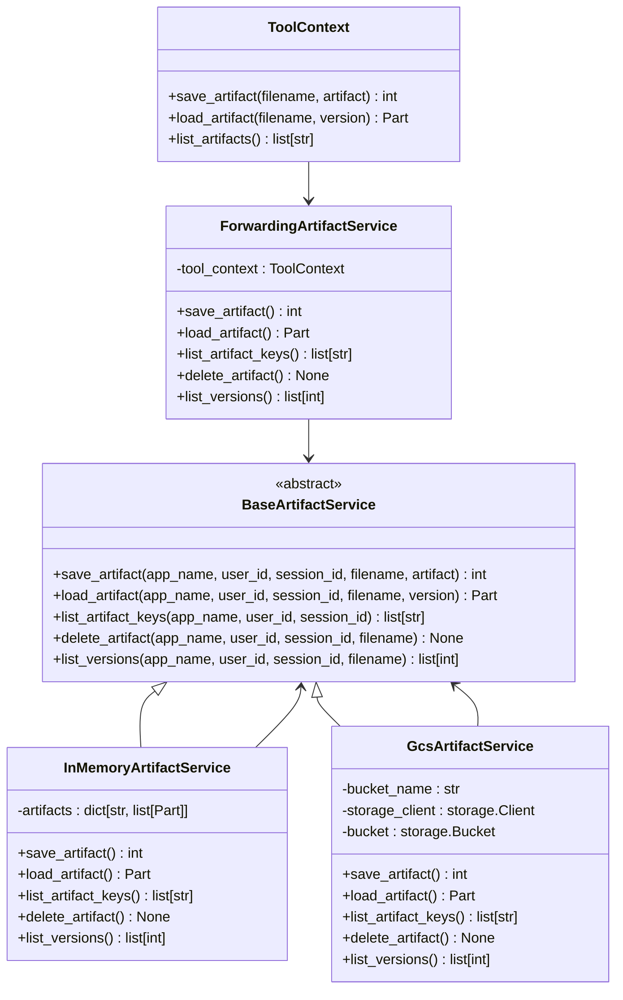
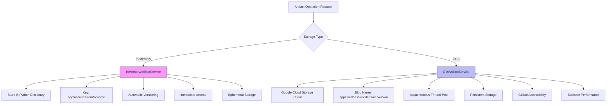
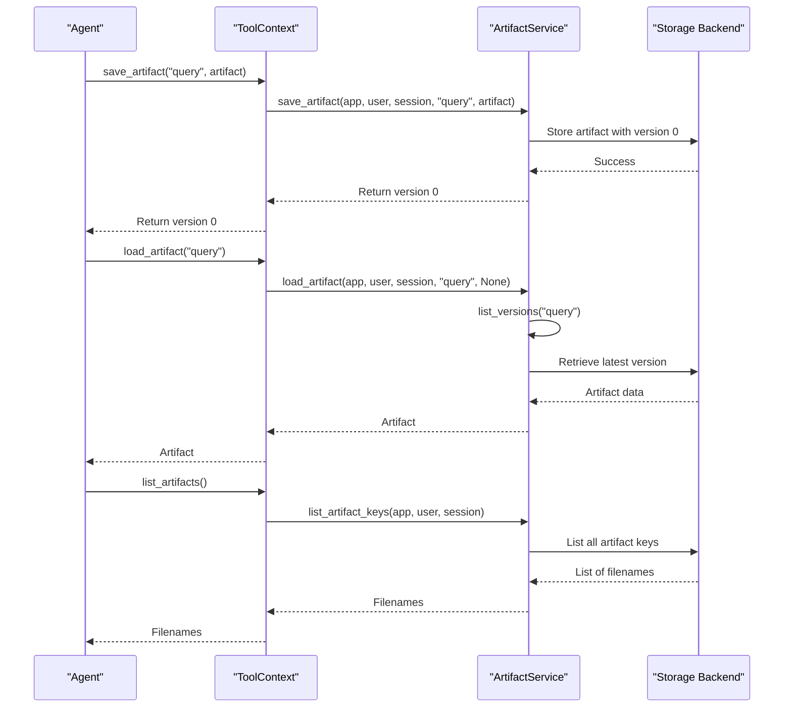

# Artifacts

<cite>
**Referenced Files in This Document**   
- [base_artifact_service.py](file://src/google/adk/artifacts/base_artifact_service.py)
- [in_memory_artifact_service.py](file://src/google/adk/artifacts/in_memory_artifact_service.py)
- [gcs_artifact_service.py](file://src/google/adk/artifacts/gcs_artifact_service.py)
- [load_artifacts_tool.py](file://src/google/adk/tools/load_artifacts_tool.py)
- [agent.py](file://contributing/samples/artifact_save_text/agent.py)
- [test_artifact_service.py](file://tests/unittests/artifacts/test_artifact_service.py)
- [tool_context.py](file://src/google/adk/tools/tool_context.py)
- [_forwarding_artifact_service.py](file://src/google/adk/tools/_forwarding_artifact_service.py)
</cite>

## Table of Contents
1. [Introduction](#introduction)
2. [Artifact System Architecture](#artifact-system-architecture)
3. [Artifact Service Implementations](#artifact-service-implementations)
4. [Artifact Lifecycle Management](#artifact-lifecycle-management)
5. [Metadata and Access Control](#metadata-and-access-control)
6. [Practical Usage Patterns](#practical-usage-patterns)
7. [Performance Considerations](#performance-considerations)
8. [Common Issues and Optimization](#common-issues-and-optimization)

## Introduction

The Artifacts system in the ADK framework provides a comprehensive solution for managing non-textual data such as files, images, and binary content. This system enables agents to persistently store, retrieve, and share data across sessions while maintaining proper access control and versioning. The architecture supports multiple storage backends, allowing developers to choose between transient in-memory storage for development and testing, and persistent Google Cloud Storage (GCS) for production environments. The system is designed to handle various data types through MIME type identification and provides robust mechanisms for version control, metadata management, and access patterns between agents.

**Section sources**
- [base_artifact_service.py](file://src/google/adk/artifacts/base_artifact_service.py#L23-L124)

## Artifact System Architecture

The Artifact system follows a modular architecture with a clear separation between the interface and implementation layers. At its core is the `BaseArtifactService` abstract class that defines the contract for all artifact operations, ensuring consistent behavior across different storage implementations. The system integrates with the agent framework through the `ToolContext`, which provides a simplified interface for agents to interact with artifacts without needing to understand the underlying storage mechanism.



**Diagram sources**
- [base_artifact_service.py](file://src/google/adk/artifacts/base_artifact_service.py#L23-L124)
- [in_memory_artifact_service.py](file://src/google/adk/artifacts/in_memory_artifact_service.py#L29-L137)
- [gcs_artifact_service.py](file://src/google/adk/artifacts/gcs_artifact_service.py#L38-L287)
- [tool_context.py](file://src/google/adk/tools/tool_context.py#L31-L81)
- [_forwarding_artifact_service.py](file://src/google/adk/tools/_forwarding_artifact_service.py#L29-L97)

## Artifact Service Implementations

The ADK framework provides two primary implementations of the artifact service: in-memory storage for transient data and Google Cloud Storage (GCS) integration for persistent storage. The `InMemoryArtifactService` is designed for development and testing purposes, storing artifacts in a Python dictionary structure with session-based scoping. This implementation is not suitable for multi-threaded production environments but offers zero-latency access and automatic cleanup when the process terminates.

The `GcsArtifactService` provides a production-ready implementation that leverages Google Cloud Storage for durable, scalable, and globally accessible artifact storage. This service handles asynchronous operations through thread pooling, ensuring that I/O operations do not block the main execution thread. The GCS implementation follows a hierarchical naming convention that incorporates application name, user ID, session ID, filename, and version number, enabling efficient querying and access control. Both implementations adhere to the same interface, allowing seamless switching between storage backends without requiring changes to agent code.



**Diagram sources**
- [in_memory_artifact_service.py](file://src/google/adk/artifacts/in_memory_artifact_service.py#L29-L137)
- [gcs_artifact_service.py](file://src/google/adk/artifacts/gcs_artifact_service.py#L38-L287)

**Section sources**
- [in_memory_artifact_service.py](file://src/google/adk/artifacts/in_memory_artifact_service.py#L29-L137)
- [gcs_artifact_service.py](file://src/google/adk/artifacts/gcs_artifact_service.py#L38-L287)

## Artifact Lifecycle Management

The artifact lifecycle in the ADK framework encompasses creation, versioning, retrieval, and deletion operations. Each artifact is uniquely identified by a combination of application name, user ID, session ID, and filename, with version numbers automatically incremented on each save operation. The first version of an artifact has a revision ID of 0, which increments by 1 after each successful save. When retrieving artifacts, callers can specify a particular version or request the latest version by omitting the version parameter.

The system supports comprehensive lifecycle operations including listing all artifacts within a session, retrieving all available versions of a specific artifact, and deleting artifacts along with all their versions. The `list_artifact_keys` method returns all filenames within a session, while `list_versions` provides the complete version history for a specific artifact. Deletion operations remove all versions of an artifact, ensuring complete cleanup. The architecture ensures atomic operations and consistent state management across all lifecycle stages.



**Diagram sources**
- [base_artifact_service.py](file://src/google/adk/artifacts/base_artifact_service.py#L23-L124)
- [tool_context.py](file://src/google/adk/tools/tool_context.py#L31-L81)

**Section sources**
- [base_artifact_service.py](file://src/google/adk/artifacts/base_artifact_service.py#L23-L124)
- [test_artifact_service.py](file://tests/unittests/artifacts/test_artifact_service.py#L153-L279)

## Metadata and Access Control

The Artifact system incorporates metadata management and access control through its hierarchical naming structure and context-based permissions. Each artifact is scoped to a specific application, user, and session, ensuring proper isolation and access control. The system supports two types of artifact scoping: session-scoped files that follow the path pattern `{app_name}/{user_id}/{session_id}/{filename}/{version}`, and user-namespaced files that use the pattern `{app_name}/{user_id}/user/{filename}/{version}` for files that persist across sessions.

Metadata is managed through the artifact's MIME type, which is preserved during storage and retrieval operations. The system automatically handles versioning, with each save operation creating a new version and returning the updated revision ID. Access control is enforced at the service level, where operations require valid application, user, and session identifiers. The architecture prevents unauthorized access by validating these identifiers on every operation, ensuring that users can only access artifacts within their authorized scope.

**Section sources**
- [gcs_artifact_service.py](file://src/google/adk/artifacts/gcs_artifact_service.py#L15-L22)
- [in_memory_artifact_service.py](file://src/google/adk/artifacts/in_memory_artifact_service.py#L38-L67)

## Practical Usage Patterns

The Artifact system supports various practical usage patterns for agent development, including data persistence, inter-agent communication, and content sharing. The `load_artifacts_tool.py` demonstrates a common pattern where agents can automatically load available artifacts into the LLM context when requested by users. This tool monitors the available artifacts and instructs the model to call the `load_artifacts` function when relevant files are present.

A simple example in `artifact_save_text/agent.py` shows how agents can save text queries as artifacts with MIME type "text/plain". This pattern enables agents to maintain a history of user interactions and reference previous inputs in subsequent conversations. The system also supports sharing artifacts between agents by storing them in user-namespaced locations that can be accessed across different sessions. These patterns facilitate complex workflows where multiple agents collaborate on tasks, each contributing to and building upon shared data artifacts.

```mermaid
flowchart LR
A[User Query] --> B[Agent Processes Query]
B --> C{Should Save?}
C --> |Yes| D[Create Part with inline_data]
D --> E[Set MIME type and data]
E --> F[Call save_artifact()]
F --> G[Artifact Stored with Version]
G --> H[Return Version ID]
H --> I[Agent Response]
J[User Requests File] --> K[Agent Lists Artifacts]
K --> L{File Available?}
L --> |Yes| M[Call load_artifact()]
M --> N[Retrieve Specific Version]
N --> O[Return File to User]
O --> P[Display Content]
style C fill:#f96,stroke:#333
style L fill:#f96,stroke:#333
```

**Diagram sources**
- [load_artifacts_tool.py](file://src/google/adk/tools/load_artifacts_tool.py#L31-L114)
- [agent.py](file://contributing/samples/artifact_save_text/agent.py#L21-L27)

**Section sources**
- [load_artifacts_tool.py](file://src/google/adk/tools/load_artifacts_tool.py#L31-L114)
- [agent.py](file://contributing/samples/artifact_save_text/agent.py#L16-L46)

## Performance Considerations

The Artifact system incorporates several performance optimizations to handle network transfer and storage efficiently. The GCS implementation uses `asyncio.to_thread` to offload blocking I/O operations to thread pools, preventing event loop blocking during upload and download operations. This approach ensures that the main execution thread remains responsive even when handling large file transfers.

For frequently accessed artifacts, the architecture supports client-side caching strategies where agents can maintain local copies of recently used files. The system's versioning mechanism enables efficient delta updates, where only changed artifacts need to be transferred rather than entire datasets. The hierarchical naming convention in GCS optimizes listing operations by allowing prefix-based queries that minimize the number of objects scanned. These performance considerations ensure that the system can handle large files and high-frequency access patterns without degrading overall agent responsiveness.

**Section sources**
- [gcs_artifact_service.py](file://src/google/adk/artifacts/gcs_artifact_service.py#L53-L124)

## Common Issues and Optimization

Common issues in artifact management include handling large files, optimizing storage costs, and managing version proliferation. The system addresses large file handling through asynchronous operations and streaming interfaces, preventing memory exhaustion during transfer. For storage cost optimization, the GCS implementation leverages Google Cloud's tiered storage options and lifecycle policies that can automatically move infrequently accessed artifacts to cheaper storage classes.

Version proliferation is managed through the automatic versioning system, which maintains a complete history while allowing applications to implement cleanup policies based on business requirements. The system provides tools for listing and deleting artifacts, enabling developers to implement custom retention policies. A key optimization is the use of user-namespaced artifacts for data that needs to persist across sessions, reducing redundant storage of commonly used files. These strategies ensure efficient resource utilization while maintaining the flexibility needed for complex agent workflows.

**Section sources**
- [gcs_artifact_service.py](file://src/google/adk/artifacts/gcs_artifact_service.py#L162-L287)
- [in_memory_artifact_service.py](file://src/google/adk/artifacts/in_memory_artifact_service.py#L68-L137)