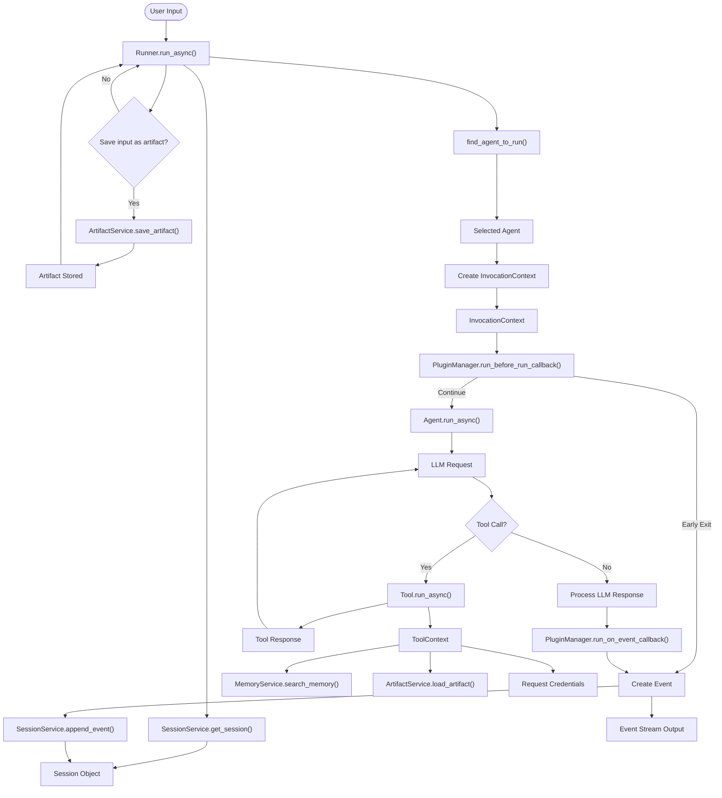
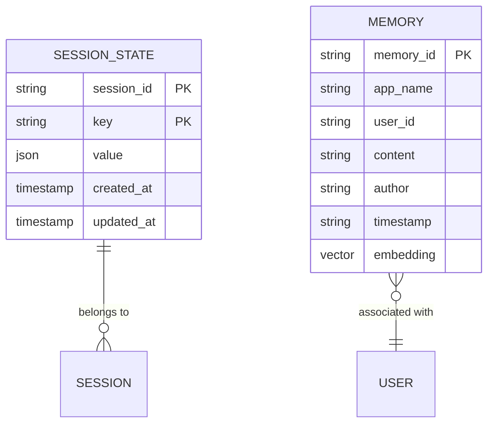

# Core Concepts

<cite>
**Referenced Files in This Document**   
- [runners.py](file://src/google/adk/runners.py)
- [base_agent.py](file://src/google/adk/agents/base_agent.py)
- [llm_agent.py](file://src/google/adk/agents/llm_agent.py)
- [session.py](file://src/google/adk/sessions/session.py)
- [base_session_service.py](file://src/google/adk/sessions/base_session_service.py)
- [base_memory_service.py](file://src/google/adk/memory/base_memory_service.py)
- [memory_entry.py](file://src/google/adk/memory/memory_entry.py)
- [base_artifact_service.py](file://src/google/adk/artifacts/base_artifact_service.py)
- [base_tool.py](file://src/google/adk/tools/base_tool.py)
- [tool_context.py](file://src/google/adk/tools/tool_context.py)
- [event.py](file://src/google/adk/events/event.py)
- [invocation_context.py](file://src/google/adk/agents/invocation_context.py)
- [agent.py](file://contributing/samples/session_state_agent/agent.py)
- [main.py](file://contributing/samples/memory/main.py)
</cite>

## Table of Contents
1. [Agents](#agents)
2. [Tools](#tools)
3. [Sessions](#sessions)
4. [Memory](#memory)
5. [Artifacts](#artifacts)
6. [Runner Engine](#runner-engine)
7. [Data Flow and Component Interactions](#data-flow-and-component-interactions)
8. [Common Misconceptions](#common-misconceptions)
9. [Performance Considerations](#performance-considerations)

## Agents

Agents are autonomous entities in the ADK framework that process input and produce responses. They are implemented as instances of the `BaseAgent` class, which serves as the foundation for all agent types in the system. The `BaseAgent` class is designed to be extensible, allowing for the creation of specialized agent types with different capabilities and behaviors.

The core functionality of agents is defined by their ability to handle invocations through the `run_async` and `run_live` methods. These methods process user input within a session context and generate responses through an asynchronous event stream. Each agent has a unique name that must be a valid Python identifier and cannot be "user" (which is reserved for end-user input). Agents can be organized in a hierarchical tree structure through parent-child relationships, where a parent agent can have multiple sub-agents.

The `LlmAgent` class extends `BaseAgent` to provide LLM-based capabilities, allowing agents to leverage large language models for generating responses. This class includes properties for configuring the underlying model, instructions for guiding agent behavior, and tools that extend the agent's functionality. The `LlmAgent` also supports advanced features like planning, code execution, and output schema enforcement, which constrain the agent's responses to a specific data structure.

Agents can be configured with various callbacks that execute at different points in the agent's lifecycle:
- `before_agent_callback`: Executes before the agent processes input, potentially short-circuiting execution
- `after_agent_callback`: Executes after the agent generates a response, allowing for post-processing
- `before_model_callback`: Executes before calling the LLM, allowing modification of the request
- `after_model_callback`: Executes after receiving the LLM response, allowing modification of the output

These callbacks provide a powerful mechanism for customizing agent behavior without modifying the core agent logic.

**Section sources**
- [base_agent.py](file://src/google/adk/agents/base_agent.py#L71-L612)
- [llm_agent.py](file://src/google/adk/agents/llm_agent.py#L124-L638)

## Tools

Tools are capabilities that extend agent functionality in the ADK framework. They are implemented as instances of the `BaseTool` class, which serves as the foundation for all tool types. Each tool has a name, description, and optional metadata that describes its purpose and usage.

The `BaseTool` class provides several key methods:
- `_get_declaration()`: Returns the tool's OpenAPI specification as a FunctionDeclaration, which is used to expose the tool to the LLM
- `run_async()`: Executes the tool with the provided arguments and context, returning the result
- `process_llm_request()`: Processes outgoing LLM requests, typically by adding the tool to the request configuration

Tools can be categorized based on their implementation and usage patterns:
- **Built-in tools**: Predefined tools provided by the ADK framework for common operations
- **Function tools**: Tools that wrap Python functions, allowing them to be called by the LLM
- **Toolsets**: Collections of related tools that can be managed as a single unit
- **Authenticated tools**: Tools that require authentication credentials to access external services

The framework supports both synchronous and asynchronous tool execution, with the `run_async` method enabling non-blocking operations. Tools receive a `ToolContext` object that provides access to the invocation context, function call ID, event actions, and authentication response. This context allows tools to interact with the broader system, including accessing session state, searching memory, and requesting credentials.

Tools are integrated into agents through the agent's `tools` property, which accepts a list of `ToolUnion` objects (functions, `BaseTool` instances, or `BaseToolset` instances). When an agent is configured with tools, the framework automatically exposes them to the LLM, allowing the model to decide when and how to use them based on the conversation context.

**Section sources**
- [base_tool.py](file://src/google/adk/tools/base_tool.py#L47-L213)
- [tool_context.py](file://src/google/adk/tools/tool_context.py#L31-L81)

## Sessions

Sessions are containers for conversation history and state in the ADK framework. They are implemented as instances of the `Session` class, which represents a series of interactions between a user and one or more agents. Each session has a unique identifier, app name, user ID, and maintains a chronological list of events that capture the conversation history.

The `Session` class includes the following key attributes:
- `id`: A unique identifier for the session
- `app_name`: The name of the application using the session
- `user_id`: The ID of the user associated with the session
- `state`: A dictionary containing session-specific state data
- `events`: A list of `Event` objects representing the conversation history
- `last_update_time`: A timestamp indicating when the session was last updated

Sessions are managed by a `BaseSessionService` implementation, which provides methods for creating, retrieving, updating, and listing sessions. The service acts as a persistence layer, storing session data in a backend storage system (in-memory, database, or cloud service). The `Runner` class uses the session service to load and save session data as conversations progress.

The session state serves as a shared data store that persists across multiple interactions within the same session. It can be used to store user preferences, conversation context, intermediate results, and other data that needs to be maintained throughout the conversation. State modifications are tracked through `EventActions` objects, which capture changes to the state as part of the event stream.

Sessions support branching, which allows sub-agents to maintain isolated conversation histories when they shouldn't see their peer agents' interactions. The branch is represented as a dot-separated string (e.g., "agent_1.agent_2.agent_3") that indicates the agent hierarchy.

**Section sources**
- [session.py](file://src/google/adk/sessions/session.py#L25-L59)
- [base_session_service.py](file://src/google/adk/sessions/base_session_service.py#L41-L157)

## Memory

Memory is the long-term recall system in the ADK framework, providing agents with the ability to search and retrieve information from past conversations. It is implemented through the `BaseMemoryService` class, which defines the interface for memory operations.

The memory system provides two primary functions:
1. **Adding sessions to memory**: The `add_session_to_memory` method allows sessions to be ingested into the memory system for future retrieval
2. **Searching memory**: The `search_memory` method enables agents to query the memory system with a text query and retrieve relevant memories

The `SearchMemoryResponse` class represents the result of a memory search, containing a list of `MemoryEntry` objects that match the query. Each `MemoryEntry` includes:
- `content`: The main content of the memory (a `types.Content` object)
- `author`: The author of the memory (optional)
- `timestamp`: The timestamp when the original content was created (optional)

The memory system is designed to be pluggable, with different implementations available for various use cases:
- `InMemoryMemoryService`: A simple in-memory implementation for testing and development
- `VertexAiMemoryBankService`: A cloud-based implementation using Vertex AI Memory Bank
- `VertexAiRagMemoryService`: A retrieval-augmented generation implementation using Vertex AI RAG

When an agent needs to access historical information, it can use the `search_memory` method through the `ToolContext` to query the memory system. This allows agents to provide more informed responses by incorporating relevant information from past conversations.

The memory system is distinct from session state, serving as a long-term storage mechanism rather than a short-term context container. While session state is limited to the current conversation and is typically used for tracking immediate context, memory persists across sessions and can be used to maintain a user's long-term preferences, history, and other enduring information.

**Section sources**
- [base_memory_service.py](file://src/google/adk/memory/base_memory_service.py#L41-L79)
- [memory_entry.py](file://src/google/adk/memory/memory_entry.py#L24-L38)
- [main.py](file://contributing/samples/memory/main.py#L1-L110)

## Artifacts

Artifacts are the mechanism for managing non-textual data in the ADK framework. They are implemented through the `BaseArtifactService` class, which provides a standardized interface for storing, retrieving, and managing binary or structured data files.

The artifact system supports the following operations:
- `save_artifact`: Stores an artifact identified by app name, user ID, session ID, and filename
- `load_artifact`: Retrieves an artifact by its identifiers
- `list_artifact_keys`: Lists all artifact filenames within a session
- `delete_artifact`: Removes an artifact from storage
- `list_versions`: Lists all versions of a specific artifact

Artifacts are typically used for handling file uploads, storing intermediate processing results, or managing any non-textual data that needs to be preserved during a conversation. When a user uploads a file, the `Runner` automatically saves it as an artifact and replaces the file data with a placeholder text in the conversation (e.g., "Uploaded file: artifact_e-12345.txt. It is saved into artifacts").

The artifact system is designed to be pluggable, with different implementations available:
- `InMemoryArtifactService`: An in-memory implementation for testing
- `GcsArtifactService`: A Google Cloud Storage implementation for production use

Each artifact is versioned, with the first version having a revision ID of 0 that increments with each subsequent save. This versioning system allows for tracking changes to artifacts over time and potentially reverting to previous versions.

Artifacts are closely integrated with the session system, as they are organized by app name, user ID, and session ID. This ensures that artifacts are properly scoped to the appropriate context and can be easily cleaned up when sessions are deleted.

**Section sources**
- [base_artifact_service.py](file://src/google/adk/artifacts/base_artifact_service.py#L23-L124)

## Runner Engine

The Runner engine is the orchestration component that manages agent execution in the ADK framework. It is implemented as the `Runner` class, which coordinates the interaction between agents, sessions, memory, artifacts, and other services.

The `Runner` class has the following key components:
- `app_name`: The application name associated with the runner
- `agent`: The root agent to run
- `session_service`: The service for managing sessions
- `memory_service`: The service for managing memory (optional)
- `artifact_service`: The service for managing artifacts (optional)
- `credential_service`: The service for managing credentials (optional)
- `plugin_manager`: The manager for handling plugins

The Runner provides several methods for executing agents:
- `run_async`: The main entry point for running an agent asynchronously
- `run`: A synchronous wrapper around `run_async` for convenience
- `run_live`: An experimental method for running agents in live mode (e.g., audio/video conversations)

The execution flow in the Runner follows these steps:
1. Retrieve the session using the session service
2. Create an `InvocationContext` that contains all necessary services and context
3. Process user input, potentially saving file uploads as artifacts
4. Determine the appropriate agent to run based on the conversation history
5. Execute the agent through its `run_async` method
6. Process the event stream, applying plugins and saving events to the session

The Runner uses an `InvocationContext` to pass execution context to agents, which includes references to all services, the current session, user input, and configuration options. This context is passed down the agent hierarchy as sub-agents are invoked.

The Runner also handles plugin execution through the `PluginManager`, which allows for extending the framework's behavior without modifying core components. Plugins can register callbacks that execute at various points in the execution pipeline, such as before/after agent execution or when events are generated.

For cleanup, the Runner implements a `close` method that properly shuts down all toolsets, ensuring that resources are released and connections are closed.

**Section sources**
- [runners.py](file://src/google/adk/runners.py#L59-L680)
- [invocation_context.py](file://src/google/adk/agents/invocation_context.py#L92-L221)

## Data Flow and Component Interactions

The ADK framework follows a well-defined data flow pattern that illustrates how user input propagates through the system and how components interact. This flow begins when a user sends a message to the system and ends when a response is generated and returned.

**Diagram sources**
- [runners.py](file://src/google/adk/runners.py#L180-L249)
- [base_agent.py](file://src/google/adk/agents/base_agent.py#L214-L249)
- [event.py](file://src/google/adk/events/event.py#L29-L140)

The data flow demonstrates several key interaction patterns:
1. **User input processing**: When a user sends a message, the Runner first retrieves the appropriate session and checks if any file uploads should be saved as artifacts.
2. **Agent selection**: The Runner determines which agent should handle the request based on the conversation history, potentially transferring control between agents.
3. **Context creation**: An InvocationContext is created, providing the executing agent with access to all necessary services and data.
4. **Plugin execution**: Before the agent runs, registered plugins can modify the behavior or even short-circuit execution.
5. **Agent execution**: The selected agent processes the input, potentially making LLM calls and invoking tools.
6. **Tool interactions**: When tools are called, they can access memory, load artifacts, and request credentials through the ToolContext.
7. **Response processing**: After the agent generates a response, plugins can modify the output before it's saved to the session and returned to the user.

This flow ensures that all components work together seamlessly, with proper separation of concerns and well-defined interfaces between components.

## Common Misconceptions

Several common misconceptions exist regarding the ADK framework components, particularly around the distinction between session state and memory. Understanding these differences is crucial for proper system design and implementation.

### Session State vs. Memory

The most common misconception is conflating session state with memory. While both store data, they serve different purposes and have distinct characteristics:

**Diagram sources**
- [session.py](file://src/google/adk/sessions/session.py#L25-L59)
- [base_memory_service.py](file://src/google/adk/memory/base_memory_service.py#L41-L79)

**Session State**:
- Short-term storage for the current conversation
- Persists only for the duration of a single session
- Used for tracking immediate context, temporary variables, and workflow state
- Directly accessible and modifiable by agents through callbacks
- Not searchable; accessed by exact key lookup
- Ideal for storing user preferences for the current interaction, intermediate calculation results, or form data being filled out

**Memory**:
- Long-term storage for historical information
- Persists across multiple sessions
- Used for storing conversation history, user preferences, and knowledge
- Accessed through search queries rather than direct key lookup
- Typically implemented with vector indexing for semantic search
- Ideal for recalling past conversations, user habits, or domain knowledge

### When to Use Each

Understanding when to use session state versus memory is critical for effective application design:

**Use Session State When**:
- Tracking the current step in a multi-step workflow
- Storing temporary data that will be used immediately
- Maintaining context for the current conversation turn
- Implementing short-term user preferences that don't need to persist
- Coordinating data between multiple agents in a single conversation

**Use Memory When**:
- Recalling information from previous conversations
- Maintaining long-term user preferences or habits
- Providing context about past interactions
- Implementing knowledge retrieval for domain-specific information
- Supporting conversational continuity across sessions

The key distinction is temporal scope: session state is ephemeral and conversation-specific, while memory is persistent and cumulative. For example, in a customer service application, session state might track the current support ticket being processed, while memory would store the customer's entire support history.

## Performance Considerations

Managing large conversation histories and memory entries requires careful consideration of performance implications. The ADK framework provides several mechanisms to optimize performance while maintaining functionality.

### Session Management

For sessions with extensive conversation histories, consider the following strategies:
- **Event pruning**: Implement logic to remove or summarize older events when the session grows beyond a certain size
- **Context window management**: Use the `include_contents` property to control how much conversation history is sent to the LLM
- **State optimization**: Store only essential data in session state, avoiding large objects or redundant information

The `Runner` class includes performance features like the `max_llm_calls` limit in `RunConfig`, which prevents infinite loops by limiting the number of LLM calls per invocation.

### Memory Optimization

For memory systems with large numbers of entries, consider:
- **Indexing strategy**: Ensure proper indexing on frequently queried fields like user_id, app_name, and timestamp
- **Data retention policies**: Implement automatic cleanup of old memory entries based on age or relevance
- **Query optimization**: Use specific, focused queries rather than broad searches to reduce processing time
- **Caching**: Implement caching for frequently accessed memory patterns

### Artifact Management

For applications that handle many file uploads:
- **Storage tiering**: Use appropriate storage classes based on access patterns (e.g., frequently accessed vs. archival)
- **File size limits**: Enforce reasonable limits on uploaded file sizes
- **Automatic cleanup**: Implement policies to remove artifacts when sessions are deleted
- **Version management**: Be mindful of storage costs when multiple versions of artifacts are maintained

### General Performance Best Practices

- **Minimize service calls**: Batch operations when possible to reduce round trips to external services
- **Use appropriate service implementations**: Choose between in-memory (fast, ephemeral) and persistent (slower, durable) services based on requirements
- **Monitor resource usage**: Track memory, CPU, and network usage to identify bottlenecks
- **Implement timeouts**: Set appropriate timeouts for external service calls to prevent hanging operations
- **Optimize data serialization**: Use efficient serialization formats for data transfer between components

By following these performance considerations, developers can ensure that ADK-based applications remain responsive and scalable even with extensive conversation histories and large memory stores.

**Section sources**
- [runners.py](file://src/google/adk/runners.py#L59-L680)
- [base_session_service.py](file://src/google/adk/sessions/base_session_service.py#L41-L157)
- [base_memory_service.py](file://src/google/adk/memory/base_memory_service.py#L41-L79)
- [base_artifact_service.py](file://src/google/adk/artifacts/base_artifact_service.py#L23-L124)