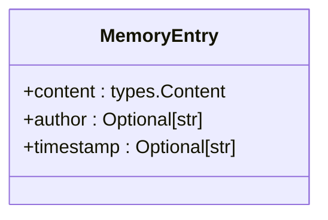
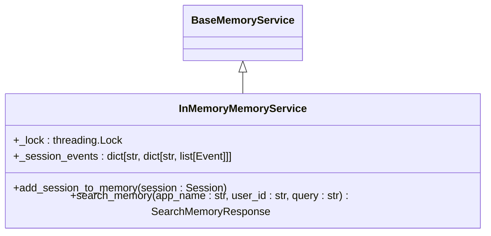
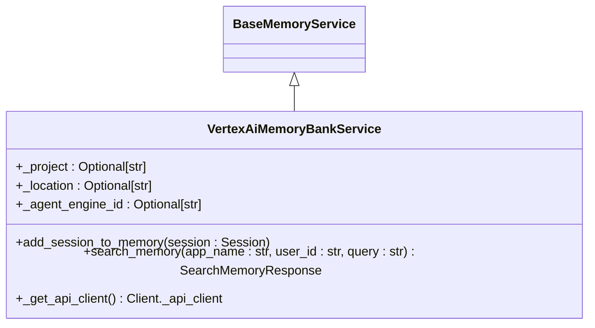
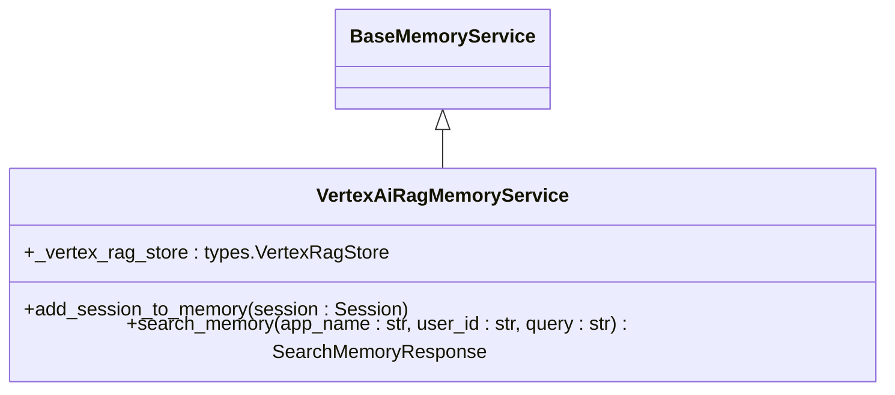
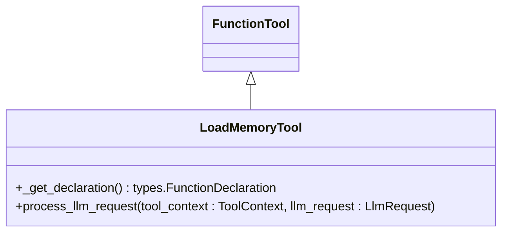
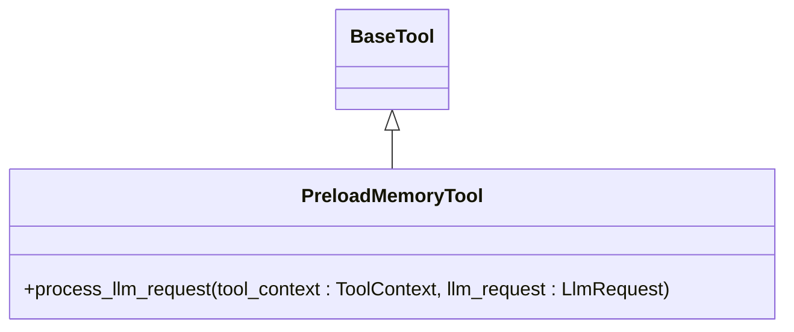

# Memory

<cite>
**Referenced Files in This Document**   
- [memory_entry.py](file://src/google/adk/memory/memory_entry.py)
- [base_memory_service.py](file://src/google/adk/memory/base_memory_service.py)
- [in_memory_memory_service.py](file://src/google/adk/memory/in_memory_memory_service.py)
- [vertex_ai_memory_bank_service.py](file://src/google/adk/memory/vertex_ai_memory_bank_service.py)
- [vertex_ai_rag_memory_service.py](file://src/google/adk/memory/vertex_ai_rag_memory_service.py)
- [load_memory_tool.py](file://src/google/adk/tools/load_memory_tool.py)
- [preload_memory_tool.py](file://src/google/adk/tools/preload_memory_tool.py)
- [main.py](file://contributing/samples/memory/main.py)
- [agent.py](file://contributing/samples/memory/agent.py)
- [test_in_memory_memory_service.py](file://tests/unittests/memory/test_in_memory_memory_service.py)
- [test_vertex_ai_memory_bank_service.py](file://tests/unittests/memory/test_vertex_ai_memory_bank_service.py)
</cite>

## Table of Contents
1. [Introduction](#introduction)
2. [MemoryEntry Structure](#memoryentry-structure)
3. [Memory Service Implementations](#memory-service-implementations)
4. [Memory Indexing and Search Capabilities](#memory-indexing-and-search-capabilities)
5. [Memory Management Patterns](#memory-management-patterns)
6. [Common Issues and Performance Considerations](#common-issues-and-performance-considerations)
7. [Best Practices for Memory Organization](#best-practices-for-memory-organization)
8. [Conclusion](#conclusion)

## Introduction
The ADK (Agent Development Kit) framework provides a comprehensive memory system that enables long-term recall and context preservation across sessions. This memory system allows agents to store, retrieve, and utilize information from previous interactions, creating more personalized and context-aware experiences. The framework supports multiple memory service implementations, each designed for different use cases and performance requirements. The memory system is built around the concept of storing session data as retrievable entries that can be searched using various strategies, from simple keyword matching to advanced semantic search.

**Section sources**
- [memory_entry.py](file://src/google/adk/memory/memory_entry.py#L1-L38)
- [base_memory_service.py](file://src/google/adk/memory/base_memory_service.py#L1-L79)

## MemoryEntry Structure
The `MemoryEntry` class serves as the fundamental unit of stored information in the ADK memory system. It encapsulates content along with metadata that enables effective retrieval and contextual understanding. The structure is designed to be flexible and extensible, supporting various types of content while maintaining essential information for search and display purposes.

**Diagram sources**
- [memory_entry.py](file://src/google/adk/memory/memory_entry.py#L24-L38)

The `MemoryEntry` contains three key properties:
- **content**: The primary data being stored, represented as a `types.Content` object that can include text, function calls, or other structured data
- **author**: An optional identifier specifying who created the memory entry (e.g., "user" or "model")
- **timestamp**: An optional ISO 8601 formatted string indicating when the original content was created

This structure enables the system to preserve not just what was said or done, but also who was involved and when it occurred, providing rich context for future retrieval.

**Section sources**
- [memory_entry.py](file://src/google/adk/memory/memory_entry.py#L24-L38)

## Memory Service Implementations
The ADK framework provides multiple memory service implementations, each with different characteristics and use cases. These services inherit from the `BaseMemoryService` abstract class, which defines the contract for memory operations.

### In-Memory Storage
The `InMemoryMemoryService` provides a simple, thread-safe implementation for development and testing purposes. It stores session data in memory using a dictionary-based structure, with data organized by application name and user ID.

**Diagram sources**
- [in_memory_memory_service.py](file://src/google/adk/memory/in_memory_memory_service.py#L41-L102)

This implementation uses keyword matching rather than semantic search, making it suitable for prototyping but not recommended for production environments. The service is thread-safe through the use of locks, ensuring data integrity in concurrent scenarios.

**Section sources**
- [in_memory_memory_service.py](file://src/google/adk/memory/in_memory_memory_service.py#L41-L102)
- [test_in_memory_memory_service.py](file://tests/unittests/memory/test_in_memory_memory_service.py#L1-L220)

### Vertex AI Memory Bank
The `VertexAiMemoryBankService` leverages Google's Vertex AI platform to provide structured data storage with semantic search capabilities. This implementation is designed for production use and offers advanced features like vector embeddings and similarity search.

**Diagram sources**
- [vertex_ai_memory_bank_service.py](file://src/google/adk/memory/vertex_ai_memory_bank_service.py#L38-L165)

This service integrates with Vertex AI's reasoning engines, using the Memory Bank feature to store and retrieve memories. It requires configuration with a project ID, location, and agent engine ID to connect to the appropriate Vertex AI resources. The service automatically converts session events into a format compatible with the Vertex AI API and handles authentication and request management.

**Section sources**
- [vertex_ai_memory_bank_service.py](file://src/google/adk/memory/vertex_ai_memory_bank_service.py#L38-L165)
- [test_vertex_ai_memory_bank_service.py](file://tests/unittests/memory/test_vertex_ai_memory_bank_service.py#L1-L189)

### RAG (Retrieval-Augmented Generation) Memory
The `VertexAiRagMemoryService` implements a Retrieval-Augmented Generation approach, using Vertex AI's RAG capabilities for semantic search over unstructured data. This implementation is particularly effective for handling large volumes of text-based memories.

**Diagram sources**
- [vertex_ai_rag_memory_service.py](file://src/google/adk/memory/vertex_ai_rag_memory_service.py#L39-L201)

This service converts session data into temporary text files that are uploaded to a Vertex AI RAG corpus. During search operations, it uses semantic similarity to retrieve relevant memories, making it highly effective for understanding context and meaning rather than just matching keywords. The service includes functionality to merge overlapping event lists and maintain chronological order of retrieved memories.

**Section sources**
- [vertex_ai_rag_memory_service.py](file://src/google/adk/memory/vertex_ai_rag_memory_service.py#L39-L201)

## Memory Indexing and Search Capabilities
The ADK memory system provides robust indexing and search capabilities across its different implementations. Each service handles the indexing of session data differently, but all follow a consistent pattern of organizing memories by application name and user ID to ensure proper scoping and privacy.

The search functionality is exposed through the `search_memory` method, which takes an application name, user ID, and query string as parameters. The base service returns a `SearchMemoryResponse` object containing a list of relevant `MemoryEntry` objects.

**Diagram sources**
- [base_memory_service.py](file://src/google/adk/memory/base_memory_service.py#L31-L79)

The in-memory service uses simple keyword matching with case-insensitive word extraction, while the Vertex AI implementations leverage advanced machine learning models for semantic understanding. The RAG implementation specifically uses vector embeddings to find memories that are contextually similar to the query, even if they don't share exact keywords.

**Section sources**
- [base_memory_service.py](file://src/google/adk/memory/base_memory_service.py#L31-L79)
- [in_memory_memory_service.py](file://src/google/adk/memory/in_memory_memory_service.py#L71-L102)
- [vertex_ai_memory_bank_service.py](file://src/google/adk/memory/vertex_ai_memory_bank_service.py#L97-L134)
- [vertex_ai_rag_memory_service.py](file://src/google/adk/memory/vertex_ai_rag_memory_service.py#L108-L174)

## Memory Management Patterns
The ADK framework provides several patterns for managing memory throughout an agent's lifecycle. These patterns are implemented through tools that can be integrated into agent workflows.

### Memory Loading Tool
The `LoadMemoryTool` allows agents to explicitly retrieve memories based on a query. This tool exposes the memory search functionality to the agent, enabling it to decide when to access stored information.

**Diagram sources**
- [load_memory_tool.py](file://src/google/adk/tools/load_memory_tool.py#L51-L94)

This tool creates a function declaration that can be used by the LLM to request memory retrieval. When called, it executes the search and returns the results to the model, allowing the agent to incorporate relevant past information into its response.

**Section sources**
- [load_memory_tool.py](file://src/google/adk/tools/load_memory_tool.py#L36-L94)

### Memory Preloading Tool
The `PreloadMemoryTool` automatically retrieves relevant memories before processing a user query, without requiring explicit function calls from the agent.

**Diagram sources**
- [preload_memory_tool.py](file://src/google/adk/tools/preload_memory_tool.py#L29-L85)

This tool automatically searches for relevant memories based on the user's current query and injects them into the system instructions. This approach ensures that contextually relevant information is available to the agent without consuming function call budget or requiring the agent to explicitly request memory access.

**Section sources**
- [preload_memory_tool.py](file://src/google/adk/tools/preload_memory_tool.py#L29-L85)

## Common Issues and Performance Considerations
While the ADK memory system provides powerful capabilities, there are several common issues and performance considerations to be aware of when implementing memory in production applications.

### Memory Leakage
Memory leakage can occur when sessions are continuously added to memory without proper cleanup or expiration policies. The current implementations do not include automatic memory expiration, so applications must implement their own strategies for managing memory lifecycle.

### Performance Degradation
As memory stores grow larger, search performance can degrade, particularly with the in-memory implementation which performs linear scans of stored data. The Vertex AI implementations scale better with larger datasets due to their optimized indexing and search algorithms.

### Implementation-Specific Considerations
- **In-Memory Service**: Limited by available RAM and not persistent across application restarts
- **Vertex AI Memory Bank**: Requires proper configuration of Vertex AI resources and may incur costs based on usage
- **RAG Memory**: Involves file I/O operations and network calls to upload documents, which can add latency

Applications should carefully consider their memory requirements and choose the appropriate implementation based on factors such as data volume, search complexity, persistence needs, and cost constraints.

**Section sources**
- [in_memory_memory_service.py](file://src/google/adk/memory/in_memory_memory_service.py#L42-L48)
- [vertex_ai_memory_bank_service.py](file://src/google/adk/memory/vertex_ai_memory_bank_service.py#L38-L165)
- [vertex_ai_rag_memory_service.py](file://src/google/adk/memory/vertex_ai_rag_memory_service.py#L39-L201)

## Best Practices for Memory Organization
To maximize the effectiveness of the ADK memory system, consider the following best practices:

1. **Use Appropriate Memory Services**: Use in-memory storage for development and testing, and Vertex AI services for production applications requiring robust search capabilities.

2. **Implement Memory Scoping**: Always use meaningful application names and user IDs to ensure proper isolation of memory data between different applications and users.

3. **Optimize Search Queries**: Craft specific, focused queries when retrieving memories to improve relevance and reduce latency.

4. **Manage Memory Lifecycle**: Implement strategies for archiving or removing old memories to prevent unbounded growth and maintain performance.

5. **Combine Memory Tools**: Use both preload and explicit load tools to balance automatic context provision with on-demand memory access.

6. **Monitor Memory Usage**: Track memory store size and search performance to identify potential issues before they impact user experience.

7. **Consider Data Sensitivity**: Be mindful of the information stored in memory, especially when using cloud-based services, and implement appropriate security measures.

**Section sources**
- [main.py](file://contributing/samples/memory/main.py#L31-L110)
- [agent.py](file://contributing/samples/memory/agent.py#L24-L43)

## Conclusion
The ADK framework's memory system provides a comprehensive solution for long-term recall and context preservation in agent applications. With multiple implementation options ranging from simple in-memory storage to advanced Vertex AI-powered semantic search, developers can choose the appropriate approach based on their specific requirements. The system's modular design, with a clear separation between memory storage and retrieval mechanisms, allows for flexible integration into various application architectures. By following best practices for memory organization and management, developers can create agents that provide increasingly personalized and context-aware experiences while maintaining performance and scalability.