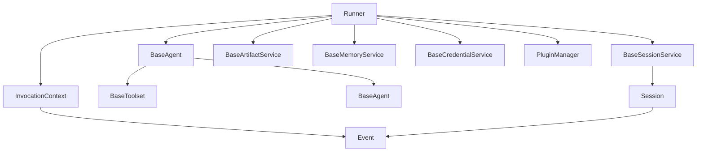
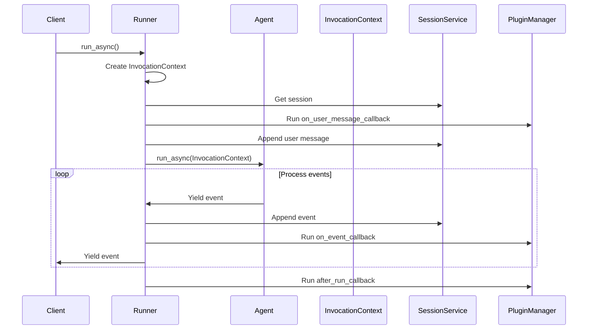
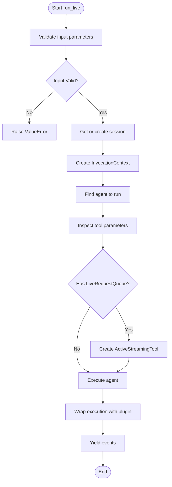
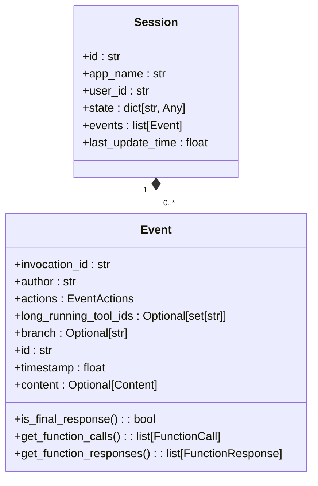
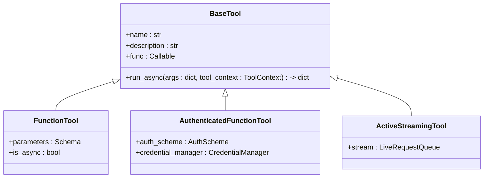
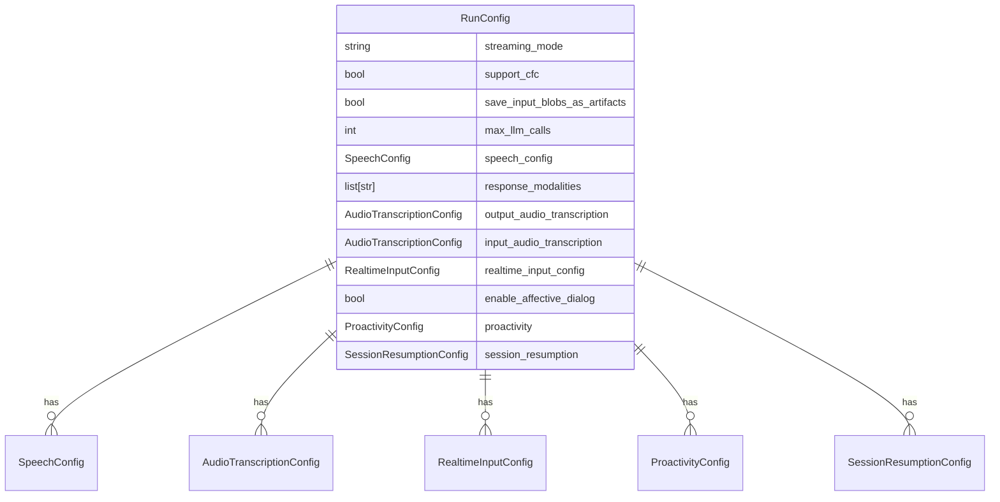
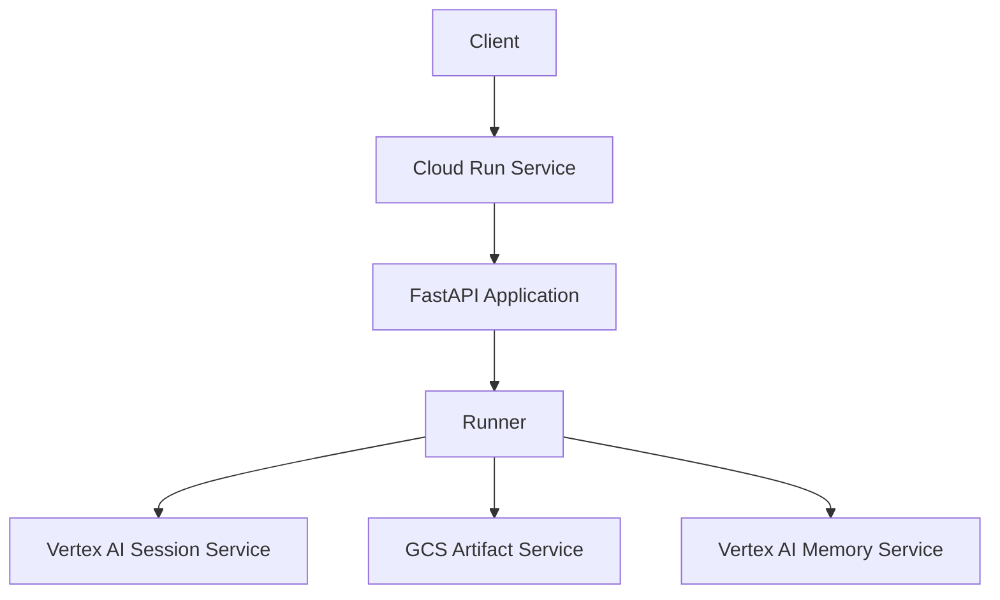
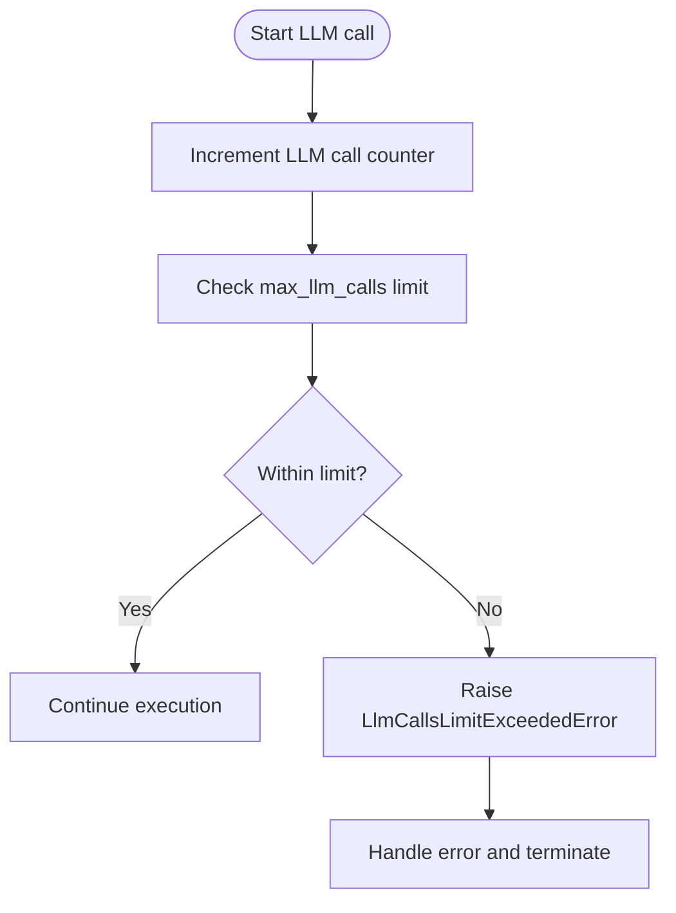
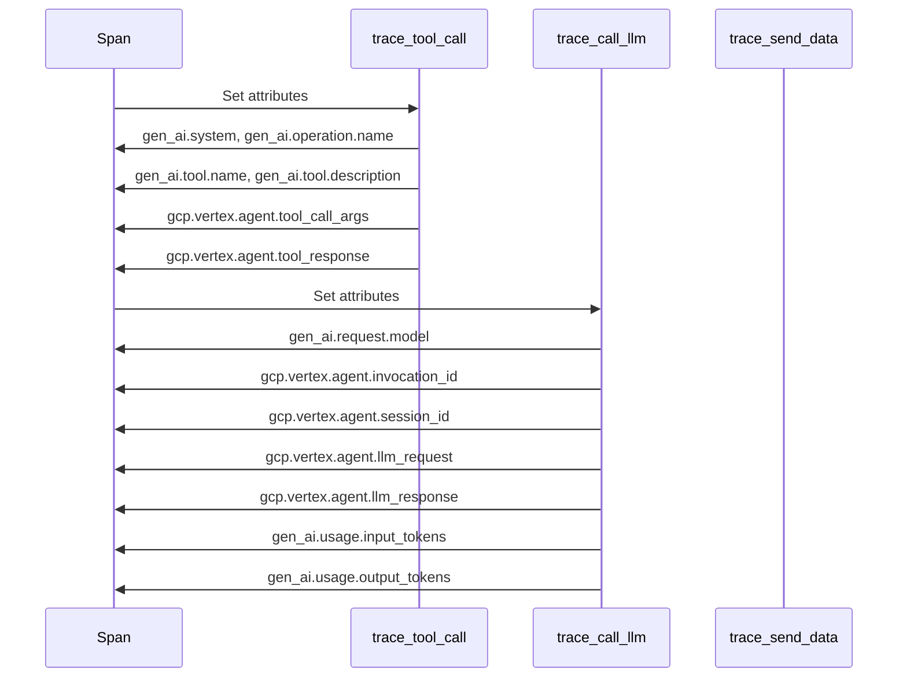

# Runner Engine

<cite>
**Referenced Files in This Document**   
- [runners.py](file://src/google/adk/runners.py)
- [run_config.py](file://src/google/adk/agents/run_config.py)
- [base_agent.py](file://src/google/adk/agents/base_agent.py)
- [session.py](file://src/google/adk/sessions/session.py)
- [invocation_context.py](file://src/google/adk/agents/invocation_context.py)
- [event.py](file://src/google/adk/events/event.py)
- [telemetry.py](file://src/google/adk/telemetry.py)
- [fast_api.py](file://src/google/adk/cli/fast_api.py)
</cite>

## Table of Contents
1. [Introduction](#introduction)
2. [Architecture Overview](#architecture-overview)
3. [Execution Model](#execution-model)
4. [Component Interactions](#component-interactions)
5. [Configuration Options](#configuration-options)
6. [Deployment Scenarios](#deployment-scenarios)
7. [Error Handling and Resource Management](#error-handling-and-resource-management)
8. [Performance Optimization](#performance-optimization)
9. [Monitoring and Telemetry](#monitoring-and-telemetry)
10. [Conclusion](#conclusion)

## Introduction

The Runner Engine is the core orchestration component of the Agent Development Kit (ADK) framework, responsible for managing the execution of agents within a session. It provides a unified interface for running agents synchronously, asynchronously, and in streaming modes, handling message processing, event generation, and interaction with various services such as artifact storage, session management, and memory. The Runner Engine serves as the execution backbone for agent-based applications, enabling complex workflows and interactions between multiple agents and tools.

**Section sources**
- [runners.py](file://src/google/adk/runners.py#L59-L679)

## Architecture Overview

The Runner Engine architecture is designed around a modular and extensible design pattern, with clear separation of concerns between different components. At its core, the Runner class manages the execution of an agent within a session, coordinating interactions between various services and components.



**Diagram sources**
- [runners.py](file://src/google/adk/runners.py#L59-L679)
- [base_agent.py](file://src/google/adk/agents/base_agent.py#L71-L200)
- [session.py](file://src/google/adk/sessions/session.py#L25-L59)

The architecture follows a hierarchical pattern where the Runner orchestrates the execution of a root agent, which may have sub-agents forming an agent tree. Each agent can have associated tools and toolsets that provide specific capabilities. The Runner interacts with various services to manage state, store artifacts, and maintain session context across multiple interactions.

## Execution Model

The Runner Engine supports three primary execution modes: synchronous, asynchronous, and streaming. Each mode is designed for different use cases and performance requirements.

### Synchronous Execution

Synchronous execution is provided through the `run()` method, which is primarily intended for local testing and convenience purposes. This method creates a background thread to handle the asynchronous execution of the agent and yields events as they are generated.

```mermaid
sequenceDiagram
participant Client
participant Runner
participant Agent
participant EventQueue
Client->>Runner : run()
Runner->>EventQueue : Create queue
Runner->>Runner : Start background thread
loop Process events
EventQueue->>Runner : Get event
alt Event exists
Runner->>Client : Yield event
else No more events
break
end
end
Runner->>Runner : Join thread
```

**Diagram sources**
- [runners.py](file://src/google/adk/runners.py#L121-L179)

### Asynchronous Execution

Asynchronous execution is the recommended approach for production usage, implemented through the `run_async()` method. This method provides a more efficient and scalable execution model by leveraging Python's async/await capabilities.



**Diagram sources**
- [runners.py](file://src/google/adk/runners.py#L180-L249)

### Streaming Execution

Streaming execution is supported through the `run_live()` method, which is designed for real-time, bidirectional communication scenarios. This experimental feature enables live interaction with agents, particularly useful for voice and video applications.



**Diagram sources**
- [runners.py](file://src/google/adk/runners.py#L357-L464)

## Component Interactions

The Runner Engine coordinates interactions between several key components: Runner, agents, sessions, and tools. These components work together to provide a cohesive agent execution environment.

### Runner and Agent Interaction

The Runner manages the lifecycle of agent execution, determining which agent should respond to a user message based on the session history and agent capabilities. The `_find_agent_to_run()` method implements the logic for selecting the appropriate agent.

```mermaid
sequenceDiagram
participant Runner
participant Session
participant Agent
Runner->>Session : Get session events
loop For each event in reverse
Session->>Runner : Get event
Runner->>Runner : Check if event author matches agent
alt Event author is function response
Runner->>Agent : Find agent by author
Agent->>Runner : Return agent
break
end
alt Event author is root agent
Runner->>Runner : Return root agent
break
end
alt Event author is sub-agent
Runner->>Agent : Find sub-agent
Agent->>Runner : Check transferability
alt Agent is transferable
Runner->>Runner : Return agent
break
end
end
end
Runner->>Runner : Return root agent (fallback)
```

**Diagram sources**
- [runners.py](file://src/google/adk/runners.py#L465-L508)

### Session Management

Sessions maintain the conversation history and state between users and agents. The Session class stores events, user ID, application name, and session state, providing a persistent context for agent interactions.



**Diagram sources**
- [session.py](file://src/google/adk/sessions/session.py#L25-L59)
- [event.py](file://src/google/adk/events/event.py#L29-L140)

### Tool Integration

Tools extend the capabilities of agents by providing access to external systems and services. The Runner Engine supports various types of tools, including function tools, authenticated tools, and streaming tools.



**Diagram sources**
- [runners.py](file://src/google/adk/runners.py#L30-L54)
- [runners.py](file://src/google/adk/runners.py#L417-L453)

## Configuration Options

The Runner Engine's behavior is controlled through the RunConfig class, which provides various configuration options for different execution scenarios.

### RunConfig Parameters

The RunConfig class defines a comprehensive set of parameters that control the execution behavior of agents. These parameters are organized into several categories based on their functionality.



**Diagram sources**
- [run_config.py](file://src/google/adk/agents/run_config.py#L36-L110)

### Configuration Categories

The configuration options can be grouped into several logical categories:

**Execution Mode Configuration**
- `streaming_mode`: Controls whether the agent runs in streaming mode (SSE or BIDI)
- `support_cfc`: Enables Compositional Function Calling for streaming agents

**Resource Management**
- `max_llm_calls`: Limits the total number of LLM calls for a given run
- `save_input_blobs_as_artifacts`: Controls whether input blobs are saved as artifacts

**Audio and Speech Configuration**
- `speech_config`: Configures speech synthesis parameters
- `response_modalities`: Specifies output modalities (e.g., AUDIO)
- `output_audio_transcription`: Configures transcription of agent responses
- `input_audio_transcription`: Configures transcription of user input

**Advanced Features**
- `enable_affective_dialog`: Enables emotion detection and adaptive responses
- `proactivity`: Configures proactive agent behavior
- `session_resumption`: Controls session resumption mechanism

**Section sources**
- [run_config.py](file://src/google/adk/agents/run_config.py#L36-L110)

## Deployment Scenarios

The Runner Engine supports various deployment scenarios, from local development to cloud-based production environments.

### Local Development

For local development, the InMemoryRunner provides a lightweight and self-contained environment for testing agents. This runner uses in-memory implementations for all services, making it ideal for rapid prototyping and debugging.

```python
runner = InMemoryRunner(
    agent=root_agent,
    app_name="MyApp"
)
```

The InMemoryRunner automatically configures in-memory services for sessions, artifacts, and memory, eliminating the need for external dependencies during development.

**Section sources**
- [runners.py](file://src/google/adk/runners.py#L642-L679)

### Cloud Run Deployment

For deployment on Google Cloud Run, the Runner can be integrated with cloud-based services for session management, artifact storage, and memory. The fast_api.py module provides a FastAPI-based web server that can be deployed on Cloud Run.



**Diagram sources**
- [fast_api.py](file://src/google/adk/cli/fast_api.py#L56-L200)

### Vertex AI Integration

The Runner Engine can be integrated with Vertex AI for advanced agent capabilities, including agent engines and memory banks. This integration enables persistent session storage, scalable artifact management, and enhanced memory services.

```python
runner = Runner(
    agent=root_agent,
    app_name="MyApp",
    session_service=VertexAiSessionService(
        project="my-project",
        location="us-central1",
        agent_engine_id="1234567890"
    ),
    memory_service=VertexAiMemoryBankService(
        project="my-project",
        location="us-central1",
        agent_engine_id="1234567890"
    ),
    artifact_service=GcsArtifactService(bucket_name="my-bucket")
)
```

**Section sources**
- [fast_api.py](file://src/google/adk/cli/fast_api.py#L139-L149)

## Error Handling and Resource Management

The Runner Engine implements comprehensive error handling and resource management mechanisms to ensure reliable and efficient agent execution.

### Execution Timeout Handling

The Runner Engine prevents infinite loops and excessive resource consumption through the `max_llm_calls` parameter in RunConfig. This parameter enforces a limit on the total number of LLM calls for a given run, preventing runaway agent behavior.



The limit is enforced by the `_InvocationCostManager` class, which tracks the number of LLM calls and raises an exception when the limit is exceeded.

**Section sources**
- [invocation_context.py](file://src/google/adk/agents/invocation_context.py#L62-L90)

### Resource Cleanup

The Runner Engine ensures proper cleanup of resources through the `close()` method, which is responsible for closing all toolsets associated with the agent. This prevents resource leaks and ensures that external connections are properly terminated.

```python
async def close(self):
    """Closes the runner."""
    await self._cleanup_toolsets(self._collect_toolset(self.agent))
```

The cleanup process uses asyncio.wait_for() with a timeout to prevent indefinite blocking during resource cleanup.

**Section sources**
- [runners.py](file://src/google/adk/runners.py#L637-L636)

## Performance Optimization

The Runner Engine includes several performance optimization features to enhance agent execution efficiency and scalability.

### Parallel Execution

For scenarios requiring multiple tool calls, the Runner Engine supports parallel execution to reduce overall processing time. This is particularly beneficial for I/O-bound operations such as API calls or database queries.

```mermaid
gantt
title Parallel vs Sequential Execution
dateFormat X
axisFormat %S
section Sequential
Task 1 :a1, 0, 2
Task 2 :a2, 2, 2
Task 3 :a3, 4, 2
section Parallel
Task 1 :b1, 0, 2
Task 2 :b2, 0, 2
Task 3 :b3, 0, 2
```



**Diagram sources**
- [runners.py](file://src/google/adk/runners.py#L620-L636)

### Caching Strategies

The Runner Engine implements caching at multiple levels to improve performance:

- **Input caching**: Input blobs can be saved as artifacts to avoid re-uploading large files
- **Session caching**: Session data is cached in memory for faster access
- **Tool result caching**: Tool execution results can be cached to avoid redundant operations

### Connection Pooling

For cloud-based deployments, the Runner Engine leverages connection pooling through the underlying Vertex AI and GCS services, reducing the overhead of establishing new connections for each request.

## Monitoring and Telemetry

The Runner Engine provides comprehensive monitoring and telemetry capabilities through integration with OpenTelemetry.

### Telemetry Collection

The telemetry.py module implements tracing for various operations, including LLM calls, tool executions, and data transfers. This enables detailed performance analysis and debugging.



**Diagram sources**
- [telemetry.py](file://src/google/adk/telemetry.py#L60-L289)

### Performance Metrics

The Runner Engine collects and exposes various performance metrics, including:

- LLM call count and duration
- Token usage (input and output)
- Tool execution time
- Session duration
- Error rates

These metrics can be integrated with monitoring systems like Cloud Monitoring for real-time visibility into agent performance.

## Conclusion

The Runner Engine is a sophisticated orchestration component that provides a robust foundation for agent-based applications in the ADK framework. Its modular architecture, support for multiple execution modes, and comprehensive configuration options make it suitable for a wide range of use cases, from simple chatbots to complex multi-agent systems. The integration with cloud services like Vertex AI and GCS enables scalable and production-ready deployments, while the comprehensive telemetry and monitoring capabilities ensure reliable operation and performance optimization. By understanding the Runner Engine's architecture and capabilities, developers can effectively leverage its features to build powerful and efficient agent-based applications.