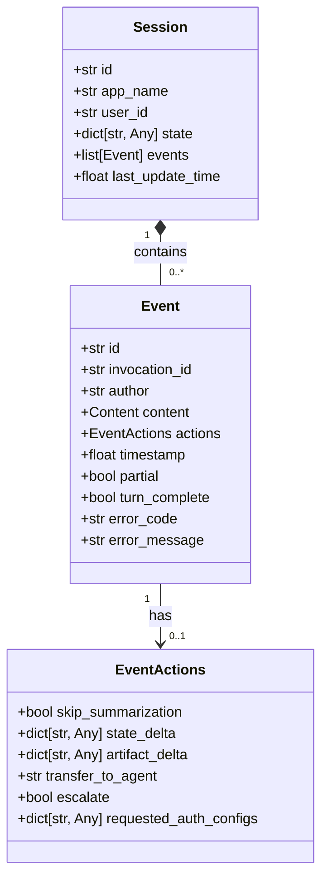
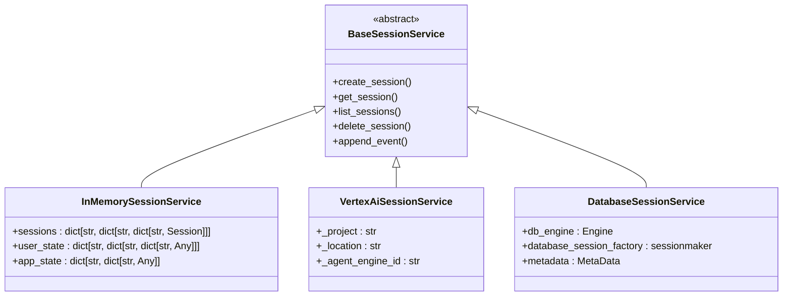
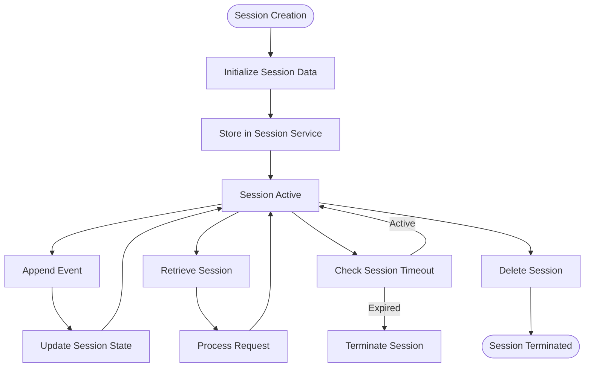
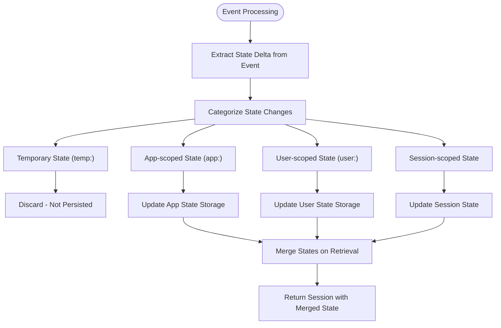
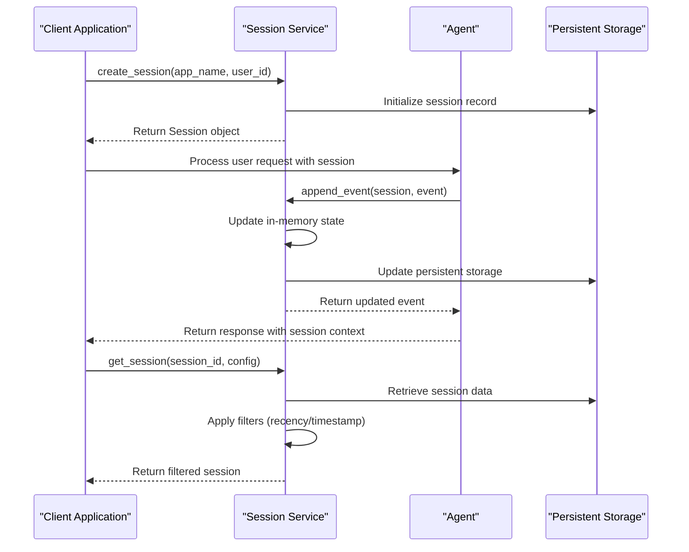

# Sessions

<cite>
**Referenced Files in This Document**   
- [session.py](file://src/google/adk/sessions/session.py)
- [base_session_service.py](file://src/google/adk/sessions/base_session_service.py)
- [in_memory_session_service.py](file://src/google/adk/sessions/in_memory_session_service.py)
- [vertex_ai_session_service.py](file://src/google/adk/sessions/vertex_ai_session_service.py)
- [state.py](file://src/google/adk/sessions/state.py)
- [database_session_service.py](file://src/google/adk/sessions/database_session_service.py)
- [agent.py](file://contributing/samples/session_state_agent/agent.py)
- [test_session_service.py](file://tests/unittests/sessions/test_session_service.py)
- [test_vertex_ai_session_service.py](file://tests/unittests/sessions/test_vertex_ai_session_service.py)
</cite>

## Table of Contents
1. [Introduction](#introduction)
2. [Session Class Architecture](#session-class-architecture)
3. [Session Service Implementations](#session-service-implementations)
4. [Session Lifecycle Management](#session-lifecycle-management)
5. [State Management and Context Persistence](#state-management-and-context-persistence)
6. [Practical Implementation Examples](#practical-implementation-examples)
7. [Common Issues and Considerations](#common-issues-and-considerations)
8. [Performance and Storage Optimization](#performance-and-storage-optimization)
9. [Conclusion](#conclusion)

## Introduction

The Sessions concept in the ADK framework provides a robust mechanism for managing conversation state across multiple interactions between users and agents. This system enables the preservation of conversation history, context, and state information, allowing for coherent and context-aware interactions throughout a user session. The framework supports multiple storage backends, from in-memory storage for development to production-grade solutions like Vertex AI integration and database persistence. This documentation provides a comprehensive overview of the session management system, detailing its architecture, implementation, and practical usage patterns.

## Session Class Architecture

The Session class serves as the core data structure for maintaining conversation state in the ADK framework. It encapsulates all relevant information about a user's interaction with the system, including identification, state data, and event history. The class is implemented as a Pydantic BaseModel, ensuring type safety and data validation.

The Session class contains several key attributes: a unique identifier (id), application name (app_name), user identifier (user_id), state dictionary for storing session variables, events list for maintaining conversation history, and a timestamp for the last update. The state dictionary is particularly important as it preserves context across interactions, allowing agents to maintain awareness of previous exchanges and user preferences.

The architecture follows a clean separation between the session data model and the service layer that manages session operations. This design enables multiple storage implementations while maintaining a consistent interface for session operations. The Session class is designed to be lightweight and serializable, facilitating its transmission across network boundaries and storage in various backend systems.

**Diagram sources**
- [session.py](file://src/google/adk/sessions/session.py#L25-L58)
- [events/event.py](file://src/google/adk/events/event.py)
- [events/event_actions.py](file://src/google/adk/events/event_actions.py)

**Section sources**
- [session.py](file://src/google/adk/sessions/session.py#L1-L59)

## Session Service Implementations

The ADK framework provides multiple session service implementations to accommodate different deployment scenarios and requirements. These implementations adhere to a common interface defined by the BaseSessionService abstract class, enabling consistent usage patterns across different storage backends.

The primary implementations include the InMemorySessionService for development and testing, the VertexAiSessionService for production deployments leveraging Google Cloud infrastructure, and the DatabaseSessionService for applications requiring persistent storage with relational databases. Each service implements the same core operations—create_session, get_session, list_sessions, delete_session, and append_event—ensuring a consistent API regardless of the underlying storage mechanism.

The InMemorySessionService stores session data in Python dictionaries, making it ideal for development and testing due to its simplicity and speed. However, it is not suitable for production environments as data is lost when the application restarts and it doesn't scale across multiple instances. The VertexAiSessionService integrates with Google's Vertex AI Agent Engine, providing a managed, scalable solution for production workloads with built-in reliability and performance optimizations.

**Diagram sources**
- [base_session_service.py](file://src/google/adk/sessions/base_session_service.py#L43-L110)
- [in_memory_session_service.py](file://src/google/adk/sessions/in_memory_session_service.py#L35-L304)
- [vertex_ai_session_service.py](file://src/google/adk/sessions/vertex_ai_session_service.py#L48-L494)
- [database_session_service.py](file://src/google/adk/sessions/database_session_service.py#L369-L667)

**Section sources**
- [base_session_service.py](file://src/google/adk/sessions/base_session_service.py#L1-L110)
- [in_memory_session_service.py](file://src/google/adk/sessions/in_memory_session_service.py#L1-L304)
- [vertex_ai_session_service.py](file://src/google/adk/sessions/vertex_ai_session_service.py#L1-L494)
- [database_session_service.py](file://src/google/adk/sessions/database_session_service.py#L1-L667)

## Session Lifecycle Management

The session lifecycle in the ADK framework encompasses the complete journey from creation to termination, with well-defined states and transitions. The lifecycle begins with session creation, where a new session is instantiated with a unique identifier, application context, and user information. During creation, initial state data can be provided, and the session is registered with the session service.

As interactions occur, events are appended to the session, building the conversation history. Each event represents a discrete interaction, such as a user message, model response, or function call. The append_event operation updates both the in-memory session object and the persistent storage, ensuring data consistency. The service automatically manages the last_update_time timestamp, providing a mechanism for tracking session activity and implementing timeout policies.

Sessions can be retrieved, listed, and deleted through dedicated service methods. The get_session method allows for selective retrieval of session data, with options to filter events by recency or timestamp. The list_sessions method enables discovery of all sessions for a particular user and application, while delete_session provides a mechanism for cleaning up completed or abandoned sessions. This comprehensive lifecycle management ensures that session resources are properly allocated and released.

**Diagram sources**
- [base_session_service.py](file://src/google/adk/sessions/base_session_service.py#L50-L94)
- [in_memory_session_service.py](file://src/google/adk/sessions/in_memory_session_service.py#L51-L304)
- [vertex_ai_session_service.py](file://src/google/adk/sessions/vertex_ai_session_service.py#L85-L338)

**Section sources**
- [base_session_service.py](file://src/google/adk/sessions/base_session_service.py#L50-L110)
- [in_memory_session_service.py](file://src/google/adk/sessions/in_memory_session_service.py#L51-L304)

## State Management and Context Persistence

State management in the ADK framework employs a sophisticated system for maintaining context across interactions while ensuring data integrity and security. The framework distinguishes between different types of state through prefix-based categorization: app-scoped state (prefixed with "app:"), user-scoped state (prefixed with "user:"), and temporary state (prefixed with "temp:"). This categorization enables appropriate data sharing and isolation patterns across sessions.

The State class implements a dual-layer approach with current values and pending deltas, allowing for transactional updates to session state. When events modify the state, changes are tracked in a delta that is only committed when the event is fully processed. This mechanism prevents partial updates and ensures consistency, particularly important in distributed or asynchronous environments. The state system automatically filters out temporary state entries, preventing them from being persisted to storage.

Context persistence follows a hierarchical merging strategy where app-level and user-level states are automatically incorporated into individual sessions. This allows for global configuration settings and user preferences to be seamlessly integrated into each conversation without requiring explicit propagation. The merging occurs during session retrieval, ensuring that sessions always have access to the most current contextual information while maintaining isolation between different users and applications.

**Diagram sources**
- [state.py](file://src/google/adk/sessions/state.py#L18-L80)
- [base_session_service.py](file://src/google/adk/sessions/base_session_service.py#L94-L110)
- [in_memory_session_service.py](file://src/google/adk/sessions/in_memory_session_service.py#L286-L302)

**Section sources**
- [state.py](file://src/google/adk/sessions/state.py#L1-L80)
- [in_memory_session_service.py](file://src/google/adk/sessions/in_memory_session_service.py#L180-L200)

## Practical Implementation Examples

Practical implementation of sessions in the ADK framework can be demonstrated through various usage patterns and code examples. The framework provides both synchronous and asynchronous methods for session operations, with the asynchronous methods being the recommended approach for production applications. Session creation typically involves specifying the application name, user identifier, and optional initial state data.

In real-world scenarios, sessions are often managed through callback functions that execute at various points in the agent processing pipeline. For example, before_agent_callback, before_model_callback, after_model_callback, and after_agent_callback functions can access and modify session state, allowing for context-aware processing and state management. These callbacks provide hooks for implementing custom logic, such as input validation, state initialization, or response modification.

The framework also supports advanced querying capabilities through the GetSessionConfig parameter, which allows for filtering events by recency or timestamp. This is particularly useful for implementing features like conversation summarization, where only recent interactions are needed, or for debugging purposes where specific time ranges of conversation history are required. The ability to retrieve partial event histories helps optimize performance and reduce data transfer overhead.

**Diagram sources**
- [agent.py](file://contributing/samples/session_state_agent/agent.py#L80-L166)
- [base_session_service.py](file://src/google/adk/sessions/base_session_service.py#L50-L94)
- [in_memory_session_service.py](file://src/google/adk/sessions/in_memory_session_service.py#L51-L304)

**Section sources**
- [agent.py](file://contributing/samples/session_state_agent/agent.py#L1-L181)
- [test_session_service.py](file://tests/unittests/sessions/test_session_service.py#L42-L405)

## Common Issues and Considerations

Several common issues and considerations arise when implementing session management in the ADK framework. Session timeout handling is a critical concern, as prolonged inactivity can lead to resource exhaustion and degraded performance. The framework provides mechanisms for detecting stale sessions through timestamp comparison, but applications should implement appropriate cleanup policies and notify users of session expiration.

Data privacy and security considerations are paramount, particularly when handling sensitive user information in session state. The framework's state categorization helps mitigate some risks by clearly delineating app, user, and temporary data, but developers must still ensure that sensitive information is properly protected and that appropriate access controls are in place. Cross-user data isolation is enforced by the session service, preventing users from accessing sessions belonging to others.

Another consideration is the handling of partial or incomplete events, particularly in streaming scenarios. The framework distinguishes between partial events (still being generated) and complete events, allowing for appropriate processing and storage decisions. Applications should implement robust error handling for cases where event processing fails, ensuring that session state remains consistent and that users receive appropriate feedback.

**Section sources**
- [in_memory_session_service.py](file://src/google/adk/sessions/in_memory_session_service.py#L276-L284)
- [vertex_ai_session_service.py](file://src/google/adk/sessions/vertex_ai_session_service.py#L199-L200)
- [database_session_service.py](file://src/google/adk/sessions/database_session_service.py#L591-L598)

## Performance and Storage Optimization

Performance and storage optimization are critical aspects of session management, particularly for applications with high conversation volumes or long-running interactions. The ADK framework provides several mechanisms for optimizing session data storage and retrieval. The GetSessionConfig parameter enables selective retrieval of event histories, reducing memory usage and network overhead by fetching only the most recent events or those within a specific time range.

For large conversation histories, the framework's support for pagination in event retrieval helps manage memory consumption and improve response times. The VertexAiSessionService implementation leverages Google Cloud's optimized infrastructure for handling large datasets, while the DatabaseSessionService supports various database backends with appropriate indexing and query optimization.

Storage efficiency can be further improved by judicious use of the state categorization system. App-scoped and user-scoped states reduce redundancy by allowing shared data to be stored once and referenced across multiple sessions. Temporary state provides a mechanism for transient data that doesn't require persistence, reducing storage overhead. Applications should also consider implementing data retention policies and periodic cleanup of completed sessions to manage storage costs effectively.

**Section sources**
- [base_session_service.py](file://src/google/adk/sessions/base_session_service.py#L27-L32)
- [in_memory_session_service.py](file://src/google/adk/sessions/in_memory_session_service.py#L163-L177)
- [vertex_ai_session_service.py](file://src/google/adk/sessions/vertex_ai_session_service.py#L257-L268)

## Conclusion

The Sessions concept in the ADK framework provides a comprehensive and flexible system for managing conversation state across multiple interactions. By offering multiple storage implementations, a well-defined lifecycle, and sophisticated state management capabilities, the framework enables the development of context-aware applications that can maintain coherent conversations over extended periods. The separation of concerns between the session data model and storage services allows for deployment flexibility, from simple in-memory storage for development to production-grade solutions like Vertex AI integration. With proper implementation and attention to performance and security considerations, the session management system can serve as a robust foundation for building sophisticated conversational AI applications.