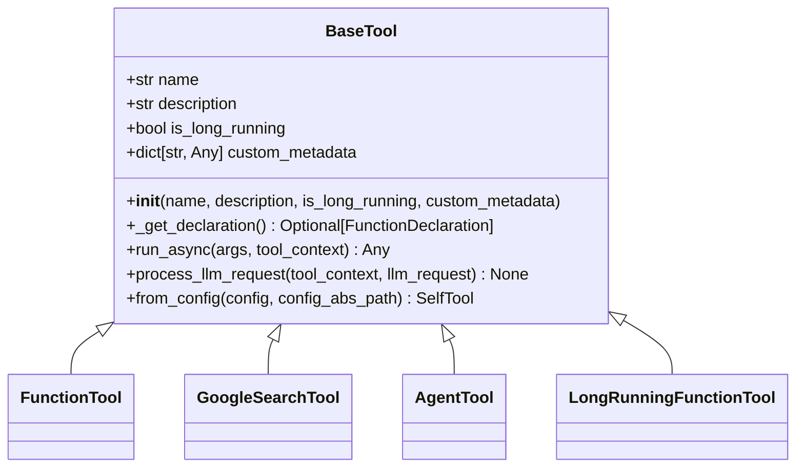
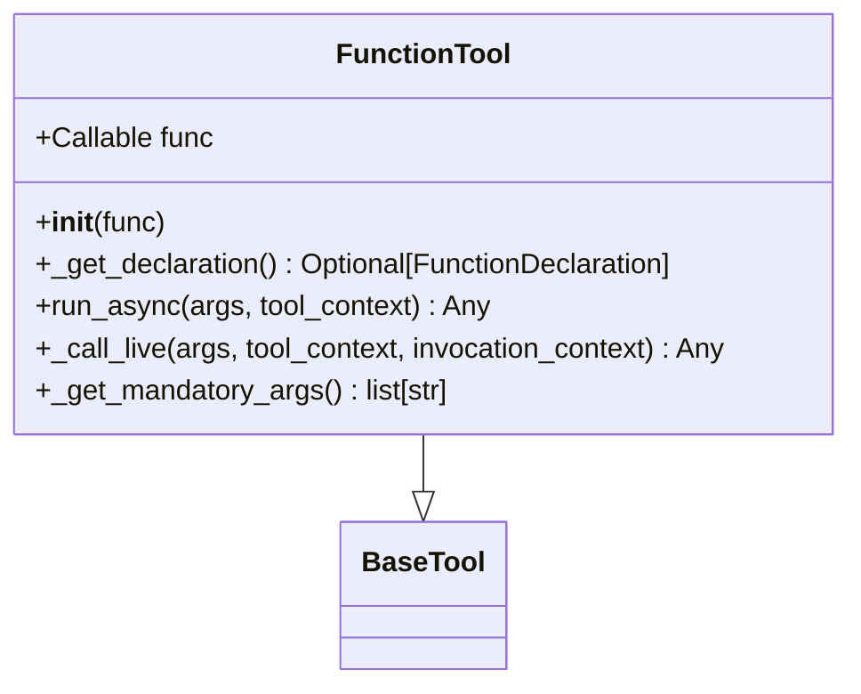
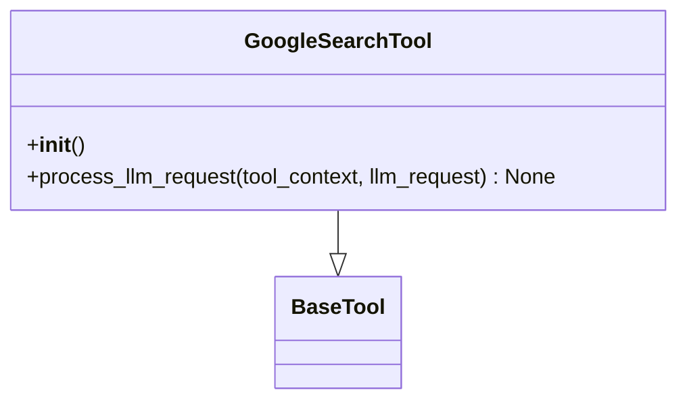
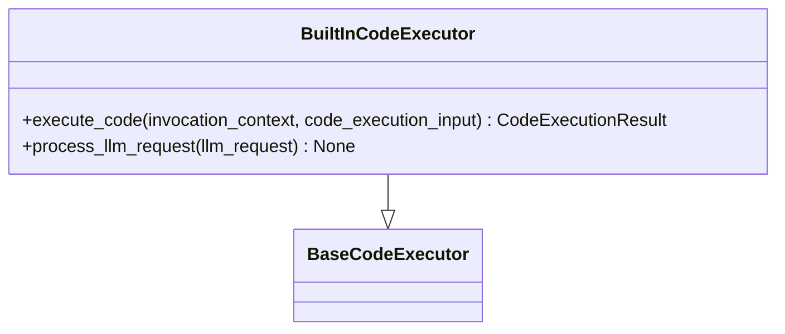
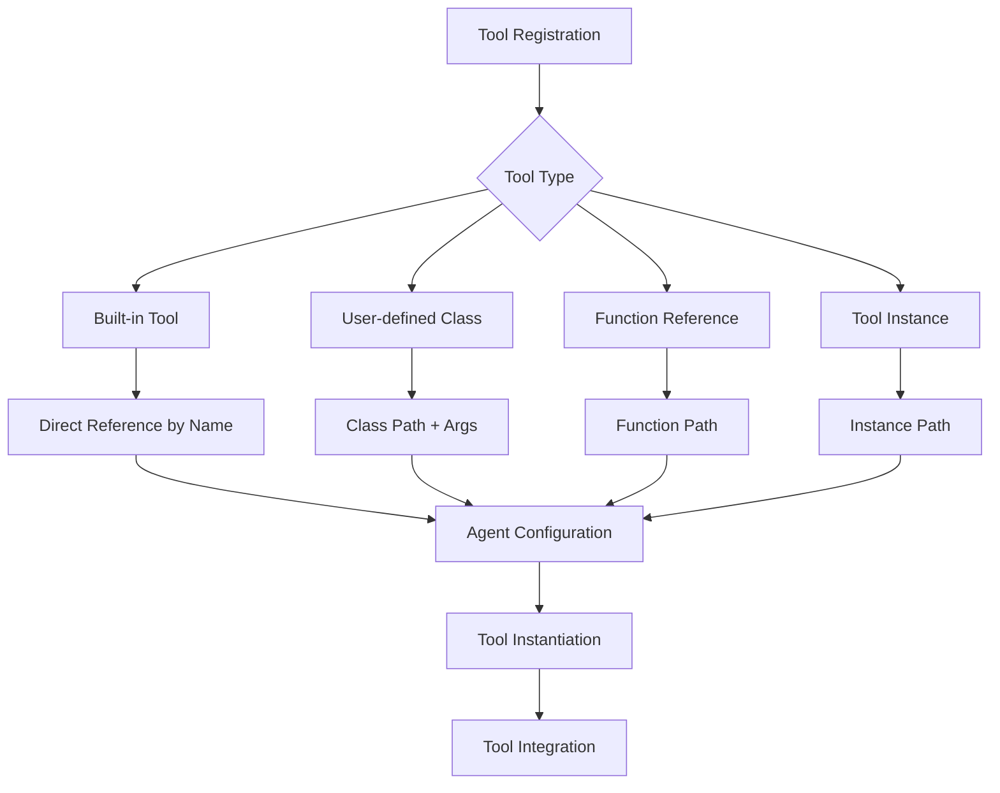
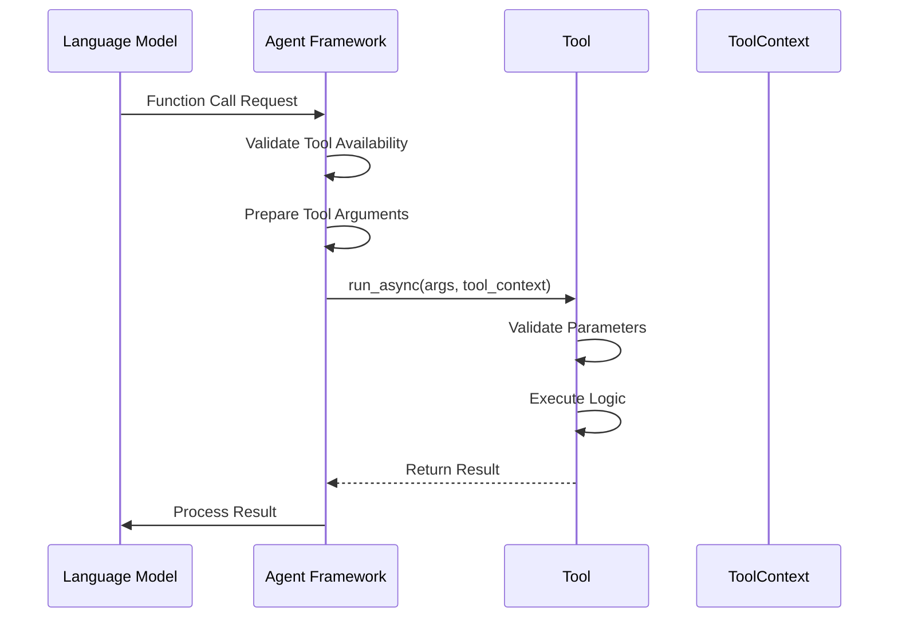
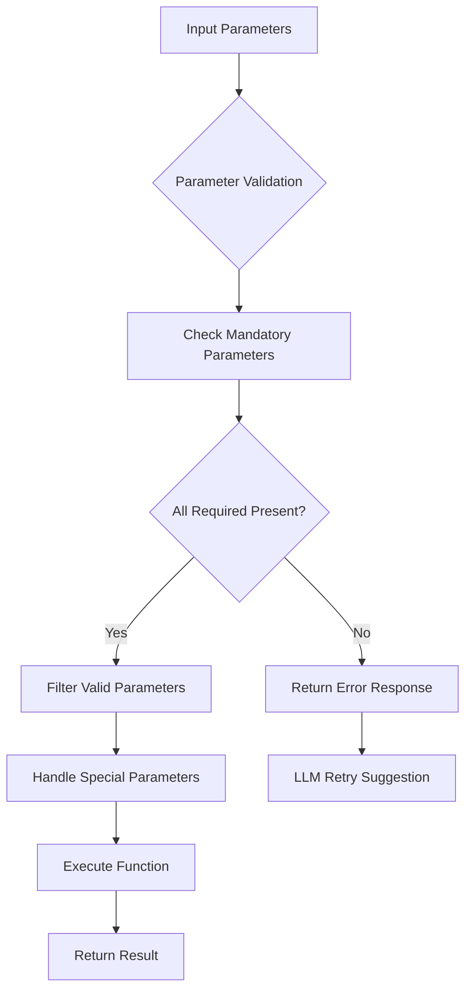
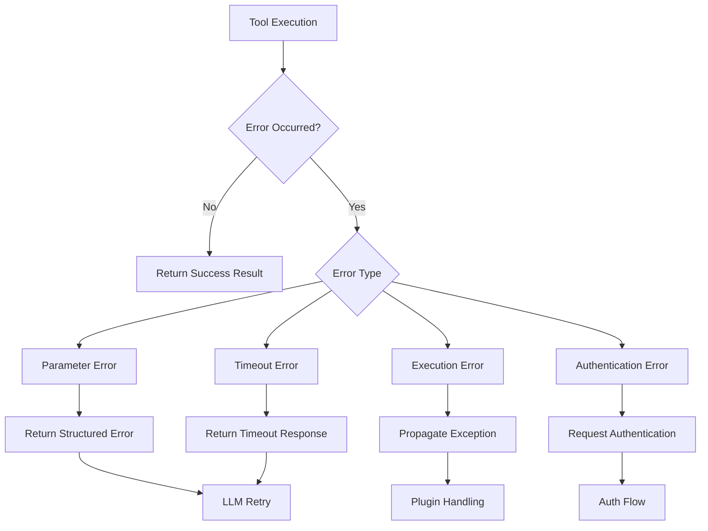
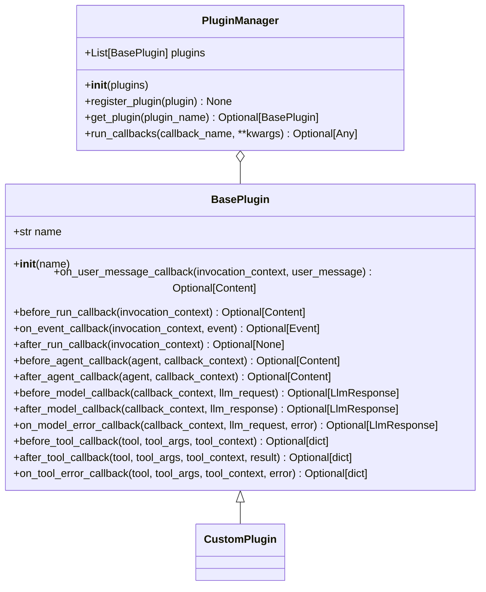

# Tools

<cite>
**Referenced Files in This Document**   
- [base_tool.py](file://src/google/adk/tools/base_tool.py)
- [function_tool.py](file://src/google/adk/tools/function_tool.py)
- [google_search_tool.py](file://src/google/adk/tools/google_search_tool.py)
- [tool_context.py](file://src/google/adk/tools/tool_context.py)
- [tool_configs.py](file://src/google/adk/tools/tool_configs.py)
- [built_in_code_executor.py](file://src/google/adk/code_executors/built_in_code_executor.py)
- [base_plugin.py](file://src/google/adk/plugins/base_plugin.py)
- [plugin_manager.py](file://src/google/adk/plugins/plugin_manager.py)
- [agent.py](file://contributing/samples/code_execution/agent.py)
</cite>

## Table of Contents
1. [Introduction](#introduction)
2. [Base Tool Architecture](#base-tool-architecture)
3. [Tool Types](#tool-types)
4. [Tool Registration and Invocation](#tool-registration-and-invocation)
5. [Tool Execution Lifecycle](#tool-execution-lifecycle)
6. [Parameter Handling and Validation](#parameter-handling-and-validation)
7. [Error Propagation Mechanisms](#error-propagation-mechanisms)
8. [Plugin System for Extensibility](#plugin-system-for-extensibility)
9. [Common Issues and Security Considerations](#common-issues-and-security-considerations)
10. [Performance Optimization](#performance-optimization)
11. [Conclusion](#conclusion)

## Introduction

The Tools concept in the ADK framework extends agent capabilities by enabling integration with external functions, services, and execution environments. Tools serve as the primary mechanism for agents to interact with the outside world, perform computations, access data, and execute actions beyond pure language processing. This documentation provides a comprehensive overview of the tool architecture, including the base class design, various tool types, registration mechanisms, execution lifecycle, and extensibility features.

**Section sources**
- [base_tool.py](file://src/google/adk/tools/base_tool.py#L47-L213)

## Base Tool Architecture

The foundation of the ADK tools system is the `BaseTool` abstract base class, which defines the core interface and functionality for all tools. This class provides essential attributes and methods that enable consistent behavior across different tool implementations.

**Diagram sources**
- [base_tool.py](file://src/google/adk/tools/base_tool.py#L47-L213)

The `BaseTool` class includes several key components:
- **name**: A string identifier for the tool
- **description**: A textual description of the tool's purpose
- **is_long_running**: A boolean flag indicating whether the tool represents a long-running operation
- **custom_metadata**: An optional dictionary for storing tool-specific metadata

The class provides three primary methods:
- `_get_declaration()`: Returns the OpenAPI specification of the tool as a FunctionDeclaration
- `run_async()`: Executes the tool with given arguments and context
- `process_llm_request()`: Processes outgoing LLM requests for the tool

The `from_config()` class method enables tool creation from configuration data, using type hints to automatically map configuration values to constructor arguments.

**Section sources**
- [base_tool.py](file://src/google/adk/tools/base_tool.py#L47-L213)

## Tool Types

The ADK framework supports several specialized tool types, each designed for specific use cases and integration patterns.

### FunctionTool

The `FunctionTool` class wraps user-defined Python functions, allowing them to be invoked as tools within the agent framework. It automatically extracts metadata from callable objects and handles parameter validation.

**Diagram sources**
- [function_tool.py](file://src/google/adk/tools/function_tool.py#L31-L168)

The `FunctionTool` automatically extracts the function name and documentation, validates required parameters, and handles both synchronous and asynchronous function execution. It includes special handling for coroutine functions and provides streaming capabilities through the `_call_live()` method.

### GoogleSearchTool

The `GoogleSearchTool` is a built-in tool that integrates with Gemini models to provide web search capabilities. Unlike other tools, it operates internally within the model rather than executing code locally.

**Diagram sources**
- [google_search_tool.py](file://src/google/adk/tools/google_search_tool.py#L31-L70)

This tool modifies the LLM request configuration to include Google Search functionality, with different implementations for Gemini 1.x and 2.x models. It raises exceptions if used with incompatible models or conflicting tools.

### CodeExecution Tools

Code execution tools enable agents to run Python code in various environments. The framework supports both built-in code execution through Gemini models and external code executors.

**Diagram sources**
- [built_in_code_executor.py](file://src/google/adk/code_executors/built_in_code_executor.py#L28-L56)

The `BuiltInCodeExecutor` integrates with Gemini 2.0+ models to enable code execution within the model environment. It modifies the LLM request to include code execution capabilities and is configured through the agent definition.

**Section sources**
- [function_tool.py](file://src/google/adk/tools/function_tool.py#L31-L168)
- [google_search_tool.py](file://src/google/adk/tools/google_search_tool.py#L31-L70)
- [built_in_code_executor.py](file://src/google/adk/code_executors/built_in_code_executor.py#L28-L56)

## Tool Registration and Invocation

Tools are registered with agents through configuration files or direct instantiation. The framework supports multiple registration patterns, including built-in tools, user-defined functions, and custom tool classes.

The registration process uses the `ToolConfig` class to define tool specifications, which can reference:
- ADK built-in tool instances or classes
- User-defined tool instances via fully qualified paths
- User-defined tool classes with initialization arguments
- Functions that generate tool instances
- Direct function references for function tools

**Diagram sources**
- [tool_configs.py](file://src/google/adk/tools/tool_configs.py#L41-L129)

When an agent is configured with tools, they are automatically integrated into the agent's execution flow. The tools become available for invocation when the LLM determines that external actions are needed to fulfill user requests.

**Section sources**
- [tool_configs.py](file://src/google/adk/tools/tool_configs.py#L41-L129)
- [agent.py](file://contributing/samples/code_execution/agent.py#L80-L100)

## Tool Execution Lifecycle

The tool execution lifecycle consists of several phases, from initial request processing to final result handling. This lifecycle ensures consistent behavior across different tool types and provides hooks for monitoring and intervention.

**Diagram sources**
- [base_tool.py](file://src/google/adk/tools/base_tool.py#L96-L113)
- [tool_context.py](file://src/google/adk/tools/tool_context.py#L48-L81)

The lifecycle begins when the LLM generates a function call request, specifying the tool name and parameters. The agent framework validates that the requested tool is available and properly configured. It then prepares the arguments and invokes the tool's `run_async()` method with the appropriate context.

During execution, the tool has access to the `ToolContext`, which provides information about the current invocation, event actions, and authentication state. The tool processes the request and returns a result, which is then handled by the agent framework and communicated back to the LLM.

**Section sources**
- [base_tool.py](file://src/google/adk/tools/base_tool.py#L96-L113)
- [tool_context.py](file://src/google/adk/tools/tool_context.py#L48-L81)

## Parameter Handling and Validation

Proper parameter handling is critical for reliable tool execution. The ADK framework provides robust mechanisms for parameter validation, type conversion, and error handling.

The `FunctionTool` class includes comprehensive parameter validation that:
- Identifies mandatory parameters (those without default values)
- Filters arguments to include only valid parameters for the target function
- Handles special parameters like `tool_context` and `input_stream`
- Validates parameter types against function signatures

**Diagram sources**
- [function_tool.py](file://src/google/adk/tools/function_tool.py#L144-L168)

When mandatory parameters are missing, the tool returns a structured error response that guides the LLM to provide the missing information in subsequent attempts. This feedback loop helps the agent learn to provide complete parameter sets over time.

**Section sources**
- [function_tool.py](file://src/google/adk/tools/function_tool.py#L97-L108)

## Error Propagation Mechanisms

The ADK framework implements a comprehensive error handling system that ensures failures are properly communicated and can be addressed appropriately.

Tools can fail for various reasons, including:
- Missing required parameters
- Invalid parameter values
- External service failures
- Authentication issues
- Execution timeouts

The framework provides multiple mechanisms for error handling:
- Direct error responses from tools (e.g., returning an error dictionary)
- Exception handling in tool execution methods
- Plugin-based error interception and recovery
- LLM-mediated error recovery through conversation

**Diagram sources**
- [base_tool.py](file://src/google/adk/tools/base_tool.py#L113)
- [function_tool.py](file://src/google/adk/tools/function_tool.py#L103-L108)

The error propagation system allows for both immediate recovery (when possible) and escalation to higher-level error handling mechanisms. Plugins can intercept errors and provide alternative responses or recovery strategies.

**Section sources**
- [base_tool.py](file://src/google/adk/tools/base_tool.py#L113)
- [function_tool.py](file://src/google/adk/tools/function_tool.py#L103-L108)

## Plugin System for Extensibility

The ADK framework includes a plugin system that allows for global modification of agent, tool, and LLM behaviors. Plugins provide a structured way to intercept and modify execution at critical points.

**Diagram sources**
- [base_plugin.py](file://src/google/adk/plugins/base_plugin.py#L41-L368)
- [plugin_manager.py](file://src/google/adk/plugins/plugin_manager.py#L58-L300)

Plugins can implement one or more callback methods to intercept execution at specific points:
- `before_tool_callback`: Executed before a tool call, allowing argument modification or short-circuiting
- `after_tool_callback`: Executed after a tool call, allowing result modification
- `on_tool_error_callback`: Executed when a tool encounters an error, enabling graceful recovery

The plugin system follows an execution order where plugins take precedence over agent callbacks. When a plugin callback returns a non-None value, it short-circuits the execution chain, preventing subsequent plugins and agent callbacks from executing.

**Section sources**
- [base_plugin.py](file://src/google/adk/plugins/base_plugin.py#L41-L368)
- [plugin_manager.py](file://src/google/adk/plugins/plugin_manager.py#L58-L300)

## Common Issues and Security Considerations

When working with tools, several common issues and security considerations must be addressed to ensure reliable and secure operation.

### Tool Timeout Handling

Long-running tools can impact system performance and user experience. The framework provides mechanisms to handle timeouts:
- Configurable timeout values for external tool execution
- Asynchronous execution to prevent blocking
- Progress reporting for long-running operations
- Graceful timeout handling with appropriate error messages

### Security Considerations

Executing external code and accessing external services introduces security risks that must be mitigated:
- Code execution should be sandboxed or restricted to safe environments
- Authentication credentials should be properly managed and never exposed
- Input validation should prevent injection attacks
- Access controls should limit tool availability based on user permissions
- Audit logging should track tool usage and data access

The `ToolContext` class provides methods for secure credential handling, including `request_credential()` for requesting authentication and `get_auth_response()` for retrieving authentication responses. These methods ensure that sensitive credentials are managed securely and not exposed in tool outputs.

**Section sources**
- [tool_context.py](file://src/google/adk/tools/tool_context.py#L62-L70)

## Performance Optimization

Effective performance optimization for tools involves several strategies to minimize latency and resource usage.

### Managing Tool Dependencies

- **Lazy loading**: Load tool dependencies only when needed
- **Caching**: Cache frequently used tools or tool configurations
- **Connection pooling**: Reuse connections to external services
- **Batching**: Combine multiple tool calls when possible

### Caching Tool Results

Caching can significantly improve performance for tools with expensive or frequently repeated operations:
- **Result caching**: Store tool results for identical inputs
- **Time-based invalidation**: Expire cached results after a specified duration
- **Conditional caching**: Cache only certain types of results
- **Distributed caching**: Use shared caches in multi-instance deployments

The plugin system can be leveraged for caching through the `before_model_callback` and `after_model_callback` methods, which can intercept requests and return cached responses when appropriate.

**Section sources**
- [plugin_manager.py](file://src/google/adk/plugins/plugin_manager.py#L215-L233)

## Conclusion

The Tools concept in the ADK framework provides a powerful and flexible mechanism for extending agent capabilities. By understanding the base tool architecture, various tool types, registration patterns, execution lifecycle, and extensibility features, developers can create sophisticated agents that integrate seamlessly with external systems and services.

The framework's comprehensive error handling, security features, and performance optimization capabilities ensure that tools can be used reliably and efficiently in production environments. The plugin system further enhances extensibility, allowing for global modification of behavior without changing core agent logic.

By following the patterns and best practices outlined in this documentation, developers can create robust, secure, and high-performance agents that leverage the full power of the ADK framework's tool system.