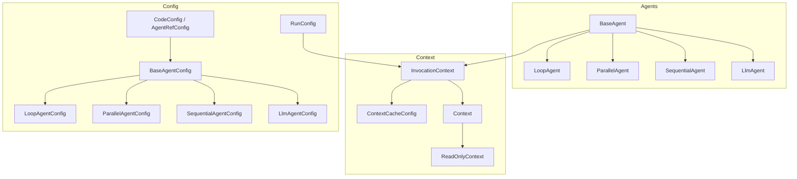
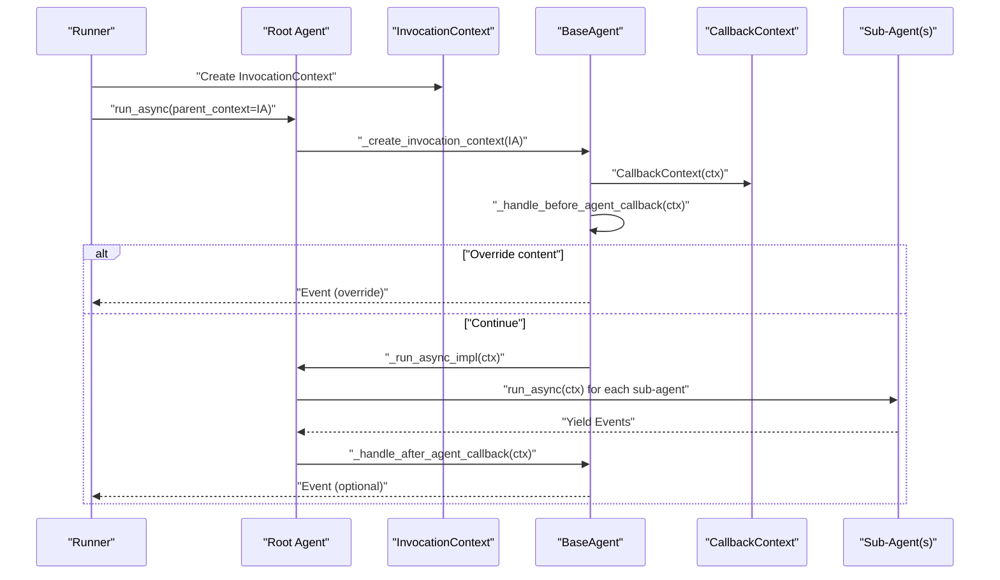
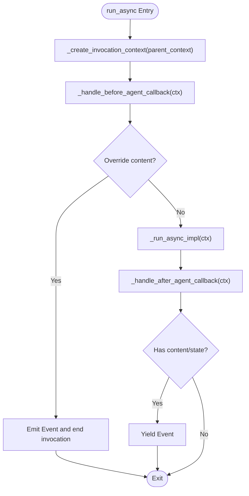
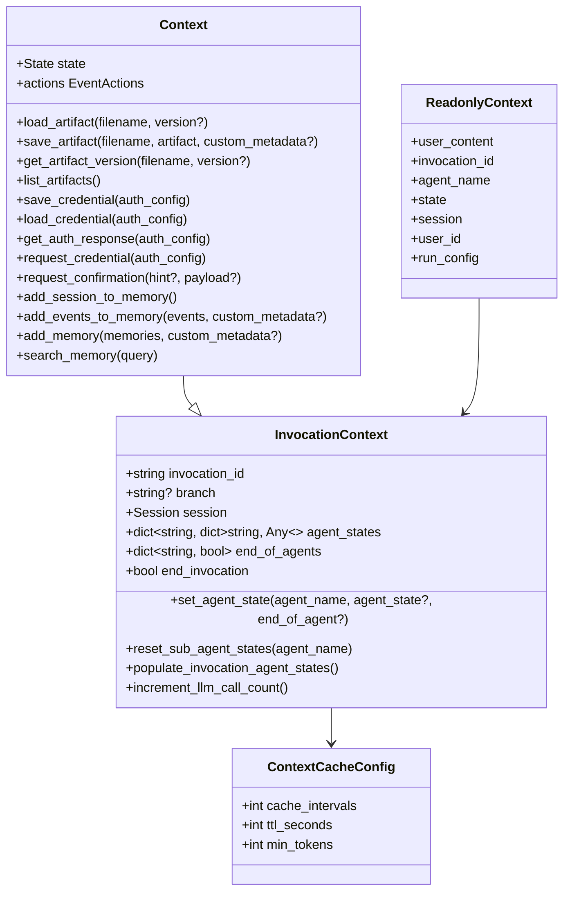
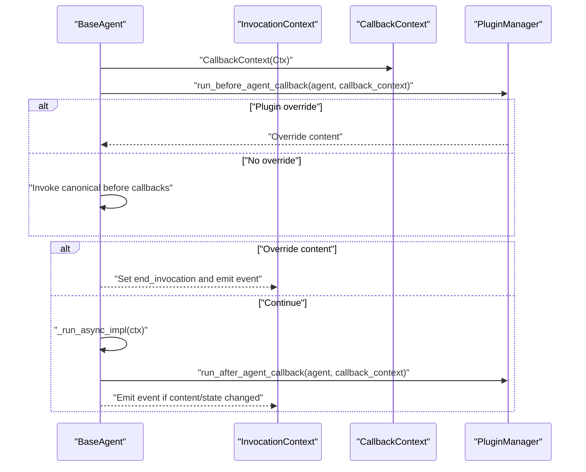
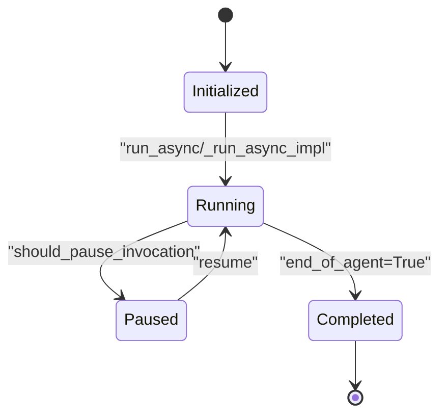
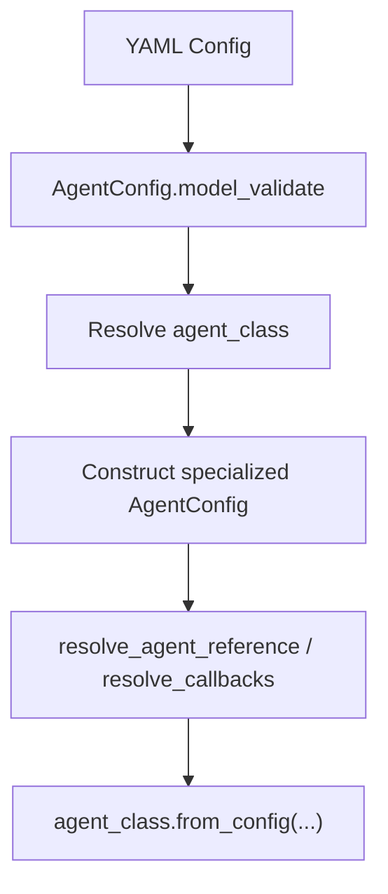
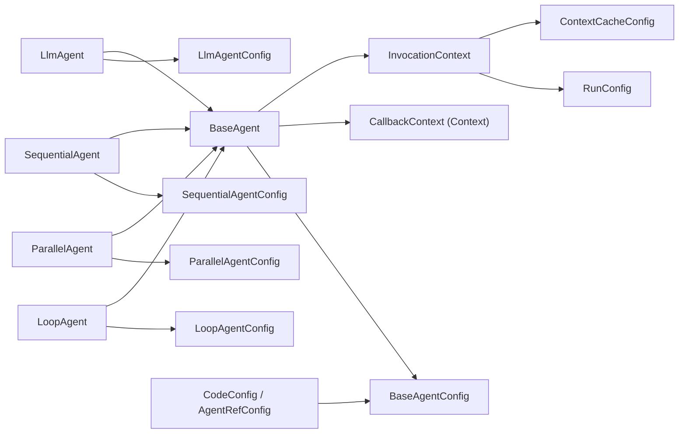

# Agent Runtime System

<cite>
**Referenced Files in This Document**
- [base_agent.py](file://src/google/adk/agents/base_agent.py)
- [context.py](file://src/google/adk/agents/context.py)
- [invocation_context.py](file://src/google/adk/agents/invocation_context.py)
- [readonly_context.py](file://src/google/adk/agents/readonly_context.py)
- [callback_context.py](file://src/google/adk/agents/callback_context.py)
- [context_cache_config.py](file://src/google/adk/agents/context_cache_config.py)
- [llm_agent.py](file://src/google/adk/agents/llm_agent.py)
- [sequential_agent.py](file://src/google/adk/agents/sequential_agent.py)
- [parallel_agent.py](file://src/google/adk/agents/parallel_agent.py)
- [loop_agent.py](file://src/google/adk/agents/loop_agent.py)
- [base_agent_config.py](file://src/google/adk/agents/base_agent_config.py)
- [llm_agent_config.py](file://src/google/adk/agents/llm_agent_config.py)
- [sequential_agent_config.py](file://src/google/adk/agents/sequential_agent_config.py)
- [parallel_agent_config.py](file://src/google/adk/agents/parallel_agent_config.py)
- [loop_agent_config.py](file://src/google/adk/agents/loop_agent_config.py)
- [common_configs.py](file://src/google/adk/agents/common_configs.py)
- [config_agent_utils.py](file://src/google/adk/agents/config_agent_utils.py)
- [run_config.py](file://src/google/adk/agents/run_config.py)
</cite>

## Table of Contents
1. [Introduction](#introduction)
2. [Project Structure](#project-structure)
3. [Core Components](#core-components)
4. [Architecture Overview](#architecture-overview)
5. [Detailed Component Analysis](#detailed-component-analysis)
6. [Dependency Analysis](#dependency-analysis)
7. [Performance Considerations](#performance-considerations)
8. [Troubleshooting Guide](#troubleshooting-guide)
9. [Conclusion](#conclusion)
10. [Appendices](#appendices)

## Introduction
This document explains the agent runtime system architecture of the Agent Development Kit (ADK). It focuses on the BaseAgent class hierarchy, agent lifecycle management, the context system (InvocationContext, ReadOnlyContext, Context, CallbackContext), callback mechanisms, agent state management, configuration handling, execution patterns, and the relationship between agents and their execution environment. It also covers agent composition, context manipulation, callback implementation, isolation, security considerations, and performance optimization techniques.

## Project Structure
The agent runtime resides primarily under the agents package. Core runtime constructs include:
- BaseAgent and specialized agents (LlmAgent, SequentialAgent, ParallelAgent, LoopAgent)
- InvocationContext and Context for runtime state and environment
- CallbackContext unified with Context
- Configuration models for agents and runtime behavior
- Utilities for building agents from YAML configuration

**Diagram sources**
- [base_agent.py](file://src/google/adk/agents/base_agent.py#L86-L701)
- [llm_agent.py](file://src/google/adk/agents/llm_agent.py#L187-L800)
- [sequential_agent.py](file://src/google/adk/agents/sequential_agent.py#L48-L160)
- [parallel_agent.py](file://src/google/adk/agents/parallel_agent.py#L150-L217)
- [loop_agent.py](file://src/google/adk/agents/loop_agent.py#L52-L167)
- [invocation_context.py](file://src/google/adk/agents/invocation_context.py#L100-L418)
- [context.py](file://src/google/adk/agents/context.py#L41-L413)
- [readonly_context.py](file://src/google/adk/agents/readonly_context.py#L30-L72)
- [context_cache_config.py](file://src/google/adk/agents/context_cache_config.py#L25-L86)
- [base_agent_config.py](file://src/google/adk/agents/base_agent_config.py#L37-L83)
- [llm_agent_config.py](file://src/google/adk/agents/llm_agent_config.py#L35-L231)
- [sequential_agent_config.py](file://src/google/adk/agents/sequential_agent_config.py#L27-L41)
- [parallel_agent_config.py](file://src/google/adk/agents/parallel_agent_config.py#L27-L41)
- [loop_agent_config.py](file://src/google/adk/agents/loop_agent_config.py#L29-L45)
- [common_configs.py](file://src/google/adk/agents/common_configs.py#L31-L146)
- [run_config.py](file://src/google/adk/agents/run_config.py#L182-L352)

**Section sources**
- [base_agent.py](file://src/google/adk/agents/base_agent.py#L86-L701)
- [invocation_context.py](file://src/google/adk/agents/invocation_context.py#L100-L418)
- [context.py](file://src/google/adk/agents/context.py#L41-L413)
- [readonly_context.py](file://src/google/adk/agents/readonly_context.py#L30-L72)
- [context_cache_config.py](file://src/google/adk/agents/context_cache_config.py#L25-L86)
- [base_agent_config.py](file://src/google/adk/agents/base_agent_config.py#L37-L83)
- [llm_agent_config.py](file://src/google/adk/agents/llm_agent_config.py#L35-L231)
- [sequential_agent_config.py](file://src/google/adk/agents/sequential_agent_config.py#L27-L41)
- [parallel_agent_config.py](file://src/google/adk/agents/parallel_agent_config.py#L27-L41)
- [loop_agent_config.py](file://src/google/adk/agents/loop_agent_config.py#L29-L45)
- [common_configs.py](file://src/google/adk/agents/common_configs.py#L31-L146)
- [run_config.py](file://src/google/adk/agents/run_config.py#L182-L352)

## Core Components
- BaseAgent: Central base class defining agent lifecycle, callbacks, cloning, and state management hooks. Provides run_async and run_live entry points and orchestrates before/after callbacks.
- InvocationContext: Immutable per-invocation environment carrying session, agent, artifacts, credentials, memory, resumability, and invocation-scoped state.
- Context: Mutable extension of InvocationContext exposing state deltas, artifacts, credentials, confirmations, and memory APIs for tools and callbacks.
- ReadOnlyContext: Read-only view of InvocationContext for callbacks and tools that should not mutate state.
- CallbackContext: Unified alias for Context (backward compatibility).
- ContextCacheConfig: Controls context caching behavior across agents.
- Specialized Agents: LlmAgent (LLM orchestration), SequentialAgent (ordered sub-agent execution), ParallelAgent (isolated concurrent execution), LoopAgent (iterative sub-agent execution).
- Config Models: BaseAgentConfig and specialized configs; CodeConfig and AgentRefConfig for references; RunConfig for runtime behavior.

**Section sources**
- [base_agent.py](file://src/google/adk/agents/base_agent.py#L86-L701)
- [invocation_context.py](file://src/google/adk/agents/invocation_context.py#L100-L418)
- [context.py](file://src/google/adk/agents/context.py#L41-L413)
- [readonly_context.py](file://src/google/adk/agents/readonly_context.py#L30-L72)
- [callback_context.py](file://src/google/adk/agents/callback_context.py#L15-L23)
- [context_cache_config.py](file://src/google/adk/agents/context_cache_config.py#L25-L86)
- [llm_agent.py](file://src/google/adk/agents/llm_agent.py#L187-L800)
- [sequential_agent.py](file://src/google/adk/agents/sequential_agent.py#L48-L160)
- [parallel_agent.py](file://src/google/adk/agents/parallel_agent.py#L150-L217)
- [loop_agent.py](file://src/google/adk/agents/loop_agent.py#L52-L167)
- [base_agent_config.py](file://src/google/adk/agents/base_agent_config.py#L37-L83)
- [llm_agent_config.py](file://src/google/adk/agents/llm_agent_config.py#L35-L231)
- [run_config.py](file://src/google/adk/agents/run_config.py#L182-L352)

## Architecture Overview
The runtime executes agents within an InvocationContext. BaseAgent manages lifecycle and callbacks; specialized agents implement execution logic. Context exposes mutable state and services; ReadOnlyContext ensures safe read-only access. Configuration drives agent instantiation and runtime behavior.

**Diagram sources**
- [base_agent.py](file://src/google/adk/agents/base_agent.py#L273-L550)
- [context.py](file://src/google/adk/agents/context.py#L41-L110)
- [invocation_context.py](file://src/google/adk/agents/invocation_context.py#L100-L220)

**Section sources**
- [base_agent.py](file://src/google/adk/agents/base_agent.py#L273-L550)
- [context.py](file://src/google/adk/agents/context.py#L41-L110)
- [invocation_context.py](file://src/google/adk/agents/invocation_context.py#L100-L220)

## Detailed Component Analysis

### BaseAgent Lifecycle and Callbacks
- Lifecycle entry points: run_async and run_live. Both create InvocationContext, run before callbacks, execute agent logic, and run after callbacks.
- Callbacks: before_agent_callback and after_agent_callback accept single or list of callbacks. They can short-circuit execution by returning content or mutate state via CallbackContext.
- State management: _load_agent_state and _create_agent_state_event integrate with InvocationContext.agent_states and end_of_agents.
- Cloning: clone creates a deep copy of an agent and its sub-agents, preventing shared mutable state.

**Diagram sources**
- [base_agent.py](file://src/google/adk/agents/base_agent.py#L273-L550)

**Section sources**
- [base_agent.py](file://src/google/adk/agents/base_agent.py#L273-L550)

### InvocationContext and Context System
- InvocationContext encapsulates the execution environment: session, agent, artifacts, memory, credentials, resumability, and invocation-scoped state. It tracks end_of_agents and end_invocation flags.
- Context extends InvocationContext with mutable state and convenience methods for artifacts, credentials, confirmations, and memory.
- ReadOnlyContext provides read-only access to InvocationContext for callbacks and tools.
- ContextCacheConfig enables context caching across agents when present.

**Diagram sources**
- [invocation_context.py](file://src/google/adk/agents/invocation_context.py#L100-L418)
- [context.py](file://src/google/adk/agents/context.py#L41-L413)
- [readonly_context.py](file://src/google/adk/agents/readonly_context.py#L30-L72)
- [context_cache_config.py](file://src/google/adk/agents/context_cache_config.py#L25-L86)

**Section sources**
- [invocation_context.py](file://src/google/adk/agents/invocation_context.py#L100-L418)
- [context.py](file://src/google/adk/agents/context.py#L41-L413)
- [readonly_context.py](file://src/google/adk/agents/readonly_context.py#L30-L72)
- [context_cache_config.py](file://src/google/adk/agents/context_cache_config.py#L25-L86)

### Callback Mechanism and CallbackContext
- CallbackContext is an alias for Context, enabling tools and plugins to manipulate state and request actions.
- BaseAgent resolves canonical callbacks from before_agent_callback and after_agent_callback lists and invokes them in order until one returns non-None.
- Plugins can contribute callbacks via plugin_manager.

**Diagram sources**
- [base_agent.py](file://src/google/adk/agents/base_agent.py#L434-L550)
- [callback_context.py](file://src/google/adk/agents/callback_context.py#L15-L23)

**Section sources**
- [base_agent.py](file://src/google/adk/agents/base_agent.py#L434-L550)
- [callback_context.py](file://src/google/adk/agents/callback_context.py#L15-L23)

### Agent State Management and Execution Patterns
- BaseAgentState and specialized states (SequentialAgentState, LoopAgentState) persist agent progress across turns.
- InvocationContext.set_agent_state and end_of_agents coordinate resumability and state transitions.
- LlmAgent orchestrates model calls and tool execution via flows; supports controlled input/output via schemas and planner.
- SequentialAgent runs sub-agents in order, saving state per sub-agent and supporting resumption.
- ParallelAgent runs sub-agents concurrently with isolated branches and merges events.
- LoopAgent repeats sub-agent execution up to max_iterations or until escalation.

**Diagram sources**
- [base_agent.py](file://src/google/adk/agents/base_agent.py#L168-L210)
- [invocation_context.py](file://src/google/adk/agents/invocation_context.py#L232-L326)
- [sequential_agent.py](file://src/google/adk/agents/sequential_agent.py#L54-L93)
- [parallel_agent.py](file://src/google/adk/agents/parallel_agent.py#L163-L210)
- [loop_agent.py](file://src/google/adk/agents/loop_agent.py#L69-L124)

**Section sources**
- [base_agent.py](file://src/google/adk/agents/base_agent.py#L168-L210)
- [invocation_context.py](file://src/google/adk/agents/invocation_context.py#L232-L326)
- [sequential_agent.py](file://src/google/adk/agents/sequential_agent.py#L54-L93)
- [parallel_agent.py](file://src/google/adk/agents/parallel_agent.py#L163-L210)
- [loop_agent.py](file://src/google/adk/agents/loop_agent.py#L69-L124)

### Configuration Handling and Agent Composition
- BaseAgentConfig defines common fields; specialized configs extend it for agent-specific behavior.
- CodeConfig and AgentRefConfig resolve callbacks and sub-agent references from code or YAML.
- from_config loads YAML, validates, and constructs agents; resolve_agent_reference builds sub-agents.
- RunConfig governs streaming, threading, limits, and live session behavior.

**Diagram sources**
- [config_agent_utils.py](file://src/google/adk/agents/config_agent_utils.py#L34-L104)
- [base_agent_config.py](file://src/google/adk/agents/base_agent_config.py#L37-L83)
- [llm_agent_config.py](file://src/google/adk/agents/llm_agent_config.py#L35-L231)
- [common_configs.py](file://src/google/adk/agents/common_configs.py#L31-L146)
- [run_config.py](file://src/google/adk/agents/run_config.py#L182-L352)

**Section sources**
- [config_agent_utils.py](file://src/google/adk/agents/config_agent_utils.py#L34-L104)
- [base_agent_config.py](file://src/google/adk/agents/base_agent_config.py#L37-L83)
- [llm_agent_config.py](file://src/google/adk/agents/llm_agent_config.py#L35-L231)
- [common_configs.py](file://src/google/adk/agents/common_configs.py#L31-L146)
- [run_config.py](file://src/google/adk/agents/run_config.py#L182-L352)

### Agent Composition Examples
- SequentialAgent composes sub-agents in order, saving state per sub-agent and resuming from the last executed sub-agent.
- ParallelAgent isolates sub-agents into separate branches and merges events with backpressure.
- LoopAgent iterates sub-agents up to max_iterations or until escalation.

**Section sources**
- [sequential_agent.py](file://src/google/adk/agents/sequential_agent.py#L54-L93)
- [parallel_agent.py](file://src/google/adk/agents/parallel_agent.py#L163-L210)
- [loop_agent.py](file://src/google/adk/agents/loop_agent.py#L69-L124)

### Context Manipulation and Callback Implementation
- Context exposes state mutations via State; actions capture state deltas, artifact versions, and requested confirmations.
- Tools and callbacks can request credentials and confirmations; memory APIs add or search memory entries.
- CallbackContext (alias of Context) enables state changes and action requests during before/after agent callbacks.

**Section sources**
- [context.py](file://src/google/adk/agents/context.py#L41-L413)
- [callback_context.py](file://src/google/adk/agents/callback_context.py#L15-L23)

### Relationship Between Agents and Execution Environment
- InvocationContext ties agents to session, artifacts, memory, credentials, and resumability.
- LlmAgent integrates with BaseLlm flows, canonical instructions, tools, and schemas.
- RunConfig influences streaming, threading, and LLM call limits.

**Section sources**
- [invocation_context.py](file://src/google/adk/agents/invocation_context.py#L100-L220)
- [llm_agent.py](file://src/google/adk/agents/llm_agent.py#L187-L800)
- [run_config.py](file://src/google/adk/agents/run_config.py#L182-L352)

## Dependency Analysis
The following diagram highlights key dependencies among core runtime components.

**Diagram sources**
- [base_agent.py](file://src/google/adk/agents/base_agent.py#L86-L120)
- [llm_agent.py](file://src/google/adk/agents/llm_agent.py#L187-L205)
- [sequential_agent.py](file://src/google/adk/agents/sequential_agent.py#L48-L52)
- [parallel_agent.py](file://src/google/adk/agents/parallel_agent.py#L150-L161)
- [loop_agent.py](file://src/google/adk/agents/loop_agent.py#L52-L60)
- [base_agent_config.py](file://src/google/adk/agents/base_agent_config.py#L37-L83)
- [llm_agent_config.py](file://src/google/adk/agents/llm_agent_config.py#L35-L52)
- [sequential_agent_config.py](file://src/google/adk/agents/sequential_agent_config.py#L27-L41)
- [parallel_agent_config.py](file://src/google/adk/agents/parallel_agent_config.py#L27-L41)
- [loop_agent_config.py](file://src/google/adk/agents/loop_agent_config.py#L29-L45)
- [common_configs.py](file://src/google/adk/agents/common_configs.py#L31-L146)
- [invocation_context.py](file://src/google/adk/agents/invocation_context.py#L100-L151)
- [context_cache_config.py](file://src/google/adk/agents/context_cache_config.py#L25-L46)
- [run_config.py](file://src/google/adk/agents/run_config.py#L182-L221)

**Section sources**
- [base_agent.py](file://src/google/adk/agents/base_agent.py#L86-L120)
- [llm_agent.py](file://src/google/adk/agents/llm_agent.py#L187-L205)
- [sequential_agent.py](file://src/google/adk/agents/sequential_agent.py#L48-L52)
- [parallel_agent.py](file://src/google/adk/agents/parallel_agent.py#L150-L161)
- [loop_agent.py](file://src/google/adk/agents/loop_agent.py#L52-L60)
- [base_agent_config.py](file://src/google/adk/agents/base_agent_config.py#L37-L83)
- [llm_agent_config.py](file://src/google/adk/agents/llm_agent_config.py#L35-L52)
- [sequential_agent_config.py](file://src/google/adk/agents/sequential_agent_config.py#L27-L41)
- [parallel_agent_config.py](file://src/google/adk/agents/parallel_agent_config.py#L27-L41)
- [loop_agent_config.py](file://src/google/adk/agents/loop_agent_config.py#L29-L45)
- [common_configs.py](file://src/google/adk/agents/common_configs.py#L31-L146)
- [invocation_context.py](file://src/google/adk/agents/invocation_context.py#L100-L151)
- [context_cache_config.py](file://src/google/adk/agents/context_cache_config.py#L25-L46)
- [run_config.py](file://src/google/adk/agents/run_config.py#L182-L221)

## Performance Considerations
- Context caching: ContextCacheConfig reduces latency and cost by reusing cached context across invocations when enabled at the app level.
- Streaming modes: RunConfig.streaming_mode controls SSE vs. non-streaming behavior; progressive SSE streaming affects duplication handling and UI rendering.
- Thread pools: RunConfig.tool_thread_pool_config offloads blocking I/O and async-with-blocking calls to keep the event loop responsive.
- LLM call limits: InvocationContext.increment_llm_call_count enforces max_llm_calls to prevent runaway model usage.
- Parallel execution: ParallelAgent isolates sub-agents and merges events with backpressure to balance throughput and resource usage.

[No sources needed since this section provides general guidance]

## Troubleshooting Guide
- LLM call limit exceeded: LlmCallsLimitExceededError is raised when max_llm_calls is exceeded; tune RunConfig.max_llm_calls.
- Duplicate partial/final events in SSE: Filter based on event.partial to avoid double-display; see RunConfig.streaming_mode documentation.
- Missing sub-agent during resume: SequentialAgent and LoopAgent recover by restarting from the beginning if a referenced sub-agent is missing; ensure sub-agent names remain consistent.
- Pausing/resuming invocations: Use InvocationContext.should_pause_invocation to detect long-running tool calls; ensure resumability is configured.

**Section sources**
- [invocation_context.py](file://src/google/adk/agents/invocation_context.py#L47-L98)
- [run_config.py](file://src/google/adk/agents/run_config.py#L52-L179)
- [sequential_agent.py](file://src/google/adk/agents/sequential_agent.py#L94-L118)
- [loop_agent.py](file://src/google/adk/agents/loop_agent.py#L125-L146)

## Conclusion
The ADK agent runtime provides a robust, extensible foundation for building conversational agents. BaseAgent centralizes lifecycle and callback orchestration, while InvocationContext and Context deliver a secure, stateful execution environment. Specialized agents enable diverse execution patterns, and configuration-driven composition simplifies agent assembly. With context caching, streaming, and thread pooling, the system balances performance and usability. Adhering to isolation and security practices ensures reliable operation in production environments.

[No sources needed since this section summarizes without analyzing specific files]

## Appendices

### Security Considerations
- Credential handling: Use Context.save_credential and Context.load_credential for secure storage and retrieval; request_credential and request_confirmation gate sensitive actions.
- Read-only access: Prefer ReadOnlyContext for callbacks/tools that should not mutate state.
- Validation: BaseAgent enforces agent naming and uniqueness; sub-agent names must be unique.

**Section sources**
- [context.py](file://src/google/adk/agents/context.py#L203-L272)
- [readonly_context.py](file://src/google/adk/agents/readonly_context.py#L30-L72)
- [base_agent.py](file://src/google/adk/agents/base_agent.py#L572-L620)

### Agent Isolation and Branching
- ParallelAgent creates isolated branches per sub-agent to prevent cross-contamination of conversation history.
- InvocationContext.branch propagates through sub-agent invocations; events are filtered by branch for privacy.

**Section sources**
- [parallel_agent.py](file://src/google/adk/agents/parallel_agent.py#L35-L49)
- [invocation_context.py](file://src/google/adk/agents/invocation_context.py#L152-L162)