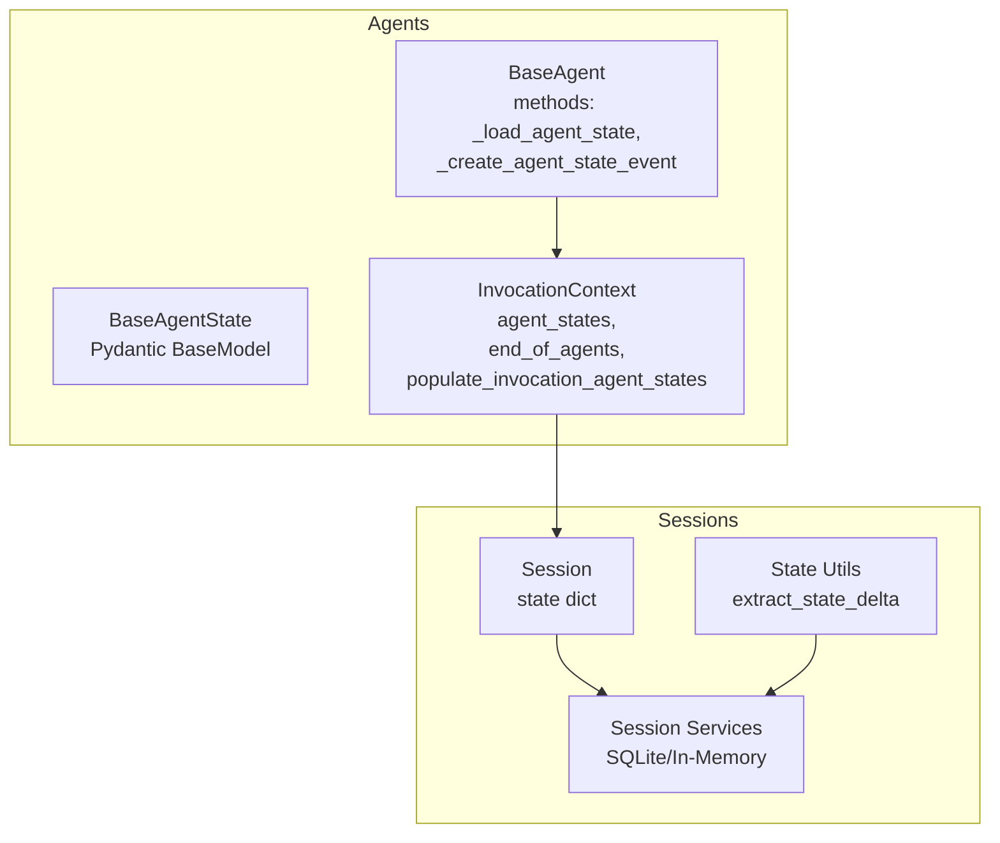
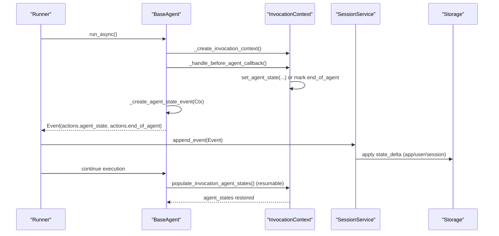
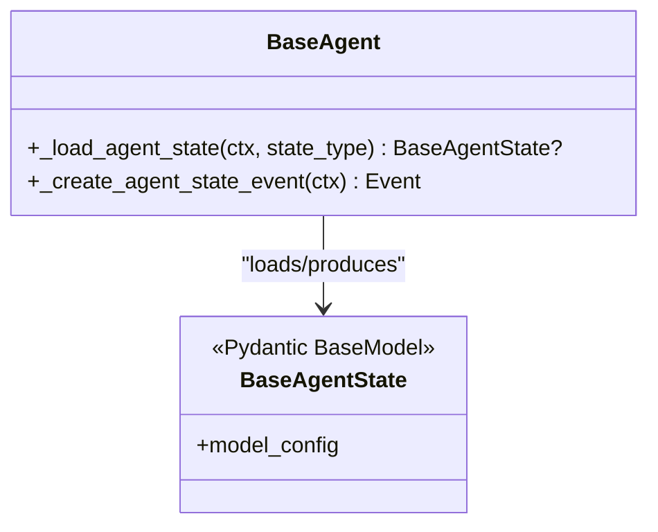
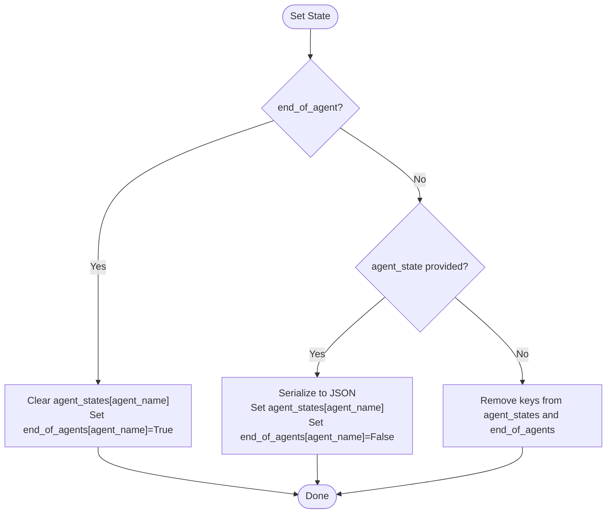
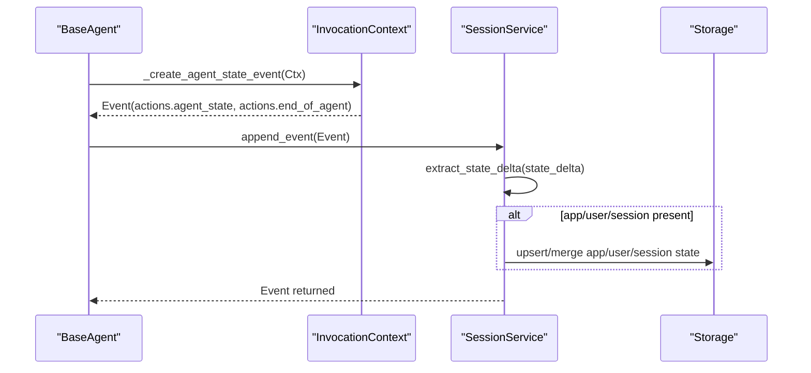
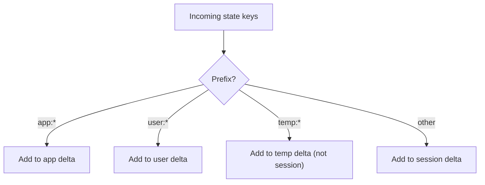
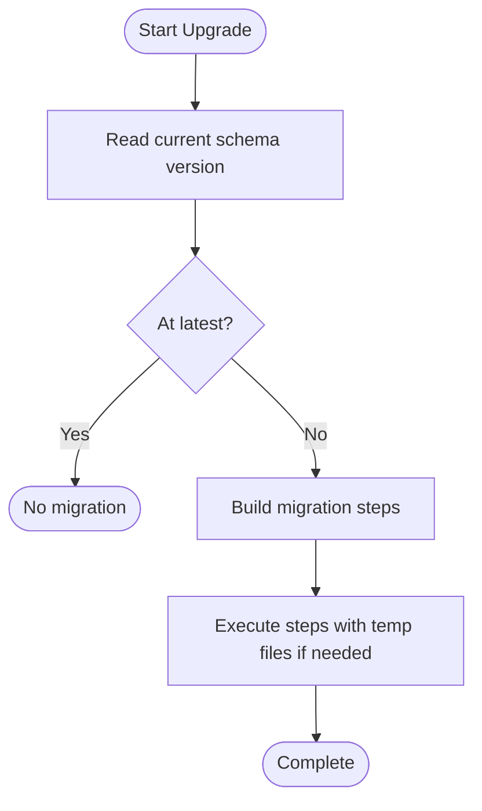
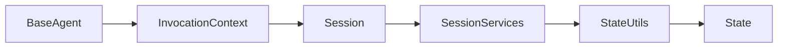
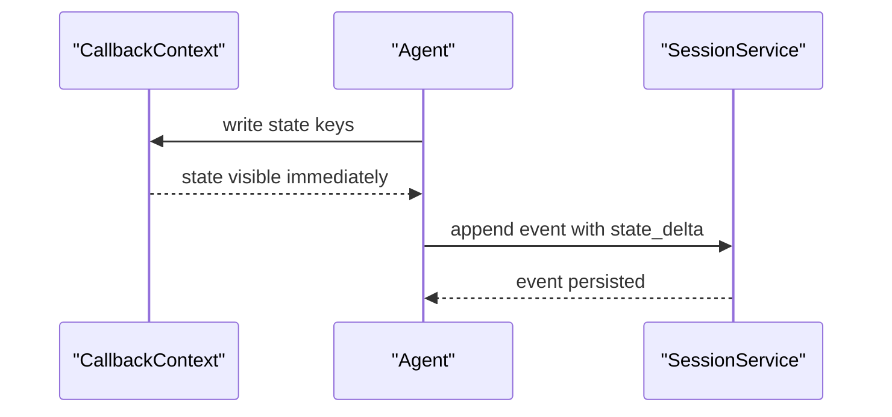

# Agent State Management

<cite>
**Referenced Files in This Document**
- [base_agent.py](file://src/google/adk/agents/base_agent.py)
- [invocation_context.py](file://src/google/adk/agents/invocation_context.py)
- [state.py](file://src/google/adk/sessions/state.py)
- [_session_util.py](file://src/google/adk/sessions/_session_util.py)
- [sqlite_session_service.py](file://src/google/adk/sessions/sqlite_session_service.py)
- [in_memory_session_service.py](file://src/google/adk/sessions/in_memory_session_service.py)
- [session.py](file://src/google/adk/sessions/session.py)
- [agent.py](file://contributing/samples/session_state_agent/agent.py)
- [README.md](file://contributing/samples/session_state_agent/README.md)
- [test_base_agent.py](file://tests/unittests/agents/test_base_agent.py)
- [test_invocation_context.py](file://tests/unittests/agents/test_invocation_context.py)
- [migration_runner.py](file://src/google/adk/sessions/migration/migration_runner.py)
- [migrate_from_sqlalchemy_pickle.py](file://src/google/adk/sessions/migration/migrate_from_sqlalchemy_pickle.py)
- [instructions_utils.py](file://src/google/adk/utils/instructions_utils.py)
</cite>

## Table of Contents
1. [Introduction](#introduction)
2. [Project Structure](#project-structure)
3. [Core Components](#core-components)
4. [Architecture Overview](#architecture-overview)
5. [Detailed Component Analysis](#detailed-component-analysis)
6. [Dependency Analysis](#dependency-analysis)
7. [Performance Considerations](#performance-considerations)
8. [Troubleshooting Guide](#troubleshooting-guide)
9. [Conclusion](#conclusion)
10. [Appendices](#appendices)

## Introduction
This document explains agent state management in the runtime system. It focuses on the BaseAgentState class and its role in maintaining agent-specific state across invocations, the BaseAgent methods for loading and persisting state, and the broader state lifecycle across invocation contexts and session services. It covers validation, serialization/deserialization, inheritance and isolation, cleanup, versioning and migration, security, performance, and debugging.

## Project Structure
The state management spans several modules:
- Agents define BaseAgentState and BaseAgent methods for state handling.
- InvocationContext manages per-invocation state and end-of-agent flags.
- Session services persist state deltas to app/user/session scopes.
- Utilities split state deltas into typed categories.
- Migration utilities support schema evolution.

**Diagram sources**
- [base_agent.py](file://src/google/adk/agents/base_agent.py#L74-L210)
- [invocation_context.py](file://src/google/adk/agents/invocation_context.py#L100-L312)
- [session.py](file://src/google/adk/sessions/session.py#L27-L51)
- [_session_util.py](file://src/google/adk/sessions/_session_util.py#L37-L50)
- [sqlite_session_service.py](file://src/google/adk/sessions/sqlite_session_service.py#L354-L426)
- [in_memory_session_service.py](file://src/google/adk/sessions/in_memory_session_service.py#L315-L338)

**Section sources**
- [base_agent.py](file://src/google/adk/agents/base_agent.py#L74-L210)
- [invocation_context.py](file://src/google/adk/agents/invocation_context.py#L100-L312)
- [session.py](file://src/google/adk/sessions/session.py#L27-L51)
- [_session_util.py](file://src/google/adk/sessions/_session_util.py#L37-L50)
- [sqlite_session_service.py](file://src/google/adk/sessions/sqlite_session_service.py#L354-L426)
- [in_memory_session_service.py](file://src/google/adk/sessions/in_memory_session_service.py#L315-L338)

## Core Components
- BaseAgentState: Pydantic BaseModel representing agent state. It forbids extra fields by default, enabling strict validation.
- BaseAgent methods:
  - _load_agent_state(ctx, state_type): Loads agent state from invocation context using Pydantic model validation.
  - _create_agent_state_event(ctx): Builds an event carrying current agent state and end-of-agent flag.
- InvocationContext:
  - agent_states: Per-invocation map of agent_name -> state payload.
  - end_of_agents: Flags indicating completion of agents.
  - set_agent_state(..., end_of_agent=False/True): Sets state or marks end-of-agent and clears state.
  - populate_invocation_agent_states(): Populates agent_states from prior events in resumable runs.
  - reset_sub_agent_states(): Ensures sub-agents start fresh.
- Session services:
  - Append events and apply state deltas (app/user/session) atomically.
  - Extract and route state deltas by prefix.

**Section sources**
- [base_agent.py](file://src/google/adk/agents/base_agent.py#L74-L210)
- [invocation_context.py](file://src/google/adk/agents/invocation_context.py#L232-L312)
- [session.py](file://src/google/adk/sessions/session.py#L27-L51)
- [_session_util.py](file://src/google/adk/sessions/_session_util.py#L37-L50)
- [sqlite_session_service.py](file://src/google/adk/sessions/sqlite_session_service.py#L354-L426)
- [in_memory_session_service.py](file://src/google/adk/sessions/in_memory_session_service.py#L315-L338)

## Architecture Overview
The runtime composes agent state across callbacks and tool interactions, persists deltas to session services, and restores state for resumable runs.

**Diagram sources**
- [base_agent.py](file://src/google/adk/agents/base_agent.py#L274-L305)
- [base_agent.py](file://src/google/adk/agents/base_agent.py#L434-L549)
- [invocation_context.py](file://src/google/adk/agents/invocation_context.py#L232-L312)
- [sqlite_session_service.py](file://src/google/adk/sessions/sqlite_session_service.py#L354-L426)
- [in_memory_session_service.py](file://src/google/adk/sessions/in_memory_session_service.py#L315-L338)

## Detailed Component Analysis

### BaseAgentState and BaseAgent Methods
- BaseAgentState is a Pydantic BaseModel with extra fields forbidden, ensuring strict validation of state payloads.
- _load_agent_state(ctx, state_type):
  - Validates presence of agent state in ctx.agent_states.
  - Uses model_validate to deserialize into state_type.
- _create_agent_state_event(ctx):
  - Creates an EventActions with agent_state if present.
  - Sets end_of_agent when flagged.
  - Returns Event with invocation_id, author, branch, and actions.

**Diagram sources**
- [base_agent.py](file://src/google/adk/agents/base_agent.py#L74-L210)

**Section sources**
- [base_agent.py](file://src/google/adk/agents/base_agent.py#L74-L210)
- [test_base_agent.py](file://tests/unittests/agents/test_base_agent.py#L997-L1059)

### InvocationContext State Management
- agent_states: dict[str, dict[str, Any]] stores per-agent state payloads keyed by agent name.
- end_of_agents: dict[str, bool] tracks completion flags.
- set_agent_state(agent_name, agent_state=None, end_of_agent=False):
  - end_of_agent=True clears state and marks completion.
  - agent_state provided serializes to JSON and resets completion.
  - neither clears both.
- populate_invocation_agent_states():
  - Restores agent_states from prior events when resumable.
  - Clears state on end_of_agent events.
  - Initializes empty state for agents that produced content without explicit state.
- reset_sub_agent_states(agent_name):
  - Ensures sub-agent state is cleared and sub-tree is reset.

**Diagram sources**
- [invocation_context.py](file://src/google/adk/agents/invocation_context.py#L232-L263)

**Section sources**
- [invocation_context.py](file://src/google/adk/agents/invocation_context.py#L232-L312)
- [test_invocation_context.py](file://tests/unittests/agents/test_invocation_context.py#L393-L424)

### State Serialization and Persistence
- Serialization:
  - Pydantic model_dump(mode="json") converts state to JSON-compatible dict for transport.
- Persistence:
  - Session services append events and apply state deltas atomically.
  - SQLite service uses json_patch to merge deltas into app_states, user_states, and session.state.
  - In-memory service mirrors the same delta routing.

**Diagram sources**
- [base_agent.py](file://src/google/adk/agents/base_agent.py#L187-L209)
- [_session_util.py](file://src/google/adk/sessions/_session_util.py#L37-L50)
- [sqlite_session_service.py](file://src/google/adk/sessions/sqlite_session_service.py#L386-L426)
- [in_memory_session_service.py](file://src/google/adk/sessions/in_memory_session_service.py#L315-L338)

**Section sources**
- [base_agent.py](file://src/google/adk/agents/base_agent.py#L187-L209)
- [_session_util.py](file://src/google/adk/sessions/_session_util.py#L37-L50)
- [sqlite_session_service.py](file://src/google/adk/sessions/sqlite_session_service.py#L386-L426)
- [in_memory_session_service.py](file://src/google/adk/sessions/in_memory_session_service.py#L315-L338)

### State Validation and Prefixing
- Validation:
  - BaseAgentState forbids extra fields by default.
  - Pydantic model_validate ensures deserialization correctness.
- Prefixing and categorization:
  - State keys can be prefixed to separate scopes:
    - app: global application state
    - user: per-user state
    - temp: temporary state (not persisted to session)
  - extract_state_delta splits incoming state deltas into app/user/session buckets.

**Diagram sources**
- [state.py](file://src/google/adk/sessions/state.py#L20-L26)
- [_session_util.py](file://src/google/adk/sessions/_session_util.py#L37-L50)

**Section sources**
- [state.py](file://src/google/adk/sessions/state.py#L20-L26)
- [_session_util.py](file://src/google/adk/sessions/_session_util.py#L37-L50)
- [instructions_utils.py](file://src/google/adk/utils/instructions_utils.py#L127-L149)

### State Inheritance and Isolation
- Inheritance:
  - Sub-agents inherit invocation context and can read/write their own agent_states independently.
- Isolation:
  - agent_states keyed by agent name ensures isolation between agents.
  - reset_sub_agent_states clears sub-agent states to guarantee clean restarts.
- Branching:
  - InvocationContext supports optional branch to segment histories among peers.

**Section sources**
- [invocation_context.py](file://src/google/adk/agents/invocation_context.py#L264-L281)
- [invocation_context.py](file://src/google/adk/agents/invocation_context.py#L154-L162)

### State Cleanup and End-of-Agent Semantics
- End-of-agent:
  - Setting end_of_agent=True clears agent state and marks completion.
  - populate_invocation_agent_states removes state on end_of_agent events.
- Cleanup:
  - reset_sub_agent_states recursively clears sub-agent states.
  - Unset path in set_agent_state removes entries when neither end_of_agent nor payload is provided.

**Section sources**
- [invocation_context.py](file://src/google/adk/agents/invocation_context.py#L232-L263)
- [invocation_context.py](file://src/google/adk/agents/invocation_context.py#L283-L312)
- [test_invocation_context.py](file://tests/unittests/agents/test_invocation_context.py#L393-L424)

### State Versioning, Migration, and Backward Compatibility
- Migration runner:
  - Upgrades schema versions sequentially, supporting multi-step migrations.
  - Requires distinct source and destination URLs; in-place migration is not supported.
- Migration steps:
  - From pickle-based schema to JSON schema with atomic upserts.
  - Preserves schema version metadata.
- Backward compatibility:
  - Migration utilities convert legacy pickled state to JSON-compatible form.
  - Tests validate migration outcomes and schema version assertions.

**Diagram sources**
- [migration_runner.py](file://src/google/adk/sessions/migration/migration_runner.py#L45-L127)
- [migrate_from_sqlalchemy_pickle.py](file://src/google/adk/sessions/migration/migrate_from_sqlalchemy_pickle.py#L36-L105)

**Section sources**
- [migration_runner.py](file://src/google/adk/sessions/migration/migration_runner.py#L45-L127)
- [migrate_from_sqlalchemy_pickle.py](file://src/google/adk/sessions/migration/migrate_from_sqlalchemy_pickle.py#L36-L105)

### Examples and Patterns
- Custom state implementation:
  - Extend BaseAgentState with typed fields; use model_validate to load and model_dump(mode="json") to persist.
- State persistence patterns:
  - Write to callback_context.state during callbacks; the framework will serialize and persist deltas.
  - Use end_of_agent=True to signal completion and clear state.
- State-based decision making:
  - Read state in callbacks to decide branching or content generation.
  - Sample agent demonstrates state visibility across before/after hooks and persistence timing.

**Section sources**
- [base_agent.py](file://src/google/adk/agents/base_agent.py#L74-L210)
- [agent.py](file://contributing/samples/session_state_agent/agent.py#L79-L179)
- [README.md](file://contributing/samples/session_state_agent/README.md#L50-L67)

## Dependency Analysis
Key dependencies and relationships:
- BaseAgent depends on InvocationContext for state access and Event creation.
- InvocationContext coordinates agent_states and end_of_agents.
- Session services depend on _session_util.extract_state_delta to route state.
- SQLite service uses json_patch for atomic merges; in-memory service mirrors behavior.

**Diagram sources**
- [base_agent.py](file://src/google/adk/agents/base_agent.py#L74-L210)
- [invocation_context.py](file://src/google/adk/agents/invocation_context.py#L100-L312)
- [session.py](file://src/google/adk/sessions/session.py#L27-L51)
- [_session_util.py](file://src/google/adk/sessions/_session_util.py#L37-L50)
- [sqlite_session_service.py](file://src/google/adk/sessions/sqlite_session_service.py#L354-L426)

**Section sources**
- [base_agent.py](file://src/google/adk/agents/base_agent.py#L74-L210)
- [invocation_context.py](file://src/google/adk/agents/invocation_context.py#L100-L312)
- [_session_util.py](file://src/google/adk/sessions/_session_util.py#L37-L50)
- [sqlite_session_service.py](file://src/google/adk/sessions/sqlite_session_service.py#L354-L426)

## Performance Considerations
- Serialization overhead:
  - model_dump(mode="json") is used for transport; keep state payloads compact.
- Atomic updates:
  - json_patch minimizes contention and avoids full-state writes.
- Delta batching:
  - Pending deltas are applied when events are appended; batch related writes to reduce I/O.
- Memory footprint:
  - InvocationContext holds per-agent state; avoid storing large objects; prefer references or artifacts.

[No sources needed since this section provides general guidance]

## Troubleshooting Guide
Common issues and remedies:
- State not loading:
  - Ensure resumability is enabled and agent_states contain the agent’s name.
  - Confirm model_validate succeeds with the expected state_type.
- State not persisting:
  - Verify EventActions.agent_state is set and events are appended.
  - Check that state_delta keys are properly prefixed or not prefixed for session scope.
- Unexpected state after end-of-agent:
  - end_of_agent=True clears state; confirm this flag is not unintentionally set.
- Migration errors:
  - Ensure source and destination URLs differ; verify schema version metadata.

**Section sources**
- [test_base_agent.py](file://tests/unittests/agents/test_base_agent.py#L997-L1059)
- [test_invocation_context.py](file://tests/unittests/agents/test_invocation_context.py#L393-L424)
- [migration_runner.py](file://src/google/adk/sessions/migration/migration_runner.py#L69-L73)

## Conclusion
Agent state management centers on BaseAgentState and BaseAgent methods for loading and persisting state, coordinated by InvocationContext and enforced by session services. Strict validation, prefix-based categorization, and atomic persistence enable robust, resumable, and secure state handling. Migration utilities ensure backward compatibility across schema versions.

[No sources needed since this section summarizes without analyzing specific files]

## Appendices

### Appendix A: State Lifecycle Sample
The sample agent demonstrates state visibility across callbacks and persistence timing.

**Diagram sources**
- [agent.py](file://contributing/samples/session_state_agent/agent.py#L79-L179)
- [README.md](file://contributing/samples/session_state_agent/README.md#L50-L67)

**Section sources**
- [agent.py](file://contributing/samples/session_state_agent/agent.py#L79-L179)
- [README.md](file://contributing/samples/session_state_agent/README.md#L50-L67)