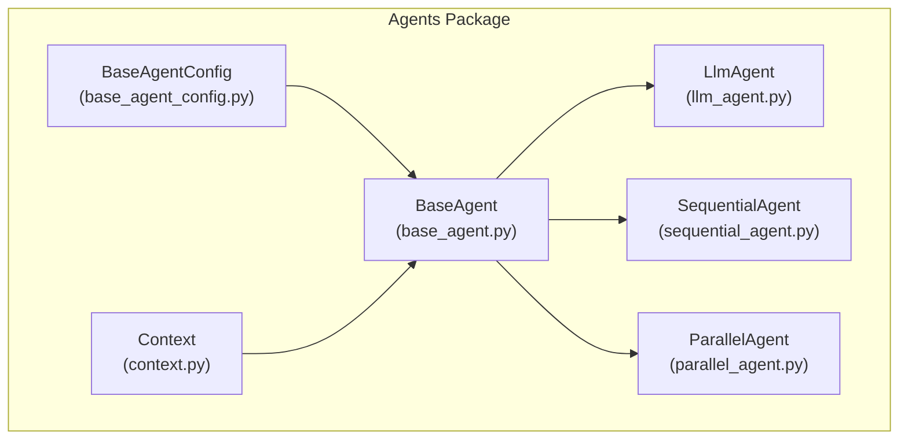
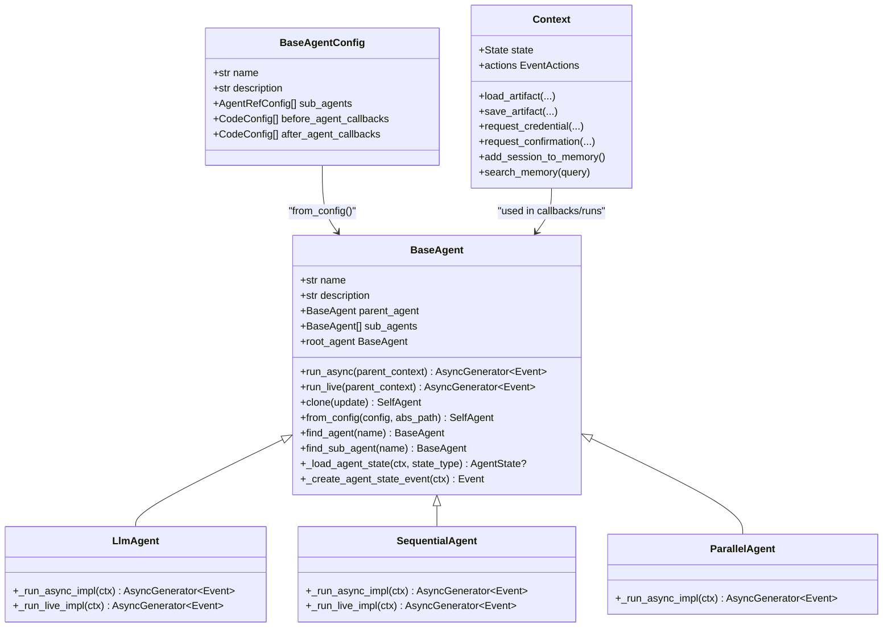
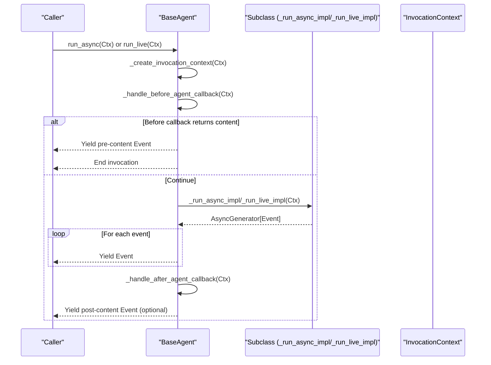
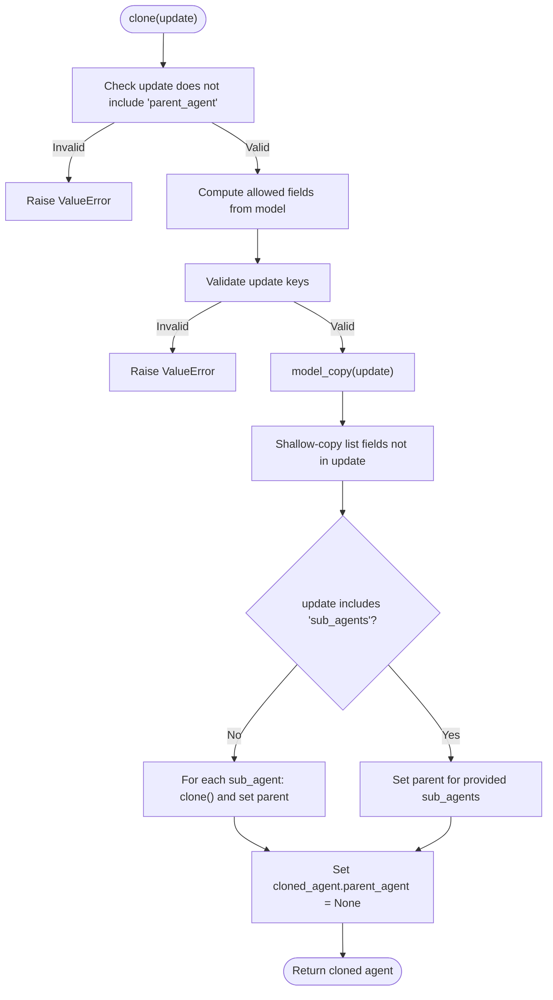
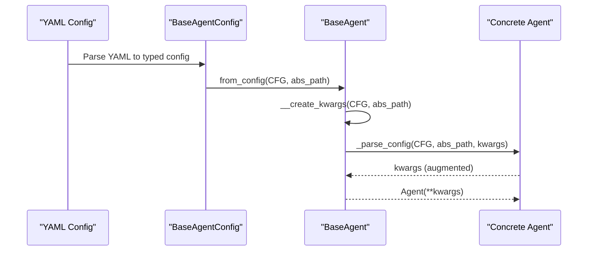
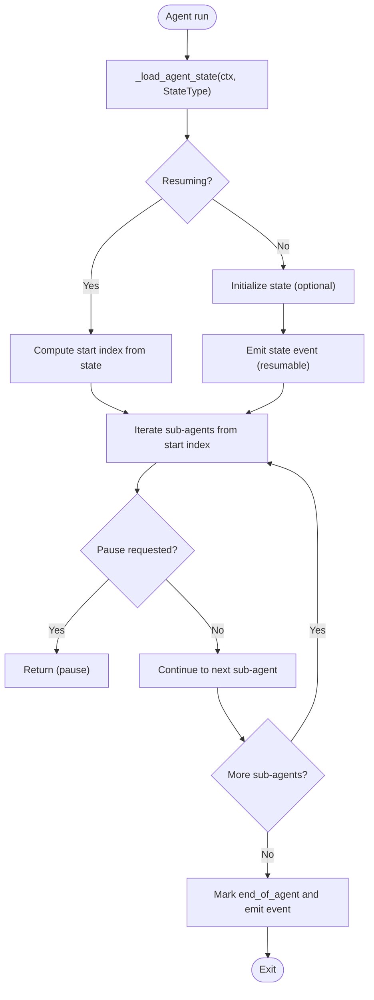
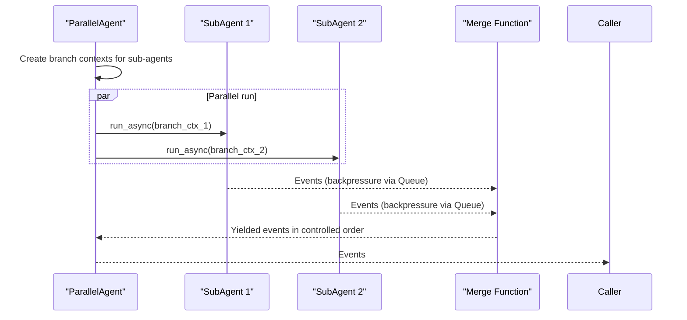
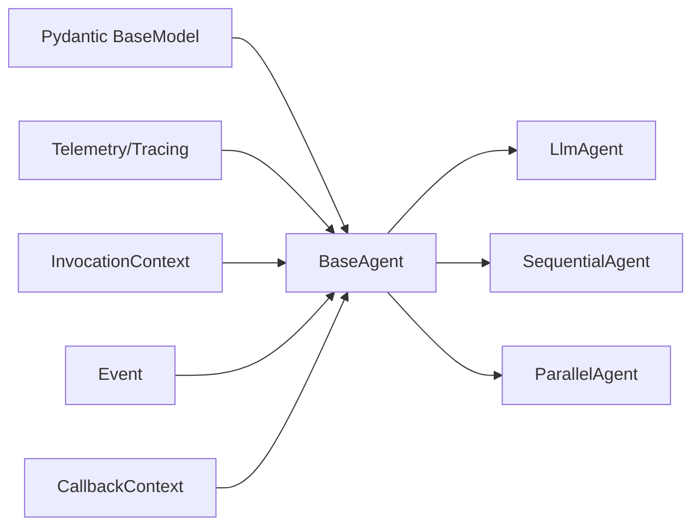

# Base Agent Architecture

<cite>
**Referenced Files in This Document**
- [base_agent.py](file://src/google/adk/agents/base_agent.py)
- [base_agent_config.py](file://src/google/adk/agents/base_agent_config.py)
- [llm_agent.py](file://src/google/adk/agents/llm_agent.py)
- [sequential_agent.py](file://src/google/adk/agents/sequential_agent.py)
- [parallel_agent.py](file://src/google/adk/agents/parallel_agent.py)
- [context.py](file://src/google/adk/agents/context.py)
- [__init__.py](file://src/google/adk/agents/__init__.py)
- [root_agent.yaml](file://contributing/samples/multi_agent_basic_config/root_agent.yaml)
- [code_tutor_agent.yaml](file://contributing/samples/multi_agent_basic_config/code_tutor_agent.yaml)
- [math_tutor_agent.yaml](file://contributing/samples/multi_agent_basic_config/math_tutor_agent.yaml)
- [test_base_agent.py](file://tests/unittests/agents/test_base_agent.py)
- [test_agent_clone.py](file://tests/unittests/agents/test_agent_clone.py)
</cite>

## Table of Contents
1. [Introduction](#introduction)
2. [Project Structure](#project-structure)
3. [Core Components](#core-components)
4. [Architecture Overview](#architecture-overview)
5. [Detailed Component Analysis](#detailed-component-analysis)
6. [Dependency Analysis](#dependency-analysis)
7. [Performance Considerations](#performance-considerations)
8. [Troubleshooting Guide](#troubleshooting-guide)
9. [Conclusion](#conclusion)
10. [Appendices](#appendices)

## Introduction
This document explains the Base Agent architecture that underpins all agent types in the Agent Development Kit (ADK). It focuses on the BaseAgent class hierarchy, core agent properties, lifecycle methods, configuration loading, state management, validation rules, cloning, and practical usage patterns. It also covers agent isolation, security considerations, and performance optimization techniques.

## Project Structure
The Base Agent resides in the agents package and is extended by specialized agents such as LlmAgent, SequentialAgent, and ParallelAgent. Configuration is defined via YAML and parsed into typed Pydantic models.

**Diagram sources**
- [base_agent.py](file://src/google/adk/agents/base_agent.py#L86-L701)
- [llm_agent.py](file://src/google/adk/agents/llm_agent.py#L187-L200)
- [sequential_agent.py](file://src/google/adk/agents/sequential_agent.py#L48-L160)
- [parallel_agent.py](file://src/google/adk/agents/parallel_agent.py#L150-L217)
- [base_agent_config.py](file://src/google/adk/agents/base_agent_config.py#L37-L83)
- [context.py](file://src/google/adk/agents/context.py#L41-L413)

**Section sources**
- [__init__.py](file://src/google/adk/agents/__init__.py#L15-L42)

## Core Components
- BaseAgent: The foundational class for all agents. Provides lifecycle entry points, parent-child relationships, sub-agent management, callbacks, cloning, configuration loading, and state management hooks.
- BaseAgentConfig: Typed configuration schema for agent YAML definitions.
- LlmAgent: A concrete agent that orchestrates LLM flows, tools, and planner interactions.
- SequentialAgent: A shell agent that runs sub-agents in sequence with optional stateful resumption.
- ParallelAgent: A shell agent that runs sub-agents in parallel with isolated branches and controlled merging.
- Context: Runtime context for tooling, credentials, artifacts, memory, and state delta tracking.

Key responsibilities:
- Lifecycle: run_async() and run_live() orchestrate invocation, callbacks, and delegate to _run_async_impl/_run_live_impl.
- Validation: Name validation and uniqueness constraints for sub-agents.
- Cloning: Safe deep-copy of agent instances with proper parent/sub-agent relationships.
- Configuration: from_config() parses YAML into typed kwargs and constructs agents.
- State: Load and emit agent state via EventActions for resumable runs.

**Section sources**
- [base_agent.py](file://src/google/adk/agents/base_agent.py#L86-L701)
- [base_agent_config.py](file://src/google/adk/agents/base_agent_config.py#L37-L83)
- [context.py](file://src/google/adk/agents/context.py#L41-L413)

## Architecture Overview
The Base Agent architecture defines a hierarchical agent tree with strict validation and isolation guarantees. Agents can contain sub-agents, and each agent participates in a structured lifecycle with optional before/after callbacks and stateful resumption.

**Diagram sources**
- [base_agent.py](file://src/google/adk/agents/base_agent.py#L86-L701)
- [llm_agent.py](file://src/google/adk/agents/llm_agent.py#L187-L200)
- [sequential_agent.py](file://src/google/adk/agents/sequential_agent.py#L48-L160)
- [parallel_agent.py](file://src/google/adk/agents/parallel_agent.py#L150-L217)
- [base_agent_config.py](file://src/google/adk/agents/base_agent_config.py#L37-L83)
- [context.py](file://src/google/adk/agents/context.py#L41-L413)

## Detailed Component Analysis

### BaseAgent Lifecycle and Entry Points
- run_async(parent_context): Text-based invocation entry point. Creates InvocationContext, runs before callbacks, delegates to _run_async_impl, then after callbacks. Emits events and supports early termination via end_invocation.
- run_live(parent_context): Live media-based invocation entry point. Similar flow to run_async but tailored for continuous audio/video streams.
- _run_async_impl(ctx) and _run_live_impl(ctx): Abstract methods that subclasses implement to define agent behavior.

**Diagram sources**
- [base_agent.py](file://src/google/adk/agents/base_agent.py#L273-L366)

**Section sources**
- [base_agent.py](file://src/google/adk/agents/base_agent.py#L273-L366)

### BaseAgent Properties and Validation
- name: Must be a valid Python identifier and cannot be "user".
- description: One-line description used by delegation logic.
- parent_agent: Set automatically when adding sub-agents; enforced to be unique per sub-agent.
- sub_agents: List of child agents; validated for unique names.
- before_agent_callback/after_agent_callback: Optional callbacks invoked before/after agent run; canonical form resolved to a list.

Validation highlights:
- Name validator enforces identifier rules and reserves "user".
- Sub-agent name uniqueness validator logs warnings for duplicates.

**Section sources**
- [base_agent.py](file://src/google/adk/agents/base_agent.py#L111-L137)
- [base_agent.py](file://src/google/adk/agents/base_agent.py#L555-L610)

### Parent-Child Relationships and Sub-Agent Management
- __set_parent_agent_for_sub_agents(): Ensures each sub-agent’s parent is set to the current agent and raises if a sub-agent already has a parent.
- find_agent(name)/find_sub_agent(name): Hierarchical lookup within the agent tree.
- root_agent: Traverses up to the root of the agent tree.

Practical implications:
- Sub-agent lists must be unique by name.
- Adding the same agent instance twice as a sub-agent is disallowed; create separate instances if duplication is desired.

**Section sources**
- [base_agent.py](file://src/google/adk/agents/base_agent.py#L368-L401)
- [base_agent.py](file://src/google/adk/agents/base_agent.py#L611-L620)
- [test_base_agent.py](file://tests/unittests/agents/test_base_agent.py#L738-L773)

### Cloning Mechanisms
- clone(update): Creates a deep copy of the agent, copying lists and recursively cloning sub-agents. Prevents updating parent_agent and validates allowed fields.
- Behavior:
  - Disallows updating parent_agent.
  - Validates update keys against declared model fields.
  - Shallow-copies list fields not overridden by update.
  - Recursively clones sub-agents and sets their parent to the cloned parent.

**Diagram sources**
- [base_agent.py](file://src/google/adk/agents/base_agent.py#L211-L271)

**Section sources**
- [base_agent.py](file://src/google/adk/agents/base_agent.py#L211-L271)
- [test_agent_clone.py](file://tests/unittests/agents/test_agent_clone.py#L142-L251)

### Configuration Loading and Parsing
- from_config(cls, config, config_abs_path): Factory method to create agents from typed configuration. Builds kwargs from BaseAgentConfig and invokes subclass-specific _parse_config.
- __create_kwargs(): Converts YAML-defined fields into constructor kwargs, resolves sub-agent references and callback references.
- _parse_config(): Hook for subclasses to augment kwargs (e.g., model, tools, planner).

Usage pattern:
- Define YAML with agent_class, name, description, sub_agents, and callbacks.
- Use BaseAgent.from_config(...) to instantiate the agent tree.

**Diagram sources**
- [base_agent.py](file://src/google/adk/agents/base_agent.py#L622-L701)
- [base_agent_config.py](file://src/google/adk/agents/base_agent_config.py#L37-L83)

**Section sources**
- [base_agent.py](file://src/google/adk/agents/base_agent.py#L622-L701)
- [base_agent_config.py](file://src/google/adk/agents/base_agent_config.py#L37-L83)
- [root_agent.yaml](file://contributing/samples/multi_agent_basic_config/root_agent.yaml#L1-L18)
- [code_tutor_agent.yaml](file://contributing/samples/multi_agent_basic_config/code_tutor_agent.yaml#L1-L16)
- [math_tutor_agent.yaml](file://contributing/samples/multi_agent_basic_config/math_tutor_agent.yaml#L1-L16)

### State Management and Resumable Runs
- _load_agent_state(ctx, state_type): Loads per-agent state from InvocationContext.
- _create_agent_state_event(ctx): Emits an Event with current agent state and end-of-agent markers.
- SequentialAgent demonstrates resumable execution by storing the current sub-agent and emitting stateful events.

**Diagram sources**
- [base_agent.py](file://src/google/adk/agents/base_agent.py#L168-L210)
- [sequential_agent.py](file://src/google/adk/agents/sequential_agent.py#L54-L118)

**Section sources**
- [base_agent.py](file://src/google/adk/agents/base_agent.py#L168-L210)
- [sequential_agent.py](file://src/google/adk/agents/sequential_agent.py#L54-L118)

### Agent Isolation and Branching
ParallelAgent isolates sub-agent execution by creating distinct InvocationContext branches for each sub-agent and merging events in a controlled manner. This prevents interference between concurrent agents and ensures deterministic ordering.

**Diagram sources**
- [parallel_agent.py](file://src/google/adk/agents/parallel_agent.py#L35-L217)

**Section sources**
- [parallel_agent.py](file://src/google/adk/agents/parallel_agent.py#L35-L217)

### Practical Examples
- Instantiating agents from YAML:
  - Root agent with sub-agents: see [root_agent.yaml](file://contributing/samples/multi_agent_basic_config/root_agent.yaml#L1-L18).
  - Sub-agent definitions: [code_tutor_agent.yaml](file://contributing/samples/multi_agent_basic_config/code_tutor_agent.yaml#L1-L16), [math_tutor_agent.yaml](file://contributing/samples/multi_agent_basic_config/math_tutor_agent.yaml#L1-L16).
- Inheritance patterns:
  - LlmAgent extends BaseAgent and implements _run_async_impl/_run_live_impl.
  - SequentialAgent and ParallelAgent extend BaseAgent and implement their own run logic.
- Callbacks and state:
  - Use before_agent_callback/after_agent_callback to inject pre/post-run behavior.
  - Use Context actions to record state deltas and artifacts.

**Section sources**
- [root_agent.yaml](file://contributing/samples/multi_agent_basic_config/root_agent.yaml#L1-L18)
- [code_tutor_agent.yaml](file://contributing/samples/multi_agent_basic_config/code_tutor_agent.yaml#L1-L16)
- [math_tutor_agent.yaml](file://contributing/samples/multi_agent_basic_config/math_tutor_agent.yaml#L1-L16)
- [llm_agent.py](file://src/google/adk/agents/llm_agent.py#L187-L200)
- [sequential_agent.py](file://src/google/adk/agents/sequential_agent.py#L48-L160)
- [parallel_agent.py](file://src/google/adk/agents/parallel_agent.py#L150-L217)

## Dependency Analysis
- BaseAgent depends on:
  - Pydantic BaseModel for validation and serialization.
  - Telemetry/tracing for observability.
  - InvocationContext and Event for runtime orchestration.
  - CallbackContext for callback execution.
- Subclasses:
  - LlmAgent integrates with LLM flows, tools, and planner.
  - SequentialAgent and ParallelAgent depend on BaseAgent’s state and branching utilities.

**Diagram sources**
- [base_agent.py](file://src/google/adk/agents/base_agent.py#L86-L701)
- [llm_agent.py](file://src/google/adk/agents/llm_agent.py#L187-L200)
- [sequential_agent.py](file://src/google/adk/agents/sequential_agent.py#L48-L160)
- [parallel_agent.py](file://src/google/adk/agents/parallel_agent.py#L150-L217)

**Section sources**
- [base_agent.py](file://src/google/adk/agents/base_agent.py#L86-L701)

## Performance Considerations
- Backpressure and merging:
  - ParallelAgent uses queues and events to coordinate producers/consumers, preventing unbounded memory growth.
  - Python version differences are handled with TaskGroup (3.11+) and custom logic for older versions.
- Streaming yields:
  - run_async/run_live yield events incrementally to minimize latency and memory footprint.
- Stateful resumption:
  - SequentialAgent stores current sub-agent to avoid reprocessing completed steps.
- Validation overhead:
  - Name and sub-agent uniqueness validations occur at construction and post-init; keep YAML concise to reduce parsing overhead.

[No sources needed since this section provides general guidance]

## Troubleshooting Guide
Common issues and resolutions:
- NotImplementedError in _run_async_impl/_run_live_impl:
  - Ensure subclasses implement these methods or use provided agent types (e.g., LlmAgent).
- Duplicate sub-agent names:
  - Validation logs warnings; rename sub-agents to be unique.
- Attempting to update parent_agent during clone:
  - clone() rejects updates to parent_agent; create a new parent instance instead.
- Using “user” as agent name:
  - Reserved; choose another identifier.

**Section sources**
- [base_agent.py](file://src/google/adk/agents/base_agent.py#L347-L366)
- [base_agent.py](file://src/google/adk/agents/base_agent.py#L555-L570)
- [base_agent.py](file://src/google/adk/agents/base_agent.py#L226-L230)
- [test_base_agent.py](file://tests/unittests/agents/test_base_agent.py#L731-L736)

## Conclusion
BaseAgent provides a robust, extensible foundation for building agent systems in ADK. Its lifecycle methods, validation rules, cloning mechanism, configuration pipeline, and state management enable safe composition of complex agent trees. Specialized agents like LlmAgent, SequentialAgent, and ParallelAgent demonstrate how to implement domain-specific behavior while adhering to shared contracts and isolation guarantees.

## Appendices

### Security Considerations
- Callbacks and tool usage:
  - Use before_agent_callback/after_agent_callback judiciously; avoid exposing sensitive data.
  - Leverage Context.request_credential and request_confirmation for secure interactions.
- Artifact and memory:
  - Save artifacts and memory entries with appropriate metadata and scopes.
- Isolation:
  - ParallelAgent creates isolated branches to prevent cross-agent interference.

**Section sources**
- [context.py](file://src/google/adk/agents/context.py#L203-L272)
- [context.py](file://src/google/adk/agents/context.py#L313-L412)
- [parallel_agent.py](file://src/google/adk/agents/parallel_agent.py#L35-L48)