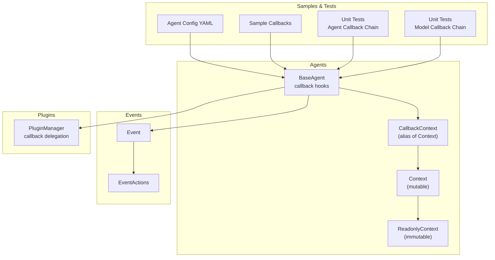
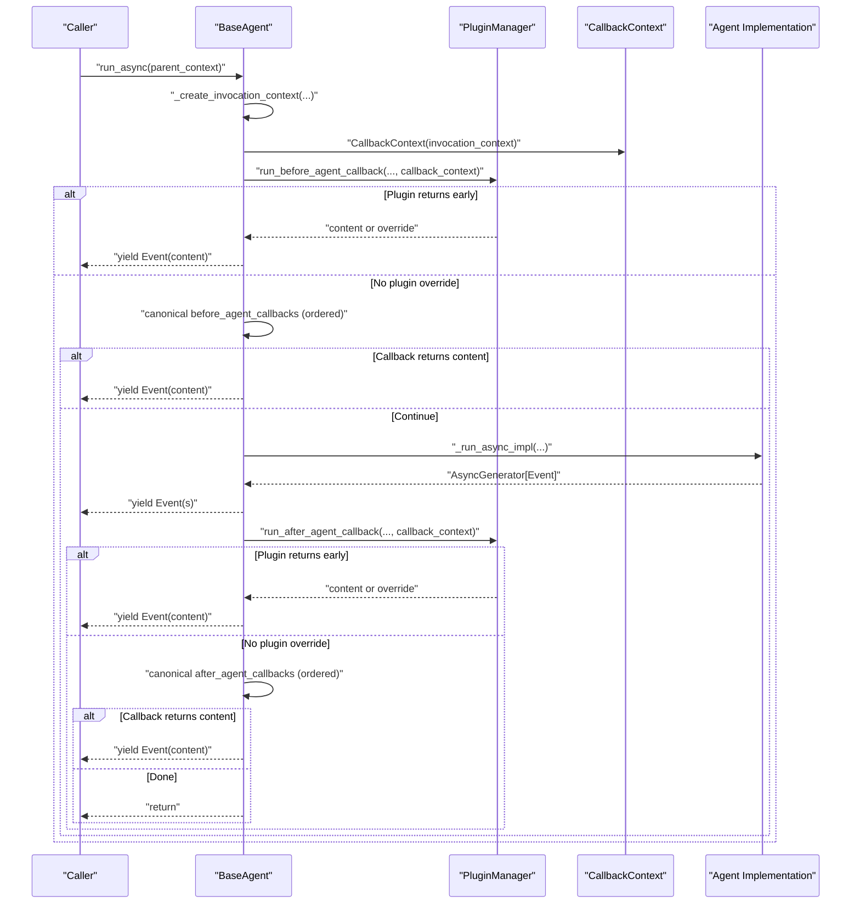
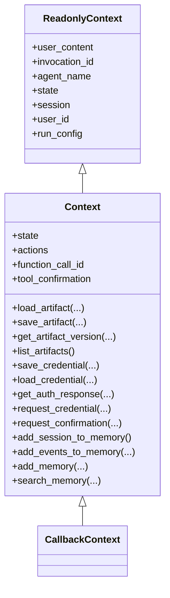
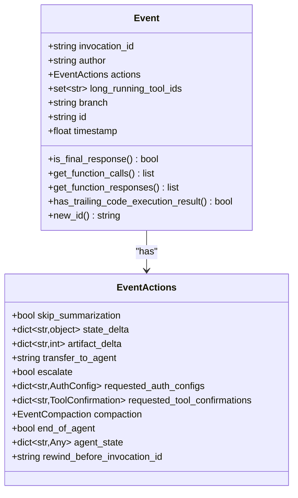
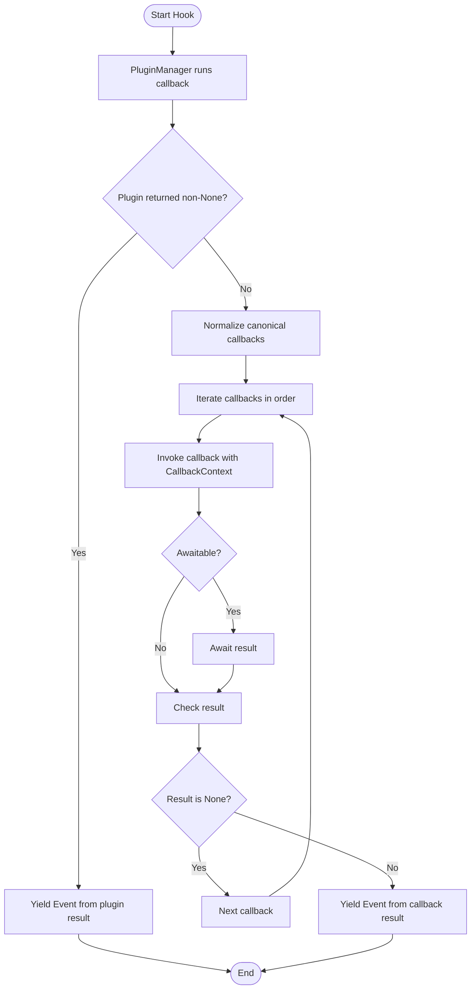
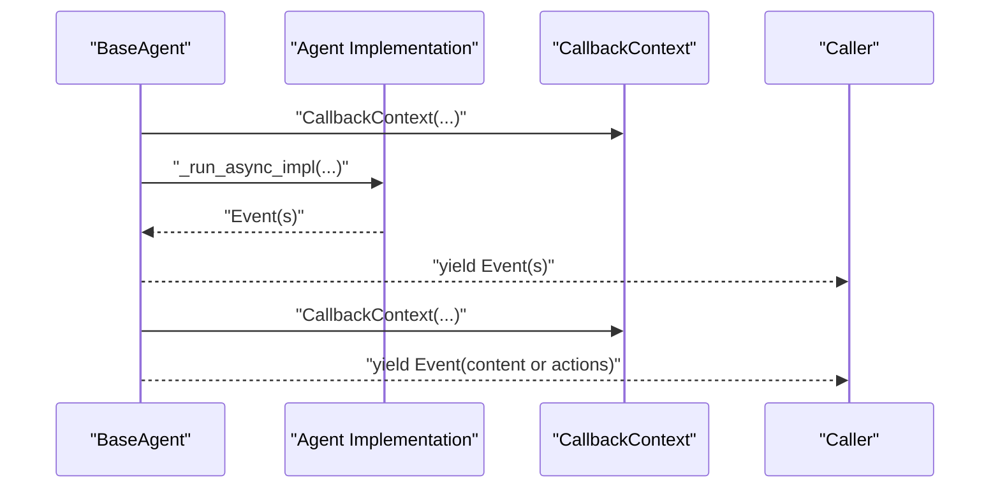
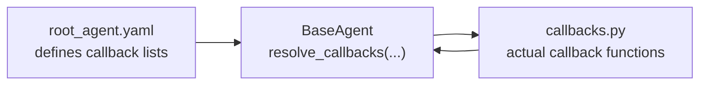
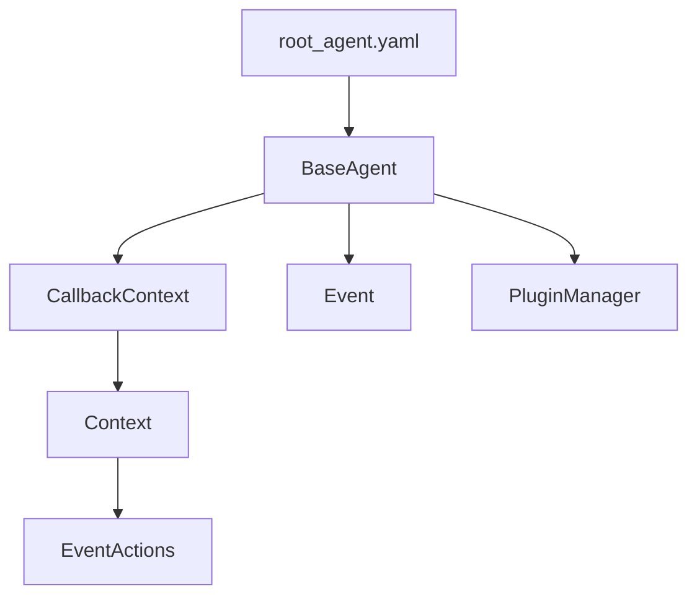

# Callback and Event System

<cite>
**Referenced Files in This Document**
- [callback_context.py](file://src/google/adk/agents/callback_context.py)
- [context.py](file://src/google/adk/agents/context.py)
- [readonly_context.py](file://src/google/adk/agents/readonly_context.py)
- [base_agent.py](file://src/google/adk/agents/base_agent.py)
- [event.py](file://src/google/adk/events/event.py)
- [event_actions.py](file://src/google/adk/events/event_actions.py)
- [plugin_manager.py](file://src/google/adk/plugins/plugin_manager.py)
- [callbacks.py](file://contributing/samples/core_callback_config/callbacks.py)
- [root_agent.yaml](file://contributing/samples/core_callback_config/root_agent.yaml)
- [test_model_callback_chain.py](file://tests/unittests/agents/test_model_callback_chain.py)
- [test_base_agent.py](file://tests/unittests/agents/test_base_agent.py)
</cite>

## Table of Contents
1. [Introduction](#introduction)
2. [Project Structure](#project-structure)
3. [Core Components](#core-components)
4. [Architecture Overview](#architecture-overview)
5. [Detailed Component Analysis](#detailed-component-analysis)
6. [Dependency Analysis](#dependency-analysis)
7. [Performance Considerations](#performance-considerations)
8. [Troubleshooting Guide](#troubleshooting-guide)
9. [Conclusion](#conclusion)

## Introduction
This document explains the callback and event system in the Agent Development Kit (ADK). It focuses on:
- The CallbackContext class and its role in managing agent callbacks
- The Event system for tracking agent interactions, including EventActions for state changes and content updates
- Callback resolution, canonical callback lists, and callback chain execution
- Event generation, propagation, and handling throughout the agent lifecycle
- Validation, error handling, and debugging techniques
- Examples of custom callback implementation, event processing, and state modification
- Callback ordering, conflict resolution, and performance considerations for callback-heavy scenarios

## Project Structure
The callback and event system spans several modules:
- Agents: callback context, invocation context, and agent lifecycle hooks
- Events: event model and action model
- Plugins: plugin manager for callback delegation and early-exit semantics
- Samples and tests: example callbacks and unit tests validating callback chains

**Diagram sources**
- [base_agent.py](file://src/google/adk/agents/base_agent.py#L434-L549)
- [callback_context.py](file://src/google/adk/agents/callback_context.py#L21-L22)
- [context.py](file://src/google/adk/agents/context.py#L41-L108)
- [readonly_context.py](file://src/google/adk/agents/readonly_context.py#L30-L72)
- [event.py](file://src/google/adk/events/event.py#L31-L129)
- [event_actions.py](file://src/google/adk/events/event_actions.py#L50-L111)
- [plugin_manager.py](file://src/google/adk/plugins/plugin_manager.py#L269-L301)
- [callbacks.py](file://contributing/samples/core_callback_config/callbacks.py#L4-L80)
- [root_agent.yaml](file://contributing/samples/core_callback_config/root_agent.yaml#L24-L43)
- [test_base_agent.py](file://tests/unittests/agents/test_base_agent.py#L366-L536)
- [test_model_callback_chain.py](file://tests/unittests/agents/test_model_callback_chain.py#L129-L250)

**Section sources**
- [base_agent.py](file://src/google/adk/agents/base_agent.py#L434-L549)
- [callback_context.py](file://src/google/adk/agents/callback_context.py#L21-L22)
- [context.py](file://src/google/adk/agents/context.py#L41-L108)
- [readonly_context.py](file://src/google/adk/agents/readonly_context.py#L30-L72)
- [event.py](file://src/google/adk/events/event.py#L31-L129)
- [event_actions.py](file://src/google/adk/events/event_actions.py#L50-L111)
- [plugin_manager.py](file://src/google/adk/plugins/plugin_manager.py#L269-L301)
- [callbacks.py](file://contributing/samples/core_callback_config/callbacks.py#L4-L80)
- [root_agent.yaml](file://contributing/samples/core_callback_config/root_agent.yaml#L24-L43)
- [test_base_agent.py](file://tests/unittests/agents/test_base_agent.py#L366-L536)
- [test_model_callback_chain.py](file://tests/unittests/agents/test_model_callback_chain.py#L129-L250)

## Core Components
- CallbackContext and Context
  - CallbackContext is an alias of Context, which encapsulates the mutable execution context for callbacks and runtime operations.
  - Context extends ReadonlyContext to expose mutable state and actions, plus artifact, credential, memory, and tool-related helpers.
- Event and EventActions
  - Event represents a single interaction with optional content and actions.
  - EventActions captures state deltas, artifacts, transfers, escalations, auth requests, confirmations, compaction, agent state snapshots, and rewind markers.
- BaseAgent callback hooks
  - before_agent_callback and after_agent_callback support single callbacks or ordered lists.
  - Canonical callback lists normalize user-provided callbacks into a consistent list for deterministic execution.
  - PluginManager can intercept and override callbacks early, short-circuiting further execution.

**Section sources**
- [callback_context.py](file://src/google/adk/agents/callback_context.py#L21-L22)
- [context.py](file://src/google/adk/agents/context.py#L41-L108)
- [readonly_context.py](file://src/google/adk/agents/readonly_context.py#L30-L72)
- [event.py](file://src/google/adk/events/event.py#L31-L129)
- [event_actions.py](file://src/google/adk/events/event_actions.py#L50-L111)
- [base_agent.py](file://src/google/adk/agents/base_agent.py#L139-L166)
- [base_agent.py](file://src/google/adk/agents/base_agent.py#L410-L432)
- [base_agent.py](file://src/google/adk/agents/base_agent.py#L434-L549)
- [plugin_manager.py](file://src/google/adk/plugins/plugin_manager.py#L269-L301)

## Architecture Overview
The agent lifecycle integrates callback hooks around the core run logic. Plugins can intercept callbacks and return early, otherwise the agent executes canonical callbacks in order until one returns a non-None value.

**Diagram sources**
- [base_agent.py](file://src/google/adk/agents/base_agent.py#L274-L304)
- [base_agent.py](file://src/google/adk/agents/base_agent.py#L434-L549)
- [plugin_manager.py](file://src/google/adk/plugins/plugin_manager.py#L269-L301)

## Detailed Component Analysis

### CallbackContext and Context
- Role
  - Provides a unified, mutable context for callbacks and runtime operations.
  - Exposes state mutations, event actions, artifact operations, credentials, memory, and tool confirmations.
- Key capabilities
  - State delta: mutate session state directly via a delta-aware wrapper.
  - Actions: record state_delta, artifact_delta, transfer_to_agent, escalate, requested_auth_configs, requested_tool_confirmations, compaction, end_of_agent, agent_state, rewind_before_invocation_id.
  - Artifact helpers: load/save/list/get artifact versions.
  - Credential helpers: save/load credentials and retrieve auth responses from session state.
  - Memory helpers: add_session_to_memory, add_events_to_memory, add_memory, search_memory.
  - Tool confirmation and auth request helpers for tool context.

**Diagram sources**
- [readonly_context.py](file://src/google/adk/agents/readonly_context.py#L30-L72)
- [context.py](file://src/google/adk/agents/context.py#L41-L413)
- [callback_context.py](file://src/google/adk/agents/callback_context.py#L21-L22)

**Section sources**
- [callback_context.py](file://src/google/adk/agents/callback_context.py#L21-L22)
- [context.py](file://src/google/adk/agents/context.py#L41-L413)
- [readonly_context.py](file://src/google/adk/agents/readonly_context.py#L30-L72)

### Event and EventActions
- Event
  - Extends LlmResponse with fields for author, actions, long-running tool ids, branch, id, and timestamp.
  - Helpers: is_final_response(), get_function_calls(), get_function_responses(), has_trailing_code_execution_result(), new_id().
- EventActions
  - Captures state_delta, artifact_delta, transfer_to_agent, escalate, requested_auth_configs, requested_tool_confirmations, compaction, end_of_agent, agent_state, rewind_before_invocation_id.

**Diagram sources**
- [event.py](file://src/google/adk/events/event.py#L31-L129)
- [event_actions.py](file://src/google/adk/events/event_actions.py#L50-L111)

**Section sources**
- [event.py](file://src/google/adk/events/event.py#L31-L129)
- [event_actions.py](file://src/google/adk/events/event_actions.py#L50-L111)

### Callback Resolution and Canonical Lists
- Canonical callbacks
  - before_agent_callback and after_agent_callback can be a single callable or a list.
  - canonical_before_agent_callbacks and canonical_after_agent_callbacks normalize to a list for deterministic iteration.
- Execution order
  - Plugins run first; if none returns a non-None value, canonical callbacks are executed in order until one returns a non-None value.
- Override behavior
  - Returning non-None from a callback yields an Event and may terminate the current invocation depending on the hook.

**Diagram sources**
- [base_agent.py](file://src/google/adk/agents/base_agent.py#L410-L432)
- [base_agent.py](file://src/google/adk/agents/base_agent.py#L434-L549)
- [plugin_manager.py](file://src/google/adk/plugins/plugin_manager.py#L269-L301)

**Section sources**
- [base_agent.py](file://src/google/adk/agents/base_agent.py#L139-L166)
- [base_agent.py](file://src/google/adk/agents/base_agent.py#L410-L432)
- [base_agent.py](file://src/google/adk/agents/base_agent.py#L434-L549)
- [plugin_manager.py](file://src/google/adk/plugins/plugin_manager.py#L269-L301)

### Event Generation, Propagation, and Handling
- Before agent hook
  - If plugin returns content, an Event is yielded and the invocation ends.
  - If state has delta, an Event with actions is yielded.
- Agent run
  - Core implementation yields Events as the agent produces output.
- After agent hook
  - Similar logic: plugin override, then canonical callbacks, then optional Event with content or state delta.

**Diagram sources**
- [base_agent.py](file://src/google/adk/agents/base_agent.py#L274-L304)
- [base_agent.py](file://src/google/adk/agents/base_agent.py#L336-L366)
- [base_agent.py](file://src/google/adk/agents/base_agent.py#L434-L549)

**Section sources**
- [base_agent.py](file://src/google/adk/agents/base_agent.py#L274-L304)
- [base_agent.py](file://src/google/adk/agents/base_agent.py#L336-L366)
- [base_agent.py](file://src/google/adk/agents/base_agent.py#L434-L549)

### Custom Callback Implementation and Examples
- Sample callbacks
  - Basic before_agent_callback and after_agent_callback handlers.
  - before_model_callback and after_model_callback handlers.
  - before_tool_callback and after_tool_callback handlers returning various values.
- Configuration-driven callbacks
  - YAML config defines lists of callback names for before_agent_callbacks, after_agent_callbacks, before_model_callbacks, after_model_callbacks, before_tool_callbacks, after_tool_callbacks.

**Diagram sources**
- [root_agent.yaml](file://contributing/samples/core_callback_config/root_agent.yaml#L24-L43)
- [callbacks.py](file://contributing/samples/core_callback_config/callbacks.py#L4-L80)
- [base_agent.py](file://src/google/adk/agents/base_agent.py#L692-L700)

**Section sources**
- [callbacks.py](file://contributing/samples/core_callback_config/callbacks.py#L4-L80)
- [root_agent.yaml](file://contributing/samples/core_callback_config/root_agent.yaml#L24-L43)
- [base_agent.py](file://src/google/adk/agents/base_agent.py#L692-L700)

### Validation, Error Handling, and Debugging
- Validation
  - Agent name validation enforces identifiers and disallows reserved "user".
  - Sub-agent name uniqueness validation logs warnings for duplicates.
- Error handling
  - PluginManager raises a chained RuntimeError if a plugin callback throws an exception.
  - Context methods raise ValueError when required services (artifact, credential, memory) are not initialized.
- Debugging
  - Unit tests validate callback chain behavior, including early exits and call counts for sync/async callbacks.
  - Tests demonstrate expected responses and call sequences for before_agent_callback and after_agent_callback chains.

**Section sources**
- [base_agent.py](file://src/google/adk/agents/base_agent.py#L555-L570)
- [base_agent.py](file://src/google/adk/agents/base_agent.py#L572-L610)
- [plugin_manager.py](file://src/google/adk/plugins/plugin_manager.py#L284-L301)
- [context.py](file://src/google/adk/agents/context.py#L127-L135)
- [context.py](file://src/google/adk/agents/context.py#L209-L213)
- [context.py](file://src/google/adk/agents/context.py#L329-L335)
- [context.py](file://src/google/adk/agents/context.py#L355-L365)
- [context.py](file://src/google/adk/agents/context.py#L386-L392)
- [test_base_agent.py](file://tests/unittests/agents/test_base_agent.py#L366-L536)
- [test_model_callback_chain.py](file://tests/unittests/agents/test_model_callback_chain.py#L129-L250)

## Dependency Analysis
- Agent-to-Context
  - BaseAgent constructs CallbackContext for each hook and uses Context’s state and actions to produce Events.
- Agent-to-Event
  - BaseAgent creates Events with invocation_id, author, branch, content, and actions.
- Plugin-to-Agent
  - PluginManager runs plugin callbacks and can short-circuit canonical callbacks.
- Config-to-Agent
  - YAML configuration resolves callback names into callable lists via BaseAgent’s config parsing.

**Diagram sources**
- [base_agent.py](file://src/google/adk/agents/base_agent.py#L434-L549)
- [callback_context.py](file://src/google/adk/agents/callback_context.py#L21-L22)
- [context.py](file://src/google/adk/agents/context.py#L41-L108)
- [event_actions.py](file://src/google/adk/events/event_actions.py#L50-L111)
- [event.py](file://src/google/adk/events/event.py#L31-L129)
- [plugin_manager.py](file://src/google/adk/plugins/plugin_manager.py#L269-L301)
- [root_agent.yaml](file://contributing/samples/core_callback_config/root_agent.yaml#L24-L43)

**Section sources**
- [base_agent.py](file://src/google/adk/agents/base_agent.py#L434-L549)
- [callback_context.py](file://src/google/adk/agents/callback_context.py#L21-L22)
- [context.py](file://src/google/adk/agents/context.py#L41-L108)
- [event_actions.py](file://src/google/adk/events/event_actions.py#L50-L111)
- [event.py](file://src/google/adk/events/event.py#L31-L129)
- [plugin_manager.py](file://src/google/adk/plugins/plugin_manager.py#L269-L301)
- [root_agent.yaml](file://contributing/samples/core_callback_config/root_agent.yaml#L24-L43)

## Performance Considerations
- Callback ordering and early exits
  - Prefer minimal callback lists and leverage plugin early exits to reduce overhead.
- Mixed sync/async callbacks
  - Asynchronous callbacks incur awaiting costs; batch or coalesce where appropriate.
- State and artifact deltas
  - Use state_delta and artifact_delta to avoid redundant writes; avoid frequent small writes.
- Event creation
  - Minimize unnecessary Event creation; only emit when content or state changes warrant it.
- Concurrency
  - For tool callbacks, ensure non-blocking operations; offload heavy work to background tasks.

[No sources needed since this section provides general guidance]

## Troubleshooting Guide
- Symptom: Unexpected early termination
  - Cause: A plugin or canonical callback returned non-None content.
  - Action: Inspect plugin manager behavior and canonical callback chain; verify return values.
- Symptom: State changes not persisted
  - Cause: Missing state_delta or incorrect mutation.
  - Action: Use Context.state as a delta-aware mapping; mutate values directly; ensure actions.state_delta is populated.
- Symptom: Credentials or artifacts unavailable
  - Cause: Services not initialized.
  - Action: Ensure artifact, credential, and memory services are configured; Context methods raise ValueError when missing.
- Symptom: Tool confirmations or auth requests not recorded
  - Cause: Using save_credential/load_credential instead of request_credential in callback context.
  - Action: Use request_credential in tool context; use save/load credential in callback context.

**Section sources**
- [plugin_manager.py](file://src/google/adk/plugins/plugin_manager.py#L284-L301)
- [context.py](file://src/google/adk/agents/context.py#L263-L271)
- [context.py](file://src/google/adk/agents/context.py#L127-L135)
- [context.py](file://src/google/adk/agents/context.py#L209-L213)
- [context.py](file://src/google/adk/agents/context.py#L329-L335)
- [context.py](file://src/google/adk/agents/context.py#L355-L365)
- [context.py](file://src/google/adk/agents/context.py#L386-L392)

## Conclusion
The ADK callback and event system provides a robust, extensible mechanism for controlling agent behavior and capturing interactions. CallbackContext unifies mutable state and actions, while Event and EventActions capture meaningful changes and transitions. Canonical callback lists and plugin delegation enable deterministic execution and powerful customization. By following best practices for ordering, early exits, and state management, teams can build responsive, maintainable agent workflows.