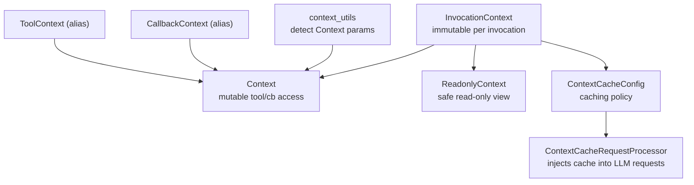
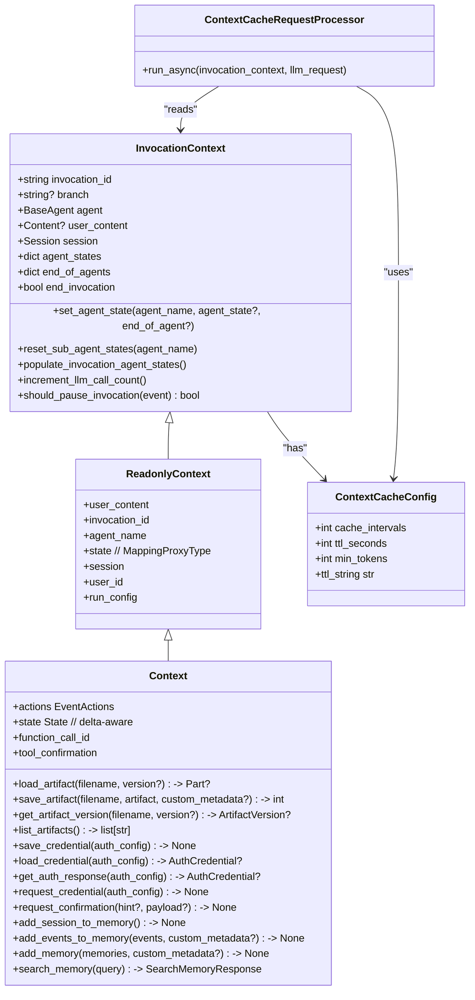
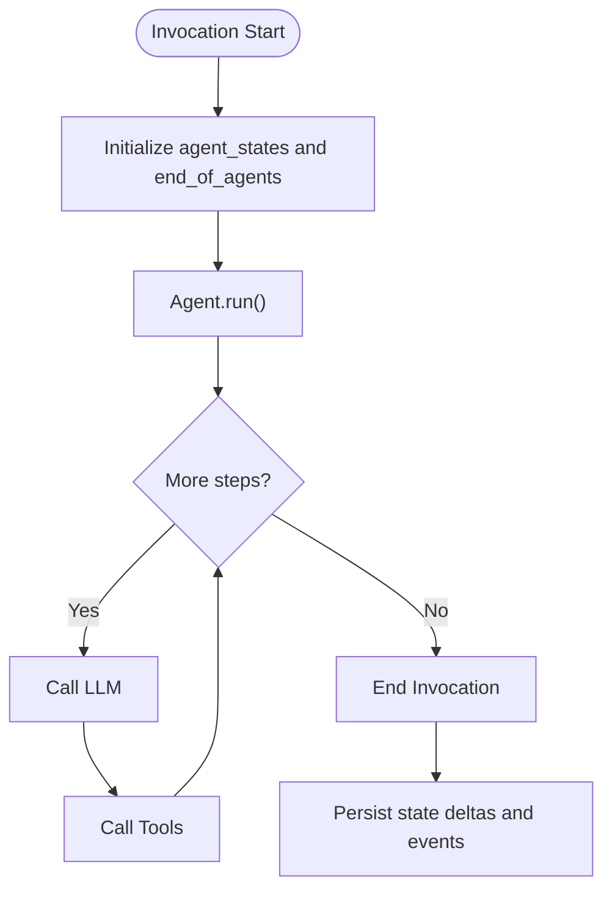
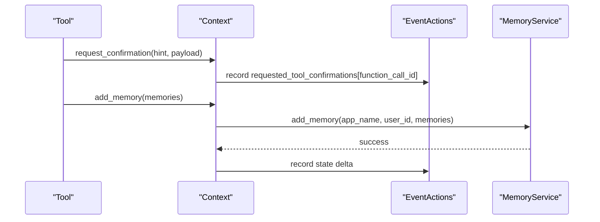
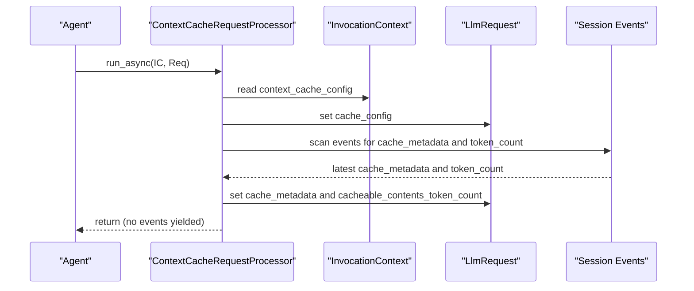
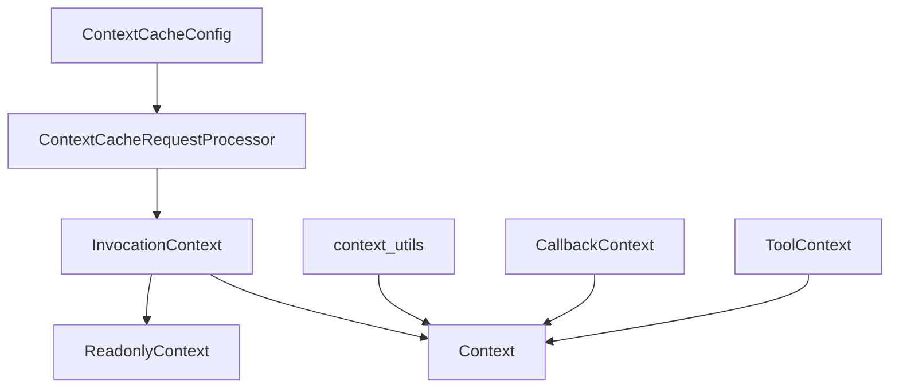

# Context Management System

<cite>
**Referenced Files in This Document**
- [invocation_context.py](file://src/google/adk/agents/invocation_context.py)
- [context.py](file://src/google/adk/agents/context.py)
- [readonly_context.py](file://src/google/adk/agents/readonly_context.py)
- [context_cache_config.py](file://src/google/adk/agents/context_cache_config.py)
- [context_cache_processor.py](file://src/google/adk/flows/llm_flows/context_cache_processor.py)
- [context_utils.py](file://src/google/adk/utils/context_utils.py)
- [callback_context.py](file://src/google/adk/agents/callback_context.py)
- [tool_context.py](file://src/google/adk/tools/tool_context.py)
- [context_offloading_with_artifact/agent.py](file://contributing/samples/context_offloading_with_artifact/agent.py)
- [test_context.py](file://tests/unittests/agents/test_context.py)
- [test_callback_context.py](file://tests/unittests/agents/test_callback_context.py)
- [test_context_cache_processor.py](file://tests/unittests/flows/llm_flows/test_context_cache_processor.py)
</cite>

## Table of Contents
1. [Introduction](#introduction)
2. [Project Structure](#project-structure)
3. [Core Components](#core-components)
4. [Architecture Overview](#architecture-overview)
5. [Detailed Component Analysis](#detailed-component-analysis)
6. [Dependency Analysis](#dependency-analysis)
7. [Performance Considerations](#performance-considerations)
8. [Troubleshooting Guide](#troubleshooting-guide)
9. [Conclusion](#conclusion)

## Introduction
This document explains the context management system used by agents in the ADK Python project. It focuses on how InvocationContext tracks agent execution state across invocations, how Context and ReadonlyContext provide controlled access to session state and resources, and how ContextCacheConfig governs context caching strategies. It also covers context creation, propagation through agent hierarchies, state preservation across invocations, validation, error handling, memory management, serialization/deserialization/persistence patterns, and practical examples of context manipulation and cross-agent communication.

## Project Structure
The context management system spans several modules:
- InvocationContext: immutable per-invocation data and runtime flags
- Context: mutable context for tools and callbacks with access to artifacts, credentials, memory, and state deltas
- ReadonlyContext: read-only facade over InvocationContext for safe exposure
- ContextCacheConfig: configuration for enabling and tuning context caching
- ContextCacheRequestProcessor: integrates caching configuration into LLM request flows
- Utilities: helpers to detect and route Context parameters in agent/tool functions
- Backward compatibility aliases: CallbackContext and ToolContext unify to Context

**Diagram sources**
- [invocation_context.py](file://src/google/adk/agents/invocation_context.py#L100-L220)
- [context.py](file://src/google/adk/agents/context.py#L41-L110)
- [readonly_context.py](file://src/google/adk/agents/readonly_context.py#L30-L72)
- [context_cache_config.py](file://src/google/adk/agents/context_cache_config.py#L25-L86)
- [context_cache_processor.py](file://src/google/adk/flows/llm_flows/context_cache_processor.py#L35-L92)
- [context_utils.py](file://src/google/adk/utils/context_utils.py#L35-L87)
- [callback_context.py](file://src/google/adk/agents/callback_context.py#L17-L23)
- [tool_context.py](file://src/google/adk/tools/tool_context.py#L17-L31)

**Section sources**
- [invocation_context.py](file://src/google/adk/agents/invocation_context.py#L100-L220)
- [context.py](file://src/google/adk/agents/context.py#L41-L110)
- [readonly_context.py](file://src/google/adk/agents/readonly_context.py#L30-L72)
- [context_cache_config.py](file://src/google/adk/agents/context_cache_config.py#L25-L86)
- [context_cache_processor.py](file://src/google/adk/flows/llm_flows/context_cache_processor.py#L35-L92)
- [context_utils.py](file://src/google/adk/utils/context_utils.py#L35-L87)
- [callback_context.py](file://src/google/adk/agents/callback_context.py#L17-L23)
- [tool_context.py](file://src/google/adk/tools/tool_context.py#L17-L31)

## Core Components
- InvocationContext: Immutable per-invocation snapshot containing invocation_id, branch, agent, user_content, session, and runtime flags such as end_invocation, resumability, and canonical tools cache. It exposes methods to manage agent states and end-of-agent flags, and to query events scoped to the current invocation or branch.
- Context: Mutable context for tools and callbacks. Extends ReadonlyContext and adds state delta support, event actions, and convenience methods for artifacts, credentials, memory, and tool confirmations. Provides a delta-aware State proxy and an EventActions collector for side effects.
- ReadonlyContext: Read-only facade exposing invocation_id, agent_name, session, user_id, user_content, and run_config from InvocationContext. Prevents accidental mutation of session state.
- ContextCacheConfig: Configuration for enabling context caching across agents, including cache_intervals, ttl_seconds, and min_tokens thresholds.
- ContextCacheRequestProcessor: Integrates ContextCacheConfig into LLM request processing, injecting cache metadata and previous token counts from session events.

**Section sources**
- [invocation_context.py](file://src/google/adk/agents/invocation_context.py#L100-L220)
- [context.py](file://src/google/adk/agents/context.py#L41-L110)
- [readonly_context.py](file://src/google/adk/agents/readonly_context.py#L30-L72)
- [context_cache_config.py](file://src/google/adk/agents/context_cache_config.py#L25-L86)
- [context_cache_processor.py](file://src/google/adk/flows/llm_flows/context_cache_processor.py#L35-L92)

## Architecture Overview
The context system orchestrates agent execution state across invocations and branches. InvocationContext encapsulates immutable invocation data and runtime flags. Context wraps InvocationContext to expose mutable state and side-effect collectors. ContextCacheConfig and ContextCacheRequestProcessor coordinate caching behavior across LLM requests.

**Diagram sources**
- [invocation_context.py](file://src/google/adk/agents/invocation_context.py#L100-L220)
- [readonly_context.py](file://src/google/adk/agents/readonly_context.py#L30-L72)
- [context.py](file://src/google/adk/agents/context.py#L41-L110)
- [context_cache_config.py](file://src/google/adk/agents/context_cache_config.py#L25-L86)
- [context_cache_processor.py](file://src/google/adk/flows/llm_flows/context_cache_processor.py#L35-L92)

## Detailed Component Analysis

### InvocationContext
InvocationContext represents a single agent invocation lifecycle and holds:
- Identity and scope: invocation_id, branch, agent, user_content, session
- Agent state management: agent_states and end_of_agents dictionaries
- Runtime flags: end_invocation, resumability, live session resumption handle
- Streaming and real-time caches: input/output realtime caches and active streaming tools
- Run configuration: run_config, resumability_config, events compaction config
- Plugin manager and canonical tools cache
- Cost tracking for LLM calls

Key behaviors:
- set_agent_state and reset_sub_agent_states maintain per-agent state across steps
- populate_invocation_agent_states restores agent state from session events for resumable apps
- should_pause_invocation decides pause points for long-running tool calls
- _get_events filters session events by current invocation or branch

**Diagram sources**
- [invocation_context.py](file://src/google/adk/agents/invocation_context.py#L100-L220)

**Section sources**
- [invocation_context.py](file://src/google/adk/agents/invocation_context.py#L100-L220)

### Context and ReadonlyContext
Context extends ReadonlyContext to provide:
- Delta-aware State proxy for mutating session state directly
- EventActions collector for artifact deltas, tool confirmations, and auth requests
- Tool-specific attributes: function_call_id and tool_confirmation
- Rich APIs for artifacts, credentials, and memory

ReadonlyContext provides read-only access to:
- invocation_id, agent_name, session, user_id, user_content, run_config
- A MappingProxyType view of session state to prevent mutation

Backward compatibility:
- CallbackContext and ToolContext are aliases to Context for legacy code.

**Diagram sources**
- [context.py](file://src/google/adk/agents/context.py#L277-L307)
- [context.py](file://src/google/adk/agents/context.py#L367-L392)

**Section sources**
- [context.py](file://src/google/adk/agents/context.py#L41-L110)
- [readonly_context.py](file://src/google/adk/agents/readonly_context.py#L30-L72)
- [callback_context.py](file://src/google/adk/agents/callback_context.py#L17-L23)
- [tool_context.py](file://src/google/adk/tools/tool_context.py#L17-L31)

### ContextCacheConfig and ContextCacheRequestProcessor
ContextCacheConfig defines:
- cache_intervals: max invocations to reuse cache before refresh
- ttl_seconds: cache TTL
- min_tokens: minimum estimated tokens to enable caching

ContextCacheRequestProcessor:
- Injects ContextCacheConfig into LLM requests
- Scans session events to find latest cache metadata and previous prompt token counts
- Increments invocations_used when cache is reused across different invocations

**Diagram sources**
- [context_cache_processor.py](file://src/google/adk/flows/llm_flows/context_cache_processor.py#L44-L92)
- [context_cache_processor.py](file://src/google/adk/flows/llm_flows/context_cache_processor.py#L94-L157)
- [context_cache_config.py](file://src/google/adk/agents/context_cache_config.py#L25-L86)

**Section sources**
- [context_cache_config.py](file://src/google/adk/agents/context_cache_config.py#L25-L86)
- [context_cache_processor.py](file://src/google/adk/flows/llm_flows/context_cache_processor.py#L35-L92)
- [context_cache_processor.py](file://src/google/adk/flows/llm_flows/context_cache_processor.py#L94-L157)

### Context Creation, Propagation, and State Preservation
- Context is constructed from InvocationContext in Context.__init__, binding EventActions and a delta-aware State proxy to the current session state.
- Branch tracking: InvocationContext.branch encodes ancestor hierarchy (e.g., agent_1.agent_2.agent_3) to isolate peer conversations.
- State preservation: InvocationContext.populate_invocation_agent_states restores agent_state and end_of_agent flags from prior events for resumable applications.
- Cross-agent communication: Context exposes session state and artifacts; tools can read/write state and persist deltas via EventActions.

Example patterns:
- Saving artifacts and recording deltas: Context.save_artifact updates artifact_service and records artifact_delta in EventActions.
- Requesting credentials and confirmations: Context.request_credential and Context.request_confirmation record requests in EventActions guarded by function_call_id.

**Section sources**
- [context.py](file://src/google/adk/agents/context.py#L41-L110)
- [invocation_context.py](file://src/google/adk/agents/invocation_context.py#L283-L313)
- [context_offloading_with_artifact/agent.py](file://contributing/samples/context_offloading_with_artifact/agent.py#L118-L177)

### Context Validation, Error Handling, and Memory Management
- Validation: Methods like load_artifact/save_artifact/get_artifact_version/list_artifacts raise ValueError when required services are missing.
- Error handling: InvocationContext.increment_llm_call_count enforces run_config.max_llm_calls and raises LlmCallsLimitExceededError when exceeded.
- Memory management: EventActions collects deltas; session services apply temp state before trimming and persist events atomically. Stale session detection prevents overwriting newer storage state.

**Section sources**
- [context.py](file://src/google/adk/agents/context.py#L114-L197)
- [context.py](file://src/google/adk/agents/context.py#L203-L230)
- [context.py](file://src/google/adk/agents/context.py#L313-L412)
- [invocation_context.py](file://src/google/adk/agents/invocation_context.py#L314-L326)
- [sqlite_session_service.py](file://src/google/adk/sessions/sqlite_session_service.py#L359-L389)

### Serialization, Deserialization, and Persistence Patterns
- State deltas: Context.state is a delta-aware proxy; EventActions accumulates changes to be persisted alongside events.
- Persistence: Session services persist events and trim temporary state deltas before committing. Tests demonstrate expected error messages when services are unavailable.
- Caching metadata: ContextCacheRequestProcessor reads cache_metadata and previous token counts from session events to reuse cached content across invocations.

**Section sources**
- [context.py](file://src/google/adk/agents/context.py#L95-L103)
- [context_cache_processor.py](file://src/google/adk/flows/llm_flows/context_cache_processor.py#L94-L157)
- [test_context.py](file://tests/unittests/agents/test_context.py#L533-L549)
- [test_callback_context.py](file://tests/unittests/agents/test_callback_context.py#L458-L509)

### Examples of Context Manipulation and Cross-Agent Communication
- Context variable injection: Instructions can reference state variables; validation ensures proper naming and raises KeyError for invalid references.
- Artifact offloading: Large content is saved as artifacts and injected into LLM requests only when needed, reducing context window pressure.
- Tool-managed state: Tools can request confirmations and credentials; Context records these requests in EventActions for downstream handling.

**Section sources**
- [context_offloading_with_artifact/agent.py](file://contributing/samples/context_offloading_with_artifact/agent.py#L42-L117)
- [context_offloading_with_artifact/agent.py](file://contributing/samples/context_offloading_with_artifact/agent.py#L179-L219)
- [context.py](file://src/google/adk/agents/context.py#L277-L307)
- [context.py](file://src/google/adk/agents/context.py#L249-L272)

## Dependency Analysis
The context system exhibits clear separation of concerns:
- InvocationContext depends on Session, BaseAgent, and optional services (artifact, memory, credential)
- Context depends on InvocationContext and EventActions for side effects
- ContextCacheConfig is consumed by ContextCacheRequestProcessor and propagated to LLM requests
- Utilities detect Context parameters in function signatures to route context automatically

**Diagram sources**
- [invocation_context.py](file://src/google/adk/agents/invocation_context.py#L100-L220)
- [context.py](file://src/google/adk/agents/context.py#L41-L110)
- [readonly_context.py](file://src/google/adk/agents/readonly_context.py#L30-L72)
- [context_cache_config.py](file://src/google/adk/agents/context_cache_config.py#L25-L86)
- [context_cache_processor.py](file://src/google/adk/flows/llm_flows/context_cache_processor.py#L35-L92)
- [context_utils.py](file://src/google/adk/utils/context_utils.py#L35-L87)
- [callback_context.py](file://src/google/adk/agents/callback_context.py#L17-L23)
- [tool_context.py](file://src/google/adk/tools/tool_context.py#L17-L31)

**Section sources**
- [invocation_context.py](file://src/google/adk/agents/invocation_context.py#L100-L220)
- [context.py](file://src/google/adk/agents/context.py#L41-L110)
- [context_cache_processor.py](file://src/google/adk/flows/llm_flows/context_cache_processor.py#L35-L92)
- [context_utils.py](file://src/google/adk/utils/context_utils.py#L35-L87)

## Performance Considerations
- Context caching reduces latency and cost by reusing cached content across invocations when thresholds are met. Tuning cache_intervals, ttl_seconds, and min_tokens balances freshness and efficiency.
- Event compaction and token threshold checks help manage memory footprint during long sessions.
- Streaming caches (input/output realtime cache) buffer chunks before flushing to services, minimizing repeated writes.

[No sources needed since this section provides general guidance]

## Troubleshooting Guide
Common issues and resolutions:
- Missing services: Methods that require artifact, memory, or credential services raise ValueError when services are None. Ensure services are configured on InvocationContext.
- LLM call limits: Exceeding max_llm_calls triggers LlmCallsLimitExceededError. Adjust run_config.max_llm_calls accordingly.
- Stale sessions: Session services detect stale sessions and raise ValueError to prevent overwriting newer storage state.
- Cache metadata not found: ContextCacheRequestProcessor returns None when no cache metadata is present; ensure prior LLM responses recorded cache_metadata.

**Section sources**
- [context.py](file://src/google/adk/agents/context.py#L114-L197)
- [context.py](file://src/google/adk/agents/context.py#L203-L230)
- [context.py](file://src/google/adk/agents/context.py#L313-L412)
- [invocation_context.py](file://src/google/adk/agents/invocation_context.py#L314-L326)
- [sqlite_session_service.py](file://src/google/adk/sessions/sqlite_session_service.py#L359-L389)
- [test_context_cache_processor.py](file://tests/unittests/flows/llm_flows/test_context_cache_processor.py#L36-L76)

## Conclusion
The context management system provides a robust, layered approach to tracking agent execution state. InvocationContext captures immutable invocation data and runtime flags, Context offers a safe, mutable interface for tools and callbacks, and ReadonlyContext shields read-only access. ContextCacheConfig and ContextCacheRequestProcessor enable efficient reuse of processed context. Together, these components support state preservation, cross-agent communication, validation, error handling, and performance optimization through caching and event compaction.