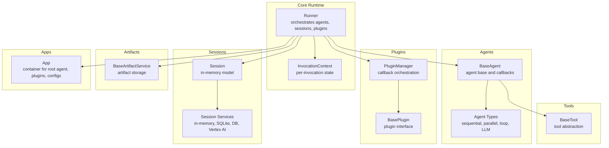
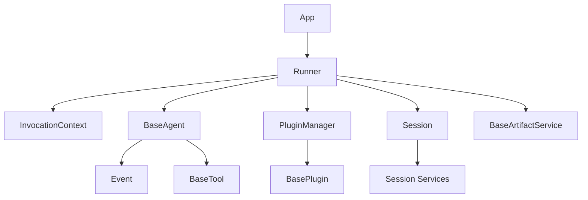
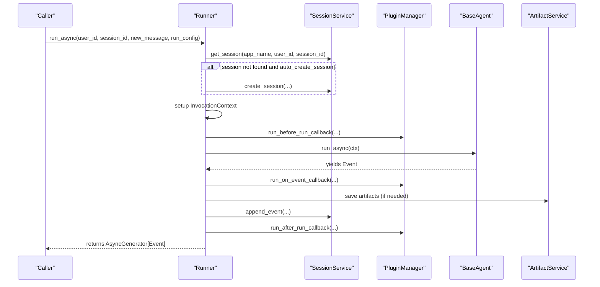
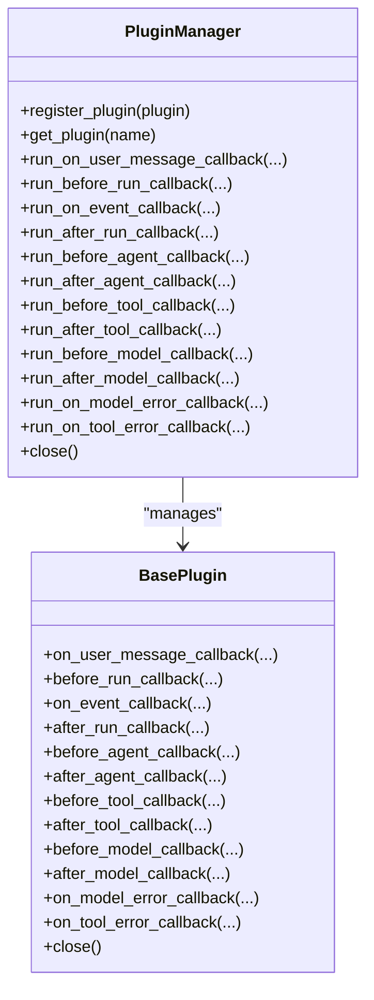
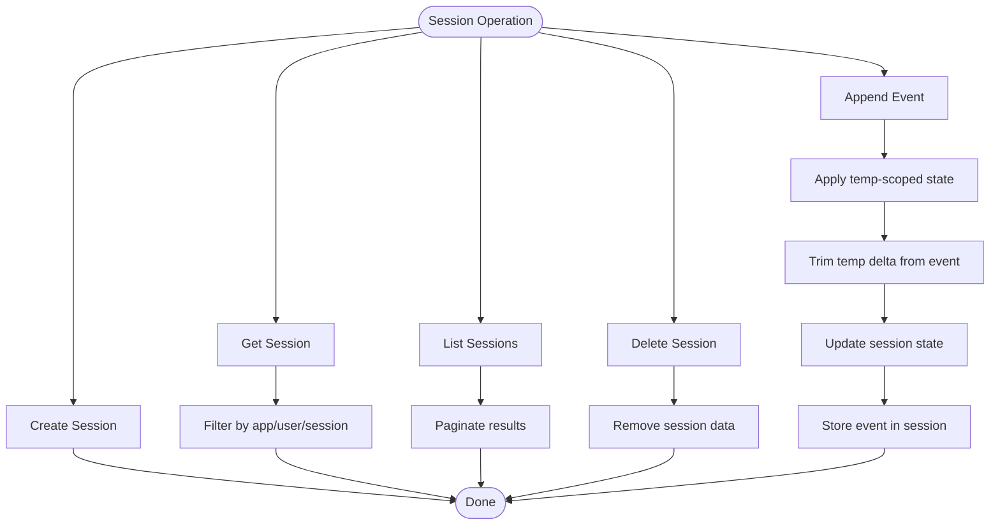
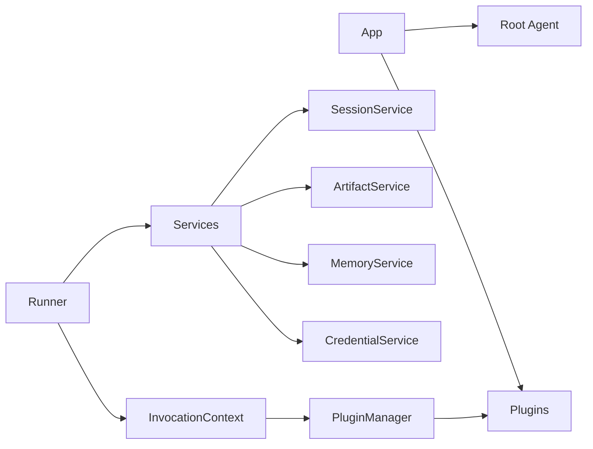
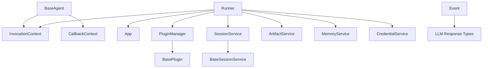

# Core Framework Architecture

<cite>
**Referenced Files in This Document**
- [__init__.py](file://src/google/adk/__init__.py)
- [runners.py](file://src/google/adk/runners.py)
- [base_agent.py](file://src/google/adk/agents/base_agent.py)
- [invocation_context.py](file://src/google/adk/agents/invocation_context.py)
- [app.py](file://src/google/adk/apps/app.py)
- [base_plugin.py](file://src/google/adk/plugins/base_plugin.py)
- [plugin_manager.py](file://src/google/adk/plugins/plugin_manager.py)
- [base_session_service.py](file://src/google/adk/sessions/base_session_service.py)
- [session.py](file://src/google/adk/sessions/session.py)
- [event.py](file://src/google/adk/events/event.py)
- [base_artifact_service.py](file://src/google/adk/artifacts/base_artifact_service.py)
- [base_tool.py](file://src/google/adk/tools/base_tool.py)
</cite>

## Table of Contents
1. [Introduction](#introduction)
2. [Project Structure](#project-structure)
3. [Core Components](#core-components)
4. [Architecture Overview](#architecture-overview)
5. [Detailed Component Analysis](#detailed-component-analysis)
6. [Dependency Analysis](#dependency-analysis)
7. [Performance Considerations](#performance-considerations)
8. [Troubleshooting Guide](#troubleshooting-guide)
9. [Conclusion](#conclusion)

## Introduction
This document describes the core architecture of the ADK (Agent Development Kit) framework. It focuses on the agent runtime engine, plugin architecture, and session management system. The framework enables flexible agent composition and orchestration through a modular design that integrates agents, tools, services, and plugins. It documents the callback system and plugin mechanism for extending functionality, the session management architecture supporting in-memory, database, and cloud-based storage, and the service registry pattern with dependency injection. System context diagrams illustrate how major components interact and how data flows through the system.

## Project Structure
The ADK core resides under src/google/adk and is organized by functional domains:
- Agents: Base agent abstractions, invocation context, and specialized agent types
- Apps: Application container and configuration (plugins, resumability, event compaction)
- Plugins: Plugin base class and plugin manager for lifecycle callbacks
- Sessions: Session abstraction and service interfaces for persistence
- Tools: Tool base classes and toolset abstractions
- Artifacts: Artifact service abstractions for file and blob storage
- Events: Event model and actions for capturing agent interactions
- Runners: Runtime engine orchestrating agents, sessions, and plugins

**Diagram sources**
- [runners.py](file://src/google/adk/runners.py#L112-L220)
- [base_agent.py](file://src/google/adk/agents/base_agent.py#L86-L130)
- [invocation_context.py](file://src/google/adk/agents/invocation_context.py#L100-L220)
- [base_plugin.py](file://src/google/adk/plugins/base_plugin.py#L41-L103)
- [plugin_manager.py](file://src/google/adk/plugins/plugin_manager.py#L60-L105)
- [session.py](file://src/google/adk/sessions/session.py#L27-L51)
- [base_session_service.py](file://src/google/adk/sessions/base_session_service.py#L45-L104)
- [base_tool.py](file://src/google/adk/tools/base_tool.py#L47-L80)
- [base_artifact_service.py](file://src/google/adk/artifacts/base_artifact_service.py#L88-L125)
- [app.py](file://src/google/adk/apps/app.py#L111-L152)

**Section sources**
- [__init__.py](file://src/google/adk/__init__.py#L18-L23)
- [runners.py](file://src/google/adk/runners.py#L112-L220)
- [app.py](file://src/google/adk/apps/app.py#L111-L152)

## Core Components
- Runner: Central runtime engine that coordinates agent execution, session management, artifact storage, memory, credentials, and plugins. It exposes synchronous and asynchronous run APIs and supports rewinding and event compaction.
- BaseAgent: Abstraction for agents with before/after callbacks, state management, and cloning. Provides run_async and run_live entry points.
- InvocationContext: Per-invocation state container holding agent, session, tools cache, plugin manager, resumability and compaction configs, and invocation-scoped data.
- App: Top-level container for the root agent, application-wide plugins, resumability, event compaction, and context cache configuration.
- PluginManager and BasePlugin: Plugin system with lifecycle callbacks (user message, run, event, agent, tool, model, error hooks) and early-exit semantics.
- Session and BaseSessionService: Session model and service interface for creating, retrieving, listing, deleting, and appending events with state delta handling.
- Event: Typed event model capturing content, function calls/responses, actions, timestamps, and invocation/branch metadata.
- BaseArtifactService: Artifact abstraction for saving/loading/listing/deleting artifacts and versions.
- BaseTool: Tool abstraction with declarative function declarations, long-running support, and LLM request processing.

**Section sources**
- [runners.py](file://src/google/adk/runners.py#L112-L220)
- [base_agent.py](file://src/google/adk/agents/base_agent.py#L86-L130)
- [invocation_context.py](file://src/google/adk/agents/invocation_context.py#L100-L220)
- [app.py](file://src/google/adk/apps/app.py#L111-L152)
- [base_plugin.py](file://src/google/adk/plugins/base_plugin.py#L41-L103)
- [plugin_manager.py](file://src/google/adk/plugins/plugin_manager.py#L60-L105)
- [session.py](file://src/google/adk/sessions/session.py#L27-L51)
- [base_session_service.py](file://src/google/adk/sessions/base_session_service.py#L45-L104)
- [event.py](file://src/google/adk/events/event.py#L31-L99)
- [base_artifact_service.py](file://src/google/adk/artifacts/base_artifact_service.py#L88-L125)
- [base_tool.py](file://src/google/adk/tools/base_tool.py#L47-L80)

## Architecture Overview
The ADK follows a layered architecture:
- Application Layer: App encapsulates the root agent, plugins, and configuration.
- Runtime Layer: Runner orchestrates agent execution, session retrieval/creation, plugin callbacks, and event compaction.
- Agent Layer: BaseAgent and derived agent types implement behavior and callbacks.
- Plugin Layer: PluginManager executes plugin callbacks in registration order with early-exit semantics.
- Persistence Layer: BaseSessionService and implementations manage session and event persistence.
- Artifact Layer: BaseArtifactService and implementations manage artifact storage.
- Tool Layer: BaseTool and toolsets integrate external capabilities.

**Diagram sources**
- [app.py](file://src/google/adk/apps/app.py#L111-L152)
- [runners.py](file://src/google/adk/runners.py#L112-L220)
- [invocation_context.py](file://src/google/adk/agents/invocation_context.py#L100-L220)
- [base_agent.py](file://src/google/adk/agents/base_agent.py#L86-L130)
- [plugin_manager.py](file://src/google/adk/plugins/plugin_manager.py#L60-L105)
- [base_plugin.py](file://src/google/adk/plugins/base_plugin.py#L41-L103)
- [session.py](file://src/google/adk/sessions/session.py#L27-L51)
- [base_session_service.py](file://src/google/adk/sessions/base_session_service.py#L45-L104)
- [event.py](file://src/google/adk/events/event.py#L31-L99)
- [base_artifact_service.py](file://src/google/adk/artifacts/base_artifact_service.py#L88-L125)
- [base_tool.py](file://src/google/adk/tools/base_tool.py#L47-L80)

## Detailed Component Analysis

### Agent Runtime Engine
The Runner is the central runtime engine responsible for:
- Validating and initializing the App or agent configuration
- Managing session creation/retrieval and auto-create behavior
- Building InvocationContext per invocation
- Executing agent.run_async with plugin interception
- Applying event compaction after invocation completion
- Supporting rewind operations to restore state and artifacts

Key flows:
- Synchronous run delegates to an async run loop in a background thread
- Asynchronous run performs session retrieval, invocation setup, plugin callbacks, agent execution, and post-processing
- Rewind computes state and artifact deltas and appends a rewind event

**Diagram sources**
- [runners.py](file://src/google/adk/runners.py#L493-L622)
- [runners.py](file://src/google/adk/runners.py#L778-L806)
- [base_agent.py](file://src/google/adk/agents/base_agent.py#L274-L305)
- [plugin_manager.py](file://src/google/adk/plugins/plugin_manager.py#L130-L144)

**Section sources**
- [runners.py](file://src/google/adk/runners.py#L112-L220)
- [runners.py](file://src/google/adk/runners.py#L493-L622)
- [runners.py](file://src/google/adk/runners.py#L623-L758)
- [base_agent.py](file://src/google/adk/agents/base_agent.py#L274-L305)

### Plugin Architecture and Callback System
The plugin system provides a structured way to intercept and modify agent, tool, and LLM behaviors at critical execution points:
- BasePlugin defines callback methods for user messages, run lifecycle, events, agent execution, tool execution, model requests/responses, and error handling
- PluginManager registers plugins and executes callbacks in order, with early-exit semantics when a callback returns a non-None value
- Plugins can short-circuit agent runs, tool calls, and model requests by returning values

**Diagram sources**
- [base_plugin.py](file://src/google/adk/plugins/base_plugin.py#L41-L103)
- [plugin_manager.py](file://src/google/adk/plugins/plugin_manager.py#L60-L105)

**Section sources**
- [base_plugin.py](file://src/google/adk/plugins/base_plugin.py#L41-L103)
- [plugin_manager.py](file://src/google/adk/plugins/plugin_manager.py#L60-L105)
- [plugin_manager.py](file://src/google/adk/plugins/plugin_manager.py#L260-L308)

### Session Management System
The session management architecture supports multiple storage backends:
- In-memory sessions for local development and testing
- SQLite and database-backed services for persistent storage
- Cloud-based services (e.g., Vertex AI) for scalable persistence

Core responsibilities:
- Create, retrieve, list, and delete sessions
- Append events with state delta application and trimming of temporary state
- Maintain session state and last update time
- Support rewind operations by computing state and artifact deltas

**Diagram sources**
- [base_session_service.py](file://src/google/adk/sessions/base_session_service.py#L45-L104)
- [base_session_service.py](file://src/google/adk/sessions/base_session_service.py#L105-L154)
- [session.py](file://src/google/adk/sessions/session.py#L27-L51)

**Section sources**
- [base_session_service.py](file://src/google/adk/sessions/base_session_service.py#L45-L104)
- [base_session_service.py](file://src/google/adk/sessions/base_session_service.py#L105-L154)
- [session.py](file://src/google/adk/sessions/session.py#L27-L51)

### Service Registry Pattern and Dependency Injection
The framework uses a service registry pattern combined with dependency injection:
- App holds the root agent, plugins, and configuration
- Runner receives services (session, artifact, memory, credential) and constructs InvocationContext with these dependencies
- InvocationContext carries service references and plugin manager for the current invocation
- Plugins can access services via InvocationContext and modify behavior through callbacks

**Diagram sources**
- [app.py](file://src/google/adk/apps/app.py#L111-L152)
- [runners.py](file://src/google/adk/runners.py#L150-L220)
- [invocation_context.py](file://src/google/adk/agents/invocation_context.py#L146-L220)

**Section sources**
- [app.py](file://src/google/adk/apps/app.py#L111-L152)
- [runners.py](file://src/google/adk/runners.py#L150-L220)
- [invocation_context.py](file://src/google/adk/agents/invocation_context.py#L146-L220)

### Extensibility Points and Integration Patterns
Extensibility is achieved through:
- Agent composition: BaseAgent supports hierarchical composition with sub-agents and state management
- Tool integration: BaseTool supports declarative function declarations and LLM request processing
- Plugin extension: BasePlugin provides granular lifecycle hooks for cross-cutting concerns
- Service abstraction: BaseSessionService and BaseArtifactService enable pluggable persistence and storage backends
- Configuration-driven instantiation: Agents and tools can be constructed from configuration files

Integration patterns:
- Agent-to-Agent orchestration via transfer and branching
- Tool-to-LLM integration via function declarations and request augmentation
- Plugin-to-service integration via InvocationContext access to services

**Section sources**
- [base_agent.py](file://src/google/adk/agents/base_agent.py#L86-L130)
- [base_tool.py](file://src/google/adk/tools/base_tool.py#L47-L80)
- [base_plugin.py](file://src/google/adk/plugins/base_plugin.py#L41-L103)
- [base_session_service.py](file://src/google/adk/sessions/base_session_service.py#L45-L104)
- [base_artifact_service.py](file://src/google/adk/artifacts/base_artifact_service.py#L88-L125)

## Dependency Analysis
The core runtime depends on:
- Agents depend on InvocationContext and CallbackContext for execution and state
- Runner depends on App, InvocationContext, PluginManager, SessionService, ArtifactService, MemoryService, and CredentialService
- PluginManager depends on BasePlugin and executes callbacks in registration order
- SessionService implementations depend on BaseSessionService and provide persistence strategies
- Event model extends LLM response types and captures function calls and responses

**Diagram sources**
- [base_agent.py](file://src/google/adk/agents/base_agent.py#L86-L130)
- [invocation_context.py](file://src/google/adk/agents/invocation_context.py#L100-L220)
- [runners.py](file://src/google/adk/runners.py#L150-L220)
- [plugin_manager.py](file://src/google/adk/plugins/plugin_manager.py#L60-L105)
- [base_plugin.py](file://src/google/adk/plugins/base_plugin.py#L41-L103)
- [base_session_service.py](file://src/google/adk/sessions/base_session_service.py#L45-L104)
- [event.py](file://src/google/adk/events/event.py#L31-L99)

**Section sources**
- [base_agent.py](file://src/google/adk/agents/base_agent.py#L86-L130)
- [runners.py](file://src/google/adk/runners.py#L150-L220)
- [plugin_manager.py](file://src/google/adk/plugins/plugin_manager.py#L60-L105)
- [base_session_service.py](file://src/google/adk/sessions/base_session_service.py#L45-L104)
- [event.py](file://src/google/adk/events/event.py#L31-L99)

## Performance Considerations
- Event compaction: Post-invocation compaction reduces token usage and improves latency for long sessions
- Temporary state handling: Temp-scoped state is applied in-memory and trimmed from persisted deltas to minimize storage overhead
- Streaming and live sessions: Real-time audio caching and live request queues optimize media-heavy interactions
- Plugin early-exit: Short-circuiting reduces unnecessary computation and network calls
- Tool long-running operations: Long-running tools support idempotent resumption and reduce blocking

[No sources needed since this section provides general guidance]

## Troubleshooting Guide
Common issues and resolutions:
- Session not found: When auto-create is disabled, SessionNotFoundError is raised; enable auto_create_session or pre-create sessions
- App name alignment: Misalignment between runner app_name and agent origin triggers warnings; align app_name or pass explicit override
- Rewind errors: Rewind requires a valid invocation_id; ensure the target invocation exists in session events
- Plugin close failures: PluginManager.close aggregates failures; review plugin close timeouts and error logs

**Section sources**
- [runners.py](file://src/google/adk/runners.py#L384-L394)
- [runners.py](file://src/google/adk/runners.py#L333-L354)
- [runners.py](file://src/google/adk/runners.py#L623-L644)
- [plugin_manager.py](file://src/google/adk/plugins/plugin_manager.py#L309-L348)

## Conclusion
The ADK core framework provides a robust, extensible foundation for building agent applications. Its agent runtime engine, plugin architecture, and session management system integrate seamlessly to support flexible agent composition, orchestration, and persistence. The service registry pattern and dependency injection enable modular designs, while the callback system and plugin mechanism offer powerful extension points. The session management architecture accommodates diverse storage backends, and the artifact abstraction simplifies file and blob handling. Together, these components deliver a scalable and maintainable platform for agent development.