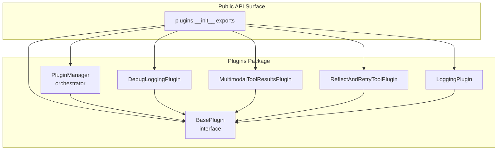
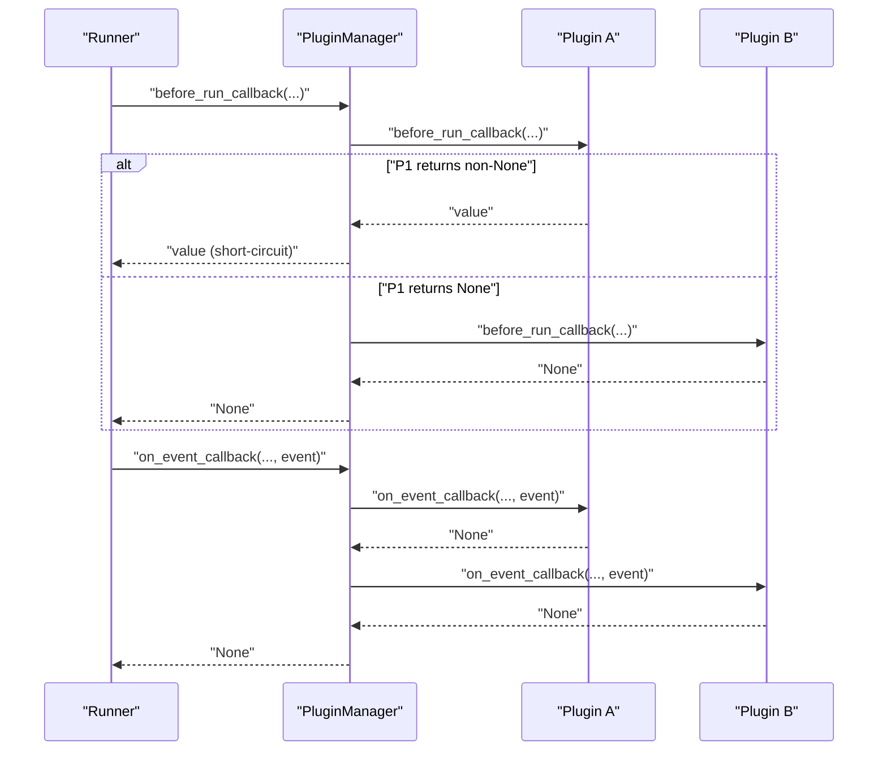
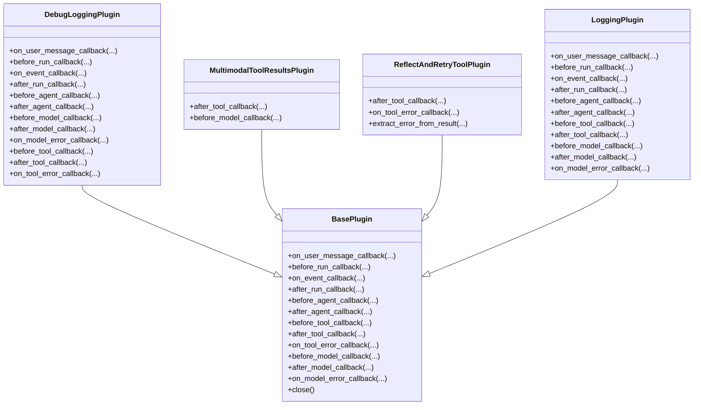
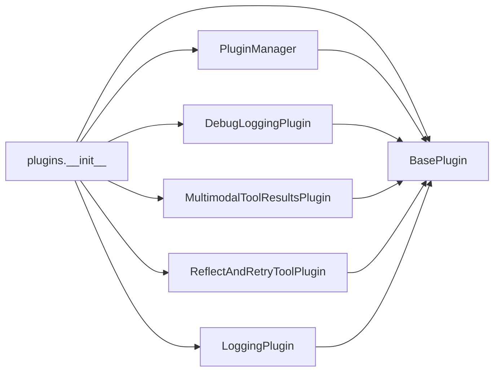
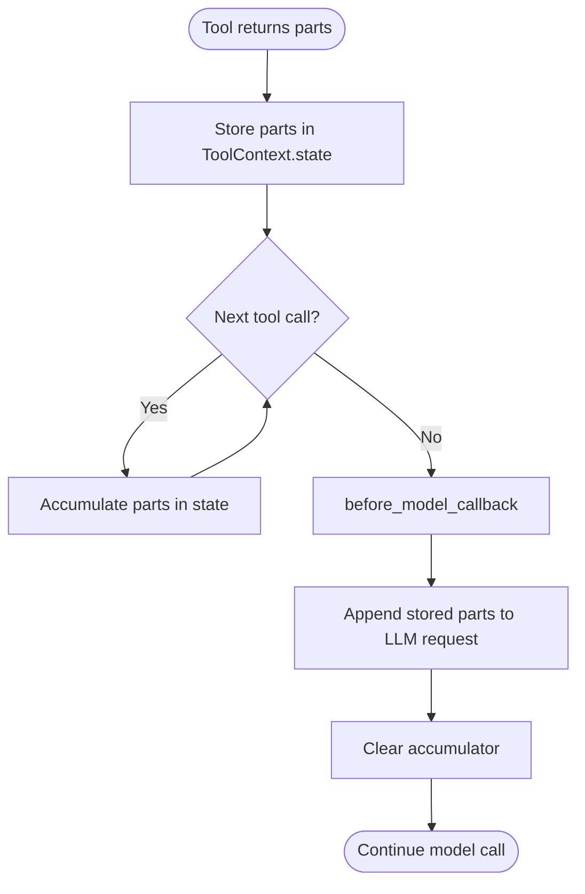
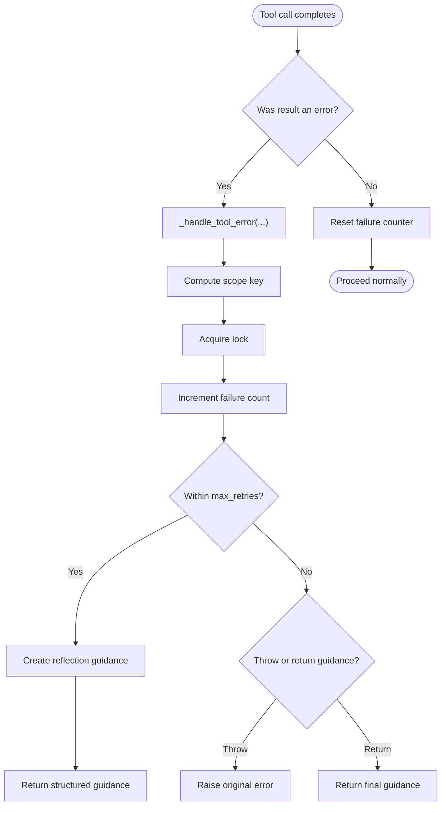

# Plugin Architecture

<cite>
**Referenced Files in This Document**
- [__init__.py](file://src/google/adk/plugins/__init__.py)
- [base_plugin.py](file://src/google/adk/plugins/base_plugin.py)
- [plugin_manager.py](file://src/google/adk/plugins/plugin_manager.py)
- [debug_logging_plugin.py](file://src/google/adk/plugins/debug_logging_plugin.py)
- [multimodal_tool_results_plugin.py](file://src/google/adk/plugins/multimodal_tool_results_plugin.py)
- [reflect_retry_tool_plugin.py](file://src/google/adk/plugins/reflect_retry_tool_plugin.py)
- [logging_plugin.py](file://src/google/adk/plugins/logging_plugin.py)
- [main.py](file://contributing/samples/plugin_basic/main.py)
- [count_plugin.py](file://contributing/samples/plugin_basic/count_plugin.py)
- [test_plugin_manager.py](file://tests/unittests/plugins/test_plugin_manager.py)
- [test_base_plugin.py](file://tests/unittests/plugins/test_base_plugin.py)
- [test_multimodal_tool_results_plugin.py](file://tests/unittests/plugins/test_multimodal_tool_results_plugin.py)
</cite>

## Table of Contents
1. [Introduction](#introduction)
2. [Project Structure](#project-structure)
3. [Core Components](#core-components)
4. [Architecture Overview](#architecture-overview)
5. [Detailed Component Analysis](#detailed-component-analysis)
6. [Dependency Analysis](#dependency-analysis)
7. [Performance Considerations](#performance-considerations)
8. [Troubleshooting Guide](#troubleshooting-guide)
9. [Conclusion](#conclusion)
10. [Appendices](#appendices)

## Introduction
This document describes the plugin system architecture used to extend agent functionality in the SDK. It explains the PluginManager orchestration, the BasePlugin interface, the plugin lifecycle, and the callback system. It also documents built-in plugins (debug logging, multimodal tool results, reflect-and-retry tool), configuration and registration patterns, dependency management, and practical guidance for building, chaining, and error handling plugins. Finally, it covers isolation, performance impact, and best practices for robust plugin design.

## Project Structure
The plugin system lives under the plugins package and exposes a public surface via the package’s init module. Core elements include:
- BasePlugin: Defines the plugin contract and all supported callbacks.
- PluginManager: Registers plugins and executes their callbacks in order, implementing an early-exit strategy.
- Built-in plugins: Ready-to-use extensions for logging, multimodal tool results, and self-healing tool retries.
- Samples and tests: Demonstrate usage, lifecycle behavior, and edge cases.

**Diagram sources**
- [__init__.py](file://src/google/adk/plugins/__init__.py#L15-L27)
- [base_plugin.py](file://src/google/adk/plugins/base_plugin.py#L41-L373)
- [plugin_manager.py](file://src/google/adk/plugins/plugin_manager.py#L60-L348)
- [debug_logging_plugin.py](file://src/google/adk/plugins/debug_logging_plugin.py#L67-L573)
- [multimodal_tool_results_plugin.py](file://src/google/adk/plugins/multimodal_tool_results_plugin.py#L32-L91)
- [reflect_retry_tool_plugin.py](file://src/google/adk/plugins/reflect_retry_tool_plugin.py#L55-L383)
- [logging_plugin.py](file://src/google/adk/plugins/logging_plugin.py#L37-L324)

**Section sources**
- [__init__.py](file://src/google/adk/plugins/__init__.py#L15-L27)

## Core Components
- BasePlugin defines the plugin contract with lifecycle hooks for user messages, agent execution, tool calls, model requests/responses, and error handling. It supports optional early exits by returning a value, enabling short-circuit behavior.
- PluginManager registers plugins by unique name, enforces execution order, and runs callbacks with an early-exit policy. It also manages plugin close semantics with timeouts and consolidated error reporting.

Key responsibilities:
- BasePlugin: Declares callback methods and provides defaults; subclasses implement targeted hooks.
- PluginManager: Iterates registered plugins, invokes callbacks, handles exceptions, and supports graceful shutdown.

**Section sources**
- [base_plugin.py](file://src/google/adk/plugins/base_plugin.py#L41-L373)
- [plugin_manager.py](file://src/google/adk/plugins/plugin_manager.py#L60-L348)

## Architecture Overview
The plugin system integrates with the agent runtime through a callback-driven pipeline. PluginManager coordinates plugin execution around agent, tool, and model lifecycle events.

**Diagram sources**
- [plugin_manager.py](file://src/google/adk/plugins/plugin_manager.py#L130-L144)
- [plugin_manager.py](file://src/google/adk/plugins/plugin_manager.py#L260-L307)

## Detailed Component Analysis

### BasePlugin Interface
BasePlugin declares the full callback surface:
- User and invocation lifecycle: on_user_message_callback, before_run_callback, after_run_callback
- Event interception: on_event_callback
- Agent lifecycle: before_agent_callback, after_agent_callback
- Tool lifecycle: before_tool_callback, after_tool_callback, on_tool_error_callback
- Model lifecycle: before_model_callback, after_model_callback, on_model_error_callback
- Resource cleanup: close()

Behavioral guarantees:
- Execution order matches registration order.
- Plugins can short-circuit by returning a non-None value; remaining plugins and agent callbacks are skipped.
- Modifications to inputs propagate to downstream callbacks.

Implementation pattern:
- Subclass BasePlugin and override only the callbacks you need.
- Use optional return values to alter control flow or responses.

**Section sources**
- [base_plugin.py](file://src/google/adk/plugins/base_plugin.py#L41-L373)

### PluginManager Orchestration
PluginManager responsibilities:
- Registration: Ensures unique plugin names; logs registration.
- Execution: For each callback, iterates plugins in order, invoking the named callback. Early-exit on first non-None return.
- Error handling: Wraps plugin exceptions in a descriptive RuntimeError and preserves the original cause.
- Shutdown: Calls close() on all plugins concurrently with timeouts; aggregates failures into a single RuntimeError.

Early-exit semantics:
- If any plugin returns a value, subsequent plugins are not invoked for that callback.
- This enables caching, preemption, or synthetic responses.

Close semantics:
- Uses asyncio timeout when available; otherwise falls back to wait_for.
- Aggregates all failures into one error report.

**Section sources**
- [plugin_manager.py](file://src/google/adk/plugins/plugin_manager.py#L60-L348)

### Built-in Plugins

#### Debug Logging Plugin
Purpose: Captures a complete invocation trace to a YAML file, including user messages, events, agent lifecycle, LLM requests/responses, tool calls/results, and optional session state snapshots.

Highlights:
- Serializes Content and tool results safely.
- Maintains per-invocation state and writes at invocation end.
- Configurable output path and toggles for session state and system instructions.

Usage pattern:
- Instantiate with desired options.
- Pass to Runner plugins list.

**Section sources**
- [debug_logging_plugin.py](file://src/google/adk/plugins/debug_logging_plugin.py#L67-L573)

#### Multimodal Tool Results Plugin
Purpose: Enables tools to return lists of multimodal parts that are appended to the LLM request context automatically.

Mechanism:
- after_tool_callback stores returned parts in ToolContext state keyed by a constant ID.
- before_model_callback attaches stored parts to the last content part of the LLM request and clears the accumulator.

Edge cases:
- Non-list-of-parts results are passed through unchanged.
- Accumulates across multiple tool calls.

**Section sources**
- [multimodal_tool_results_plugin.py](file://src/google/adk/plugins/multimodal_tool_results_plugin.py#L32-L91)

#### Reflect-and-Retry Tool Plugin
Purpose: Provides self-healing for tool failures by generating reflective guidance and retrying up to a configurable limit. Supports concurrency-safe tracking and configurable scopes (per-invocation or global).

Key features:
- Concurrency-safe failure counters guarded by a lock.
- Configurable max retries and behavior when limits are exceeded.
- Extensible via overriding error extraction from tool results.
- Generates structured reflection guidance embedded as a special response type.

Scopes:
- INVOCATION: per-agent invocation.
- GLOBAL: across all invocations.

**Section sources**
- [reflect_retry_tool_plugin.py](file://src/google/adk/plugins/reflect_retry_tool_plugin.py#L55-L383)

#### Logging Plugin
Purpose: Console-based lightweight logging for debugging and demonstration. Logs user messages, events, agent/tool/model lifecycle, and errors.

Usage pattern:
- Instantiate and add to Runner plugins list.
- Useful for quick visibility into execution flow.

**Section sources**
- [logging_plugin.py](file://src/google/adk/plugins/logging_plugin.py#L37-L324)

### Plugin Lifecycle Management
Lifecycle phases and where they occur:
- on_user_message_callback: First hook when a user message arrives.
- before_run_callback: Pre-run hook for global setup.
- on_event_callback: Intercepts events yielded by the runner.
- before_agent_callback: Before agent primary logic.
- after_agent_callback: After agent primary logic.
- before_tool_callback: Before tool invocation.
- after_tool_callback: After tool invocation.
- on_tool_error_callback: When a tool raises an exception.
- before_model_callback: Before model request.
- after_model_callback: After model response.
- on_model_error_callback: When model call raises an exception.
- close: Cleanup on runner shutdown.

Execution order:
- Plugins execute in registration order.
- Plugins take precedence over agent callbacks.
- Early-exit on first non-None return.

**Section sources**
- [base_plugin.py](file://src/google/adk/plugins/base_plugin.py#L114-L372)
- [plugin_manager.py](file://src/google/adk/plugins/plugin_manager.py#L260-L307)

### Callback System Details
Callback categories and typical use cases:
- User and invocation: Modify or observe user input, initialize state, finalize reporting.
- Agent: Gate agent execution, inject context, or short-circuit.
- Tool: Validate inputs, transform results, or synthesize responses.
- Model: Implement caching, request/response inspection, or error recovery.

Early-exit behavior:
- Returning a value from any callback halts further plugin execution for that callback and propagates the value upward.
- This enables caching, synthetic responses, or preemption.

Error propagation:
- Exceptions raised by plugins are wrapped in RuntimeError with the original cause preserved.
- Close-time failures are aggregated and reported as a single error.

**Section sources**
- [plugin_manager.py](file://src/google/adk/plugins/plugin_manager.py#L260-L307)
- [plugin_manager.py](file://src/google/adk/plugins/plugin_manager.py#L309-L348)

### Built-in Plugins: Code-Level View

**Diagram sources**
- [base_plugin.py](file://src/google/adk/plugins/base_plugin.py#L41-L373)
- [debug_logging_plugin.py](file://src/google/adk/plugins/debug_logging_plugin.py#L67-L573)
- [multimodal_tool_results_plugin.py](file://src/google/adk/plugins/multimodal_tool_results_plugin.py#L32-L91)
- [reflect_retry_tool_plugin.py](file://src/google/adk/plugins/reflect_retry_tool_plugin.py#L55-L383)
- [logging_plugin.py](file://src/google/adk/plugins/logging_plugin.py#L37-L324)

## Dependency Analysis
- Public exports: The package init re-exports BasePlugin, PluginManager, and built-in plugins for convenient import.
- Internal coupling: PluginManager depends on BasePlugin and the SDK’s agent, tool, and model types.
- External dependencies: Plugins depend on SDK-provided context types and models; built-in plugins rely on YAML serialization and Pydantic models.

**Diagram sources**
- [__init__.py](file://src/google/adk/plugins/__init__.py#L15-L27)

**Section sources**
- [__init__.py](file://src/google/adk/plugins/__init__.py#L15-L27)

## Performance Considerations
- Callback overhead: Each plugin adds an async call per lifecycle stage. Keep plugin logic efficient and avoid heavy synchronous work.
- Early-exit benefits: Use early-exit returns judiciously to avoid unnecessary downstream processing (e.g., caching in before_model_callback).
- Concurrency: Reflect-and-Retry uses locks; ensure tool operations remain non-blocking to prevent contention.
- Serialization cost: DebugLoggingPlugin writes YAML; disable or throttle in production environments.
- Memory footprint: MultimodalToolResultsPlugin accumulates parts; monitor state growth across many tool calls.

[No sources needed since this section provides general guidance]

## Troubleshooting Guide
Common issues and resolutions:
- Duplicate plugin names: Registration raises a ValueError. Ensure unique plugin names.
- Plugin exceptions: PluginManager wraps exceptions in RuntimeError and preserves the original cause. Inspect chained exceptions for root cause.
- Close failures: PluginManager aggregates close errors; fix failing plugins and retry shutdown.
- Early-exit confusion: If a plugin returns a value, subsequent plugins are not invoked for that callback. Verify intended behavior and return None when continuation is desired.
- Multimodal parts not appearing: Ensure tools return lists of parts and that before_model_callback is invoked; verify state accumulation.

Validation references:
- Early-exit behavior and exception wrapping are verified by unit tests.
- Close-time timeout and aggregation are covered by tests.

**Section sources**
- [plugin_manager.py](file://src/google/adk/plugins/plugin_manager.py#L92-L104)
- [plugin_manager.py](file://src/google/adk/plugins/plugin_manager.py#L284-L307)
- [plugin_manager.py](file://src/google/adk/plugins/plugin_manager.py#L309-L348)
- [test_plugin_manager.py](file://tests/unittests/plugins/test_plugin_manager.py#L122-L133)
- [test_plugin_manager.py](file://tests/unittests/plugins/test_plugin_manager.py#L182-L203)
- [test_plugin_manager.py](file://tests/unittests/plugins/test_plugin_manager.py#L287-L320)

## Conclusion
The plugin system offers a flexible, extensible mechanism to intercept and modify agent, tool, and model behavior across the lifecycle. BasePlugin defines a comprehensive callback surface, while PluginManager enforces ordering, early-exit semantics, and robust error handling. Built-in plugins demonstrate practical patterns for logging, multimodal results, and self-healing tool retries. Following the best practices below will help you design reliable, performant plugins that integrate seamlessly with the SDK.

## Appendices

### A. Plugin Configuration and Registration
- Registration: Instantiate plugins and pass them to the Runner via the plugins list.
- Ordering: Plugins execute in the order they are registered.
- Names: Each plugin must have a unique name; duplicates raise an error.

Example references:
- Runner construction with plugins and session creation.
- Custom plugin example showing minimal overrides.

**Section sources**
- [main.py](file://contributing/samples/plugin_basic/main.py#L40-L62)
- [count_plugin.py](file://contributing/samples/plugin_basic/count_plugin.py#L21-L44)

### B. Custom Plugin Development
Steps:
- Subclass BasePlugin.
- Override only the callbacks you need.
- Use optional return values to short-circuit or modify inputs/outputs.
- Implement close() for resource cleanup.

Validation references:
- All callbacks supported and callable.
- Default implementations return None.

**Section sources**
- [test_base_plugin.py](file://tests/unittests/plugins/test_base_plugin.py#L83-L175)
- [test_base_plugin.py](file://tests/unittests/plugins/test_base_plugin.py#L177-L281)

### C. Plugin Chaining and Early Exit
- Chain multiple plugins; first non-None return short-circuits downstream execution.
- Use this to implement caching, synthetic responses, or preconditions.

Validation references:
- Early-exit behavior tested across multiple callbacks.

**Section sources**
- [test_plugin_manager.py](file://tests/unittests/plugins/test_plugin_manager.py#L135-L159)

### D. Error Handling in Plugins
- Exceptions inside callbacks are wrapped in RuntimeError with the original cause preserved.
- Close-time failures are aggregated and reported as a single error.

Validation references:
- Exception wrapping and aggregation behavior verified by tests.

**Section sources**
- [plugin_manager.py](file://src/google/adk/plugins/plugin_manager.py#L284-L307)
- [plugin_manager.py](file://src/google/adk/plugins/plugin_manager.py#L309-L348)
- [test_plugin_manager.py](file://tests/unittests/plugins/test_plugin_manager.py#L182-L203)
- [test_plugin_manager.py](file://tests/unittests/plugins/test_plugin_manager.py#L287-L320)

### E. Multimodal Tool Results Flow

**Diagram sources**
- [multimodal_tool_results_plugin.py](file://src/google/adk/plugins/multimodal_tool_results_plugin.py#L48-L91)
- [test_multimodal_tool_results_plugin.py](file://tests/unittests/plugins/test_multimodal_tool_results_plugin.py#L55-L84)
- [test_multimodal_tool_results_plugin.py](file://tests/unittests/plugins/test_multimodal_tool_results_plugin.py#L119-L155)

### F. Reflect-and-Retry Tool Flow

**Diagram sources**
- [reflect_retry_tool_plugin.py](file://src/google/adk/plugins/reflect_retry_tool_plugin.py#L138-L266)
- [reflect_retry_tool_plugin.py](file://src/google/adk/plugins/reflect_retry_tool_plugin.py#L267-L288)

### G. Best Practices for Plugin Design
- Keep callbacks small and focused.
- Use early-exit sparingly and document intent.
- Avoid blocking operations in callbacks; prefer async I/O.
- Implement close() to release resources cleanly.
- Validate inputs and sanitize outputs to prevent leaking sensitive data.
- Prefer deterministic behavior and avoid relying on global mutable state.

[No sources needed since this section provides general guidance]