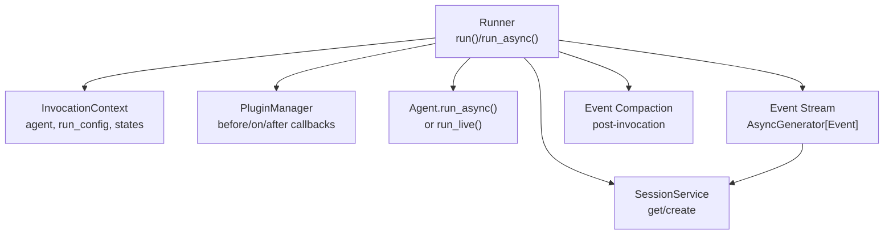
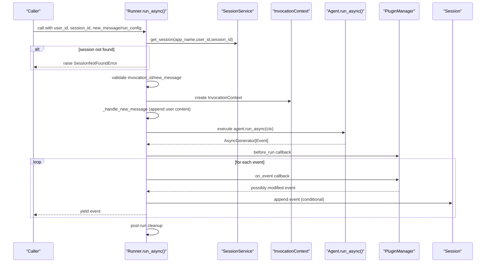
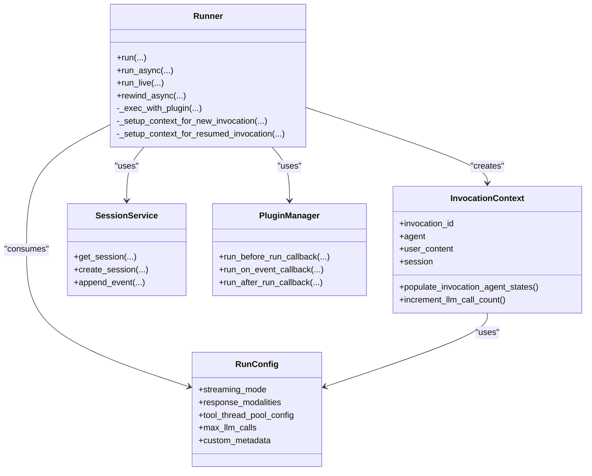

# Core Execution Methods

<cite>
**Referenced Files in This Document**
- [runners.py](file://src/google/adk/runners.py)
- [run_config.py](file://src/google/adk/agents/run_config.py)
- [invocation_context.py](file://src/google/adk/agents/invocation_context.py)
- [session_not_found_error.py](file://src/google/adk/errors/session_not_found_error.py)
- [in_memory_session_service.py](file://src/google/adk/sessions/in_memory_session_service.py)
- [sqlite_session_service.py](file://src/google/adk/sessions/sqlite_session_service.py)
- [adk_web_server.py](file://src/google/adk/cli/adk_web_server.py)
- [test_progressive_sse_streaming.py](file://tests/unittests/flows/llm_flows/test_progressive_sse_streaming.py)
- [test_resume_invocation.py](file://tests/unittests/runners/test_resume_invocation.py)
- [test_runner.py](file://tests/integration/utils/test_runner.py)
</cite>

## Table of Contents
1. [Introduction](#introduction)
2. [Project Structure](#project-structure)
3. [Core Components](#core-components)
4. [Architecture Overview](#architecture-overview)
5. [Detailed Component Analysis](#detailed-component-analysis)
6. [Dependency Analysis](#dependency-analysis)
7. [Performance Considerations](#performance-considerations)
8. [Troubleshooting Guide](#troubleshooting-guide)
9. [Conclusion](#conclusion)

## Introduction
This document explains the core execution methods that drive agent invocations: run() and run_async(). It covers parameter handling, threading and async models, invocation context setup, session lifecycle, event generation, and practical usage patterns. It also compares synchronous and asynchronous execution modes, highlighting when to use each and their trade-offs.

## Project Structure
The core execution logic resides in the Runner class, which orchestrates:
- Session retrieval or creation
- Invocation context initialization
- Agent execution via plugin-wrapped async generators
- Event compaction and session persistence
- Live and rewind utilities

**Diagram sources**
- [runners.py](file://src/google/adk/runners.py#L428-L622)
- [invocation_context.py](file://src/google/adk/agents/invocation_context.py#L100-L220)

**Section sources**
- [runners.py](file://src/google/adk/runners.py#L112-L219)

## Core Components
- Runner: Central orchestrator for agent execution, session management, and event emission.
- InvocationContext: Captures per-invocation state, agent selection, and configuration.
- RunConfig: Controls streaming, modalities, tool thread pools, and limits.
- SessionService: Manages session persistence and retrieval.
- PluginManager: Hooks for pre/post execution and event transformation.

Key responsibilities:
- Parameter handling: user_id, session_id, new_message, run_config, invocation_id, state_delta.
- Threading model: run() uses a background thread to host an asyncio event loop.
- Async model: run_async() is a pure async generator with plugin hooks and event compaction.
- Invocation context: setup for new/resumed invocations, agent selection, and state restoration.
- Event pipeline: generation, buffering for live mode, plugin transformations, and session persistence.

**Section sources**
- [runners.py](file://src/google/adk/runners.py#L428-L622)
- [run_config.py](file://src/google/adk/agents/run_config.py#L182-L352)
- [invocation_context.py](file://src/google/adk/agents/invocation_context.py#L100-L220)

## Architecture Overview
The execution path for run_async():

**Diagram sources**
- [runners.py](file://src/google/adk/runners.py#L493-L622)
- [runners.py](file://src/google/adk/runners.py#L778-L910)
- [runners.py](file://src/google/adk/runners.py#L1268-L1304)

## Detailed Component Analysis

### run() — Synchronous Wrapper
Purpose:
- Provides a synchronous interface convenient for local testing and simple scripts.
- Internally delegates to run_async() using a background thread and an asyncio event loop.

Threading model:
- Creates a background thread running asyncio.run().
- Bridges async events into a Python Generator via a queue synchronized with thread lifecycle.
- Ensures the generator yields events in order and waits for completion before returning.

Key behaviors:
- Wraps run_async() with Aclosing to guarantee resource cleanup.
- Uses a queue to transport events from the background thread to the caller’s thread.
- Joins the background thread upon completion.

Practical notes:
- Prefer run_async() for production and concurrent workloads.
- run() is not suitable for multi-threaded production environments due to thread-backed execution.

**Section sources**
- [runners.py](file://src/google/adk/runners.py#L428-L492)

### run_async() — Asynchronous Core
Purpose:
- Main entrypoint for agent execution with full async control.
- Supports resumable invocations, live mode, and event compaction.

Parameters:
- user_id: Identifies the user’s conversation state.
- session_id: Identifies the session to use or create.
- invocation_id: Optional; resumes a prior invocation by ID.
- new_message: Optional; appends a user message before execution.
- state_delta: Optional; applies state changes to the session.
- run_config: Optional; controls streaming, modalities, and limits.

Execution flow:
- Validates presence of either new_message or resumable context.
- Retrieves or creates the session; auto-creates if configured.
- Sets up InvocationContext (new or resumed), selects the active agent, and executes the agent asynchronously.
- Streams events through PluginManager hooks, conditionally persists them, and yields them to the caller.
- After all agent events are yielded, performs event compaction if configured.

Error handling:
- Raises ValueError for missing session and invalid invocation conditions.
- Raises SessionNotFoundError when session not found and auto-create is disabled.

**Section sources**
- [runners.py](file://src/google/adk/runners.py#L493-L622)
- [session_not_found_error.py](file://src/google/adk/errors/session_not_found_error.py#L18-L25)

### Invocation Context Setup
Two paths:
- New invocation: Creates InvocationContext, handles the new user message (including state deltas), and selects the agent to run.
- Resumed invocation: Recovers prior user message if needed, restores agent states, and continues execution.

Agent selection:
- Chooses the most appropriate agent based on recent events and transfer capabilities.

State management:
- Tracks agent states and end-of-agent flags for resumability.
- Enforces LLM call limits via InvocationContext.

**Section sources**
- [runners.py](file://src/google/adk/runners.py#L1268-L1304)
- [runners.py](file://src/google/adk/runners.py#L1306-L1367)
- [invocation_context.py](file://src/google/adk/agents/invocation_context.py#L283-L326)

### Session Lifecycle Management
- Retrieval: Runner._get_or_create_session fetches an existing session or creates a new one if auto_create_session is enabled.
- Persistence: Events are appended to the session according to rules (live mode exceptions, partial vs non-partial events).
- Rewind: Utility to revert session state and artifacts to a prior invocation.

Session services:
- InMemorySessionService: For testing and development.
- SQLiteSessionService: For persistent storage.

**Section sources**
- [runners.py](file://src/google/adk/runners.py#L395-L427)
- [runners.py](file://src/google/adk/runners.py#L623-L758)
- [in_memory_session_service.py](file://src/google/adk/sessions/in_memory_session_service.py#L37-L80)
- [sqlite_session_service.py](file://src/google/adk/sessions/sqlite_session_service.py#L230-L246)

### Event Generation Pipeline
- Agent emits events via an async generator.
- PluginManager hooks:
  - before_run: Optional early exit with synthetic content.
  - on_event: Allows transforming or suppressing events.
  - after_run: Cleanup tasks.
- Conditional persistence:
  - Live mode excludes inline audio blobs from session storage.
  - Non-partial transcription events are persisted; partial ones are buffered until completion.
- Custom metadata merging: run_config custom_metadata is applied to events.

**Section sources**
- [runners.py](file://src/google/adk/runners.py#L778-L910)
- [runners.py](file://src/google/adk/runners.py#L911-L980)

### Parameter Handling
- user_id, session_id: Identify the session; session is retrieved or created.
- new_message: Optional user content; if absent, invocation_id must be provided for resumable apps.
- run_config: Controls streaming, modalities, tool thread pools, and LLM call limits.
- invocation_id: Optional; resumes a prior invocation.
- state_delta: Optional; applies state changes to the session before execution.

Validation:
- Requires either new_message or resumable context.
- Auto-create behavior depends on auto_create_session setting.

**Section sources**
- [runners.py](file://src/google/adk/runners.py#L493-L526)
- [runners.py](file://src/google/adk/runners.py#L395-L427)
- [run_config.py](file://src/google/adk/agents/run_config.py#L182-L352)

### Practical Usage Patterns
- Basic synchronous run:
  - Use run() for simple scripts or local testing.
  - Example pattern: iterate over events, collect results, and handle errors.

- Production async run:
  - Use run_async() for concurrency, streaming, and fine-grained control.
  - Example pattern: wrap with Aclosing, stream events, apply filters, and persist state deltas.

- Streaming modes:
  - RunConfig.streaming_mode controls SSE/BIDI behavior.
  - SSE enables progressive text and function-call streaming; deduplication strategies are needed.

- Live mode:
  - Use run_live() for audio/video streaming scenarios with specialized buffering and persistence rules.

- Resuming invocations:
  - Provide invocation_id to continue a prior run; ensure app is resumable.

**Section sources**
- [runners.py](file://src/google/adk/runners.py#L428-L492)
- [runners.py](file://src/google/adk/runners.py#L493-L622)
- [runners.py](file://src/google/adk/runners.py#L981-L1088)
- [run_config.py](file://src/google/adk/agents/run_config.py#L52-L179)
- [test_progressive_sse_streaming.py](file://tests/unittests/flows/llm_flows/test_progressive_sse_streaming.py#L169-L178)
- [test_resume_invocation.py](file://tests/unittests/runners/test_resume_invocation.py#L109-L125)

### Differences Between Sync and Async Modes
- Threading:
  - run(): Background thread hosts asyncio; bridges events via queue.
  - run_async(): Pure async; caller manages event loop and concurrency.
- Concurrency:
  - run_async(): Multiple concurrent runs are straightforward.
  - run(): Not suited for multi-threaded production; use run_async() instead.
- Control:
  - run_async(): Full control over session lifecycle, event filtering, and resource cleanup.
  - run(): Simpler but less flexible for complex deployments.

When to use:
- Use run_async() for production, web servers, and concurrent workloads.
- Use run() for quick local tests and demos.

**Section sources**
- [runners.py](file://src/google/adk/runners.py#L428-L492)
- [runners.py](file://src/google/adk/runners.py#L493-L622)

### Error Handling Strategies
Common errors:
- SessionNotFoundError: When session does not exist and auto-create is disabled.
- ValueError: Invalid invocation conditions (missing new_message or invocation_id).
- LlmCallsLimitExceededError: When max_llm_calls is exceeded.

Mitigation:
- Ensure auto_create_session is enabled when appropriate.
- Validate run_config.max_llm_calls and adjust as needed.
- Use resumable apps and invocation_id for continuity.

**Section sources**
- [session_not_found_error.py](file://src/google/adk/errors/session_not_found_error.py#L18-L25)
- [runners.py](file://src/google/adk/runners.py#L541-L555)
- [invocation_context.py](file://src/google/adk/agents/invocation_context.py#L47-L98)

## Dependency Analysis
High-level dependencies among core components:

**Diagram sources**
- [runners.py](file://src/google/adk/runners.py#L112-L219)
- [runners.py](file://src/google/adk/runners.py#L778-L910)
- [invocation_context.py](file://src/google/adk/agents/invocation_context.py#L100-L220)
- [run_config.py](file://src/google/adk/agents/run_config.py#L182-L352)

**Section sources**
- [runners.py](file://src/google/adk/runners.py#L112-L219)
- [invocation_context.py](file://src/google/adk/agents/invocation_context.py#L100-L220)
- [run_config.py](file://src/google/adk/agents/run_config.py#L182-L352)

## Performance Considerations
- Streaming modes:
  - SSE enables progressive delivery but may produce duplicates; choose display strategy carefully.
- Tool thread pools:
  - Use RunConfig.tool_thread_pool_config to offload blocking I/O and keep the event loop responsive.
- LLM call limits:
  - Configure max_llm_calls to prevent runaway conversations.
- Event compaction:
  - Post-invocation compaction reduces session size; enable when appropriate.
- Live mode:
  - Specialized buffering avoids storing large inline audio blobs; use file_data references for artifacts.

[No sources needed since this section provides general guidance]

## Troubleshooting Guide
Common issues and resolutions:
- Session not found:
  - Enable auto_create_session or pre-create sessions.
  - Verify app_name alignment to avoid mismatches.
- Missing new_message and invocation_id:
  - Provide at least one; resumable apps require invocation_id when no new_message is supplied.
- Excessive LLM calls:
  - Adjust max_llm_calls in RunConfig.
- Live mode audio not persisted:
  - Understand that inline audio blobs are excluded; use file_data references instead.
- Rewind failures:
  - Ensure artifact_service is configured and invocation_id exists.

**Section sources**
- [runners.py](file://src/google/adk/runners.py#L384-L427)
- [runners.py](file://src/google/adk/runners.py#L541-L555)
- [runners.py](file://src/google/adk/runners.py#L623-L758)
- [run_config.py](file://src/google/adk/agents/run_config.py#L309-L351)

## Conclusion
The Runner’s run() and run_async() methods provide complementary execution models. Use run_async() for production-grade, concurrent, and configurable execution with robust event handling and session lifecycle management. Use run() sparingly for local testing. Proper parameter handling, invocation context setup, and plugin hooks ensure predictable behavior across diverse deployment scenarios.