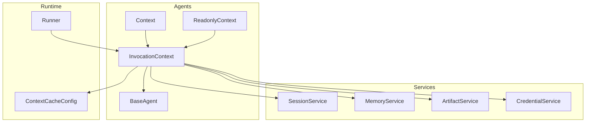
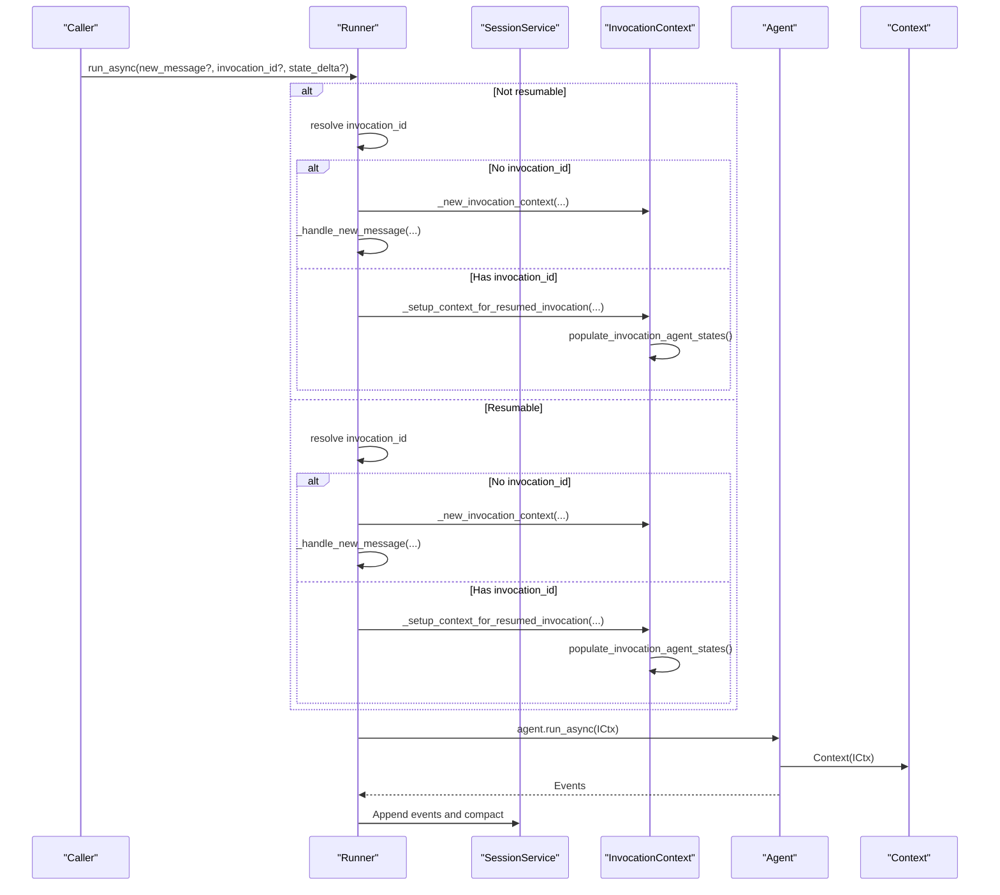
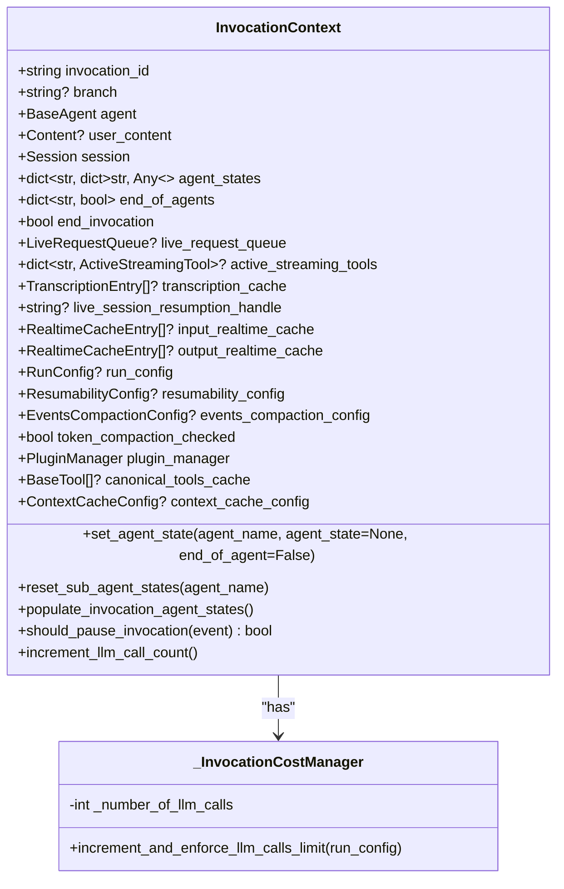
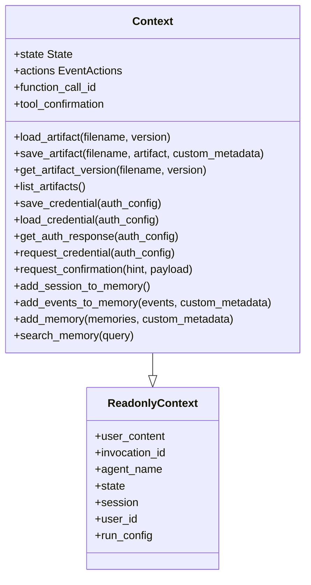
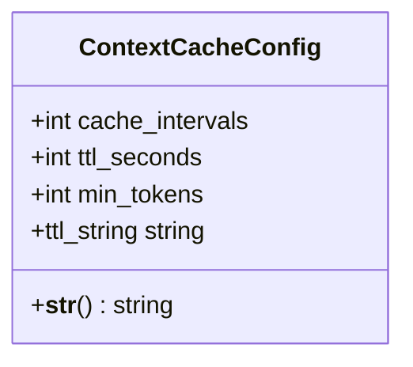
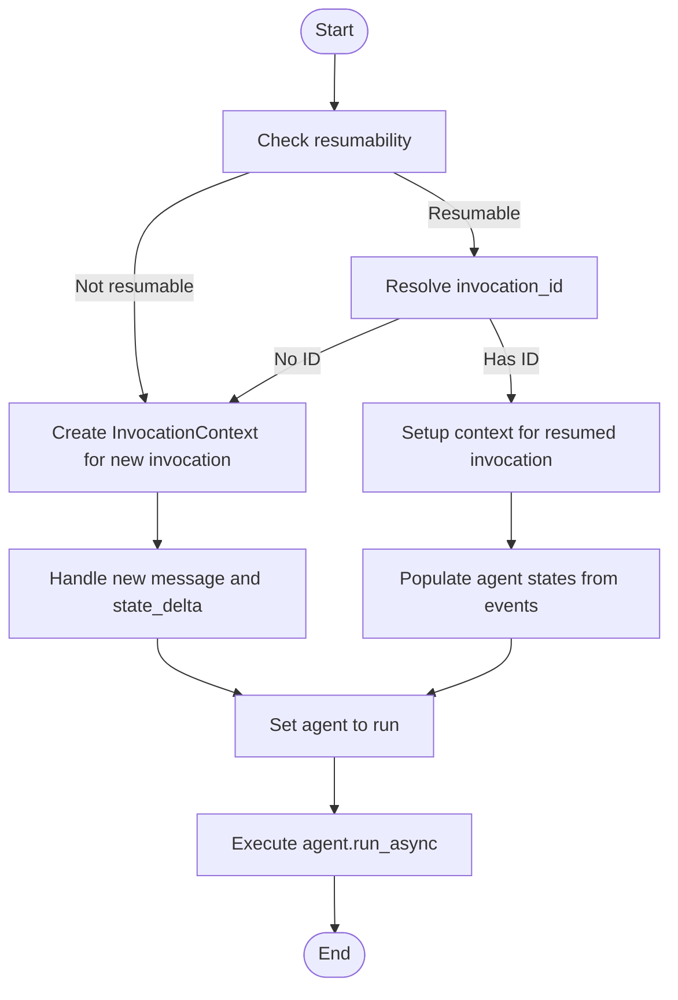
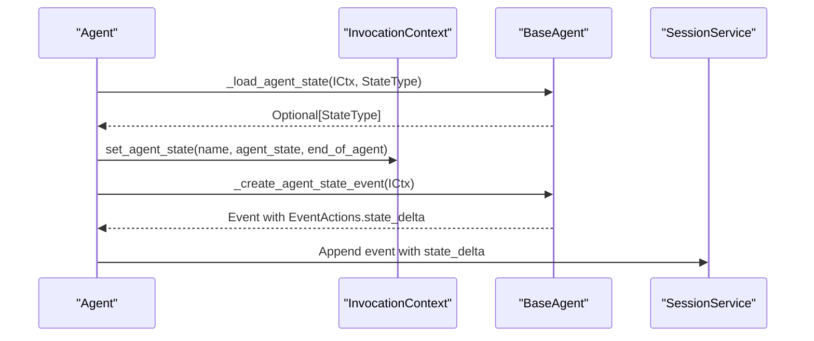
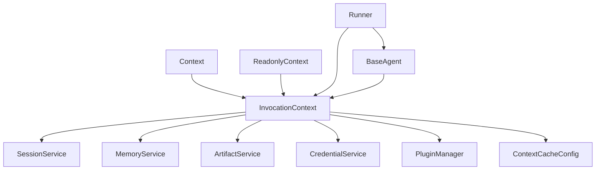

# Invocation Context

<cite>
**Referenced Files in This Document**
- [invocation_context.py](file://src/google/adk/agents/invocation_context.py)
- [context.py](file://src/google/adk/agents/context.py)
- [readonly_context.py](file://src/google/adk/agents/readonly_context.py)
- [context_cache_config.py](file://src/google/adk/agents/context_cache_config.py)
- [runners.py](file://src/google/adk/runners.py)
- [base_agent.py](file://src/google/adk/agents/base_agent.py)
- [test_invocation_context.py](file://tests/unittests/agents/test_invocation_context.py)
- [test_resumable_llm_agent.py](file://tests/unittests/agents/test_resumable_llm_agent.py)
- [callback_context.py](file://src/google/adk/agents/callback_context.py)
</cite>

## Table of Contents
1. [Introduction](#introduction)
2. [Project Structure](#project-structure)
3. [Core Components](#core-components)
4. [Architecture Overview](#architecture-overview)
5. [Detailed Component Analysis](#detailed-component-analysis)
6. [Dependency Analysis](#dependency-analysis)
7. [Performance Considerations](#performance-considerations)
8. [Troubleshooting Guide](#troubleshooting-guide)
9. [Conclusion](#conclusion)

## Introduction
This document explains the Invocation Context system that manages agent execution state in the Agent Development Kit. It covers how InvocationContext represents a single agent invocation, how contexts are created for new and resumed invocations, how state_delta is applied, and how context influences agent behavior. It also documents the context cache configuration and its impact on performance, the lifecycle of contexts, usage patterns, and debugging approaches.

## Project Structure
The Invocation Context system spans several modules:
- InvocationContext: The central runtime state container for a single agent invocation
- Context and ReadonlyContext: Typed interfaces for agent callbacks and tools to access session state and request resources
- ContextCacheConfig: Configuration for context caching across agents
- Runners: Orchestrator that creates and manages InvocationContext instances
- BaseAgent: Provides agent state loading and event creation helpers used by InvocationContext

**Diagram sources**
- [invocation_context.py](file://src/google/adk/agents/invocation_context.py#L100-L418)
- [context.py](file://src/google/adk/agents/context.py#L41-L413)
- [readonly_context.py](file://src/google/adk/agents/readonly_context.py#L30-L72)
- [context_cache_config.py](file://src/google/adk/agents/context_cache_config.py#L25-L86)
- [runners.py](file://src/google/adk/runners.py#L540-L739)
- [base_agent.py](file://src/google/adk/agents/base_agent.py#L86-L200)

**Section sources**
- [invocation_context.py](file://src/google/adk/agents/invocation_context.py#L100-L418)
- [context.py](file://src/google/adk/agents/context.py#L41-L413)
- [readonly_context.py](file://src/google/adk/agents/readonly_context.py#L30-L72)
- [context_cache_config.py](file://src/google/adk/agents/context_cache_config.py#L25-L86)
- [runners.py](file://src/google/adk/runners.py#L540-L739)
- [base_agent.py](file://src/google/adk/agents/base_agent.py#L86-L200)

## Core Components
- InvocationContext: Holds invocation-scoped state, services, and configuration. It tracks agent states, end-of-agent flags, live streaming tools, real-time audio caches, resumability, and plugin manager. It exposes helpers to populate agent states from session events and to decide whether to pause/resume invocations.
- Context and ReadonlyContext: Provide typed access to invocation context for callbacks and tools. Context adds mutation capabilities (state delta, artifacts, credentials, confirmations) while ReadonlyContext exposes read-only session state and identifiers.
- ContextCacheConfig: Controls context caching behavior across agents, including cache intervals, TTL, and minimum token thresholds.
- Runner: Creates InvocationContext for new and resumed invocations, applies state_delta, and orchestrates agent execution.

**Section sources**
- [invocation_context.py](file://src/google/adk/agents/invocation_context.py#L100-L418)
- [context.py](file://src/google/adk/agents/context.py#L41-L413)
- [readonly_context.py](file://src/google/adk/agents/readonly_context.py#L30-L72)
- [context_cache_config.py](file://src/google/adk/agents/context_cache_config.py#L25-L86)
- [runners.py](file://src/google/adk/runners.py#L540-L739)

## Architecture Overview
The Invocation Context system integrates tightly with the agent runtime and session management:

**Diagram sources**
- [runners.py](file://src/google/adk/runners.py#L540-L739)
- [runners.py](file://src/google/adk/runners.py#L1306-L1367)
- [runners.py](file://src/google/adk/runners.py#L1388-L1439)
- [runners.py](file://src/google/adk/runners.py#L1467-L1499)
- [invocation_context.py](file://src/google/adk/agents/invocation_context.py#L283-L313)

## Detailed Component Analysis

### InvocationContext
InvocationContext encapsulates everything needed to run a single agent invocation:
- Identity and scope: invocation_id, branch, agent, user_content, session
- Agent state management: agent_states, end_of_agents
- Execution controls: end_invocation, live_request_queue, active_streaming_tools
- Real-time buffers: transcription_cache, input/output realtime caches
- Configuration: run_config, resumability_config, events_compaction_config, context_cache_config
- Services: session_service, memory_service, artifact_service, credential_service, plugin_manager
- Cost tracking: internal _invocation_cost_manager for LLM call limits
- Helper methods:
  - set_agent_state(agent_name, agent_state=None, end_of_agent=False): updates agent state and end flags
  - reset_sub_agent_states(agent_name): resets states for all sub-agents recursively
  - populate_invocation_agent_states(): restores agent states from session events for resumable apps
  - should_pause_invocation(event): decides whether to pause on long-running tool calls
  - _get_events(current_invocation=False, current_branch=False): filters session events by invocation/branch
  - increment_llm_call_count(): increments and enforces max_llm_calls limit

**Diagram sources**
- [invocation_context.py](file://src/google/adk/agents/invocation_context.py#L100-L418)

**Section sources**
- [invocation_context.py](file://src/google/adk/agents/invocation_context.py#L100-L418)

### Context and ReadonlyContext
Context extends ReadonlyContext and adds mutation capabilities:
- ReadonlyContext exposes read-only session state, user_content, invocation_id, agent_name, session, user_id, and run_config
- Context adds:
  - State delta: State wrapper around session.state with delta support
  - Actions: EventActions builder for state_delta, artifact_delta, and tool/auth requests
  - Artifact operations: load/save/list/get artifact versions
  - Credential operations: save/load credentials and auth response retrieval
  - Memory operations: add_session_to_memory, add_events_to_memory, add_memory, search_memory
  - Tool and auth request helpers: request_confirmation, request_credential

**Diagram sources**
- [readonly_context.py](file://src/google/adk/agents/readonly_context.py#L30-L72)
- [context.py](file://src/google/adk/agents/context.py#L41-L413)

**Section sources**
- [readonly_context.py](file://src/google/adk/agents/readonly_context.py#L30-L72)
- [context.py](file://src/google/adk/agents/context.py#L41-L413)
- [callback_context.py](file://src/google/adk/agents/callback_context.py#L17-L23)

### ContextCacheConfig
ContextCacheConfig controls context caching behavior across agents:
- cache_intervals: maximum invocations to reuse cached context before refresh
- ttl_seconds: time-to-live for cache entries
- min_tokens: minimum estimated tokens to enable caching
- ttl_string and __str__: convenience for logging and display

**Diagram sources**
- [context_cache_config.py](file://src/google/adk/agents/context_cache_config.py#L25-L86)

**Section sources**
- [context_cache_config.py](file://src/google/adk/agents/context_cache_config.py#L25-L86)

### Context Lifecycle and Creation
New invocation creation:
- Runner determines resumability and resolves invocation_id
- For new invocations, Runner constructs InvocationContext via _new_invocation_context, passing services, configs, and identifiers
- If a new_message is provided, Runner handles it via _handle_new_message, applying plugin callbacks and optionally state_delta
- Runner sets the agent to run and executes agent.run_async with the InvocationContext

Resumed invocation creation:
- Runner resolves invocation_id and validates session events
- If a new_message is provided, Runner handles it similarly to new invocation
- Runner populates agent states from session events via InvocationContext.populate_invocation_agent_states
- Runner selects the appropriate agent to resume based on end_of_agents

**Diagram sources**
- [runners.py](file://src/google/adk/runners.py#L540-L739)
- [runners.py](file://src/google/adk/runners.py#L1306-L1367)
- [runners.py](file://src/google/adk/runners.py#L1388-L1439)
- [runners.py](file://src/google/adk/runners.py#L1467-L1499)
- [invocation_context.py](file://src/google/adk/agents/invocation_context.py#L283-L313)

**Section sources**
- [runners.py](file://src/google/adk/runners.py#L540-L739)
- [runners.py](file://src/google/adk/runners.py#L1306-L1367)
- [runners.py](file://src/google/adk/runners.py#L1388-L1439)
- [runners.py](file://src/google/adk/runners.py#L1467-L1499)
- [invocation_context.py](file://src/google/adk/agents/invocation_context.py#L283-L313)

### State Management and Agent Execution Influence
- Agent state loading: BaseAgent._load_agent_state reads agent state from InvocationContext.agent_states
- Agent state events: BaseAgent._create_agent_state_event builds EventActions with agent_state for persistence
- InvocationContext.set_agent_state updates agent_states and end_of_agents, allowing agents to re-run or finalize
- InvocationContext.reset_sub_agent_states ensures sub-agent states are reset when needed
- InvocationContext.populate_invocation_agent_states restores agent states from session events for resumable apps

**Diagram sources**
- [base_agent.py](file://src/google/adk/agents/base_agent.py#L168-L200)
- [invocation_context.py](file://src/google/adk/agents/invocation_context.py#L232-L282)

**Section sources**
- [base_agent.py](file://src/google/adk/agents/base_agent.py#L168-L200)
- [invocation_context.py](file://src/google/adk/agents/invocation_context.py#L232-L282)

### Context Cache Configuration and Performance
- ContextCacheConfig enables context caching across agents when present on the app
- cache_intervals controls how often cached context is reused before refresh
- ttl_seconds defines cache expiration
- min_tokens avoids caching small requests where overhead outweighs benefits
- Runner passes context_cache_config to InvocationContext during creation

Performance implications:
- Reduces repeated computation and token usage by reusing cached context
- Improves latency for repeated or similar requests
- Requires careful tuning of cache_intervals and min_tokens to balance freshness and cost

**Section sources**
- [context_cache_config.py](file://src/google/adk/agents/context_cache_config.py#L25-L86)
- [runners.py](file://src/google/adk/runners.py#L1422-L1439)

### Examples of Usage Patterns
- New invocation with state_delta:
  - Runner resolves invocation_id (None) and creates InvocationContext
  - Runner handles new message and applies state_delta
  - Agent executes and produces events
- Resumed invocation:
  - Runner resolves existing invocation_id
  - Runner sets up context and populates agent states from events
  - Agent resumes execution from the last known state
- Agent state transitions:
  - Agent sets end_of_agent to True to finalize
  - Agent clears state to allow re-execution
  - Sub-agent states reset when needed

**Section sources**
- [runners.py](file://src/google/adk/runners.py#L540-L739)
- [runners.py](file://src/google/adk/runners.py#L1306-L1367)
- [invocation_context.py](file://src/google/adk/agents/invocation_context.py#L232-L282)
- [test_resumable_llm_agent.py](file://tests/unittests/agents/test_resumable_llm_agent.py#L306-L343)

## Dependency Analysis
Key dependencies and relationships:
- InvocationContext depends on services (session, memory, artifact, credential), plugin manager, and configuration objects
- Context and ReadonlyContext wrap InvocationContext to provide controlled access
- Runner composes InvocationContext and orchestrates agent execution
- BaseAgent interacts with InvocationContext for state management

**Diagram sources**
- [invocation_context.py](file://src/google/adk/agents/invocation_context.py#L146-L212)
- [context.py](file://src/google/adk/agents/context.py#L41-L109)
- [readonly_context.py](file://src/google/adk/agents/readonly_context.py#L30-L72)
- [runners.py](file://src/google/adk/runners.py#L1388-L1439)
- [base_agent.py](file://src/google/adk/agents/base_agent.py#L86-L200)

**Section sources**
- [invocation_context.py](file://src/google/adk/agents/invocation_context.py#L146-L212)
- [context.py](file://src/google/adk/agents/context.py#L41-L109)
- [readonly_context.py](file://src/google/adk/agents/readonly_context.py#L30-L72)
- [runners.py](file://src/google/adk/runners.py#L1388-L1439)
- [base_agent.py](file://src/google/adk/agents/base_agent.py#L86-L200)

## Performance Considerations
- Context caching reduces repeated LLM calls and improves latency when tuned appropriately
- Use cache_intervals and min_tokens to balance freshness and cost
- Consider TTL to prevent stale context from accumulating
- Monitor LLM call counts via InvocationContext.increment_llm_call_count and LlmCallsLimitExceededError

[No sources needed since this section provides general guidance]

## Troubleshooting Guide
Common issues and resolutions:
- LLM call limit exceeded: Ensure max_llm_calls is configured appropriately; InvocationContext raises LlmCallsLimitExceededError when exceeded
- Resumable app not pausing: Verify resumability_config.is_resumable and that events include long_running_tool_ids
- State not persisting: Confirm state_delta is applied and events include state_delta; check BaseAgent state persistence
- Session has no events to resume: Ensure session contains prior events; otherwise, create a new invocation
- Rewind not restoring state: Use rewind_async to compute state_delta and artifact_delta; verify app prefixes are handled correctly

**Section sources**
- [invocation_context.py](file://src/google/adk/agents/invocation_context.py#L47-L98)
- [runners.py](file://src/google/adk/runners.py#L623-L702)
- [test_invocation_context.py](file://tests/unittests/agents/test_invocation_context.py#L216-L248)

## Conclusion
InvocationContext is the cornerstone of agent execution state management in the Agent Development Kit. It coordinates agent execution, manages agent states, integrates with services, and supports resumability and context caching. Proper configuration of ContextCacheConfig and careful handling of state_delta enable efficient, reliable, and debuggable agent interactions.