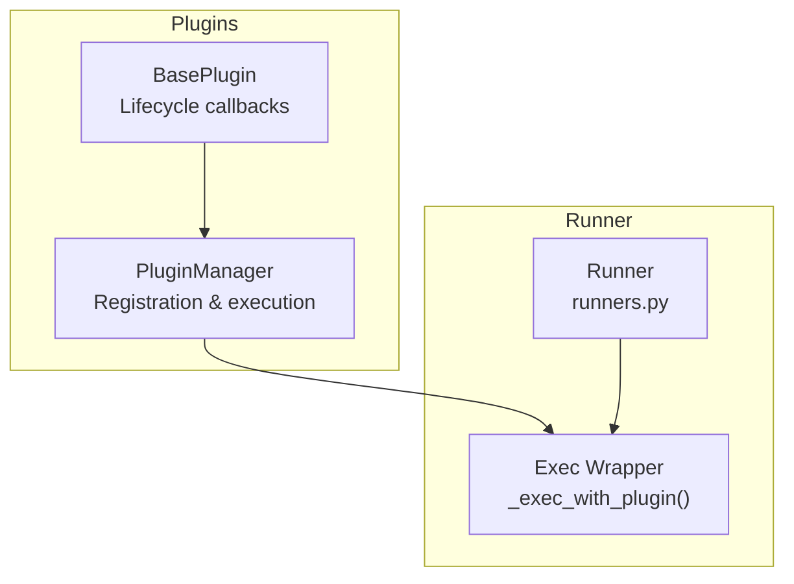
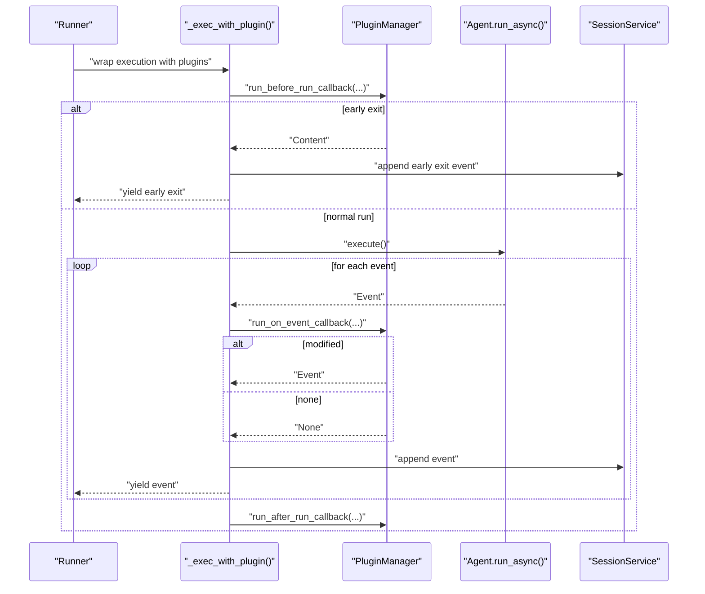
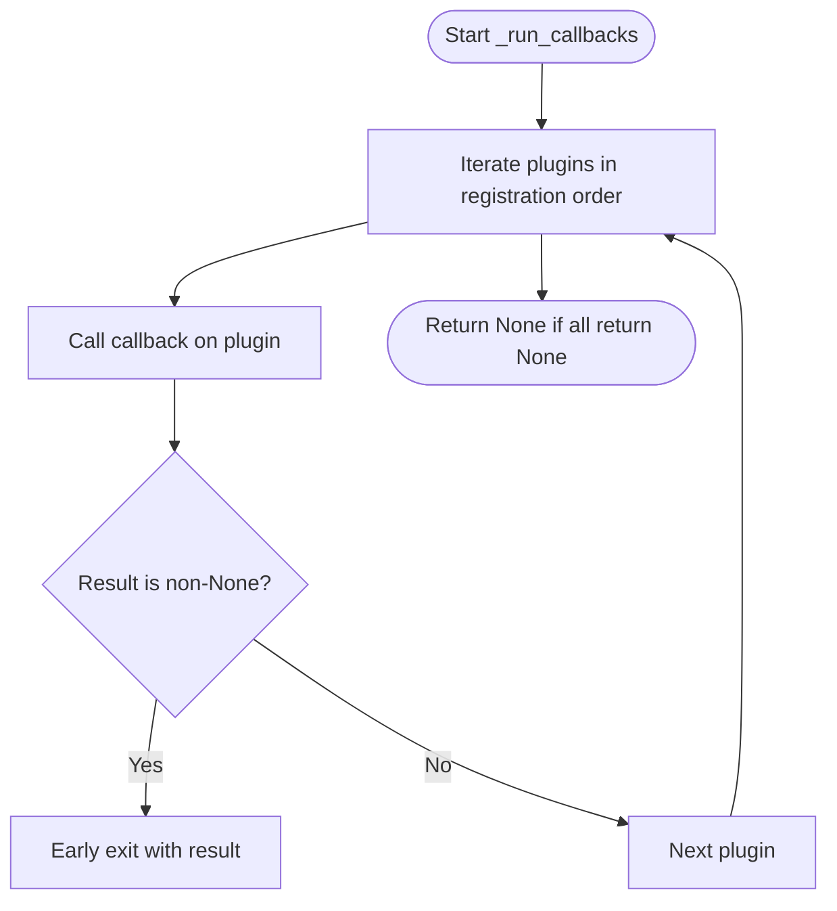
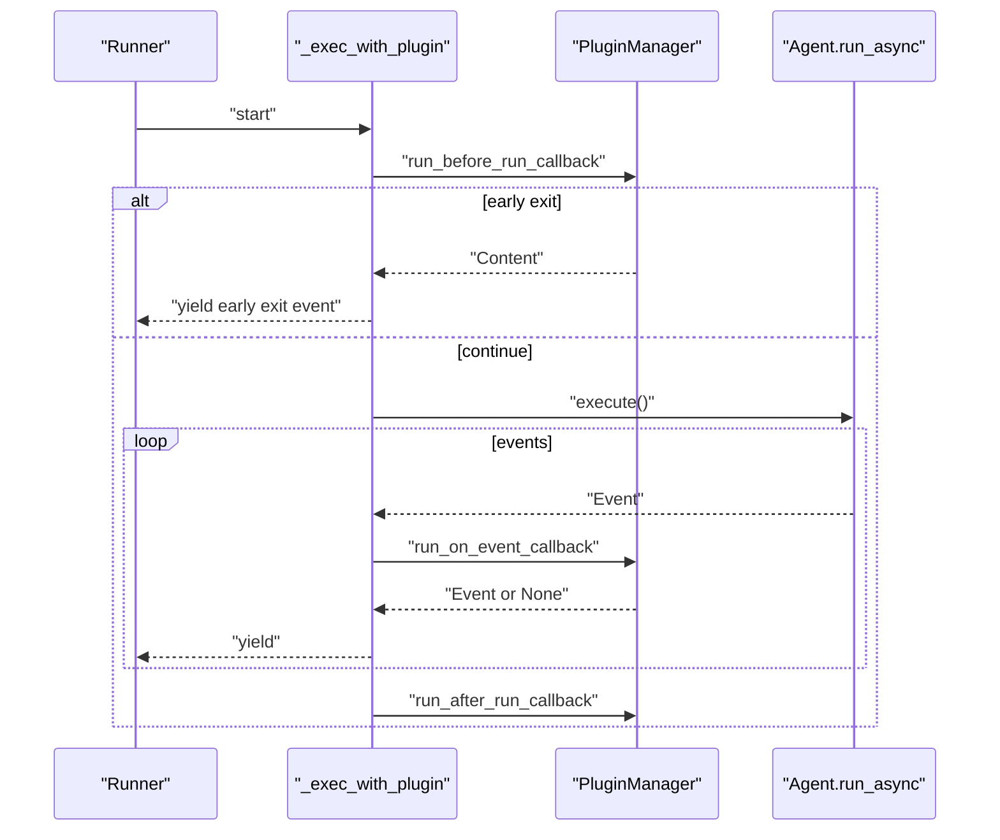
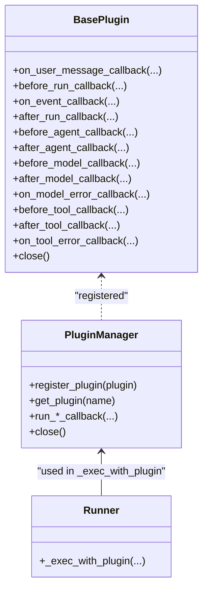

# Plugin Integration

<cite>
**Referenced Files in This Document**
- [base_plugin.py](file://src/google/adk/plugins/base_plugin.py)
- [plugin_manager.py](file://src/google/adk/plugins/plugin_manager.py)
- [runners.py](file://src/google/adk/runners.py)
- [__init__.py](file://src/google/adk/plugins/__init__.py)
- [count_plugin.py](file://contributing/samples/plugin_basic/count_plugin.py)
- [main.py](file://contributing/samples/plugin_basic/main.py)
- [debug_logging_plugin.py](file://src/google/adk/plugins/debug_logging_plugin.py)
- [logging_plugin.py](file://src/google/adk/plugins/logging_plugin.py)
- [reflect_retry_tool_plugin.py](file://src/google/adk/plugins/reflect_retry_tool_plugin.py)
</cite>

## Table of Contents
1. [Introduction](#introduction)
2. [Project Structure](#project-structure)
3. [Core Components](#core-components)
4. [Architecture Overview](#architecture-overview)
5. [Detailed Component Analysis](#detailed-component-analysis)
6. [Dependency Analysis](#dependency-analysis)
7. [Performance Considerations](#performance-considerations)
8. [Troubleshooting Guide](#troubleshooting-guide)
9. [Conclusion](#conclusion)
10. [Appendices](#appendices)

## Introduction
This document explains the plugin integration system in the ADK Python codebase. It focuses on how plugins wrap agent execution via the _exec_with_plugin() method, the plugin lifecycle (before_run, on_event, after_run), and the plugin manager’s orchestration. It also covers the callback system, plugin configuration and registration, error handling, common plugin patterns, and debugging techniques.

## Project Structure
The plugin system spans three main areas:
- Plugin contracts and lifecycle: base_plugin.py defines the BasePlugin interface and all supported callbacks.
- Plugin manager: plugin_manager.py coordinates plugin registration, ordering, and execution with an early-exit strategy.
- Runner integration: runners.py wires plugins into agent execution via _exec_with_plugin() and invokes plugin callbacks around agent runs and event emission.

**Diagram sources**
- [base_plugin.py](file://src/google/adk/plugins/base_plugin.py#L41-L373)
- [plugin_manager.py](file://src/google/adk/plugins/plugin_manager.py#L60-L348)
- [runners.py](file://src/google/adk/runners.py#L778-L977)

**Section sources**
- [base_plugin.py](file://src/google/adk/plugins/base_plugin.py#L41-L373)
- [plugin_manager.py](file://src/google/adk/plugins/plugin_manager.py#L60-L348)
- [runners.py](file://src/google/adk/runners.py#L778-L977)

## Core Components
- BasePlugin: Defines the plugin contract with lifecycle hooks for user messages, agent execution, tool calls, model requests/responses, and errors. Plugins can short-circuit execution by returning a non-None value from a callback.
- PluginManager: Manages plugin registration, enforces unique names, executes callbacks in registration order, supports early exits, and aggregates exceptions into a single RuntimeError with chained causes.
- Runner integration: The Runner constructs a PluginManager and wraps execution with _exec_with_plugin(), invoking before_run, on_event, and after_run callbacks around agent runs.

Key responsibilities:
- BasePlugin: Provide targeted interception points for logging, validation, transformation, and error recovery.
- PluginManager: Ensure deterministic ordering, early exits, and robust error propagation.
- Runner: Coordinate plugin lifecycle around agent invocations and event emission.

**Section sources**
- [base_plugin.py](file://src/google/adk/plugins/base_plugin.py#L41-L373)
- [plugin_manager.py](file://src/google/adk/plugins/plugin_manager.py#L60-L348)
- [runners.py](file://src/google/adk/runners.py#L778-L977)

## Architecture Overview
The plugin lifecycle integrates with the Runner’s execution flow:

**Diagram sources**
- [runners.py](file://src/google/adk/runners.py#L778-L977)
- [plugin_manager.py](file://src/google/adk/plugins/plugin_manager.py#L117-L144)

## Detailed Component Analysis

### BasePlugin: Lifecycle and Callback Contracts
BasePlugin defines the plugin contract with the following categories:
- Invocation-level: on_user_message_callback, before_run_callback, on_event_callback, after_run_callback.
- Agent-level: before_agent_callback, after_agent_callback.
- Tool-level: before_tool_callback, after_tool_callback, on_tool_error_callback.
- Model-level: before_model_callback, after_model_callback, on_model_error_callback.
- Resource cleanup: close.

Behavioral guarantees:
- Execution order follows registration order.
- Plugins can short-circuit by returning a non-None value; remaining plugins and agent callbacks are skipped.
- Modifications to inputs propagate to subsequent callbacks (e.g., changing tool args in before_tool_callback affects downstream plugins and agent callbacks).

Common use cases:
- Logging and auditing (e.g., LoggingPlugin, DebugLoggingPlugin).
- Metrics and observability.
- Validation and transformation of inputs/outputs.
- Error recovery and retry (e.g., ReflectAndRetryToolPlugin).

**Section sources**
- [base_plugin.py](file://src/google/adk/plugins/base_plugin.py#L41-L373)

### PluginManager: Registration, Ordering, and Early Exit
Responsibilities:
- Register plugins with unique names.
- Execute a named callback across all registered plugins in order.
- Early exit on first non-None return.
- Wrap plugin callback exceptions into a single RuntimeError with chained causes.
- Close plugins concurrently with timeouts and aggregate failures.

Execution semantics:
- _run_callbacks iterates plugins and calls the requested callback. If any returns non-None, that value is returned immediately.
- Exceptions are caught, logged, and re-raised as RuntimeError with the original cause preserved.

Resource management:
- close() calls each plugin.close() with a timeout, logging timeouts/cancellations and collecting other errors into a single RuntimeError.

**Diagram sources**
- [plugin_manager.py](file://src/google/adk/plugins/plugin_manager.py#L260-L307)

**Section sources**
- [plugin_manager.py](file://src/google/adk/plugins/plugin_manager.py#L60-L348)

### Runner Integration: _exec_with_plugin()
The Runner wraps agent execution with plugins via _exec_with_plugin():
- before_run: Invokes run_before_run_callback. If a plugin returns Content, the Runner emits an early exit event and yields it.
- Normal run: Executes agent.run_async() and streams events.
- on_event: For each event, invokes run_on_event_callback. If a plugin returns an Event, the Runner yields the modified event; otherwise, it yields the original.
- after_run: Invokes run_after_run_callback for cleanup.

**Diagram sources**
- [runners.py](file://src/google/adk/runners.py#L778-L977)
- [plugin_manager.py](file://src/google/adk/plugins/plugin_manager.py#L117-L144)

**Section sources**
- [runners.py](file://src/google/adk/runners.py#L778-L977)

### Plugin Configuration and Registration
- Via Runner constructor: Pass a list of BasePlugin instances to the Runner. The Runner constructs a PluginManager with these plugins.
- Via App: The recommended approach is to pass an App instance to the Runner. The App holds root_agent, plugins, and related configs. The Runner extracts plugins from the App.

Best practices:
- Choose the App-based approach for modern usage.
- Ensure plugin names are unique; PluginManager enforces this.
- Keep plugin logic idempotent and side-effect free where possible.
- Use before_run for global setup and after_run for cleanup.

**Section sources**
- [runners.py](file://src/google/adk/runners.py#L150-L219)
- [__init__.py](file://src/google/adk/plugins/__init__.py#L15-L27)

### Common Plugin Patterns
- Counting invocations: A simple plugin increments counters in before_agent_callback and before_model_callback.
- Debug logging: Captures user messages, events, LLM requests/responses, tool calls, and session state snapshots to a YAML file.
- Console logging: Emits readable logs for each lifecycle stage to the console.
- Self-healing tool retries: Intercepts tool errors and provides reflection guidance with retry limits and scopes.

Examples:
- Counting plugin: [count_plugin.py](file://contributing/samples/plugin_basic/count_plugin.py#L21-L44)
- Debug logging plugin: [debug_logging_plugin.py](file://src/google/adk/plugins/debug_logging_plugin.py#L67-L573)
- Console logging plugin: [logging_plugin.py](file://src/google/adk/plugins/logging_plugin.py#L37-L324)
- Reflect-and-retry plugin: [reflect_retry_tool_plugin.py](file://src/google/adk/plugins/reflect_retry_tool_plugin.py#L55-L383)

**Section sources**
- [count_plugin.py](file://contributing/samples/plugin_basic/count_plugin.py#L21-L44)
- [debug_logging_plugin.py](file://src/google/adk/plugins/debug_logging_plugin.py#L67-L573)
- [logging_plugin.py](file://src/google/adk/plugins/logging_plugin.py#L37-L324)
- [reflect_retry_tool_plugin.py](file://src/google/adk/plugins/reflect_retry_tool_plugin.py#L55-L383)

### Error Handling in Plugins
- Early exit: Returning a non-None value from a callback short-circuits remaining plugins and agent callbacks.
- Exception propagation: PluginManager wraps plugin callback exceptions into a RuntimeError with chained causes for better diagnostics.
- Plugin close failures: PluginManager collects close() errors and raises a single RuntimeError summarizing failures.

Recommendations:
- Validate inputs in before_* callbacks and return early with transformed inputs when appropriate.
- In on_model_error_callback and on_tool_error_callback, return a substitute response to avoid propagating errors.
- Use close() for releasing resources and handle timeouts carefully.

**Section sources**
- [plugin_manager.py](file://src/google/adk/plugins/plugin_manager.py#L260-L307)
- [plugin_manager.py](file://src/google/adk/plugins/plugin_manager.py#L309-L348)

### Debugging Techniques for Plugins
- Enable LoggingPlugin or DebugLoggingPlugin to capture detailed traces.
- Use DebugLoggingPlugin to write a YAML snapshot per invocation for offline inspection.
- For runtime errors, rely on PluginManager’s chained exceptions to preserve stack traces.
- Verify plugin ordering by ensuring the intended plugin is registered first if early-exit behavior is required.

**Section sources**
- [logging_plugin.py](file://src/google/adk/plugins/logging_plugin.py#L37-L324)
- [debug_logging_plugin.py](file://src/google/adk/plugins/debug_logging_plugin.py#L67-L573)
- [plugin_manager.py](file://src/google/adk/plugins/plugin_manager.py#L260-L307)

## Dependency Analysis
The plugin system depends on:
- Agents: BaseAgent, CallbackContext, InvocationContext.
- Events: Event, EventActions.
- Models: LlmRequest, LlmResponse.
- Tools: BaseTool, ToolContext.

**Diagram sources**
- [base_plugin.py](file://src/google/adk/plugins/base_plugin.py#L41-L373)
- [plugin_manager.py](file://src/google/adk/plugins/plugin_manager.py#L60-L348)
- [runners.py](file://src/google/adk/runners.py#L778-L977)

**Section sources**
- [base_plugin.py](file://src/google/adk/plugins/base_plugin.py#L41-L373)
- [plugin_manager.py](file://src/google/adk/plugins/plugin_manager.py#L60-L348)
- [runners.py](file://src/google/adk/runners.py#L778-L977)

## Performance Considerations
- Early exit reduces overhead by preventing unnecessary plugin and agent callbacks.
- Avoid heavy synchronous work in callbacks; prefer async I/O and minimal serialization.
- Use DebugLoggingPlugin judiciously in production due to file I/O overhead.
- Keep plugin lists small and focused to minimize iteration cost.

## Troubleshooting Guide
- Duplicate plugin names: Registration fails with a ValueError. Ensure unique plugin names.
- Unhandled exceptions in callbacks: PluginManager raises a RuntimeError with chained cause. Inspect the original exception for root cause.
- Plugin close failures: PluginManager aggregates close() errors into a single RuntimeError. Investigate timeouts and resource leaks.
- Unexpected early exits: Verify the order of plugins and whether a prior plugin returned a non-None value.

**Section sources**
- [plugin_manager.py](file://src/google/adk/plugins/plugin_manager.py#L92-L104)
- [plugin_manager.py](file://src/google/adk/plugins/plugin_manager.py#L260-L307)
- [plugin_manager.py](file://src/google/adk/plugins/plugin_manager.py#L309-L348)

## Conclusion
The plugin integration system provides a powerful, extensible mechanism to intercept and modify agent execution at key lifecycle points. BasePlugin defines a comprehensive callback surface, PluginManager enforces ordering and early exits, and Runner integrates plugins seamlessly around agent runs and event emission. Following the best practices and patterns outlined here enables robust, maintainable plugin development.

## Appendices

### Quick Start: Using a Plugin
- Define a plugin by subclassing BasePlugin and implementing desired callbacks.
- Instantiate plugins and pass them to Runner (preferably via App).
- Observe effects via LoggingPlugin or DebugLoggingPlugin during development.

**Section sources**
- [count_plugin.py](file://contributing/samples/plugin_basic/count_plugin.py#L21-L44)
- [main.py](file://contributing/samples/plugin_basic/main.py#L40-L66)